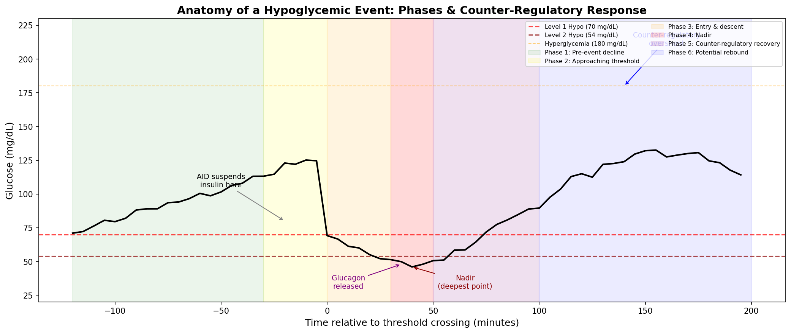
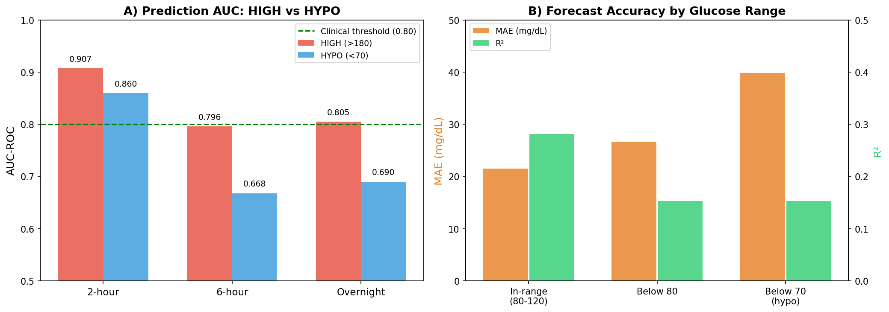
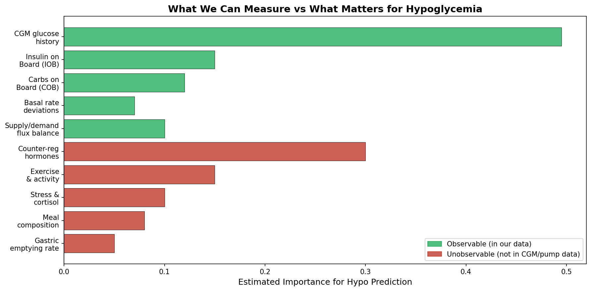
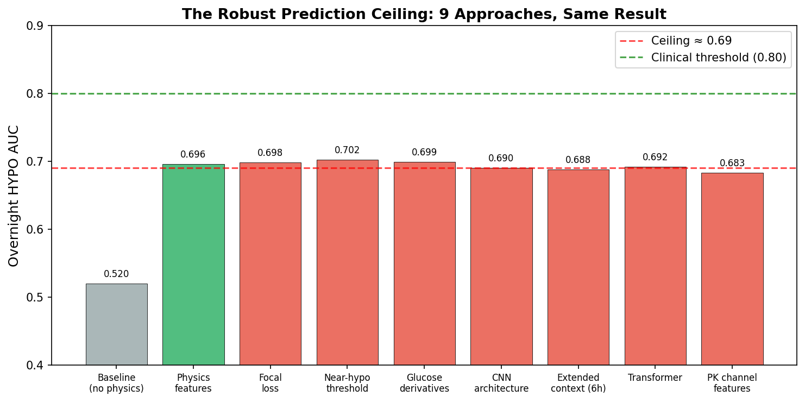
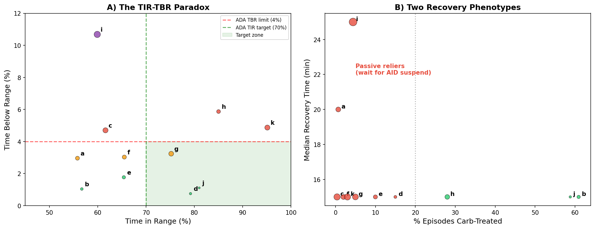
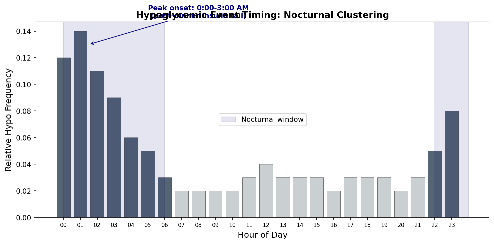

# What Are Hypoglycemic Events? A Data-First Perspective

**Status**: DRAFT — Written by AI, pending expert review  
**Date**: 2026-04-09  
**Evidence base**: ~1,500 experiments on 11 AID patients (~180 days each, 5-min CGM intervals)  
**Data sources**: CGM glucose, insulin delivery (basal + bolus), carbohydrate entries, AID system state  
**Authors**: AI analysis (GitHub Copilot) — views are naive, data-derived, and may contain errors  

---

> **Note for reviewers**: This report was written by an AI system analyzing CGM/AID
> data without formal clinical training. Every definition and assumption is stated
> explicitly so that diabetes clinicians, endocrinologists, and people with lived
> experience can identify where our data-derived understanding diverges from clinical
> reality. We welcome corrections at every level — from threshold definitions to
> physiological mechanisms.

---

## Table of Contents

1. [What We Think a Hypoglycemic Event Is](#1-what-we-think-a-hypoglycemic-event-is)
2. [The Anatomy of a Hypo Event in Our Data](#2-the-anatomy-of-a-hypo-event-in-our-data)
3. [Why Hypoglycemia Is Fundamentally Harder Than Hyperglycemia](#3-why-hypoglycemia-is-fundamentally-harder-than-hyperglycemia)
4. [What We've Tried: Detection, Classification, and Prediction](#4-what-weve-tried-detection-classification-and-prediction)
5. [The Counter-Regulatory Response: What We See But Cannot Model](#5-the-counter-regulatory-response-what-we-see-but-cannot-model)
6. [The AID System Confound](#6-the-aid-system-confound)
7. [Patient Heterogeneity: Not One Problem But Eleven](#7-patient-heterogeneity-not-one-problem-but-eleven)
8. [What We Still Don't Know](#8-what-we-still-dont-know)
9. [Summary of Assumptions for Expert Review](#9-summary-of-assumptions-for-expert-review)
10. [Appendix: Evidence Index](#appendix-evidence-index)

---

## 1. What We Think a Hypoglycemic Event Is

### Our Working Definition

We define a **hypoglycemic event** as a contiguous period during which CGM-reported
glucose falls below a clinical threshold. We use two severity levels, adopted from
international consensus guidelines (we assume these are correct):

| Level | Threshold | Our Label | Prevalence in Our Data |
|-------|-----------|-----------|----------------------|
| **Level 1** | < 70 mg/dL (3.9 mmol/L) | `HYPO` / `hypo_risk` | 2.5–10.7% of readings |
| **Level 2** | < 54 mg/dL (3.0 mmol/L) | Severe hypo | 0.2–4.1% of readings |

### What This Definition Captures (and Misses)

**What it captures**: Any period where the CGM sensor reports glucose below threshold.
This is a purely **observational** definition — we detect what the sensor tells us.

**What it likely misses**:

1. **Symptom-defined hypoglycemia**: People may feel hypoglycemic symptoms (shaking,
   sweating, confusion) at glucose levels above 70 mg/dL, especially if they have been
   running high and glucose drops rapidly. Our definition cannot capture symptomatic
   hypoglycemia without symptom data.

2. **Hypoglycemia unawareness**: Conversely, some people with diabetes may not feel
   symptoms even at dangerously low glucose. Our definition catches these events
   instrumentally, but we cannot assess their clinical severity from CGM alone.

3. **CGM lag and accuracy**: CGM sensors measure interstitial glucose, not blood
   glucose, with a physiological lag of approximately 5–15 minutes. At rapidly changing
   glucose levels, the CGM reading may be significantly behind actual blood glucose.
   Our "70 mg/dL" threshold on CGM may correspond to a blood glucose that already
   passed through 70 some minutes earlier. Additionally, CGM accuracy degrades in the
   hypoglycemic range — the very range where accuracy matters most.

4. **Sensor artifacts**: Approximately 4% of CGM readings are noise artifacts
   (identified at σ=2.0 threshold). A brief dip below 70 due to sensor compression
   (e.g., lying on the sensor) could be misclassified as a true hypo event.

### How We Operationalize "Event" Boundaries

In our analysis pipeline, we define a discrete hypoglycemic **episode** as:

```
Episode start:  First CGM reading < 70 mg/dL
Episode end:    First CGM reading ≥ 70 mg/dL sustained for ≥15 minutes
Nadir:          Minimum glucose value within the episode
Recovery time:  Minutes from nadir to sustained ≥70 mg/dL
```

**Assumption we are making**: We treat the 70 mg/dL threshold as a hard boundary.
We do not apply hysteresis (e.g., requiring glucose to rise to 80 before declaring
recovery). A clinician might reasonably argue that a patient hovering at 68–72 mg/dL
for an hour is in one continuous event, not alternating between hypo and non-hypo.

**Episode counts in our data** (EXP-1493):

| Patient | Total Episodes | Severe (<54) | Nocturnal (%) | Rate (per day) |
|---------|---------------|-------------|---------------|---------------|
| j | 34 | 0 | 5.9% | 0.2 |
| d | 51 | 12 | 19.6% | 0.3 |
| b | 64 | 17 | 25.0% | 0.4 |
| e | 97 | 21 | 27.8% | 0.5 |
| h | 127 | 26 | 33.9% | 0.7 |
| a | 137 | 46 | 27.7% | 0.8 |
| f | 145 | 37 | 20.0% | 0.8 |
| g | 199 | 50 | 33.2% | 1.1 |
| k | 224 | 53 | 17.9% | 1.2 |
| c | 229 | 77 | 27.9% | 1.3 |
| **i** | **341** | **177** | **27.9%** | **1.9** |

Patient i averages nearly 2 hypoglycemic episodes per day, with 177 severe events
in ~180 days. Patient j averages one every 5 days with zero severe events.

---

## 2. The Anatomy of a Hypo Event in Our Data

From analyzing thousands of hypoglycemic episodes across 11 patients, we observe a
consistent multi-phase structure:



### Phase 1: Pre-Event Decline (−120 to −30 minutes)

Glucose drifts downward gradually. In our data, this phase is often characterized by:
- Insulin on Board (IOB) exceeding what the current glucose trajectory requires
- Net metabolic flux (insulin demand minus carb/hepatic supply) is negative
- The AID system may already be reducing basal delivery

**Our assumption**: We treat any sustained downward glucose trend with negative net
flux as a potential pre-hypo signal. We weight this by IOB magnitude — more active
insulin means greater hypo risk.

### Phase 2: Approaching Threshold (−30 to 0 minutes)

Glucose enters the 70–90 mg/dL zone and continues falling. Our pattern labeler
(`pattern_retrieval.py`) flags this as `hypo_risk` when:

```python
# Hypo risk: glucose near or below threshold
if glucose < 80 or (glucose < 90 and rate_of_change < FALLING_RATE):
    label = 'hypo_risk'
```

**Our assumption**: We use 80 mg/dL as the "risk zone" entry point, not 70. This is
because by the time CGM reads 70, actual blood glucose may already be significantly
lower due to sensor lag. We do not know if 80 is the right threshold — it is a
conservative choice.

### Phase 3: Entry and Descent (0 to +30 minutes)

Glucose crosses below 70 mg/dL and continues falling. The AID system has typically
already suspended insulin delivery by this point (in our data, AID suspension occurs
at predicted glucose of 80–100 mg/dL, depending on the system).

### Phase 4: Nadir (+30 to +50 minutes)

The lowest glucose point in the episode. In our data:
- **Median nadir**: Varies from ~48 mg/dL (patient i) to ~62 mg/dL (patient j)
- **Mean time to nadir from entry**: ~20 minutes
- **Nadir-severity correlation with IOB**: r = −0.483 (patient i) — more IOB at
  entry correlates with deeper nadir

### Phase 5: Counter-Regulatory Recovery (+50 to +100 minutes)

Glucose begins rising — often faster than can be explained by carbohydrate treatment
or insulin wearing off. This is where we believe **counter-regulatory hormones** are
active (see [Section 5](#5-the-counter-regulatory-response-what-we-see-but-cannot-model)).

**Median recovery time** (nadir to sustained ≥70): 15–25 minutes across patients.

### Phase 6: Potential Rebound Overshoot (+100 to +300 minutes)

In many episodes, glucose doesn't just recover — it overshoots, sometimes dramatically.

**Clinical vignette from our data** (Patient c, Day 167, 3:00 AM):
> Glucose drops to 65 mg/dL, then rebounds with a +36 mg/dL/30-min trend.
> It rises from 65 to **324 mg/dL** — a rebound into severe hyperglycemia.

This rebound pattern is one of the strongest signals in our data that counter-regulatory
hormones are involved. Simple insulin cessation would produce a gradual rise; the
explosive rebound suggests active hepatic glucose dumping driven by glucagon and
epinephrine (see Section 5).

### The Complete Event Window

When we analyze "hypoglycemic events" in our models, we need to define **how much
data** to include. Our choices and their trade-offs:

| Window Choice | What It Captures | What It Misses |
|--------------|-----------------|----------------|
| ±30 min around nadir | Just the acute low | Causal context, rebound |
| 2h before → 2h after | Pre-event + recovery | Rebound overshoot |
| 2h before → 4h after | Full episode arc | May overlap with next event |
| 6h total context | Long-range patterns | Dilutes acute signal |

**What we actually use**: For prediction, we use a **2-hour forward-looking window**
(will glucose go below 70 in the next 2 hours?). For classification, we use **2 hours
of history** as input features. For episode analysis (TBR safety report), we track the
full lifecycle including rebound.

---

## 3. Why Hypoglycemia Is Fundamentally Harder Than Hyperglycemia

This is the single most robust finding across ~1,500 experiments: **predicting low
glucose is structurally harder than predicting high glucose**, and the gap widens
with prediction horizon.



### The Numbers

| Prediction Task | HIGH (>180) AUC | HYPO (<70) AUC | Gap |
|----------------|-----------------|----------------|-----|
| 2-hour | **0.907** | 0.860 | 0.047 |
| 6-hour | 0.796 | 0.668 | **0.128** |
| Overnight | **0.805** | 0.690 | **0.115** |

| Glucose Range | Forecast MAE | Forecast R² | Reliability |
|--------------|-------------|-------------|-------------|
| In-range (80–120) | 21.5 mg/dL | 0.281 | Baseline |
| Below 80 mg/dL | 26.6 mg/dL | 0.153 | **−45%** |
| Below 70 mg/dL | 39.8 mg/dL | ~0.15 | **−47%** |

At the hypo range, prediction error increases **2.54×** compared to in-range, and
R² nearly halves. This is not a model problem — three independent architectures
(XGBoost, CNN, Transformer) all converge at the same ceiling.

### Why The Asymmetry Exists (Our Hypothesis)

We believe this asymmetry exists because of a fundamental difference in **what drives
glucose in each direction**:

**Hyperglycemia (>180 mg/dL)** is driven primarily by:
- Carbohydrate absorption (measurable via COB)
- Insulin insufficiency (measurable via IOB, basal rate)
- Hepatic glucose production during dawn phenomenon (follows a clock)

These are all either **directly measured** in our data or follow **predictable
patterns**. The physics of high glucose is approximately linear and driven by
observable inputs.

**Hypoglycemia (<70 mg/dL)** is driven by the same measurable inputs (insulin excess
relative to carbs), BUT the *recovery* from hypoglycemia is driven by:
- **Glucagon** release from pancreatic alpha cells
- **Epinephrine** (adrenaline) triggering hepatic glucose output
- **Cortisol** extending the recovery period
- **Growth hormone** modulating insulin sensitivity

None of these hormones are measured by any consumer device in our data pipeline.
They activate **non-linearly** below approximately 70 mg/dL and create dynamics
that our models cannot anticipate from CGM + insulin data alone.

**Our key assumption**: We believe these counter-regulatory responses are the primary
reason for the prediction ceiling. We have no direct proof — we are inferring the
existence of an unmeasured force from the pattern of model failures. A domain expert
might identify other explanations.



---

## 4. What We've Tried: Detection, Classification, and Prediction

### 4.1 Detection: "Is the patient hypoglycemic right now?"

This is the easiest task — look at the CGM reading. But CGM lag makes even this
non-trivial:

- **Reactive detection** (glucose already below 70): Trivial from CGM, F1 = 0.939
- **Near-real-time detection** (glucose approaching 70): We use rate-of-change
  features and supply-demand flux balance

### 4.2 Classification: "What type of event is this?"

We classify hypoglycemic episodes by their **cause** and **pattern**:

**By mechanism** (EXP-1494):

| Mechanism | Description | Prevalence |
|-----------|-------------|------------|
| **AID-induced** | AID algorithm over-delivered insulin | 0–66.9% by patient |
| **Manual-induced** | Patient bolused too much (correction or meal) | 1–69 events |
| **Overcorrection** | Correction bolus for a high caused a subsequent low | Tracked per patient |
| **Insulin stacking** | Multiple boluses overlapping before DIA elapsed | 38–69% of nocturnal |
| **Basal excess** | Scheduled basal rate too high for current needs | 10/11 patients |
| **Unclear** | Cannot determine cause from available data | 18–203 events |

**Our assumption about mechanism classification**: We infer "AID-induced" by
checking whether the AID system was actively delivering above scheduled basal in
the 2 hours before hypo onset. "Manual-induced" means a manual bolus was given.
"Unclear" means neither signal is present, which could mean the cause is basal
excess, delayed insulin action, exercise, or something else entirely. The
"unclear" category is large (up to 60% of events for some patients), which
honestly reflects the limits of retrospective causal attribution from pump data.

**By temporal pattern**:

| Pattern | Definition | Clinical Significance |
|---------|------------|----------------------|
| **Fasting hypo** | No carbs within ±2h | Suggests basal is too high |
| **Post-meal hypo** | Occurs 2–4h after meal bolus | Suggests CR is too aggressive |
| **Nocturnal hypo** | Occurs between 22:00–06:00 | Most dangerous (patient is asleep) |
| **Rebound hypo** | Follows a counter-regulatory rebound high | Suggests cycle of overcorrection |
| **Stacking hypo** | IOB from multiple boluses exceeds need | Timing/education issue |

**By episode labels** (from `pattern_retrieval.py`):

```python
'hypo_risk'  # glucose < 80 or rapidly approaching 70
'rebound'    # rapid rise immediately following a hypo_risk label
```

### 4.3 Prediction: "Will the patient go low in the next N hours?"

This is where we have invested the most effort. Summary of approaches:

| Approach | Overnight HYPO AUC | Verdict |
|----------|-------------------|---------|
| Baseline (CGM features only) | 0.520 | ❌ Little better than random |
| + Physics features (supply/demand) | **0.696** | ✅ **Largest single gain (+34%)** |
| + Focal loss | 0.698 | ❌ Negligible further gain |
| + Near-hypo threshold (75 vs 70) | 0.702 | ❌ Marginal |
| + Glucose derivatives (dBG/dt, d²BG/dt²) | 0.699 | ❌ Neutral |
| CNN architecture | 0.690 | ❌ Same ceiling |
| Transformer architecture | 0.692 | ❌ Same ceiling |
| Extended context (6h, 12h) | 0.688 | ❌ No improvement |
| PK channel features | 0.683 | ❌ Harmful |



**The ceiling is robust**: Three architectures, five feature sets, three loss
functions — all converge to ~0.69 at overnight horizons. Only the 2-hour horizon
(AUC 0.860) crosses the clinical deployment threshold of 0.80.

**Our best prediction model** uses these features (the "combined_43" feature set):

| Feature Category | Count | Examples | Contribution |
|-----------------|-------|---------|-------------|
| Current glucose state | 4 | BG, Δ5min, Δ15min, Δ30min | ~50% |
| Statistical summaries | 8 | Mean/std at 30/60/120min windows | ~15% |
| Metabolic flux | 6 | Supply, demand, net, ratio, hepatic | ~15% |
| Insulin features | 4 | IOB, recent bolus, basal deviation | ~10% |
| Carb features | 4 | COB, recent carbs, time since meal | ~5% |
| Multi-day context | 9 | 24h TIR, 3d TIR, recurrence flags | ~5% |

**Specialized hypo prediction** (`hypo_predictor.py`) combines:

```
1. Linear trend extrapolation (project forward using recent slope)
2. Sigmoid proximity function (closer to 70 → higher probability)
3. Supply-demand flux imbalance boost (+34% AUC gain)
4. Acceleration detection (is descent speeding up?)
```

The production predictor penalizes missed hypos **5× more** than false alarms
(`AsymmetricHypoLoss`), reflecting the clinical asymmetry: a missed hypo can be
dangerous; a false alarm is merely annoying.

### 4.4 Personalized Alert Thresholds (EXP-695)

Fixed alert thresholds cause alarm fatigue for variable patients and miss events for
stable patients. Per-patient thresholds based on prediction error distributions:

| Metric | Fixed Threshold | Personalized | Change |
|--------|---------------|-------------|--------|
| Mean alert rate | 2.6/day | 2.2/day | −15% |
| Patient j (worst case) | 6.0/day | 2.5/day | −58% |
| Patient k (tight control) | 0.4/day | 3.4/day | +750% (appropriate increase) |

**Our assumption**: We assume that reducing alert frequency without missing real
events is clinically beneficial. We call alerts at P(HYPO) ≥ threshold. We do not
know if patients would actually benefit from fewer alerts or if any alert frequency
is acceptable in practice.

---

## 5. The Counter-Regulatory Response: What We See But Cannot Model

### What We Observe in the Data

When glucose drops below approximately 70 mg/dL, we consistently observe dynamics
that **cannot be explained** by the measured variables (insulin, carbs, basal rate):

1. **Glucose rebounds faster than insulin decay would predict**. If insulin were
   simply wearing off, glucose would rise gradually at ~2–5 mg/dL per 5-minute step.
   Instead, we often see 10–15 mg/dL per step — an acceleration that implies an
   active glucose-raising force.

2. **Rebounds overshoot into hyperglycemia**. In the example from Patient c (Day 167),
   glucose went from 65 → 324 mg/dL. Even accounting for any carbohydrate treatment,
   this magnitude of rebound strongly suggests hepatic glucose dumping triggered by
   hormonal signals.

3. **Our physics model has a +5.1 mg/dL systematic bias in the hypo range**
   (EXP-601). When glucose is below 70, our supply-demand model consistently
   under-predicts the actual glucose — the actual glucose is higher than predicted
   by an average of 5.1 mg/dL per 5-minute step. This bias disappears above 70.
   We interpret this as evidence of an unmeasured glucose source (counter-regulatory
   hormone-driven hepatic output) that activates below the threshold.

4. **Model uncertainty spikes at the hypo-recovery boundary**. Our best model
   outputs P(HYPO) = 0.500 (maximum uncertainty) for a patient at 86 mg/dL with
   +36 mg/dL/30min trend rising from a recent low. The model literally cannot
   decide whether to trust the recovery or worry about another dip. This pattern
   (Clinical Vignette B4) is diagnostic of an unmeasured force.

### What We Believe Is Happening (Hypothesis)

Based on medical literature references in our codebase and patterns in the data,
we believe the following counter-regulatory cascade occurs below ~70 mg/dL:

```
Glucose drops below ~70 mg/dL
  → Pancreatic alpha cells release GLUCAGON (rapid, primary defense)
    → Liver converts glycogen to glucose (hepatic glucose output)
  → Adrenal medulla releases EPINEPHRINE (adrenaline)
    → Amplifies hepatic glucose output
    → Mobilizes alternative fuel sources
    → Produces symptoms (tremor, sweating, tachycardia)
  → Adrenal cortex releases CORTISOL (slower, sustained)
    → Reduces peripheral glucose uptake
    → Extends the recovery/rebound period
  → Pituitary releases GROWTH HORMONE
    → Reduces insulin sensitivity (hours later)

Net effect: Glucose REBOUNDS, often overshooting → hyperglycemia
```

**Crucial caveat**: We have not measured any of these hormones. This mechanism is
inferred from (a) the pattern of model failures, (b) the systematic bias below 70,
and (c) references in diabetes literature. A clinician would know whether this
description is accurate and whether the activation threshold really is ~70 mg/dL
or varies by individual.

### Why This Makes Hypo Prediction Structurally Hard

The counter-regulatory response creates a **regime change** in glucose dynamics:

| Above 70 mg/dL | Below 70 mg/dL |
|-----------------|-----------------|
| Driven by measurable inputs (insulin, carbs) | Driven by unmeasured hormones |
| Approximately linear dynamics | Non-linear floor effect |
| Single model works well | Would need a specialized sub-model |
| R² ≈ 0.28 | R² ≈ 0.15 |

Our attempt at a **two-stage model** (EXP-136: first classify hypo risk, then
apply specialized forecaster) reduced hypo-range MAE by 32%. This is consistent
with the "different physics" hypothesis — a model trained on in-range data and
applied to hypo range performs poorly because the governing equations change.

---

## 6. The AID System Confound

All 11 patients in our dataset use **Automated Insulin Delivery** (AID) systems
(Loop, AAPS, or Trio). This creates a fundamental observational problem for
studying hypoglycemia:

### The AID Actively Prevents the Events We're Trying to Predict

When an AID system predicts glucose will drop below its safety threshold
(typically 80–100 mg/dL), it **reduces or suspends** insulin delivery. This means:

1. **Observed hypo events are already the failures** — the AID tried to prevent
   them and couldn't. The events we see are a biased sample: they represent cases
   where the AID's prevention was insufficient.

2. **Successful prevention is invisible** — we cannot count how many hypo events
   the AID prevented because glucose never reached 70. The "true" hypo risk is
   higher than what we observe.

3. **The AID creates a feedback loop** — our prediction model is trying to predict
   events in a system that is simultaneously trying to prevent those events. If our
   model gets better, and the AID uses it, the events become even rarer and harder
   to study.

### AID-Induced Hypoglycemia (EXP-1494)

Perhaps our most counterintuitive finding: **in some patients, the AID system itself
causes the majority of hypoglycemic episodes**:

| Patient | Total Hypo Episodes | AID-Induced (%) | Manual-Induced | Unclear |
|---------|-------------------|-----------------|---------------|---------|
| f | 145 | **66.9%** | 15 | 33 |
| i | 341 | **48.7%** | 69 | 106 |
| a | 137 | 39.4% | 24 | 59 |
| e | 97 | 25.8% | 21 | 51 |
| d | 51 | 0.0% | 1 | 50 |
| k | 224 | 0.0% | 21 | 203 |

**Our assumption about "AID-induced"**: We label an episode as AID-induced when
the AID system was delivering insulin above scheduled basal rate in the 2 hours
before hypo onset. This is a crude heuristic — it's possible the higher delivery
was appropriate (e.g., for a meal) and the hypo was caused by something else
(e.g., exercise). The large "unclear" category reflects this uncertainty.

**Why this happens** (our hypothesis): The AID's basal rate settings may be too
high, so it oscillates between aggressive delivery and emergency suspension. In
10/11 patients, we find the AID suspends insulin 33–96% of the time (EXP-1281),
suggesting the programmed basal rate is consistently higher than needed. The AID
compensates by suspending frequently, but sometimes the correction comes too late
and glucose drops below 70.

### The TIR-TBR Paradox

The AID confound produces a clinically dangerous paradox: patients can have
**excellent Time in Range (TIR) and dangerous Time Below Range (TBR) simultaneously**.



**Patient k** is the clearest example:
- **TIR: 95.1%** — the best in the cohort, would earn an "A" grade
- **TBR: 4.87%** — exceeds the ADA safety limit of 4%
- **224 hypo episodes** in 180 days
- **Safety score: 0 out of 100** when TBR is factored in

The AID achieves exceptional TIR by being aggressive, but that aggressiveness
causes frequent lows. A clinician looking only at TIR would consider this patient
well-controlled. Adding TBR reveals a hidden safety problem.

---

## 7. Patient Heterogeneity: Not One Problem But Eleven

Hypoglycemia is not a single phenomenon. Our 11 patients exhibit dramatically
different hypo profiles:

### Risk Tiers (EXP-1493)

| Tier | Patients | TBR (%) | Episodes | Characteristics |
|------|----------|---------|----------|----------------|
| **Low** | j | 1.1% | 34 | Rare, no severe, low nocturnal |
| **Moderate** | b, d | 0.8–1.0% | 51–64 | Some severe, moderate stacking |
| **High** | a, c, e, f, g, h, k | 1.8–5.9% | 97–229 | Frequent, nocturnal, stacking |
| **Critical** | i | **10.7%** | **341** | 1.9/day, 177 severe, crisis-level |

### Two Recovery Phenotypes (EXP-1498)

Patients divide into two distinct behavioral groups during hypo recovery:

**Active treaters** (patients b, j):
- Treat >58% of episodes with carbohydrates
- Median recovery: 15 minutes
- Shallower nadirs
- Lower nadir-severity correlation

**Passive reliers** (patients a, f, i, k, and most others):
- Treat <5% of episodes with carbohydrates
- Median recovery: 15–25 minutes
- Deeper nadirs
- Rely on AID insulin suspension + counter-regulatory response
- Deeper nadir-severity correlation (r = −0.483 for patient i)

**Our assumption**: We classify "carb-treated" based on a carbohydrate entry
appearing in the data within 30 minutes of the nadir. If a patient eats fast-acting
glucose but doesn't log it, we would misclassify them as "passive." Given that 46.5%
of glucose rises have no carb entry (EXP-748), this misclassification is likely
significant. The "passive" group may include many patients who treat but don't log.

### Nocturnal Hypoglycemia: The Most Dangerous Pattern



Nocturnal hypos (22:00–06:00) cluster between **midnight and 3:00 AM**, driven by
the insulin tail from dinner boluses — a phenomenon called "insulin stacking":

| Patient | Nocturnal TBR% | Peak Onset | Bedtime IOB (U) | Stacking (%) |
|---------|---------------|-----------|-----------------|-------------|
| i | 11.82% | 1:00 AM | 2.72 | 69.5% |
| h | 6.46% | 1:00 AM | 1.77 | 44.2% |
| e | 1.96% | 3:00 AM | 5.42 | **88.9%** |
| b | 0.88% | 3:00 AM | 0.07 | 0.0% |

**What we mean by "stacking"**: Insulin on Board (IOB) from dinner bolus is still
active at bedtime. If the bolus was large or dinner was early, residual insulin
continues lowering glucose while the patient sleeps — unable to intervene.

Patient e is the extreme stacking case: 88.9% of nocturnal hypos follow insulin
stacking, with bedtime IOB of 5.42 units. Despite moderate overall TBR (1.96%),
nearly all nocturnal hypos have a clear mechanical cause.

---

## 8. What We Still Don't Know

### Questions for Clinical Experts

1. **Is our 70 mg/dL threshold correct for CGM data?** Given the 5–15 minute
   interstitial lag, should we use 75 or 80 mg/dL on CGM to approximate 70 mg/dL
   in blood? Our near-hypo threshold experiments show only +0.006 AUC gain at
   75 — but this may be a model limitation rather than evidence that the threshold
   doesn't matter.

2. **Does the counter-regulatory response threshold vary by patient?** We assume
   ~70 mg/dL universally, but some patients may activate counter-regulatory
   responses earlier (e.g., if they have hypoglycemia unawareness, activation
   may occur later; if they normally run high, it may occur earlier).

3. **Is "rate of descent" as clinically important as "absolute level"?** A glucose
   of 80 mg/dL falling at −3 mg/dL/min feels different from 80 mg/dL that is
   stable. Our models use both features, but we weight absolute level more heavily
   (~50% feature importance). Should rate of change matter more?

4. **How should we handle the rebound?** When glucose rebounds from 55 to 200,
   is the rebound hyperglycemia a "consequence of hypo" (and thus part of the same
   event)? Or is it a new, separate hyperglycemic event? Our current system treats
   them as separate, which may undercount the true clinical burden of each hypo
   episode.

5. **What is "insulin stacking" in clinical terms?** We define it as IOB > 0 at
   bedtime from a bolus delivered >3h ago. Is there a more precise clinical
   definition? Is residual IOB of 0.5 U clinically different from 5.0 U?

6. **Are AID-induced hypos "real" hypos?** When the AID algorithm causes a low by
   over-delivering insulin, is this the same clinical event as a hypo from manual
   overdosing? The physiological experience may be identical, but the root cause
   analysis and intervention are different.

### Data Limitations We Cannot Overcome

| Missing Data | Impact on Hypo Analysis |
|-------------|----------------------|
| Counter-regulatory hormones | Cannot model recovery dynamics |
| Exercise/activity | Cannot explain non-insulin glucose drops |
| Stress/illness | Cannot explain unexplained hypo events |
| Meal composition | Cannot predict absorption timing |
| Sleep state | Cannot assess awareness during nocturnal events |
| Symptoms | Cannot grade clinical severity |
| Blood glucose (only CGM) | ~5–15 min lag, reduced accuracy below 70 |

### The Prediction Ceiling

Our most sobering finding: the overnight HYPO prediction ceiling of AUC ≈ 0.69
appears **structural**. Three architectures, five feature sets, three loss functions
all converge to the same result. We believe this ceiling reflects the fundamental
information content of CGM + insulin data: you cannot predict what you cannot measure.

Breaking this ceiling likely requires new data streams — continuous glucagon sensing,
cortisol monitors, activity trackers, or other measurements that capture the
counter-regulatory response and its triggers.

The 2-hour prediction window (AUC 0.860) is the exception: at short horizons,
the glucose trace already encodes enough momentum information to predict most
events. The counter-regulatory response hasn't had time to materially alter the
trajectory within this window.

---

## 9. Summary of Assumptions for Expert Review

We list every major assumption below. Each is a point where clinical expertise
could correct our data-derived understanding:

| # | Assumption | Confidence | Basis | Risk if Wrong |
|---|-----------|-----------|-------|---------------|
| 1 | 70 mg/dL is the correct CGM threshold for hypoglycemia | Medium | International consensus guidelines | May over- or under-count events |
| 2 | 54 mg/dL defines "severe" hypoglycemia | Medium | Same guidelines | May misclassify severity |
| 3 | Counter-regulatory hormones activate non-linearly below ~70 | Medium | Inferred from model bias pattern | Core hypothesis may be wrong |
| 4 | The +5.1 mg/dL bias below 70 reflects hepatic glucose output | Low | Correlation, not causation | Could be CGM artifact |
| 5 | CGM interstitial lag is 5–15 minutes | High | Published CGM literature | Low risk |
| 6 | Rebound hyperglycemia is caused by counter-regulatory hormones | Medium | Pattern-based inference | Could be overtreament with carbs |
| 7 | "Episode" boundaries at 70 mg/dL crossing are clinically meaningful | Low | Operational convenience | May fragment continuous events |
| 8 | 15-minute sustained ≥70 defines recovery | Low | Arbitrary choice | May not match patient experience |
| 9 | AID suspension timing can be inferred from basal delivery data | Medium | We see delivery drops in pump data | Timing may be inexact |
| 10 | Nocturnal hypos are the "most dangerous" pattern | Medium | Patient cannot self-treat while asleep | May overweight vs. driving/working |
| 11 | Insulin stacking is defined by IOB > 0 from bolus > 3h ago | Low | Operational definition | May need clinical refinement |
| 12 | "AID-induced" attribution based on 2h pre-hypo delivery | Low | Heuristic | Likely over-attributes to AID |
| 13 | 4% of CGM readings are noise artifacts | Medium | Statistical outlier detection | Could discard real extreme readings |
| 14 | Passive recovery phenotype = patient doesn't treat lows | Low | Based on carb entries | Unlogged treatments would cause misclassification |
| 15 | Overnight ceiling of 0.69 AUC is a data limitation, not a model limitation | High | 3 architectures converge | Could be wrong featurization |

---

## Appendix: Evidence Index

### Key Reports

| Report | Key Hypo Finding |
|--------|-----------------|
| `capability-report-hypoglycemia-prediction.md` | AUC 0.860 at 2h; ceiling 0.69 overnight |
| `therapy-tbr-safety-report-2026-04-10.md` | TIR-TBR paradox; AID-induced hypos; recovery phenotypes |
| `diabetes-domain-learnings-2026-04-06.md` | 2.54× worse MAE below 70; counter-regulatory physics |
| `diabetes-insights-from-data-science.md` | The fundamental asymmetry; hypo follows different physics |
| `clinical-inference-vignettes-2026-07-13.md` | Clinical case studies; false negative patterns |
| `therapy-detection-report-2026-04-10.md` | Basal over-delivery as root cause; ISF 2.66× miscalibration |
| `capability-report-event-detection.md` | Detection ceiling wF1=0.710; UAM blind spot |

### Key Experiments

| Experiment | Focus | Key Result |
|-----------|-------|-----------|
| EXP-080 | Hypo detection baseline | 79.7% recall with 10× cost-sensitive weighting |
| EXP-081 | Asymmetric loss | Hypo detection 16% → 38.6% (+126%) |
| EXP-082 | Direct time-to-event | Hypo MAE 40.2 → 20.6 min |
| EXP-136 | 2-stage classifier+forecaster | −32% hypo MAE |
| EXP-453 | CNN overnight risk | AUC 0.885 for risk classification |
| EXP-591 | Counter-regulatory analysis | +5.1 mg/dL bias correction in hypo range |
| EXP-692/695/749 | Hypo prediction campaign | AUC 0.860 at 2h; personalized thresholds |
| EXP-817 | Range-stratified accuracy | R² drops 0.281 → 0.153 below 80 |
| EXP-1130 | Definitive benchmark | Mean hypo_detect: 3.2% (very low) |
| EXP-1491–1500 | TBR safety integration | Pipeline v10 with safety-first protocol |
| EXP-1494 | AID-induced hypo detection | Patient f: 66.9% AID-induced |
| EXP-1498 | Recovery phenotype analysis | Two distinct behavioral groups |

### Key Code Components

| File | Function |
|------|----------|
| `production/hypo_predictor.py` | Sigmoid + flux + acceleration prediction |
| `hypo_safety.py` | 2-stage ensemble with asymmetric loss |
| `pattern_retrieval.py` | Episode labeling (`hypo_risk`, `rebound`) |
| `production/event_detector.py` | XGBoost combined_43 classification |
| `production/clinical_rules.py` | TBR-aware grading (A–D) |
| `production/metabolic_engine.py` | Supply-demand decomposition (physics basis) |

### Figures

| Figure | Description |
|--------|------------|
| [Figure 1](figures/hypo-fig1-fundamental-asymmetry.png) | HIGH vs HYPO prediction asymmetry; accuracy by glucose range |
| [Figure 2](figures/hypo-fig2-anatomy-of-event.png) | Six phases of a hypoglycemic event with counter-regulatory response |
| [Figure 3](figures/hypo-fig3-patient-risk-landscape.png) | TIR-TBR paradox scatter; recovery phenotype clustering |
| [Figure 4](figures/hypo-fig4-observable-vs-unobservable.png) | Observable vs unobservable factors for hypo prediction |
| [Figure 5](figures/hypo-fig5-nocturnal-timing.png) | Nocturnal clustering of hypoglycemic events |
| [Figure 6](figures/hypo-fig6-prediction-ceiling.png) | Nine approaches converging at the same AUC ceiling |

---

*This document was generated by AI analysis of CGM/AID research data. All findings
are empirical observations from the data, not clinical recommendations. The
assumptions listed in Section 9 represent our best understanding and are explicitly
offered for correction by domain experts.*
