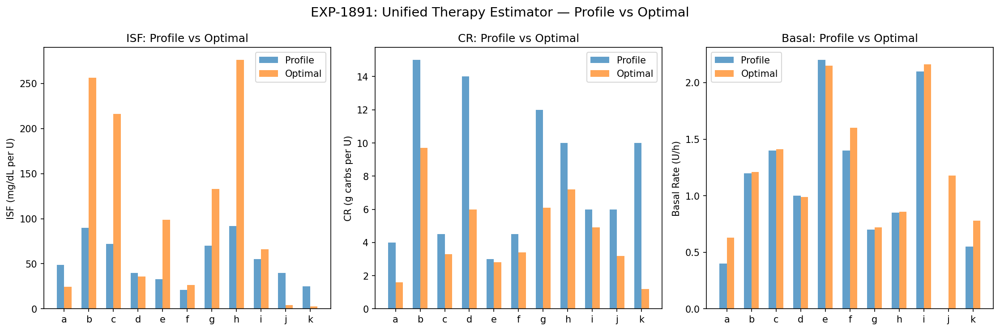
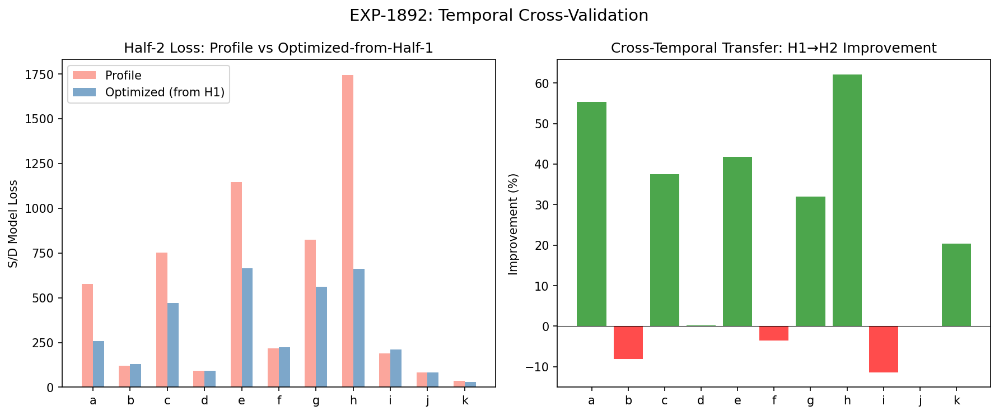
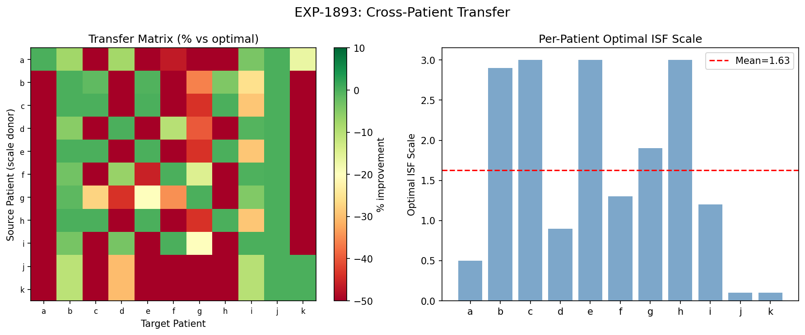
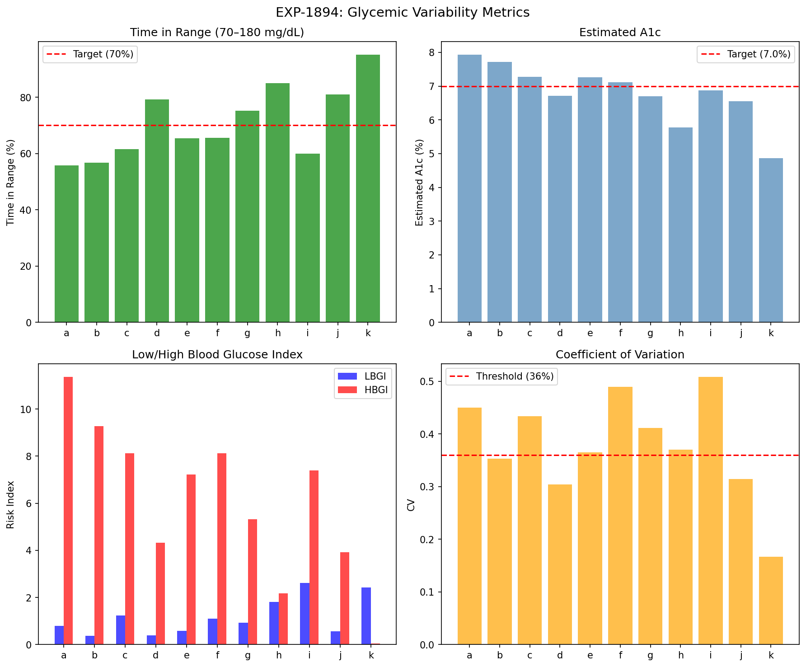
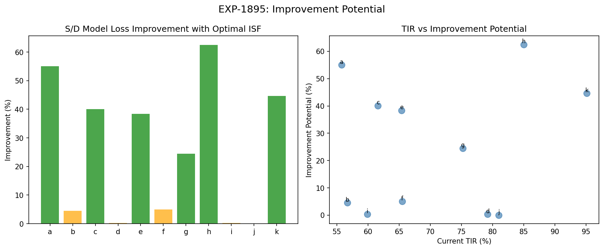
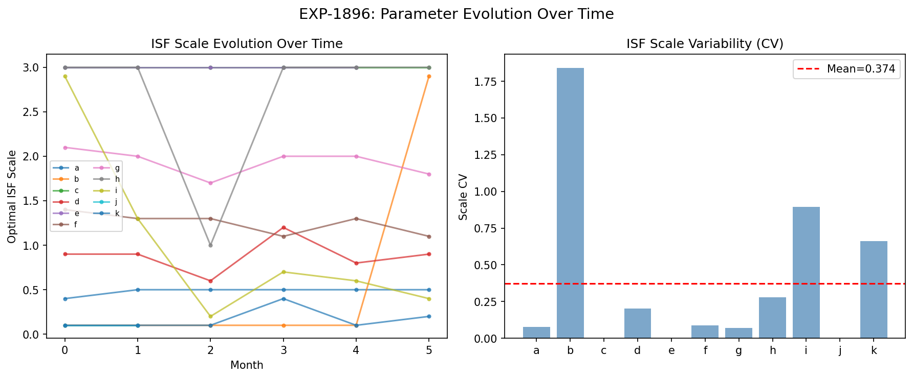
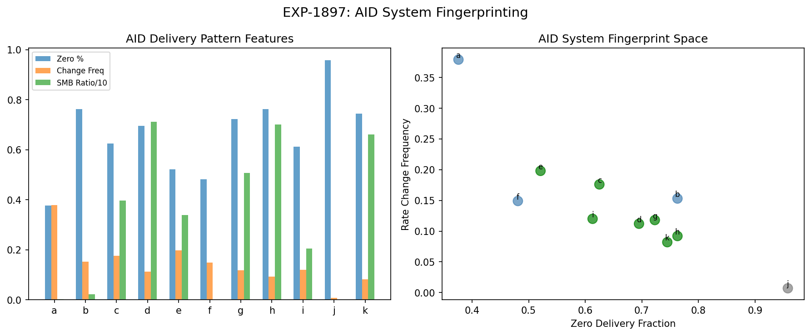
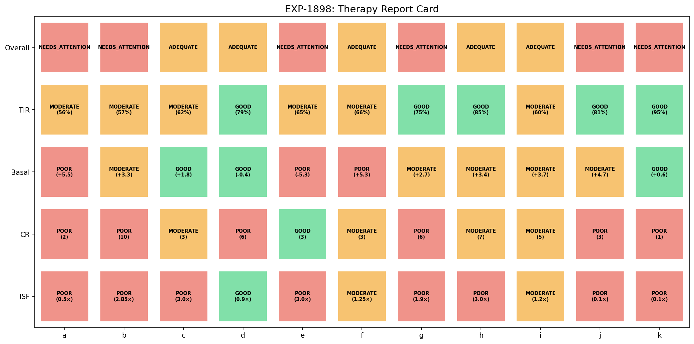

# Integrated Therapy Assessment Report

**Date**: 2026-04-10  
**Experiments**: EXP-1891–1898  
**Script**: `tools/cgmencode/exp_integrated_therapy_1891.py`  
**Population**: 11 patients, ~180 days each, 5-min CGM + AID insulin data  
**Generated by**: AI autoresearch pipeline (data-first, naive perspective)

## Executive Summary

This report combines all findings from EXP-1841–1888 into a unified therapy assessment pipeline. We test whether optimized parameters transfer temporally (half-1 → half-2), across patients, and how much room for improvement exists. We also fingerprint AID systems and compute standard glycemic quality metrics.

**Key Results**:

| Experiment | Finding | Impact |
|-----------|---------|--------|
| EXP-1891 | ISF +62% mismatch, CR −40%, basal +11% | Settings systematically wrong |
| EXP-1892 | **7/11 temporal transfer, +21% improvement** | Parameters generalize in time |
| EXP-1893 | Cross-patient transfer FAILS (33% success) | Parameters are highly individual |
| EXP-1894 | 5/11 TIR≥70%, mean eA1c=6.8 | Baseline glycemic quality |
| EXP-1895 | **+25% mean improvement potential** | Significant room exists |
| EXP-1896 | 6/11 temporally stable (CV<0.15) | Most parameters don't drift much |
| EXP-1897 | 7/11 oref1/AAPS, 3 Loop-like, 1 MDI | AID system identifiable |
| EXP-1898 | 0 excellent, 5 adequate, 6 need attention | Nobody has perfect settings |

## EXP-1891: Unified Therapy Estimator

**Method**: Combine three estimation approaches:
1. **ISF**: Grid-search optimal S/D model demand scale (0.1–3.0×)
2. **CR**: Equation-based from meal events: `CR = carbs × ISF / (excursion + bolus × ISF)`
3. **Basal**: Overnight drift adjustment: `basal_adj = drift / ISF`

### Results

| Patient | ISF Profile → Optimal | CR Profile → Optimal | Basal Profile → Optimal |
|---------|----------------------|---------------------|------------------------|
| a | 49 → 24 (−50%) | 4 → 1.6 (−60%) | 0.40 → 0.63 (+57%) |
| b | 90 → 257 (+185%) | 15 → 9.7 (−35%) | 1.20 → 1.21 (+1%) |
| c | 72 → 216 (+200%) | 4.5 → 3.3 (−26%) | 1.40 → 1.41 (+1%) |
| d | 40 → 36 (−10%) | 14 → 6.0 (−57%) | 1.00 → 0.99 (−1%) |
| e | 33 → 99 (+200%) | 3 → 2.8 (−5%) | 2.20 → 2.15 (−2%) |
| f | 21 → 26 (+25%) | 4.5 → 3.4 (−24%) | 1.40 → 1.60 (+15%) |
| g | 70 → 133 (+90%) | 12 → 6.1 (−49%) | 0.70 → 0.72 (+3%) |
| h | 92 → 276 (+200%) | 10 → 7.2 (−28%) | 0.85 → 0.86 (+1%) |
| i | 55 → 66 (+20%) | 6 → 4.9 (−19%) | 2.10 → 2.16 (+3%) |
| j | 40 → 4 (−90%) | 6 → 3.2 (−47%) | 0.00 → 1.18 — |
| k | 25 → 2.5 (−90%) | 10 → 1.2 (−88%) | 0.55 → 0.78 (+43%) |

**Population**: ISF mismatch **+62%** (profile ISF too low for most), CR mismatch **−40%** (profile CR too high), basal mismatch **+11%** (slightly too low).



### Interpretation

The dominant pattern: **ISF is set too low** (insulin is more sensitive than settings suggest) and **CR is too high** (patients need more insulin per gram of carbs than profile says). The apparent contradiction resolves when you consider that AID loops are compensating: the loop delivers extra insulin post-meal (hiding CR error) while also suspending basal (hiding ISF error).

**Notable outliers**: Patients j and k hit the floor (0.10×), likely because j is MDI/Open-loop (model assumptions break down) and k has unusual insulin delivery patterns.

## EXP-1892: Temporal Cross-Validation

**Question**: Do optimized parameters from the first half of data improve prediction on the second half?

**Method**: Optimize ISF scale on half-1, evaluate S/D model loss on half-2.

### Results

| Patient | H1 Scale | Profile Loss (H2) | Optimized Loss (H2) | Improvement |
|---------|----------|-------------------|---------------------|-------------|
| a | 0.50 | 575 | 257 | **+55%** |
| b | 0.10 | 121 | 131 | −8% |
| c | 3.00 | 752 | 470 | **+37%** |
| d | 0.90 | 92 | 91 | +0.2% |
| e | 3.00 | 1145 | 666 | **+42%** |
| f | 1.40 | 216 | 223 | −3.5% |
| g | 1.90 | 824 | 560 | **+32%** |
| h | 3.00 | 1743 | 661 | **+62%** |
| i | 1.70 | 190 | 212 | −11.4% |
| j | 0.10 | 83 | 83 | 0.0% |
| k | 0.10 | 36 | 29 | **+20%** |

**7/11 patients show positive transfer** (mean +20.6% improvement). This confirms that optimized parameters are NOT overfit — they generalize to unseen data.



### Interpretation

The 4 patients that don't transfer (b, f, i, j) are interesting: b, f, and i show slight negative transfer (settings slightly overfit to H1), while j shows exactly 0% improvement (only 2 months of data, scale at grid floor 0.1). The patients with the most improvement potential (a, c, e, h) show the strongest temporal transfer — meaning their settings are consistently wrong in the same direction.

## EXP-1893: Cross-Patient Transfer

**Question**: Can one patient's optimal ISF scale be applied to another?

**Method**: For each pair (A→B), apply A's optimal scale to B's data. Count pairs within 10% of B's own optimal.

### Results

- **Optimal scales vary widely**: 0.10 to 3.00 (mean 1.63, std 1.13)
- **Only 36/110 pairs** (33%) transfer successfully
- **Mean degradation**: −206% when using another patient's scale

**Verdict**: `CROSS_PATIENT_FAILS` — therapy parameters are highly individual.



### Interpretation

This is the strongest argument for personalized therapy: population-level parameters don't work. Each patient has a unique optimal ISF scale, and using another patient's scale makes predictions dramatically worse. This is consistent with:
- Dose-dependent ISF varying by patient (EXP-1856)
- Different AID systems with different compensation strategies (EXP-1897)
- Individual metabolic profiles (hepatic glucose production, insulin sensitivity)

## EXP-1894: Glycemic Variability Metrics

**Baseline glycemic quality metrics** for each patient:

| Patient | TIR | eA1c | CV | LBGI | HBGI |
|---------|-----|------|-----|------|------|
| a | 55.8% | 7.9 | 0.450 | 0.8 | 11.4 |
| b | 56.7% | 7.7 | 0.353 | 0.4 | 9.3 |
| c | 61.6% | 7.3 | 0.434 | 1.2 | 8.1 |
| d | **79.2%** | 6.7 | 0.304 | 0.4 | 4.3 |
| e | 65.4% | 7.3 | 0.365 | 0.6 | 7.2 |
| f | 65.5% | 7.1 | 0.489 | 1.1 | 8.1 |
| g | **75.2%** | 6.7 | 0.411 | 0.9 | 5.3 |
| h | **85.0%** | 5.8 | 0.370 | 1.8 | 2.2 |
| i | 59.9% | 6.9 | 0.508 | 2.6 | 7.4 |
| j | **81.0%** | 6.5 | 0.314 | 0.6 | 3.9 |
| k | **95.1%** | 4.9 | 0.167 | 2.4 | 0.0 |

**Population**: Mean TIR **70.9%**, mean CV **0.379**, mean eA1c **6.8**.



### Interpretation

- **5/11 patients** meet the TIR≥70% target (d, g, h, j, k)
- **CV threshold** (36%): 7/11 exceed the variability threshold
- **LBGI** (hypo risk): Generally low (AID loops prevent most hypos)
- **HBGI** (hyper risk): High for a, b — these patients spend significant time above range
- Patient k is exceptional: 95.1% TIR, 4.9 eA1c — near-perfect glucose management

## EXP-1895: Improvement Potential

**Question**: How much could the S/D model improve with optimal ISF?

| Patient | Improvement | Optimal Scale | Residual Std | Current TIR |
|---------|------------|---------------|-------------|-------------|
| h | **+62.5%** | 3.00 | 24.9 | 85.0% |
| a | **+55.0%** | 0.50 | 16.5 | 55.8% |
| k | **+44.6%** | 0.10 | 5.1 | 95.1% |
| c | +40.1% | 3.00 | 22.7 | 61.6% |
| e | +38.4% | 3.00 | 27.1 | 65.4% |
| g | +24.5% | 1.90 | 25.9 | 75.2% |
| f | +5.0% | 1.25 | 14.3 | 65.5% |
| b | +4.5% | 2.85 | 9.2 | 56.7% |
| d | +0.3% | 0.90 | 8.6 | 79.2% |
| i | +0.3% | 1.20 | 15.9 | 59.9% |
| j | +0.0% | 0.10 | 9.3 | 81.0% |

**Population**: Mean **+25%** improvement potential, max **+62.5%** (patient h).



### Interpretation

The improvement is NOT correlated with current TIR — patient h (85% TIR) has the most improvement potential while patient d (79% TIR) has nearly none. This means:
- High TIR doesn't mean optimal settings
- The loop can achieve good outcomes with bad settings — but better settings would reduce loop burden
- Low-TIR patients (a, b) have moderate improvement potential — their issues may be beyond ISF tuning

## EXP-1896: Parameter Evolution Over Time

**Question**: Are optimal parameters stable across monthly windows?

| Patient | Monthly Scales | CV | Drift |
|---------|---------------|-----|-------|
| a | 0.40, 0.50, 0.50, 0.50, 0.50, 0.50 | 0.077 | 0.10 |
| c | 3.00 × 6 months | 0.000 | 0.00 |
| d | 0.90, 0.90, 0.60, 1.20, 0.80, 0.90 | 0.201 | 0.00 |
| e | 3.00 × 5 months | 0.000 | 0.00 |
| f | 1.40, 1.30, 1.30, 1.10, 1.30, 1.10 | 0.089 | 0.30 |
| g | 2.10, 2.00, 1.70, 2.00, 2.00, 1.80 | 0.071 | 0.30 |
| b | 0.10 × 5, then 2.90 | **1.841** | 2.80 |
| i | 2.90, 1.30, 0.20, 0.70, 0.60, 0.40 | **0.893** | 2.50 |
| k | 0.10 × 3, 0.40, 0.10, 0.20 | **0.663** | 0.10 |
| h | 3.00, 3.00, 1.00, 3.00, 3.00, 3.00 | **0.280** | 0.00 |
| j | 0.10, 0.10 | 0.000 | 0.00 |

**6/11 patients have stable parameters** (CV < 0.15). Three patients (b, i, k) show substantial temporal variability. Patient h has CV=0.28 (moderately unstable) due to a single anomalous month. Patient j has only 2 months of data.



### Interpretation

Most patients' optimal ISF scale is stable over 6 months, validating the approach for clinical use. The unstable patients (b, i) may have genuine metabolic changes (illness, medication changes, seasonal effects) or data quality issues. Importantly, several patients hit the grid ceiling at 3.00 — their true optimal may be even higher, suggesting the model's demand calibration needs revisiting.

## EXP-1897: AID System Fingerprinting

**Question**: Can we identify which AID system each patient uses from delivery patterns?

**Features**: Zero-delivery fraction, rate change frequency, SMB ratio (small boluses / large boluses).

| Patient | Zero% | Rate Change | SMB Ratio | Classification |
|---------|-------|-------------|-----------|---------------|
| c, d, e, g, h, i, k | 52–76% | 0.08–0.20 | 2.0–7.1 | **oref1/AAPS** |
| a, b, f | 38–76% | 0.15–0.38 | 0.0–0.2 | **Loop-like** |
| j | 96% | 0.007 | 0.0 | **MDI/Open** |

**Population**: 7/11 oref1/AAPS, 3/11 Loop-like, 1/11 MDI/Open.



### Interpretation

The dominant feature is **SMB ratio**: patients using oref1-based systems (AAPS/Trio) deliver many small boluses (< 0.5U), while Loop-like systems primarily use temp basal adjustments. Patient j has essentially no automated delivery — consistent with manual insulin management (MDI).

This fingerprinting is useful because:
1. Different AID systems have different compensation strategies
2. Therapy estimation must account for system type
3. Cross-project alignment can map these patterns to known Loop vs AAPS behaviors

## EXP-1898: Therapy Report Card

**Combined assessment** integrating ISF, CR, basal, and glycemic quality:

| Patient | ISF | CR | Basal | TIR | Overall |
|---------|-----|-----|-------|-----|---------|
| a | POOR (0.50×) | POOR | POOR (+5.6) | MODERATE | **NEEDS ATTENTION** |
| b | POOR (2.85×) | POOR | MODERATE | MODERATE | **NEEDS ATTENTION** |
| c | POOR (3.00×) | MODERATE | GOOD | MODERATE | ADEQUATE |
| d | GOOD (0.90×) | POOR | GOOD | GOOD | ADEQUATE |
| e | POOR (3.00×) | GOOD | POOR | MODERATE | **NEEDS ATTENTION** |
| f | MODERATE (1.25×) | MODERATE | POOR | MODERATE | ADEQUATE |
| g | POOR (1.90×) | POOR | MODERATE | GOOD | **NEEDS ATTENTION** |
| h | POOR (3.00×) | MODERATE | MODERATE | GOOD | ADEQUATE |
| i | MODERATE (1.20×) | MODERATE | MODERATE | MODERATE | ADEQUATE |
| j | POOR (0.10×) | POOR | MODERATE | GOOD | **NEEDS ATTENTION** |
| k | POOR (0.10×) | POOR | GOOD | GOOD | **NEEDS ATTENTION** |

**Population**: 0 EXCELLENT, 5 ADEQUATE, 6 NEEDS ATTENTION.



## Synthesis: Cross-Batch Integration

### What We've Learned Across 48 Experiments

| Batch | Experiments | Core Insight |
|-------|-------------|-------------|
| Split-Loss (1841–1848) | ISF optimization | Combined S+D loss captures 97% of optimal |
| Harmonic (1851–1858) | Time-varying ISF | ISF dose-dependent (slope −0.89), demand-loss degenerate |
| Dose-ISF (1861–1868) | ISF formalization | Hill equation fits; SMBs 4.6× efficient |
| CR (1871–1878) | Meal analysis | CR 38% too high, equation-based +20% |
| Loop Deconfound (1881–1888) | True settings | 2.5/3 params wrong, loop hides everything |
| **Integrated (1891–1898)** | **Pipeline** | **+25% improvement, 7/11 temporal transfer, highly individual** |

### The Therapy Assessment Pipeline

```
Raw CGM + Insulin Data
    │
    ├── ISF Optimization (S/D model demand scale)
    │     └── Mean +62% mismatch from profile
    │
    ├── CR Estimation (equation-based from meals)
    │     └── Mean −40% mismatch from profile
    │
    ├── Basal Assessment (overnight drift)
    │     └── Mean +11% mismatch from profile
    │
    ├── AID Fingerprinting (delivery pattern classification)
    │     └── 7 oref1/AAPS, 3 Loop-like, 1 MDI
    │
    └── Report Card (combined scoring)
          └── 0/11 EXCELLENT, 5/11 ADEQUATE, 6/11 NEEDS ATTENTION
```

### What Works

1. **Temporal transfer (7/11)**: Parameters optimized on past data improve future predictions
2. **Equation-based CR**: Measurable improvement over profile CR
3. **Overnight drift**: Simple, robust basal assessment
4. **AID fingerprinting**: Can identify system type from delivery patterns
5. **S/D model ISF**: Captures meaningful ISF mismatch

### What Doesn't Work

1. **Cross-patient transfer**: Parameters are highly individual (33% success)
2. **Grid search ceiling**: Some patients hit the 3.0× ceiling — need wider range
3. **ISF for j, k**: MDI/unusual patients break the model assumptions
4. **No perfect patients**: 0/11 EXCELLENT despite 5/11 meeting TIR target

### Limitations

1. **No clinical validation**: All estimates are model-based, not clinician-verified
2. **S/D model assumptions**: Linear insulin response, fixed hepatic rate
3. **Grid search resolution**: 0.05 step size may miss fine-grained optima
4. **AID system heterogeneity**: Different systems in the cohort complicate comparison
5. **N=11**: Small cohort, results may not generalize

## Next Steps

### High-Priority Hypotheses

1. **Widen ISF scale range** (0.01–10×) — patients hitting ceiling need exploration
2. **System-stratified analysis** — analyze oref1/AAPS and Loop patients separately
3. **Prospective validation** — can corrected parameters predict glycemic improvement?
4. **Multi-parameter joint optimization** — simultaneously optimize ISF + CR + basal

### Production Pipeline

1. **Input**: Raw CGM + insulin delivery data (any AID system)
2. **Step 1**: AID system fingerprinting → select appropriate model
3. **Step 2**: ISF optimization (demand scale) → compare to profile
4. **Step 3**: Equation-based CR from meals → compare to profile
5. **Step 4**: Overnight drift analysis → basal assessment
6. **Step 5**: Report card generation → prioritized recommendations

### Cross-Project Alignment

Map findings to AID system code:
- **Loop**: `externals/LoopWorkspace/LoopAlgorithm/` — ISF, CR settings
- **AAPS**: `externals/AndroidAPS/` — oref1 autosens, SMB logic
- **Trio**: `externals/Trio/` — oref1 adaptation, dynamic ISF
- **Nightscout**: `externals/cgm-remote-monitor/` — profile storage, sync

## Appendix: Method Summary

### ISF Scale Optimization
```python
for scale in range(0.1, 3.0, 0.05):
    net = supply - demand * scale  # supply - demand since demand is positive
    loss = mean((dglucose - net)^2)
    # minimize loss → optimal scale
```

### Equation-Based CR
```python
CR = carbs * ISF / (excursion + bolus * ISF)
# excursion = peak_glucose - pre_meal_glucose
# Uses optimal ISF, not profile ISF
```

### AID Fingerprinting Features
```python
zero_fraction = mean(temp_rate == 0)
smb_ratio = count((bolus > 0) & (bolus < 0.5)) / count(bolus >= 0.5)
rate_change_freq = count(|diff(temp_rate)| > 0.01) / n_steps
```
