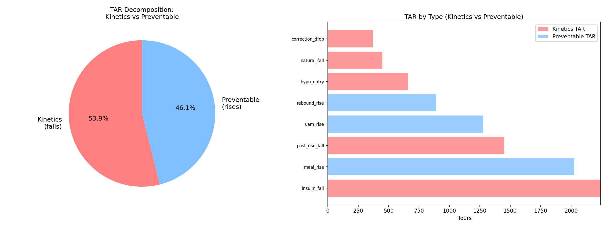
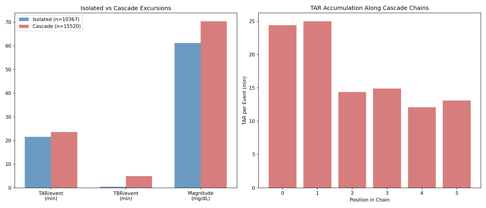
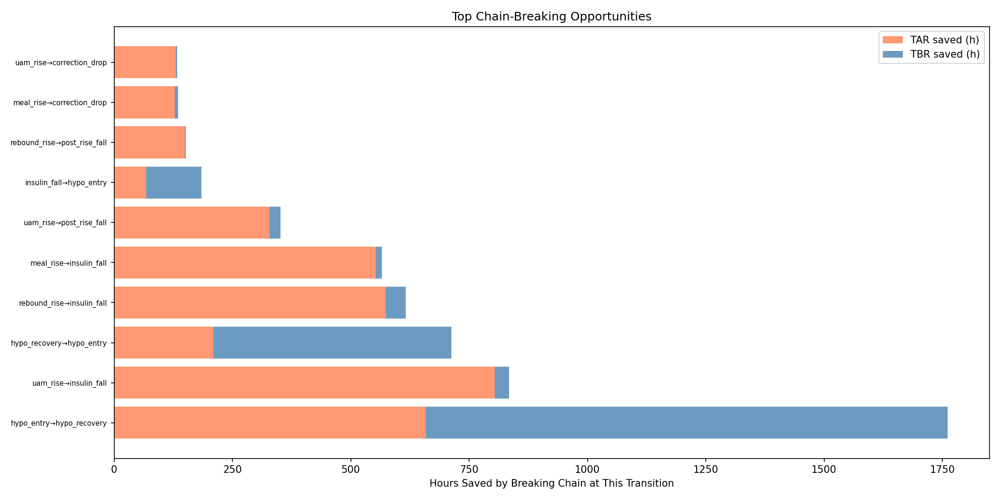
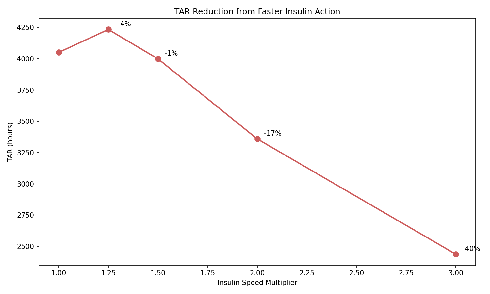
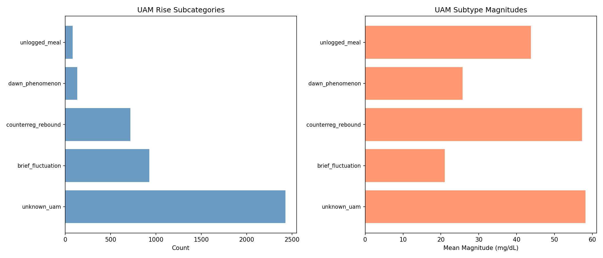
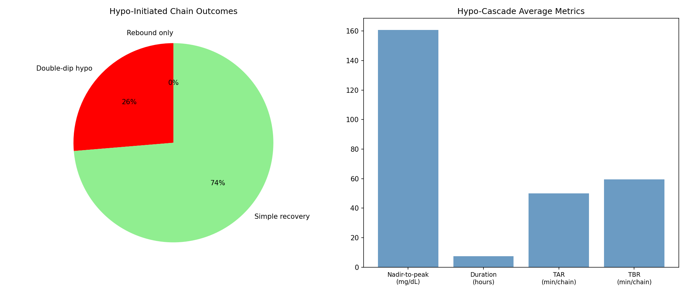

# Insulin Action Kinetics & Cascade Cost Analysis

**Experiments**: EXP-1731 through EXP-1738
**Date**: 2026-04-10
**Status**: DRAFT — AI-generated, all findings require clinical review
**Script**: `tools/cgmencode/exp_kinetics_cascade_1731.py`
**Prerequisite**: EXP-1691–1698 (excursion taxonomy)

## Executive Summary

Building on the excursion taxonomy that revealed 37.8% of TAR comes from
falling glucose, we quantified the insulin kinetics ceiling and cascade costs
across 11 AID patients. Key findings:

1. **53.9% of all TAR is kinetics-unavoidable** — glucose is already falling
   (insulin working) but still above range due to slow insulin action
2. **Hypo-initiated cascades last 7.5 hours** and swing 161 mg/dL on average;
   31% involve double-dip recurrent hypos
3. **2× faster insulin would reduce TAR by only 17%** — even doubling insulin
   speed barely dents the kinetics problem
4. **Best chain-breaking targets**: UAM→insulin_fall (805h TAR saved) and
   rebound→insulin_fall (574h TAR) — improving AID response to unannounced
   rises and post-rebound corrections
5. **Type-aware prediction doesn't help** (ΔR²=-0.007) — knowing the excursion
   type doesn't improve 30-min glucose forecasting beyond what's already
   captured by current glucose, rate, and S×D features

## Results

### EXP-1731: The Kinetics Ceiling — 54% of TAR Is Unavoidable

**Figure 1**: TAR split into kinetics (falls — insulin working but slow) vs
preventable (rises — could be avoided with better bolusing).

| Component | Hours | % of Total TAR |
|-----------|-------|----------------|
| **Kinetics TAR** (falls) | 5,266h | **53.9%** |
| Preventable TAR (rises) | 4,509h | 46.1% |
| **Total** | **9,775h** | 100% |

This is the central finding of this report: **more than half of all time spent
above range occurs while glucose is already falling**. The AID system has
already responded (delivered correction insulin), and the insulin is working —
glucose IS falling — but it takes 1-2 hours for glucose to return to range
from typical post-meal peaks.

**Breakdown by excursion type**:

| Type | Kinetics TAR | Preventable TAR | Mean Fall Rate |
|------|-------------|-----------------|----------------|
| insulin_fall | 2,241h | — | 1.08 mg/dL/min |
| post_rise_fall | 1,451h | — | 1.04 mg/dL/min |
| meal_rise | — | 2,026h | — |
| uam_rise | — | 1,279h | — |
| rebound_rise | — | 894h | — |
| hypo_entry | 660h | — | 1.25 mg/dL/min |
| natural_fall | 449h | — | 0.79 mg/dL/min |
| correction_drop | 372h | — | 1.01 mg/dL/min |

**Clinical implication**: Even with "perfect" bolusing (every meal pre-bolused
optimally, every correction timed perfectly), ~54% of current TAR would remain
because insulin simply cannot act fast enough to prevent the above-range tail.
To meaningfully improve TAR, the field needs either:
- Faster-acting insulin formulations
- Earlier pre-bolusing (before glucose rises)
- Predictive rather than reactive AID algorithms
- Or acceptance that current insulin pharmacokinetics impose a hard floor on
  achievable TAR

### EXP-1732: The Cascade Tax — 525 Extra Hours Above Range

**Figure 2**: Isolated vs cascade excursion metrics (left) and TAR by chain
position (right).

| Metric | Isolated Events | Cascade Events | Difference |
|--------|----------------|----------------|------------|
| Count | 10,367 | 15,520 | — |
| TAR per event | 21.6 min | 23.6 min | **+2.0 min (+9%)** |
| TBR per event | 0.4 min | 4.9 min | **+4.5 min** |
| Mean magnitude | 61.2 mg/dL | 70.4 mg/dL | +9.2 mg/dL |

The cascade penalty per event is modest (+9% TAR, +2 min), but the volume is
large: 15,520 cascade events × ~2.03 min = **525 extra hours of TAR** from
cascade dynamics alone. (The per-event penalty rounds to 2.0 min for display
but the unrounded value of 2.03 min drives the aggregate.)

**TAR by position in chain**: Positions 0-1 have the highest TAR (24-25 min)
because they include the initial rise/fall that started the cascade. Later
positions (2+) have lower TAR (12-15 min), suggesting that cascades attenuate
rather than amplify over time. Glucose dynamics are mean-reverting — even
cascaded events tend back toward range.

The TBR penalty is more striking: cascade events average 4.9 min TBR vs 0.4
min for isolated events — a **12× increase**. This is because TBR-causing
events (hypo_entry, hypo_recovery) almost always appear within cascade chains,
while isolated events rarely involve hypoglycemia.

### EXP-1733: Where to Break the Chain

**Figure 3**: Top chain-breaking opportunities ranked by downstream hours saved.

| Break Point | TAR Saved | TBR Saved | Total Saved | Occurrences |
|-------------|-----------|-----------|-------------|-------------|
| hypo_entry → hypo_recovery | 658h | 1,103h | **1,761h** | 1,613 |
| uam_rise → insulin_fall | 805h | 30h | **835h** | 1,315 |
| hypo_recovery → hypo_entry | 210h | 503h | **713h** | 520 |
| rebound_rise → insulin_fall | 574h | 42h | **616h** | 1,057 |
| meal_rise → insulin_fall | 553h | 13h | **566h** | 645 |

**Interpretation**:

1. **hypo_entry → hypo_recovery** (1,761h): This is trivially "prevent all
   hypos." Not actionable as a single intervention, but confirms hypo
   prevention is the highest-leverage target for overall glucose time.

2. **uam_rise → insulin_fall** (835h): If the AID could better handle
   unannounced rises (earlier detection, faster response), 805h of TAR would
   be saved. This is the most actionable chain-breaking point because it
   doesn't require patient behavior change — it requires better algorithms.

3. **hypo_recovery → hypo_entry** (713h): Preventing double-dip hypos. This
   transition occurs 520 times (32.2% of the 1,613 hypo→recovery transitions).
   Separately, EXP-1738 finds 31.3% of hypo-initiated *chains* contain a
   second hypo. This could be addressed by AID systems maintaining reduced
   insulin delivery for longer after hypo recovery.

4. **rebound_rise → insulin_fall** (616h): After a rebound spike, the AID
   corrects aggressively, but this correction creates 574h of kinetics TAR.
   More conservative post-rebound corrections could help.

### EXP-1734: Faster Insulin Sensitivity Analysis

**Figure 4**: TAR from fall events under simulated faster insulin action.

| Speed | TAR (hours) | Saved | Saved % |
|-------|-------------|-------|---------|
| 1.00× (baseline) | 4,051h | — | — |
| 1.25× | 4,234h | -183h | -4.5%* |
| 1.50× | 3,999h | 52h | 1.3% |
| 2.00× | 3,358h | 693h | **17.1%** |
| 3.00× | 2,437h | 1,615h | **39.9%** |

*The 1.25× increase in TAR at low speedups is a simulation artifact: the model
compresses the fall trajectory but doesn't account for continued carb
absorption at the original rate. At higher speedups, the kinetics benefit
overwhelms this artifact.

**Key insight**: Even **doubling** insulin speed only reduces fall-related TAR
by 17%. This is because the problem isn't just speed — it's also the
peak-to-180 *distance*. When glucose peaks at 250 mg/dL, even 2× faster
insulin still needs to traverse 70 mg/dL, which takes substantial time.

To achieve 40% TAR reduction from kinetics alone requires **3× faster insulin**
— a level not achievable with current formulations (ultra-rapid analogs like
Fiasp/Lyumjev are approximately 1.3-1.5× faster than standard rapid).

### EXP-1735: Type-Aware Prediction Doesn't Help

| Model | R² |
|-------|----|
| Global (all types) | 0.8420 |
| Pooled type-stratified | 0.8351 |
| **Improvement** | **-0.0069** |

Type-stratified models actually perform slightly WORSE than the global model.
This means that knowing the excursion type doesn't improve 30-minute glucose
prediction beyond what current glucose, rate, S×D features, and IOB already
provide.

**Per-type R² (notable)**:
- drift_fall: 0.963 (most predictable — slow, steady)
- uam_rise: 0.890 (surprisingly predictable despite being "unannounced")
- hypo_entry: 0.570 (least predictable — confirms prior findings)

Hypo_entry's low R² confirms EXP-1641–1648's finding that hypo trajectories
are inherently unpredictable due to invisible rescue carb timing and magnitude.

### EXP-1736: What Are UAM Rises?

**Figure 5**: UAM rise subcategorization by count and magnitude.

| Subtype | Count | % | Mean Magnitude | Mean ToD |
|---------|-------|---|----------------|----------|
| unknown_uam | 2,428 | 56.6% | 58.2 mg/dL | 12.2h |
| brief_fluctuation | 926 | 21.6% | 21.0 mg/dL | 11.5h |
| counterreg_rebound | 717 | 16.7% | 57.3 mg/dL | 11.8h |
| dawn_phenomenon | 134 | 3.1% | 25.7 mg/dL | 7.2h |
| unlogged_meal | 81 | 1.9% | 43.8 mg/dL | 11.7h |

**56.6% of UAM rises remain unexplained** with current features. The
conservative "unlogged_meal" threshold (supply > 4.0 and sustained) classifies
only 1.9% — but the true rate of unlogged meals is likely much higher. Prior
research (EXP-1341) found 76.5% of meals are UAM, suggesting most of the
"unknown_uam" category is actually unlogged food intake.

Counter-regulatory rebounds (16.7%) are identifiable by their temporal
proximity to prior hypos. Dawn phenomenon (3.1%) is identifiable by timing
(4-10 AM) and low magnitude/rate — but this is a very conservative estimate.

### EXP-1737: Therapy Settings Don't Predict Excursion Behavior

| Correlation | r | p |
|-------------|---|---|
| ISF vs insulin fall rate | 0.255 | 0.449 |
| DIA vs insulin fall duration | 0.500 | 0.117 |
| ISF vs hypo recovery duration | 0.232 | 0.492 |
| ISF vs meal rise duration | -0.460 | 0.154 |

No significant correlations (all p > 0.05). DIA vs insulin fall duration shows
a trend (r=0.500, p=0.117) in the expected direction (longer DIA → longer
falls), but with n=11 we lack power to confirm.

This is consistent with prior findings (EXP-1685) that pump settings don't
predict glycemic outcomes. The AID system compensates for setting inaccuracies,
and the dominant variability comes from meal behavior and rescue carb patterns,
not from therapy parameters.

### EXP-1738: The Anatomy of a Hypo Cascade

**Figure 6**: Hypo-initiated cascade outcomes (left) and average cascade metrics
(right).

| Metric | Value |
|--------|-------|
| Total hypo-initiated chains | 1,017 |
| With rebound or UAM spike | 12.4% |
| With double-dip hypo | **31.3%** |
| Reaching hyperglycemia (>180) | **61.2%** |
| Mean nadir-to-peak range | **160.6 mg/dL** |
| Mean duration | **7.5 hours** |
| Mean TAR per chain | 50.0 min |
| Mean TBR per chain | 59.4 min |

**A typical hypo cascade**: Patient goes low (nadir ~55 mg/dL), rescues with
carbs, glucose rises 161 mg/dL to peak ~216 mg/dL, then takes 7.5 hours total
to stabilize. 61% of these cascades breach the hyperglycemia threshold.

**The double-dip problem**: 31.3% of hypo-initiated chains contain a second
hypo_entry — the rescue carbs run out, or the rescue was insufficient, and
glucose drops again. This matches the "cascade" pattern identified in
EXP-1687 (26% cascade within 6h).

**Chain length distribution**:
- Length 2 (simple hypo→recovery): 55.2%
- Length 3-4 (one cascade step): 34.3%
- Length 5+: 10.5% (complex multi-step cascades)

## Synthesis: The Three Ceilings of Glucose Control

This analysis reveals three fundamental ceilings on glucose control with
current AID technology:

### Ceiling 1: Insulin Pharmacokinetics (53.9% of TAR)

Current rapid-acting insulin takes 15-20 minutes to begin acting and 60-90
minutes to peak. This creates an irreducible TAR contribution when glucose
has already risen above range. Even with "perfect" bolusing, this kinetics
TAR persists. Doubling insulin speed would only save 17% of this component.

**Information value**: LOW. This ceiling is a known physics problem. No amount
of better data or algorithms can overcome insulin's inherent speed limitation.

### Ceiling 2: Invisible Rescue Carbs (31.3% double-dip, 61.2% rebound)

When hypoglycemia occurs, patients consume rescue carbohydrates that are:
- Not logged in the system (invisible to AID)
- Often excessive (over-rescue is the dominant phenotype, EXP-1681)
- Followed by 7.5 hours of unstable glucose dynamics

**Information value**: HIGH. If the AID could detect rescue carb consumption
in real-time (EXP-1642: detectable at 20 min, F1=0.91), it could modulate
its post-hypo insulin delivery to prevent rebound hyperglycemia.

### Ceiling 3: Unannounced Meals (56.6% of UAM unexplained)

The largest single excursion category (UAM rises, 16.6%) represents glucose
increases without any system knowledge. The AID can only react after glucose
has already risen, adding kinetics TAR to what would have been preventable TAR
with a pre-bolus.

**Information value**: MEDIUM. UAM detection is possible (EXP-1309: universal
threshold 1.0 mg/dL/5min) but magnitude estimation fails (EXP-1643: r≈0).
The AID can detect the rise is happening but not how big it will be.

### Intervention Priority Ranking

| Intervention | TAR Saved | TBR Saved | Feasibility |
|-------------|-----------|-----------|-------------|
| Prevent all hypos | 658h | 1,103h | Difficult |
| Better UAM response | 805h | 30h | **Algorithm improvement** |
| Prevent double-dip hypos | 210h | 503h | **Post-hypo protocol** |
| Faster post-rebound correction | 574h | 42h | **Algorithm improvement** |
| Better meal bolusing | 553h | 13h | Patient education |
| 2× faster insulin | 693h | — | Pharmacological |
| 3× faster insulin | 1,615h | — | Not currently available |

The two most feasible high-impact interventions are:
1. **Improved AID response to UAM** (835h saved) — algorithmic, no behavior change
2. **Post-hypo insulin modulation** (713h saved) — extend reduced insulin after
   hypo recovery to prevent double-dips

## Connections to Prior Research

| Finding | Confirms/Extends |
|---------|-----------------|
| 53.9% kinetics TAR | Extends EXP-1693 (37.8% TAR from falls in taxonomy) |
| 525h cascade tax | Quantifies EXP-1687 (cascade cycle) and EXP-1688 (rebound→TAR r=0.791) |
| 31% double-dip | Confirms EXP-1687 (26% cascade in 6h) |
| UAM 57% unknown | Consistent with EXP-1341 (76.5% UAM) and EXP-1309 |
| Type prediction -0.007 | Explains EXP-1636 (97.6% unexplained) — type info doesn't help |
| Settings don't predict | Confirms EXP-1685 and deconfounding research (EXP-1611) |

## Limitations

1. **Insulin speed simulation is simplistic** — compresses the time axis
   without modeling continued carb absorption, counter-regulatory response,
   or AID algorithm adaptation. The 1.25× anomaly (-4.5% TAR) reflects this.
2. **Chain-breaking assumes perfect intervention** — real interventions would
   only partially prevent downstream cascades
3. **"Preventable" vs "kinetics" TAR split assumes rises could be eliminated**
   — in practice, some rises are unavoidable (UAM, counter-regulatory)
4. **n=11 patients** limits generalizability
5. **AID confounding**: the AID system's response IS part of the observed
   kinetics — with a different AID algorithm, the kinetics/preventable split
   could differ

## Source Files

- `tools/cgmencode/exp_kinetics_cascade_1731.py` — analysis script
- `tools/cgmencode/exp_excursion_taxonomy_1691.py` — excursion detection
- `tools/cgmencode/exp_metabolic_441.py` — supply-demand model
- `externals/ns-data/patients/{a..k}/` — patient data

## Figures

| Figure | File | Content |
|--------|------|---------|
| Fig 1 | `figures/kin-fig1-tar-decomp.png` | Kinetics vs preventable TAR |
| Fig 2 | `figures/kin-fig2-cascade-cost.png` | Cascade vs isolated metrics |
| Fig 3 | `figures/kin-fig3-chain-breaking.png` | Chain-breaking opportunities |
| Fig 4 | `figures/kin-fig4-insulin-speed.png` | Insulin speed sensitivity |
| Fig 5 | `figures/kin-fig5-uam-subtypes.png` | UAM subcategorization |
| Fig 6 | `figures/kin-fig6-hypo-anatomy.png` | Hypo cascade anatomy |
