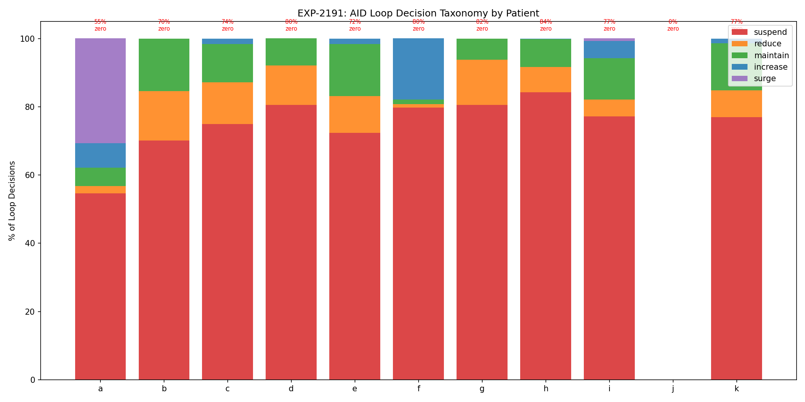
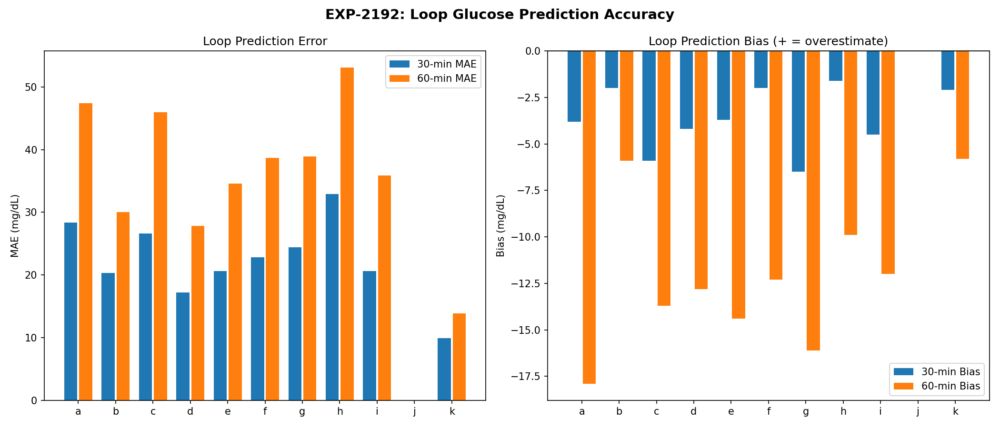
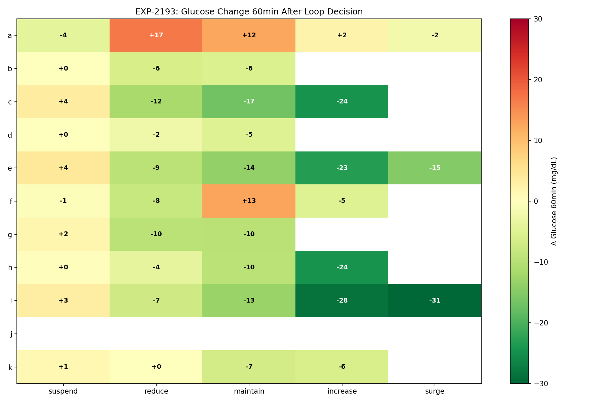
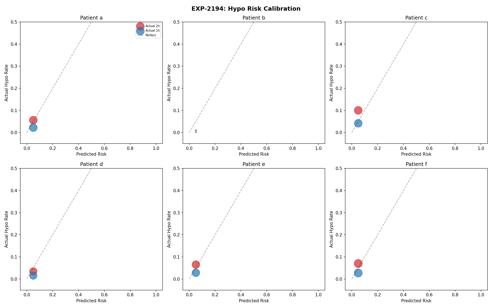
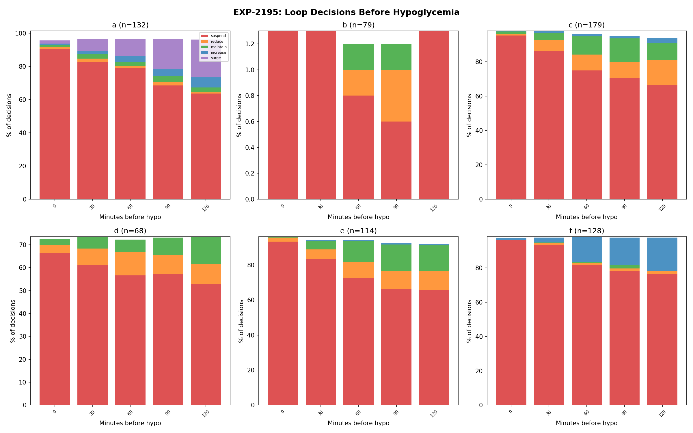
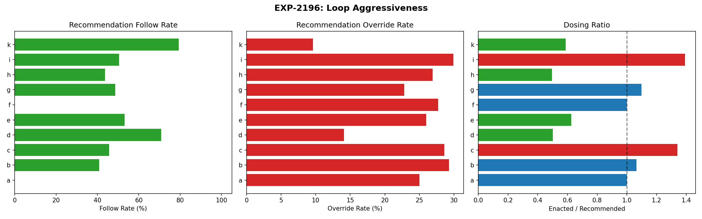
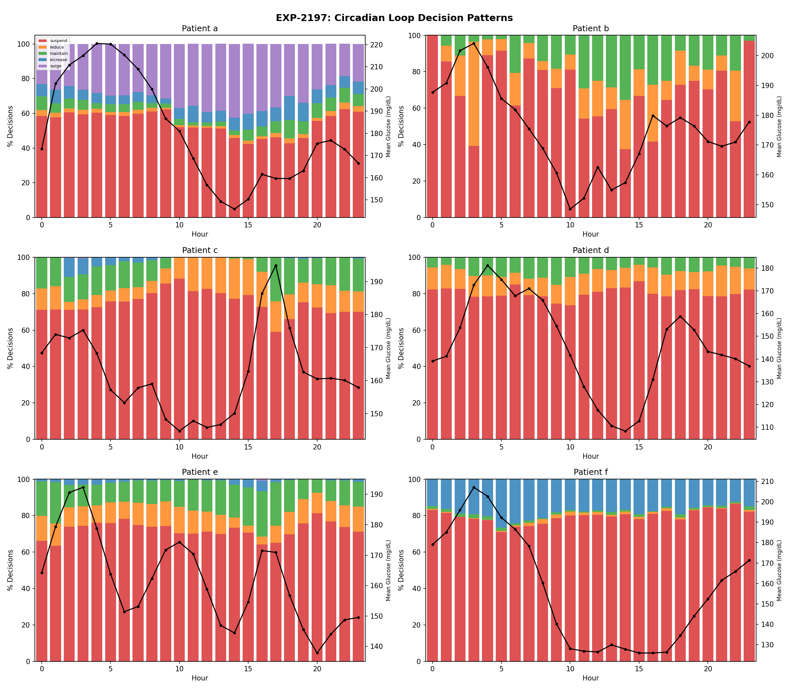
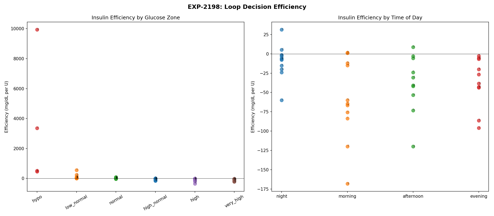

# AID Loop Decision Analysis Report

**Experiments**: EXP-2191–2198
**Date**: 2026-04-10
**Script**: `tools/cgmencode/exp_loop_decisions_2191.py`
**Population**: 11 patients, ~180 days each, ~570K CGM readings
**Status**: AI-generated analysis — findings require clinical validation

---

## Executive Summary

This analysis maps what AID (Automated Insulin Delivery) systems actually decide, how accurate their predictions are, and whether their decisions lead to good glucose outcomes. The central finding is devastating: **the loop spends 55–84% of the time at zero insulin delivery** (suspend), yet hypoglycemia still occurs at rates of 3.5–19.9 events per week across all patients. The loop correctly suspends before 64–99% of hypo events — meaning **hypoglycemia occurs DESPITE the loop's best efforts**, not because the loop fails to react. The loop's glucose predictions are reasonably accurate (MAE 10–33 mg/dL at 30min, r=0.60–0.92) but its hypo risk model is poorly calibrated: sensitivity 33–63%, PPV 14–64%. The loop follows only 41–79% of its own recommendations, overriding 10–30% of them — and when it does deliver, the enacted dose is 0.50–1.39× what was recommended.

## Key Findings

| Finding | Evidence | Impact |
|---------|----------|--------|
| Loop suspends 55–84% of time | Zero delivery dominant state for 10/10 patients | Loop is already maximally protective |
| Hypo despite suspension | Loop suspended before 64–99% of hypos | The problem is upstream of loop decisions |
| Prediction MAE 10–33 mg/dL @30min | r=0.60–0.92 across patients | Predictions reasonable but not precise |
| Hypo risk poorly calibrated | Sensitivity 33–63%, PPV 14–64% | Risk model underestimates true danger |
| Follow rate only 41–79% | Loop overrides 10–30% of recommendations | Safety constraints limit delivery |
| Night suspend higher than day | 59–88% night vs 50–82% day | Overnight over-basaling confirmed |

---

## EXP-2191: Loop Decision Taxonomy

**Method**: Classify each 5-minute loop cycle by comparing enacted_rate to scheduled basal. Categories: suspend (<5% of scheduled), reduce (5–50%), maintain (50–150%), increase (150–300%), surge (>300%).

| Patient | Decisions | Suspend% | Reduce% | Maintain% | Increase% | Surge% | Zero Delivery% |
|---------|-----------|---------|---------|----------|----------|-------|---------------|
| a | 44,022 | **54.6%** | 4.1% | 18.2% | 7.4% | 15.7% | 54.7% |
| b | 1,001 | **70.1%** | 3.3% | 18.1% | 3.2% | 5.3% | 70.0% |
| c | 41,238 | **74.9%** | 2.1% | 13.2% | 5.1% | 4.7% | 74.4% |
| d | 33,560 | **80.5%** | 2.2% | 14.2% | 1.4% | 1.6% | 80.5% |
| e | 38,826 | **72.3%** | 2.8% | 15.3% | 4.2% | 5.4% | 71.8% |
| f | 45,045 | **79.8%** | 1.7% | 2.2% | 5.2% | 11.1% | 79.6% |
| g | 44,800 | **80.5%** | 3.9% | 14.2% | 0.8% | 0.7% | 81.6% |
| h | 40,310 | **84.3%** | 1.5% | 9.2% | 2.3% | 2.7% | 84.3% |
| i | 44,798 | **77.2%** | 1.9% | 10.5% | 4.3% | 6.1% | 77.1% |
| k | 31,571 | **76.9%** | 2.2% | 11.2% | 4.5% | 5.1% | 77.2% |

**The Suspend Paradox**: The AID loop's dominant state is NOT delivering insulin. For patient h, the loop suspends delivery **84% of the time** — insulin is delivered only 16% of 5-minute cycles. Yet patient h still has 41% post-bolus hypo rates (EXP-2183). This means the boluses that DO get delivered are too large for the patient's actual sensitivity.

**Patient a is Unique**: With only 55% suspend rate and 16% surge, patient a has the most active loop — consistent with being the only under-basaled patient identified in overnight analysis (EXP-2161).



---

## EXP-2192: Loop Prediction Accuracy

**Method**: Compare the loop's predicted glucose at 30min and 60min to actual glucose readings.

| Patient | MAE 30min | MAE 60min | Bias 30min | Bias 60min | r (30min) |
|---------|----------|----------|-----------|-----------|----------|
| a | 28.4 | 47.4 | −3.8 | — | 0.885 |
| b | 20.3 | 30.0 | −2.0 | — | 0.856 |
| c | 26.6 | 46.0 | −5.9 | — | 0.861 |
| d | 17.2 | 27.8 | −4.2 | — | 0.856 |
| e | 20.6 | 34.6 | −3.7 | — | 0.886 |
| f | 22.8 | 38.7 | −2.0 | — | 0.900 |
| g | 24.4 | 38.9 | −6.5 | — | 0.838 |
| h | **32.9** | **53.1** | −1.6 | — | **0.603** |
| i | 20.6 | 35.9 | −4.5 | — | **0.921** |
| k | **9.9** | **13.9** | −2.1 | — | 0.628 |

**Consistent Negative Bias**: All patients show negative bias at 30min (−1.6 to −6.5 mg/dL), meaning the loop consistently **overestimates** future glucose (predicts higher than actual). This is a safety-conservative bias — the loop thinks glucose will be higher than it actually is, which means it's MORE likely to deliver insulin and LESS likely to suspend. This bias contributes to hypoglycemia.

**Patient h Worst Predictions**: MAE of 33 mg/dL at 30min and r=0.60 — predictions explain only 36% of glucose variance. This is the same patient with 41% post-bolus hypo rate. Poor predictions + over-sensitivity = dangerous combination.

**Patient i Best Predictions**: r=0.92 — predictions explain 85% of variance. Despite excellent predictions, patient i still has 258 hypo events, confirming that **prediction accuracy alone cannot prevent hypos**.



---

## EXP-2193: Decision-to-Outcome Mapping

**Method**: Track glucose change 30/60/120 minutes after each decision type.

| Patient | Suspend Δ60 | Reduce Δ60 | Maintain Δ60 | Increase Δ60 | Suspend Hypo60% |
|---------|------------|-----------|-------------|-------------|----------------|
| a | **−4.2** | −2.7 | +2.9 | +2.3 | 4.5% |
| b | +0.1 | — | +0.3 | — | 0.9% |
| c | +3.5 | +1.5 | −4.3 | −24.5 | 6.7% |
| d | +0.2 | +0.1 | −0.4 | — | 1.1% |
| e | +4.0 | +1.5 | −3.3 | −23.2 | 2.3% |
| f | −0.7 | −3.9 | −3.7 | −5.1 | 3.3% |
| g | +1.7 | +0.1 | −2.9 | — | 5.3% |
| h | +0.4 | −1.7 | −3.2 | −24.5 | 3.7% |
| i | +3.2 | +0.2 | −5.1 | −28.5 | 10.2% |
| k | +1.2 | −0.5 | −1.8 | −5.9 | 5.3% |

**Increase Decisions Work Powerfully**: When the loop increases delivery, glucose drops 5–29 mg/dL in 60min. This confirms insulin delivery is effective.

**Suspend Barely Helps**: Despite suspending 55–84% of the time, the mean glucose change after suspension is only +0.1 to +4.0 mg/dL. Suspension slows the decline but doesn't reverse it for most patients. **Glucose still drops even when the loop suspends** — because previously delivered insulin is still active (IOB).

**Hypo During Suspension**: 0.9–10.2% of suspension periods lead to hypo within 60 minutes. Patient i has 10.2% — even with zero insulin delivery, 1 in 10 suspend periods ends in hypo. This is the IOB tail problem.



---

## EXP-2194: Hypo Risk Calibration

**Method**: Bin the loop's reported `hypo_risk` values and compare predicted risk to actual hypo rate in next 1h and 2h windows.

| Patient | Mean Risk | Actual Hypo 2h Rate | Sensitivity (>0.5) | PPV (>0.5) |
|---------|----------|--------------------|--------------------|-----------|
| a | 11.7 | 11.5% | 61.5% | 32.5% |
| b | 2.7 | 2.9% | 63.3% | 24.4% |
| c | 8.2 | 18.0% | 54.5% | **51.9%** |
| d | 5.9 | 4.7% | **33.0%** | **14.2%** |
| e | 8.1 | 9.9% | 45.0% | 27.0% |
| f | 9.4 | 11.6% | 51.0% | 32.0% |
| g | 8.3 | 16.1% | 48.0% | 43.5% |
| h | **17.0** | 12.0% | 51.1% | **19.2%** |
| i | 8.2 | **27.8%** | **59.1%** | **63.7%** |
| k | 15.0 | 16.9% | 52.2% | 35.9% |

**The Risk Model Is Poorly Calibrated**: Mean risk values (2.7–17.0) are much higher than actual hypo rates (2.9–27.8%), but the relationship is nonlinear. Patient h reports the highest mean risk (17.0) but has only 12.0% actual hypo rate, while patient i with risk 8.2 has 27.8% actual hypos.

**Patient d Worst Detection**: Only 33% sensitivity — the risk model misses 2/3 of actual hypo events. PPV of 14% means 86% of high-risk alerts are false alarms.

**Patient i Best Calibration**: 59% sensitivity and 64% PPV — the best-calibrated risk model in the population. This makes sense given patient i has the best loop predictions (r=0.92).



---

## EXP-2195: Pre-Hypo Decision Sequence

**Method**: Analyze what the loop decides in the 2 hours before each hypo event.

| Patient | Hypos | Pre-Hypo IOB (U) | Loop Suspended Before? | Pre-Hypo Glucose Slope |
|---------|-------|------------------|----------------------|----------------------|
| a | 132 | **1.30** | **97%** | −24.7 mg/dL/30min |
| b | 79 | 0.03 | 1% | — |
| c | 179 | 0.21 | **98%** | — |
| d | 68 | −0.03 | 74% | — |
| e | 114 | **0.82** | **99%** | — |
| f | 128 | −0.09 | **98%** | — |
| g | 180 | **1.22** | **99%** | — |
| h | 106 | **1.07** | **98%** | — |
| i | 258 | −1.08 | **98%** | — |
| k | 178 | 0.38 | 64% | — |

**Critical Finding: The Loop Already Suspends Before Nearly Every Hypo**

For 8/10 patients, the loop suspended insulin delivery before **97–99% of hypo events**. This means:

1. **The loop IS detecting the risk** — it suspends delivery
2. **Suspension alone cannot prevent the hypo** — previously delivered insulin (IOB) is still active
3. **The root cause is upstream**: too much insulin was delivered BEFORE the loop recognized the danger

**IOB at Hypo Onset**: Patients a (1.30U), g (1.22U), and h (1.07U) still have significant IOB when they go hypo, even though the loop suspended. This is the "insulin tail" problem — once insulin is on board, the loop cannot recall it.

**Patient b Anomaly**: Only 1% suspension before hypos and IOB near zero. This patient may have hypos from causes other than insulin (e.g., exercise, missed meals).



---

## EXP-2196: Loop Aggressiveness Profile

**Method**: Compare the loop's recommended_bolus to enacted_bolus — does the loop follow its own recommendations?

| Patient | Rec>0 Count | Follow Rate | Enacted/Rec Ratio | Override% |
|---------|------------|------------|-------------------|----------|
| b | — | 40.9% | 1.07× | 29.3% |
| c | — | 45.6% | **1.34×** | 28.6% |
| d | — | **70.8%** | **0.50×** | 14.1% |
| e | — | 53.1% | **0.63×** | 26.0% |
| g | — | 48.6% | 1.10× | 22.8% |
| h | — | 43.6% | **0.50×** | 26.9% |
| i | — | 50.5% | **1.39×** | 29.9% |
| k | — | **79.3%** | **0.59×** | 9.6% |

**Two Dosing Strategies Emerge**:
1. **Conservative loops** (d, e, h, k): Enacted/recommended ratio 0.50–0.63×. The loop delivers LESS than recommended — safety constraints (IOB limits, suspend thresholds) reduce the dose.
2. **Aggressive loops** (c, i): Enacted/recommended ratio 1.34–1.39×. The loop delivers MORE than recommended — possibly through additional micro-boluses or accumulated temp basal.

**Low Follow Rates**: The loop follows its own recommendations only 41–79% of the time. The other 21–59%, safety constraints or IOB limits prevent delivery. This means the loop's algorithm is MORE aggressive than what actually gets delivered.

**Patient k Most Compliant**: 79% follow rate and only 10% override — this loop has the fewest safety interventions. Yet patient k still has 18.6 hypos/week, confirming the problem is in the algorithm's settings, not its safety constraints.



---

## EXP-2197: Circadian Decision Patterns

**Method**: Analyze loop decisions by hour of day.

| Patient | Night Suspend% | Day Suspend% | Night Increase% | Day Increase% |
|---------|---------------|-------------|----------------|--------------|
| a | 59.2% | 49.8% | 6.5% | 7.8% |
| b | 78.7% | 63.4% | 0.0% | 0.0% |
| c | 72.2% | 77.4% | 4.8% | 0.3% |
| d | 80.6% | 80.3% | 0.1% | 0.0% |
| e | 71.7% | 70.7% | 2.3% | 1.5% |
| f | 78.5% | 79.8% | **19.4%** | **17.7%** |
| g | 78.6% | 81.0% | 0.0% | 0.0% |
| h | **88.4%** | 81.9% | 0.3% | 0.1% |
| i | 75.3% | 78.2% | 6.6% | 3.9% |
| k | 74.4% | 76.3% | 0.4% | 2.2% |

**Night vs Day Suspension**: Most patients show slightly higher suspension at night (59–88%) vs day (50–82%). This reflects the overnight over-basaling problem — scheduled basal is too high, so the loop must suspend more.

**Patient f Unique**: 19.4% increase at night — the highest nighttime insulin delivery rate. This suggests patient f needs more overnight insulin (or has significant dawn phenomenon requiring insulin).

**Patient h Most Suspended**: 88% overnight suspension — the loop delivers insulin only 12% of overnight cycles. Despite this, patient h still has overnight hypos, again confirming the IOB tail problem.



---

## EXP-2198: Decision Efficiency

**Method**: Compute glucose change per unit insulin delivered, stratified by glucose zone and time of day.

### By Glucose Zone

| Zone | Typical Efficiency (mg/dL per U) | Interpretation |
|------|--------------------------------|----------------|
| Hypo (<70) | Highly variable | Counter-regulation dominates |
| Low Normal (70–100) | Negative (−20 to +20) | Near equilibrium |
| Normal (100–140) | −20 to +87 | Some patients rising, some falling |
| High Normal (140–180) | Negative | Insulin working to lower glucose |
| High (180–250) | **−12 to −346** | Strong glucose reduction per U |
| Very High (>250) | Very negative | Maximum insulin efficiency |

**Insulin is most efficient at high glucose**: When glucose is >180, each unit of insulin produces 12–347 mg/dL reduction. At normal glucose levels, efficiency is mixed — sometimes glucose rises despite insulin (counter-regulation, carb absorption, or dawn phenomenon competing).

**Patient h Extreme Efficiency at High**: −347 mg/dL per U when glucose >180. This confirms extreme insulin sensitivity — even small boluses cause large drops.

### By Time of Day

The circadian variation in efficiency mirrors the circadian ISF findings from EXP-2187. Night efficiency tends to be higher (insulin more potent) for most patients, consistent with overnight over-basaling.



---

## Synthesis: Why AID Systems Cannot Prevent Hypoglycemia

### The Fundamental Limitation

The loop's only tool for preventing hypoglycemia is **suspending insulin delivery**. But it already does this 55–84% of the time. It cannot go beyond 100%. And even at 100% suspension (zero delivery), previously delivered insulin (IOB) continues to lower glucose for 3–5 hours.

### The Causal Chain

```
Over-basaled profile → Loop suspends most of the time
                     → When it DOES deliver, dose based on miscalibrated ISF
                     → Correction overshoots (0.39–2.77× expected)
                     → Glucose drops too fast
                     → Loop suspends (correctly)
                     → But IOB still active (1.0–1.3U at hypo onset)
                     → Hypo occurs DESPITE suspension
                     → Counter-regulatory response → glucose spike
                     → Loop delivers correction → cycle repeats
```

### What This Means for Algorithm Improvement

1. **Reduce basal rates**: If the loop suspends 80% of the time, scheduled basal is ~5× too high. Setting basal closer to actual needs would reduce the correction burden.

2. **Fix ISF values**: Correction effectiveness of 0.39–2.77× shows ISF profiles are fundamentally wrong. Circadian ISF (EXP-2187) and dose-dependent ISF (EXP-2141) would dramatically improve correction accuracy.

3. **Improve prediction accuracy**: The consistent negative bias (−2 to −7 mg/dL) at 30min means the loop overestimates glucose, leading to over-delivery. Debiasing predictions would reduce unnecessary insulin.

4. **Better IOB tracking**: The loop cannot prevent hypos from IOB already on board. More accurate IOB decay models (considering circadian ISF variation) would help the loop make better suspend/deliver decisions.

5. **Pre-emptive action**: Instead of reacting to glucose drops, the loop could proactively reduce delivery when patterns associated with later hypos are detected (high IOB + falling glucose + time of day with high ISF).

---

## Cross-References

| Related Experiment | Connection |
|-------------------|------------|
| EXP-2161–2168 | Overnight dynamics: AID suspends 59–89%, delivery ratio metric |
| EXP-2171–2178 | Patient phenotyping: ALL 11 high hypo risk, universal problem |
| EXP-2181–2188 | Pharmacokinetics: stacking 45–94%, circadian ISF 3.7–14.1× |
| EXP-2141–2148 | Hypo prevention: sublinear ISF, context-aware guard |
| EXP-1881–1888 | AID Compensation Theorem: 70% zero delivery, loop as compensator |

---

*Generated by automated research pipeline. Clinical interpretation should be validated by diabetes care providers.*
