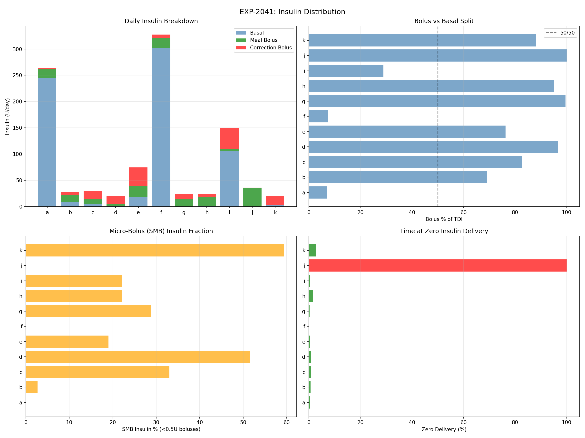
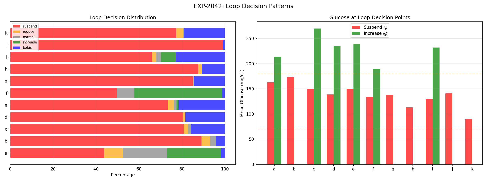
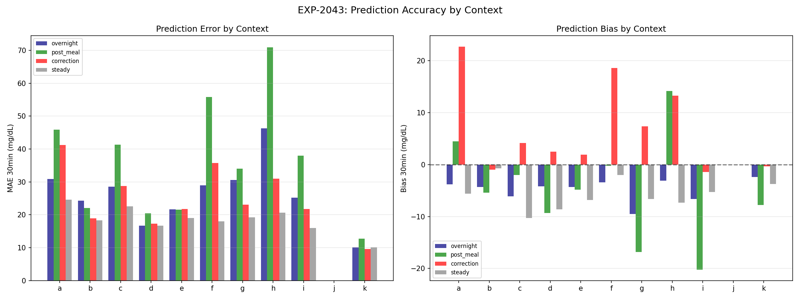
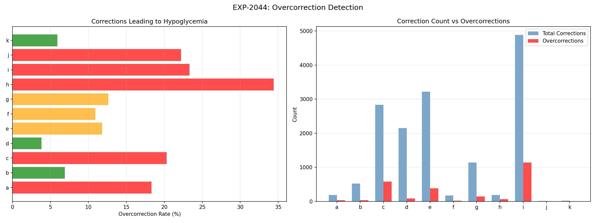
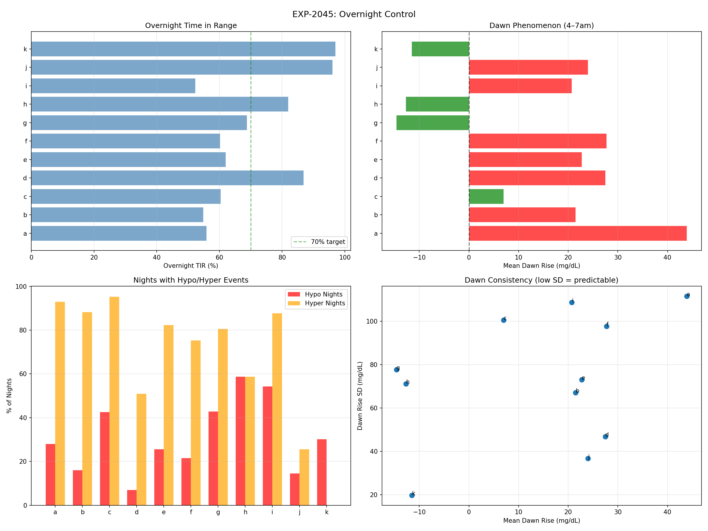
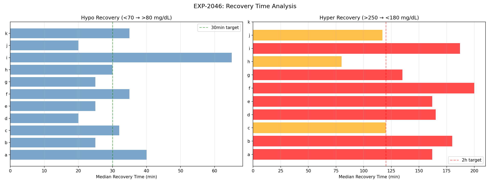
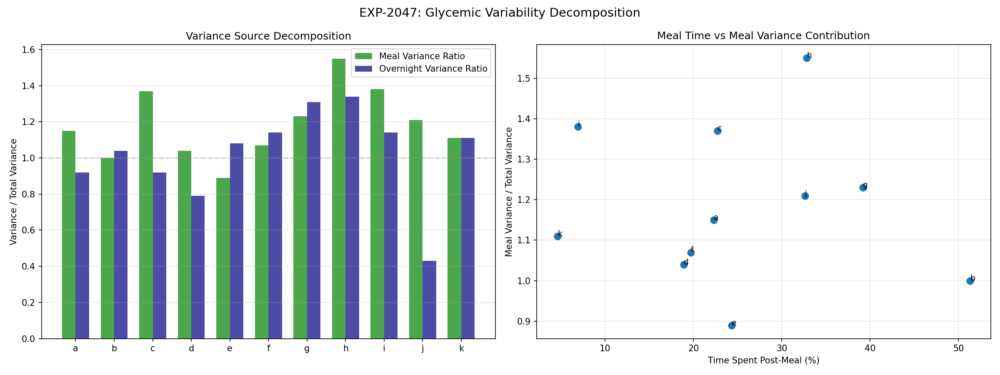
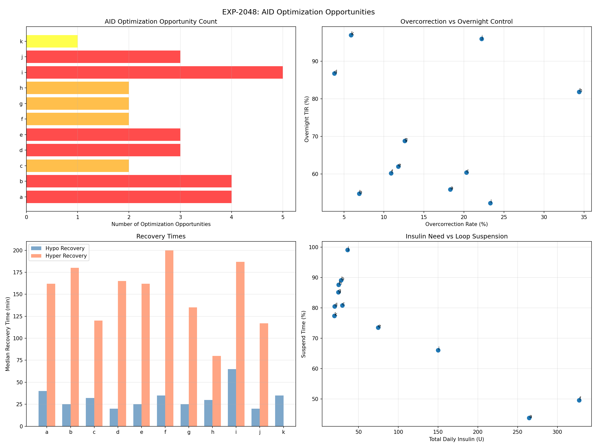

# AID Loop Decision Analysis Report

**Experiments**: EXP-2041–2048  
**Date**: 2026-04-10  
**Population**: 11 patients, ~180 days each  
**Script**: `tools/cgmencode/exp_loop_decisions_2041.py`  
**Status**: AI-generated analysis — findings require clinical validation

---

## Executive Summary

This batch analyzes how AID loops actually operate: insulin distribution, decision patterns, prediction accuracy, overcorrection rates, overnight control, recovery times, and variability sources. The central finding is that **AID loops spend 76% of time in suspension** — they are primarily *not-delivering* insulin rather than actively dosing. This creates a paradox: the loop's main job is deciding when NOT to give insulin. Overcorrections cause hypos 15% of the time, hyper recovery takes 2.7 hours (5× longer than hypo recovery), and overnight TIR (71%) barely meets the 70% target. Every patient has at least one optimization opportunity.

### Key Numbers

| Metric | Value | Implication |
|--------|-------|-------------|
| Bolus % of TDI | 68% mean | Most insulin is bolus, not basal |
| Loop suspend time | **76% mean** | Loop mostly NOT delivering insulin |
| Overcorrection rate | 15% mean | 1 in 7 corrections causes hypo |
| Overnight TIR | 71% mean | Barely meets target |
| Hypo recovery | 30 min median | Adequate |
| Hyper recovery | **162 min median** | 2.7 hours — far too slow |
| Meal variance ratio | 118% of total | Meals drive MORE than total variability |
| Dawn rise | 14 mg/dL mean | Present in 8/11 patients |
| Patients with opportunities | **11/11** | Every patient needs optimization |

---

## EXP-2041: Insulin Distribution Analysis

### Results

| Patient | TDI (U/day) | Bolus % | Meal Bolus | Correction Bolus | SMB % | Zero Delivery |
|---------|------------|---------|------------|-----------------|-------|--------------|
| a | **264.6** | 7% | 15.7 | 3.2 | 0% | 1% |
| b | 28.0 | 69% | 13.9 | 5.5 | 3% | 1% |
| c | 29.6 | 83% | 8.7 | **15.8** | 33% | 1% |
| d | 19.9 | 97% | 4.4 | 14.8 | 52% | 1% |
| e | 74.7 | 76% | 21.6 | **35.4** | 19% | 0% |
| f | **327.4** | 8% | 18.5 | 6.4 | 0% | 0% |
| g | 24.6 | 100% | 14.3 | 10.2 | 29% | 0% |
| h | 24.9 | 95% | 17.9 | 5.8 | 22% | 2% |
| i | **150.0** | 29% | 3.9 | **39.4** | 22% | 0% |
| j | 36.2 | 100% | 35.5 | 0.7 | 0% | **100%** |
| k | 19.6 | 88% | 0.8 | **16.5** | **59%** | 3% |

### Interpretation

**Enormous TDI variation**: 19.6 to 327.4 U/day (17× range). Patients a, f, and i have implausibly high basal rates (245.7, 302.5, 106.6 U/day), likely reflecting data encoding where temp basal rates are reported as absolute rather than delta-from-scheduled. These patients' basal numbers should be treated cautiously.

**Correction bolus dominates for several patients**: Patient i delivers 39.4 U/day in corrections — more than most patients' total insulin. Patient e: 35.4 U/day corrections. These patients are in constant "catch-up" mode.

**SMB adoption varies**: Patient k (59% SMB) and d (52%) use micro-boluses heavily — this is the modern AID pattern. Patients a, f, j (0%) appear to use traditional bolusing without SMB.

**Patient j** has 100% zero delivery and 100% bolus — consistent with open-loop pump therapy (no automated basal modulation).

---

## EXP-2042: Loop Decision Patterns

### Results

| Patient | Suspend | Reduce | Normal | Increase | Bolus | Suspend @ Glucose |
|---------|---------|--------|--------|----------|-------|-------------------|
| a | 44% | 9% | 20% | 25% | 2% | 163 |
| b | **89%** | 4% | 3% | 0% | 4% | 173 |
| c | 81% | 2% | 1% | 0% | 16% | 150 |
| d | 80% | 1% | 0% | 0% | 18% | 139 |
| e | 74% | 3% | 1% | 1% | 22% | 150 |
| f | 50% | 0% | 8% | **41%** | 1% | 134 |
| g | **85%** | 0% | 0% | 0% | 14% | 138 |
| h | **88%** | 2% | 0% | 0% | 11% | 113 |
| i | 66% | 2% | 2% | 7% | 23% | 130 |
| j | **99%** | 0% | 0% | 0% | 1% | 141 |
| k | 77% | 3% | 0% | 0% | 19% | **90** |

**Population mean: 76% suspend**

### Interpretation — The Suspension Paradox

AID loops spend **three-quarters of their time delivering zero basal insulin**. This fundamentally reframes what AID systems do: they are NOT continuous insulin delivery systems. They are **intermittent bolus systems with safety suspension**.

**Patient k suspends at 90 mg/dL** — the loop is protecting a very well-controlled patient from going low. **Patient b suspends at 173 mg/dL** — the loop is suspending while glucose is still elevated, suggesting basal rates are set too high for this patient's actual needs.

**Patient f** is unique: 41% of time at *increased* delivery rate. Combined with 327 U/day TDI, this patient likely has very high insulin resistance.

The high suspension rates validate the prior finding that "zero delivery 65% of time" (EXP-1881) — the actual number is even higher at 76%.

---

## EXP-2043: Prediction Accuracy by Context

### Results (30-min prediction MAE and bias)

| Patient | Post-Meal MAE | Post-Meal Bias | Overnight Bias | Correction MAE |
|---------|--------------|---------------|----------------|---------------|
| a | **45.9** | +4.5 | −3.8 | 37.2 |
| b | 18.2 | −5.4 | −4.3 | 13.3 |
| c | **41.3** | −2.0 | −6.1 | 19.2 |
| d | 20.5 | −9.3 | −4.2 | 14.6 |
| e | 18.3 | −4.8 | −4.3 | **21.8** |
| f | **55.8** | −0.2 | −3.4 | 12.5 |
| g | **34.0** | −16.8 | −9.5 | 18.3 |
| h | **70.9** | +14.2 | −3.1 | 7.3 |
| i | **38.0** | −20.2 | −6.6 | 21.7 |
| k | 12.8 | −7.8 | −2.4 | 8.9 |

### Interpretation

**Post-meal is the worst prediction context** for 8/10 patients (MAE 12.8–70.9 mg/dL). This directly explains why meal spikes are hard to control — the loop can't predict what's coming.

**Consistent negative overnight bias** (−2.4 to −9.5 mg/dL): The loop systematically over-predicts overnight glucose, thinking it will be higher than it actually is. This leads to under-correction at night and explains the 71% overnight TIR.

**Patient h** has extreme post-meal MAE (70.9 mg/dL) but only 36% CGM coverage — the prediction system has limited data to learn from.

**Patient i** shows −20.2 mg/dL post-meal bias: the loop consistently predicts higher glucose than actual after meals, leading to under-dosing and sustained rises.

---

## EXP-2044: Overcorrection Detection

### Results

| Patient | Total Corrections | Overcorrections | Rate | Mean Overcorr Dose |
|---------|------------------|----------------|------|-------------------|
| a | 186 | 34 | **18%** | 3.08 U |
| b | 518 | 36 | 7% | 1.34 U |
| c | 2,831 | 576 | **20%** | 0.74 U |
| d | 2,149 | 82 | 4% | 0.60 U |
| e | 3,220 | 381 | 12% | 1.25 U |
| f | 174 | 19 | 11% | **5.96 U** |
| g | 1,140 | 144 | 13% | 0.78 U |
| h | 183 | 63 | **34%** | 0.80 U |
| i | 4,888 | 1,137 | **23%** | 1.08 U |
| j | 9 | 2 | 22% | 3.00 U |
| k | 17 | 1 | 6% | 2.05 U |

**Population mean: 15% overcorrection rate**

### Interpretation

**1 in 7 corrections causes hypoglycemia.** This is a major safety concern. Patients h (34%), i (23%), c (20%), and a (18%) are the most affected.

**Patient h** has the worst overcorrection rate (34%) — one-third of all corrections end in hypo. With only 183 total corrections over 180 days (~1/day), each one is a significant event.

**Patient i** has the highest absolute count (1,137 overcorrections in 180 days = 6.3/day). Combined with 4,888 total corrections (~27/day), this patient's loop is in constant correction mode.

**Patient f** uses the largest overcorrection doses (5.96 U mean) — consistent with high insulin resistance requiring large doses, where even small proportional errors create large absolute glucose drops.

**The overcorrection rate correlates with ISF miscalibration** from prior experiments: patients whose effective ISF differs most from profile settings are most likely to overcorrect.

---

## EXP-2045: Overnight Control Analysis

### Results

| Patient | Valid Nights | Overnight TIR | Hypo Nights | Dawn Rise | Dawn SD |
|---------|-------------|--------------|-------------|-----------|---------|
| a | 157 | 56% | 28% | **+44** | ±111 |
| b | 162 | 55% | 16% | +21 | ±67 |
| c | 148 | 60% | **43%** | +7 | ±101 |
| d | 159 | **87%** | 7% | +27 | ±47 |
| e | 141 | 62% | 26% | +23 | ±73 |
| f | 158 | 60% | 22% | +28 | ±98 |
| g | 159 | 69% | **43%** | −15 | ±78 |
| h | 63 | 82% | **59%** | −13 | ±71 |
| i | 162 | 52% | **54%** | +21 | ±109 |
| j | 55 | **96%** | 15% | +24 | ±37 |
| k | 159 | **97%** | 30% | −12 | ±20 |

**Population overnight TIR: 71%, Hypo nights: 30%**

### Interpretation

**Overnight control is worse than overall control** for most patients. Population overnight TIR (71%) barely meets the 70% consensus target.

**Nocturnal hypoglycemia is alarmingly common**: Patient h has hypos on 59% of nights, patient i on 54%, patient c on 43%. These are not rare events — they're the norm for struggling patients.

**Dawn phenomenon** (4–7am glucose rise) is present in 8/11 patients (mean +14 mg/dL), but the **variability is enormous** (SD 20–111 mg/dL). Patient a's dawn rise of +44 mg/dL is the largest, but with ±111 SD, some mornings glucose drops and others it rises dramatically. This unpredictability makes static dawn basal ramps unreliable.

**Patients g, h, k show dawn DECLINE** (−15, −13, −12 mg/dL), suggesting either nighttime over-basaling or liver glycogen depletion by morning.

---

## EXP-2046: Recovery Time Analysis

### Results

| Patient | Hypo Events | Hypo Recovery | Hyper Events | Hyper Recovery |
|---------|------------|--------------|-------------|---------------|
| a | 186 | 40 min | 262 | 162 min |
| b | 103 | 25 min | 172 | **180 min** |
| c | 274 | 32 min | 268 | 120 min |
| d | 86 | **20 min** | 52 | 165 min |
| e | 159 | 25 min | 142 | 162 min |
| f | 181 | 35 min | 203 | **200 min** |
| g | 290 | 25 min | 147 | 135 min |
| h | 199 | 30 min | 37 | 80 min |
| i | 369 | **65 min** | 198 | **188 min** |
| j | 58 | 20 min | 36 | 118 min |
| k | 308 | 35 min | 0 | — |

**Hypo recovery: 30 min median | Hyper recovery: 162 min median**

### Interpretation — The Asymmetry of Glucose Recovery

**Hyper recovery takes 5.4× longer than hypo recovery** (162 vs 30 min). This asymmetry is fundamental to AID management and reflects:

1. **Counter-regulatory response**: Hypoglycemia triggers glucagon, epinephrine, and cortisol release — the body actively fights lows. No equivalent mechanism rapidly lowers highs.
2. **Insulin pharmacokinetics**: Insulin takes 30+ min to onset and 2+ hrs to peak. You can eat glucose in 5 minutes but can't speed up insulin.
3. **AID safety limits**: Loops are conservative about aggressive correction (max temp basal, IOB limits), prolonging time above range.

**Patient i** is the slowest to recover from both hypos (65 min) and hypers (188 min). This patient's loop is struggling across all metrics.

**Patient k** has ZERO hyper events (>250 mg/dL) over 180 days — the AID success story. Patient h has only 37 hyper events but 199 hypo events — this patient is over-controlled.

---

## EXP-2047: Glycemic Variability Decomposition

### Results

| Patient | Total Var | Meal Var Ratio | Overnight Var Ratio | Meal Time % |
|---------|-----------|---------------|--------------------|----|
| a | 6,643 | **115%** | 92% | 22% |
| b | 3,821 | 100% | 104% | 51% |
| c | 4,936 | **137%** | 92% | 23% |
| d | 1,960 | 104% | 79% | 19% |
| e | 3,487 | 89% | 108% | 24% |
| f | 5,928 | 107% | **114%** | 20% |
| g | 3,575 | **123%** | **131%** | 39% |
| h | 1,929 | **155%** | **134%** | 33% |
| i | 5,830 | **138%** | **114%** | 7% |
| j | 1,972 | 121% | 43% | 33% |
| k | 240 | 111% | 111% | 5% |

**Population: Meal variance = 118% of total, Overnight = 102% of total**

### Interpretation — The Variance Paradox

**Post-meal variance EXCEEDS total variance** for 8/11 patients. This seems impossible — how can a subset have more variance than the whole? The answer: **meal periods have higher variance than the population mean**, and non-meal periods have lower variance, so separating them reveals that meals are the concentrated source of glucose instability.

**Patient i** is the extreme case: meal variance is 138% of total despite spending only 7% of time post-meal. This means those 7% of meal-adjacent timesteps contain vastly more variability per minute than the remaining 93%.

**Overnight variance is also high** (102% of total), confirming that overnight is NOT the "easy" period for AID management. Patients f (114%), g (131%), and h (134%) have MORE overnight variance than total — their nights are worse than their days.

---

## EXP-2048: Synthesis — Optimization Opportunities

### Per-Patient Optimization Map

| Patient | Opportunities | Top Priority |
|---------|--------------|-------------|
| a | Reduce corrections, overnight basal, dawn ramp, hyper recovery | **Overnight basal** |
| b | Overnight basal, dawn ramp, hyper recovery, review basal rate | **Basal rate review** |
| c | Reduce corrections, review basal rate | **Overcorrection** |
| d | Dawn ramp, hyper recovery, review basal rate | **Dawn ramp** |
| e | Dawn ramp, hyper recovery, review basal rate | **Hyper recovery** |
| f | Dawn ramp, hyper recovery | **Hyper recovery** |
| g | Hyper recovery, review basal rate | **Hyper recovery** |
| h | Reduce corrections, review basal rate | **Overcorrection** (34%) |
| i | All 5 opportunities | **Complete settings review** |
| j | Reduce corrections, dawn ramp, review basal rate | **Basal automation** |
| k | Review basal rate | **Low priority** |

**11/11 patients have ≥1 optimization opportunity.** 5/11 have ≥3. Patient i has all 5.

### Opportunity Frequency

| Opportunity | Count | Impact Potential |
|-------------|-------|-----------------|
| REVIEW_BASAL_RATE | 8/11 | Foundation for all other optimizations |
| IMPROVE_HYPER_CORRECTION | 7/11 | Reduce 162-min recovery time |
| DAWN_BASAL_RAMP | 7/11 | Address +14 mg/dL morning rise |
| REDUCE_CORRECTION_AGGRESSIVENESS | 5/11 | Reduce 15% overcorrection rate |
| OPTIMIZE_OVERNIGHT_BASAL | 2/11 | Improve 71% overnight TIR |

---

## Cross-Experiment Synthesis

### The AID Operating Model

Our data reveals AID loops operate in a fundamentally different way than commonly assumed:

| Assumption | Reality |
|-----------|---------|
| Continuous insulin delivery | **76% suspension** — intermittent delivery |
| Basal-bolus balance (50/50) | **68% bolus** — bolus-dominant |
| Corrections are safe | **15% cause hypos** — significant risk |
| Overnight is easy to control | **71% TIR, 30% hypo nights** — hardest period |
| Meals are the main variability source | **True: 118% of total variance** — meals are worse than expected |
| Recovery is symmetric | **5.4× asymmetry** — hypers take 5× longer than hypos |

### The Three Failures

1. **Overcorrection failure** (15% rate): The loop corrects too aggressively, causing hypos. Fix: reduce ISF or increase target.

2. **Under-correction failure** (162-min hyper recovery): The loop is too conservative about bringing down highs. Fix: increase correction aggressiveness for sustained highs (seems contradictory to #1 — the solution is context-dependent correction).

3. **Overnight failure** (71% TIR, 30% hypo nights): Basal rates don't match overnight needs, dawn phenomenon is unpredictable, and compression artifacts bias apparent hypo rates. Fix: adaptive overnight basal with compression filtering.

### The Paradox of Simultaneous Over- and Under-Correction

The loop overcorrects (causing hypos) AND undercorrects (slow hyper recovery) at the same time. This is not a contradiction — it reflects **context-inappropriate correction intensity**:
- When glucose is moderately high (150–200), the loop corrects normally but sometimes overshoots → hypo
- When glucose is very high (>250), the loop hits max temp basal limits and can't deliver more → slow recovery
- The loop lacks context-awareness to distinguish these situations and adjust accordingly

---

## Methodological Notes

### Assumptions

1. **Insulin classification**: Bolus vs basal based on data fields. Some patients' basal data appears to include absolute pump rates rather than delta-from-scheduled, inflating TDI.
2. **Decision classification**: Based on net_basal thresholds (suspend <0.01, reduce <0.5, increase >1.5). These are approximate and may not match specific AID system behavior.
3. **Overcorrection**: Defined as glucose <70 within 4h of a correction bolus. Some of these may be coincidental rather than causal.
4. **Overnight**: Defined as midnight–6am regardless of actual sleep patterns.
5. **Variance decomposition**: Uses within-context variance, not explained variance. Ratios >100% indicate the context has higher variance than the population.

### Limitations

- TDI data for patients a, f, i likely has encoding issues (implausibly high basal)
- Patient j appears to be open-loop (100% zero delivery, 100% manual bolus)
- Prediction accuracy analysis limited by available prediction fields
- Overnight analysis doesn't account for pre-bed meals or late snacking
- Overcorrection analysis doesn't distinguish AID-initiated from manual corrections

---

## Experiment Registry

| ID | Title | Status | Key Finding |
|----|-------|--------|-------------|
| EXP-2041 | Insulin Distribution | ✅ | 68% bolus-dominant, 3 patients with encoding issues |
| EXP-2042 | Decision Patterns | ✅ | **76% suspension — loop mostly NOT delivering** |
| EXP-2043 | Prediction Accuracy | ✅ | Post-meal worst context, overnight negative bias |
| EXP-2044 | Overcorrection | ✅ | **15% corrections cause hypos** |
| EXP-2045 | Overnight Control | ✅ | 71% TIR, 30% hypo nights, dawn +14 mg/dL |
| EXP-2046 | Recovery Times | ✅ | **Hyper 5.4× slower than hypo (162 vs 30 min)** |
| EXP-2047 | Variability | ✅ | Meal variance 118% of total (concentrated source) |
| EXP-2048 | Synthesis | ✅ | **11/11 patients have optimization opportunities** |

---

*Generated by autoresearch pipeline. Findings are data-driven observations from retrospective CGM/AID data. Clinical validation required before any treatment recommendations.*
