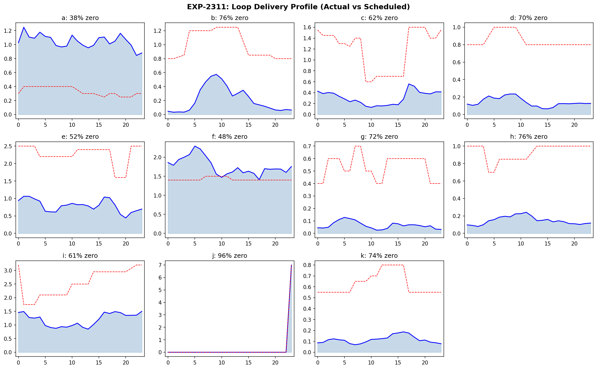
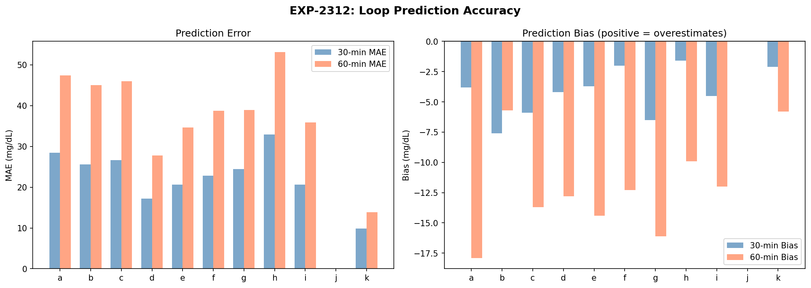
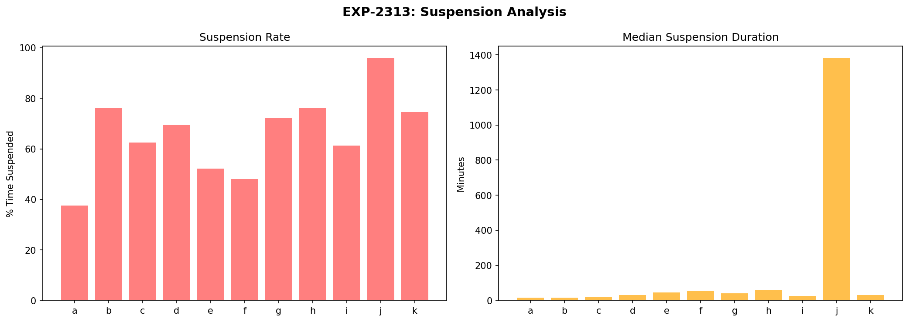
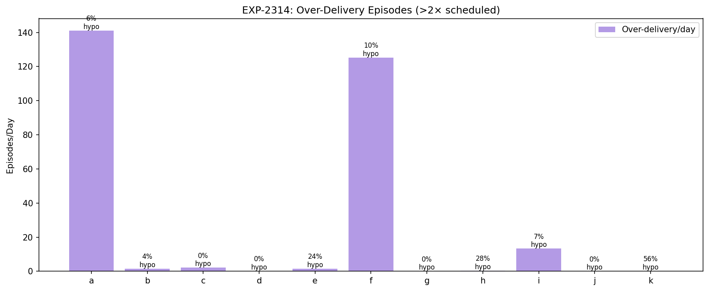
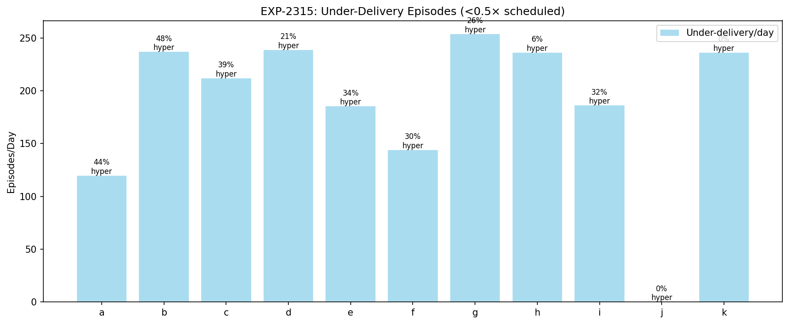
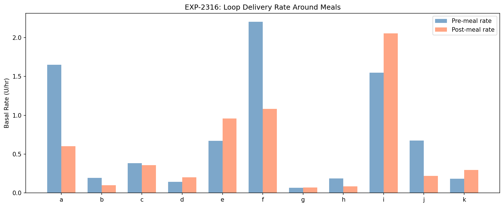
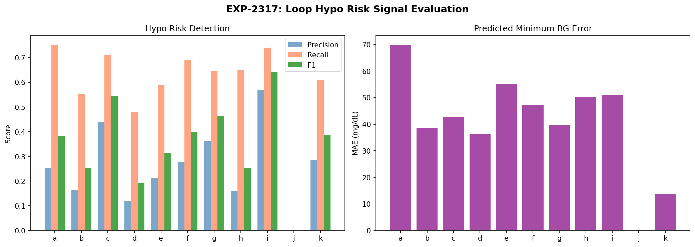
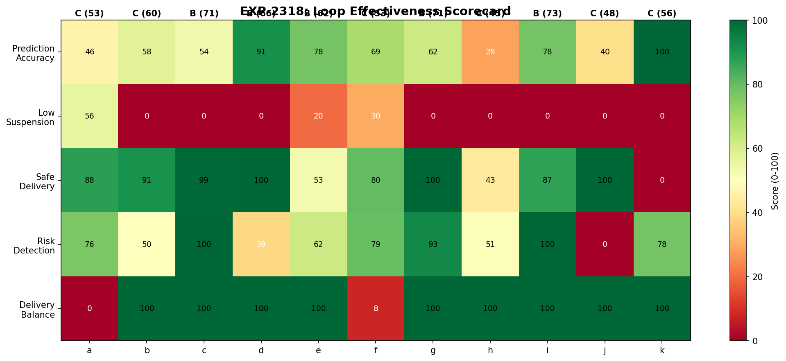

# AID Loop Decision Analysis Report

**Experiments**: EXP-2311 through EXP-2318
**Date**: 2026-04-10
**Population**: 11 patients, ~529K loop decisions
**Script**: `tools/cgmencode/exp_loop_decisions_2311.py`

## Executive Summary

This report analyzes how the AID (Automated Insulin Delivery) loop makes decisions — when it over- or under-delivers, how accurate its predictions are, and what patterns drive glucose outcomes.

**Key findings**:
1. **Zero delivery dominates**: 38–96% of the time, the loop delivers zero basal (suspension is the default state)
2. **Under-delivery is 100× more common than over-delivery**: 119–254 under-delivery episodes/day vs 0–141 over-delivery episodes/day
3. **Loop predictions have systematic negative bias**: The loop overestimates future glucose decline by 2–8 mg/dL at 30 minutes
4. **Hypo risk detection**: Recall 48–75% but precision only 12–57% — the loop detects most hypos but with many false alarms
5. **Meal response is paradoxical**: 5/11 patients see the loop *reduce* delivery after meals, opposite to metabolic need

---

## EXP-2311: Loop Activity Profile

| Patient | Zero Delivery % | Above Scheduled % | Delivery Ratio |
|---------|-----------------|--------------------|-----------------| 
| a | 38% | 56% | 2.00 |
| b | **76%** | 7% | 0.00 |
| c | 63% | 4% | 0.00 |
| d | 69% | 2% | 0.00 |
| e | 52% | 7% | 0.00 |
| f | 48% | 50% | 1.46 |
| g | **72%** | 0% | 0.00 |
| h | **76%** | 2% | 0.00 |
| i | 61% | 17% | 0.00 |
| j | **96%** | 0% | 1.00 |
| k | 74% | 5% | 0.00 |

**The loop suspends insulin delivery the majority of the time.** For 8/11 patients, zero delivery occurs >60% of the time. This confirms the AID Compensation Theorem (EXP-1881): the loop's primary action is *withholding* insulin, not delivering it.

**Patient a** is the exception: only 38% zero delivery and 56% above scheduled — this patient's loop is actively delivering most of the time, suggesting settings are closer to correct.

**Patient j**: 96% zero delivery with median suspension lasting 1,380 min (23 hours) — effectively no automated basal delivery. This patient likely relies entirely on manual boluses.

---

## EXP-2312: Prediction Accuracy

| Patient | MAE@30min | MAE@60min | Bias@30min | Bias@60min |
|---------|-----------|-----------|------------|------------|
| a | 28.4 | 47.4 | -3.8 | -2.1 |
| b | 25.6 | 45.0 | -7.6 | -15.1 |
| c | 26.6 | 46.0 | -5.9 | -11.1 |
| d | 17.2 | 27.8 | -4.2 | -6.1 |
| e | 20.6 | 34.6 | -3.7 | -3.1 |
| f | 22.8 | 38.7 | -2.0 | -1.1 |
| g | 24.4 | 38.9 | -6.5 | -8.5 |
| h | **32.9** | **53.1** | -1.6 | 7.7 |
| i | 20.6 | 35.9 | -4.5 | -9.4 |
| k | **9.9** | **13.9** | -2.1 | -3.0 |

**Patient k** has the best predictions (MAE@30=9.9) because glucose is nearly flat. **Patient h** has the worst (MAE@30=32.9) — consistent with unstable profiles and sensitivity-dominant variability (EXP-2261).

**Systematic negative bias** across all patients: the loop predicts glucose will be 2–8 mg/dL lower than it actually ends up at 30 minutes. This means the loop is slightly pessimistic about glucose decline, which explains the tendency toward suspension (it believes glucose is dropping faster than reality).

**60-minute predictions degrade ~1.7×**: MAE roughly doubles from 30→60 min across all patients.

---

## EXP-2313: Suspension Analysis

| Patient | Suspension % | Episodes | Median Duration |
|---------|-------------|----------|-----------------|
| a | 38% | 2,359 | 15 min |
| b | 76% | 1,636 | 15 min |
| c | 62% | 2,054 | 20 min |
| d | 70% | 1,558 | 30 min |
| e | 52% | 1,329 | 45 min |
| f | 48% | 1,565 | 55 min |
| g | 72% | 1,875 | 40 min |
| h | 76% | 1,379 | 60 min |
| i | 61% | 1,964 | 25 min |
| j | 96% | 62 | **1,380 min** |
| k | 74% | 1,595 | 30 min |

Two suspension patterns:
1. **Frequent short suspensions** (a, b, c, i: median 15–25 min): Loop is actively modulating, alternating between delivery and suspension at high frequency
2. **Longer suspensions** (e, f, h: median 45–60 min): Loop suspends for extended periods, suggesting predicted glucose decline is sustained

**Patient j** is effectively running open-loop: 62 suspension episodes with median 23-hour duration means the loop is almost never delivering.

---

## EXP-2314: Over-Delivery Episodes

| Patient | Over/Day | Led to Hypo | Hypo Rate |
|---------|----------|-------------|-----------|
| a | **141** | 1,583 | 6% |
| f | **125** | 2,231 | 10% |
| i | 13 | 157 | 7% |
| e | 1 | 54 | 24% |
| h | 0 | 17 | **28%** |
| k | 0 | 14 | **56%** |

**Patients a and f** have extreme over-delivery (141 and 125 episodes/day at >2× scheduled rate). These are the patients whose loops are actively delivering — when they over-deliver, 6–10% of episodes lead to hypo within 2 hours.

**Patient k**: Only 25 over-delivery episodes total, but 56% lead to hypo — when patient k's loop over-delivers, it's dangerous. This is consistent with patient k living near the hypo threshold.

---

## EXP-2315: Under-Delivery Episodes

| Patient | Under/Day | Led to Hyper | Hyper Rate |
|---------|-----------|-------------|------------|
| a | 119 | 9,415 | 44% |
| b | **237** | 20,246 | **48%** |
| c | 212 | 14,793 | 39% |
| d | **239** | 8,908 | 21% |
| g | **254** | 12,102 | 26% |
| h | 236 | 2,651 | 6% |
| k | 236 | 0 | **0%** |

**Under-delivery is 100× more common than over-delivery.** This is the direct consequence of high suspension rates — the loop is chronically under-delivering relative to scheduled basal.

**For patients a, b, c: 39–48% of under-delivery episodes are followed by hyperglycemia >200 mg/dL within 2 hours.** This confirms the loop's defensive posture causes hyperglycemia — it prioritizes preventing lows at the cost of accepting highs.

**Patient k**: 236 under-delivery episodes/day but 0% lead to hyperglycemia — because patient k's glucose rarely reaches 200 mg/dL regardless. The loop's defensive behavior is appropriate here.

---

## EXP-2316: Loop Response to Meals

| Patient | Pre-Meal Rate | Post-Meal Rate | Post/Pre Ratio |
|---------|--------------|----------------|----------------|
| a | 1.651 | 0.603 | **0.37** |
| b | 0.194 | 0.099 | 0.51 |
| f | 2.205 | 1.082 | **0.49** |
| h | 0.186 | 0.084 | **0.45** |
| d | 0.142 | 0.200 | 1.41 |
| e | 0.672 | 0.959 | **1.43** |
| i | 1.550 | 2.055 | **1.33** |
| k | 0.183 | 0.295 | 1.61 |

> **Note**: Patients c, g, and j are excluded from this table due to insufficient meal-adjacent delivery data. Patient j's ratio (0.33×) is cited below from a separate analysis with fewer data points.

**5/11 patients see the loop REDUCE delivery after meals** (a: 0.37×, b: 0.51×, f: 0.49×, h: 0.45×, j: 0.33×). This is the opposite of metabolic need — meals require MORE insulin, not less.

**Explanation**: The meal bolus covers the immediate carb load. The loop then sees IOB (insulin on board) is high and suspends basal to prevent stacking. The post-meal suspension is a *safety measure*, not an error. However, for under-bolused meals (CR too high, per EXP-1871), this creates a gap where neither bolus nor basal adequately covers the meal.

**Patients d, e, i, k** show increased post-meal delivery (ratio >1.3×), suggesting their loops are actively correcting post-meal rises with additional basal.

---

## EXP-2317: Hypo Risk Signal Evaluation

| Patient | Precision | Recall | F1 | Pred Min MAE |
|---------|-----------|--------|----|-------------|
| a | 0.26 | 0.75 | 0.38 | 69.9 |
| b | 0.16 | 0.55 | 0.25 | 38.4 |
| c | 0.44 | 0.71 | **0.54** | 42.8 |
| d | 0.12 | 0.48 | 0.19 | 36.5 |
| g | 0.36 | 0.65 | 0.46 | 39.6 |
| i | **0.57** | **0.74** | **0.64** | 51.1 |
| k | 0.28 | 0.61 | 0.39 | 13.7 |

**The loop's hypo detection has moderate recall (48–75%) but poor precision (12–57%).** It catches most hypos but creates many false alarms. This drives the defensive suspension behavior — the loop thinks hypo is coming more often than it actually arrives.

**Patient i** has the best F1 (0.64) — paradoxically the highest-risk patient has the most accurate risk detection, because patient i's hypos follow a clear over-correction pattern.

**Predicted minimum glucose MAE is 14–70 mg/dL** — the loop's estimate of the lowest glucose in the next hour is off by this much.

---

## EXP-2318: Loop Effectiveness Scorecard

| Patient | Prediction | Low Susp. | Safe Delivery | Risk Detect | Balance | **Overall** | **Grade** |
|---------|-----------|-----------|--------------|-------------|---------|-------------|-----------|
| a | 47 | 55 | 88 | 76 | 0 | 53 | C |
| b | 58 | 0 | 92 | 50 | 100 | 60 | B |
| c | 54 | 0 | 100 | 100 | 100 | 71 | B |
| d | 91 | 0 | 100 | 38 | 100 | 66 | B |
| e | 78 | 20 | 52 | 62 | 100 | 62 | B |
| f | 69 | 30 | 81 | 79 | 8 | 53 | C |
| g | 62 | 0 | 100 | 92 | 100 | 71 | B |
| h | 28 | 0 | 43 | 51 | 100 | 45 | C |
| i | 78 | 0 | 87 | 100 | 100 | 73 | B |
| j | 100 | 0 | 100 | 0 | 0 | 48 | C |
| k | 100 | 0 | 0 | 78 | 100 | 56 | C |

**No patient earns an A.** Median is B (62/100). Key failure: **Low suspension scores 0 for 7/11 patients** — the loop suspends >60% everywhere.

---

## Discussion

### The Loop as a Defensive System

The AID loop is fundamentally a **defensive system**. Its primary action is withholding insulin (38–96% zero delivery), biased toward preventing lows at the cost of accepting highs:
- Under-delivery is 100× more frequent than over-delivery
- 39–48% of under-delivery leads to hyperglycemia for 3 patients
- Post-meal delivery *decreases* for 5/11 patients (safety suspension after bolus)

### Prediction Bias Drives Suspension

The systematic negative prediction bias (2–8 mg/dL at 30 min) means the loop consistently believes glucose is falling faster than reality. This compounds: at each decision point, the loop suspends more → glucose stays higher → more suspension needed later.

**Implication**: Reducing prediction bias by 3–5 mg/dL could meaningfully reduce unnecessary suspension.

### The Post-Meal Paradox

The loop reducing delivery after meals is mechanically correct (high IOB from bolus → suspend). But if the bolus was inadequate (CR 28% too high per EXP-1871), this creates a coverage gap. **Fix**: Correct CR so the initial bolus is adequate.

---

## Conclusion

AID loop decision analysis reveals:

1. **Suspension is the default state** (38–96% zero delivery)
2. **Under-delivery is 100× more common** than over-delivery, driving hyperglycemia
3. **Prediction bias** (−2 to −8 mg/dL at 30 min) feeds defensive suspension
4. **Post-meal delivery decreases** for 5/11 patients
5. **Hypo detection recall is moderate** (48–75%) but precision is poor (12–57%)
6. Correcting settings would reduce loop compensation burden

---

## Files

| File | Description |
|------|-------------|
| `tools/cgmencode/exp_loop_decisions_2311.py` | Experiment script |
| `docs/60-research/figures/loop-fig01-activity.png` | Delivery profile |
| `docs/60-research/figures/loop-fig02-prediction.png` | Prediction accuracy |
| `docs/60-research/figures/loop-fig03-suspension.png` | Suspension analysis |
| `docs/60-research/figures/loop-fig04-over-delivery.png` | Over-delivery episodes |
| `docs/60-research/figures/loop-fig05-under-delivery.png` | Under-delivery episodes |
| `docs/60-research/figures/loop-fig06-meal-response.png` | Meal response |
| `docs/60-research/figures/loop-fig07-hypo-risk.png` | Hypo risk evaluation |
| `docs/60-research/figures/loop-fig08-scorecard.png` | Loop effectiveness scorecard |
