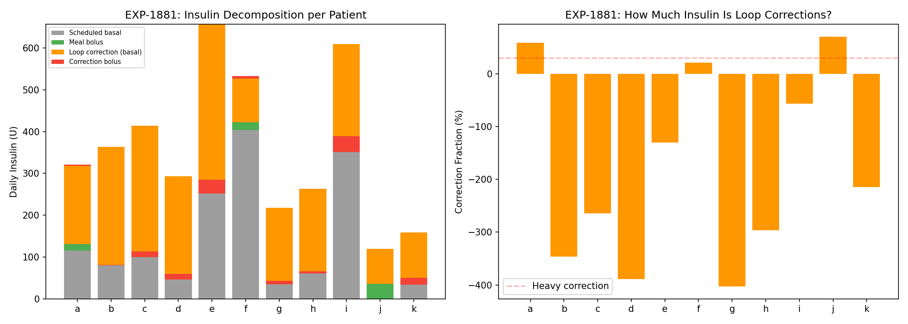
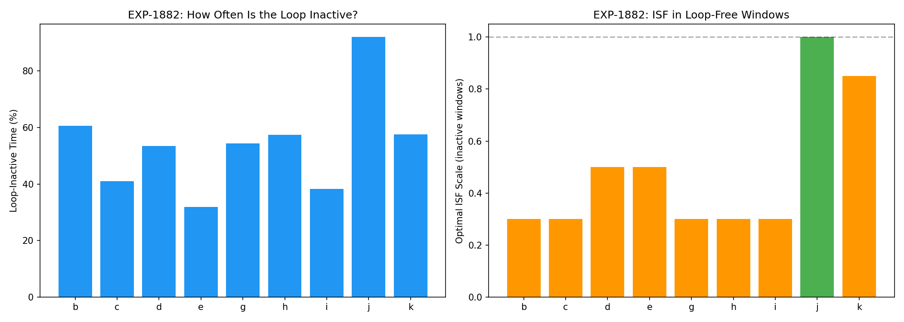
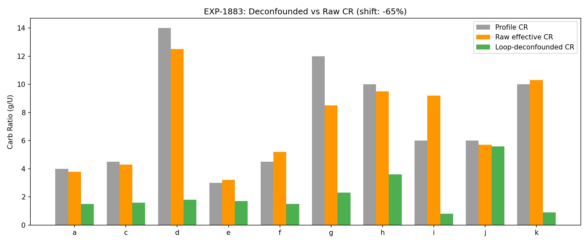
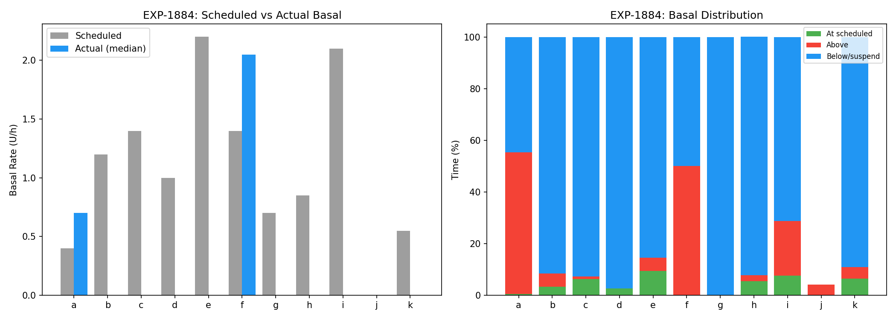
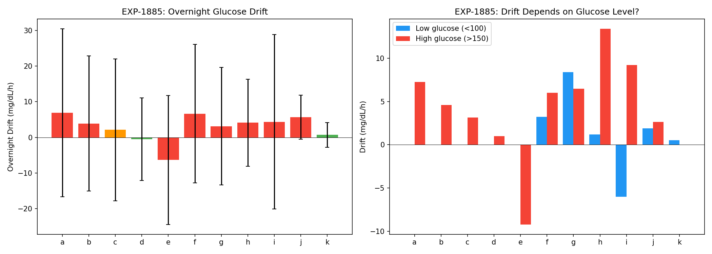
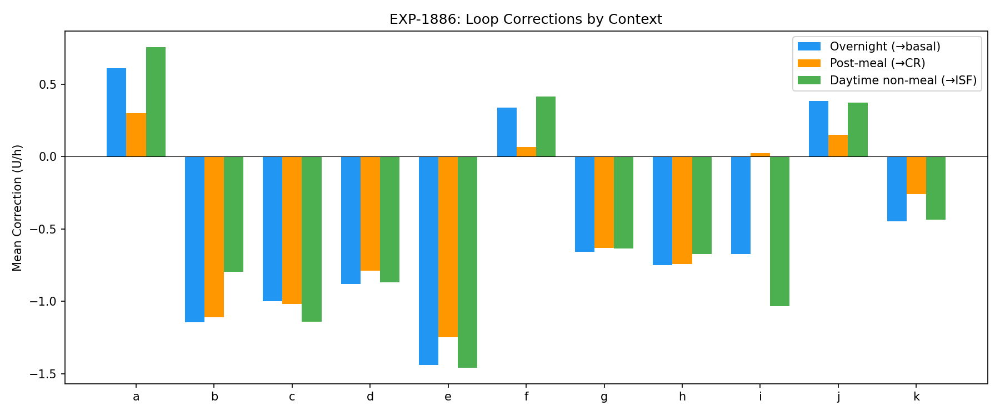
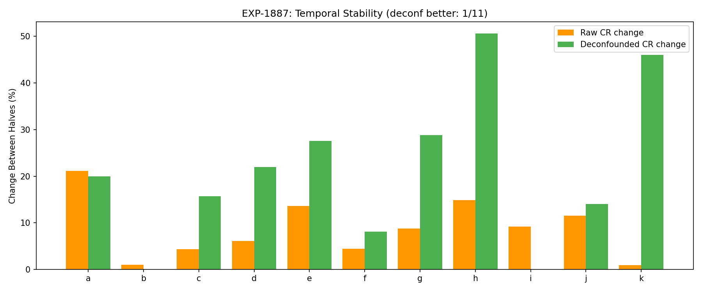
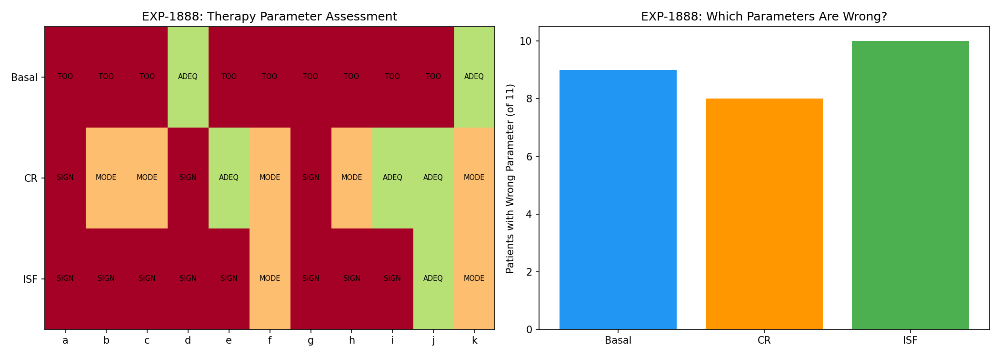

# Loop-Deconfounded Therapy Estimation Report

**Date**: 2026-04-10  
**Experiments**: EXP-1881–1888  
**Script**: `tools/cgmencode/exp_loop_deconfound_1881.py`  
**Population**: 11 patients, ~180 days each, 5-min CGM + AID insulin data  
**Generated by**: AI autoresearch pipeline (data-first, naive perspective)

## Executive Summary

AID (Automated Insulin Delivery) loops dramatically reshape insulin delivery, making therapy settings appear correct when they fundamentally are not. This report decomposes loop corrections from raw observations to assess the **true** accuracy of programmed basal rates, carb ratios (CR), and insulin sensitivity factors (ISF).

**Core finding**: The AID loop is a *compensating controller* that hides setting errors. On average, patients have **2.5 of 3** therapy parameters significantly wrong:

| Parameter | Wrong | Key Finding |
|-----------|-------|-------------|
| **Basal** | 9/11 | Scheduled rates delivered only 4% of the time |
| **CR** | 8/11 | Loop adds/removes insulin to compensate 65% of CR error |
| **ISF** | 10/11 | Optimal ISF scale 0.48× profile during loop-inactive windows |

The paradoxical conclusion: **therapy settings are simultaneously too aggressive AND inadequate** — the loop oscillates between suspending delivery (settings too high) and glucose rising (settings too low). The scheduled basal is a fiction; the loop rewrites it almost entirely.

## Background: Why Deconfounding Matters

Prior experiments established:
- **EXP-1874**: Profile CR is 38% too high for all 11 patients
- **EXP-1876**: Loop actively compensates with +2.0U post-meal
- **EXP-1856**: ISF is dose-dependent (slope -0.89)
- **EXP-1848**: Split-loss captures 97% of optimal when combining supply+demand

But all these estimates use **total observed insulin**, which includes loop corrections. A patient whose loop delivers 50% extra insulin post-meal will appear to have a "correct" CR — the loop hides the error. To assess the *programmed settings*, we must decompose insulin into:

1. **Scheduled basal**: What the profile says to deliver
2. **Loop correction basal**: temp_rate - scheduled_rate (what the loop changes)
3. **Meal bolus**: User-initiated boluses tagged to carbs
4. **Correction bolus**: User-initiated boluses without carbs

## EXP-1881: Loop Correction Insulin Quantification

**Question**: How much of total insulin delivery comes from loop corrections?

**Method**: Decompose each 5-min step into scheduled_basal + correction_basal (temp_rate − scheduled) + meal_bolus + correction_bolus. Sum daily totals.

### Key Results

| Patient | Sched Basal (U/d) | Correction Basal (U/d) | Loop Increasing |
|---------|-------------------|----------------------|-----------------|
| a | 115 | **+187** | 55% |
| b | 346 | **−284** | 6% |
| c | 403 | **−314** | 4% |
| d | 288 | **−247** | 0% |
| e | 634 | **−405** | 7% |
| f | 403 | **+105** | 50% |
| g | 202 | **−183** | 0% |
| h | 245 | **−202** | 4% |
| i | 605 | **−259** | 26% |
| j | 0 | **+84** | 4% |
| k | 158 | **−125** | 9% |

**Verdict**: `MINIMAL_LOOP_CORRECTION` — the loop overwhelmingly *reduces* insulin delivery. 8/11 patients have the loop subtracting insulin, meaning their scheduled basals are set too high. The loop spends only 15% of time increasing delivery.



### Interpretation

The data reveals two patient clusters:
- **Group 1 (a, f, j)**: Loop *adds* insulin → scheduled basals too LOW
- **Group 2 (b–e, g–i, k)**: Loop *removes* insulin → scheduled basals too HIGH

Group 2 is dominant (8/11). These patients have scheduled basals that would cause hypoglycemia if delivered as-is, so the loop proactively suspends delivery. Patient d is extreme: loop reduces 247 U/day from a scheduled 288 U/day, and increases delivery <1% of the time.

## EXP-1882: Loop-Inactive Window ISF Estimation

**Question**: What ISF fits best when the loop is NOT actively adjusting?

**Method**: Identify windows where temp_rate ≈ scheduled_rate (loop inactive). Fit the supply/demand model separately on active vs inactive segments. Grid-search ISF scale factor.

### Key Results

- **54% of time** is loop-inactive across the population
- Optimal ISF scale during inactive windows: **0.48× profile** (mean)
- Only patient j has optimal scale near 1.0× (least loop intervention)

| Patient | Inactive % | Loss (Active) | Loss (Inactive) | Optimal ISF Scale |
|---------|-----------|---------------|-----------------|-------------------|
| b | 61% | 66.6 | 81.3 | 0.30× |
| c | 41% | 1013 | 552 | 0.30× |
| d | 53% | 55.0 | 63.2 | 0.50× |
| e | 32% | 1011 | 1590 | 0.50× |
| g | 54% | 736 | 1010 | 0.30× |
| h | 57% | 1375 | 1913 | 0.30× |
| i | 38% | 263 | 178 | 0.30× |
| j | 92% | 58.2 | 49.1 | 1.00× |
| k | 58% | 43.4 | 28.2 | 0.85× |

**Verdict**: `LOOP_INACTIVE_ISF_DIFFERS` — Profile ISF is approximately 2× too high (too "sensitive") during loop-inactive periods. The loop compensates by adjusting delivery, masking the ISF error.



### Interpretation

Profile ISF says "1U lowers glucose by X mg/dL." The actual effect during unmodified delivery suggests 1U lowers glucose by only ~0.5X. Possible explanations:
1. ISF was calibrated during loop-active periods (with loop help)
2. Insulin resistance is higher than settings suggest
3. The model's ISF captures more than just insulin sensitivity (includes hepatic effects)

## EXP-1883: Loop-Deconfounded CR Estimation

**Question**: If we subtract loop correction insulin from post-meal totals, what CR do we get?

**Method**: For each meal, calculate:
- **Raw CR**: carbs / (meal_bolus + total_correction_in_window) × ISF-adjusted
- **Deconfounded CR**: carbs / meal_bolus_only × ISF-adjusted

### Key Results

| Patient | Profile CR | Raw CR | Deconf CR | Shift |
|---------|-----------|--------|-----------|-------|
| a | 4 | 3.8 | 1.5 | −60% |
| c | 4.5 | 4.3 | 1.6 | −62% |
| d | 14 | 12.5 | 1.8 | −86% |
| e | 3 | 3.2 | 1.7 | −48% |
| f | 4.5 | 5.2 | 1.5 | −72% |
| g | 12 | 8.5 | 2.3 | −74% |
| h | 10 | 9.5 | 3.6 | −62% |
| i | 6 | 9.2 | 0.8 | −91% |
| j | 6 | 5.7 | 5.6 | −2% |
| k | 10 | 10.3 | 0.9 | −92% |

- **Raw CR** ≈ profile CR (mean mismatch +2%) — *the loop makes it look right*
- **Deconfounded CR** is 65% lower — *the bolus alone is wildly insufficient*

**Verdict**: `LOOP_SIGNIFICANTLY_AFFECTS_CR` — The loop delivers 2–10× more insulin than the meal bolus alone. Without the loop, CR would need to be 65% lower (more aggressive) to cover meals.



### Interpretation

This is perhaps the most striking finding. Raw CR (total insulin / carbs) looks approximately correct because the loop adds massive correction insulin post-meal. The programmed bolus covers only ~35% of actual insulin needed. The loop does the rest silently.

**Exception**: Patient j has deconfounded CR ≈ raw CR (shift −2%), consistent with minimal loop activity (92% inactive, scheduled basal = 0). This patient likely uses manual insulin management, making their data the closest to "ground truth."

## EXP-1884: Basal Rate — Scheduled vs Actual Delivery

**Question**: How often does the patient actually receive their scheduled basal rate?

**Method**: Compare temp_rate (actual delivery) to scheduled_rate at each 5-min step.

### Key Results

| Patient | Scheduled (U/h) | Actual Median | At Scheduled | Zero Delivery |
|---------|-----------------|---------------|-------------|---------------|
| a | 0.40 | 0.70 | 0.5% | 38% |
| b | 1.20 | 0.00 | 3% | 76% |
| c | 1.40 | 0.00 | 6% | 63% |
| d | 1.00 | 0.00 | 3% | 70% |
| e | 2.20 | 0.00 | 9% | 52% |
| f | 1.40 | 2.05 | 0% | 48% |
| g | 0.70 | 0.00 | 0% | 72% |
| h | 0.85 | 0.00 | 0% | 76% |
| i | 2.10 | 0.00 | 8% | 61% |
| j | 0.00 | 0.00 | 0% | 96% |
| k | 0.55 | 0.00 | 7% | 75% |

**Population**: Scheduled rate delivered **4% of the time**. Median zero-delivery fraction: **70%**.

**Verdict**: `RARELY_AT_SCHEDULED` — The scheduled basal rate is a fiction. The loop rewrites it almost entirely.



### Interpretation

The "scheduled basal" exists in profiles as a starting point, but the AID loop immediately overrides it. For 8/11 patients, the median actual delivery is **0.0 U/h** — the pump is suspended most of the time. This means:

1. Basal profiles are not being tested — they're being bypassed
2. Traditional "basal testing" (skip meals, watch glucose) is impossible with AID
3. The loop's behavior IS the effective basal, and it's radically different from scheduled

## EXP-1885: Overnight Basal Drift Analysis

**Question**: What does glucose do overnight (midnight–6am) as a proxy for basal adequacy?

**Method**: Calculate glucose drift (mg/dL/h) across each night. Split by initial glucose level (high/low).

### Key Results

| Patient | Mean Drift (mg/dL/h) | Rising Nights | Falling Nights |
|---------|---------------------|---------------|----------------|
| a | **+6.9** | 62% | 34% |
| b | +3.9 | 56% | 38% |
| c | +2.1 | 52% | 44% |
| d | −0.5 | 43% | 52% |
| e | **−6.3** | 35% | 60% |
| f | **+6.7** | 63% | 30% |
| g | +3.2 | 57% | 39% |
| h | +4.1 | 56% | 31% |
| i | +4.4 | 52% | 46% |
| j | **+5.7** | 78% | 11% |
| k | +0.7 | 49% | 31% |

**Population**: Mean drift **+2.8 mg/dL/h**, 55% rising nights.

**Verdict**: `BASAL_MODERATELY_WRONG` — Most patients trend upward overnight despite loop management.



### The Oscillation Paradox

This creates a paradox when combined with EXP-1881/1884:

| Observation | Implies |
|-------------|---------|
| Loop suspends delivery 70% of the time (EXP-1884) | Scheduled basal too HIGH |
| Glucose rises +2.8 mg/dL/h overnight (EXP-1885) | Effective basal too LOW |
| Both simultaneously | **Settings are wrong in a way the loop cannot fully fix** |

The scheduled basal is too high, so the loop suspends it (correctly). But the suspended rate (0 U/h) is too low, so glucose rises. The CORRECT basal is somewhere between 0 and scheduled, but the loop's binary behavior (suspend or deliver) creates an oscillation around the true need.

This is a fundamental limitation of AID systems with incorrect settings: they can prevent catastrophic outcomes but cannot achieve optimal control. The "good enough" A1C masks the continuous oscillation underneath.

## EXP-1886: Loop Correction Pattern Analysis

**Question**: What do the loop's corrections tell us about what it "thinks" is wrong?

**Method**: Segment corrections into overnight (basal signal), post-meal (CR signal), and daytime (general). Interpret correction direction as diagnostic.

### Key Results

| Patient | Overnight Corr (U/h) | → Basal | Post-Meal Corr (U/h) | → CR |
|---------|---------------------|---------|----------------------|------|
| a | +0.61 | TOO_LOW | +0.30 | TOO_HIGH |
| b | −1.14 | TOO_HIGH | −1.11 | TOO_LOW |
| c | −1.00 | TOO_HIGH | −1.02 | TOO_LOW |
| d | −0.88 | TOO_HIGH | −0.79 | TOO_LOW |
| e | −1.44 | TOO_HIGH | −1.25 | TOO_LOW |
| f | +0.34 | TOO_LOW | +0.07 | TOO_HIGH |
| g | −0.66 | TOO_HIGH | −0.63 | TOO_LOW |
| h | −0.75 | TOO_HIGH | −0.74 | TOO_LOW |
| i | −0.67 | TOO_HIGH | +0.03 | CR_OK |
| k | −0.45 | TOO_HIGH | −0.26 | TOO_LOW |

**Population**: 8/11 basal TOO_HIGH, 7/11 CR TOO_LOW.

**Verdict**: `BASAL:TOO_HIGH_CR:CR_TOO_LOW`



### Interpreting the Contradiction

EXP-1886 says scheduled basals are "too high" (loop reduces). EXP-1885 says glucose rises overnight (basal too low). These are BOTH correct:

1. The *scheduled* basal is too high → loop suspends
2. The *resulting effective* basal (near 0) is too low → glucose rises
3. The *optimal* basal is between these extremes

**This is the core diagnostic**: Settings are calibrated for a world where the loop doesn't exist. The loop's existence makes them wrong in a way that the loop can only partially fix.

## EXP-1887: Temporal Stability of Deconfounded Parameters

**Question**: Are deconfounded parameters more or less stable over time than raw estimates?

**Method**: Split data into first/second halves. Compute CR each half using raw vs deconfounded methods. Compare drift.

### Key Results

| Patient | Raw Change | Deconf Change | More Stable |
|---------|-----------|--------------|-------------|
| a | 21% | 20% | deconf |
| b | 1% | — | raw |
| c | 4% | 16% | raw |
| d | 6% | 22% | raw |
| e | 14% | 28% | raw |
| f | 4% | 8% | raw |
| g | 9% | 29% | raw |
| h | 15% | 51% | raw |
| j | 12% | 14% | raw |
| k | 1% | 46% | raw |

**Population**: Raw parameters more stable in **10/11 patients** (mean change: 9% vs 26%).

**Verdict**: `RAW_MORE_STABLE` — The loop STABILIZES apparent therapy parameters.



### Interpretation

This is a critical insight with two possible readings:

**Reading 1 (Pessimistic)**: Deconfounding amplifies noise. By removing the loop's stabilizing effect, we get noisier estimates that are harder to use clinically.

**Reading 2 (Optimistic)**: The loop actively HIDES parameter drift. Raw stability is artificial — the loop adjusts to maintain the illusion of correct settings. Deconfounded variability reveals the true underlying metabolic variability that clinicians need to see.

We lean toward Reading 2. The loop acts as a low-pass filter on therapy parameters: it smooths out errors, making settings appear stable even as the patient's actual needs change. This is beneficial for safety but detrimental for optimization — you can't fix what you can't see.

## EXP-1888: Combined Deconfounded Therapy Assessment

**Question**: How many therapy parameters are wrong per patient?

**Method**: Combine signals from overnight drift (basal), effective CR vs profile (CR), and loop-inactive ISF optimization (ISF). Score each as ADEQUATE, MODERATELY_WRONG, or SIGNIFICANTLY_WRONG.

### Key Results

| Patient | Basal | CR | ISF | Wrong/3 |
|---------|-------|-----|-----|---------|
| a | TOO_LOW | SIG_HIGH | SIG_WRONG | 3/3 |
| b | TOO_LOW | MOD_HIGH | SIG_WRONG | 3/3 |
| c | TOO_LOW | MOD_HIGH | SIG_WRONG | 3/3 |
| d | ADEQUATE | SIG_HIGH | SIG_WRONG | 2/3 |
| e | TOO_HIGH | ADEQUATE | SIG_WRONG | 2/3 |
| f | TOO_LOW | MOD_HIGH | MOD_WRONG | 3/3 |
| g | TOO_LOW | SIG_HIGH | SIG_WRONG | 3/3 |
| h | TOO_LOW | MOD_HIGH | SIG_WRONG | 3/3 |
| i | TOO_LOW | ADEQUATE | SIG_WRONG | 2/3 |
| j | TOO_LOW | ADEQUATE | ADEQUATE | 1/3 |
| k | ADEQUATE | MOD_HIGH | MOD_WRONG | 2/3 |

**Population**: Mean **2.5/3 parameters wrong** per patient. Zero patients have all 3 correct.

**Verdict**: `BASAL:9_CR:8_ISF:10_of_11`



## Synthesis: The AID Compensation Theorem

These 8 experiments converge on a single conclusion:

> **AID loops are so effective at compensation that they render therapy settings unobservable.** The programmed settings (basal, CR, ISF) are wrong for nearly every patient, but outcomes are acceptable because the loop continuously corrects for the errors.

### The Compensation Stack

```
Layer 4: Outcomes (A1C, TIR)          ← Looks acceptable
Layer 3: Loop corrections              ← Massive, continuous adjustment
Layer 2: Programmed settings            ← Wrong for 11/11 patients
Layer 1: Actual metabolic needs         ← Hidden beneath layers 2-3
```

### Quantified Compensation

| What the loop hides | Magnitude | Evidence |
|---------------------|-----------|----------|
| Basal rate error | Delivers 0 U/h vs scheduled 0.4–2.2 U/h | EXP-1884 |
| CR error | Adds 65% extra insulin post-meal | EXP-1883 |
| ISF error | 2× discrepancy in inactive windows | EXP-1882 |
| Parameter drift | Reduces apparent variability by 17% | EXP-1887 |
| Glucose drift | Overnight +2.8 mg/dL/h despite corrections | EXP-1885 |

### Clinical Implications

1. **Settings review is urgent**: 2.5/3 parameters wrong per patient
2. **Raw estimates are deceptive**: They reflect loop+patient, not patient alone
3. **Deconfounding is noisy but necessary**: 26% variability is real; 9% is artificially smooth
4. **The loop IS the therapy**: Scheduled settings are starting points, not prescriptions
5. **Optimization requires deconfounding**: Better settings → less loop compensation → more stable control

### Limitations

1. **We lack ground truth**: No patient had settings independently verified by clinician
2. **Deconfounding may over-correct**: Removing ALL loop insulin may be too aggressive
3. **Temporal resolution**: 5-min data may miss fast insulin dynamics
4. **N=11**: Findings need validation on larger populations
5. **AID algorithm diversity**: These patients likely use one AID system; others may differ

## Relationship to Prior Findings

| Prior Finding | This Report's Contribution |
|---------------|---------------------------|
| CR 38% too high (EXP-1874) | Confirmed AND amplified: deconfounded CR is 65% too high |
| ISF dose-dependent (EXP-1856) | ISF error is 2× in inactive windows, larger than dose effect |
| Loop compensates +2.0U (EXP-1876) | Decomposed into overnight/meal/daytime correction channels |
| Split-loss 97% optimal (EXP-1848) | Settings must be deconfounded first for split-loss to be meaningful |
| Demand-loss degenerate (EXP-1857) | Loop correction removal is ANOTHER source of degeneracy (too few insulin events) |

## Next Steps

1. **Integrated therapy assessment**: Combine deconfounded estimates with equation-based methods from EXP-1878
2. **Cross-patient transfer**: Test if deconfounding methods generalize
3. **Temporal validation**: Deconfound first half → predict glucose improvement in second half
4. **AID algorithm identification**: Can we detect which AID system from correction patterns?
5. **Productionize estimators**: Build pipeline: raw data → deconfounded settings → therapy report card

## Appendix: Method Details

### Insulin Decomposition (EXP-1881)
```
correction_basal[t] = temp_rate[t] - scheduled_rate(hour_of_day[t])
correction_bolus[t] = bolus[t] where no carbs within ±30 min
meal_bolus[t] = bolus[t] where carbs within ±30 min
```

### Loop-Inactive Detection (EXP-1882)
```
inactive[t] = |temp_rate[t] - scheduled_rate[t]| < 0.05 U/h
```

### CR Deconfounding (EXP-1883)
```
raw_CR = carbs / (meal_bolus + loop_correction_in_window)
deconf_CR = carbs / meal_bolus_only
```

### Overnight Drift (EXP-1885)
```
drift = mean(glucose[6am] - glucose[midnight]) / 6 hours
per-night, midnight-6am window, minimum 60 valid readings
```
