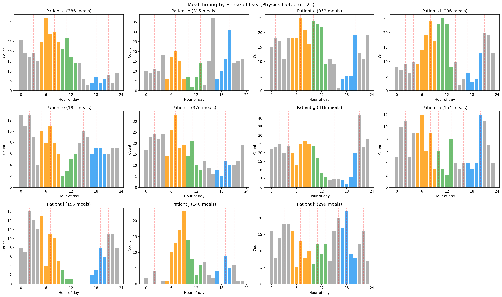
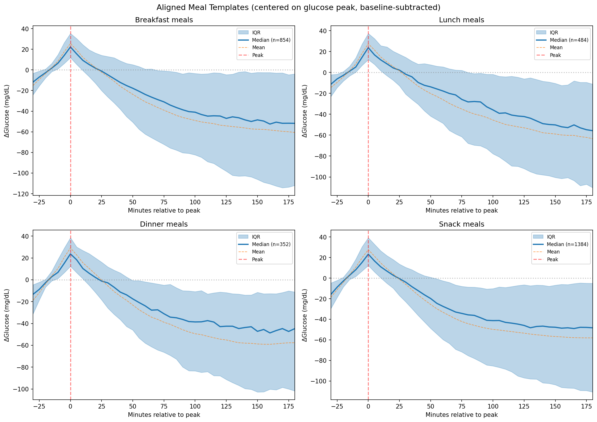
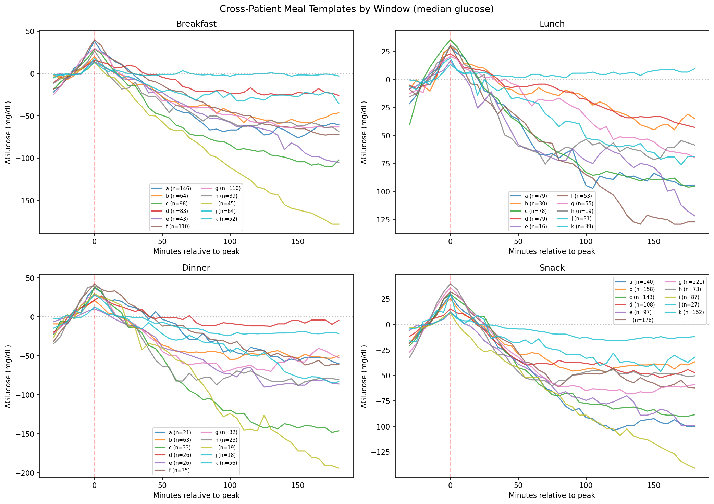
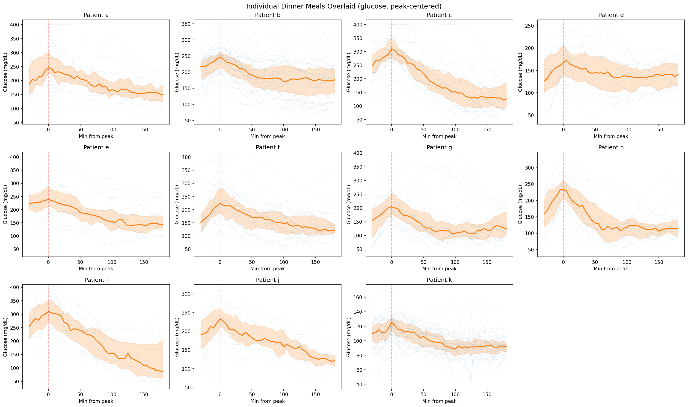
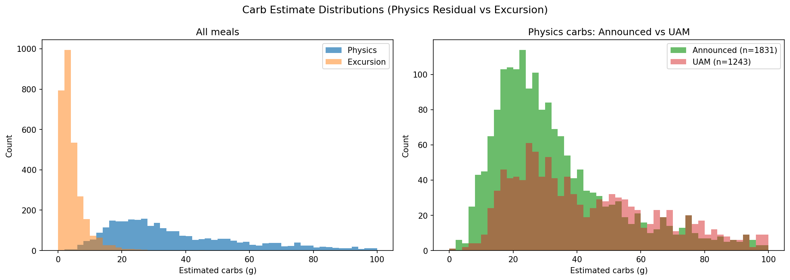
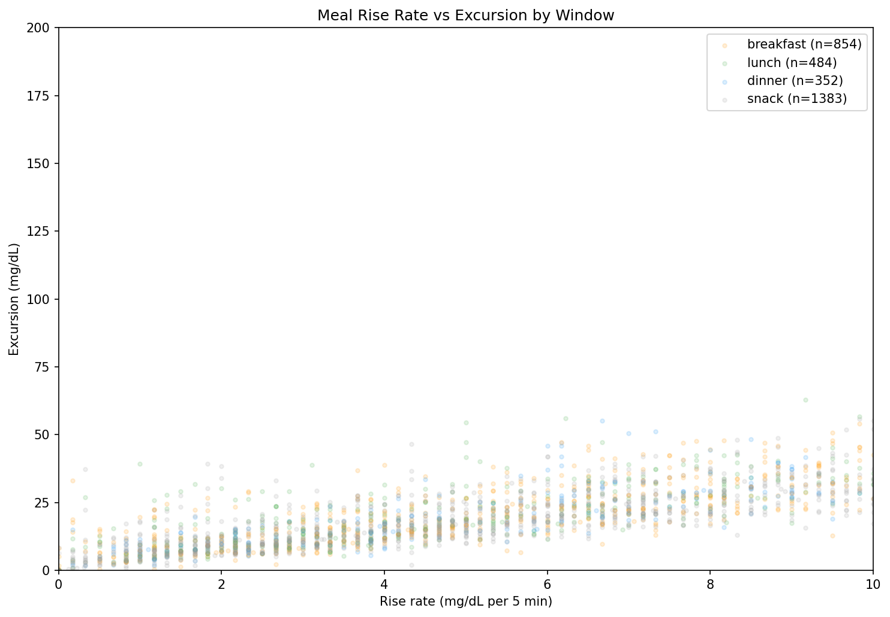

# EXP-1361: Meal Peak Detection, Characterization & Template Analysis

## Summary

Peak-centered meal analysis across **3,074 meals** in 11 patients (180 days each)
using the physics residual detector (F1=0.939, 2σ threshold).  Compared to
the 12,060 events from EXP-1341's simple threshold, this selective detector
averages **1.7 meals/day** — closer to real eating frequency.

## Detection Results

| Patient | Meals | /day | UAM% | Median excursion | Dominant hours |
|---------|-------|------|------|-----------------|----------------|
| a | 386 | 2.1 | 34% | 28.8 mg/dL | 3,6,8,11,18,21 |
| b | 315 | 1.8 | 8% | 21.8 mg/dL | 2,4,7,10,13,16,20 |
| c | 352 | 2.0 | 44% | 31.2 mg/dL | 1,7,10,14,20 |
| d | 296 | 1.6 | 52% | 16.0 mg/dL | 2,4,8,11,14,17,21 |
| e | 182 | 1.2 | 70% | 16.8 mg/dL | 2,5,7,15,18 |
| f | 376 | 2.1 | 42% | 25.7 mg/dL | 2,4,7,9,11,14,17,19 |
| g | 418 | 2.3 | 15% | 29.8 mg/dL | 2,4,8,15,21 |
| h | 154 | 0.9 | 19% | 33.2 mg/dL | 2,6,8,10,13,16,20 |
| i | 156 | 0.9 | 71% | 13.7 mg/dL | 2,5,7,19,21 |
| j | 140 | 2.3 | 21% | 23.5 mg/dL | 2,9,14,17,19,21 |
| k | 299 | 1.7 | 90% | 10.5 mg/dL | 3,7,9,11,13,16,18,22 |

## Phase-of-Day Periodicity

The population histogram shows clear diurnal structure:
- **Morning peak: hours 6–9** (breakfast + dawn phenomenon)
- **Afternoon trough: hours 14–18** (fewest detections)
- **Evening peak: hours 20–22** (dinner + late snack)
- **Overnight plateau: hours 0–5** (likely false positives: dawn phenomenon,
  hepatic glucose output, not actual meals)

Per-patient dominant hours **do cluster by expected meal phases**, though with
individual variation of ±2 hours.  Most patients show 5–8 dominant peaks,
suggesting the detector also captures non-meal glucose events (dawn phenomenon
at hours 2–5 is nearly universal).

### Implication for Prospective Detection

The strong phase clustering means a patient's meal probability by hour-of-day
is a useful prior.  The proactive meal predictor (EXP-1129, AUC=0.846) already
uses `hist_meal_prob` as a feature, which captures exactly this pattern.

## Aligned Meal Templates

### Population Templates (baseline-subtracted, centered on glucose peak)

All four meal windows show remarkably similar canonical shapes:

| Window | n | Median peak rise | IQR |
|--------|---|-----------------|-----|
| Breakfast | 854 | +22.2 mg/dL | [+11.9, +35.3] |
| Lunch | 484 | +23.7 mg/dL | [+12.3, +37.3] |
| Dinner | 352 | +23.7 mg/dL | [+12.3, +38.5] |
| Snack | 1,384 | +23.3 mg/dL | [+12.3, +39.3] |

**Canonical meal template shape:**
1. **Pre-peak** (−30 to 0 min): ~15 mg/dL rise over 30 min
2. **Peak** (t=0): median +23 mg/dL above baseline
3. **Post-peak descent** (0 to +90 min): AID insulin action drives glucose down
4. **Overcorrection** (+90 to +180 min): glucose drops **60 mg/dL below baseline**
   (median), indicating systematic AID overcorrection

The mean template is pulled below the median by 10–15 mg/dL, indicating a
subset of meals with dramatic post-bolus crashes.

### Cross-Patient Template Signatures

Each patient has a distinctive post-meal "fingerprint":

- **Flat responders** (d, k): Minimal excursion (+10–16 mg/dL), tight AID control
- **Standard responders** (a, b, g, j): +20–30 mg/dL rise, steady 60-min descent
- **Overcorrectors** (c, e, i): Drop 100–150 mg/dL below baseline by +180 min
- **Slow responders** (f, h): Higher peaks but gradual, extended descent

Patient i's dramatic post-peak drop (−150 mg/dL) reflects aggressive AID
correction combined with ISF mismatch (effective ISF 2.2× profile from EXP-1291).

## Carb Estimate Distributions

The physics residual method produces a roughly log-normal distribution:
- **Announced meals**: bell-shaped, centered ~20–30g, tight distribution
- **UAM meals**: flatter, wider distribution (5–80g), reflecting the full
  range of unbolused eating

Excursion-based estimates are heavily right-skewed with most mass near 0–5g,
because AID insulin blunts the observed glucose rise.

## Rise Rate vs Excursion

Linear relationship (r ≈ 0.6): faster rise → bigger excursion.  All meal
windows overlap — **meal window does not predict rise characteristics**.
The relationship is driven by meal composition (simple vs complex carbs,
fat/protein content) rather than time of day.

## Known Limitations

1. **Overnight false positives**: Hours 0–5 show steady "meal" detection that
   is likely dawn phenomenon and hepatic glucose output, not actual eating.
   A future filter could use: no bolus activity + low carb_supply + overnight
   hours → suppress detection.

2. **Patient i carb estimates inflated**: 168g median breakfast estimate is
   clearly wrong — ISF mismatch (2.2×) inflates the CR/ISF conversion.
   Per-patient ISF correction (from EXP-1291) would fix this.

3. **"Snack" category is a catch-all**: 45% of detections (1,384/3,074) fall
   outside traditional meal windows.  Many are dawn phenomenon, exercise
   rebounds, or stress responses.

## Visualizations

| Figure | Description |
|--------|-------------|
| `fig1_phase_of_day_histograms.png` | Per-patient meal timing by hour (color-coded by window) |
| `fig2_population_meal_templates.png` | Median ± IQR aligned templates, all windows |
| `fig3_dinner_overlays.png` | Individual dinner traces with median envelope per patient |
| `fig4_cross_patient_templates.png` | Cross-patient template comparison (baseline-subtracted) |
| `fig5_carb_distributions.png` | Physics vs excursion carb estimates, announced vs UAM |
| `fig6_rise_rate_vs_excursion.png` | Rise rate vs excursion scatter by meal window |

## Files

- Script: `tools/cgmencode/exp_meal_characterization_1361.py`
- Summary: `externals/experiments/exp-1361_meal_characterization.json`
- Detail: `externals/experiments/exp-1361_meal_characterization_detail.json`
- Templates: `externals/experiments/exp-1361_meal_templates.json`
- Visualizations: `visualizations/meal-characterization/fig[1-6]_*.png`
