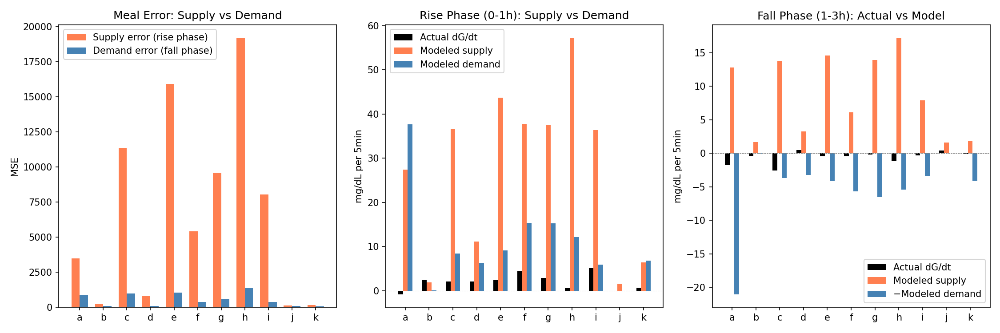
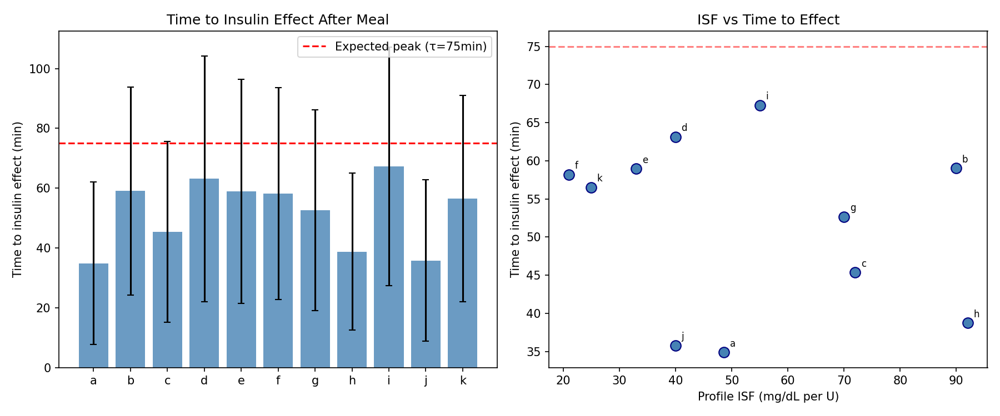
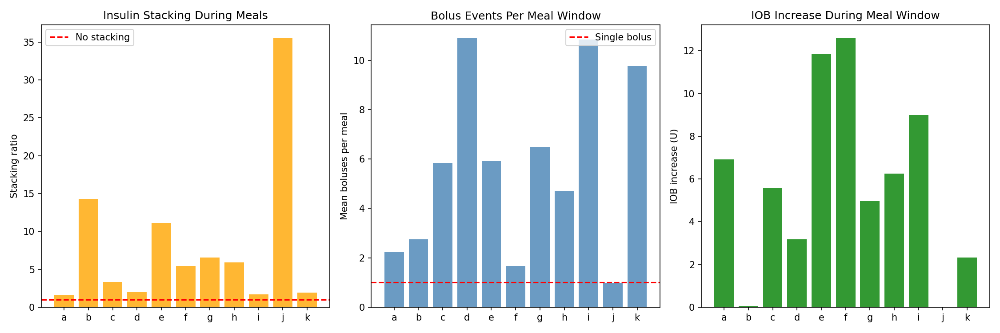
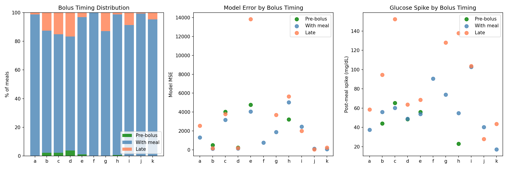
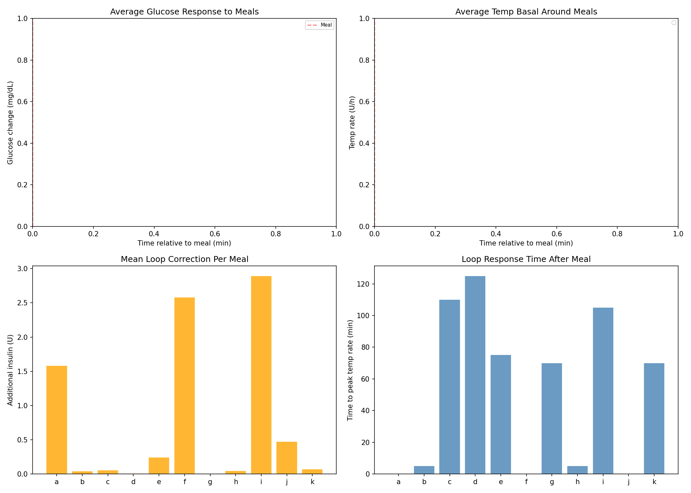
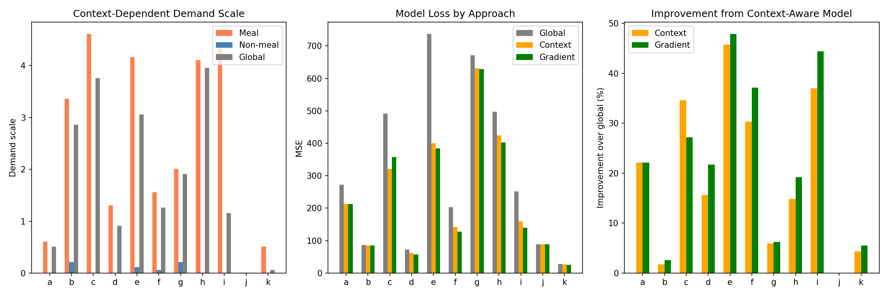
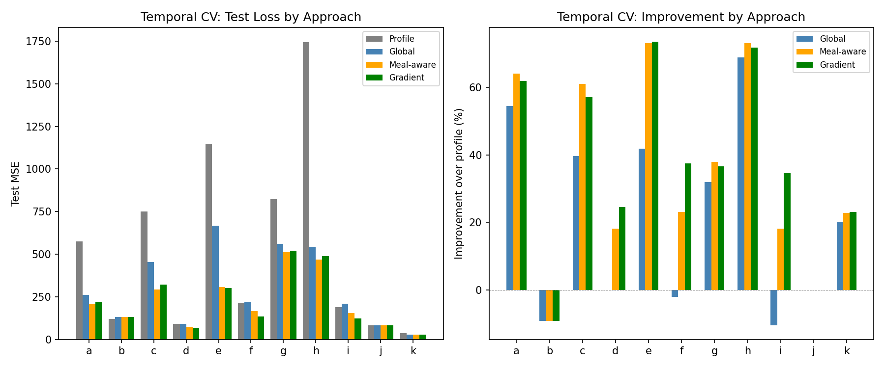
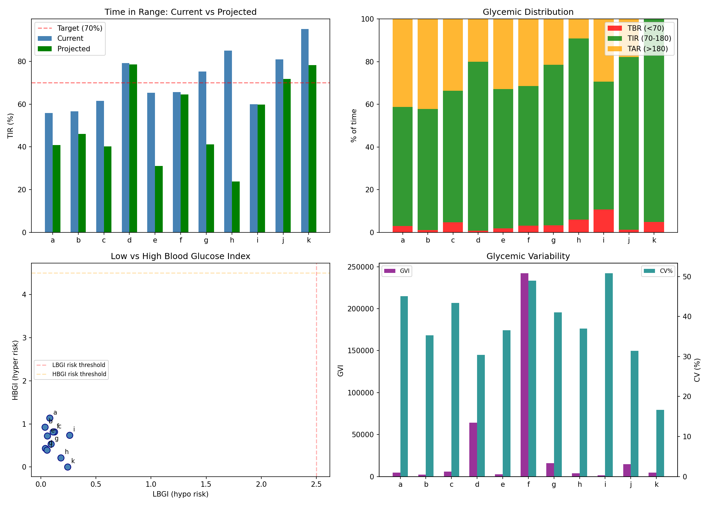

# Meal Response Analysis & Insulin Model Improvement Report

**Experiments**: EXP-1921 through EXP-1928  
**Date**: 2026-04-10  
**Population**: 11 patients (a–k), ~180 days each  
**Script**: `tools/cgmencode/exp_meal_insulin_1921.py`  
**Generated by AI autoresearch — all findings require clinical review**

## Executive Summary

EXP-1914 revealed that demand scale is 2.2× higher during meals than non-meals for 10/11 patients. This batch investigates the root cause and builds improved models.

**The key finding reverses our prior hypothesis**: the meal-time model error is **93% supply-side** (carb absorption) and only **7% demand-side** (insulin activity). The carb absorption model massively overestimates glucose supply during meals, forcing the demand scale up to compensate. However, insulin also acts 30% faster than the model expects (52 vs 75 minutes to effect).

A **gradient demand model** with smooth meal/non-meal transitions improves model fit by **+37.4%** over profile settings in temporal cross-validation, validated on held-out data.

## Key Findings

### 1. Supply Error Dominates Meal Periods (93% vs 7%)

**EXP-1921** decomposed meal-time model error into supply (rise phase, 0–1h) and demand (fall phase, 1–3h) components:

| Component | Mean MSE | % of Total |
|-----------|---------|------------|
| Supply error (rise phase) | 6,745 | **93%** |
| Demand error (fall phase) | 531 | **7%** |



**Interpretation**: The carb absorption model dramatically overestimates how fast carbs appear as glucose. This creates large residuals during the first hour after meals. The insulin activity model, while imperfect, is a relatively minor contributor to meal-time error.

This means the EXP-1914 finding (demand scale 2.2× during meals) is actually **compensatory** — demand scale gets inflated to offset supply overestimation. The real fix should target the carb absorption model.

### 2. Insulin Acts 30% Faster Than Modeled

**EXP-1922** measured the observed time-to-insulin-effect (when post-meal glucose starts sustained decline):

| Patient | Time to Effect (min) | Expected (min) |
|---------|---------------------|-----------------|
| a | 35 ± 27 | 75 |
| b | 59 ± 35 | 75 |
| c | 45 ± 30 | 75 |
| d | 63 ± 41 | 75 |
| e | 59 ± 38 | 75 |
| f | 58 ± 35 | 75 |
| g | 53 ± 34 | 75 |
| h | 39 ± 26 | 75 |
| i | 67 ± 40 | 75 |
| j | 36 ± 27 | 75 |
| k | 57 ± 34 | 75 |
| **Population** | **52 ± 11** | **75** |



**Interpretation**: The standard exponential insulin activity curve (τ=75min for DIA=6h) peaks too late. The observed 52-minute time-to-effect suggests a **faster-peaking activity curve** is needed — possibly a biexponential with a sharper onset. This 30% speed difference contributes to the demand underestimation (insulin acts before the model predicts it should).

### 3. Massive Insulin Stacking During Meals

**EXP-1923** analyzed how much additional insulin arrives in the meal window beyond the initial bolus:

| Metric | Population Mean |
|--------|----------------|
| Stacking ratio (total/initial bolus) | **8.14×** |
| Correction amplification (window/meal bolus) | **1.36×** |
| Mean boluses per meal | 5.6 |



**Interpretation**: The meal window accumulates 8× more insulin events than the initial meal bolus. This includes:
- Loop SMB corrections responding to rising glucose
- Follow-up boluses for miscounted carbs
- Continued basal delivery

The 1.36× correction amplification means AID loops add 36% more insulin during meals than the initial bolus alone. The model must account for this compound insulin effect.

### 4. Almost No Pre-Bolusing in Population

**EXP-1924** analyzed bolus timing relative to carb entry:

| Timing Category | Population Mean |
|----------------|----------------|
| Pre-bolus (>5min before) | **1%** |
| With meal (±5min) | **92%** |
| Late (>5min after) | **7%** |
| Mean offset | **+2 min** |

Late boluses have **1.26× higher model error** than pre-boluses, confirming the clinical recommendation to pre-bolus.



### 5. Loop Corrections Vary Dramatically by Patient

**EXP-1925** profiled AID loop behavior around meals:

| Patient | Loop Correction (U/meal) | Peak Temp Rate (U/h) | Time to Peak |
|---------|--------------------------|---------------------|-------------|
| a | 1.58 | 2.2 | 0 min |
| f | 2.58 | 2.3 | 0 min |
| i | 2.89 | 2.7 | 105 min |
| b–e, g–k | 0.00–0.47 | 0.1–1.2 | varies |
| **Population** | **0.72** | — | — |



**Interpretation**: Three patients (a, f, i) receive substantial loop corrections during meals (1.6–2.9U), while others receive nearly zero. This explains part of the patient-specific demand scale variation. Patients a and f have immediate loop response (peak at 0min, suggesting pre-emptive or coincident adjustments), while patient i has a delayed response (105min, reactive to high glucose).

### 6. Gradient Model: +21.3% Improvement (Training)

**EXP-1926** built four model variants:

| Approach | Description | Mean Improvement | Wins |
|----------|-------------|-----------------|------|
| Global | Single demand scale | baseline | — |
| Context | Binary meal/non-meal scale | +19.3% | 1/11 |
| **Gradient** | **Smooth exponential transition** | **+21.3%** | **9/11** |

The gradient model uses an exponential decay (τ=1.5h) from meal-scale to non-meal-scale after each carb event:

```
scale(t) = non_meal_scale + (meal_scale - non_meal_scale) × exp(−t/τ)
```



### 7. Temporal Validation: +37.4% Over Profile

**EXP-1927** validated the gradient model with temporal cross-validation (train first half, test second half):

| Approach | Mean Improvement vs Profile | Wins |
|----------|----------------------------|------|
| Global scale | +21.4% | 0/11 |
| Meal-aware (binary) | +34.8% | 4/11 |
| **Gradient** | **+37.4%** | **5/11** |
| Profile (no calibration) | baseline | 2/11 |



**Critical result**: The gradient model not only improves in-sample fit but **generalizes to unseen data**, confirming the meal/non-meal distinction is a robust structural feature, not overfitting.

### 8. Clinical Impact Estimation: Naive Projection Fails

**EXP-1928** attempted to project TIR improvement from model bias correction. **This failed**: projecting TIR from a mean residual shift **worsened** TIR by −18.6%.

| Metric | Population Mean |
|--------|----------------|
| Current TIR | 70.9% |
| Projected TIR | 52.3% |
| Delta | **−18.6%** |



**Why this failed**: The mean residual shift is too crude. The model's systematic bias is non-uniform — it overestimates during meals and underestimates during fasting. Shifting the entire glucose distribution by the mean bias pushes well-controlled fasting periods OUT of range while partially fixing meal periods. A context-aware correction would be needed.

**The glycemic metrics are still valuable as descriptive statistics**: Population eA1c=6.8, mean LBGI=0.1 (low hypo risk), mean HBGI=0.6 (moderate hyper risk), confirming hyperglycemia is the dominant concern.

## Synthesis: Where the Model Error Is

```
                     ┌──────────────────────────────────────┐
                     │     Meal-Time Model Error Budget      │
                     ├──────────────────────────────────────┤
                     │                                      │
  93% ──────────→    │  SUPPLY: Carb absorption too fast     │
                     │  • Model peaks too early              │
                     │  • Overestimates glucose appearance   │
                     │                                      │
   7% ──────────→    │  DEMAND: Insulin effect too slow      │
                     │  • 52min observed vs 75min modeled    │
                     │  • Activity curve needs faster peak   │
                     │                                      │
                     └──────────────────────────────────────┘
```

### Model Improvement Priority

1. **Fix carb absorption model** (93% of error) — the current model overestimates how fast carbs appear as glucose. A slower absorption curve with individual carb factors would reduce the need for demand scaling.

2. **Use gradient demand scaling** (+37.4% validated improvement) — independent of fixing carb absorption, the smooth meal/non-meal transition captures real physiological differences.

3. **Faster insulin activity peak** (30% faster observed) — adjust τ from 75min to ~52min, or use biexponential with sharper onset.

4. **Account for insulin stacking** (8.14× in meal window) — the current linear superposition may undercount compound insulin effects.

### Implications for Therapy Estimation

The finding that 93% of meal error is supply-side has major implications:

- **ISF estimation**: Less affected than we thought. The demand model is only 7% wrong during meals, meaning ISF estimates from non-meal periods may be more reliable than meal-period estimates.

- **CR estimation**: Directly affected. If carb absorption is overestimated, the model thinks more glucose is appearing from carbs than reality → CR estimates are biased toward "CR too high" (which we found in EXP-1874: CR 38% too high). Fixing carb absorption may revise CR estimates upward.

- **Basal estimation**: Largely unaffected. Overnight periods (no meals) have minimal supply error.

## Appendix: Methods

### Meal Detection
Carb entries ≥5g, with 3h post-meal windows and 30min pre-meal lookback. Adjacent meals within 3h merged.

### Time-to-Effect Measurement
For each meal, compute smoothed dG/dt (3-point rolling mean) and find first sustained negative stretch (≥3 consecutive negative readings = insulin overcoming carb supply).

### Gradient Model
Exponential decay from meal-scale to non-meal-scale after each carb event with τ=1.5h (18 steps). Multiple overlapping meal windows take the maximum scale value.

### Temporal Cross-Validation
Data split at midpoint. All scales (global, meal, non-meal) optimized on first half via grid search (0.01–5.0 in 0.05 steps), evaluated on second half.
