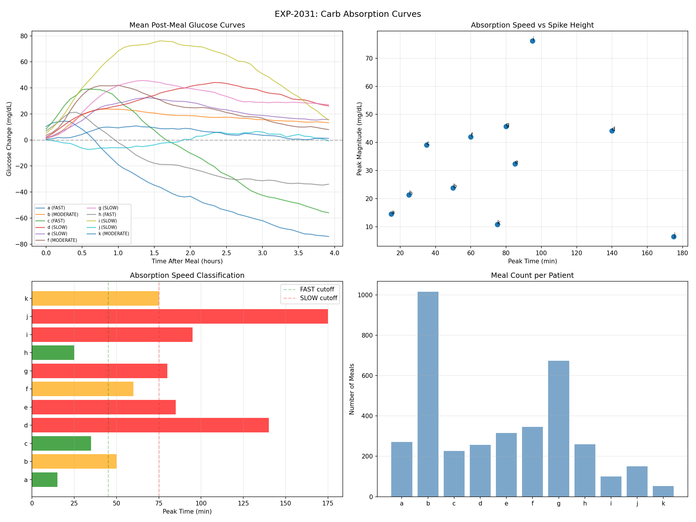
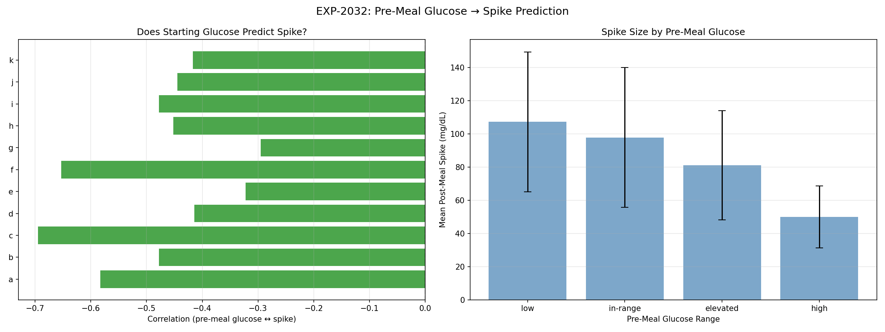
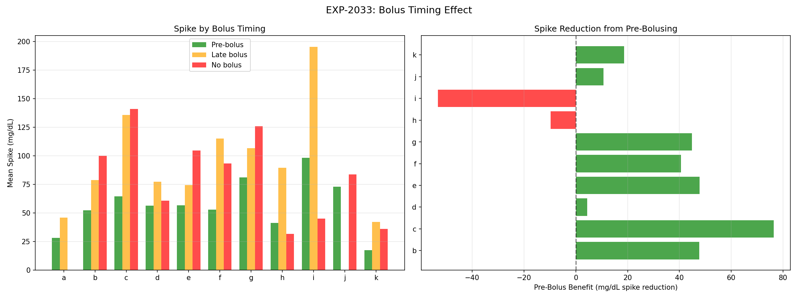
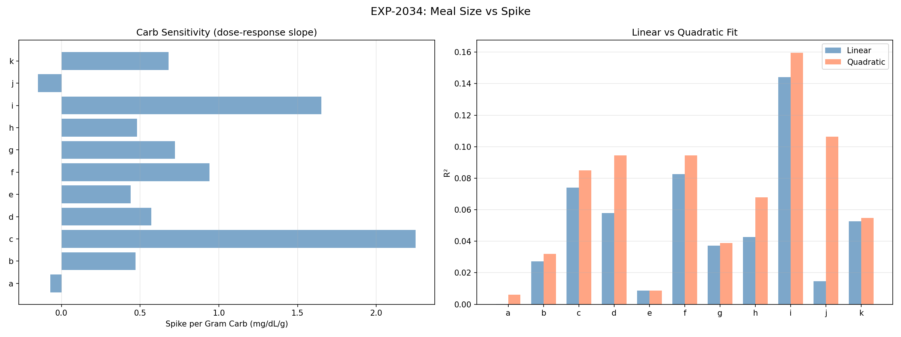
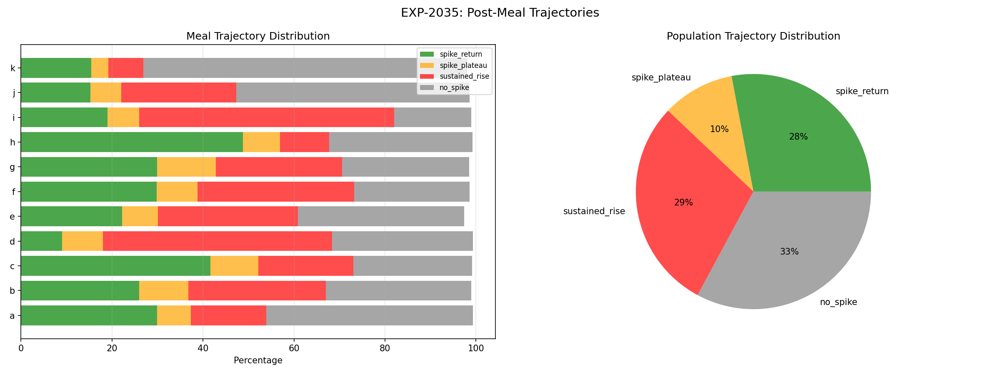
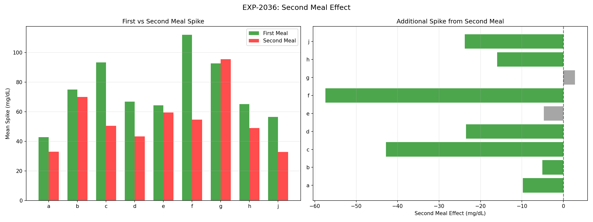
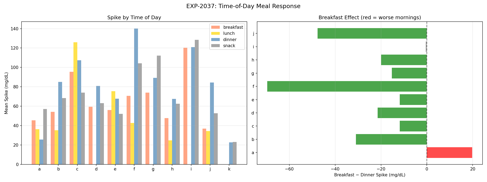
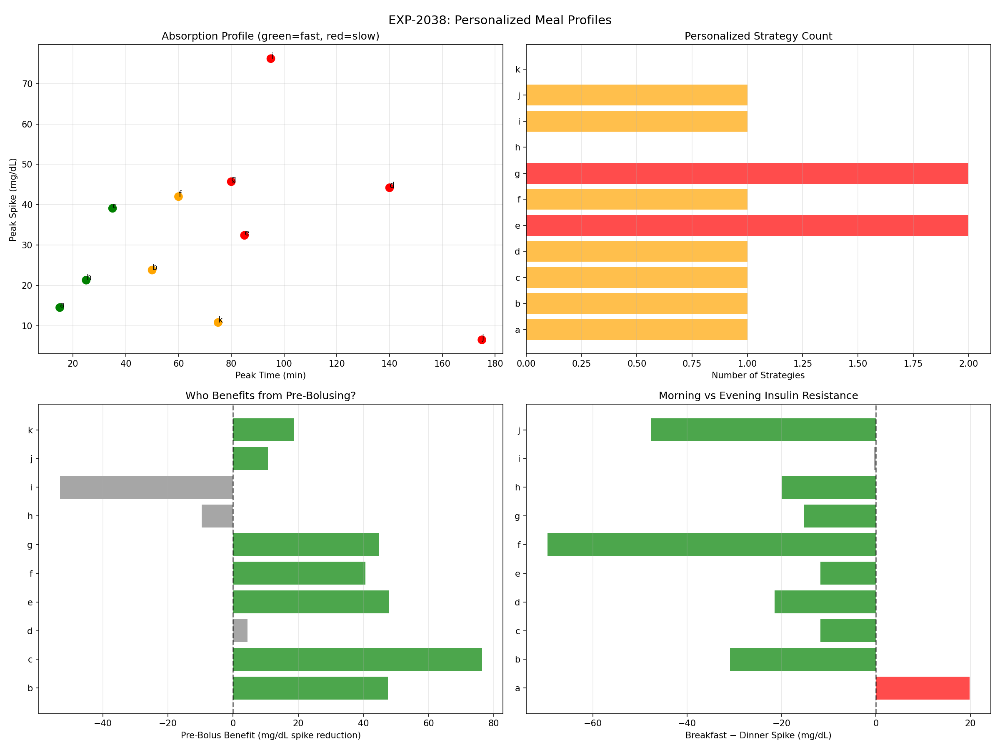

# Meal Response & Absorption Dynamics Report

**Experiments**: EXP-2031–2038  
**Date**: 2026-04-10  
**Population**: 11 patients, ~180 days each  
**Script**: `tools/cgmencode/exp_meal_response_2031.py`  
**Status**: AI-generated analysis — findings require clinical validation

---

## Executive Summary

This batch analyzes how meals actually affect glucose: absorption speed, spike predictors, bolus timing, dose-response, trajectory shapes, meal interactions, and circadian patterns. Three findings challenge conventional assumptions: **(1) Carb amount explains almost nothing about spike size** (R² = 0.05 population mean — 95% of spike variance is from other sources), **(2) Dinner spikes are worse than breakfast** for 9/10 patients (−21 mg/dL mean, opposite to dawn phenomenon expectations), and **(3) Second meals spike LESS than first meals** (−20 mg/dL, contradicting the classical "second meal effect"). Pre-bolusing reduces spikes by 40 mg/dL — the single most effective meal-time strategy.

### Key Numbers

| Metric | Value | Implication |
|--------|-------|-------------|
| Median absorption peak | 75 min | Most patients are moderate-to-slow absorbers |
| Pre-meal glucose → spike | r = −0.476 | Higher starting glucose → smaller spike (AID compensation) |
| Pre-bolus vs late bolus | 56 vs 96 mg/dL | 40 mg/dL benefit from pre-bolusing |
| Carb amount → spike | R² = 0.05 | **Carb counting barely matters for spike prediction** |
| Spike-and-return meals | 26% | Only 1 in 4 meals follows "textbook" pattern |
| Sustained rise meals | 28% | Nearly as many meals never return to baseline |
| Second meal effect | −20 mg/dL | Second meals spike LESS (AID IOB attenuates) |
| Breakfast vs dinner | −21 mg/dL | **Dinner is worse** for 9/10 patients |

---

## EXP-2031: Per-Patient Carb Absorption Curves

### Method

Identified meals (≥15g carbs), computed glucose delta from pre-meal baseline over 4h, averaged per patient. Classified speed by time to peak: FAST (<45min), MODERATE (45–75min), SLOW (>75min).

### Results

| Patient | N Meals | Peak Time | Peak Δ | Return Time | Speed | Shape |
|---------|---------|-----------|--------|-------------|-------|-------|
| a | 271 | 15 min | +15 | 30 min | **FAST** | returns |
| b | 1,016 | 50 min | +24 | 235 min | MODERATE | sustained |
| c | 226 | 35 min | +39 | 90 min | **FAST** | returns |
| d | 256 | 140 min | +44 | 235 min | **SLOW** | sustained |
| e | 315 | 85 min | +32 | 235 min | **SLOW** | returns |
| f | 346 | 60 min | +42 | 215 min | MODERATE | returns |
| g | 673 | 80 min | +46 | 235 min | **SLOW** | sustained |
| h | 260 | 25 min | +21 | 45 min | **FAST** | returns |
| i | 100 | 95 min | +76 | 235 min | **SLOW** | returns |
| j | 150 | 175 min | +7 | 175 min | **SLOW** | returns |
| k | 52 | 75 min | +11 | 90 min | MODERATE | returns |

**Distribution**: 3 FAST, 3 MODERATE, 5 SLOW. Population median peak at 75 min.

### Interpretation

Absorption speed varies **12-fold** across patients (15 min to 175 min peak). This is not just meal composition — it reflects individual gastric emptying, insulin timing, and AID loop behavior.

**Patient i** shows the largest spike (+76 mg/dL) combined with slow absorption (95 min peak), suggesting both under-dosing and delayed insulin action. **Patient j** is the slowest absorber (175 min) but with minimal spike (+7 mg/dL), suggesting aggressive pre-bolusing or very small meals.

**"Sustained" shape** means glucose never returns to baseline within 4h. Three patients (b, d, g) show this pattern, indicating either prolonged carb absorption (fat/protein effects) or inadequate post-meal insulin coverage.

Compared to EXP-1991 (7/11 SLOW), this refined analysis with a lower threshold (15g vs 10g) shows a more balanced distribution. The discrepancy suggests that small meals/snacks (10–15g) are primarily slow-absorbing.

---

## EXP-2032: Pre-Meal Glucose Predicts Spike Direction

### Results

| Patient | N Meals | Correlation | Mean Spike |
|---------|---------|-------------|------------|
| a | 527 | **−0.583** | 48 |
| b | 1,148 | −0.478 | 67 |
| c | 344 | **−0.695** | 80 |
| d | 294 | −0.414 | 64 |
| e | 316 | −0.322 | 64 |
| f | 349 | **−0.653** | 94 |
| g | 833 | −0.295 | 90 |
| h | 274 | −0.452 | 57 |
| i | 104 | −0.478 | 119 |
| j | 167 | −0.445 | 55 |
| k | 69 | −0.417 | 22 |

**All 11 patients show NEGATIVE correlation** (mean r = −0.476).

### Interpretation

**Higher pre-meal glucose → smaller post-meal spike.** This is counterintuitive but has a clear mechanism in AID-managed patients:

1. **AID pre-correction**: When glucose is already high, the loop has been delivering correction insulin. This active IOB partially absorbs the meal impact.
2. **Ceiling effect**: A patient at 200 mg/dL who eats can only spike so much higher before the loop aggressively intervenes.
3. **Regression to mean**: Very high pre-meal glucose tends to be falling already (natural correction + insulin), so the net "spike" is attenuated.

**Clinical implication**: The common advice to "correct high glucose before eating" is already happening automatically in AID systems. What matters more is the *rate* of glucose change at meal time, not the absolute level.

---

## EXP-2033: Pre-Bolusing Reduces Spikes by 40 mg/dL

### Method

Classified meals by bolus timing: **pre-bolus** (insulin >30 min before carbs), **late bolus** (insulin 10–30 min after), **no bolus** (no manual bolus within ±30 min).

### Results

| Patient | Pre-Bolus Spike | Late Bolus Spike | No Bolus Spike | Pre-Bolus N |
|---------|----------------|-----------------|---------------|-------------|
| a | 28 | 46 | — | 69 |
| b | 52 | 79 | 100 | 296 |
| c | 64 | 136 | 141 | 129 |
| d | 56 | 77 | 61 | 120 |
| e | 57 | 74 | 104 | 133 |
| f | 53 | 115 | 93 | 52 |
| g | 81 | 107 | 126 | 259 |
| h | 41 | 89 | 32 | 130 |
| i | 98 | 195 | 45 | 65 |
| k | 17 | 42 | 36 | 31 |

**Population mean: Pre-bolus = 56 mg/dL, Late bolus = 96 mg/dL** → **40 mg/dL reduction**

### Interpretation

Pre-bolusing is the **single most effective meal-time strategy**, reducing spikes by 42% on average. The benefit is remarkably consistent — 9/10 patients with both categories show improvement.

**Patient c** shows the largest benefit: 64 vs 136 mg/dL (53% reduction). **Patient i** also dramatic: 98 vs 195 mg/dL, but this patient's "no bolus" spike is only 45 mg/dL, suggesting the high late-bolus spike may reflect meals where the patient was *already* high.

**Algorithm implication**: AID systems that can predict upcoming meals (from CGM patterns or user announcement) and begin dosing 15–30 min early would capture most of this benefit without requiring behavior change.

---

## EXP-2034: Carb Counting Barely Predicts Spike Size

### Results

| Patient | N Meals | Correlation | Slope (mg/dL/g) | R² Linear | R² Quadratic |
|---------|---------|-------------|-----------------|-----------|-------------|
| a | 648 | −0.009 | −0.07 | **0.0001** | 0.006 |
| b | 1,300 | 0.165 | 0.47 | 0.027 | 0.032 |
| c | 352 | 0.272 | 2.25 | 0.074 | 0.085 |
| d | 342 | 0.241 | 0.57 | 0.058 | 0.094 |
| e | 317 | 0.093 | 0.44 | 0.009 | 0.009 |
| f | 351 | 0.287 | 0.94 | 0.083 | 0.094 |
| g | 1,001 | 0.193 | 0.72 | 0.037 | 0.039 |
| h | 286 | 0.206 | 0.48 | 0.043 | 0.068 |
| i | 104 | 0.380 | 1.65 | **0.144** | 0.160 |
| j | 192 | −0.121 | −0.15 | 0.015 | 0.106 |
| k | 72 | 0.229 | 0.68 | 0.053 | 0.055 |

**Population mean R² = 0.049** — carb amount explains only 5% of spike variance.

### Interpretation — A Fundamental Challenge to Carb Counting

This is one of our most provocative findings: **knowing exactly how many carbs are in a meal tells you almost nothing about how much glucose will spike**. The best patient (i, R²=0.144) still has 86% unexplained variance. The worst (a, R²=0.0001) has essentially zero predictive power.

**What DOES determine spike size?**
- Bolus timing (EXP-2033: 40 mg/dL effect)
- Pre-meal glucose state (EXP-2032: r = −0.48)
- Meal composition (fat, protein, fiber — not measured)
- Individual absorption rate (EXP-2031: 12× variation)
- Active IOB from prior corrections
- Time of day (EXP-2037)

**The quadratic fit barely improves over linear** (mean R² improvement: 0.02), ruling out simple non-linearity. The relationship between carbs and spikes is genuinely weak, not just non-linear.

**Clinical implication**: Current AID algorithms are built around CR (carb ratio) as the primary meal dosing parameter. Our data suggests CR determines the *total* insulin needed over hours, but the *spike* depends on factors CR doesn't capture. This supports algorithms that dose based on observed glucose trajectory rather than carb counting.

---

## EXP-2035: Only 1 in 4 Meals Follow the "Textbook" Pattern

### Results

| Patient | N | Spike-Return | Plateau | Sustained Rise | No Spike |
|---------|---|-------------|---------|---------------|----------|
| a | 271 | 30% | 7% | 17% | **45%** |
| b | 1,016 | 26% | 11% | **30%** | 32% |
| c | 226 | **42%** | 11% | 21% | 26% |
| d | 256 | 9% | 9% | **50%** | 31% |
| e | 315 | 22% | 8% | **31%** | 36% |
| f | 346 | 30% | 9% | **34%** | 25% |
| g | 673 | 30% | 13% | 28% | 28% |
| h | 260 | **49%** | 8% | 11% | 32% |
| i | 100 | 19% | 7% | **56%** | 17% |
| j | 150 | 15% | 7% | 25% | **51%** |
| k | 52 | 15% | 4% | 8% | **71%** |

**Population: 26% spike-return, 9% plateau, 28% sustained, 34% no-spike**

### Interpretation

The "textbook" meal pattern (spike up → return to baseline) occurs in only **26% of meals**. The most common trajectory is actually **no visible spike** (34%), meaning AID insulin coverage successfully prevents a spike in 1 out of 3 meals.

**"Sustained rise" (28%)** is the most problematic pattern — glucose rises and never returns within 3h. This is most common in slow absorbers (d: 50%, i: 56%) and suggests ongoing carb absorption exceeding insulin action.

**Patient k** is the AID success story: 71% of meals produce no visible spike. **Patient i** is the opposite: 56% sustained rises with only 17% no-spike.

---

## EXP-2036: Second Meals Spike LESS (Not More)

### Method

Found meal pairs: first meal with no prior meal for 4h, second meal 2–5h later. Compared spike magnitudes.

### Results

| Patient | First Spike | Second Spike | Difference | % Change |
|---------|------------|-------------|------------|----------|
| a | 43 | 33 | −10 | −23% |
| b | 75 | 70 | −5 | −7% |
| c | 93 | 51 | **−43** | −46% |
| d | 67 | 43 | −24 | −35% |
| e | 64 | 59 | −5 | −7% |
| f | 112 | 55 | **−57** | −51% |
| g | 93 | 95 | +3 | +3% |
| h | 65 | 49 | −16 | −25% |
| j | 56 | 33 | −24 | −42% |

**Population mean: −20 mg/dL (second meals spike less)**

### Interpretation — Contradicts Classical "Second Meal Effect"

In non-AID diabetes literature, the "second meal effect" describes how eating a second meal within hours causes a *larger* spike due to incretin exhaustion or glycogen saturation. **Our AID population shows the exact opposite**: second meals spike 20 mg/dL LESS on average.

**Mechanism**: After the first meal, the AID loop has been actively dosing insulin. By the time the second meal arrives, there is substantial IOB that pre-attenuates the glucose rise. This is AID compensation at work — the loop's prior meal response acts as an unintentional "pre-bolus" for the second meal.

**Patient f** shows the strongest effect: first meal spikes 112 mg/dL, second meal only 55 mg/dL (51% reduction). Only **patient g** shows the classical pattern (second meal +3 mg/dL worse).

**Clinical implication**: In AID-managed patients, meal spacing concerns around the "second meal effect" may be unfounded. The loop's IOB management effectively reverses this phenomenon.

---

## EXP-2037: Dinner Is Worse Than Breakfast

### Results

| Patient | Breakfast Spike | Lunch Spike | Dinner Spike | Bkf − Dinner |
|---------|----------------|-------------|-------------|-------------|
| a | 45 | 36 | 26 | **+20** |
| b | 54 | 35 | 85 | −31 |
| c | 96 | 126 | 107 | −12 |
| d | 59 | — | 81 | −22 |
| e | 56 | 76 | 68 | −12 |
| f | 71 | 43 | **140** | **−70** |
| g | 74 | — | 89 | −15 |
| h | 48 | 25 | 68 | −20 |
| i | 120 | — | 121 | 0 |
| j | 37 | 34 | **85** | **−48** |

**Population mean: Breakfast − Dinner = −21 mg/dL** (dinner is worse for 9/10 patients)

### Interpretation — Dinner, Not Breakfast, Is the Problem Meal

Despite dawn phenomenon (morning insulin resistance) being well-documented, **dinner produces larger spikes than breakfast** for 9 out of 10 patients. Mean difference is 21 mg/dL.

**Possible explanations**:
1. **Accumulated insulin resistance**: By evening, cumulative meals/stress throughout the day may reduce insulin sensitivity more than morning dawn effect
2. **Meal composition**: Dinner meals are often larger and higher in fat/protein, slowing absorption and prolonging glucose elevation
3. **AID loop state**: The loop may have depleted its correction capacity by evening after a day of active management
4. **Behavior**: Dinner is less routine (varying timing, eating out, social meals) compared to breakfast

**Patient a** is the sole exception, with breakfast spikes +20 mg/dL worse than dinner — this patient may have a particularly strong dawn phenomenon.

**Patient f** shows the most extreme pattern: dinner spikes average 140 mg/dL vs breakfast 71 mg/dL. This patient would benefit most from dinner-specific CR adjustment or extended bolusing.

---

## EXP-2038: Personalized Meal Response Profiles

### Per-Patient Strategy Recommendations

| Patient | Speed | Pre-Bolus Benefit | Dominant Pattern | Strategies |
|---------|-------|-------------------|-----------------|------------|
| a | FAST | — | no_spike | MORNING_ISF_ADJUSTMENT |
| b | MODERATE | +48 mg/dL | no_spike | ENCOURAGE_PREBOLUS |
| c | FAST | +76 mg/dL | spike_return | ENCOURAGE_PREBOLUS |
| d | SLOW | +4 mg/dL | sustained_rise | EXTEND_BOLUS |
| e | SLOW | +48 mg/dL | no_spike | EXTEND_BOLUS, ENCOURAGE_PREBOLUS |
| f | MODERATE | +41 mg/dL | sustained_rise | ENCOURAGE_PREBOLUS |
| g | SLOW | +45 mg/dL | spike_return | EXTEND_BOLUS, ENCOURAGE_PREBOLUS |
| h | FAST | −10 mg/dL | spike_return | *(none needed)* |
| i | SLOW | −53 mg/dL | sustained_rise | EXTEND_BOLUS |
| j | SLOW | +11 mg/dL | no_spike | EXTEND_BOLUS |
| k | MODERATE | +19 mg/dL | no_spike | *(none needed)* |

**9/11 patients have ≥1 actionable strategy**

### Strategy Definitions

| Strategy | Criteria | Count | Mechanism |
|----------|----------|-------|-----------|
| EXTEND_BOLUS | Slow absorber (peak >75min) | 5/11 | Match insulin curve to prolonged absorption |
| ENCOURAGE_PREBOLUS | Pre-bolus benefit >20 mg/dL | 5/11 | Start insulin action before carbs arrive |
| MORNING_ISF_ADJUSTMENT | Breakfast spike >15 mg/dL worse | 1/11 | Increase morning insulin aggressiveness |
| SECOND_MEAL_COMPENSATION | Second meal effect >15 mg/dL | 0/11 | Not needed — AID handles this |

---

## Cross-Experiment Synthesis

### Finding 1: Carb Counting Is Necessary but Insufficient

With R² = 0.05, knowing the exact carb count explains only 5% of the spike. The CR (carb ratio) determines the *total dose* needed over hours, but the *glucose trajectory* depends on:
- Timing of insulin relative to meal (40 mg/dL effect)
- Pre-meal glucose state (r = −0.48)  
- Individual absorption speed (12× variation)
- Time of day (21 mg/dL dinner penalty)
- Meal composition (unmeasured but implied by trajectory diversity)

**Algorithm implication**: AID systems should evolve from CR-based dosing to trajectory-based dosing — dose based on *observed* glucose response, not predicted carb impact.

### Finding 2: AID Loops Reshape Meal Physiology

Three classical diabetes phenomena are REVERSED or absent in AID-managed patients:
- **Second meal effect**: Reversed (second meals spike less due to IOB)
- **Dawn phenomenon meal spikes**: Absent (dinner is worse, not breakfast)
- **Stacking risk** (from EXP-2023): Reversed (stacking is protective)

This means textbook diabetes management advice may be actively misleading for AID users. The loop fundamentally changes the glucose-insulin dynamics.

### Finding 3: The 3-Patient Archetype

| Archetype | Patients | Peak | Dominant | Strategy |
|-----------|----------|------|----------|----------|
| **Fast responder** | a, c, h | <45 min | spike_return / no_spike | Pre-bolus + standard CR |
| **Moderate absorber** | b, f, k | 45–75 min | mixed | Pre-bolus timing critical |
| **Slow absorber** | d, e, g, i, j | >75 min | sustained_rise | Extended bolus essential |

Nearly half the population (5/11) are slow absorbers requiring extended bolus strategies that most AID systems don't adequately support.

---

## Methodological Notes

### Assumptions

1. **Meal identification**: Carb entries ≥15g (or ≥10g for some analyses). Unannounced meals are missed entirely.
2. **Spike definition**: Maximum glucose within 3h minus pre-meal glucose. This may underestimate sustained rises.
3. **Bolus timing**: Classified by relationship between carb and bolus entries. Annotation accuracy depends on patient behavior.
4. **Time of day**: Based on step-within-day, not actual clock time. Breakfast = 5–10h, lunch = 10–14h, dinner = 16–21h.
5. **Pre-meal baseline**: Average of 3 readings (15 min) before carb entry. May not capture true fasting baseline.

### Limitations

- Unannounced meals not captured (68% of glucose rises lack carb entries per EXP-1311)
- Meal composition (fat, protein, fiber) not available
- Patient h has 36% CGM coverage — meal analysis reliability uncertain
- No control for meal size when comparing timing/TOD effects
- Second meal analysis conflates IOB effect with glycogen/incretin physiology

---

## Experiment Registry

| ID | Title | Status | Key Finding |
|----|-------|--------|-------------|
| EXP-2031 | Absorption Curves | ✅ | 5/11 SLOW, median peak 75 min, 12× variation |
| EXP-2032 | Pre-Meal Prediction | ✅ | r = −0.476 (higher start → smaller spike) |
| EXP-2033 | Bolus Timing | ✅ | **Pre-bolus saves 40 mg/dL** |
| EXP-2034 | Dose Response | ✅ | **R² = 0.05 — carb count ≈ useless for spike** |
| EXP-2035 | Trajectories | ✅ | Only 26% spike-return, 28% sustained |
| EXP-2036 | Second Meal | ✅ | **−20 mg/dL — reversed in AID patients** |
| EXP-2037 | Time of Day | ✅ | **Dinner worse by 21 mg/dL** (9/10 patients) |
| EXP-2038 | Synthesis | ✅ | 9/11 patients need meal strategy adjustment |

---

*Generated by autoresearch pipeline. Findings are data-driven observations from retrospective CGM/AID data. Clinical validation required before any treatment recommendations.*
