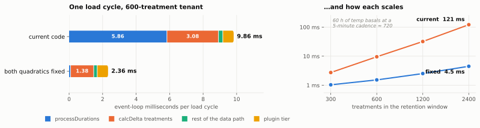
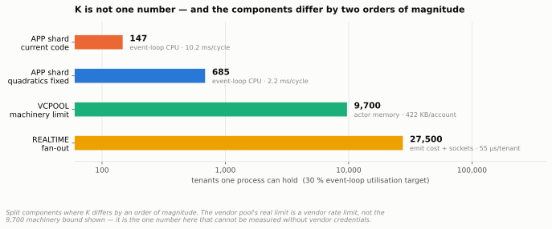

# What sets K: residency, the load cycle, and two quadratics

**Experiments**: EXP-MT-035 (resident cost against real `ddata`), EXP-MT-003 (residency
tiering), EXP-MT-004 (stateless rebuild), EXP-MT-005 (tenants per process),
EXP-MT-028 (adaptive merge/delta, extended), **EXP-MT-035b (plugin tier)**,
**EXP-MT-045a (realtime fan-out)**, **EXP-MT-048a (vendor-connectivity density)**,
**EXP-MT-055/055b (REST tier, cache clone)**, **EXP-MT-035c/035d (resident cost, alarm
slice)**, **EXP-MT-056 (deployment cost model)**
**Date**: 2026-09-14 (components added in a second session, §12 in a third, same day)
**Harness**: `tools/mt-bench/{residency,cycle-fix,plugin-cycle,realtime,vcpool,apitier,deployment-cost}.js`;
figures from `tools/mt-bench/figures.py`; raw results in
`tools/mt-bench/results/exp-mt-035.json`, `exp-mt-components.json`,
`exp-mt-apitier.json` and `exp-mt-deployment-cost.json`
**Under test**: `cgm-remote-monitor` `origin/dev` @ `a8888f0d`, real `lib/data/ddata.js`
and `lib/data/calcdelta.js`
**Environment**: Node v24.15.0, Linux, shared development machine, **no database in the
loop** — these are event-loop CPU and heap measurements, not capacity results
**Confidence**: **measured** (committed scripts, re-run on a second pass, headline numbers
reproduced within 4 %)

Answers the question put to
[the multitenancy discussion](../30-design/nightscout-multitenancy-discussion-2026-09-09.md)
§5: of candidate architectures **B** (context per tenant, resident), **C** (B plus residency
tiering), **D** (stateless, storage-resident) and **E** (K tenants per process, M
processes) — which to commit to, and what order K and M take.

---

## Executive summary

**The architecture question is nearly decided by the measurements, and not in the way the
axis was framed.**

1. **Memory is not the constraint, and was never close.** A fully-processed real `ddata`
   tenant costs **1,204 KB resident** — *less* than §7.4's synthetic 2.2 MB, and stable from
   N=50 to N=300. At a 4 GB heap that is ~3,470 resident tenants per process.
2. **The load cycle is the constraint, and it is ~8× worse than anything recorded so far.**
   One incremental cycle for a typical 600-treatment tenant costs **9.5 ms p50 / 12.6 ms
   p99** of event-loop time. Prior harness numbers said 0.03 ms.
3. **The 0.03 ms was a fixture defect, not a result.** `tools/mt-bench/gen.js` gives every
   document the same `_id` (`'a'.repeat(24)`). Both hot loops break on first match, so the
   quadratics collapse to linear and were never exercised. **Every number derived from that
   fixture understates the merge and delta paths**, §7.5's "typical sizes are fine" row
   included.
4. **Two quadratics set K, and one of them was never identified.** `processDurations`
   (`ddata.js:198-247`) is quadratic *twice over* and accounts for **63 %** of the cycle;
   `calcDelta`'s treatment scan accounts for **34 %**. §2.1 lists three cost centres and
   `processDurations` is not among them.
5. **Fixing both is worth 6.3× at typical size and 27× at heavy size**, verified
   output-equivalent. That moves K by an order of magnitude — **K is set by code quality,
   not by architecture.**
6. **So: C, on top of B, with E as deployment shape — and E's M is small.** With the fixes,
   a realistic 10 000-tenant hoster needs ~2 application shards for capacity. Sharding is
   therefore justified by blast radius, rolling upgrades and noisy-tenant relocation — **not
   by capacity**, which is what §5 suspected and this measures.
7. **D is not competitive, for a reason that also indicts B.** A full stateless rebuild
   costs **10.8 ms** — statistically the same as one *incremental* cycle at 9.5 ms. Today's
   incremental path buys almost nothing over recomputing from scratch, because the quadratics
   run in full regardless of how little changed. After the fixes the incremental path is
   7× cheaper than rebuild, and D loses properly.
8. **The plugin tier is small and flat** — 0.61 ms p50, and 0.64 → 0.93 ms from 300 to 2 400
   treatments. It does not have the quadratic problem. It adds ~6 % to a broken cycle and
   ~40 % to a fixed one.
9. **K measured per component spans two orders of magnitude**: ~150 tenants for an APP shard
   today, ~685 fixed, ~9 700 for the vendor pool's *machinery*, ~27 500 for realtime fan-out.
   **The vendor pool's real limit is a vendor rate limit, which this cannot measure** — the
   machinery is not what binds it.

**Direct answer to "is the per-tenant Map recommended?"** — **yes, and separately from
everything else.** `Map<tenantId, ctx>` (§5B) is the substrate, with tiering (§5C) layered
on it. But the two quadratics are **not multitenancy work**: they are defects in the current
product that stall single-tenant sites today, and they should be fixed upstream whether or
not multitenancy ever happens. §8 lists them as a standalone change set.

> **Superseded in part by §12, added the same day.** The quadratics are now
> [PR #8733](https://github.com/nightscout/cgm-remote-monitor/pull/8733), so the fixed cycle
> is the baseline rather than a hypothetical. Measuring the REST tier for the first time
> turned up three corrections to figures above — the resident cost omits `ctx.cache` (1,204
> → **2,652 KB**), the alarm slice models one plugin of eighteen (0.6 → **50.6 KB**), and the
> cycle measurement stops at `ddata`'s door, missing `cache.insertData`'s **4.08 ms**
> defensive clone, which is **65 % of the post-#8733 cycle** and drops K from 685 to **239**.
> Point 7 above — "D is not competitive" — **does not survive**: it was decided on a CPU
> margin, and §12.6 shows the stateless decomposition needs **5 processes and 633 DB ops/s at
> 10,000 tenants against 10–13 processes and 4,285–6,183 ops/s** for the resident options.
> Read §12 before quoting §2, §5 or §7.

---

## 1. The harness defect, first

`gen.js` builds every document with `_id: 'a'.repeat(24)`. Both hot loops are written as
"scan until the ids match, then break":

```js
// calcdelta.js nsArrayTreatments
for (j = 0; j < m; j++) { oo = oldArray[j]; if (no._id === oo._id) { found = true; ... break; } }
```

With identical ids the inner loop exits at `j = 0` every time. The O(n²) scan becomes O(n),
and a benchmark built on that fixture measures a code path that does not exist in
production. Re-measuring the delta amplifier both ways, at three sizes:

| n treatments | ids | nested scan | Map-indexed | verdict |
|---:|---|---:|---:|---|
| 600 | identical | 0.568 ms | 0.545 ms | a wash — **the published result** |
| 600 | **distinct** | **1.369 ms** | **0.507 ms** | indexed wins **2.7×** |
| 2 000 | identical | 1.880 ms | 1.802 ms | a wash |
| 2 000 | **distinct** | **11.717 ms** | **1.751 ms** | indexed wins **6.7×** |
| 5 000 | identical | 5.005 ms | 4.611 ms | a wash |
| 5 000 | **distinct** | **66.391 ms** | **4.389 ms** | indexed wins **15×** |

**§7.5's conclusion needs splitting in two, because it blended two different functions:**

- **The delta (`nsArrayTreatments`) should just be indexed.** There is no crossover at any
  size measured. §7.5's "the fix is over 3× slower at typical sizes, so make it adaptive" is
  an artifact of the fixture.
- **The merge (`idMergePreferNew`) should be left alone**, and §7.5 is right about it — but
  for a reason it did not state. Its second argument is the *incremental batch* (~3
  documents), so the scan is O(n×3), never quadratic. Re-measured with distinct ids at 600
  old / 3 new: nested 0.031 ms vs indexed 0.053 ms; at 5 000 / 3: 0.144 ms vs 0.404 ms.
  Building a Set costs more than scanning three items. **Nested wins under both id regimes.**

A first attempt at a "distinct id" generator in `residency.js` was itself degenerate — an
LCG whose low bits cycled, yielding 16 distinct values from 5 000 calls. It is now a
monotonic counter in hex, asserted distinct. **Recorded because the failure mode is the
same one that produced the original defect, and it is invisible in the output.**

## 2. Memory — EXP-MT-035

Marginal cost per tenant, measured as `heapUsed + external` delta with forced GC, sweeping
to N=300, distinct ids throughout.

| Arm | What is held | Per tenant @N=300 | vs resident |
|---|---|---:|---:|
| `raw` | `gen.js`-shaped fixture in a `Map` (reproduces §7.4's method) | 1,278 KB | 1.06× |
| **`resident`** | **real `ddata`: processed clone, 8 derived arrays, retained client projection** | **1,204 KB** | 1× |
| `alarm` | last SGV, direction, delta, thresholds, ack/snooze state | **0.6 KB** | **1/2,007** |

Three results:

1. **EXP-MT-035 answers yes, favourably.** §7.4's 2.2 MB/tenant not only survives the real
   `ddata`/`processTreatments` path, it *improves* to 1.18 MB — matching §2.7's independent
   ~1.2 MB estimate. The synthetic arm was pessimistic because `JSON.parse` compacts the
   object graph that the raw fixture holds loosely.
2. **The per-tenant figure is flat.** 1,206 → 1,204 KB from N=25 to N=300; no super-linear
   term appears. Memory scales as expected.
3. **The hot/cold ratio is 2,000×**, which is what makes §5C tractable. §7.4.1 argued
   `ddata` must split into an alarm-critical slice that survives eviction and a display slice
   that does not; the alarm slice measures at **0.6 KB**. Ten thousand cold tenants cost
   ~6 MB — alarm coverage for an entire hoster fits in the noise of one process.

## 3. The load cycle — and where it goes

One incremental cycle, as `dataloader` performs it: process the new documents, merge them,
re-derive the treatment arrays, rebuild the client projection, diff it. 600-treatment
tenant, distinct ids, 400 iterations, first fifth discarded as warm-up.

```
per-cycle breakdown (mean of 200):
  process         0.029 ms    0.3%   processRawDataForRuntime on the new batch
  merge           0.057 ms    0.6%   idMergePreferNew x3
  treatments      5.983 ms   63.3%   processTreatments  <-- not in §2.1's cost centres
  projection      0.203 ms    2.1%   dataWithRecentStatuses
  delta           3.184 ms   33.7%   calcDelta
  TOTAL           9.457 ms
```

**`processDurations` (`ddata.js:198-247`) is quadratic twice over:**

```js
treatments = treatments.filter((t, index, self) =>            // O(n^2) dedup
  index === self.findIndex(x => x.mills === t.mills));
...
treatments.forEach(function (t) {                              // O(n^2) overlap cut
  if (t.duration) { treatments.forEach(function (e) { cutIfInInterval(t, e); }); }
});
```

It runs on every load, on each filtered treatment subset. Measured in isolation, with every
event carrying a duration (the Loop/AAPS temp-basal case):

| temp basals | `processDurations` | ms / n² × 10⁶ |
|---:|---:|---:|
| 100 | 0.379 ms | 37.9 |
| 300 | 1.523 ms | 16.9 |
| 600 | 4.614 ms | 12.8 |
| 1 200 | 19.322 ms | 13.4 |
| 2 400 | 88.902 ms | 15.4 |
| 5 000 | **343.481 ms** | 13.7 |

The constant `ms/n²` from 600 upward confirms the quadratic. **600 temp basals is not a
tail case**: §2.2's 60-hour treatment retention over a 5-minute temp-basal cadence is ~720.
The typical Loop or AAPS site sits in the middle of this table, and a long-history site at
the bottom of it — **a 343 ms event-loop stall per load cycle, on single-tenant Nightscout
today.**

### 3.1 The plugin tier — EXP-MT-035b

The first pass omitted it, and named the omission as the most important gap. `bootevent.js`
runs this after **every** load, per tenant:

```js
var sbx = require('../sandbox')().serverInit(env, ctx);
ctx.plugins.setProperties(sbx);
ctx.notifications.initRequests();
ctx.plugins.checkNotifications(sbx);
ctx.notifications.process(sbx);
```

Measured with 30 enabled plugins — a realistic Loop/AAPS `ENABLE` set — against the same
real `ddata`:

| treatments | `serverInit` | `setProperties` | `checkNotifications` | **total p50** | total p99 |
|---:|---:|---:|---:|---:|---:|
| 300 | 0.071 | 0.585 | 0.037 | **0.639 ms** | 1.297 ms |
| 600 | 0.130 | 0.550 | 0.047 | **0.666 ms** | 1.639 ms |
| 1 200 | 0.167 | 0.569 | 0.068 | **0.745 ms** | 1.616 ms |
| 2 400 | 0.322 | 0.556 | 0.124 | **0.928 ms** | 1.838 ms |

**Good news, and it sharpens the rest.** The plugin tier is **flat** — 0.64 → 0.93 ms across
an 8× change in treatment volume — so it has none of the quadratic behaviour the data path
has. `setProperties` (all 30 plugins) is the bulk of it and does not move at all; the growth
is entirely in `serverInit`, which does `ddata.clone()` plus a deep clone of profiles.

It adds ~6 % to a broken cycle and ~40 % to a fixed one. **K falls by ~4 % on current code
and ~30 % after the fixes** — real, but not the order-of-magnitude risk flagged earlier.

## 4. The fix, and what it is worth — EXP-MT-028 extended

`processDurations` replaced by a sorted forward scan (dedup via `Set` on `mills`; sort by
`mills`; for each event with a duration, scan forward only while the next event starts
before the current end). Semantics-preserving by construction: `cutIfInInterval` only fires
when `base.mills < end.mills`, so only later events can act, and durations shrink
monotonically under cutting, so re-reading the bound each step visits exactly the pairs that
can matter. `calcDelta`'s treatment scan replaced by a `Map` lookup.

Output equivalence is asserted against the stock implementation on a mixed fixture including
zero-duration end events: **MATCH** at every size run.

| treatments | current p50 | +delta indexed | **+both** | speedup |
|---:|---:|---:|---:|---:|
| 300 | 2.734 ms | 2.618 ms | **1.033 ms** | 2.6× |
| 600 | 9.541 ms | 7.753 ms | **1.523 ms** | **6.3×** |
| 1 200 | 31.934 ms | 27.382 ms | **2.518 ms** | 12.7× |
| 2 400 | 121.178 ms | 101.689 ms | **4.477 ms** | **27×** |

Indexing the delta alone buys only ~19 %, because `processDurations` dominates. **The two
fixes are not independent and should not be scheduled separately.**



Per-stage means at 600 treatments, from the same run (`cycle-fix.js --stages`):

| stage | current | both fixed | |
|---|---:|---:|---|
| `processDurations` | 5.856 ms | **0.104 ms** | **56×** |
| `calcDelta` treatments | 3.077 ms | 1.381 ms | 2.2× |
| rest of the data path | 0.259 ms | 0.208 ms | — |
| plugin tier (§3.1) | 0.666 ms | 0.666 ms | unchanged |
| **total** | **9.86 ms** | **2.36 ms** | **4.2×** |

The fixed `calcDelta` figure is **conservative**: the replacement pre-resolves whether
anything changed and then delegates to the stock function, rather than replacing
`nsArrayTreatments` outright. A proper indexed implementation would be faster still.

## 5. Solving for K

K is bounded by whichever binds first:

```
K_memory = heap_budget / resident_bytes_per_tenant
K_cpu    = (utilisation_target x 1000 ms/s) / (cycle_ms x loads_per_second)
```

Using a 30 % event-loop utilisation target (leaving headroom for GC, request handling and
socket fan-out), an *active* tenant loading once per 5 s (`UPDATE_MAX_WAIT` under a write
stream), and an *idle* tenant on the 60 s heartbeat:

| Tenant profile | code | cycle incl. plugins | K (active) | K (idle) | K_memory @4 GB |
|---|---|---:|---:|---:|---:|
| typical, 600 treatments | current | 10.21 ms | **147** | 1 764 | 3 471 |
| typical, 600 treatments | **+both fixes** | 2.19 ms | **685** | 8 220 | 3 471 |
| heavy, 2 400 treatments | current | 122.1 ms | **12** | 147 | 3 471 |
| heavy, 2 400 treatments | **+both fixes** | 5.41 ms | **277** | 3 326 | 3 471 |

**K_cpu is below K_memory in every row**, by between 4× and 290×. §7.4.1's inferred claim —
that tiering moves the binding constraint from memory to the load cycle — is now measured,
and it holds with room to spare. With the fixes, K_cpu and K_memory come within the same
order of magnitude for the first time, which is when residency tiering starts to pay for
itself on memory as well as on cycles.

**And M.** A hoster with 10 000 tenants at a 15 % concurrent-active fraction, 5 % of active
tenants being heavy:

| | work per second | M (application shards) |
|---|---:|---:|
| current code | 4 741 ms/s | **~16** |
| +both fixes | 705 ms/s | **~3** |

**Two functions are worth a factor of five in M.** That is the single most decision-relevant
number here: at M≈3 the sharding in §5E is justified by blast radius, rolling upgrades and
the ability to relocate a noisy tenant — **not by capacity**. A design that shards for
capacity reasons before fixing the quadratics would be buying hardware to run an O(n²) loop.

## 6. K per component — now measured

The first pass put speculative orders of magnitude in this table. Three of the five are now
measured, and **one of the guesses was wrong by two orders of magnitude in the wrong
direction.**



| Component | Binding resource | K (tenants/process) | Measured |
|---|---|---:|---|
| **APP shard**, current | event-loop CPU, 10.2 ms/cycle | **147** | yes |
| **APP shard**, fixed | event-loop CPU, 2.2 ms/cycle | **685** | yes |
| **VCPOOL** machinery | actor memory, 419 KB/account | **~9 700** | yes — but see below |
| **REALTIME** fan-out | emit cost + socket memory | **~27 500** | yes |
| **ROUTER / AUTH** | stateless; request rate | unbounded at this scale | no — EXP-MT-041 |
| **STORAGE** | see §9 | — | not measured here, by choice |

### 6.1 Realtime — EXP-MT-045a

A socket.io server in its own process, clients in four separate processes so their cost
never lands in the server's RSS, broadcasting a realistic `dataUpdate` delta (one SGV, one
devicestatus with a 72-point prediction) exactly as `websocket.js:150` does.

| sockets | rooms | KB/socket | broadcast p50 | µs/socket | delivered |
|---:|---:|---:|---:|---:|---:|
| 500 | 1 | 38.2 | 11.06 ms | 22.1 | 500 |
| 1 000 | 1 | 42.9 | 14.15 ms | 14.2 | 1 000 |
| 2 000 | 1 | 39.1 | 25.64 ms | 12.8 | 2 000 |
| 4 000 | 1 | 30.5 | 41.45 ms | 10.4 | 4 000 |
| 2 000 | 500 | 32.6 | 33.90 ms | 17.0 | 2 000 |
| 4 000 | 1 000 | 31.9 | 54.56 ms | 13.6 | 4 000 |

- **~31 KB per connected socket** at scale — 100 000 sockets is ~3 GB, so memory bounds this
  around 10⁵ sockets.
- **Fan-out is linear at ~10–14 µs/socket**, plus roughly 20 µs fixed per room emit. Tenant
  rooms cost ~30 % more than one shared room at equal socket count, because each emit pays
  its own fixed cost — the price of the tenant isolation §2.4 requires, and worth it.
- At one tenant-room emit per 5 s with four followers (~55 µs/tenant), a 30 % budget gives
  **K ≈ 27 500 tenants**. CPU and memory bound at about the same place.

**Realtime is 40–190× the APP shard's K.** That is the clearest split in the system.

### 6.2 Vendor connectivity — EXP-MT-048a, and a corrected guess

800 real `nightscout-connect` actor graphs (session + cycle + fetch + poller machines) in one
process, each configured for the `nightscout` source pointed at a **local mock**. No vendor
endpoint was contacted and no credentials were used.

| accounts | RSS | KB/actor (idle) | active handles |
|---:|---:|---:|---:|
| 100 | 16.6 MB | 170 | 0 |
| 400 | 84.1 MB | 216 | 0 |
| 800 | 155.0 MB | 198 | 0 |
| 800, running | 327.6 MB | **419** | 256 |

Every shipped vendor source declares `expected_data_interval_ms = 5 * 60 * 1000`. Confirmed
in a single-actor trace: after one `/api/v1/verifyauth`, the actor goes **silent** — no
upstream request for the next 20 s. Starting all 800 took 166 ms.

**The earlier guess of "plausibly 10¹–10² accounts" was wrong.** The machinery supports
**~9 700 accounts per process at 4 GB**, and event-loop cost is negligible because an
account does real work once per five minutes. What actually bounds a vendor pool is the
**vendor's per-account and per-egress-IP rate limiting**, which no harness here can measure
— that needs real credentials and is EXP-MT-051.

Two structural observations that do not need vendor access:

1. **Start is a thundering herd.** All 800 actors issued their first upstream request within
   the same 4-second window, because `run()` sends `START` immediately with no jitter. On a
   real vendor that is 800 requests from one IP in under a second, **on every pool restart
   and every deploy** — precisely the pattern a per-IP limiter penalises. Start jitter is a
   small, obviously correct change to make before any pool runs at density.
2. **Phase-locking persists.** Actors started together stay on the same 5-minute boundary, so
   the burst repeats. The poll interval wants jitter too, not just the start.

3. **Backoff works.** With a deliberately broken auth mock, one actor made 4 `verifyauth`
   attempts in 12 s rather than spinning — the exponential backoff in `lib/backoff.js` is
   doing its job. The failure mode is a herd, not a runaway.

### 6.3 What this means for splitting

Split where K differs by an order of magnitude:

- **APP shard (~10²–10³) vs everything else (~10⁴)** is the real boundary. Realtime fan-out
  and the vendor pool both belong outside the shard, and for *different* reasons — one is
  bounded by socket memory, the other by somebody else's rate limiter.
- **Do not split realtime and vcpool from each other** on these numbers; they are within the
  same order of magnitude, and splitting costs a hop for no measured benefit.
- **Router/auth is stateless** and can live wherever is convenient until EXP-MT-041 says
  otherwise.


## 7. What this says about B, C, D and E

- **B (resident context per tenant) is the right substrate** and is cheaper than believed:
  1.18 MB/tenant against real code.
- **C (B plus tiering) is what makes a hoster's numbers work**, and the alarm slice that
  §7.4.1 requires measures at 0.6 KB — a 2 000× ratio. The hard part was never the wake cost
  (§7.1: 2.5–4 ms); it is the policy and the alarm split, and the split is now sized.
- **D (stateless) loses, and the margin is the finding.** A full rebuild is 10.8 ms against
  9.5 ms for an incremental cycle — today, *that is not a margin at all*, which is itself an
  indictment of the incremental path. After the fixes the incremental cycle is 1.5 ms and D
  loses by 7×. **D only looks competitive while the resident path is broken.**
- **E is the deployment shape, not an alternative**, exactly as §5 says — and M is small
  once the quadratics are gone. Commit to E for operational reasons, size it from K, and do
  not let it become the answer to a performance problem that is really two functions.

**Recommended commitment: B + C as the runtime, E as the deployment shape, D rejected** —
with the explicit condition that the quadratics are fixed first, because they move K by
~6× and M by ~8× and nothing about the architecture choice does.

## 8. The structural change set — worth doing with or without multitenancy

**This section exists because the two are easy to conflate, and should not be.** The
per-tenant `Map<tenantId, ctx>` is a multitenancy feature. The quadratics are not — they are
defects in the shipping product. A single-tenant operator with a long treatment history is
paying a 121 ms event-loop stall on every load cycle today, and nothing about that requires a
second tenant to be a problem.

```mermaid
graph LR
    subgraph NOW["Ships today · every Nightscout site"]
        direction TB
        F1["<b>Fix processDurations</b><br/>ddata.js:198-247<br/>O(n²) dedup + O(n²) overlap cut<br/>→ sorted forward scan"]
        F2["<b>Index calcDelta's treatment scan</b><br/>calcdelta.js:15-76<br/>→ Map lookup"]
        F3["<b>Regression test for per-service<br/>alarm state</b><br/>protects 9e869662 on #8605"]
        F4["<b>speech.js module state</b><br/>+ lint rule banning<br/>module-scope plugin state"]
    end
    subgraph LATER["Multitenancy · needs the above first"]
        direction TB
        M1["<b>ctxFor(tenantId)</b><br/>Map&lt;tenantId, ctx&gt;<br/>§5B substrate"]
        M2["<b>ddata split</b><br/>alarm slice 0.6 KB resident<br/>display slice 1,204 KB evictable"]
        M3["<b>Tenant socket rooms</b><br/>+ tenant-bound socket auth"]
        M4["<b>Per-tenant load guard</b><br/>replaces the shared<br/>dataloadRunning flag"]
    end
    NOW ==>|"K: 147 → 685<br/>M: 16 → 3"| LATER

    style F1 fill:#d4edda,stroke:#2c7a3f,color:#111
    style F2 fill:#d4edda,stroke:#2c7a3f,color:#111
    style F3 fill:#d4edda,stroke:#2c7a3f,color:#111
    style F4 fill:#d4edda,stroke:#2c7a3f,color:#111
    style M1 fill:#fff3cd,stroke:#a1791b,color:#111
    style M2 fill:#fff3cd,stroke:#a1791b,color:#111
    style M3 fill:#fff3cd,stroke:#a1791b,color:#111
    style M4 fill:#fff3cd,stroke:#a1791b,color:#111
```



**The left column is a standalone PR set against the post-#8605 tree.** It needs no tenancy
design decision, no schema change and no new dependency. Its justification is single-tenant
responsiveness; the multitenancy payoff (K ×4.7, M ÷5) is a side effect.

**The right column is the multitenancy work**, and §7's answer applies to it: the per-tenant
Map is the recommended substrate. But building it *first* means building a shard whose
capacity is 147 tenants instead of 685, and then discovering that the fix was in two
functions all along.

## 9. Storage — deliberately not measured here

The storage component's scaling properties are well documented by both engines' own
projects, and re-deriving them on a shared development machine with no representative
working set would produce numbers worse than the published ones. The
[storage ladder](../30-design/nightscout-multitenancy-discussion-2026-09-09.md#67-storage-decision-a-ladder-and-the-number-that-decides-the-last-rung)
already sets the direction; what remains genuinely project-specific is **N\***, the tenant
count at which database-per-tenant on one MongoDB cluster degrades, because that depends on
Nightscout's own index set — **35 secondary indexes per tenant database**, counted from
`indexedFields`. That is the one storage number worth measuring locally, and it is
EXP-MT-040's neighbour rather than part of this report.

## 10. What is not measured, and matters

1. ~~Plugin execution is absent from the cycle.~~ **Measured (§3.1)**: 0.61–0.93 ms, flat.
   K falls ~4 % on current code and ~30 % after the fixes — real, and far short of the
   order-of-magnitude risk this bullet warned about.
2. **No database in the loop.** Every figure is local CPU and heap. §2.3's ~14 DB operations
   per load are not included, and EXP-MT-026 should establish whether network RTT dominates
   before K is quoted as capacity.
3. **No socket fan-out, no HTTP request handling, no GC pressure at N.** The utilisation
   target of 30 % is a placeholder for exactly these, not a measurement of them.
4. **The load-rate assumption drives K linearly.** "Active = one load per 5 s" is taken from
   `UPDATE_MAX_WAIT`, not from observed uploader behaviour. §8.1's replayable traces would
   replace it.
5. **The treatment fixture is homogeneous** — 600 Temp Basals. Real sites mix 28 event types
   with different `duration` semantics, and `processDurations` cost depends on how many
   events carry durations.
6. **The proposed `processDurations` replacement is asserted equivalent on a fixture, not
   proved.** It needs the existing suites plus adversarial cases (nested overlaps, zero and
   negative durations, identical `mills`, profile-switch cutting) before it is a patch.
7. **The vendor pool's actual limit is unmeasured and unmeasurable here.** §6.2 bounds the
   *machinery* at ~9 700 accounts; the vendor's per-account and per-egress-IP rate limits are
   what bind in production, and establishing them needs real credentials (EXP-MT-051). Treat
   the 9 700 as a ceiling the real answer sits well below.
8. **Realtime was measured with idle clients.** The client processes connect and count
   `dataUpdate` events; they do not render, reconnect, or churn. Reconnect storms after a
   deploy are the interesting case and are not covered.
9. **Router/auth (EXP-MT-041) and storage (§9) are not measured**, so the component picture
   has two gaps — both in components expected to be far from binding.

## 11. Reproduction

```bash
cd tools/mt-bench
node --expose-gc residency.js resident 300 --unique   # memory, real ddata
node --expose-gc residency.js alarm    300 --unique   # cold-tier slice
node --expose-gc residency.js cycle    400 --unique   # incremental cycle
node --expose-gc residency.js rebuild  200 --unique   # stateless (§5D)
node cycle-fix.js 300 600                             # current vs indexed vs both, + stages
node --expose-gc plugin-cycle.js 200 600              # plugin tier
node realtime.js 4000 1000 4                          # socket fan-out
node --expose-gc vcpool.js 800                        # vendor-connectivity density
python3 figures.py                                    # regenerate both SVGs
```

Raw results: `tools/mt-bench/results/exp-mt-035.json` (memory, cycle),
`exp-mt-components.json` (plugins, realtime, vcpool), `exp-mt-cycle-stages.json`.
Figures: `docs/visualizations/mt-load-cycle-composition.svg`, `mt-k-by-component.svg`.

---

## 12. Third pass: the REST tier, and three corrections

**Experiments**: EXP-MT-055 (api/entries cached read), EXP-MT-055b (`cache.insertData`
clone), EXP-MT-035c (resident cost including `ctx.cache`), EXP-MT-035d (alarm slice
re-scoped), EXP-MT-056 (deployment cost model)
**Harness**: `tools/mt-bench/apitier.js`, `deployment-cost.js`; raw results in
`results/exp-mt-apitier.json` and `exp-mt-deployment-cost.json`
**Added**: 2026-09-14, third session. Same machine, same conditions, no database in the loop.

This pass was prompted by two maintainer questions the first two passes could not answer:
whether the REST tier scales differently from the websocket tier, and whether an 8–15 ms
margin is the right thing to decide an architecture on. Answering the first required
measuring a tier no pass had measured. Doing that turned up three corrections to figures
this report already published.

### 12.1 API v3 holds no resident state — counted, not estimated

Every server-side reader of `ctx.ddata` on `dev` @ `a8888f0d`:

| Reader | Reads | Residency needed |
|---|---|---|
| `lib/sandbox.js:52,60-61` | `ddata.clone()` + profiles deep clone | full |
| `lib/server/websocket.js:813,820` | full `ddata`, plus the retained `lastData` | full |
| `lib/api2/summary/index.js:116-119` | `ddata.sgvs`, `ddata.treatments` | full |
| `lib/api/entries/index.js:93-97` | last SGV, for the `Last-Modified` header | latest only |
| `lib/server/loop.js:31-36` | `ddata.profiles[0].loopSettings` | profile only |
| `lib/notifications.js:60-65` | `ddata.lastUpdated` | one scalar |
| `lib/server/{entries,treatments,devicestatus}.js` | `processRawDataForRuntime` **as a function** | none |
| `lib/server/cache.js:58` | `idMergePreferNew` **as a function** | none |
| **`lib/api3/**`** | — | **none — zero references** |

**API v3 is already the stateless tier this programme kept proposing to build.** Its
`mongoCachedCollection` wrapper is write-through only: `findOne`, `findOneFilter` and
`findMany` all delegate straight to `baseStorage`, so the cache it maintains exists to keep
*v1's* read path warm, not to serve v3.

Only two paths genuinely require a whole resident `ddata` — API v2's summary and the socket
delta — and both are derivable from a query or a change feed rather than from residency.

### 12.2 EXP-MT-055 — what residency buys, and a 42× defect in how it buys it

`lib/api/entries/index.js:459-500` answers `/api/v1/entries.json` **from resident memory with
no database operation at all** whenever the query is a bare count, or a count plus a `type`
filter, and the cache holds enough documents. That is the highest-QPS endpoint in the
Nightscout ecosystem — every follower app polls it — and no document in this workspace had
recorded that it is served this way.

The two branches of that one function do not cost the same:

| `?count=` | untyped branch | typed branch (`find[type]=sgv`) | ratio |
|---:|---:|---:|---:|
| 1 | 0.827 ms | 0.007 ms | **110×** |
| 10 | 0.830 ms | 0.020 ms | **42×** |
| 144 | 1.008 ms | 0.197 ms | 5.1× |
| 576 | 1.629 ms | 0.823 ms | 2.0× |

The untyped branch calls `ctx.cache.getData('entries')`, which deep-clones the **entire**
48-hour array (`cache.js:73-76`) before anything is sliced, then clones the slice again. The
typed branch reaches `ctx.cache.entries` through `Array.filter`, which copies references, and
clones only the slice. **So `?count=10` costs 0.83 ms or 0.02 ms for a byte-identical
response, depending on whether the caller happened to pass a type filter.**

Slicing before cloning preserves the defensive property exactly — the documents handed out
are still clones — so this is behaviour-preserving. K for this tier, at three followers per
tenant polling once a minute and a 30 % budget: **7,555 tenants untyped, 314,136 typed.**
Either way the REST tier is nowhere near binding.

### 12.3 EXP-MT-055b — after #8733, the largest cost in the load cycle is a defensive clone

§3's cycle measurement times `ddata`'s own functions. It does not include what the
*dataloader* does on either side of them. `dataloader.js:196`, `:333` and `:490` each call
`ctx.cache.insertData(type, batch)`, and `insertData` ends with `return data.getData(type)` —
a JSON round-trip over the **whole retained array**, not over the incremental batch just
merged. Three datatypes, every cycle:

| `getData` | n | p50 | p99 |
|---|---:|---:|---:|
| `entries` | 576 | 0.876 ms | 1.033 ms |
| `treatments` | 600 | 0.747 ms | 0.920 ms |
| `devicestatus` | 576 | **2.454 ms** | 4.579 ms |
| **total per cycle** | | **4.08 ms** | |

With **PR #8733 treated as landed** — the maintainer's own fix for the two quadratic scans,
differential-tested over 636 randomised fixtures:

| | ddata work | cache clone | cycle | K (active tenants/shard) |
|---|---:|---:|---:|---:|
| as §3/§4 reported | 2.19 ms | *not counted* | 2.19 ms | 684 |
| **actual** | 2.19 ms | **4.08 ms** | **6.27 ms** | **239** |

**#8733 does not make the load cycle cheap; it makes a defensive deep clone the dominant
term.** 65 % of the post-#8733 cycle is `cache.insertData` reconciling a resident copy, and
§5's K of 685 is optimistic by 2.7× because the measurement stopped at `ddata`'s door.

The caller does not keep the returned array — it reverses it and projects each element into
a fresh object — so the clone defends against a mutation that mostly does not happen. There
are only five `getData` call sites. **But `dataloader.js:203` does `if (!element.mills)
element.mills = element.date`, which writes to the element**, and any change here has to
resolve that write first. The number sizes the prize; it does not license the patch.

An earlier draft of this section asserted that `insertData` returns the live array and that
`.reverse()` therefore flips the cache order, which would have made `/api/v1/entries` return
the oldest rows. It does not — `insertData` returns `getData(...)`, a clone. Recorded because
the claim was one read away from going into a document.

### 12.4 EXP-MT-035c — the resident figure omits `ctx.cache`

§2's `resident` arm holds `ddata` plus the retained client projection. A real `ctx` also
holds `lib/server/cache.js`'s arrays, and they are **not** a view onto `ddata`: the loader
deep-clones each batch into the cache and separately *projects* entries into new objects for
`ddata.sgvs`/`mbgs`/`cals`. Two independent object graphs over the same window.

| Held | Per tenant | K_memory @ 4 GB |
|---|---:|---:|
| `ddata` + client projection (as §2 reported) | 1,331 KB | 3,152 |
| **+ `ctx.cache` arrays (what a `ctx` actually holds)** | **2,652 KB** | **1,581** |

§2's figure reproduces here at 1,331 KB rather than 1,204 KB because this fixture carries a
real profile document where `gen.js` has `{}` — a fixture gap worth fixing in its own right.
The ~2× cache factor is the finding.

CPU still binds before memory, so §5's conclusion survives. The margin narrows from 4–290×
to about 2–6×.

### 12.5 EXP-MT-035d — the alarm slice is 50.6 KB, not 0.6 KB

§2's `alarm` arm (`residency.js:111-122`) models `simplealarms` only: last SGV, thresholds,
ack state. The shipped alarm set is 18 plugins. Surveying what each actually reads on
`dev` @ `a8888f0d`:

| Class | Plugins | Needs |
|---|---|---|
| latest value only | `simplealarms` `errorcodes` `timeago` `dbsize` `pump` `loop` `openaps` `xdripjs` `upbat` `treatmentnotify` | one document |
| short SGV window | `ar2`, via `bgnow`'s buckets | ~20 minutes of SGVs |
| latest-of-type | `cannulaage` `insulinage` `sensorage` `batteryage` | newest of six event types — which `dataloader.js:396-418` already fetches as six `count:1` queries |
| DIA window | `boluswizardpreview` | profile + IOB/COB over the treatment window |

| Slice | Per tenant | vs resident | 10,000 cold tenants |
|---|---:|---:|---:|
| minimal (`simplealarms` only, as §2 reported) | 0.5 KB | 5,017× | 5 MB |
| **shipped (all 18 plugins)** | **50.6 KB** | **50×** | **494 MB** |

**§2's 2,000× hot/cold ratio is really about 50×**, and alarm coverage for a 10,000-tenant
hoster is a few hundred MB rather than "the noise of one process". The conclusion that
tiering is tractable survives; the number does not, and it should not be quoted as published.

The important part is not the size but the *lifetime*: 50.6 KB is a **transient** working set
— materialise, evaluate, discard — not something that must stay resident. The only alarm
state that must be durable is ack/snooze, which is a few hundred bytes and belongs in storage
rather than in process memory. That is what makes §12.6 possible.

### 12.6 EXP-MT-056 — the cost model, and why the 8–15 ms margin was the wrong axis

§7 rejected architecture D on a CPU margin: a stateless rebuild costs 10.8 ms against 9.5 ms
for an incremental cycle, 1.5 ms once the quadratics are fixed. The maintainer's objection is
that a constant-factor CPU difference should not decide between a component that scales
horizontally without constraint and one that does not. **That objection is correct, and the
numbers this report collected support it rather than the conclusion it drew.**

Three things, none of them latency, decide it:

**1. After #8733, most of the resident path's remaining cost is bookkeeping for residency
itself.** Of the 6.27 ms cycle, 4.08 ms is `cache.insertData`'s defensive clone and ~1.0 ms
is `calcDelta` deep-comparing two snapshots to rediscover what the write path already knew.
**About 81 % is reconciliation, not derivation.** A stateless tier does not do any of it.

**2. Polling costs more database than querying on demand.** The resident model runs ~14
database operations per tenant per cycle on a timer, whether or not anything changed. A
stateless model queries when asked. At 10,000 tenants:

| | processes | resident RAM | **database ops/s** |
|---|---:|---:|---:|
| A · stateful shards, all tenants resident | 13 | 26.4 GB | **6,183** |
| B · stateful shards, residency tiered | 10 | 5.0 GB | **4,285** |
| **C · stateless api + evaluator + realtime** | **5** | **0.5 GB** | **633** |

**The stateless decomposition puts an order of magnitude *less* load on the database**, which
inverts the usual objection to it. The resident cache is not absorbing database load; the
polling loop that fills it is *generating* database load, for tenants nobody is asking about.

**3. At small scale the options converge, so the cheap choice costs nothing to start.** At
1,000 tenants: A is 4 processes, B is 3, C is 5. The stateless decomposition is never
materially more expensive and becomes 2–3× cheaper by 10,000.

Reproduce: `node deployment-cost.js 10000` and `node deployment-cost.js 1000`. Every input is
listed at the top of that file with its provenance; the assumptions (active fraction,
followers per tenant, sockets per tenant) are flagged as assumptions.

### 12.7 What is still not measured, and would change this

1. **No database is in the loop, and option C is the option most exposed to that.** Every
   figure here is local CPU and heap. C trades resident memory for queries, so its real cost
   is dominated by something this harness cannot see. **EXP-MT-026 is now the highest-value
   unrun experiment in the programme**, not a footnote.
2. **`dbQueryCpu_ms = 0.15` is a guess.** It is the app-side CPU to issue and parse one
   query, not the round-trip. If it is 1 ms rather than 0.15 ms, option C's api tier needs 3
   processes instead of 1 — which changes nothing about the ordering, but should be measured
   rather than assumed.
3. **The active fraction (15 %) is still unvalidated** against a real hoster, and it drives
   A and B far harder than it drives C.
4. **`/api/v1/entries` without its cache becomes 533 queries/s** at 10,000 tenants. That is
   included in the 633 above, and it is the one place where a shared response cache — keyed
   on `(tenant, lastUpdated)`, not a resident `ddata` — would pay for itself. Unmeasured.
5. **Alarm evaluation driven by a change feed is a design, not a measurement.** Nothing here
   ran a Mongo change stream or a Postgres replication slot at tenant scale.
