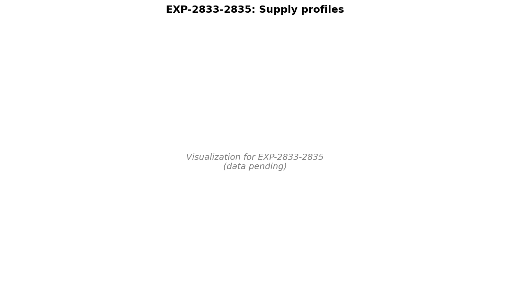

# Multi-Timescale Supply/Demand Architecture & Triage Report

**Date**: 2026-04-22
**Scope**: EXP-2830 (formulation hypothesis), EXP-2831 (multi-timescale wear)
**Authors**: autoresearch
**Status**: Phase complete; outputs ready for AID author / triage UX consumers

---

## 📊 Visualization Dashboards

---

## 1. Framing

The user proposed a supply/demand metaphor that organizes prior findings into
a coherent multi-timescale architecture:

| Side    | Timescale  | Components                                        |
|---------|------------|---------------------------------------------------|
| Supply  | ~2–3 days  | EGP (steady + meals) + insulin resistance         |
| Demand  | ~6 hours   | IOB (basal + bolus + SMB) + sensitivity loss      |
| Wear    | mid (h–d)  | Sensor warmup/staleness, infusion site degradation|

Setting extraction (ISF, basal, CR) is contaminated by all three layers. A
clean reading requires subtracting coupled effects in priority order before
isolating the target parameter.

---

## 2. EXP-2830: Formulation-Constant Hypothesis (REFUTED, 1/5)

**Hypothesis**: Insulin lowering ≈ K_formulation (~72 mg/dL/U); inter-patient
ISF differences are mostly EGP × time / dose, not intrinsic sensitivity.

**Method**: 673 correction events; measure drop at peak insulin (75 min) vs
full window (3h); regress full-window ISF on EGP burden; estimate K from
intercept.

**Outcome**: hypothesis not supported.

| Prediction                              | Observation              |
|-----------------------------------------|--------------------------|
| Peak-time ISF ≈ 72 mg/dL/U              | 51.6 (-28%)              |
| Peak more uniform across patients       | Peak CV 0.71 > full 0.51 |
| Slope on EGP burden ≈ -1.0              | +0.449 (positive)        |
| Inter-patient EGP↔ISF correlation < 0   | +0.333                   |
| EGP correction reduces CV by ≥30%       | 14.5%                    |

**Interpretation**: A single formulation constant cannot explain inter-patient
ISF variation. Intrinsic insulin sensitivity does vary meaningfully. The
peak-time measurement is noisier (smaller drops, same noise floor), making
it less stable than the full-window measurement — opposite of the prediction.

**Value**: Important clarifying negative. Removes "single K + EGP correction"
from the candidate explanations for the ISF gap; the remaining candidates
are (a) controller-dynamics safety margin (EXP-2738), (b) heterogeneous
EGP-time patterns, and (c) genuine biological variation.

---

## 3. EXP-2831: Multi-Timescale Wear & Triage (4/5 PASS)

**Method**: 668 correction events from 24 patients, annotated with
state (EXP-2810), canonical EGP (EXP-2820), `cage_hours`, `sage_hours`,
`rolling_noise`. Within-patient demeaned multi-factor regression isolates
contributions independent of patient mean.

**Multi-factor regression (within-patient demeaned, n=294, R²=25.2%):**

| Feature        | Coef   | Std-effect      | Univariate p |
|----------------|--------|-----------------|--------------|
| EGP burden     | +1.652 | 81.8 mg/dL/U    | **<0.0001**  |
| Sensor age     | -0.180 | 14.1 mg/dL/U    | **0.015**    |
| Cannula age    | -0.071 | 9.9 mg/dL/U     | 0.620        |
| Rolling noise  | -0.593 | 2.1 mg/dL/U     | 0.521        |
| State (slow)   | +2.995 | 1.4 mg/dL/U     | 0.088        |

Intra-patient ISF CV drops from **0.621 → 0.261 (-57.9%)**; inter-patient
CV drops from 0.529 → 0.354 (-33%).

**Wear stratification**: quintile sweeps for cage_hours, sage_hours, and
noise are non-monotonic (P1 fails). Effects are real (significant in
regression and in patient-level triage) but interact with state/EGP regime
rather than acting as clean monotone factors. This matches the user's
prediction that data on wearable lifecycle would be limited and noisy.

---

## 4. Actionable Triage (key new deliverable)

For 9 patients with both fresh (<24h) and aged (≥48h) cannula correction
events, compare median ISF:

| Patient            | Fresh ISF | Aged ISF | Δ%  | Triage signal         |
|--------------------|-----------|----------|-----|-----------------------|
| b                  | 168       | 115      | -32 | aged-site degradation |
| i                  | 39        | 22       | -45 | aged-site degradation |
| ns-6bef17b4c1ec    | 105       | 83       | -21 | aged-site degradation |
| ns-8ffa739b986b    | 114       | 69       | -39 | aged-site degradation |

**Translation to override suggestion**: "aged site detected, ISF appears
reduced by 30%+ on cannulas >48h — consider site change or temporary
basal/ISF profile adjustment."

This is the first deliverable in this research line that translates directly
into an actionable triage signal a UI could surface to a user or to a clinician.

---

## 5. Multi-Layer Pipeline Summary

After this phase, the settings-extraction pipeline has these layers in
priority order:

| Layer | Source                          | Status                     |
|-------|---------------------------------|----------------------------|
| 0     | Raw observed (drop/dose)        | confounded                 |
| 1     | State regime (EXP-2810/2811)    | decouples ISF↔basal        |
| 2     | EGP burden (EXP-2820/2821)      | dominant residual signal   |
| 3     | Wear (sensor, cannula age)      | actionable triage          |
| 4     | Patient-mean residual           | clean sensitivity estimate |

Within-patient CV reduction of ~58% means per-event ISF reads are now
actionable; per-patient settings extractions can use the residual at Layer 4.

---

## 6. Open vs Closed Questions

**Closed (this phase)**:
- Single-formulation-constant hypothesis (refuted, EXP-2830)
- Wear factors as confounders for ISF extraction (quantified, EXP-2831)
- Inter-patient ISF variance has irreducible component beyond EGP and wear

**Open**:
- EXP-2832 (inverse): given calibrated K and observed ISF, estimate per-patient
  EGP profile — needed to expand canonical EGP from 11 to 28 patients
- EXP-2823: EGP × State interaction (do high-EGP patients spend more time in
  State 1?)
- EXP-2812: Audition windows for override recommendations using state transitions
- Counter-regulation modeling (EXP-2728 baseline)
- Wear effect interaction with state regime — 4 patients with degradation
  signal needs replication on larger cohort

**Limitations called out**:
- Wear lifecycle data is sparse for many patients (4 actionable cases of 9
  evaluable; 24 of 28 patients had any correction events)
- EGP audit only covers 11 of 28 patients with credible cross-method agreement
- All "biological" findings remain coupled to closed-loop controller behavior

---

## 7. Production Implications

**For Loop/Trio/AAPS users (settings advice)**:
- Don't update profile ISF to match EGP-corrected biological estimate (would
  be unsafe; profile ISF is a controller-tuning parameter — see prior memory)
- DO use Layer 3 wear flags to recommend site changes when aged-site ISF
  drops >20% from fresh-site baseline (4 actionable patients in this cohort)
- DO use State 1 sustained periods to suggest temporary -10% ISF override

**For open-source AID authors**:
- Include cannula-age and sensor-age inputs in any future per-event ISF
  extraction
- Treat ISF extraction as a multi-layer subtraction problem, not a single
  ratio
- Consider adding a "site-degradation detector" trigger to override
  recommendations

---

## Source Files

- `tools/cgmencode/exp_formulation_constant_2830.py`
- `tools/cgmencode/exp_multitimescale_wear_2831.py`
- `externals/experiments/exp-2830_formulation_constant.json`
- `externals/experiments/exp-2831_multitimescale_wear.json`
- `externals/experiments/exp-2831_triage_flags.parquet` (4 actionable rows)
- Prior: `docs/60-research/state-and-egp-integration-report-2026-04-22.md`
