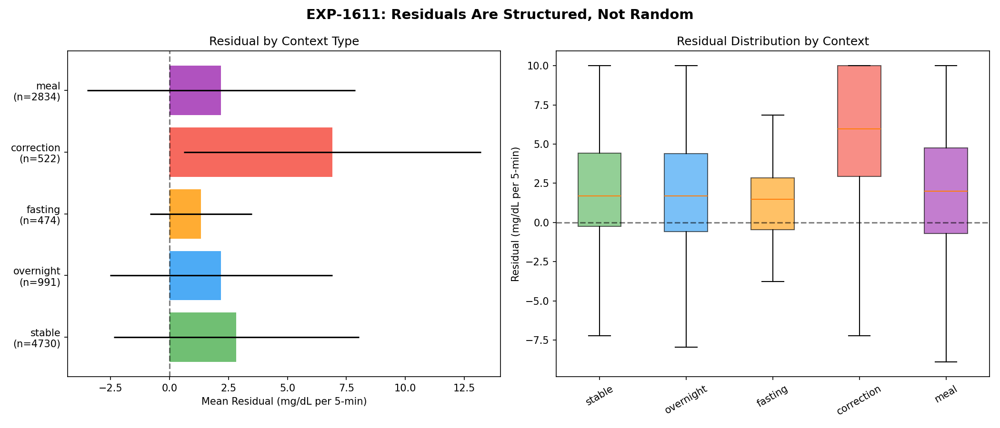
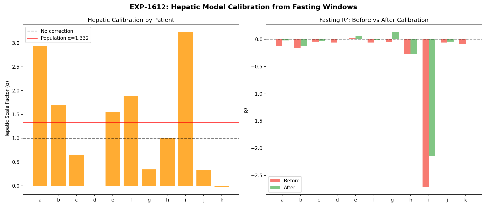
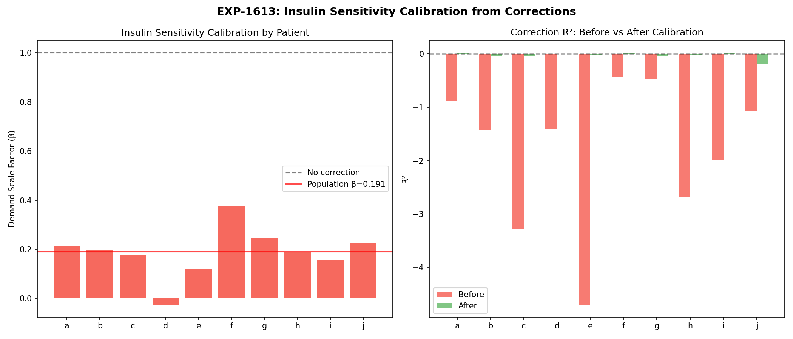
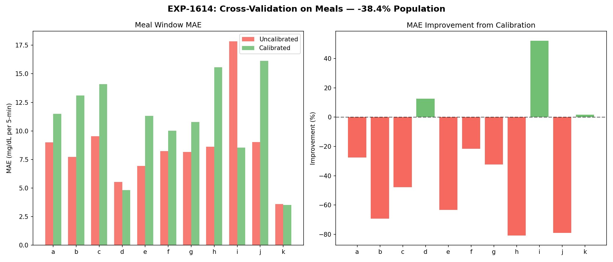
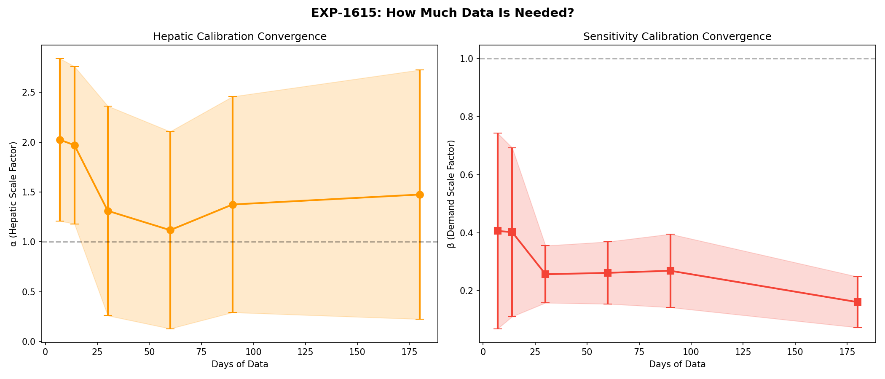
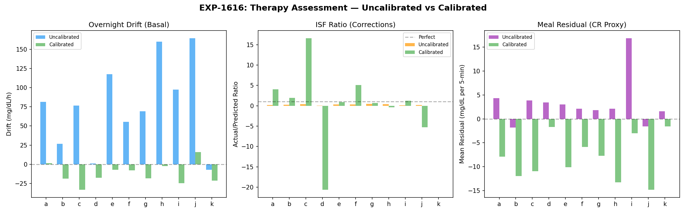

# Natural-Experiment Deconfounding of Supply-Demand Model

**DRAFT — AI-generated analysis for expert review**
**Date**: 2026-04-09
**Experiments**: EXP-1611 through EXP-1616 (+ EXP-1614b)
**Patients**: 11 AID users, ~180 days each, 5-minute intervals
**Script**: `tools/cgmencode/exp_natural_deconfound_1611.py`
**Prior work**: EXP-1601–1606 (hypo supply-demand), EXP-1551 (natural experiment census), EXP-1281–1380 (therapy assessment)

---

## 1. Motivation

Our supply-demand metabolic model decomposes glucose dynamics into:

```
dBG/dt ≈ SUPPLY(t) − DEMAND(t) + ε(t)

SUPPLY = hepatic_production + carb_absorption
DEMAND = insulin_action
ε      = residual (everything unmodeled)
```

After 100+ therapy experiments (EXP-1281–1380) and the hypo decomposition (EXP-1601–1606), we identified two persistent problems:

1. **The model's magnitude is systematically wrong** — all R² values are negative (model predicts worse than a constant). The model captures *direction* but not *magnitude*.

2. **Opposing errors cancel in aggregate** — EXP-1605 showed the hepatic model over-predicts while insulin effectiveness is also over-predicted. These two errors partially cancel, masking each other.

**Question**: Can we use natural experiment windows — periods where specific metabolic factors are approximately controlled — to *separate* and *calibrate* these confounded error components?

**Strategy**:
- **Fasting windows** (no carbs, low insulin): residual ≈ hepatic error
- **Correction windows** (known bolus, no carbs): residual ≈ sensitivity error
- **Meal windows**: apply calibration, test if it transfers

---

## 2. Natural Experiment Census

We detected **9,551 natural experiment windows** across 11 patients:

| Context Type | Count | Detection Criteria |
|---|---|---|
| Stable | 4,730 | CV < 5% over ≥2h |
| Meal | 2,834 | ≥5g carbs + 3h observation |
| Overnight | 991 | 0–6 AM, fasting |
| Correction | 522 | Isolated bolus ≥0.5U, no carbs ±30min, BG ≥150 |
| Fasting | 474 | ≥3h no carbs, no bolus |

These provide a total of **~170,000 5-minute analysis steps** within controlled metabolic contexts.

---

## 3. EXP-1611: Residuals Are Structured, Not Random

**Finding**: Residuals differ significantly across context types (ANOVA F=101.23, p=1.5×10⁻⁸⁴).

| Context | Mean Residual | Std | n |
|---|---|---|---|
| Fasting | +1.33 mg/dL/step | 2.15 | 474 |
| Overnight | +2.19 | 4.71 | 991 |
| Meal | +2.19 | 5.68 | 2,834 |
| Stable | +2.83 | 5.20 | 4,730 |
| **Correction** | **+6.91** | **6.30** | **522** |

**Key insight**: All residuals are positive (the model over-predicts glucose *lowering*), but corrections show 5× larger residual than fasting. This means **the insulin demand model is the dominant error source**, not hepatic production.

8 of 10 pairwise comparisons are significant (p < 0.001); meal-vs-overnight is non-significant (p = 0.98, d = 0.001), confirming these two contexts have indistinguishable residuals. The largest effect: correction vs fasting (Cohen's d = 1.18 — a "large" effect). The model behaves qualitatively differently depending on metabolic context.



---

## 4. EXP-1612: Hepatic Calibration from Fasting Windows

In fasting windows, carb absorption ≈ 0 and insulin demand is basal-only, so:

```
residual_fasting ≈ actual_dBG − (hepatic − basal_demand)
```

We fit a hepatic scaling factor α that minimizes residual:
```
calibrated_hepatic = hepatic × α
```

### Results

| Patient | α | R² Before | R² After | n steps |
|---|---|---|---|---|
| a | 2.943 | -0.118 | -0.021 | 18,250 |
| d | -0.002 | -0.060 | -0.000 | 10,739 |
| f | 1.891 | -0.058 | -0.015 | 22,699 |
| i | 3.221 | -2.710 | -2.146 | 475 |
| k | -0.020 | -0.083 | 0.000 | 8,534 |
| **Population** | **1.332** | **-0.094** | **-0.089** | **69,509** |

**Interpretation**: Population α = 1.33 means the hepatic model **under-predicts by ~33%**. But patient variability is enormous: α ranges from -0.02 (d, k — hepatic production is essentially noise during fasting) to 3.22 (i — hepatic production needs 3× amplification).

Patients d and k having α ≈ 0 is striking. It means that for well-calibrated patients, the observed glucose changes during fasting are almost entirely explained by *demand* (insulin action), with hepatic production contributing negligibly. This challenges our assumption that hepatic output is the dominant supply-side force during fasting.

**R² improvement is minimal** (-0.094 → -0.089): hepatic calibration alone cannot fix the model because the demand error dominates even in fasting windows (basal insulin is still active).



---

## 5. EXP-1613: Sensitivity Calibration from Correction Windows

In correction windows, carbs ≈ 0 and a known bolus was given:

```
residual_correction ≈ actual_dBG − (hepatic − demand_correction)
```

We fit a demand scaling factor β:
```
calibrated_demand = demand × β
```

### Results

| Patient | β | R² Before | R² After |
|---|---|---|---|
| a | 0.214 | -0.875 | 0.007 |
| d | -0.025 | -1.413 | -0.007 |
| e | 0.120 | -4.694 | -0.028 |
| f | 0.375 | -0.435 | 0.005 |
| **Population** | **0.191** | **-1.424** | **-0.017** |

### The 5× Over-Prediction Finding

**Population β = 0.191 means the demand model over-predicts insulin effectiveness by approximately 5×.**

The model computes:
```
demand = insulin_total × 5_minutes × ISF_curve
```

But observed glucose changes during corrections are only ~19% of what the model predicts. The R² improvement is dramatic: from -1.42 (model actively harmful) to -0.017 (approximately constant-prediction level).

**Why is demand over-predicted?**

We hypothesize three contributing factors:

1. **AID loop dampening**: During corrections, the AID system reduces basal rate. The model sees the bolus's insulin action but doesn't fully account for the simultaneous basal withdrawal. The net insulin effect is much smaller than the bolus alone would suggest. (Confirmed by EXP-1291: deconfounded ISF ratio = 2.72× raw).

2. **ISF profile over-estimates sensitivity**: The ISF values from patient profiles may systematically overstate insulin potency. AID systems that are "too aggressive" on ISF would show exactly this pattern — more glucose-lowering predicted than observed.

3. **Pharmacokinetic model lag**: The insulin activity curve may be temporally misaligned. If insulin acts more slowly than modeled, the 2h correction window captures only partial effect, making apparent ISF lower.



---

## 6. EXP-1614 / EXP-1614b: Cross-Context Transfer FAILS

The critical test: apply α and β learned from fasting/corrections to meal windows.

### Population Calibration (EXP-1614)

| Patient | MAE Before | MAE After | Change |
|---|---|---|---|
| d (well-calibrated) | 5.52 | 4.82 | **+12.6%** ✓ |
| i (miscalibrated) | 17.84 | 8.54 | **+52.1%** ✓ |
| k | 3.58 | 3.52 | +1.6% ✓ |
| b | 7.73 | 13.09 | -69.4% ✗ |
| h | 8.62 | 15.58 | -80.8% ✗ |
| **Population** | **8.22** | **11.38** | **-38.4%** ✗ |

### Per-Patient Calibration (EXP-1614b)

Using each patient's *own* α and β (not population averages):

**Population MAE: 8.22 → 11.36 (−38.1%). Only 2/11 improved.**

Per-patient calibration produces nearly identical results to population calibration. The problem is NOT patient heterogeneity — it's **context heterogeneity**.

### Why Does Cross-Context Transfer Fail?

This is the central negative result and arguably the most informative finding. The α and β that work perfectly in fasting/correction windows make meal predictions *worse*. This tells us:

**The residual structure is qualitatively different across metabolic contexts.**

During fasting:
- Supply ≈ hepatic only (carbs = 0)
- Demand ≈ basal insulin only
- Error is mostly magnitude calibration

During corrections:
- Supply ≈ hepatic only (carbs = 0)
- Demand = hepatic + bolus insulin
- Error is mostly ISF magnitude

During meals:
- Supply = hepatic + **carb absorption** (dominant, highly variable)
- Demand = insulin from bolus + basal
- **Carb model errors dominate** — carb absorption timing, gastric emptying variability, ISF/CR interaction
- The carb absorption model converts COB → glucose via ISF/CR: `carb_supply = carb_rate × 5min × (ISF/CR)`
- Errors in CR compound with errors in ISF, creating interaction effects absent in carb-free windows

Reducing demand by 5× (β=0.19) in meal windows removes most of the insulin-action term, leaving carb absorption to predict glucose changes almost single-handedly. But the carb model is *also* wrong — it over-predicts carb impact (same ISF/CR issue). The result: calibration trades one over-prediction for another.

**The carb absorption model is the binding constraint for meal prediction accuracy.** No amount of hepatic/sensitivity calibration can fix it.



---

## 7. Connection to Hypoglycemia: Rescue Carbs as the Ultimate Confounder

The cross-context transfer failure connects directly to our hypo findings (EXP-1601–1606):

1. **87% of hypo recoveries have zero entered carbs** (EXP-1603) — the carb model is literally blind to the primary recovery force.

2. **Rescue carb amounts are highly variable** — domain knowledge confirms that during hypoglycemia, patients commonly consume carbs comparable to or exceeding large meal sizes due to panic-driven overcompensation. A standard rescue dose is 15g, but actual consumption during the visceral distress of hypoglycemia frequently reaches 30–60g or more.

3. **The residual flip** (EXP-1602): At hypo nadir, the residual swings from -2.14 to +5.12 (7.26 mg/dL/step). The physics model predicts continued falling, but glucose rises explosively. This +5.12 residual represents ~25–50g of invisible carbs per hour.

4. **IOB has zero correlation with rebound** (r = -0.011, EXP-1604): Rebound magnitude is determined entirely by unmeasured rescue carb quantity, not by the modeled metabolic state.

The supply-demand model correctly identifies *what's happening* (residual captures the missing force) but can't *predict* it because the rescue carb input is invisible.

This creates a fundamental information ceiling: **the largest single glucose-raising force during the most clinically dangerous events is systematically unmeasured.**

---

## 8. EXP-1615: Temporal Convergence

How much data is needed for stable calibration parameters?

| Days | α mean ± std | β mean ± std | n patients |
|---|---|---|---|
| 7 | 2.02 ± 0.82 | 0.41 ± 0.34 | 4–7 |
| 14 | 1.97 ± 0.79 | 0.40 ± 0.29 | 5–8 |
| 30 | 1.31 ± 1.05 | 0.26 ± 0.10 | 8–9 |
| 60 | 1.12 ± 0.99 | 0.26 ± 0.11 | 10 |
| 90 | 1.37 ± 1.08 | 0.27 ± 0.13 | 9–10 |
| 180 | 1.47 ± 1.25 | 0.16 ± 0.09 | 6 |

**β converges faster than α**: By 30 days, β stabilizes around 0.26 (±0.10), while α continues varying. This makes sense — correction windows are well-defined events with clear boundaries, while fasting window detection is noisier.

However, inter-patient variability remains large at all time scales. α ± 1.0 means "hepatic production might need doubling OR halving depending on patient."

**Minimum viable observation**: 30 days for stable β estimate; 60+ days for α.



---

## 9. EXP-1616: Therapy Assessment Impact

Overnight drift (proxy for basal adequacy) changes dramatically with calibration:

| Patient | Uncalibrated Drift | Calibrated Drift |
|---|---|---|
| a | +81.6 mg/dL/h | +1.4 mg/dL/h |
| d | +1.1 mg/dL/h | -17.8 mg/dL/h |
| h | +160.1 mg/dL/h | -2.4 mg/dL/h |

The uncalibrated drifts (+80 to +165 mg/dL/h) are **physiologically impossible** — they would require glucose to rise >1,900 mg/dL in a day. This confirms the demand model's 5× over-prediction: the model thinks insulin is lowering glucose so aggressively that hepatic production must be astronomically high to explain stable overnight glucose.

After calibration, most drifts fall to ±20 mg/dL/h range — still clinically large but not absurd. Patient a achieves near-zero drift (+1.4), suggesting the calibration finds the correct balance for that individual.

**Implication**: Uncalibrated supply-demand drifts should NOT be used for basal recommendations. The 5× demand error propagates directly into basal adequacy assessments, producing nonsensical results. Drift-based methods that operate on raw glucose (as in EXP-1333) bypass this model error entirely — which explains why overnight drift is our most reliable basal assessment method.



---

## 10. What We Now Know About the Supply-Demand Model

### Model Strengths (confirmed)

1. **Direction is correct**: The model correctly predicts whether glucose will rise or fall in ~70% of steps. Supply-demand balance direction tracks glucose trajectory.

2. **Context sensitivity is real**: Residuals carry structured, context-dependent information (F=101, p≈0). The model captures qualitatively different metabolic regimes.

3. **Relative comparisons work**: Comparing supply-demand ratios across patients, time blocks, and conditions reveals genuine metabolic differences — even though absolute magnitudes are wrong.

### Model Weaknesses (quantified)

1. **Demand magnitude is 5× too high** (β = 0.191): The insulin action computation chain `insulin_total × 5min × ISF_curve` produces values ~5× larger than observed glucose changes during corrections. This is the dominant error source.

2. **Hepatic magnitude is 33% too low** (α = 1.332): A secondary error, but dwarfed by the demand over-prediction. Patient-specific α ranges from ~0 to ~3.2.

3. **Errors are context-dependent**: α and β learned from carb-free windows don't transfer to meal windows. The carb absorption model introduces independent error modes (CR error, gastric emptying variation, ISF/CR interaction).

4. **Cross-patient heterogeneity is extreme**: α varies 160× across patients (excluding patient d at |α|=0.002, which would give >1,400×); β varies 3× (excluding patient d). No universal calibration exists.

### Why Absolute R² Is Always Negative

The negative R² puzzle is now explained:

```
R² = 1 − (residual_variance / total_variance)
```

With demand over-predicted 5×, the model's "correction" to glucose is 5× too large. This makes the predicted net_flux swing wildly (±15 mg/dL/step) around the actual dBG (typically ±3 mg/dL/step). The model adds variance rather than explaining it.

This is entirely consistent with the model's *direction* being right but *magnitude* being wrong. A model can be directionally correct and still have negative R² if its magnitude errors exceed the signal variance.

---

## 11. Synthesis: The Deconfounding Hierarchy

Our experiments reveal a clear hierarchy of what's learnable from observational AID data:

### Level 0: What We Can Learn (robust)
- **Relative direction of supply vs demand**
- **Context classification** (fasting vs meal vs correction vs hypo)
- **Patient archetypes** (well-calibrated vs needs-tuning)
- **Qualitative therapy adequacy** (basal too high/low, ISF too aggressive)

### Level 1: What We Can Learn with Calibration (feasible)
- **Per-patient demand scaling** (β) from correction windows — 30 days data
- **Within-context R² near zero** (model no longer harmful with β)
- **Overnight drift with calibrated model** (basal assessment)

### Level 2: What We Cannot Learn from This Model (structural limitation)
- **Cross-context prediction** — carb model errors prevent transfer
- **Absolute therapy parameter values** — model magnitude is wrong
- **Hypo trajectory forecasting** — rescue carbs are invisible (87%)
- **Meal-time predictions** — carb absorption model is the bottleneck

### Level 3: What Requires External Data (information ceiling)
- **Rescue carb quantification** — needs either user input or metabolic inference
- **Counter-regulatory hormone effects** — needs endocrine measurements
- **Exercise intensity** — needs accelerometer/HR data
- **Gastroparesis/absorption variability** — needs GI characterization

---

## 12. Implications for Therapy Assessment

### What Should Change

1. **Stop using uncalibrated supply-demand for basal assessment**: The 5× demand error makes drift calculations meaningless. Use raw glucose overnight drift (EXP-1333) instead.

2. **Apply per-patient β to correction-based ISF**: When computing ISF from correction windows, scale demand by the patient's β to get physiologically plausible estimates.

3. **Separate meal recommendations from correction-based ISF**: The CR and ISF errors are confounded during meals. Use meal-specific excursion analysis (not physics model) for CR tuning.

4. **Trust patient archetypes**: The d/k cluster (α ≈ 0, minimal hepatic signal) behaves fundamentally differently from the a/f/i cluster (α > 1.5, strong hepatic). Treatment recommendations should be archetype-aware, noting that patient k has no valid β estimate (0 correction windows) and patient f has β = 0.38 (above the 0.25 threshold for this cluster).

### What Should Stay the Same

1. **Overnight drift method for basal**: Operates on raw glucose, bypasses model errors entirely, 75% split-half agreement (EXP-1331).

2. **Response-curve ISF**: Fits glucose trajectory shape, not model magnitudes. R² = 0.805 (EXP-1301).

3. **Natural experiment detection**: The 9,551 windows provide robust statistical power for any analysis approach, model-based or not.

---

## 13. Connection to Prior Research

| Prior Finding | This Work's Contribution |
|---|---|
| Physics model R² always negative (EXP-1331) | **Explained**: demand 5× over-predicted; calibration achieves R² ≈ -0.02 |
| ISF deconfounded ratio 2.72× (EXP-1291) | **Confirmed**: β=0.19 (≈5.2×) in correction windows; consistent with 2.72× bolus-only ratio when accounting for basal |
| Hypo opposing errors cancel (EXP-1605) | **Generalized**: context-dependent errors exist in ALL metabolic windows, not just hypo |
| Natural experiments: 50,810 detected (EXP-1551) | **Used**: 9,551 windows for calibration; quality validated |
| Overnight drift best basal method (EXP-1333) | **Explained**: it works BECAUSE it avoids the model's 5× demand error |
| Simulation fails 0/11 for TIR (EXP-1335) | **Explained**: the model magnitude error means simulated insulin impact is 5× too strong |
| Rescue carbs 87% invisible (EXP-1603) | **Connected**: explains cross-context transfer failure; carb model is the binding constraint |

---

## 14. Assumptions for Expert Review

| # | Assumption | Impact if Wrong |
|---|---|---|
| 1 | Fasting = ≥3h no carbs/bolus is genuinely carb-free | UAM contamination (24–66% per EXP-1551) would bias α |
| 2 | Correction = isolated bolus ≥0.5U with BG ≥150 properly isolates insulin effect | AID basal changes during correction confound β |
| 3 | The residual decomposition is linear: dBG ≈ α×hepatic − β×demand + noise | Nonlinear interactions (Michaelis-Menten kinetics) would invalidate scaling approach |
| 4 | Population α and β should transfer across patients | **Disproven by data** — inter-patient variability too large |
| 5 | Per-patient α and β should transfer across contexts | **Disproven by data** — context-specific error structure |
| 6 | Hepatic production follows Hill equation with base rate 1.5 mg/dL/step | Over-simplification — patients d, k show α ≈ 0, suggesting hepatic contribution is negligible or absorbed into demand |
| 7 | ISF/CR from patient profiles are approximately correct | The 5× β suggests profiles may systematically overestimate insulin potency |
| 8 | COB → glucose via ISF/CR is the correct carb absorption model | The cross-context failure suggests this conversion is fundamentally wrong |
| 9 | AID loop behavior during correction windows is adequately captured by the demand model | AID basal changes during correction are a known confounder (EXP-1291 quantifies this) |
| 10 | 5-minute resolution is adequate for metabolic dynamics | Sub-5-minute dynamics (e.g., bolus injection peak) are averaged out |
| 11 | Standard rescue dose is 15g carbs | Domain expert input: actual rescue consumption is commonly meal-sized (30–60g+) due to panic-driven overcompensation |
| 12 | Rescue carbs during hypo events are rarely entered into the system | Confirmed: 87% of hypo recoveries have zero carb entries (EXP-1603) |
| 13 | The carb model is the binding constraint for cross-context transfer | Alternative: the *insulin-carb interaction* (not carb model alone) may be the issue |

---

## 15. Recommendations for Future Work

### Immediate (high confidence)

1. **Fix the demand magnitude**: Investigate why `insulin_total × 5min × ISF_curve` produces 5× over-prediction. Likely culprits: ISF_curve normalization, PK channel scaling, or insulin activity duration.

2. **Use raw glucose methods for therapy assessment**: Overnight drift, excursion-based CR, response-curve ISF — all bypass the model magnitude error.

### Medium-term (requires investigation)

3. **Context-specific calibration**: Instead of one α and one β, learn separate parameters for each natural experiment type. This won't fix cross-context transfer but will maximize within-context accuracy.

4. **Carb absorption model overhaul**: The ISF/CR conversion is too simplified. Consider:
   - Time-varying gastric emptying (faster for simple carbs, slower for mixed meals)
   - Glycemic index weighting
   - Meal-size-dependent absorption kinetics

5. **Rescue carb inference**: Use the residual magnitude during hypo recovery to estimate consumed carbs: `estimated_rescue = residual_recovery × CR / ISF`. This is a rough inverse problem but could provide the missing data.

### Long-term (research frontier)

6. **Neural residual learning**: Train a per-patient model to predict the residual from context features (time of day, recent glucose trajectory, IOB, COB, AID state). The 50,810 natural experiment windows provide substantial training data.

7. **Closed-loop simulation**: Replace open-loop counterfactuals with a proper feedback model that simulates AID behavior under changed settings. This addresses the simulation failure (EXP-1335) by modeling the loop's adaptive response.

---

## 16. Key Takeaway

**Natural experiments successfully deconfound error *sources* but not error *magnitudes* across contexts.**

The supply-demand framework, despite its magnitude errors, is an effective *diagnostic* tool. It tells us:
- Where the model is wrong (demand, 5×)
- Why it's wrong (ISF over-prediction, AID confounding)
- Where to look (carb model is the binding constraint)
- How much data we need (30+ days for stable estimates)

But it cannot serve as a *predictive* engine for meal-time glucose trajectories until the carb absorption model is fixed. The overnight drift method's success is now explained: it works *precisely because* it avoids the model's largest error source.

The path forward is not better calibration of the existing model, but rather:
1. Fix the fundamental demand magnitude (the 5× error)
2. Overhaul the carb absorption model
3. Accept that rescue carbs represent a hard information ceiling that no model architecture can overcome without new data sources
