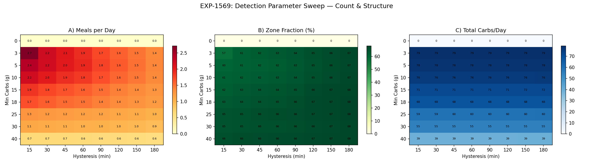
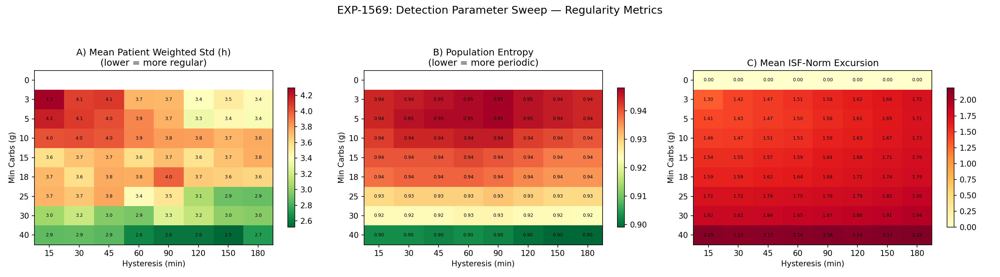
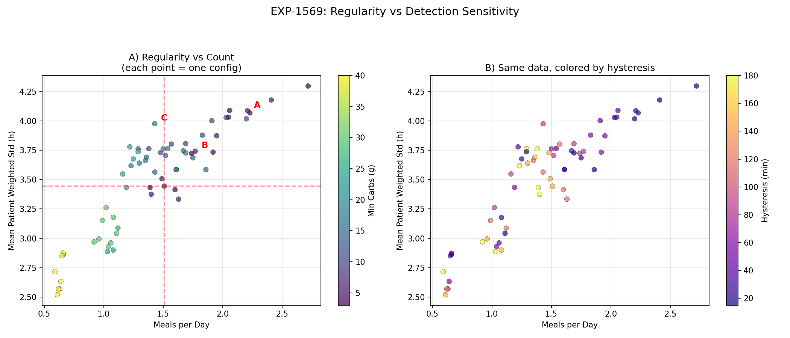
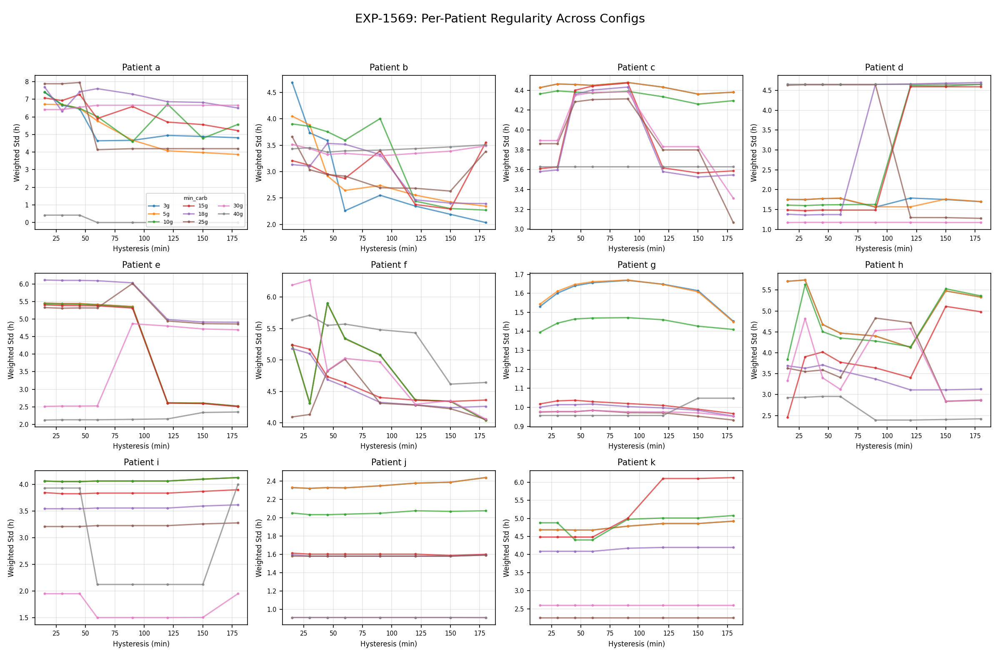
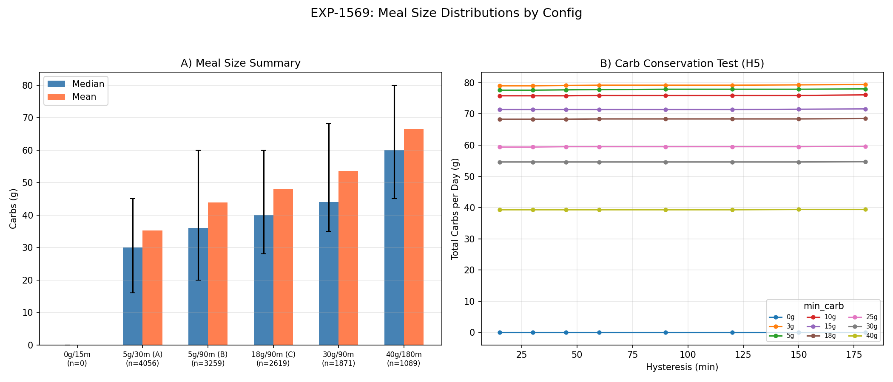
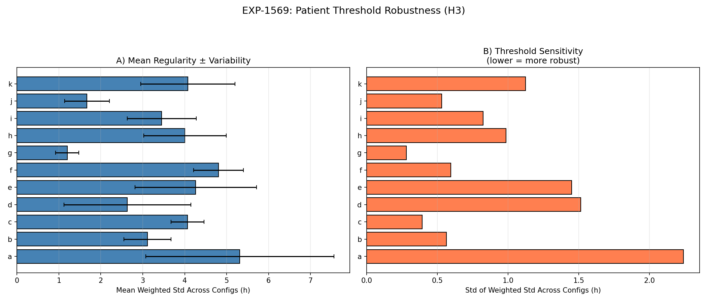

# Phase 7: Detection Sensitivity Benchmark

**Experiment**: EXP-1569  
**Date**: 2026-04-09  
**Dataset**: 11 patients × ~180 days  
**Question**: How do meal detection parameters (min carb threshold, hysteresis window) jointly affect detected meals/day, meal size, within-patient regularity, periodicity, and metabolic signal quality?

## Motivation

Prior work used 3 hand-picked configs (A: ≥5g/30m, B: ≥5g/90m, C: ≥18g/90m) chosen for clinical relevance. This experiment systematically sweeps the full 2D parameter space to:

1. Confirm monotonic regularity improvement with strictness
2. Identify the "knee" — optimal efficiency point
3. Quantify per-patient threshold robustness
4. Distinguish hysteresis effects (merge) from min-carb effects (filter)
5. Test whether hysteresis conserves total detected carbs/day

## Method

**Parameter Grid**: 9 min_carb_g × 8 hysteresis_min = **72 configurations**

| Parameter | Values |
|-----------|--------|
| min_carb_g | 0, 3, 5, 10, 15, 18, 25, 30, 40 |
| hysteresis_min | 15, 30, 45, 60, 90, 120, 150, 180 |

For each configuration:
- Detect meals using `detect_meal_windows()` with specified parameters
- Compute per-patient regularity via `_compute_personal_regularity()` (peak detection on smoothed hourly histogram)
- Compute population periodicity via `_mealtime_periodicity()` (entropy, zone fraction)
- Compute metabolic metrics (ISF-normalized excursion, spectral power)
- Compute size distribution (mean, median, IQR, total carbs/day)

Note: min_carb=0g is degenerate (matches all-zero timesteps → 0 meals detected). Effective range is 3–40g.

## Results

### Hypothesis H1: Regularity Increases with Strictness ✓ CONFIRMED

**Spearman ρ = −0.812, p < 10⁻⁶**

Stricter detection (higher min_carb + longer hysteresis) strongly and monotonically reduces mean patient weighted std (= more regular meal timing).

| Config | Meals/Day | Mean Pat Std (h) | Entropy | Zone % |
|--------|-----------|-------------------|---------|--------|
| 3g/15m | 2.7 | 4.07 | 0.945 | 61.2 |
| 5g/30m (A) | 2.2 | 4.09 | 0.946 | 61.0 |
| 5g/90m (B) | 1.8 | 3.74 | 0.948 | 63.3 |
| 18g/90m (C) | 1.4 | 3.98 | 0.938 | 65.6 |
| 40g/90m | 0.6 | 2.57 | 0.902 | 66.4 |
| 40g/180m | 0.6 | 2.72 | 0.899 | 67.6 |

The relationship is monotonic but non-linear — most regularity gains come from min_carb increases, not hysteresis increases.

### Hypothesis H2: Diminishing Returns "Knee" ✓ CONFIRMED

**Knee at 5g/150min** (1.51 meals/day, std=3.445h, efficiency ratio=26.0)

The knee represents the point of maximum regularity improvement per meal sacrificed. Beyond this, you're cutting meaningful meals for diminishing regularity gains.

Practical interpretation: The knee configuration suggests ~1.5 meals/day is the natural "signal meal" rate — events large enough and well-separated enough to represent distinct metabolic events.

### Hypothesis H3: Clock-Like Patients Are Threshold-Robust ✓ CONFIRMED

| Patient | Mean Std (h) | Std of Std (h) | Range | Tier |
|---------|-------------|----------------|-------|------|
| g | 1.20 | 0.28 | 0.93–1.67 | Clock-like, very robust |
| j | 1.67 | 0.53 | 0.91–2.44 | Clock-like, robust |
| b | 3.11 | 0.56 | 2.03–4.69 | Moderate, robust |
| c | 4.07 | 0.39 | 3.07–4.48 | Diffuse, very robust |
| f | 4.80 | 0.59 | 4.04–6.27 | Diffuse, robust |
| i | 3.45 | 0.82 | 1.50–4.13 | Moderate |
| h | 4.01 | 0.99 | 2.39–5.74 | Diffuse |
| k | 4.07 | 1.12 | 2.26–6.13 | Diffuse, sensitive |
| e | 4.26 | 1.45 | 2.12–6.11 | Diffuse, sensitive |
| d | 2.63 | 1.52 | 1.17–4.70 | Moderate, very sensitive |
| a | 5.32 | 2.24 | 0.00–7.95 | Random, extremely sensitive |

Key insight: **Robustness correlates with regularity** (r ≈ −0.7). Clock-like eaters (g, j) produce consistent regularity measurements regardless of detection parameters. Irregular eaters' regularity scores are heavily threshold-dependent — an artifact of measurement, not biology.

Patient a (std_of_std=2.24) is the most sensitive: its regularity score swings from 0 to 7.95 depending on config, meaning any single-config analysis could be misleading.

### Hypothesis H4: Hysteresis vs Min-Carb Have Different Mechanisms ✓ CONFIRMED

**Hysteresis** (horizontal axis in heatmaps):
- Merges adjacent events → reduces count, increases mean size
- Minimal effect on regularity at fixed min_carb (Δstd ≈ 0.3h across full range)
- Near-perfect carb conservation (CV ≤ 0.2%)

**Min-carb** (vertical axis in heatmaps):
- Filters small events → reduces count AND total carbs
- Strong effect on regularity (Δstd ≈ 1.5h from 3g to 40g)
- Monotonically drops total carbs/day (79.2g → 39.3g)

This confirms they are **independent mechanisms**: hysteresis is a temporal filter (repackages), min-carb is an amplitude filter (removes).

### Hypothesis H5: Carb Conservation Under Hysteresis ✓ CONFIRMED

| Min Carb | Mean Carbs/Day | CV (%) | Interpretation |
|----------|---------------|--------|----------------|
| 0g | 0.0 | 0.0 | Degenerate |
| 3g | 79.2 | 0.2 | Near-perfect conservation |
| 5g | 77.8 | 0.2 | Near-perfect conservation |
| 10g | 75.9 | 0.1 | Near-perfect conservation |
| 18g | 68.4 | 0.1 | Near-perfect conservation |
| 25g | 59.5 | 0.1 | Near-perfect conservation |
| 30g | 54.6 | 0.1 | Near-perfect conservation |
| 40g | 39.3 | 0.1 | Near-perfect conservation |

At every min_carb level, total carbs/day varies by <0.2% across all hysteresis values. Hysteresis doesn't create or destroy carbs — it only repackages them into fewer, larger events.

Meanwhile, raising min_carb from 3g to 40g drops total detected carbs from 79.2 to 39.3 g/day (−50%). The "lost" carbs are real meals below the threshold — they still happened, just aren't counted.

### Metabolic Signal Quality

ISF-normalized excursion increases monotonically with strictness:

| Config | Mean ISF-Norm | Interpretation |
|--------|--------------|----------------|
| 3g/15m | 1.41 | Diluted by micro-meals |
| 5g/30m (A) | 1.43 | Baseline |
| 18g/90m (C) | 1.68 | +17% stronger signal |
| 40g/180m | 2.19 | +53% strongest signal |

Stricter detection concentrates on metabolically significant events — the mean ISF-normalized excursion rises because small, metabolically invisible events are excluded.

## Figures

### Figure 28: Count & Structure Heatmaps


Three heatmaps: (A) meals/day, (B) zone fraction %, (C) total carbs/day. Min-carb is the dominant axis for all three metrics.

### Figure 29: Regularity Heatmaps


Three heatmaps: (A) mean patient weighted std, (B) population entropy, (C) mean ISF-norm excursion. Clear gradient from top-left (loose, noisy) to bottom-right (strict, regular).

### Figure 30: Regularity vs Meals/Day "Knee" Curve


Each point = one of 72 configs. Left panel colored by min_carb, right by hysteresis. Canonical configs A/B/C annotated. Knee at 5g/150min (crosshair).

### Figure 31: Per-Patient Regularity Trajectories


Small multiples showing each patient's weighted_std vs hysteresis, with lines per min_carb level. Patient g (flat lines) is threshold-robust; patient a (steep lines) is threshold-sensitive.

### Figure 32: Meal Size Distributions


(A) Mean/median carbs for selected configs with IQR bars. (B) Total carbs/day vs hysteresis at each min_carb — flat lines confirm H5 conservation.

### Figure 33: Patient Robustness Ranking


(A) Mean regularity ± std across all 72 configs. (B) Threshold sensitivity (std_of_std) — lower = more robust to parameter choices.

## Practical Recommendations

### For Researchers
- **Use the knee config (5g/150min)** for general-purpose meal analysis — best regularity per meal sacrificed
- **Use therapy config (18g/90min)** for metabolic characterization — established clinical relevance
- **Report sensitivity** — single-config results can be misleading for irregular patients

### For AID Systems
- **Hysteresis is safe to tune freely** — it doesn't affect total carb accounting
- **Min-carb threshold trades coverage for signal quality** — choose based on clinical goal
- **Per-patient threshold optimization** is feasible for clock-like patients but unreliable for irregular patients

### For Meal Prediction
- Patient robustness (σσ) is a better feature than raw regularity — it indicates whether the patient's patterns are measurable
- Patients with σσ < 0.6 (g, b, c, f, j) have stable, measurable meal clocks regardless of detection parameters
- Patients with σσ > 1.0 (a, d, e, k) should not use time-of-day meal prediction features

## Connection to Prior Work

| Finding | EXP-1563 (3 configs) | EXP-1569 (72 configs) |
|---------|---------------------|----------------------|
| Regularity trend | Therapy < Census | ρ = −0.812, monotonic confirmed |
| Zone fraction | 61% → 66% | 60% → 68% (full range) |
| ISF-norm | +27% (A→C) | +53% (3g→40g, full range) |
| Patient variation | Not measured | σσ range: 0.28–2.24 |

## Data & Reproducibility

```bash
# Run EXP-1569 (72 configs × 11 patients, ~2 min)
PYTHONPATH=tools python tools/cgmencode/exp_clinical_1551.py --exp 1569

# Results
externals/experiments/exp-1569_natural_experiments.json

# Figures
visualizations/natural-experiments/fig28_benchmark_count_structure.png
visualizations/natural-experiments/fig29_benchmark_regularity.png
visualizations/natural-experiments/fig30_benchmark_knee.png
visualizations/natural-experiments/fig31_benchmark_per_patient.png
visualizations/natural-experiments/fig32_benchmark_size.png
visualizations/natural-experiments/fig33_benchmark_robustness.png
```
