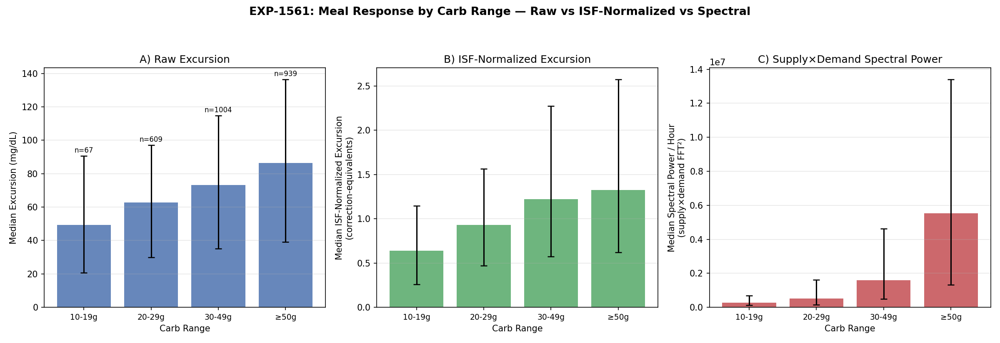
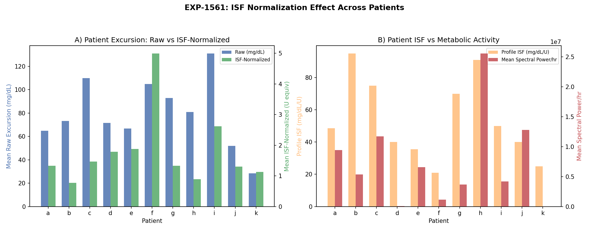
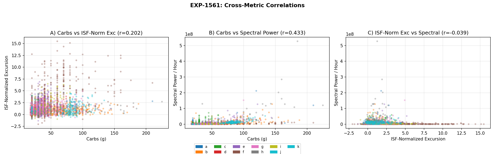

# Natural Experiments Phase 3: Meal Response Metabolic Characterization

**Experiment**: EXP-1561  
**Date**: 2026-04-09  
**Dataset**: 11 patients, ~180 days CGM+AID data  
**Config**: Therapy (≥18g carbs, 90-min clustering)  
**Meals analyzed**: 2,619

## Motivation

Phase 1 (EXP-1551–1558) established a census of 50,810 natural experiments.
Phase 2 (EXP-1559) analyzed meal detection sensitivity across 3 threshold configs.
Both phases reported raw glucose excursion by carb range — but raw mg/dL excursion
is not directly comparable across patients with different insulin sensitivities.

A 70 mg/dL excursion means fundamentally different things for:
- Patient f (ISF=21 mg/dL/U) → **3.3 correction units** of work
- Patient b (ISF=95 mg/dL/U) → **0.7 correction units** of work

This phase adds two new analytical dimensions:

1. **ISF-Normalized Excursion** = excursion ÷ patient ISF (correction-equivalents)
2. **Supply×Demand Spectral Power** = frequency-domain energy of the metabolic
   interaction signal during the meal window (captures AID "work")

## Method

### ISF Normalization

Each patient's profile ISF is extracted via `_extract_isf_scalar()`, which handles
mmol/L auto-detection (ISF < 15 → multiply by 18.0182). The scalar median ISF from
the profile schedule is used.

ISF-normalized excursion is dimensionless and represents "how many correction boluses
would be needed to reverse this excursion." This enables valid cross-patient comparison.

### Supply×Demand Spectral Power

For each meal window [start_idx, end_idx]:

1. Extract supply(t) and demand(t) from the metabolic engine
   - Supply = hepatic production + carb absorption (mg/dL per 5min)
   - Demand = insulin action (mg/dL per 5min)
2. Compute element-wise product: `interaction(t) = supply(t) × demand(t)`
3. Apply FFT: `fft_coeffs = rfft(interaction)`
4. Drop DC component (mean): `spectral_power = Σ|fft_coeffs[1:]|²`
5. Normalize by duration: `spectral_power_per_hour = spectral_power / hours`

This captures the **dynamic metabolic interaction intensity** — how much push-pull
occurs between carb absorption and insulin action. High spectral power means the
AID system is actively working to manage the meal. Low power means a quiet metabolic
state (small meals, minimal insulin response, or well-matched CR).

## Results

### Per-Patient ISF and Normalization Effect

| Patient | ISF (mg/dL/U) | Meals | Mean Raw Exc | Mean ISF-Norm | Mean Spec Power/hr |
|---------|--------------|-------|-------------|--------------|-------------------|
| a | 48.6 | 137 | 64.9 | 1.334 | 9,428,661 |
| b | 95.0 | 646 | 73.1 | 0.770 | 5,346,331 |
| c | 75.0 | 204 | 109.8 | 1.464 | 11,732,245 |
| d | 40.0 | 196 | 71.4 | 1.784 | 58,939 |
| e | 35.5 | 283 | 66.6 | 1.877 | 6,556,032 |
| f | 21.0 | 263 | 104.9 | **4.996** | 1,170,224 |
| g | 70.0 | 479 | 92.8 | 1.326 | 3,688,432 |
| h | 91.0 | 156 | 80.9 | 0.889 | 25,577,580 |
| i | 50.0 | 90 | 131.0 | **2.620** | 4,196,727 |
| j | 40.0 | 143 | 51.9 | 1.298 | 12,803,029 |
| k | 25.0 | 22 | 28.3 | 1.131 | 4,608 |

**Key insight — ISF normalization re-ranks patients**:
- Patient f: raw excursion 104.9 mg/dL (3rd highest) → ISF-normalized **4.996** (1st by far)
  With ISF=21, each excursion costs ~5 correction units — the most metabolically expensive
- Patient i: raw 131.0 (1st) → ISF-normalized 2.620 (2nd) — still high but less extreme
- Patient b: raw 73.1 (mid-pack) → ISF-normalized 0.770 (lowest) — high ISF means easy corrections

**Spectral power reveals AID activity heterogeneity**:
- Patient h: highest spectral power (25.6M) despite moderate raw excursion — very active AID
- Patient d & k: near-zero spectral power — minimal supply×demand dynamics
  (patient d: ISF=40, patient k: ISF=25, few meals)

### Excursion by Carb Range: Three Dimensions

| Carb Range | n | Raw Exc (med) | ISF-Norm (med) | Spec Power/hr (med) |
|------------|------|-------------|---------------|-------------------|
| 10–19g | 67 | 49.2 | 0.640 | 263,308 |
| 20–29g | 609 | 62.7 | 0.929 | 506,955 |
| 30–49g | 1,004 | 73.1 | 1.220 | 1,591,643 |
| ≥50g | 939 | 86.5 | 1.326 | 5,518,881 |

**Scaling behavior differs across metrics**:
- Raw excursion: ~1.8× from 10–19g to ≥50g (49→87 mg/dL)
- ISF-normalized: ~2.1× (0.64→1.33 correction-equivalents)
- Spectral power: **~21× from 10–19g to ≥50g** (263K→5.5M)

The spectral power scales much more steeply with carb size than either excursion
measure. This is expected: larger meals drive both higher supply (carb absorption)
AND higher demand (insulin response), and their product amplifies super-linearly.

### Cross-Metric Correlations

| Pair | Pearson r | Interpretation |
|------|----------|---------------|
| carbs vs raw excursion | 0.149 | Weak — excursion poorly predicted by carbs alone |
| carbs vs ISF-norm excursion | **0.202** | Slightly stronger after normalization |
| carbs vs spectral power | **0.433** | Moderate — best carb predictor of the three |
| raw excursion vs ISF-norm | 0.732 | Strong — normalization preserves ranking |
| raw excursion vs spectral power | 0.068 | Near-zero — **orthogonal measures** |
| ISF-norm vs spectral power | −0.039 | Near-zero — **fully independent** |
| spectral power vs signal energy | 0.971 | Near-identical (validation) |

**Critical finding**: ISF-normalized excursion and spectral power are **orthogonal**
(r = −0.039). They capture completely independent aspects of the meal response:

- **ISF-normalized excursion**: How far glucose deviates (glycemic impact)
- **Spectral power**: How much metabolic work the AID system performs (dynamic response)

A meal can have high excursion but low spectral power (inadequate AID response)
or low excursion but high spectral power (aggressive AID successfully contained it).

### Announced vs Unannounced Meals

| Metric | Announced (n=2,409) | Unannounced (n=210) |
|--------|-------------------|-------------------|
| Mean raw excursion | 80.5 mg/dL | 105.0 mg/dL |
| Mean ISF-norm excursion | 1.699 | 1.437 |
| Mean spectral power/hr | 6,805,539 | 4,211,765 |

**Paradox explained by ISF normalization**: Unannounced meals have *higher* raw
excursion (105 vs 80.5 mg/dL) but *lower* ISF-normalized excursion (1.44 vs 1.70).
This suggests unannounced meals occur more often in high-ISF patients (who can
tolerate larger raw excursions with fewer correction-equivalents). The lower spectral
power for unannounced meals confirms: less AID activity when no bolus is given.

## Visualizations

### Figure 9: Three-Panel Carb Range Comparison

Three views of the same 2,619 meals:
- Panel A: Raw excursion (mg/dL) — the baseline view from Phase 1–2
- Panel B: ISF-normalized excursion (correction-equivalents) — cross-patient comparable
- Panel C: Supply×demand spectral power/hour — metabolic interaction intensity

The super-linear scaling of spectral power with carb range is clearly visible.

### Figure 10: Per-Patient ISF Normalization Effect

- Panel A: Raw vs ISF-normalized excursion per patient (dual axis)
- Panel B: Profile ISF alongside mean spectral power per patient

Demonstrates how ISF normalization changes the patient ranking — patient f
(ISF=21) has moderate raw excursion but extreme normalized excursion.

### Figure 11: Cross-Metric Scatter Correlations

Color-coded by patient showing:
- Carbs vs ISF-normalized excursion (r=0.202) — weak positive
- Carbs vs spectral power (r=0.433) — moderate positive
- ISF-norm excursion vs spectral power (r=−0.039) — **orthogonal**

The orthogonality in Panel C is the key finding: these are independent dimensions.

## Clinical Implications

### 1. ISF-Normalized Excursion for Cross-Patient Comparison

Raw excursion in mg/dL is misleading for comparing patients or evaluating
meal management quality. ISF-normalized excursion (correction-equivalents)
provides a universal scale:
- < 1.0: Meal well-managed (less than one correction's worth of excursion)
- 1.0–2.0: Typical meal response
- \> 2.0: Poorly managed or very large meal relative to insulin sensitivity

**Population median: 1.22 for 30–49g meals** — the typical meal generates
about 1.2 correction-equivalents of glucose excursion.

### 2. Spectral Power as AID Activity Metric

Supply×demand spectral power captures something neither glucose level nor
excursion measures: the *intensity* of metabolic regulation. Applications:
- **AID tuning feedback**: High spectral power + low excursion = well-tuned
- **Meal complexity scoring**: spectral power separates "metabolically quiet"
  small meals from "metabolically intense" large/complex meals
- **Identifies undertreated meals**: High excursion + low spectral power

### 3. Two-Dimensional Meal Quality Framework

Since excursion and spectral power are orthogonal, they define a 2D space:

| | Low Spectral Power | High Spectral Power |
|---|---|---|
| **Low Excursion** | Quiet meal (small, well-absorbed) | Well-managed (AID worked hard, succeeded) |
| **High Excursion** | **Undertreated** (AID inactive) | AID active but overwhelmed |

This framework could inform per-meal feedback in AID systems.

## Source Files

- Experiment: `tools/cgmencode/exp_clinical_1551.py` (EXP-1561, `exp_1561_meal_metabolic`)
- Results: `externals/experiments/exp-1561_natural_experiments.json`
- Visualizations: `visualizations/natural-experiments/fig{9,10,11}_*.png`
- Production detector: `tools/cgmencode/production/natural_experiment_detector.py`

## Gaps Identified

- **GAP-ALG-015**: No per-meal ISF normalization in production pipeline — meals
  module reports raw excursion only
- **GAP-ALG-016**: Spectral power not yet integrated into production meal quality
  scoring — would enable the 2D quality framework
- **GAP-PROF-005**: Time-varying ISF not used for normalization — current approach
  uses median profile ISF, but ISF varies by time of day (dawn effect, etc.)
