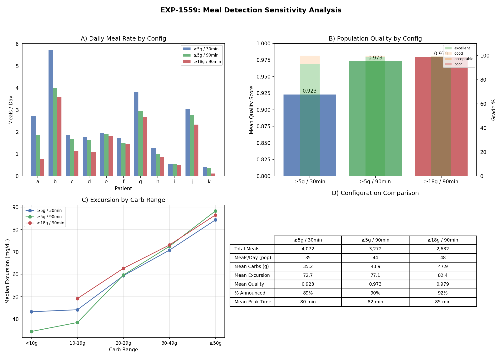

# Natural Experiments: Meal Detection Sensitivity Report

**EXP-1559 — Meal Detection Threshold Sensitivity Analysis**

Date: 2026-04-10
Phase: 2 of Natural Experiments Census
Depends on: EXP-1551–1558 (Phase 1 Census)

## Executive Summary

This report characterizes how meal detection threshold choices affect the census
of natural glucose tolerance test (GTT) windows. We compare three configurations:

| Config | Min Carbs | Cluster Gap | Rationale |
|--------|-----------|-------------|-----------|
| A (Census) | ≥5 g | 30 min | Maximum yield, captures micro-entries |
| B (Medium) | ≥5 g | 90 min | Hysteresis to separate distinct meals |
| C (Therapy) | ≥18 g | 90 min | Clinically meaningful meals only |

**Key Findings:**
- 90-min hysteresis alone (B) removes 20% of meals but boosts quality 0.923→0.973
- Adding ≥18g threshold (C) further reduces to 2,632 meals (−35% vs A) with
  highest quality (0.979) and 99.2% excellent grade
- Patient impact is highly uneven: patients with micro-entries (a, k) lose ~69–72%
  of meals; patients with large meals (e, i) lose <10% (f loses 16%)
- Excursion-by-carb-range is remarkably consistent across configs: ≥50g meals
  produce ~85 mg/dL excursion regardless of detection method

## Background

### Phase 1 Census (EXP-1551)

The Phase 1 census detected 4,072 meal windows using the default configuration
(≥5g carbs, 30-min clustering gap). Key observations prompted this sensitivity
analysis:

1. **Patient b** enters ~34 carb entries/day with median 2.3g — Loop-style micro
   entries for COB tracking — inflating meal counts
2. **Patient k** has 69% of entries <18g, representing snacks and corrections
3. The 30-min clustering gap may merge genuinely separate meals or fail to merge
   components of the same meal entered over time

### Detection Mechanism

The meal detector works as follows:
1. Find all timesteps where `carbs ≥ min_carbs`
2. Cluster adjacent events within `cluster_gap` steps into single meals
3. Sum carbs across the cluster
4. Observe 3 hours post-meal for excursion analysis
5. Score quality based on glucose coverage and observation completeness

**Parameters tested:**
- `min_carbs`: Minimum carb entry to trigger detection (5g vs 18g)
- `cluster_gap`: Steps within which entries merge (6 steps = 30 min vs 18 steps = 90 min)

## Results

### Population Summary

| Metric | A: ≥5g/30m | B: ≥5g/90m | C: ≥18g/90m |
|--------|-----------|-----------|------------|
| Total Meals | 4,072 | 3,272 (−20%) | 2,632 (−35%) |
| Mean Carbs (g) | 35.2 | 43.9 | 47.9 |
| Mean Excursion (mg/dL) | 72.7 | 77.1 | 82.4 |
| Mean Quality | 0.923 | 0.973 | 0.979 |
| % Excellent Grade | 93.0% | 98.5% | 99.2% |
| % Announced | 89.0% | 90.1% | 91.9% |
| Mean Peak Time (min) | 79.7 | 82.5 | 85.1 |

### Per-Patient Impact

| Patient | A (meals/day) | B (meals/day) | C (meals/day) | A→C Loss |
|---------|--------------|--------------|--------------|----------|
| a | 2.7 | 1.9 | 0.8 | −72% |
| b | 5.7 | 4.0 | 3.6 | −37% |
| c | 1.9 | 1.7 | 1.1 | −39% |
| d | 1.8 | 1.6 | 1.1 | −38% |
| e | 1.9 | 1.9 | 1.8 | −7% |
| f | 1.7 | 1.5 | 1.5 | −16% |
| g | 3.8 | 3.0 | 2.7 | −30% |
| h | 1.3 | 1.0 | 0.9 | −32% |
| i | 0.6 | 0.5 | 0.5 | −8% |
| j | 3.0 | 2.8 | 2.3 | −23% |
| k | 0.4 | 0.4 | 0.1 | −69% |

**Observations:**
- **Patient a** is most affected (−72%): 69% of their carb entries are <18g
  (small snacks, juice boxes for lows)
- **Patient k** drops to just 0.1 meals/day under Config C — nearly all entries
  are small
- **Patients e, f, i** are barely affected (<16% loss) — they enter large,
  well-defined meals
- **Patient b** loses 37% despite high entry frequency — the 90-min gap merges
  their micro-entries into fewer, larger meals (carbs increase 36→51g)

### Quality Improvement

Config C achieves 99.2% excellent-grade meals (vs 93.0% for A). The quality
improvement comes from two mechanisms:

1. **Larger meals have longer observation windows**: A 3-hour post-prandial
   observation period is more complete when the meal itself is substantial
2. **Merged clustering reduces edge effects**: The 90-min gap ensures the
   observation window doesn't overlap with the next meal

Quality grades (% of meals):

| Grade | A | B | C |
|-------|---|---|---|
| Excellent (≥0.80) | 93.0% | 98.5% | 99.2% |
| Good (0.60–0.79) | 7.0% | 1.5% | 0.8% |
| Acceptable (0.40–0.59) | 0.0% | 0.0% | 0.0% |
| Poor (<0.40) | 0.0% | 0.0% | 0.0% |

### Excursion by Carb Range

| Carb Range | A: Median Exc | B: Median Exc | C: Median Exc |
|------------|--------------|--------------|--------------|
| <10 g | 43.3 (n=306) | 34.5 (n=146) | — (n=0) |
| 10–19 g | 44.2 (n=813) | 38.5 (n=467) | 49.2 (n=67) |
| 20–29 g | 59.4 (n=758) | 59.7 (n=516) | 62.7 (n=609) |
| 30–49 g | 70.8 (n=1260) | 72.5 (n=1077) | 73.1 (n=1004) |
| ≥50 g | 84.3 (n=919) | 88.3 (n=1053) | 86.5 (n=939) |

**Key insight**: The excursion-carb relationship is stable across configs.
The ≥50g range shows ~85–88 mg/dL median excursion regardless of detection
method. Config B/C shift meals toward larger carb ranges (more merging),
slightly increasing mean excursion but not changing the underlying physiology.

### Time-of-Day Distribution

All three configs show the same circadian pattern:
- Morning peak (6–9 AM): Breakfast
- Midday peak (11 AM–1 PM): Lunch
- Evening peak (5–8 PM): Dinner
- The 90-min gap (B, C) slightly sharpens these peaks by merging grazing
  patterns into discrete meals

## Recommendations

### For Census Analysis (EXP-1551 baseline)
**Use Config A (≥5g/30m)**. Maximum yield captures the full diversity of eating
patterns, including micro-entries and snacks. Important for understanding the
complete glycemic landscape.

### For Therapy Assessment
**Use Config C (≥18g/90m)**. Only clinically meaningful meals remain. The
99.2% excellent quality rate ensures reliable excursion metrics. The 2,632 meals
still provide ample statistical power (mean ~1.4 meals/patient/day across
11 patients and ~1,835 patient-days).

### For ISF/CR Estimation
**Use Config B (≥5g/90m)**. The 90-min hysteresis correctly separates distinct
meal events, which is critical for excursion attribution. Including meals
≥5g preserves correction-range carb entries (juice boxes, glucose tabs) that
are valuable for ISF estimation.

### Implementation Notes

The meal detector in `exp_clinical_1551.py` now accepts optional `min_carbs`
and `cluster_gap` parameters, defaulting to Config A behavior. Any experiment
can select its config:

```python
meals = detect_meal_windows(name, df, bg, bolus, carbs, sd,
                            min_carbs=18.0,   # Config C
                            cluster_gap=18)   # 90-min hysteresis
```

## Visualizations



*Figure 8: Four-panel sensitivity analysis showing (A) daily meal rate by patient
and config, (B) population quality scores, (C) excursion by carb range, and
(D) configuration comparison table.*

## Methodology

### Experiment Design

- **Script**: `tools/cgmencode/exp_clinical_1551.py` (EXP-1559)
- **Patients**: 11 (a–k), 180 days each (except e: 158d, j: 61d)
- **Resolution**: 5-minute intervals, 288 steps/day
- **Three configs** tested independently on full dataset
- **Runtime**: ~5 seconds total

### Quality Scoring

Meal window quality is scored based on:
- Glucose data availability during the 3-hour observation
- Completeness of the post-prandial excursion curve
- Presence of identifiable peak within the observation window

### Limitations

1. **Carb entry accuracy**: We rely on user-entered carbs. Patient b's micro-entry
   pattern is a Loop workflow, not actual separate meals.
2. **Unannounced meals**: ~8–11% of detected meals lack carb entries (UAM-triggered).
   These are excluded from carb-range analysis.
3. **Config C eliminates small meals entirely**: Legitimate snacks (granola bar,
   fruit) that do produce glycemic responses are lost. This is by design for
   therapy assessment but loses information.

## Appendix: Gap and Requirement Updates

### GAP-ENTRY-011: Meal Detection Configuration Dependency

**Description**: Natural experiment yield is highly sensitive to meal detection
thresholds. A 35% variation in detected meals between configs means any
downstream analysis (ISF estimation, CR validation) depends on which config
is used.

**Impact**: Results from different analysis pipelines may not be comparable
if they use different meal detection parameters.

**Remediation**: Always document the meal detection config (min_carbs, cluster_gap)
used in any analysis. Consider standardizing on named configs (census, medium,
therapy) across the ecosystem.

## Source Files

- `tools/cgmencode/exp_clinical_1551.py` — EXP-1559 experiment and visualization
- `externals/experiments/exp-1559_natural_experiments.json` — Raw results
- `visualizations/natural-experiments/fig8_meal_sensitivity.png` — Visualization
- `docs/60-research/natural-experiments-census-report-2026-04-09.md` — Phase 1 report
