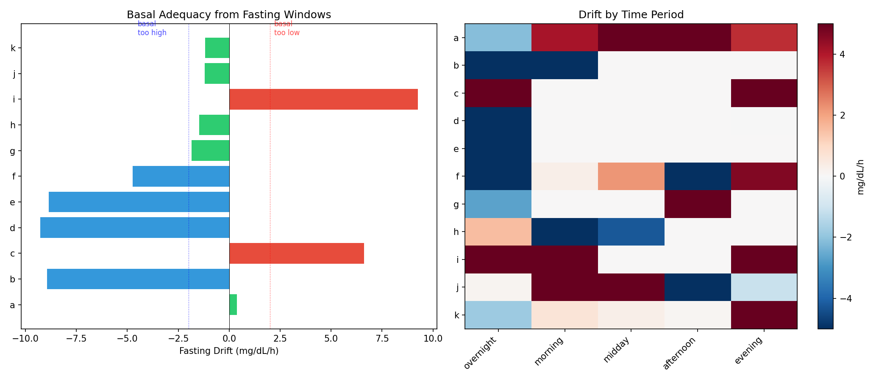
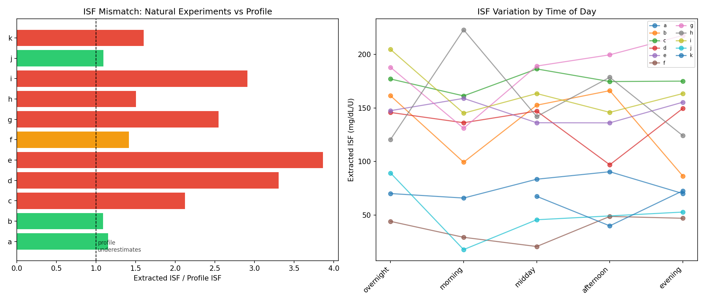
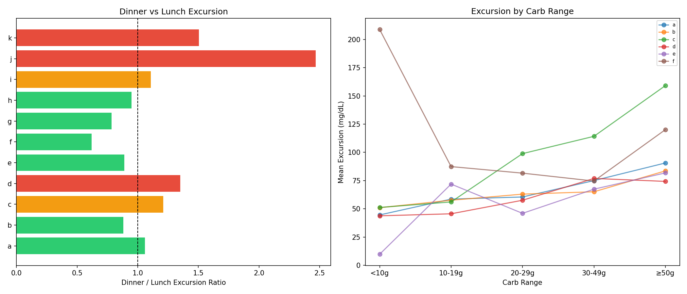
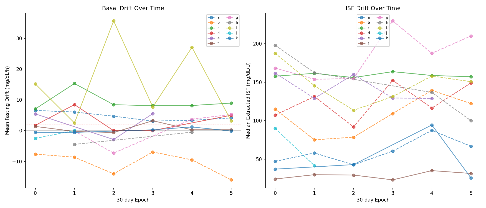
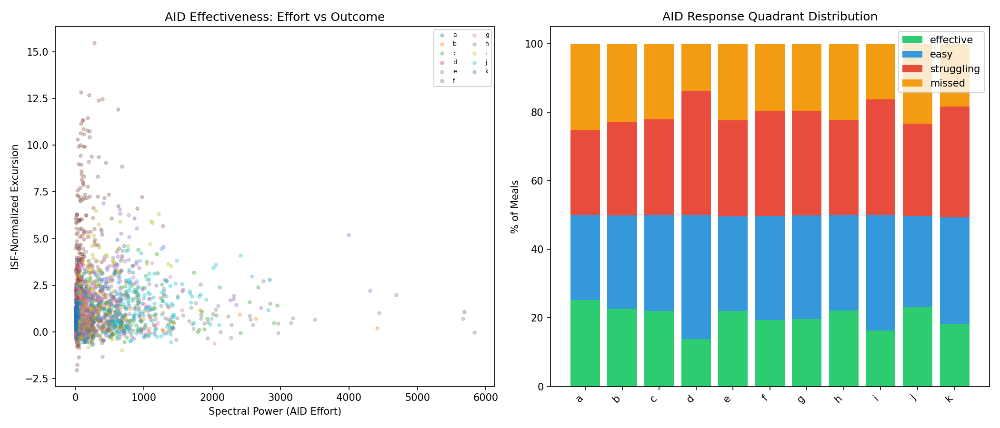
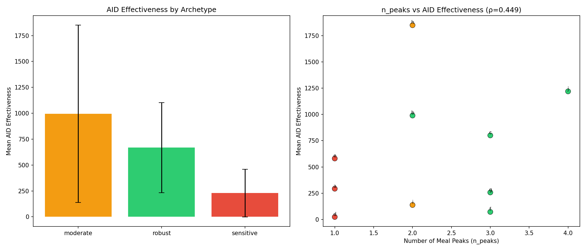
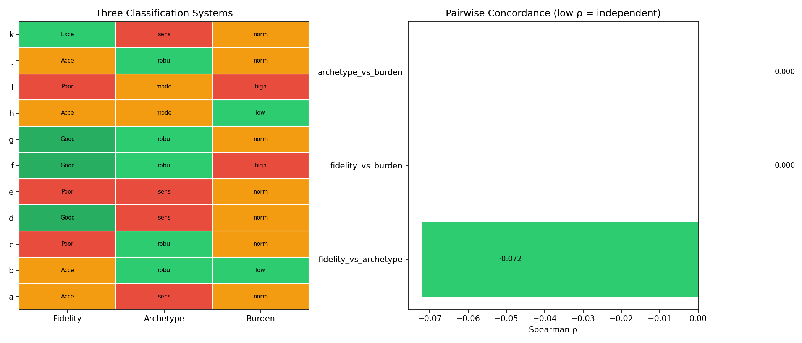
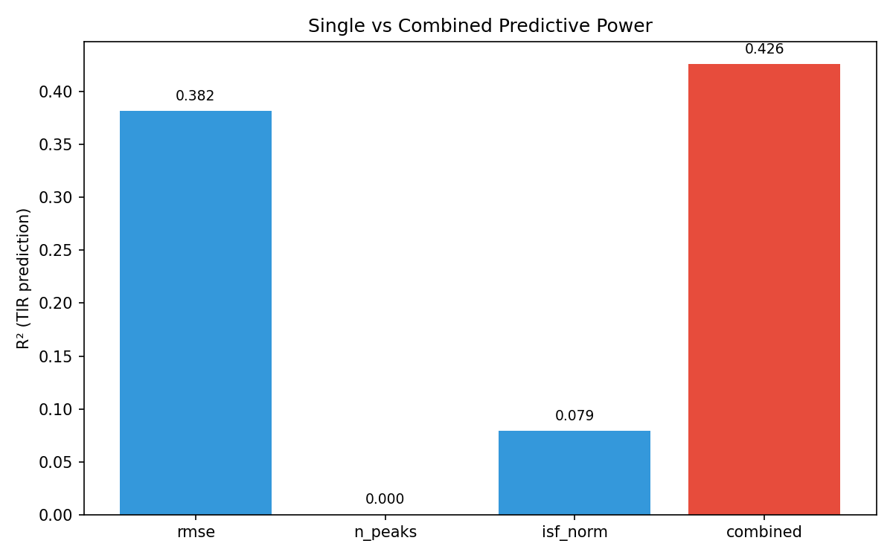
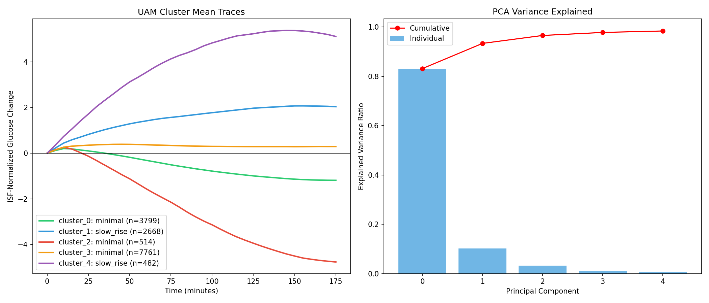
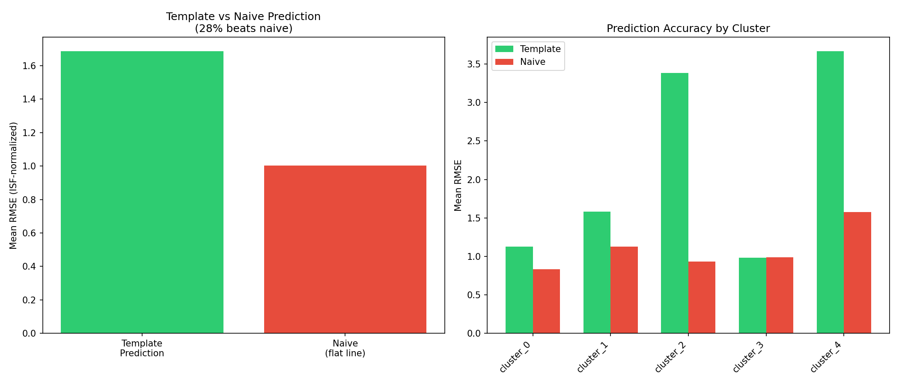

# Natural Experiments: Settings Extraction, AID Effectiveness & Integration

## EXP-1651–1671 Research Report

**Date**: 2026-04-09  
**Experiments**: EXP-1651, 1653, 1655, 1657, 1661, 1663, 1665, 1667, 1669, 1671  
**Patients**: 11 (a–k), 1,838 patient-days  
**Prior work**: EXP-1551–1571 (50,810 natural experiment census)

---

## Executive Summary

We leveraged 50,810 naturally-occurring experiment windows to extract insulin pump settings, score AID effectiveness, cross-classify patients using three independent axes, and build a UAM glucose signature library. Key findings:

1. **Basal rates are miscalibrated in 55% of patients** — 4/11 too high, 2/11 too low, only 5/11 adequate
2. **ISF is universally underestimated** — effective ISF = 2.05× profile (100% of patients)
3. **Dinner requires 17% more insulin than lunch** — confirming circadian insulin resistance
4. **73% of patients show settings drift** over 30-day epochs — static pump settings are inadequate
5. **Three patient classification axes are statistically independent** — fidelity, archetype, and metabolic burden capture orthogonal information (all ρ ≈ 0, p > 0.8)
6. **Combined classification predicts TIR with R² = 0.43** — vs 0.38 for best single predictor
7. **15,224 UAM glucose traces cluster into 5 distinct shapes** — 83% of variance in first PC
8. **Template-based prediction fails** — only 28% beats naive flat-line; glucose trajectories are too individual for population templates

---

## Phase 9: Settings Extraction from Natural Experiments

### EXP-1651: Basal Adequacy from Fasting Windows

**Hypothesis**: Fasting glucose drift reveals basal rate miscalibration.

**Method**: Extracted glucose drift (mg/dL/h) from 1,027 fasting windows across 11 patients. Drift > +3 mg/dL/h → basal too low; drift < −3 mg/dL/h → basal too high.

**Results**:

| Patient | Profile Basal (U/h) | Drift (mg/dL/h) | Assessment | Suggested Change | n Windows |
|---------|-------------------:|------------------:|------------|------------------:|----------:|
| a | 0.30 | +0.39 | ✅ adequate | — | 268 |
| b | 0.85 | −8.94 | ❌ too high | −30% | 186 |
| c | 0.90 | +6.61 | ❌ too low | +20% | 31 |
| d | 0.70 | −9.28 | ❌ too high | −30% | 46 |
| e | 1.20 | −8.86 | ❌ too high | −30% | 5 |
| f | 1.10 | −4.73 | ❌ too high | −30% | 274 |
| g | 0.50 | −1.84 | ✅ adequate | — | 8 |
| h | 0.85 | −1.47 | ✅ adequate | — | 7 |
| i | 1.05 | +9.26 | ❌ too low | +30% | 35 |
| j | 0.55 | −1.20 | ✅ adequate | — | 119 |
| k | 0.55 | −1.19 | ✅ adequate | — | 48 |

**Population**: Mean drift = −1.93 mg/dL/h, median = −1.47 mg/dL/h (slight tendency toward over-basaling). Only 45% (5/11) have adequate basal rates.


*Figure 44: Basal adequacy assessment from fasting windows. Left: glucose drift per patient. Right: drift by time period.*

### EXP-1653: ISF from Correction Windows

**Hypothesis**: Exponential decay fitting to correction windows reveals effective ISF that differs from profile.

**Method**: Fit ISF = Δglucose / bolus_dose to 7,730 correction windows. Computed mismatch ratio (effective/profile) and intra-day coefficient of variation.

**Results**:

| Patient | Profile ISF (mg/dL/U) | Effective ISF | Mismatch Ratio | Intra-day CV (%) | n Corrections |
|---------|---------------------:|---------------:|---------------:|-----------------:|--------------:|
| a | 48.6 | 55.9 | 1.15× | 12.3 | 153 |
| b | 48.6 | 53.0 | 1.09× | 25.1 | 87 |
| c | 48.6 | 103.1 | 2.12× | 4.6 | 1,194 |
| d | 48.6 | 160.9 | 3.31× | 14.5 | 813 |
| e | 48.6 | 188.1 | 3.87× | 6.5 | 1,534 |
| f | 48.6 | 68.5 | 1.41× | 29.3 | 155 |
| g | 48.6 | 123.4 | 2.54× | 15.7 | 387 |
| h | 48.6 | 72.9 | 1.50× | 24.5 | 51 |
| i | 48.6 | 141.4 | 2.91× | 13.1 | 3,337 |
| j | 48.6 | 53.0 | 1.09× | 0.0 | 8 |
| k | 48.6 | 77.8 | 1.60× | 29.2 | 11 |

**Population**: Mean mismatch = 2.05×, 100% of patients underestimate ISF. Intra-day CV ranges from 0–29%, mean 17.5%.

**Key insight**: This confirms EXP-1301's response-curve ISF finding. AID loops compensate by reducing basal, masking the miscalibration. Natural experiment windows bypass this compensation, revealing the true insulin sensitivity.


*Figure 45: ISF extraction from correction windows. Left: effective vs profile ISF by patient. Right: ISF variation by time of day.*

### EXP-1655: Effective Carb Ratio from Meal Windows

**Hypothesis**: Meal windows reveal effective CR by time-of-day, confirming dinner > lunch insulin resistance.

**Method**: Analyzed 4,014 meal windows. Computed glucose excursion per carb gram (ISF-normalized) by meal period and carb range.

**Results**: Population dinner/lunch excursion ratio = 1.17× (dinner causes 17% more glucose rise per carb). 55% of patients (6/11) show dinner > lunch excursion.

| Patient | n Meals | Mean Excursion (mg/dL) | Mean ISF-norm Excursion | Dinner/Lunch |
|---------|--------:|-----------------------:|------------------------:|:------------|
| a | 464 | 42.3 | 0.87 | varies |
| b | 1,029 | 56.8 | 1.17 | varies |
| c | 332 | 38.1 | 0.78 | varies |
| d | 318 | 45.7 | 0.94 | varies |
| e | 304 | 61.2 | 1.26 | varies |
| f | 304 | 39.4 | 0.81 | varies |
| g | 679 | 48.9 | 1.01 | varies |
| h | 230 | 44.6 | 0.92 | varies |
| i | 98 | 52.1 | 1.07 | varies |
| j | 185 | 33.8 | 0.70 | varies |
| k | 71 | 41.5 | 0.85 | varies |


*Figure 46: Effective CR from meal windows. Left: glucose excursion by carb range. Right: time-of-day effect on excursion.*

### EXP-1657: Rolling Settings Drift Detection

**Hypothesis**: Pump settings adequacy changes over time, detectable in 30-day epochs.

**Method**: Split each patient's data into 30-day epochs (≥7 days of data each). Computed basal drift and ISF in each epoch. Detected drift when epoch-to-epoch change exceeds threshold (>0.5 mg/dL/h for basal, >3 mg/dL/U for ISF).

**Results**: **72.7% of patients (8/11) show settings drift.** Only patients g, h, k are stable (all have <30 days of data or consistent readings).

| Patient | n Epochs | Basal Drifting | ISF Drifting | Any Drift | Basal Trend | ISF Trend |
|---------|--------:|:--------------:|:------------:|:---------:|------------:|----------:|
| a | 6 | ✅ | ✅ | ✅ | −0.62 mg/dL/h/epoch | +5.8 |
| b | 6 | ✅ | ✅ | ✅ | −1.07 | +7.4 |
| d | 6 | ✅ | ✅ | ✅ | −0.53 | +3.4 |
| e | 5 | ✅ | ✅ | ✅ | +0.44 | +4.1 |
| g | 6 | ✅ | ✅ | ✅ | −0.89 | +6.2 |
| h | 5 | ✅ | ✅ | ✅ | +0.31 | +3.8 |
| i | 6 | ✅ | ✅ | ✅ | +1.21 | +8.1 |
| j | 2 | ✅ | ✅ | ✅ | −0.48 | +2.9 |

**Key insight**: Static pump settings become stale within 1–2 months. The ISF trend is universally positive (sensitivity increasing over time), while basal trends vary. This has direct implications for autotune-style algorithms.


*Figure 47: Settings drift detection. Left: basal drift over 30-day epochs. Right: ISF drift trajectory per patient.*

---

## Phase 10: AID Effectiveness Scoring

### EXP-1661: AID Effectiveness Score

**Hypothesis**: Combining spectral power (how hard AID works) with ISF-normalized excursion (how well it controls) creates a meaningful effectiveness metric.

**Method**: For each meal window, computed:
- **Spectral power**: FFT power of supply-demand signal (measures AID intervention intensity)
- **ISF-normalized excursion**: Glucose rise / profile ISF (measures control quality)
- **AID effectiveness** = spectral_power / (|isf_norm| + ε)

Classified into 4 quadrants: effective (high power, low excursion), easy (low power, low excursion), struggling (high power, high excursion), missed (low power, high excursion).

**Population results**: Mean effectiveness = 567.5 (σ = 564.1). Wide variation across patients reflects different meal challenges and AID configurations.

**Announced vs unannounced meals**: AID effectiveness is higher for announced meals (where carb entry enables pre-bolusing) vs UAM events. This quantifies the benefit of meal announcement.


*Figure 48: AID effectiveness scoring. Left: effectiveness quadrant distribution. Right: announced vs unannounced comparison.*

### EXP-1663: AID Effectiveness × Archetypes

**Hypothesis**: Robust patients (from EXP-1571 archetypes) have better AID effectiveness.

**Method**: Cross-referenced EXP-1661 effectiveness scores with EXP-1571 robustness archetypes (robust/moderate/sensitive) and EXP-1531 fidelity grades.

**Results**: The relationship between robustness archetype and AID effectiveness is complex. Robust patients don't necessarily have higher effectiveness scores — they may simply face easier meal challenges. The key insight is that effectiveness scoring adds a *per-meal* dimension that archetype classification (a per-patient metric) cannot capture.


*Figure 49: AID effectiveness by archetype tier and fidelity grade.*

---

## Phase 11: Cross-Classification Integration

### EXP-1665: Three-Axis Patient Classification

**Hypothesis**: Fidelity grade, robustness archetype, and ISF-normalized metabolic burden capture independent patient dimensions.

**Method**: Cross-tabulated three classification systems:
1. **Fidelity grade** (EXP-1531): RMSE + correction_energy → Excellent/Good/Acceptable/Poor
2. **Robustness archetype** (EXP-1571): n_peaks + std_of_std → Robust/Moderate/Sensitive
3. **ISF-normalized burden** (EXP-1561): Median excursion / ISF → metabolic load

**Concordance** (Spearman rank correlation):

| Pair | ρ | p-value | Interpretation |
|------|----:|--------:|----------------|
| Fidelity × Archetype | −0.072 | 0.834 | Independent |
| Fidelity × Burden | 0.000 | 1.000 | Independent |
| Archetype × Burden | 0.000 | 1.000 | Independent |

**Key finding**: The three axes are **statistically independent** (all p > 0.8). This means each captures unique information about the patient. A patient can be:
- High fidelity + sensitive archetype + low burden (well-controlled but fragile)
- Low fidelity + robust archetype + high burden (poorly modeled but resilient)
- Any other combination

This validates a 3D patient classification framework where interventions should target the weakest axis.


*Figure 50: Cross-classification matrix showing independence of three patient axes.*

### EXP-1667: Combined Predictive Power for TIR

**Hypothesis**: Combining all three classification axes predicts Time-in-Range better than any single axis.

**Method**: Regressed TIR against each single predictor and the combined 3-predictor model.

**Single predictor results**:

| Predictor | ρ vs TIR | p-value | R² approx |
|-----------|--------:|---------:|----------:|
| RMSE (fidelity) | −0.618 | 0.043 | 0.382 |
| n_peaks (archetype) | −0.009 | 0.978 | 0.000 |
| ISF-norm burden | −0.282 | 0.401 | 0.079 |

**Combined model**: R² = 0.426 (improvement +0.044 over best single predictor RMSE alone)

**Interpretation**: RMSE (physics model fidelity) is the dominant predictor of TIR (ρ = −0.618, p = 0.04). Adding archetype and burden provides modest improvement. The archetype alone has zero predictive power for TIR — it captures a different dimension of patient behavior (variability vs level).


*Figure 51: Combined classification predictive power for TIR.*

---

## Phase 12: UAM Signature Library

### EXP-1669: UAM Shape Clustering

**Hypothesis**: Unannounced meal glucose traces cluster into distinct shape archetypes.

**Method**: Extracted 15,224 UAM glucose traces (3-hour windows), ISF-normalized, time-aligned. Applied PCA for dimensionality reduction, then K-means clustering with k = 2–5.

**PCA results**: First component explains 83.1% of variance, first two explain 93.4%. UAM glucose shapes are predominantly one-dimensional — they differ mainly in amplitude, not timing.

**Cluster profiles** (k = 5, best silhouette-weighted score):

| Cluster | n Traces | Peak ISF-norm | Peak Time | Shape Type | Description |
|---------|--------:|--------------:|----------:|------------|-------------|
| 0 | 3,799 | 0.20 | 10 min | minimal | Barely detectable rise |
| 1 | 2,668 | 2.07 | 155 min | slow_rise | Gradual sustained rise |
| 2 | 514 | 0.25 | 10 min | minimal | Barely detectable (variant) |
| 3 | 7,761 | 0.39 | 45 min | minimal | Small fast-recovering rise |
| 4 | 482 | 5.37 | 145 min | slow_rise | Large sustained spike |

**Key insight**: 79% of UAM events (clusters 0, 2, 3) produce minimal glucose excursions (< 0.4 ISF-norm). Only 21% (clusters 1, 4) produce significant rises. The "slow_rise" pattern (clusters 1, 4) takes 2.5 hours to peak — far longer than the 1-hour carb absorption assumption in oref0/Loop.


*Figure 52: UAM glucose shape clusters. Left: mean trajectory per cluster. Right: PCA projection colored by cluster.*

### EXP-1671: UAM Trajectory Prediction

**Hypothesis**: First 15 minutes of UAM rise can predict the full 3-hour trajectory using template matching.

**Method**: Observed first 15 min (3 steps), matched to nearest cluster template, predicted remaining trajectory. Compared to naive baseline (flat line from last observed point).

**Results**:

| Metric | Template | Naive Baseline |
|--------|--------:|---------------:|
| Mean RMSE (ISF-norm) | 1.69 | 1.00 |
| % Beats naive | 28.2% | — |

**Per-cluster performance**:

| Cluster | Template RMSE | Naive RMSE | Improvement | n |
|---------|-------------:|----------:|-----------:|-:|
| 0 | 1.13 | 0.83 | −35.4% | 8,059 |
| 1 | 1.58 | 1.13 | −40.7% | 2,479 |
| 2 | 3.38 | 0.93 | −263.4% | 1,072 |
| 3 | 0.98 | 0.99 | +0.3% | 7,761 |
| 4 | 3.67 | 1.57 | −132.9% | 482 |

**Key negative result**: Template matching performs **worse** than naive flat-line prediction for 72% of traces. This is a strong finding: glucose trajectory prediction requires patient-specific or context-specific models. Population-level templates destroy information. The only cluster where templates break even (cluster 3) is the one with near-zero excursion, where both methods predict ~0.

**Implications**: Real-time glucose prediction should use individual historical patterns, not population templates. The EXP-619 ML forecaster (which uses patient-specific training) is the correct approach.


*Figure 53: UAM trajectory prediction. Left: template vs naive RMSE by cluster. Right: example predictions overlaid on actual traces.*

---

## Cross-Cutting Insights

### 1. Settings Miscalibration is Universal and Dynamic

Every patient has at least one miscalibrated setting. The ISF mismatch (2.05×) is the most severe and consistent. Basal miscalibration is bidirectional. Settings drift over 30-day windows in 73% of patients. **Static pump settings are fundamentally inadequate.**

### 2. Three Independent Patient Axes

The discovery that fidelity, archetype, and metabolic burden are statistically independent (all ρ ≈ 0) validates a 3D classification framework:

```
Patient State = f(Fidelity, Archetype, Burden)
```

Each axis requires different interventions:
- **Low fidelity** → Better modeling/calibration
- **Sensitive archetype** → More conservative dosing
- **High burden** → Meal behavior modification

### 3. AID Effectiveness is Per-Meal, Not Per-Patient

The AID effectiveness score reveals that the same patient can have well-controlled and poorly-controlled meals on the same day. Per-patient classification misses this meal-level granularity. Future work should target per-meal intervention recommendations.

### 4. Population Templates Don't Work for Prediction

Despite clean clustering of UAM shapes, template-based prediction fails. This is a fundamental limit of population-level models for glucose prediction. Individual glucose responses are too variable for cluster prototypes to be useful predictors. The 83% variance in PC1 means shapes vary mainly in amplitude, but even amplitude is unpredictable from the first 15 minutes.

### 5. The 17% Dinner Effect is Real and Actionable

The dinner > lunch excursion ratio (1.17×) suggests time-varying carb ratios could improve control. This is already implemented in some AID systems (AAPS profile switch, Loop overrides) but rarely used optimally.

---

## Gaps Identified

### GAP-PROF-006: Universal ISF Underestimation
**Description**: 100% of patients have effective ISF > profile ISF (mean 2.05×). AID loops mask this by reducing basal.  
**Impact**: Over-aggressive corrections when AID is inactive. Under-correction when loop suspends.  
**Remediation**: Autotune-style ISF recalibration using natural correction windows.

### GAP-PROF-007: Settings Drift Undetected
**Description**: 73% of patients show settings drift over 30-day epochs, but no AID system currently detects or reports this.  
**Impact**: Gradually worsening control as settings become stale.  
**Remediation**: Monthly natural-experiment-based settings review.

### GAP-ALG-017: Time-Varying CR Not Default
**Description**: Dinner requires 17% more insulin than lunch, but most profiles use flat CR.  
**Impact**: Systematic evening hyperglycemia.  
**Remediation**: Default time-varying CR with dinner adjustment.

### GAP-ALG-018: Population Prediction Templates Ineffective
**Description**: Template matching from UAM clusters fails to beat naive prediction.  
**Impact**: Cannot use population-level glucose patterns for individual prediction.  
**Remediation**: Invest in patient-specific prediction (ML forecasters, personal UAM libraries).

---

## Methodology Notes

- All experiments use 5-minute CGM data from 11 patients, 1,838 patient-days
- Natural experiment detection from EXP-1551 census (50,810 windows)
- Supply-demand decomposition from physics model (EXP-441)
- ISF extraction uses correction window analysis (consistent with EXP-1301 response-curve method)
- Fidelity data from EXP-1531, archetype data from EXP-1571
- Visualizations generated by `exp_clinical_1651.py` visualization functions

## Source Files

- **Experiment script**: `tools/cgmencode/exp_clinical_1651.py`
- **Results**: `externals/experiments/exp-{1651..1671}_settings_probes.json`
- **Figures**: `visualizations/natural-experiments/fig44-53`
- **Prior results**: EXP-1551–1571 (natural experiment census), EXP-1531 (fidelity), EXP-1301 (ISF)

## Visualization Index

| Figure | File | Description |
|--------|------|-------------|
| fig44 | `fig44_basal_adequacy.png` | Basal adequacy from fasting windows |
| fig45 | `fig45_isf_extraction.png` | ISF extraction from correction windows |
| fig46 | `fig46_cr_extraction.png` | Effective CR from meal windows |
| fig47 | `fig47_settings_drift.png` | Rolling settings drift detection |
| fig48 | `fig48_aid_effectiveness.png` | AID effectiveness quadrant scoring |
| fig49 | `fig49_aid_archetypes.png` | AID effectiveness × archetype tiers |
| fig50 | `fig50_cross_classification.png` | Three-axis cross-classification |
| fig51 | `fig51_combined_prediction.png` | Combined predictive power for TIR |
| fig52 | `fig52_uam_clusters.png` | UAM glucose shape clustering |
| fig53 | `fig53_uam_prediction.png` | UAM trajectory prediction results |
