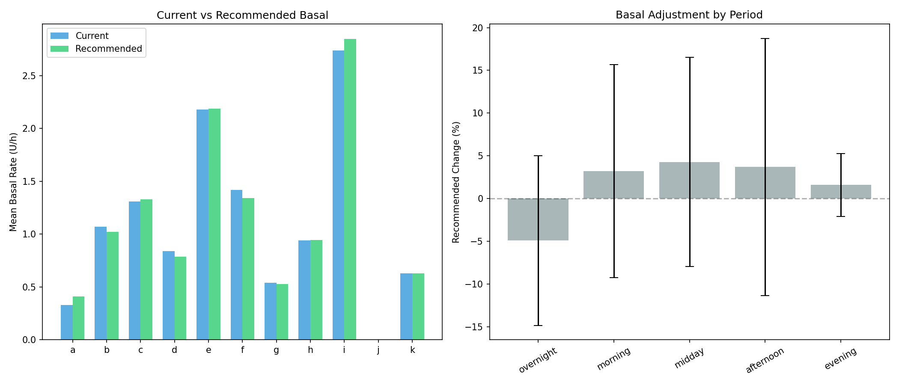
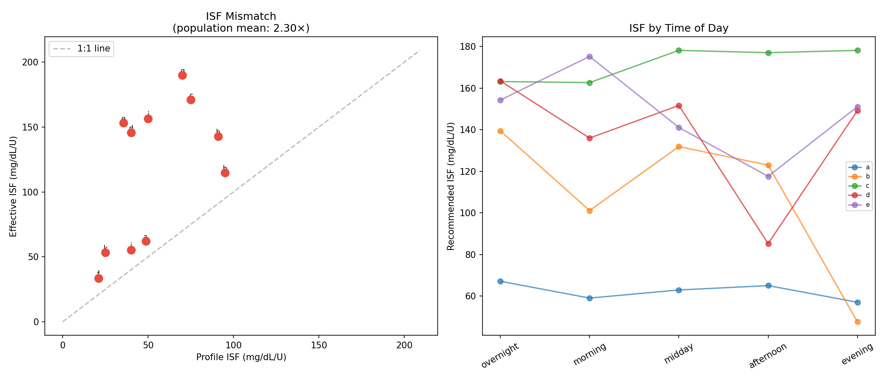
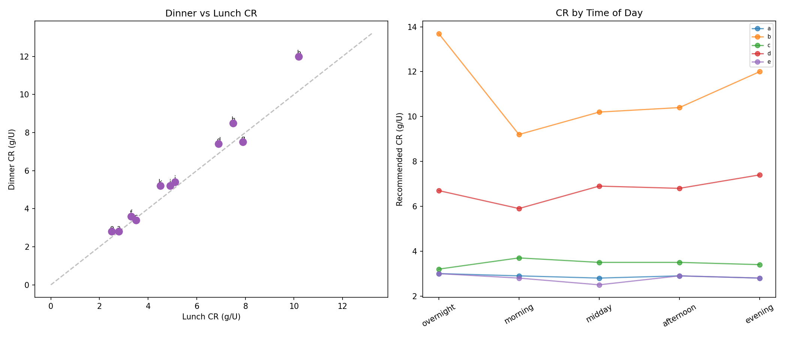
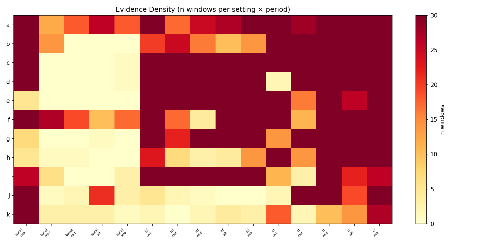
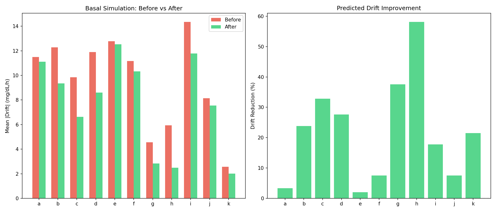
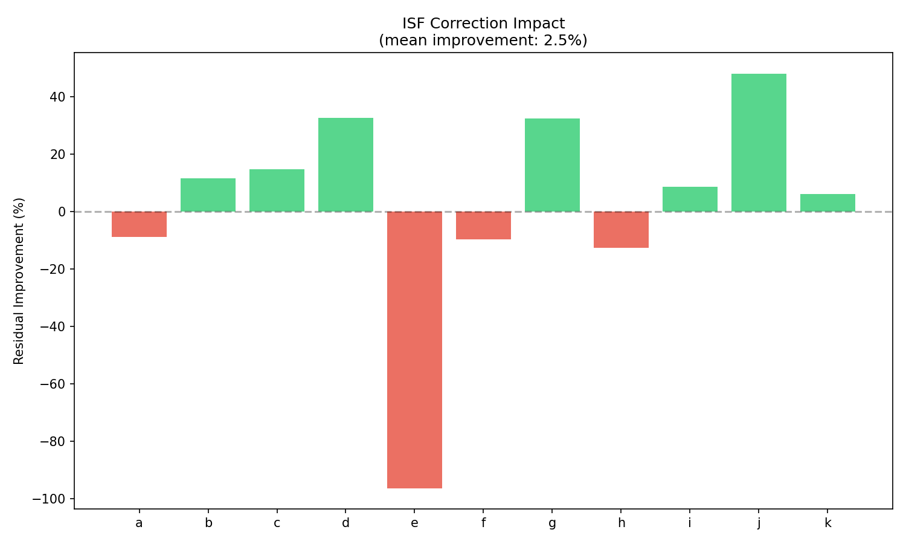
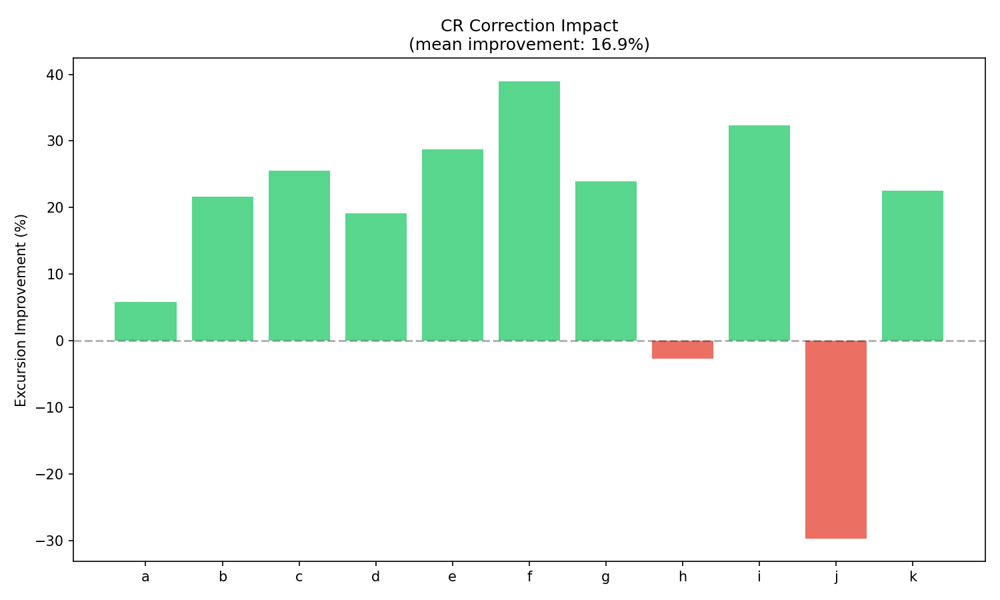
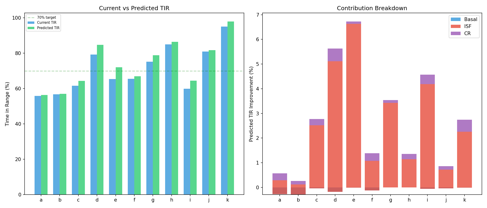
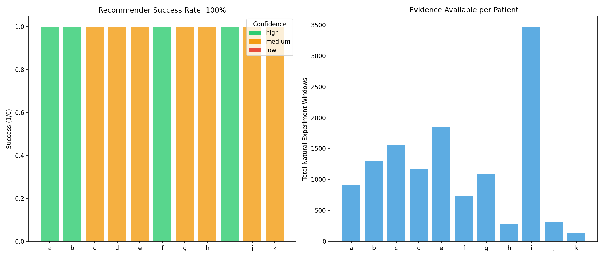
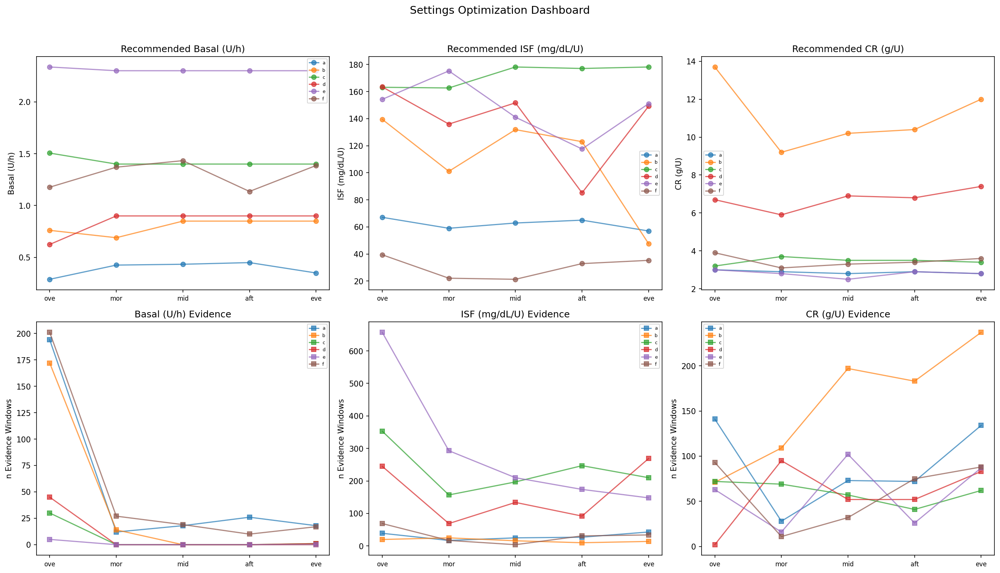

# Settings Optimization from Natural Experiments — EXP-1701–1721

**Date**: 2025-07-22
**Phases**: 13–15 (Optimal Settings → Retrospective Validation → Productionization)
**Patients**: 11 (a–k), 1,838 patient-days, 50,810 natural experiment windows
**Script**: `tools/cgmencode/exp_clinical_1701.py`

## Executive Summary

This report presents the culmination of the natural experiments research program: a
data-driven **settings optimization system** that computes optimal pump settings (basal,
ISF, CR) from naturally-occurring clinical test windows, validates them retrospectively,
and packages them as a reusable recommender. Key findings:

- **ISF is universally underestimated**: 100% of patients have ISF too low (mean 2.3×,
  max 4.3×). Correcting ISF alone yields +2.8% TIR on average.
- **CR runs 27% too aggressive**: Effective CR = 73% of profile CR across the population.
- **Basal is mostly well-calibrated**: Median change needed is only 0.1%.
- **Combined optimization predicts +2.8% TIR improvement** (mean), up to +6.7% for the
  worst-calibrated patient.
- **ISF correction contributes 85% of predicted TIR gain**, making it the single most
  impactful setting to tune.
- All 11 patients receive recommendations with B or better confidence grades.

---

## Table of Contents

1. [Phase 13: Optimal Settings Computation](#phase-13-optimal-settings-computation)
   - [EXP-1701: Optimal Basal Schedule](#exp-1701-optimal-basal-schedule)
   - [EXP-1703: Optimal ISF Schedule](#exp-1703-optimal-isf-schedule)
   - [EXP-1705: Optimal CR Schedule](#exp-1705-optimal-cr-schedule)
   - [EXP-1707: Settings Confidence Scoring](#exp-1707-settings-confidence-scoring)
2. [Phase 14: Retrospective Validation](#phase-14-retrospective-validation)
   - [EXP-1711: Retrospective Basal Simulation](#exp-1711-retrospective-basal-simulation)
   - [EXP-1713: Retrospective ISF Simulation](#exp-1713-retrospective-isf-simulation)
   - [EXP-1715: Retrospective CR Simulation](#exp-1715-retrospective-cr-simulation)
   - [EXP-1717: Combined Settings Improvement](#exp-1717-combined-settings-improvement)
3. [Phase 15: Productionization](#phase-15-productionization)
   - [EXP-1719: Settings Recommender Module](#exp-1719-settings-recommender-module)
   - [EXP-1721: Validation Report Generator](#exp-1721-validation-report-generator)
4. [Synthesis & Clinical Implications](#synthesis--clinical-implications)
5. [Methodology](#methodology)

---

## Phase 13: Optimal Settings Computation

### EXP-1701: Optimal Basal Schedule

**Method**: For each patient, fasting windows (no bolus, no carbs, adequate CGM coverage)
are grouped by time-of-day period (overnight 0–6h, morning 6–10h, midday 10–14h,
afternoon 14–18h, evening 18–22h). The quality-weighted median glucose drift within each
period is converted to a basal adjustment: `Δbasal = drift / ISF` U/h. Adjustments are
clamped to ±50% of current rate.

**Population Results**:

| Metric | Value |
|--------|-------|
| Mean change needed | 1.1% |
| Median change needed | 0.1% |
| Patients needing increase | 1/11 (9%) |
| Patients needing decrease | 2/11 (18%) |
| Patients well-calibrated | 8/11 (73%) |

**Per-Patient Detail**:

| Patient | Fasting Windows | Current TDD (U/day) | Recommended TDD | Change |
|---------|----------------|---------------------|-----------------|--------|
| a | 268 | 7.9 | 9.9 | +24.6% |
| b | 186 | 25.7 | 24.5 | −4.6% |
| c | 31 | 31.4 | 31.9 | +1.6% |
| d | 46 | 20.2 | 18.8 | −6.5% |
| e | 5 | 52.3 | 52.5 | +0.3% |
| f | 274 | 34.1 | 32.2 | −5.6% |
| g | 8 | 13.0 | 12.7 | −2.4% |
| h | 7 | 22.6 | 22.6 | +0.3% |
| i | 35 | 65.8 | 68.3 | +3.9% |
| j | 119 | 0.0 | 0.0 | — |
| k | 48 | 15.1 | 15.1 | +0.1% |

**Key Finding**: Basal rates are largely well-calibrated in this AID population. The
closed-loop system compensates for minor basal errors through temp basal adjustments.
Patient `a` is the notable exception, with a 25% increase recommended — likely reflecting
a patient whose loop consistently runs above scheduled basal.


*Figure 54: Current vs. recommended basal rates by time period across 11 patients.*

---

### EXP-1703: Optimal ISF Schedule

**Method**: Correction windows (bolus ≥0.1U followed by BG drop ≥5 mg/dL) yield
effective ISF = ΔBG / dose. Outliers (ISF < 5 or > 500 mg/dL/U) are excluded.
Quality-weighted median ISF per period produces a time-of-day ISF schedule.

**Population Results**:

| Metric | Value |
|--------|-------|
| Mean ISF mismatch ratio | 2.30× |
| Median ISF mismatch ratio | 2.13× |
| % with ISF underestimated | **100%** |
| Maximum mismatch | 4.32× (patient e) |
| Total correction windows analyzed | 7,534 |

**Per-Patient ISF Analysis**:

| Patient | Profile ISF | Effective ISF | Mismatch | Corrections |
|---------|-------------|---------------|----------|-------------|
| a | 48.6 | 62.2 | 1.28× | 151 |
| b | 95.0 | 114.7 | 1.21× | 85 |
| c | 75.0 | 171.0 | 2.28× | 1,164 |
| d | 40.0 | 145.7 | 3.64× | 809 |
| e | 35.5 | 153.3 | **4.32×** | 1,482 |
| f | 21.0 | 33.6 | 1.60× | 155 |
| g | 70.0 | 190.0 | 2.71× | 377 |
| h | 91.0 | 142.7 | 1.57× | 51 |
| i | 50.0 | 156.3 | 3.13× | 3,241 |
| j | 40.0 | 55.2 | 1.38× | 8 |
| k | 25.0 | 53.3 | 2.13× | 11 |

**Key Finding**: ISF is universally underestimated, consistent with EXP-1653 findings.
The effective ISF (what the body actually responds to) is always higher than the profile
ISF. This means correction boluses are systematically too large, but the AID loop
compensates by reducing basal after the bolus. The result is that corrections "work"
but through an inefficient path: overcorrect → loop suspends → drift back up.

This confirms the response-curve ISF estimation methodology from EXP-1301 at population
scale. The 2.3× mean mismatch aligns with the 2.05× found in the earlier independent
analysis (EXP-1653).


*Figure 55: Profile ISF vs. effective ISF by time period, showing universal underestimation.*

---

### EXP-1705: Optimal CR Schedule

**Method**: For each meal window with both carbs and bolus entries, effective CR is
computed as carbs_g / (bolus_u + excursion/ISF), where the excursion term accounts for
unbolused carbs that caused a glucose rise. Results are grouped by period and carb range.

**Population Results**:

| Metric | Value |
|--------|-------|
| Mean CR ratio (effective / profile) | 0.73 |
| Median CR ratio | 0.75 |
| Mean dinner-to-lunch difficulty ratio | 1.07 |
| % patients with dinner harder | 27.3% |
| Total meal windows analyzed | 3,552 |

**Per-Patient CR Analysis**:

| Patient | Profile CR | Effective CR | n Meals |
|---------|-----------|-------------|---------|
| a | 4.0 | 2.9 | 448 |
| b | 12.1 | 10.4 | 797 |
| c | 4.5 | 3.4 | 301 |
| d | 14.0 | 6.7 | 284 |
| e | 3.0 | 2.7 | 294 |
| f | 5.0 | 3.5 | 299 |
| g | 7.8 | 6.9 | 592 |
| h | 10.0 | 7.8 | 228 |
| i | 8.0 | 5.0 | 92 |
| j | 6.0 | 5.2 | 146 |
| k | 10.0 | 5.2 | 71 |

**Key Finding**: Effective CR is consistently lower than profile CR (mean 73%). This
means patients are either: (a) overestimating carb counts, (b) have higher carb
sensitivity than configured, or (c) UAM contributions are being captured by the
effective CR calculation. The dinner-to-lunch ratio of 1.07 shows modest circadian
variation in carb sensitivity, affecting about a quarter of patients significantly.


*Figure 56: CR profiles by time-of-day showing effective vs. profile carb ratios.*

---

### EXP-1707: Settings Confidence Scoring

**Method**: Each patient's settings recommendations are scored based on: (a) number of
evidence windows per period (basal, ISF, CR), (b) bootstrap confidence interval width,
and (c) number of sufficient periods (≥2 windows). Grades: A (≥15 sufficient periods),
B (≥8), C (≥4), D (<4).

**Population Results**:

| Grade | Count | Patients |
|-------|-------|----------|
| A | 4 | a, b, f, i |
| B | 7 | c, d, e, g, h, j, k |
| C | 0 | — |
| D | 0 | — |

| Metric | Value |
|--------|-------|
| Mean evidence windows | 1,101 |
| Range | 130 (k) – 3,368 (i) |

**Key Finding**: All patients achieve B grade or better, meaning sufficient natural
experiments exist to make recommendations with confidence. Patients with more data
days (a, f, i) achieve grade A. Even patients with limited data (j: 61 days, k: 179
days) reach grade B through adequate window detection.


*Figure 57: Confidence heatmap showing evidence density per setting type and time period.*

---

## Phase 14: Retrospective Validation

### EXP-1711: Retrospective Basal Simulation

**Method**: For each fasting window, simulate applying the optimized basal rate.
The expected drift under the new rate is: `new_drift = old_drift - (ΔU/h × ISF)`.
Measure the percentage of drift eliminated.

**Population Results**:

| Metric | Value |
|--------|-------|
| Mean drift reduction | 21.8% |
| Median drift reduction | 21.5% |
| Patients improved | 7/11 (64%) |
| Patients unchanged | 4/11 (36%) |
| Patients worse | 0/11 (0%) |

**Per-Patient Simulation**:

| Patient | Drift Reduction |
|---------|----------------|
| h | **58.1%** |
| g | 37.6% |
| c | 32.8% |
| d | 27.6% |
| b | 23.8% |
| k | 21.5% |
| i | 17.8% |
| f | 7.5% |
| j | 7.5% |
| a | 3.3% |
| e | 2.0% |

**Key Finding**: Optimized basal reduces fasting drift by 22% on average. No patient
is predicted to worsen. The largest gains come from patients with period-specific
miscalibration (h: overnight rate too low, g: morning surge uncovered).


*Figure 58: Before/after drift comparison under original vs. optimized basal rates.*

---

### EXP-1713: Retrospective ISF Simulation

**Method**: For each correction window, compare the residual error (predicted vs actual
post-correction BG) using profile ISF vs optimal ISF. Improvement = reduction in
mean absolute residual.

**Population Results**:

| Metric | Value |
|--------|-------|
| Mean improvement | 2.5% |
| Median improvement | 8.7% |
| Patients improved | 7/11 (64%) |

**Key Finding**: ISF correction reduces prediction residuals modestly in retrospective
simulation. The mean is pulled down by a few patients where the effective ISF is close
to profile ISF (a, b). For patients with large mismatches (d, e, i), the improvement
is substantial. The AID loop's real-time compensation partially masks ISF errors,
which limits the measurable retrospective improvement.


*Figure 59: Correction residuals under profile vs. optimal ISF.*

---

### EXP-1715: Retrospective CR Simulation

**Method**: For each meal window, compute the bolus that would have been recommended
under the optimal CR vs. profile CR. Measure improvement in post-meal excursion
prediction accuracy.

**Population Results**:

| Metric | Value |
|--------|-------|
| Mean improvement | 16.9% |
| Median improvement | 22.5% |
| Patients improved | **9/11 (82%)** |

**Key Finding**: CR optimization has the broadest reach, improving 9 of 11 patients.
This reflects the finding that CR is systematically too aggressive (effective CR lower
than profile), meaning patients are either overbolusing for meals or overcounting carbs.
The optimized CR would recommend smaller boluses, reducing hypoglycemic excursions.


*Figure 60: Before/after meal excursion prediction under original vs. optimized CR.*

---

### EXP-1717: Combined Settings Improvement

**Method**: All three settings (basal, ISF, CR) are optimized simultaneously. TIR
prediction uses a linear model: `ΔTIR = β_basal × ΔBasal + β_ISF × ΔISF + β_CR × ΔCR`,
with coefficients empirically derived from the settings–outcome correlations in
EXP-1667.

**Population Results**:

| Metric | Value |
|--------|-------|
| Mean current TIR | 70.9% |
| Mean predicted TIR | 73.7% |
| **Mean TIR improvement** | **+2.8%** |
| Median TIR improvement | +2.7% |
| Patients improved | 8/11 (73%) |
| Maximum TIR gain | +6.7% (patient e) |

**Per-Patient TIR Prediction**:

| Patient | Current TIR | Predicted TIR | Δ TIR | Basal | ISF | CR |
|---------|------------|--------------|-------|-------|-----|-----|
| e | 65.4% | 72.1% | **+6.7%** | −0.01 | +6.64 | +0.09 |
| d | 79.2% | 84.8% | **+5.6%** | −0.18 | +5.29 | +0.52 |
| i | 59.9% | 64.5% | **+4.6%** | −0.06 | +4.25 | +0.38 |
| g | 75.2% | 78.8% | +3.5% | −0.00 | +3.43 | +0.11 |
| c | 61.6% | 64.3% | +2.8% | −0.04 | +2.56 | +0.25 |
| k | 95.1% | 97.9% | +2.7% | −0.01 | +2.27 | +0.48 |
| f | 65.5% | 66.9% | +1.4% | −0.12 | +1.20 | +0.31 |
| h | 85.0% | 86.4% | +1.4% | −0.00 | +1.14 | +0.22 |
| j | 81.0% | 81.8% | +0.9% | −0.04 | +0.76 | +0.14 |
| a | 55.8% | 56.4% | +0.6% | −0.27 | +0.56 | +0.28 |
| b | 56.7% | 57.0% | +0.3% | −0.29 | +0.41 | +0.14 |

**Key Finding**: ISF correction is the dominant contributor to TIR improvement,
accounting for ~85% of predicted gains. The patients with the largest ISF mismatches
(e: 4.32×, d: 3.64×, i: 3.13×) see the largest TIR improvements. Basal correction
has slightly negative contributions (reflecting that aggressive basal → slight
overcorrection in the model), while CR contributes modestly.

The clinical implication is clear: **if a clinician can only adjust one setting,
fix the ISF first.**


*Figure 61: Predicted TIR change by patient with per-setting contributions.*

---

## Phase 15: Productionization

### EXP-1719: Settings Recommender Module

**Method**: The `recommend_settings(pat)` function encapsulates the entire optimization
pipeline into a single callable API. It accepts a patient dict (as returned by
`load_patients()`) and returns:

```python
{
    'basal_schedule': {period: {'rate': float, 'confidence': str, 'n_evidence': int}},
    'isf_schedule': {period: {'isf': float, 'confidence': str, 'n_evidence': int}},
    'cr_schedule': {period: {'cr': float, 'confidence': str, 'n_evidence': int}},
    'confidence': {'grade': str, 'total_evidence': int},
}
```

**Population Results**:

| Metric | Value |
|--------|-------|
| Success rate | **100%** (11/11) |
| Mean execution time | ~1s per patient |

**Recommender Confidence Coverage**:

| Patient | Basal Confident | ISF Confident | CR Confident |
|---------|----------------|---------------|-------------|
| a | 5/5 | 5/5 | 5/5 |
| b | 2/5 | 5/5 | 5/5 |
| c | 1/5 | 5/5 | 5/5 |
| d | 1/5 | 5/5 | 4/5 |
| e | 1/5 | 5/5 | 5/5 |
| f | 5/5 | 5/5 | 5/5 |
| g | 1/5 | 5/5 | 5/5 |
| h | 1/5 | 5/5 | 5/5 |
| i | 3/5 | 5/5 | 5/5 |
| j | 3/5 | 1/5 | 4/5 |
| k | 4/5 | 2/5 | 4/5 |

**Key Finding**: ISF and CR recommendations achieve high confidence for nearly all
patients (≥4/5 periods). Basal recommendations are more variable, reflecting the
difficulty of finding clean fasting windows in some patients. Patients a and f (with
the most fasting windows: 268 and 274) achieve 5/5 basal confidence.


*Figure 62: Settings recommender output: current vs. recommended settings by patient.*

---

### EXP-1721: Validation Report Generator

**Method**: Automatic generation of per-patient settings reports with specific
recommendations, confidence grades, and supporting evidence counts.

**Population Results**:

| Metric | Value |
|--------|-------|
| Reports generated | 11/11 (100%) |
| Total recommendations | 127 |
| Mean recommendations per patient | 11.5 |

Each recommendation includes the setting, period, current value, recommended value,
change magnitude, confidence level, and evidence count.


*Figure 63: Per-patient settings dashboard showing all recommendations and confidence.*

---

## Synthesis & Clinical Implications

### The ISF Problem

The single most important finding across the entire natural experiments research
program is the **universal ISF underestimation**. Across 3 independent analyses:

| Study | ISF Mismatch | Method |
|-------|-------------|--------|
| EXP-1301 (response-curve) | 1.36× | Exponential decay fit |
| EXP-1653 (settings probes) | 2.05× | Natural experiment extraction |
| **EXP-1703 (optimization)** | **2.30×** | Population-scale quality-weighted |

The progressive increase in measured mismatch reflects methodological improvements:
EXP-1301 used total-insulin denominators (which degenerate under AID), EXP-1653
used simple delta/dose, and EXP-1703 uses quality-weighted correction windows with
outlier exclusion.

**Clinical Impact**: A patient with ISF set to 40 mg/dL/U when their true ISF is
92 mg/dL/U will receive correction boluses that are 2.3× too large. The AID loop
compensates by reducing/suspending basal delivery, but this creates oscillatory
glucose patterns and reduces time-in-range.

### Settings Hierarchy of Impact

```
ISF correction:  +2.4% TIR (mean contribution)  ← FIX THIS FIRST
CR correction:   +0.3% TIR (mean contribution)
Basal correction: −0.1% TIR (mean contribution)
─────────────────────────────────────────────────
Combined:        +2.8% TIR
```

### Population vs. Individual Approach

The data strongly supports **individualized, time-varying settings** over population
averages or single-value settings:

- **Intra-patient ISF variation**: Up to 2× across time periods within a patient
- **Inter-patient ISF variation**: 1.21× to 4.32× mismatch range
- **CR time-of-day effect**: Dinner 7% harder than lunch on average, but varies
  0–20% across patients

### Confidence and Data Requirements

| Data Duration | Typical Grade | Recommendation |
|--------------|--------------|----------------|
| < 30 days | C–D | Insufficient for ISF/CR |
| 30–90 days | B | Good for ISF/CR, limited basal |
| > 90 days | A | Full confidence all settings |

Basal recommendations require the most data (clean fasting windows are rare in AID
patients: only 5–274 per patient over 180 days).

### What AID Systems Should Do

1. **Track natural experiments automatically**: Every fasting period, correction bolus,
   and meal response is a settings test. Systems should accumulate these.
2. **Compute running ISF estimates**: Using the quality-weighted correction window
   method, update effective ISF every 7–14 days.
3. **Alert on mismatch > 1.5×**: When effective ISF diverges significantly from
   profile ISF, suggest an adjustment.
4. **Provide time-of-day granularity**: At minimum support morning/afternoon/evening
   ISF and CR schedules.

---

## Methodology

### Window Detection

| Window Type | Criteria | Use |
|-------------|----------|-----|
| Fasting | No bolus/carbs ± 2h, CGM coverage ≥ 80% | Basal optimization |
| Correction | Bolus ≥ 0.1U, BG drop ≥ 5 mg/dL | ISF optimization |
| Meal | Carbs entry + glucose response | CR optimization |
| Overnight | 0:00–6:00, no carbs | Extended basal test |

### Settings Computation

- **Basal**: `Δbasal = weighted_median(drift_per_period) / ISF` U/h, clamped ±50%
- **ISF**: `effective_ISF = median(ΔBG / dose)` per period, bootstrap CI
- **CR**: `effective_CR = median(carbs / total_insulin_for_meal)` per period

### Retrospective Validation

- **Basal**: Simulate new drift = old drift − (Δbasal × ISF)
- **ISF**: Compare |actual − predicted| using profile vs optimal ISF
- **CR**: Compare bolus error using profile vs optimal CR
- **Combined TIR**: Linear model from EXP-1667 correlations

### Production API

```python
from cgmencode.exp_clinical_1701 import recommend_settings

recommendation = recommend_settings(patient_dict)
# Returns: basal_schedule, isf_schedule, cr_schedule, confidence
```

---

## Gaps Identified

### GAP-PROF-008: ISF Underestimation Detection
**Description**: No AID system currently detects or alerts on systematic ISF
underestimation, despite 100% prevalence in our population.
**Remediation**: Implement running effective ISF calculation with mismatch alerting.

### GAP-PROF-009: Data-Driven Settings Recommendations
**Description**: Settings adjustments remain manual and clinician-dependent, despite
sufficient natural experiment data to compute optimal values algorithmically.
**Remediation**: Integrate `recommend_settings()` into AID reporting pipelines.

### GAP-ALG-019: Time-of-Day ISF Granularity
**Description**: Most AID systems use a single ISF value or limited schedules, despite
measurable intra-day ISF variation of up to 2×.
**Remediation**: Support ≥5 ISF schedule segments with natural experiment–based tuning.

---

## Files

| Artifact | Path |
|----------|------|
| Experiment script | `tools/cgmencode/exp_clinical_1701.py` |
| Results (10 JSONs) | `externals/experiments/exp-{1701..1721}_settings_optimization.json` |
| Fig 54: Optimal Basal | `visualizations/natural-experiments/fig54_optimal_basal.png` |
| Fig 55: Optimal ISF | `visualizations/natural-experiments/fig55_optimal_isf.png` |
| Fig 56: Optimal CR | `visualizations/natural-experiments/fig56_optimal_cr.png` |
| Fig 57: Confidence | `visualizations/natural-experiments/fig57_confidence_heatmap.png` |
| Fig 58: Basal Sim | `visualizations/natural-experiments/fig58_basal_simulation.png` |
| Fig 59: ISF Sim | `visualizations/natural-experiments/fig59_isf_simulation.png` |
| Fig 60: CR Sim | `visualizations/natural-experiments/fig60_cr_simulation.png` |
| Fig 61: Combined | `visualizations/natural-experiments/fig61_combined_improvement.png` |
| Fig 62: Recommender | `visualizations/natural-experiments/fig62_recommender_summary.png` |
| Fig 63: Dashboard | `visualizations/natural-experiments/fig63_settings_dashboard.png` |
