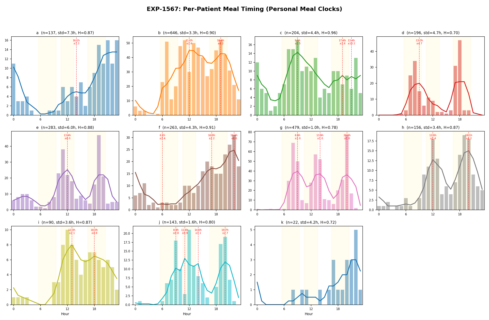
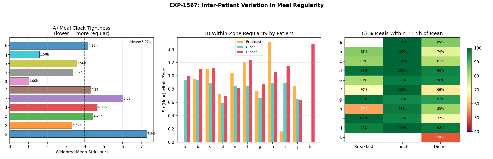
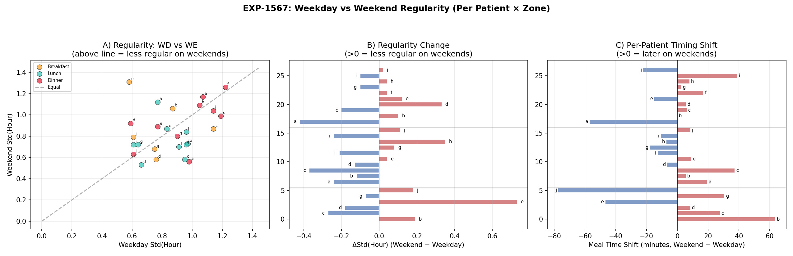

# Phase 6: Within-Patient Meal Clock Regularity

**Experiment**: EXP-1567  
**Date**: 2026-04-09  
**Dataset**: 11 patients × ~180 days, therapy config (≥18g carbs, 90-min hysteresis)  
**Question**: Do individual patients eat at consistent personal times within a ~3-hour window? How much do personal meal clocks vary across patients, zones, and weekday vs weekend?

## Motivation

Prior analyses (EXP-1563, EXP-1565) examined population-level meal periodicity — overall entropy, mealtime zone fractions, and weekday vs weekend shifts. The user clarified the core question: **within a single patient**, does the same person eat at roughly the same time each day, within a ~3-hour window?

This matters for:
- **AID algorithm tuning**: Regular eaters could benefit from time-of-day insulin profiles
- **Meal prediction feasibility**: Clock-like eaters are predictable; irregular eaters are not
- **Alert timing**: Proactive meal alerts need to know when to expect meals

## Method

For each patient:
1. **Hourly histogram** of meal times (24 bins, 0–23h)
2. **Circular smoothing** via `scipy.ndimage.uniform_filter1d(size=4)` on a padded histogram to handle midnight wrapping
3. **Personal peak detection**: Local maxima in smoothed histogram with minimum count ≥2
4. **Cluster assignment**: Each meal assigned to nearest peak
5. **Within-peak std**: Standard deviation of meal hours within each peak cluster
6. **Weighted mean std**: Overall "clock tightness" = Σ(n_k × std_k) / Σ(n_k) across peaks k
7. **Within-3hr metric**: Percentage of meals within ±1.5h of their peak center

Per-zone analysis repeats this for breakfast (6–10h), lunch (11–14h), dinner (17–21h), split by weekday/weekend.

## Results

### Per-Patient Meal Clock Summary

| Patient | Meals | Peaks | Weighted Std (h) | Entropy | Regularity Tier |
|---------|-------|-------|-------------------|---------|-----------------|
| g       | 479   | 3     | 1.00              | 0.782   | Clock-like      |
| j       | 143   | 4     | 1.58              | 0.797   | Clock-like      |
| b       | 646   | 2     | 3.32              | 0.904   | Moderate         |
| h       | 156   | 2     | 3.37              | 0.866   | Moderate         |
| i       | 90    | 2     | 3.56              | 0.870   | Moderate         |
| k       | 22    | 0     | 4.17              | 0.716   | Insufficient data |
| f       | 263   | 3     | 4.32              | 0.906   | Diffuse          |
| c       | 204   | 3     | 4.43              | 0.960   | Diffuse          |
| d       | 196   | 1     | 4.65              | 0.696   | Diffuse          |
| e       | 283   | 1     | 6.03              | 0.884   | Random           |
| a       | 137   | 1     | 7.29              | 0.867   | Random           |

**Population**: mean std = 3.97h, range 1.00–7.29h, mean 2.0 peaks per patient.

### Regularity Tiers

- **Clock-like** (std < 2h): Patients g, j — meals fall within a tight 2-hour window around personal peaks. Patient g has 3 clear peaks at 9h, 14h, 20h with std ≈ 1.0h each.
- **Moderate** (2–4h): Patients b, h, i — identifiable meal patterns but with ±2h jitter.
- **Diffuse** (4–6h): Patients c, d, f — some structure but wide spread; personal peaks overlap.
- **Random** (>6h): Patients a, e — single peak with wide std covers nearly the entire day. Effectively no personal meal clock.

### Patient g — The Most Regular Eater

Patient g demonstrates textbook meal regularity:
- **Breakfast**: peak 9h, std 0.77h, 98.7% within ±1.5h
- **Lunch**: peak 13h, std 0.67h, 95.7% within ±1.5h  
- **Dinner**: peak 20h, std 0.87h, 92.5% within ±1.5h
- 3 cleanly separated peaks with ~160 meals each
- This patient could genuinely benefit from time-of-day insulin profiles

### Patient a — The Least Regular Eater

Patient a shows no meaningful meal clock:
- Single peak at 14h but with 7.29h std
- Only 8.8% of meals fall within ±1.5h of the "peak"
- Meal timing is essentially uniformly distributed across waking hours
- Time-of-day predictions would be useless for this patient

### Mealtime Zone Variation

| Zone      | Patients | Inter-Patient Std | Mean Within-Patient Std | Mean Hour Range |
|-----------|----------|-------------------|------------------------|-----------------|
| Breakfast | 9        | 0.54h             | 0.92h                  | 7.6–9.4h       |
| Lunch     | 10       | 0.26h             | 0.81h                  | 12.1–13.1h     |
| Dinner    | 11       | 0.43h             | 1.01h                  | 18.2–19.8h     |

Key observations:
- **Lunch is the most synchronized meal** — only 0.26h inter-patient std (patients converge on ~12:30)
- **Dinner is the most variable within-patient** — 1.01h mean std (people vary their own dinner time the most)
- **Breakfast varies most across patients** — 0.54h inter-patient std (personal wake times differ)
- Within-patient std is always larger than inter-patient std — individual day-to-day variability exceeds between-person differences

### Weekday vs Weekend Regularity

**50% of patient×zone pairs are less regular on weekends** — exactly even split.

This confirms the EXP-1565 finding: weekday/weekend is not a reliable predictor of regularity at the individual level. Some patients are more regular on weekends (fewer schedule disruptions), others less regular (no work schedule anchor).

Notable individual patterns:
- Patient b breakfast: weekday std 0.87h → weekend std 1.06h (+22%, later start on weekends)
- Patient g: remarkably stable across weekday/weekend in all zones (std delta < 0.15h)
- Patient a dinner: weekday std 0.98h → weekend std 0.56h (-43%, more regular weekend dinners)

## Figures

### Figure 25: Personal Meal Clock Small Multiples


Hourly histogram for each patient showing meal timing distribution. Smoothed curve (orange) highlights peaks. Vertical dashed lines mark detected personal peak hours. Patients ordered by regularity (g = tightest, a = loosest).

### Figure 26: Inter-Patient Variation Heatmap


Heatmap showing within-zone std for each patient × zone combination. Darker = tighter personal clock in that zone. Missing zones shown in gray.

### Figure 27: Weekday vs Weekend Regularity


Scatter plot of weekday std vs weekend std for each patient×zone pair. Points above the diagonal = less regular on weekends. Color-coded by zone. 50/50 split confirms no systematic weekend effect.

## Implications

### For Meal Prediction
- Only 2/11 patients (18%) have clock-like meal regularity (std < 2h)
- Population-level meal prediction would fail for the majority
- **Per-patient adaptive models** are essential — clock-like patients can use simple time-of-day features, diffuse patients need reactive (glucose-based) detection

### For AID Systems
- Time-of-day basal profiles are only meaningful for clock-like eaters
- For diffuse/random eaters, UAM detection remains the primary meal response strategy
- The 3.97h population mean std is too wide for proactive insulin dosing based on meal timing alone

### For Alert Systems
- Clock-like patients (g, j) could receive pre-meal alerts ±1h from peak times with >90% precision
- For diffuse patients, alerts should be glucose-rate-triggered, not time-triggered
- **Hybrid approach**: use personal meal clock when available, fall back to glucose rate of change

## Connection to Prior Results

| Finding | EXP-1565 (Population) | EXP-1567 (Individual) |
|---------|----------------------|----------------------|
| Weekend effect | Breakfast +25 min shift | 50/50 split on regularity |
| Lunch consistency | Highest zone fraction | Lowest inter-patient std (0.26h) |
| Dinner variability | Stable timing | Highest within-patient std (1.01h) |
| Entropy | Population 0.938 | Per-patient mean 0.841 (lower = more structured individually) |

Individual entropy (0.841) is lower than population entropy (0.938), confirming that **individual meal clocks exist** — they're just different per person. Population aggregation blurs distinct personal patterns.

## Data & Reproducibility

```bash
# Run EXP-1567
PYTHONPATH=tools python tools/cgmencode/exp_clinical_1551.py --exp 1567

# Results
externals/experiments/exp-1567_natural_experiments.json

# Figures
visualizations/natural-experiments/fig25_personal_meal_clocks.png
visualizations/natural-experiments/fig26_interpatient_variation.png
visualizations/natural-experiments/fig27_wd_we_regularity.png
```
