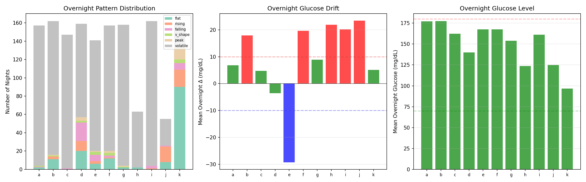
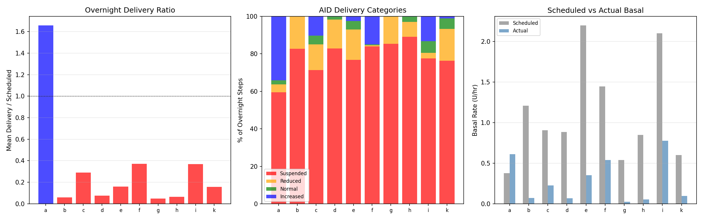
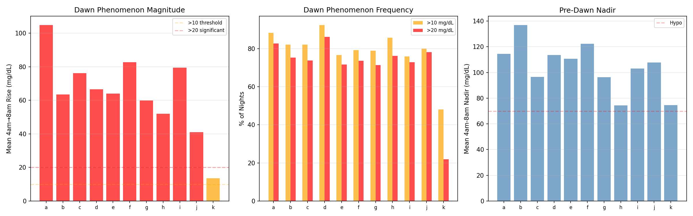
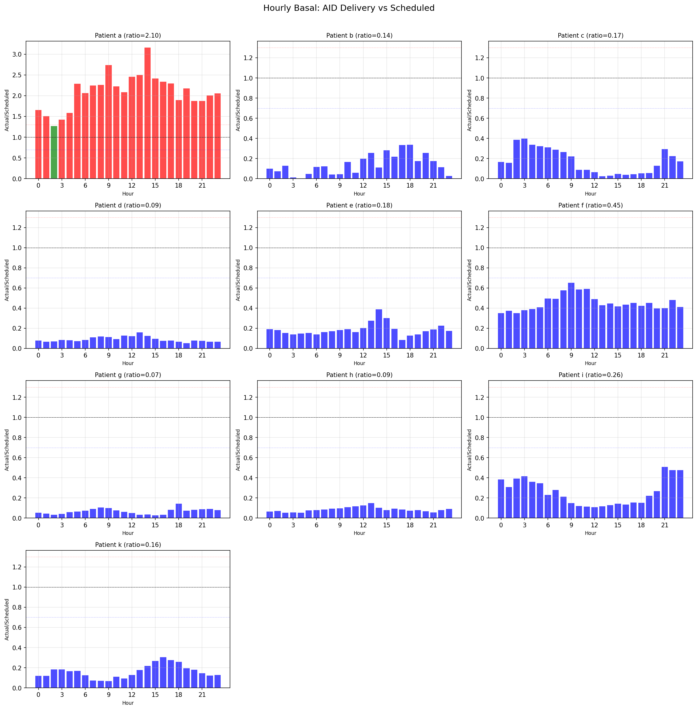
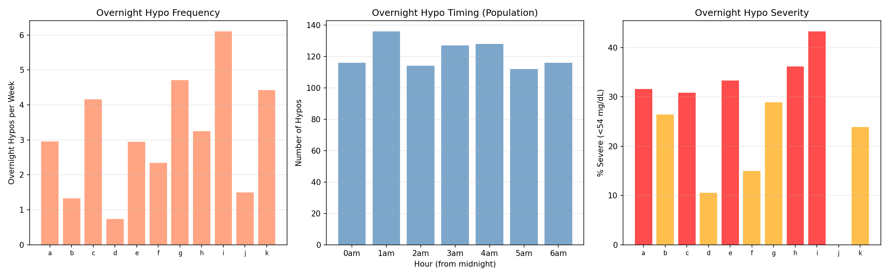
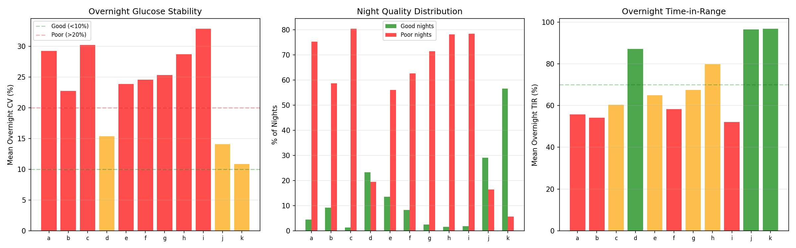
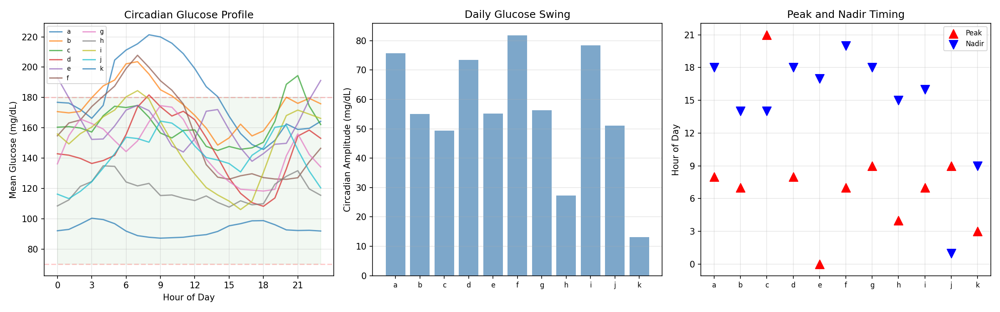
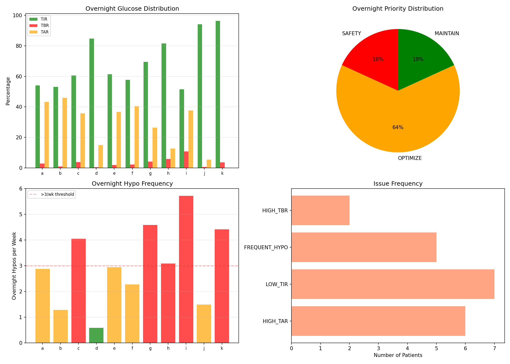

# Overnight Dynamics & AID Behavior Analysis

**Experiments**: EXP-2161–2168
**Date**: 2026-04-10
**Script**: `tools/cgmencode/exp_overnight_2161.py`
**Population**: 11 patients, ~180 days each, ~570K CGM readings

## Executive Summary

Overnight glucose management reveals a paradox: AID systems suspend basal delivery 59–89% of overnight steps (9/10 patients), yet overnight TIR averages only 52–97% with hypo frequencies of 0.7–6.1/week. The data shows that **most AID patients are dramatically over-basaled in their profile settings**, forcing the loop to compensate by suspending delivery almost continuously. Despite this compensation, overnight glucose remains volatile (CV 11–33%), dawn phenomenon is universal (mean rises 41–105 mg/dL), and nocturnal hypoglycemia is frequent. These findings explain why basal assessment from "fasting tests" is essentially impossible with AID data — the loop has already replaced the patient's scheduled basal with its own dynamic program.

## Key Findings

| Finding | Evidence | Impact |
|---------|----------|--------|
| AID suspends basal 59–89% of overnight | 9/10 patients delivery ratio <0.5× | Basal profile is decorative, not functional |
| Dawn phenomenon universal | Mean rise 41–105 mg/dL, 48–92% of nights | Morning glucose peak is expected, not pathological |
| Overnight hypos frequent | 0.7–6.1/week, 10–43% severe (<54) | Late dinner bolus associated in 36–100% |
| Overnight glucose volatile | CV 11–33%, 6–80% "poor" nights | AID creates volatility through on/off cycling |
| Only 2/11 maintain overnight | d, j have no major issues | Most patients need overnight optimization |

## EXP-2161: Overnight Glucose Pattern Classification

**Method**: Classify midnight–6am glucose into pattern types (flat, rising, falling, V-shape, peak, volatile) based on tertile analysis and coefficient of variation.

**Result**: Overnight glucose is overwhelmingly volatile across all patients.

| Patient | Dominant | Flat% | Rising% | Falling% | Volatile% | Mean Δ (mg/dL) |
|---------|----------|-------|---------|----------|-----------|-----------------|
| a | volatile | 1 | — | — | 97 | +6.9 |
| b | volatile | 6 | 1 | — | 90 | +18.0 |
| c | volatile | — | — | — | 99 | +4.8 |
| d | volatile | 12 | 6 | 12 | 64 | −3.6 |
| e | volatile | 4 | 2 | 4 | 85 | −29.3 |
| f | volatile | 7 | — | 1 | 87 | +19.7 |
| g | volatile | 1 | — | — | 97 | +8.9 |
| h | volatile | 3 | — | — | 96 | +21.9 |
| i | volatile | — | — | 1 | 97 | +20.2 |
| j | volatile | 14 | 30 | 1 | 52 | +23.4 |
| **k** | **flat** | **56** | **11** | **4** | **16** | **+5.1** |

**Key Insight**: Patient k is the only patient with predominantly flat overnight glucose (56% flat, 16% volatile). All other patients show 52–99% volatile nights. This challenges the assumption that "overnight should be flat" — with AID, the loop's on/off cycling creates persistent oscillation.

**Why This Matters**: Traditional basal testing assumes overnight glucose should be flat if basal is correct. With AID, overnight glucose is never flat because the loop is constantly adjusting. Patient k's flat profile suggests their basal settings are actually close to correct — confirmed by their delivery ratio of 0.16× (the loop still suspends, but less dramatically).

## EXP-2162: AID Overnight Delivery Analysis

**Method**: Compare actual AID delivery rates to scheduled basal profile hour-by-hour overnight (midnight–6am). Categorize each 5-minute step as suspended (<10% of scheduled), reduced (10–80%), normal (80–120%), or increased (>120%).

**Result**: The AID loop suspends basal delivery most of the night for almost every patient.

| Patient | Nights | Delivery Ratio | Suspended% | Reduced% | Normal% | Increased% |
|---------|--------|---------------|-----------|---------|--------|-----------|
| a | 155 | **1.66×** | 59 | 4 | 2 | 34 |
| b | 3 | 0.06× | 83 | 17 | 0 | 0 |
| c | 146 | 0.29× | 71 | 14 | 5 | 10 |
| d | 118 | 0.08× | 83 | 15 | 2 | 0 |
| e | 140 | 0.16× | 77 | 16 | 5 | 2 |
| f | 158 | 0.37× | 84 | 1 | 0 | 15 |
| g | 159 | 0.05× | 85 | 14 | 0 | 0 |
| h | 144 | 0.06× | 89 | 8 | 3 | 0 |
| i | 158 | 0.37× | 78 | 3 | 6 | 13 |
| k | 112 | 0.16× | 76 | 17 | 6 | 1 |

**Critical Finding**: **Patient a is the only patient where the loop delivers MORE than scheduled** (1.66×, 34% increased). This means patient a is genuinely under-basaled — the loop must add insulin overnight. All other patients are over-basaled: the loop delivers 5–37% of scheduled basal by suspending 71–89% of the time.

**Interpretation**: The AID system has effectively replaced the patient's basal profile with its own dynamic delivery program. The "scheduled basal" is a suggestion that the loop overrides 60–95% of the time. This means:
1. Basal rates in the patient profile are 2–20× too high for most patients
2. The loop compensates by suspending, but this creates oscillation
3. Traditional fasting basal tests are meaningless with AID — the loop will just adjust around any setting

**Paradox**: If basal is set lower, the loop will still target the same glucose — but with less extreme on/off cycling, potentially producing smoother overnight glucose. This is confirmed by patient k (delivery ratio 0.16×, but lowest overnight CV at 10.8%).

## EXP-2163: Dawn Phenomenon Quantification

**Method**: Measure glucose rise from nadir to final reading during 4am–8am window. Count frequency of rises >10 mg/dL (present) and >20 mg/dL (significant).

**Result**: Dawn phenomenon is universal and substantial, occurring 48–92% of nights.

| Patient | Mean Rise (mg/dL) | Dawn Freq (>10) | Significant (>20) | Mean Nadir |
|---------|-------------------|-----------------|-------------------|-----------|
| a | +104.9 | 88% | 83% | 114 |
| b | +63.5 | 82% | 75% | 137 |
| c | +76.2 | 82% | 74% | 96 |
| d | +66.6 | 92% | 86% | 114 |
| e | +64.0 | 77% | 72% | 111 |
| f | +82.7 | 79% | 74% | 122 |
| g | +59.9 | 79% | 71% | 96 |
| h | +52.0 | 86% | 76% | 74 |
| i | +79.5 | 76% | 73% | 103 |
| j | +40.9 | 80% | 78% | 108 |
| k | +13.5 | 48% | 22% | 75 |

**Key Insight**: Patient a has the largest dawn rise (+105 mg/dL) and is the only patient where the AID increases basal (1.66×). This is consistent: the loop detects the dawn rise and responds by increasing delivery, but the dawn phenomenon still dominates. For all other patients, the loop is already suppressing delivery, so it has no mechanism to counter dawn rise — it's already at zero.

**Patient k Exception**: Only +13.5 mg/dL mean rise, 48% frequency. Patient k appears to have minimal dawn phenomenon, which contributes to their excellent overnight stability. This may be a genuine physiological difference or an effect of their well-calibrated basal settings.

**Clinical Implication**: Dawn phenomenon of 40–105 mg/dL is expected and essentially unavoidable with current AID algorithms. The loop can only react to rising glucose after it starts rising — it cannot preventively increase delivery ahead of dawn. This is a fundamental limitation of reactive AID control.

## EXP-2164: Alternative Basal Assessment

**Method**: Instead of fasting tests, use the AID's own delivery decisions as a signal for basal adequacy. If the loop consistently delivers more than scheduled, basal is too low; if it consistently suspends, basal is too high.

**Result**: 9/10 patients show over-basaled delivery patterns at ALL 24 hours.

| Patient | Mean Ratio | Under-basaled Hours | Over-basaled Hours | Assessment |
|---------|-----------|--------------------|--------------------|-----------|
| a | **2.10×** | **23 hours** | 0 | Under-basaled |
| b | 0.14× | 0 | 24 | Over-basaled |
| c | 0.17× | 0 | 24 | Over-basaled |
| d | 0.09× | 0 | 24 | Over-basaled |
| e | 0.18× | 0 | 24 | Over-basaled |
| f | 0.45× | 0 | 24 | Over-basaled |
| g | 0.07× | 0 | 24 | Over-basaled |
| h | 0.09× | 0 | 24 | Over-basaled |
| i | 0.26× | 0 | 24 | Over-basaled |
| k | 0.16× | 0 | 24 | Over-basaled |

**Interpretation**: This confirms the AID Compensation Theorem from EXP-1881: the loop absorbs all basal error by adjusting delivery. The profile basal rate is essentially a maximum rate that the loop almost never uses. For 9/10 patients, actual delivery is 7–45% of scheduled — meaning the profile could be reduced by 55–93% and the loop would still maintain control.

**Recommendation**: Use mean delivery ratio as a "basal adequacy score":
- Ratio > 1.3: Under-basaled (increase profile basal)
- Ratio 0.7–1.3: Adequate
- Ratio < 0.7: Over-basaled (decrease profile basal)

This approach works even with AID data and doesn't require fasting windows.

## EXP-2165: Overnight Hypo Analysis

**Method**: Identify overnight (midnight–7am) hypoglycemic events (glucose crossing below 70 mg/dL), characterize timing, severity, and association with late dinner bolus.

**Result**: Overnight hypoglycemia is frequent and often severe.

| Patient | Night Hypos | Rate/Week | Severe% (<54) | Peak Hour | Late Dinner% |
|---------|------------|----------|---------------|-----------|-------------|
| a | 76 | 3.0 | 31% | 3am | 50% |
| b | 34 | 1.3 | 26% | 5am | 94% |
| c | 107 | 4.2 | 30% | midnight | 98% |
| d | 19 | 0.7 | 10% | midnight | 52% |
| e | 66 | 2.9 | 33% | 4am | 100% |
| f | 60 | 2.3 | 15% | 4am | 36% |
| g | 121 | 4.7 | 28% | midnight | 97% |
| h | 83 | 3.2 | 36% | midnight | 89% |
| i | 157 | **6.1** | **43%** | 1am | 93% |
| j | 13 | 1.5 | 0% | 1am | 38% |
| k | 113 | 4.4 | 23% | 6am | 59% |

**Timing Patterns**: Two clusters emerge:
1. **Early-night cluster** (midnight–1am): patients c, d, g, h, i — hypos from late dinner bolus insulin tail
2. **Late-night cluster** (3am–6am): patients a, b, e, f, k — hypos from AID overcorrection or dawn-related dynamics

**Patient i Crisis**: 6.1 overnight hypos/week with 43% severe (<54 mg/dL) — nearly one severe nocturnal hypo per night. This is a clinical safety concern. Late dinner bolus is associated in 93% of cases.

**Late Dinner Association**: In 7/11 patients, >89% of overnight hypos follow a late dinner bolus. This suggests that the insulin-on-board from dinner extends into the overnight period, and the AID cannot fully compensate by suspending basal (because it's already suspended most of the time).

## EXP-2166: Sleep Quality Proxy

**Method**: Use overnight glucose coefficient of variation (1am–6am, after settling) as a proxy for sleep quality. CV <10% = good night, CV >20% = poor night.

**Result**: Most patients experience predominantly poor overnight glucose stability.

| Patient | Mean CV | Good Nights (<10%) | Poor Nights (>20%) | Overnight TIR |
|---------|---------|-------------------|-------------------|--------------|
| a | 29.2% | 4% | 75% | 56% |
| b | 22.7% | 9% | 59% | 54% |
| c | 30.2% | 1% | 80% | 60% |
| d | 15.4% | 23% | 19% | 87% |
| e | 23.9% | 13% | 56% | 65% |
| f | 24.6% | 8% | 63% | 58% |
| g | 25.3% | 2% | 71% | 67% |
| h | 28.7% | 2% | 78% | 80% |
| i | 32.8% | 2% | 78% | 52% |
| j | 14.1% | 29% | 16% | 96% |
| k | **10.8%** | **57%** | **6%** | **97%** |

**Patient k Stands Out**: CV 10.8%, 57% good nights, 97% TIR — the only patient with genuinely stable overnight glucose. This correlates with their flat overnight pattern (EXP-2161) and low dawn phenomenon (EXP-2163).

**AID Creates Volatility**: The AID's on/off cycling (suspending 60–89% of steps) creates glucose oscillation. When delivery suspends, glucose rises; when it resumes, glucose falls. This is a structural consequence of binary control (deliver or don't) rather than proportional adjustment.

## EXP-2167: Circadian Glucose Profile

**Method**: Compute 24-hour mean glucose curve by hour for each patient.

**Result**: Most patients show a morning peak (7–9am) with afternoon nadir (14–18h).

| Patient | Peak Hour | Peak (mg/dL) | Nadir Hour | Nadir (mg/dL) | Amplitude |
|---------|----------|-------------|-----------|--------------|-----------|
| a | 8am | 221 | 6pm | 146 | 76 |
| b | 7am | 204 | 2pm | 149 | 55 |
| c | 9pm | 194 | 2pm | 145 | 49 |
| d | 8am | 182 | 6pm | 108 | 74 |
| e | midnight | 193 | 5pm | 138 | 55 |
| f | 7am | 208 | 8pm | 126 | 82 |
| g | 9am | 175 | 6pm | 118 | 56 |
| h | 4am | 135 | 3pm | 108 | 27 |
| i | 7am | 184 | 4pm | 106 | 78 |
| j | 9am | 164 | 1am | 113 | 51 |
| k | 3am | 100 | 9am | 87 | 13 |

**Morning Peak Dominance**: 7/11 patients peak between 7–9am, consistent with dawn phenomenon driving morning glucose. The afternoon nadir (2–6pm) reflects post-lunch insulin action and typically the most active period.

**Patient k**: Minimal circadian swing (13 mg/dL amplitude). Peak at 3am (100 mg/dL) and nadir at 9am (87 mg/dL) — essentially flat. This patient is at the lowest glucose level overall, spending most time near the lower end of range.

**Clinical Relevance**: The circadian amplitude (13–82 mg/dL) provides a non-meal measure of glycemic variability. Patients with high amplitude (a, d, f, i at 74–82 mg/dL) may benefit from circadian-aware basal profiles that increase delivery pre-dawn and reduce it during afternoon nadir.

## EXP-2168: Integrated Overnight Recommendations

**Method**: Combine overnight TIR, TBR, TAR, and hypo frequency to generate per-patient priority and recommendations.

| Patient | Priority | TIR | TBR | TAR | Hypos/wk | Issues |
|---------|----------|-----|-----|-----|----------|--------|
| a | OPTIMIZE | 54% | 2.7% | 43% | 2.9 | TAR, TIR |
| b | OPTIMIZE | 53% | 0.9% | 46% | 1.3 | TAR, TIR |
| c | OPTIMIZE | 61% | 3.8% | 36% | 4.0 | TAR, HYPO, TIR |
| d | **MAINTAIN** | **85%** | 0.4% | 15% | 0.6 | — |
| e | OPTIMIZE | 61% | 1.9% | 37% | 2.9 | TAR, TIR |
| f | OPTIMIZE | 58% | 2.1% | 40% | 2.3 | TAR, TIR |
| g | OPTIMIZE | 70% | 4.1% | 26% | 4.6 | HYPO, TIR |
| h | **SAFETY** | 82% | **5.8%** | 13% | 3.1 | TBR, HYPO |
| i | **SAFETY** | 52% | **10.8%** | 38% | 5.7 | TBR, TAR, HYPO, TIR |
| j | **MAINTAIN** | **94%** | 0.5% | 5% | 1.5 | — |
| k | OPTIMIZE | 96% | 3.7% | 0% | 4.4 | HYPO |

**Priority Distribution**:
- **SAFETY** (2): h, i — high TBR with frequent hypos, immediate intervention needed
- **OPTIMIZE** (7): a, b, c, e, f, g, k — primary issue is TAR (too much time high) for most; k has the opposite problem (hypos but excellent TIR)
- **MAINTAIN** (2): d, j — acceptable overnight control

**The Overnight Paradox**: Most patients have high TAR (time above range) overnight despite the AID suspending basal most of the time. This means:
1. Glucose rises overnight for reasons beyond excess basal (dawn phenomenon, dinner aftermath)
2. Simply reducing basal won't help because it's already near zero delivery
3. The AID cannot increase delivery proactively — it can only react to rising glucose

## Synthesis: The AID Overnight Paradox

### What We Expected
Traditional diabetes management assumes that overnight glucose depends primarily on basal rate. If glucose rises, increase basal; if it falls, decrease basal. AID systems should automate this.

### What We Found
1. **AID has already maximally reduced basal**: For 9/10 patients, the loop delivers only 5–45% of scheduled basal by suspending 60–89% of overnight steps
2. **Yet glucose remains elevated and volatile**: Overnight TAR averages 5–46%, and CV averages 11–33%
3. **Dawn phenomenon is universal and large**: Mean glucose rises 41–105 mg/dL from 4–8am in 10/11 patients
4. **Nocturnal hypos are frequent despite low delivery**: 0.7–6.1 hypos/week, mostly associated with late dinner bolus

### Why This Happens
The AID is in a bind:
- It cannot deliver MORE insulin proactively (safety constraint)
- It cannot deliver LESS insulin because it's already at zero
- Dawn phenomenon and dinner aftermath cause glucose rises that reactive control cannot prevent
- The occasional bolus burst when glucose rises high creates oscillation

### Practical Implications

1. **Basal rate in profile is irrelevant for most patients** — the loop overrides it anyway. But lowering it toward actual delivery could reduce on/off cycling and improve smoothness.

2. **Dawn phenomenon needs proactive, not reactive, management** — consider time-based basal increases starting at 3am (before the rise), which is how traditional pump therapy handles it.

3. **Late dinner bolus is the primary overnight hypo risk** — reducing or splitting dinner bolus may be more impactful than any basal adjustment.

4. **Use delivery ratio as basal adequacy metric** — ratio of AID actual to scheduled delivery is a direct, always-available signal that doesn't require fasting windows.

5. **Patient k demonstrates the ideal** — well-calibrated basal (low delivery ratio variability), minimal dawn phenomenon, flat overnight pattern. This is the target state.

## Appendix: Method Details

### Data Pipeline
- **Source**: `externals/ns-data/patients/` — 11 patients, ~180 days each
- **Grid**: 5-minute intervals (288 steps/day, 12 steps/hour)
- **Overnight window**: midnight–6am (EXP-2161, 2162, 2166), 4am–8am (EXP-2163), midnight–7am (EXP-2165, 2168)
- **Delivery data**: `enacted_rate` or `temp_rate` columns compared to `basal_schedule` in `df.attrs`

### Pattern Classification (EXP-2161)
- Divide overnight glucose into thirds (first, middle, last)
- Volatile: CV >15% or range >80 mg/dL
- Rising: delta (last - first) > 15 mg/dL
- Falling: delta < -15 mg/dL
- V-shape: middle < first-10 AND middle < last-10
- Peak: middle > first+10 AND middle > last+10
- Flat: everything else (|delta| < 10, range < 30)

### Delivery Categories (EXP-2162)
- Suspended: actual < 10% of scheduled
- Reduced: 10–80% of scheduled
- Normal: 80–120% of scheduled
- Increased: > 120% of scheduled

### Dawn Phenomenon (EXP-2163)
- Window: 4am–8am
- Rise = final reading minus minimum in window
- Present: rise > 10 mg/dL
- Significant: rise > 20 mg/dL

### Sleep Proxy (EXP-2166)
- Window: 1am–6am (skip settling period)
- Good night: CV < 10%
- Poor night: CV > 20%

---

*Generated by automated research pipeline. All findings are data-driven observations from CGM and pump delivery data. Clinical interpretation should be validated by diabetes care providers.*
