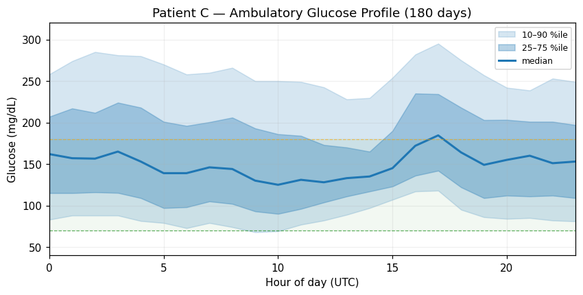
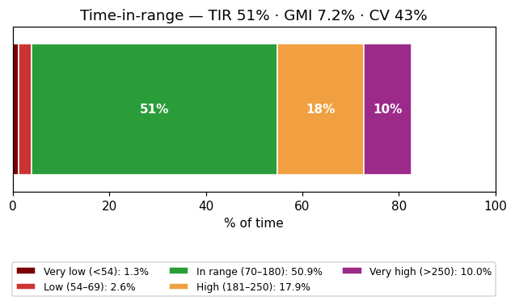
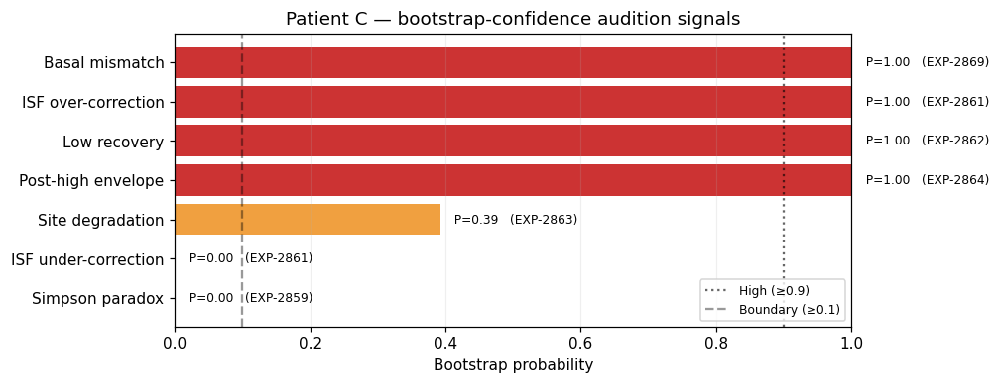
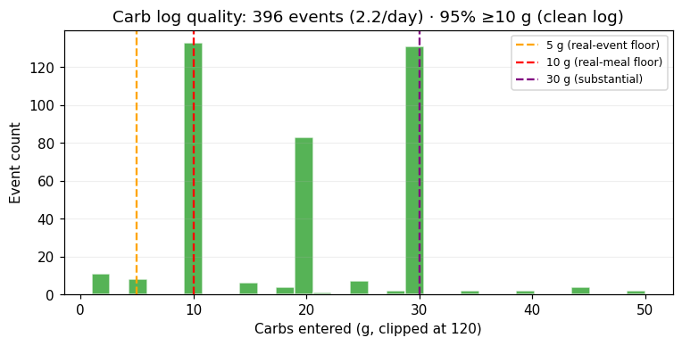
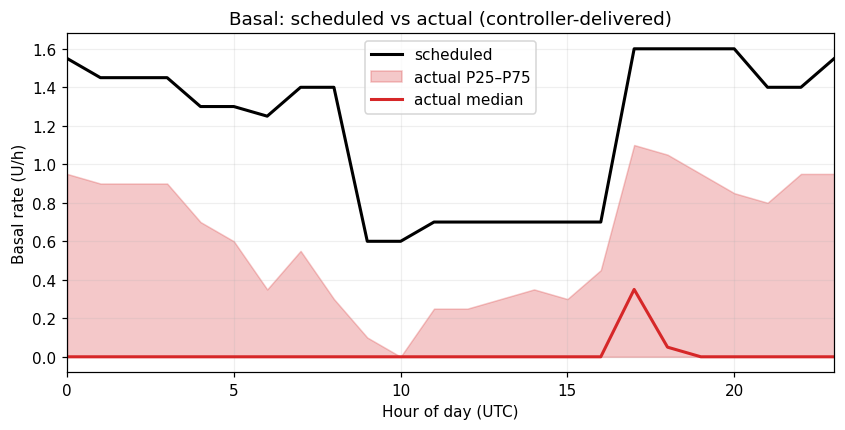
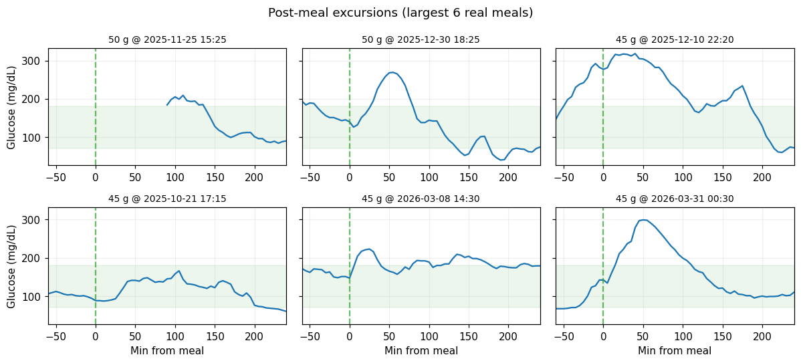

# Patient C — Therapy-Discussion Vignette (2026-04-22)

> **Operational triage report (Stream B).** Every recommendation is a
> *conversation starter* for clinician/patient review — not an autonomous
> setting change. Per the safety memory (EXP-2738): **the gap between
> scheduled and delivered insulin often IS the controller's safety
> margin.** Lowering settings to "match" the gap can increase
> hypoglycemia.

## Summary

| Metric | Value |
|--------|------:|
| Observation window | 180 days |
| Mean glucose | 162 mg/dL |
| GMI (eA1c estimate) | **7.2 %** |
| Coefficient of variation | 43% (target <36%) |
| Time in range (70–180) | **51%** (target ≥70%) |
| Time below range (<70) | 3.9% (target <4%) |
| Time very low (<54) | 1.29% (target <1%) |
| Time above range (>180) | 28% (target <25%) |
| Time very high (>250) | 10% (target <5%) |
| Carb-log quality | 2.2 events/day · 95% ≥10 g (**clean log**) |
| Median scheduled basal | 1.40 U/h |
| Median delivered basal | 0.00 U/h |

## Glycemic profile

**Read:** TIR is just above 50% — clinically meaningful improvement
target. CV 43% (>36%) suggests glycemic instability is the
dominant driver, not just elevated mean.

## Bootstrap-confident audition signals

| Signal | P | Tier | Source |
|--------|--:|------|--------|
| **flat_low_recovery** | — | high | matrix |
| **isf_over_correction** | — | medium | matrix |
| **site_degradation** | — | low | matrix |
| **post_high_envelope** | — | medium | matrix |
| **basal_mismatch** | — | high | matrix |

**Raw bootstrap probabilities:**

| Signal | P | Source |
|---|---:|---|
| Basal mismatch | 1.00 | EXP-2869 🔴 high |
| ISF over-correction | 1.00 | EXP-2861 🔴 high |
| Low recovery | 1.00 | EXP-2862 🔴 high |
| Post-high envelope | 1.00 | EXP-2864 🔴 high |
| Site degradation | 0.39 | EXP-2863 🟠 boundary |
| ISF under-correction | 0.00 | EXP-2861 ⬜ clean |
| Simpson paradox | 0.00 | EXP-2859 ⬜ clean |

## The story (4 high-confidence signals point to one mechanism)

Patient C shows a **coherent over-aggressive-basal cascade**:

1. **Basal mismatch (P=1.00, mult=0.00):**
   in fasting equilibrium the controller delivers ~0% of the scheduled
   basal — it is suspending almost continuously to defend against the
   schedule.

2. **ISF over-correction (P=1.00):** when
   the controller does correct, BG drops more than the ISF predicts
   (over-correction). This is consistent with the basal already being
   "too much" — additional bolus drops too far.

3. **Low recovery (P=1.00):** after a low,
   recovery to 100 mg/dL within 60 minutes is rare — also consistent
   with continuous basal pressure.

4. **Post-high envelope (P=1.00):** after
   a high, BG sustains above target without a quick recovery — the
   wide IQR (110–203) confirms oscillation rather than tight control.

## Conversation starters for clinic review

> ⚠️ **Do not change settings autonomously.** These are hypotheses for
> the clinician to discuss with the patient.

### 1. Review basal schedule
The 4 signals above are individually noisy but jointly point to
**scheduled basal being too high**. Recommended discussion:
- Audit overnight TBR pattern (figure 1, hours 0–6).
- Consider: was the basal schedule last reviewed? Has weight,
  activity, or insulin sensitivity changed?
- A **conservative trial** of a 5–10% basal reduction (clinician-
  supervised) tests the hypothesis safely. The controller's 0%
  delivery suggests there is room.

### 1b. State-conditioned basal context (EXP-2811)

| State | basal_drift | n samples |
|------:|------------:|---------:|
| 0 | +3.00 | 25 |
| 1 | +5.50 | 127 |

**Observed range across states: 2.50.** A non-zero range indicates basal need shifts with metabolic context (EXP-2811). Sign/magnitude interpretation is experimental — treat as a cue that *state-aware* basal review may be warranted, not as a direct recommendation.

### 2. Review ISF (correction factor)
Over-correction (P=1.00) on top of an already-suppressed basal
suggests ISF may be too aggressive. Discuss whether to **soften ISF
by 10–15%** as a paired adjustment with #1.

### 3. Investigate post-high recovery
P=1.00 for sustained post-high envelope. Discussion points:
- Is bolus timing pre-meal (not at meal start)?
- Are corrections being delivered at high BG, or is the patient
  waiting for the controller alone?

### 4. Site rotation (low-confidence)
Site-degradation P=0.39 (boundary, not
confirmed). Worth asking about rotation cadence but not a primary
finding.

## Carb-log quality (no concern)

Patient C's log is clean: 95% of events ≥10 g, only 3% are <5 g
(treat-of-low / noise). The audition signals are **not** confounded
by data-quality issues for this patient.

## Basal pattern detail

The black line is the patient's scheduled basal across the day; the
red band is what the controller actually delivered (P25–P75). The
controller is **continuously suppressing** delivery across all hours
— most pronounced during the afternoon/evening peak hours of the
schedule.

## Post-meal excursion examples

Six largest real meals in the dataset, plotted ±1 hr / +4 hr from the
meal time. These illustrate the high variance in meal response that
drives the wide IQR in the AGP.

## Methodology

* All audition signals computed from production loaders
  (`tools/cgmencode/production/*_facts_loader.py`).
* Bootstrap confidence (P) computed per the EXP-2859/2861/2862/2863/
  2864/2869 protocols.
* Carb-event quality assessed against the EXP-2866 conventions
  (`meal_filter.py`).
* Source data: `externals/ns-parquet/training/grid.parquet`,
  patient_id = `c`, 51,841 rows, 180 days.

## Caveats

* **Not medical advice.** Audition signals are statistical patterns;
  every recommendation must be filtered through the clinician's
  judgment and the patient's full history.
* **Stream B operational, not Stream A causal.** These signals describe
  *what the controller is doing*, not *what biological ISF/basal
  needs are*. The closed-loop system response is observed; the
  underlying biology is inferred only loosely.
* **Per EXP-2738**: the basal-mismatch gap IS the EGP safety margin
  the controller needs. The recommended trial reduction (5–10%) is
  much smaller than the observed multiplier (~0%) because the gap is
  protective.
