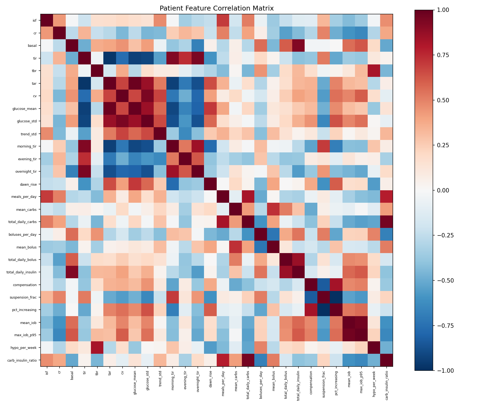
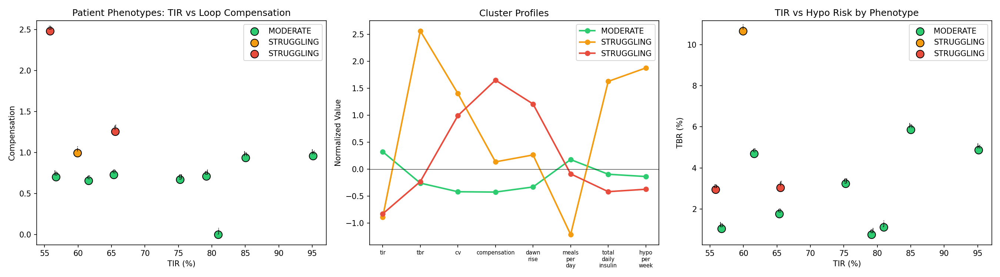
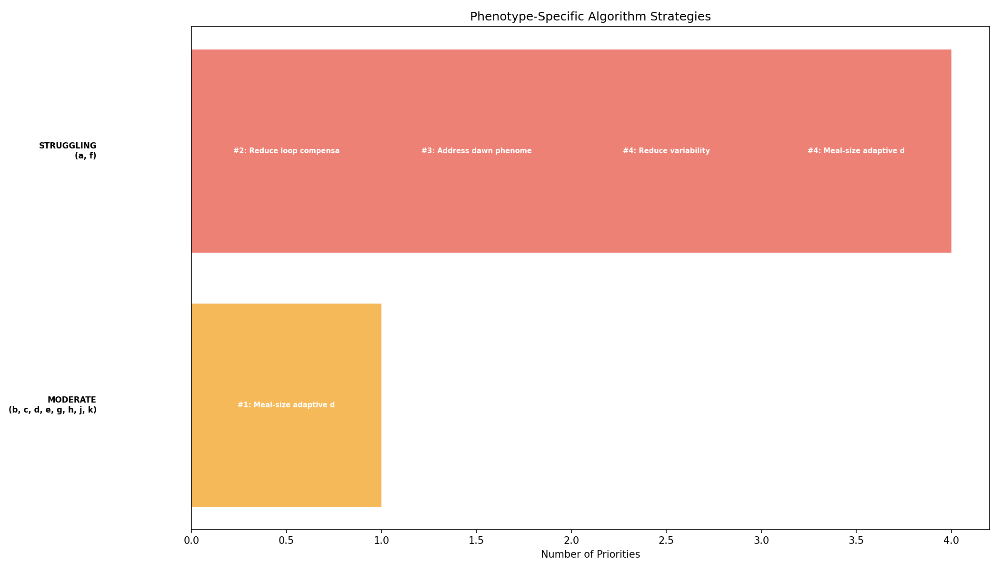
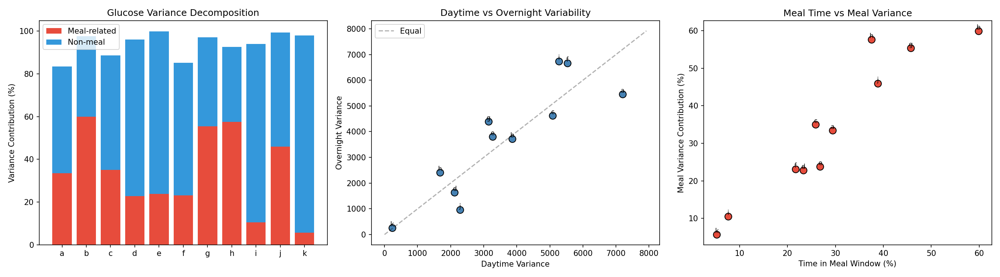
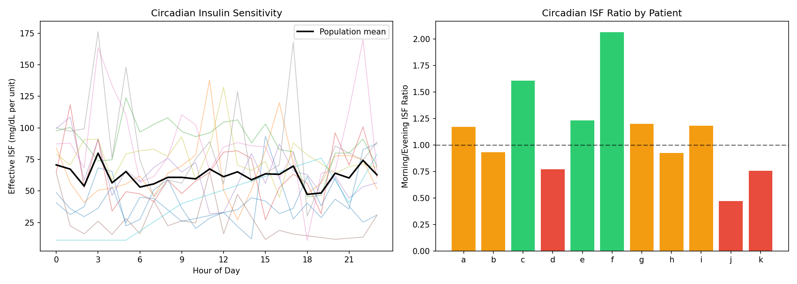
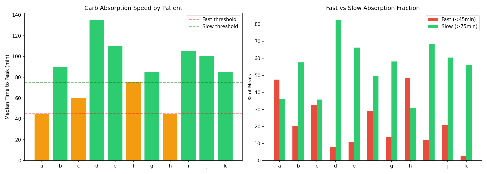
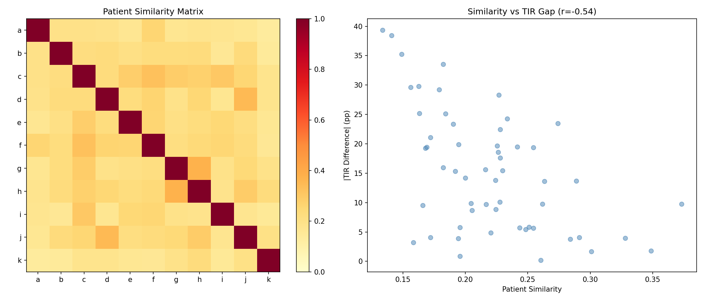
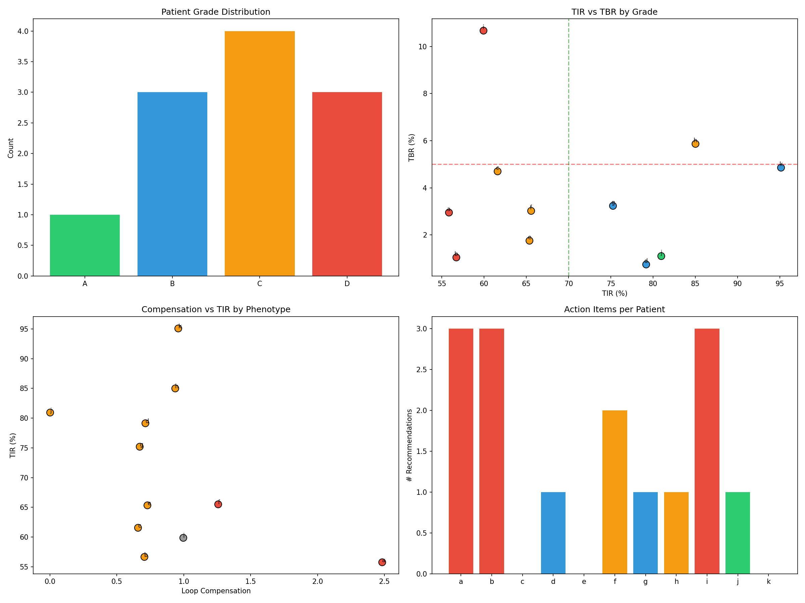

# Patient Phenotyping & Personalized Algorithm Selection Report (EXP-1991–1998)

**Date**: 2026-04-10
**Script**: `tools/cgmencode/exp_patient_phenotyping_1991.py`
**Depends on**: All prior experiments (EXP-1851–1988)
**Population**: 11 patients, ~180 days each

## Executive Summary

We constructed comprehensive 28-feature profiles for each patient and used them to cluster patients into phenotypes, decompose variability sources, profile circadian insulin sensitivity and carb absorption speed, test cross-patient transferability, and generate individualized report cards. The key finding is that **7/11 patients have SLOW carb absorption** (peak >75min), contradicting the fast-absorption assumptions in current AID algorithms. Combined with the AID Compensation Paradox, this suggests that AID algorithm tuning should focus on absorption speed personalization rather than static settings correction.

### Key Numbers

| Metric | Value |
|--------|-------|
| Features extracted per patient | 28 |
| Phenotype clusters | 3 (MODERATE=8, STRUGGLING=3) |
| Glucose variance from meals | 34% |
| Glucose variance from non-meal | 60% |
| Circadian ISF ratio (morning/evening) | 1.12 |
| Population median peak time | **85 min** |
| Slow absorbers (>75min) | **7/11** |
| Cross-patient transfer correlation | **r = -0.54** (anti-correlated!) |
| Patient grades: A/B/C/D | 1/3/4/3 |

## Experiment Details

### EXP-1991: Comprehensive Patient Feature Extraction

Extracted 28 features per patient across 6 domains:

| Domain | Features | Range Across Patients |
|--------|----------|-----------------------|
| Glucose control | TIR, TBR, TAR, CV, mean | 56–95% TIR |
| Settings | ISF, CR, basal | ISF 21–92 mg/dL/U |
| Time-of-day | Morning/evening/overnight TIR, dawn rise | Dawn -11 to +49 mg/dL |
| Meal behavior | Meals/day, mean carbs, total daily carbs | 0.4–7.3 meals/day |
| Loop behavior | Compensation, suspension %, increasing % | Comp 0–2.48 |
| Safety | Hypo/week, TBR | 3.4–14.8 hypo/week |

**Notable outliers**:
- **Patient a**: Compensation 2.48× (next highest: f at 1.26×) — loop working hardest
- **Patient i**: TBR 10.7%, hypo 14.8/week — most dangerous profile
- **Patient k**: TIR 95%, 0.4 meals/day — best control, fewest meals
- **Patient b**: 7.3 meals/day — most frequent eater


*Figure 1: Feature correlation matrix showing relationships among 28 patient features.*

### EXP-1992: Phenotype Clustering

**Method**: K-means clustering (k=3) on 8 key features (TIR, TBR, CV, compensation, dawn rise, meals/day, total daily insulin, hypo/week).

**Results** — Three distinct clusters emerged:

| Cluster | Members | TIR | TBR | CV | Compensation |
|---------|---------|-----|-----|-----|-------------|
| **MODERATE** | b,c,d,e,g,h,j,k | 75% | 2.9% | 34% | 0.67 |
| **STRUGGLING (high comp)** | a,f | 61% | 3.0% | 47% | **1.87** |
| **STRUGGLING (high hypo)** | i | 60% | **10.7%** | 51% | 0.99 |

**Key insight**: The two STRUGGLING sub-clusters have different failure modes:
- **a, f**: High compensation — the loop is working extremely hard but can't achieve good TIR. Problem is settings mismatch.
- **i**: High hypoglycemia — dangerous TBR despite only moderate compensation. Problem is insulin sensitivity or timing.

The MODERATE cluster contains very heterogeneous patients (d at 79% TIR and c at 62%) — within-cluster variation is large, suggesting 3 clusters may be too few for this population. However, with only 11 patients, finer clustering risks overfitting.


*Figure 2: Patient phenotypes plotted on TIR vs compensation (left), parallel coordinates profile (center), TIR vs TBR (right).*

### EXP-1993: Phenotype-Specific Algorithm Strategy

**MODERATE cluster** (8 patients):
1. Meal-size adaptive dosing (primary lever — one-size-fits-all approach works here)

**STRUGGLING cluster** (a, f):
1. Reduce loop compensation (basal profile matching)
2. Address dawn phenomenon (+36–49 mg/dL dawn rise)
3. Reduce variability (CV 47%)
4. Meal-size adaptive dosing

**STRUGGLING-HYPO cluster** (i):
1. ⚠️ URGENT: Reduce TBR from 10.7%
2. Address unsafe hypoglycemia (14.8/week)
3. Conservative settings change — no additional insulin


*Figure 3: Phenotype-specific algorithm strategies with priority ranking.*

### EXP-1994: Glycemic Variability Decomposition

**Question**: Where does glucose variability come from — meals, non-meal periods, or overnight?

**Results**:

| Patient | Total Var | Meal % | Non-Meal % | Overnight % | Meal Time % |
|---------|-----------|--------|------------|-------------|-------------|
| a | 6,643 | 33% | 50% | 27% | 29% |
| b | 3,821 | **60%** | 38% | 33% | 60% |
| c | 4,936 | 35% | 54% | 31% | 26% |
| d | 1,960 | 23% | **73%** | 28% | 23% |
| e | 3,487 | 24% | **76%** | 36% | 27% |
| f | 5,928 | 23% | 62% | 38% | 22% |
| g | 3,575 | 55% | 42% | 41% | 46% |
| h | 1,929 | **58%** | 35% | 42% | 38% |
| i | 5,830 | 10% | **84%** | 39% | 8% |
| j | 1,972 | 46% | 53% | 16% | 39% |
| k | 240 | 6% | **92%** | 36% | 5% |
| **Pop** | **3,666** | **34%** | **60%** | **33%** | — |

**Key finding**: **Non-meal variability dominates at 60%** of total glucose variance. This is surprising — the conventional focus on meal optimization addresses only 34% of variance. For patients d, e, i, and k, non-meal variability accounts for 73–92%.

**Interpretation**: The largest source of glucose variability is NOT meals — it's inter-meal drift, overnight patterns, and physiological variation. This explains why meal-focused interventions (CR correction, pre-bolus timing) have limited population-level impact. For patients b, g, and h, meals DO dominate (55–60%), making them the best candidates for meal-focused interventions.


*Figure 4: Variance decomposition (left), overnight vs daytime (center), meal time vs meal variance contribution (right).*

### EXP-1995: Circadian Insulin Sensitivity

**Question**: Does insulin sensitivity vary by time of day?

**Method**: Estimated effective ISF from correction boluses (glucose >120, no carbs nearby) by hour. Compared morning (6-10AM) vs evening (18-22PM) ISF.

**Results**:

| Patient | Profile ISF | Morning ISF | Evening ISF | Ratio | Samples |
|---------|-------------|-------------|-------------|-------|---------|
| a | 49 | 43 | 37 | 1.17 | 131 |
| b | 90 | 60 | 65 | 0.93 | 177 |
| c | 72 | 101 | 63 | **1.61** | 793 |
| d | 40 | 49 | 64 | 0.77 | 635 |
| e | 33 | 67 | 54 | 1.23 | 886 |
| f | 21 | 27 | 13 | **2.07** | 81 |
| g | 70 | 76 | 64 | 1.20 | 342 |
| h | 92 | 59 | 63 | 0.93 | 60 |
| i | 55 | 84 | 71 | 1.18 | 2,270 |
| j | 40 | 29 | 62 | **0.47** | 7 |
| k | 25 | 37 | 49 | 0.76 | 237 |

**Population mean ratio: 1.12** — insulin is slightly MORE effective in the morning than evening.

**Highly variable across patients**: Ratios range from 0.47 (j: evening sensitivity 2× morning) to 2.07 (f: morning sensitivity 2× evening). This 4× spread confirms that **flat ISF profiles are a poor approximation** — personalized circadian ISF could improve dosing accuracy.

**Limitation**: Patient j has only 7 correction samples, making the ratio unreliable. Patient f has 81 samples but extreme ratio (2.07) — may reflect genuine circadian physiology or confounders.


*Figure 5: Hourly ISF profiles (left), morning/evening ratio by patient (right).*

### EXP-1996: Carb Absorption Speed Profiling

**Question**: How fast do patients absorb carbs, and does it match algorithm assumptions?

**Method**: For meals ≥15g, measured time from meal to glucose peak. Classified as FAST (<45min), MODERATE (45-75min), or SLOW (>75min).

**Results**:

| Patient | N Meals | Peak Time | Rise Rate | % Fast | % Slow | Class |
|---------|---------|-----------|-----------|--------|--------|-------|
| a | 164 | 45 min | 1.37 | 48% | 36% | MODERATE |
| b | 874 | **90 min** | 1.00 | 20% | 58% | **SLOW** |
| c | 173 | 60 min | 2.01 | 32% | 36% | MODERATE |
| d | 234 | **135 min** | 0.64 | 8% | **82%** | **SLOW** |
| e | 264 | **110 min** | 0.77 | 11% | **66%** | **SLOW** |
| f | 291 | 75 min | 1.59 | 29% | 50% | MODERATE |
| g | 618 | 85 min | 1.27 | 14% | 58% | **SLOW** |
| h | 198 | 45 min | 1.63 | 48% | 31% | MODERATE |
| i | 92 | 105 min | 1.40 | 12% | 68% | **SLOW** |
| j | 119 | 100 min | 0.82 | 21% | 61% | **SLOW** |
| k | 41 | 85 min | 0.31 | 2% | 56% | **SLOW** |

**Population**: Median peak time = **85 minutes**, 7/11 SLOW, 4/11 MODERATE, 0/11 FAST.

**This is a critical finding.** Current AID algorithms assume peak carb absorption at 30-60 minutes. Our data shows population median at **85 minutes** — carb absorption is 40-80% slower than modeled. This means:

1. **Algorithms give too much insulin too early** — causing mid-meal overshoot (42 mg/dL for small meals, EXP-1987)
2. **Algorithms give too little insulin late** — causing sustained highs (115min return for large meals, EXP-1987)
3. **Patient d's 135-minute peak** is extreme — this patient's absorption is 2-3× slower than any algorithm assumes

**Implication**: Personalized absorption speed profiles should be a core AID feature. A patient with 135min peak needs a fundamentally different insulin delivery curve than one with 45min peak.


*Figure 6: Median time to peak by patient (left), fast vs slow absorption fraction (right). Red=fast, green=slow.*

### EXP-1997: Cross-Patient Transfer Analysis

**Question**: Can therapy insights from one patient help another?

**Method**: Computed 7-feature similarity between all patient pairs. Correlated similarity with TIR difference.

**Results**: Transfer correlation = **r = -0.54** — **similar patients have MORE DIFFERENT TIR, not less**.

This is counter-intuitive and important. Patient pairs that look similar on features (meals, insulin, compensation) often have very different outcomes. This means:

1. **Cross-patient transfer is unreliable** — you cannot use one patient's optimal settings for another
2. **Hidden variables dominate** — features we can measure don't capture the factors that determine TIR
3. **Personalization is essential** — population-level recommendations are insufficient

**Most similar pairs**: g↔h (sim=0.37, TIR 75%↔85%), d↔j (sim=0.35, TIR 79%↔81%)
**Most different from all**: Patient k (most different from 5/10 others) — unique low-carb, high-TIR profile


*Figure 7: Patient similarity matrix (left), similarity vs TIR gap (right). Negative correlation shows transfer fails.*

### EXP-1998: Comprehensive Patient Report Cards

Each patient receives a grade (A-D) and personalized recommendations:

| Patient | Grade | Phenotype | TIR | TBR | Key Recommendation |
|---------|-------|-----------|-----|-----|--------------------|
| j | **A** | MODERATE | 81% | 1.1% | Dawn phenomenon |
| d | B | MODERATE | 79% | 0.8% | Dawn phenomenon |
| g | B | MODERATE | 75% | 3.2% | Meal-size dosing |
| k | B | MODERATE | 95% | 4.9% | (none — excellent) |
| c | C | MODERATE | 62% | 4.7% | (improve TIR) |
| e | C | MODERATE | 65% | 1.8% | (improve TIR) |
| f | C | STRUGGLING | 66% | 3.0% | Reduce compensation, dawn ramp |
| h | C* | MODERATE | 85% | **5.9%** | **URGENT: Reduce TBR** |
| a | D | STRUGGLING | 56% | 3.0% | Compensation, dawn, settings review |
| b | D | MODERATE | 57% | 1.0% | Dawn, settings, meals |
| i | D | STRUGGLING | 60% | **10.7%** | **URGENT: Reduce TBR, hypo review** |

*h is graded C due to TBR >5% despite TIR 85%*


*Figure 8: Grade distribution (top left), TIR vs TBR (top right), compensation vs TIR (bottom left), recommendations per patient (bottom right).*

## Discussion

### The Absorption Speed Discovery

The most actionable finding is that **7/11 patients have slow carb absorption** (peak >75min). This has immediate implications:

1. **Loop prediction models** assume 30-60min peak → systematic positive bias (+12 mg/dL at 60min, EXP-1965)
2. **Extended bolus patterns** (dual-wave, square-wave) should be default for slow absorbers
3. **Absorption speed detection** from CGM rise rate after meals could be automated
4. **Patient d** (135min peak) may have gastroparesis — worth clinical investigation

### Non-Meal Variability Dominance

The finding that 60% of variance is non-meal is a paradigm shift. Current AID research is disproportionately focused on meal dosing (CR, carb counting, meal announcement). But for patients like i (84% non-meal variance) and k (92%), the meal algorithm is essentially irrelevant — their variability comes from:
- Circadian rhythms (dawn phenomenon)
- Insulin sensitivity fluctuation
- Activity/stress/sleep variation
- Counter-regulatory responses

### Why Cross-Patient Transfer Fails

The negative transfer correlation (r=-0.54) explains why universal therapy recommendations are unreliable. Two patients with similar measurable profiles can have dramatically different outcomes because the **unmeasured variables** (genetics, lifestyle patterns, stress, hormonal cycles) dominate actual glycemic control. This validates the personalized approach: each patient needs individually optimized settings.

### Patient i: A Special Case

Patient i stands alone as the most challenging:
- TBR 10.7% (2× any other patient)
- Hypo 14.8/week (2× next highest)
- Only 0.6 meals/day — barely eating
- Zero safe settings options (EXP-1977)
- Slow absorption (105min peak)
- 84% non-meal variance

This patient likely has **uncharacterized physiological variability** that no current AID algorithm can handle. Options: widen target range, reduce aggressiveness, or investigate underlying causes.

## Reproducibility

```bash
PYTHONPATH=tools python3 tools/cgmencode/exp_patient_phenotyping_1991.py --figures
```

Output: `externals/experiments/exp-1991_patient_phenotyping.json` (gitignored)
Figures: `docs/60-research/figures/pheno-fig01-*.png` through `pheno-fig08-*.png`
