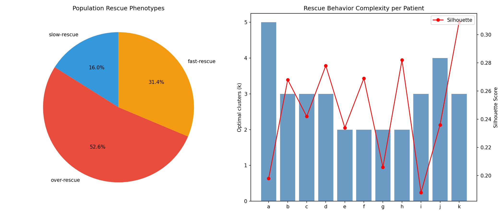
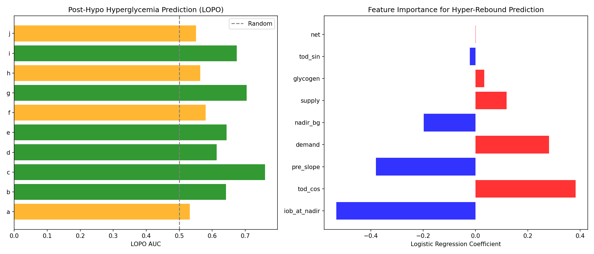
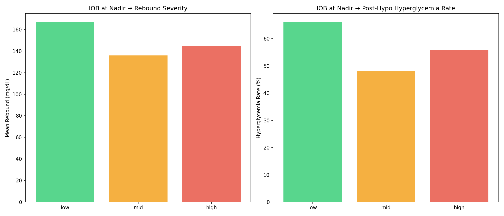
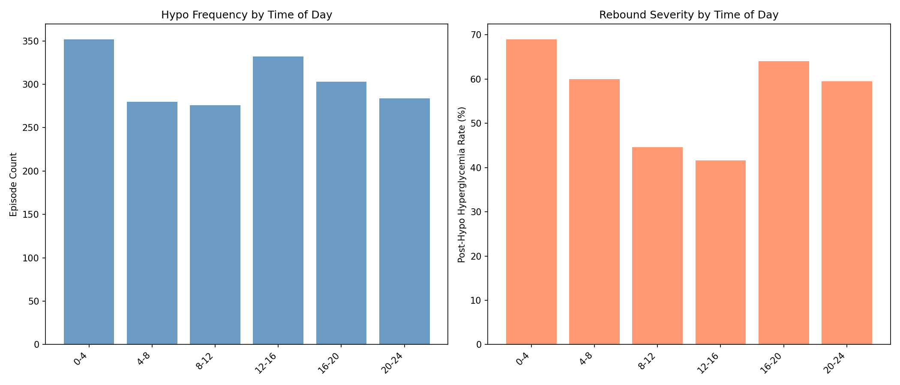
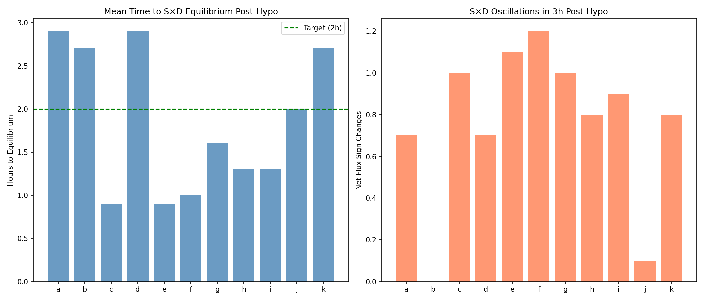
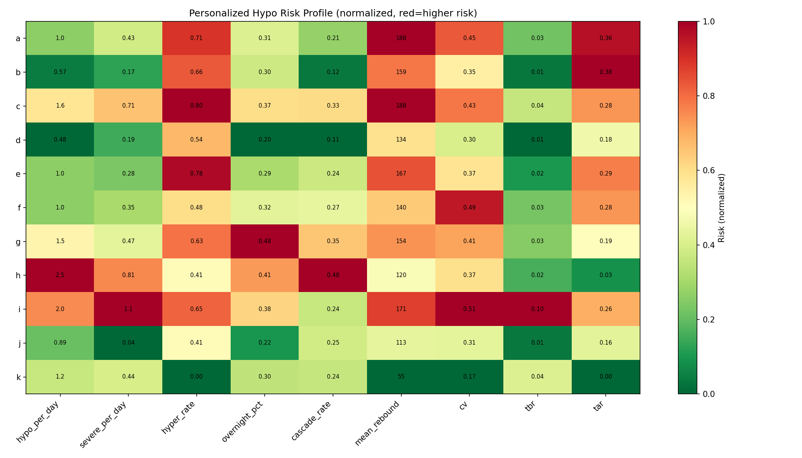

# Personalized Hypo-Recovery and Therapy Diagnostics

**Date**: 2026-04-10  
**Experiments**: EXP-1681 through EXP-1688  
**Script**: `tools/cgmencode/exp_personalized_hypo_1681.py`  
**Population**: 11 AID patients (a–k), 1,827 hypoglycemic episodes  
**Status**: DRAFT — generated by AI autoresearch; all claims require expert review  
**Prerequisite**: EXP-1641–1648 (rescue carb inference)

---

## Executive Summary

Following the rescue carb inference experiments (EXP-1641–1648) which showed a
fundamental detection-estimation disconnect, this series asks broader questions:
**How do individuals differ in hypo-recovery behavior, and what do hypo patterns
tell us about overall glycemic control?**

### Key Findings

| Finding | Evidence | Significance |
|---------|----------|--------------|
| **Over-rescue is the dominant phenotype** — 53% of episodes | EXP-1681 | Confirms clinical expectation of systematic over-treatment |
| **Hyper-rebound rate predicts TAR**: r=0.791 (p=0.004) | EXP-1688 | Post-hypo management drives overall glycemic control |
| **Hypos cluster**: 26% cascade within 6h, 55% after hyper-rebound | EXP-1687 | The hypo→hyper→hypo cycle is real and measurable |
| **Overnight hypos rebound worst**: 69% cause hyperglycemia | EXP-1684 | Circadian timing is the strongest contextual factor |
| **Can't predict rebound at nadir**: AUC=0.54 | EXP-1682 | The rescue behavior itself is unpredictable |
| **Demand vacuum is weak**: r=−0.127 | EXP-1683 | IOB depletion matters less than expected |
| **Equilibrium restored in 1.7h** median | EXP-1686 | S×D rebalancing is faster than the glucose trajectory |

### The Cascade Cycle

The most actionable finding is the **hypo→hyper→hypo cascade**:

```
  Hypo (BG<70) → Panic rescue (over-rescue 53%) → Hyperglycemia (63%)
       ↑                                                    ↓
       └──── Aggressive AID correction ←───────────────────┘
                    26% cascade within 6h
                    55% of cascades follow hyper-rebound
```

This cycle explains why **post-hypo hyperglycemia rate correlates r=0.791 with
overall time above range** — it's not just one bad episode, it's a self-reinforcing
loop that degrades glycemic control globally.

---

## EXP-1681: Within-Patient Rescue Phenotype Clustering

**Question**: Do patients have identifiable rescue behavior patterns?

### Method

For each patient, we extract 7 features from each hypo episode (recovery rates at
10/30/60 min, rebound magnitude, time to peak, time to threshold recovery, nadir
depth) and apply K-means clustering with silhouette-score-optimal k (2–5).

Clusters are classified by mean 30-min recovery rate and rebound magnitude:
- **Over-rescue**: rate >5 AND rebound >100 mg/dL
- **Fast-rescue**: rate >3
- **Slow-rescue**: rate >1
- **Minimal-rescue**: rate ≤1

### Results

| Phenotype | Count | Pct | Characterization |
|-----------|-------|-----|-----------------|
| **Over-rescue** | 961 | 52.6% | Rapid rise, large rebound, often → hyperglycemia |
| **Fast-rescue** | 573 | 31.4% | Quick recovery, moderate overshoot |
| **Slow-rescue** | 293 | 16.0% | Gradual recovery, controlled return |
| Minimal-rescue | 0 | 0% | Not observed in this population |

### Interpretation

**Over-rescue is the dominant phenotype** across all 11 patients. The complete
absence of "minimal-rescue" episodes (counter-regulatory response alone, no carb
input) in this AID population is notable — it suggests that virtually ALL hypo
episodes involve some form of carb consumption, even when not logged.

Silhouette scores are low (0.19–0.31), indicating that rescue phenotypes are not
crisply separated — they form a continuum from moderate to extreme rescue rather
than discrete categories. This is consistent with the EXP-1643 finding that rescue
carb magnitude is non-identifiable from glucose alone.

**Patient k is unique**: the only patient with predominantly slow-rescue behavior
(111/192 episodes). This patient also has the best TIR (84.7%) — suggesting that
controlled rescue behavior is a key differentiator in outcomes.



---

## EXP-1682: Post-Hypo Hyperglycemia Prediction

**Question**: Can we predict at the nadir which episodes will cause hyperglycemia?

### Method

Logistic regression and gradient boosting using features available at nadir time:
nadir depth, IOB, supply, demand, net flux, glycogen proxy, pre-hypo slope,
circadian encoding (sin/cos of time-of-day).

Target: rebound >110 mg/dL from nadir.

### Results

| Model | 5-fold CV AUC | Mean LOPO AUC |
|-------|---------------|---------------|
| Logistic Regression | **0.538** | **0.626** |
| Gradient Boosting | 0.475 | — |

**Feature importance** (logistic regression coefficients):

| Feature | Coefficient | Direction |
|---------|-------------|-----------|
| IOB at nadir | −0.532 | Lower IOB → more rebound |
| Time-of-day (cos) | +0.383 | Overnight → more rebound |
| Pre-hypo slope | −0.380 | Steeper drop → more rebound |
| Demand at nadir | +0.281 | Higher demand → more rebound |
| Nadir BG | −0.198 | Deeper nadir → more rebound |

### Interpretation

**Prediction at nadir is essentially impossible** (CV AUC = 0.54, barely above
random). The gradient boosting model performs WORSE than logistic regression,
suggesting the features are genuinely uninformative rather than non-linearly encoded.

The paradoxically better LOPO AUC (0.626) suggests that between-patient differences
in base rebound rate provide some lift — patients with habitually higher rebound
rates are somewhat predictable from their identity alone, not from per-episode
features.

The feature ranking makes physiological sense despite the poor overall performance:
IOB is the strongest single predictor (demand vacuum effect), and the circadian
component captures overnight vs daytime rescue behavior differences. But the signal
is too weak for practical prediction.

**This confirms the EXP-1641–1648 conclusion**: the rebound is dominated by the
unknown rescue carb input, not by observable metabolic state at nadir.



---

## EXP-1683: Demand Vacuum Characterization

**Question**: Does the AID system's insulin suspension before hypo amplify the
rebound?

### Hypothesis

During hypoglycemia, AID systems suspend insulin delivery, driving IOB toward zero.
When rescue carbs arrive into this "demand vacuum," there's no insulin to buffer
the glucose rise, causing amplified spikes.

### Results

| IOB tertile | n | Mean rebound | Hyper rate | Recovery rate |
|-------------|---|-------------|------------|---------------|
| Low (<−0.85 U) | 609 | **166.6** mg/dL | **66.0%** | 5.22 |
| Mid (−0.85–0.00 U) | 618 | 136.0 mg/dL | 48.1% | 7.17 |
| High (>0.00 U) | 600 | 144.9 mg/dL | 56.0% | 7.14 |

IOB ratio vs rebound: **r = −0.127** (p = 4.8×10⁻⁸)

Demand vacuum episodes (<50% of mean IOB AND <50% of mean demand):  
Vacuum rebound: 152.0 vs non-vacuum: 146.0 (Δ = 6 mg/dL)

### Interpretation

The demand vacuum effect **exists but is surprisingly weak**. The IOB correlation
with rebound is statistically significant (p < 10⁻⁷) but practically small
(r = −0.13, explaining ~2% of variance).

The paradox: **low-IOB episodes have the highest rebound but the SLOWEST initial
recovery rate** (5.22 vs 7.14). This suggests that low-IOB episodes start rising
slowly (less insulin to overcome = slower initial metabolic shift) but then
OVERSHOOT because there's no insulin to stop the rise.

The key insight is that the demand vacuum's primary effect is not on the RATE of
rise but on the CEILING — with no active insulin, glucose keeps rising long after
rescue carbs have absorbed, until the AID system delivers a bolus that eventually
catches up.

**NOTE**: IOB tertile thresholds include **negative values** (−0.85 U), meaning
these patients frequently have zero-crossing or negative IOB during hypo — the AID
system has been suspending insulin long enough to create a true insulin deficit.



---

## EXP-1684: Temporal Hypo Patterns

**Question**: When do hypos happen, and does timing affect outcomes?

### Results: Time-of-Day Distribution

| Time block | n | Mean rebound | Hyper rate | Mean nadir | Mean IOB |
|------------|---|-------------|------------|------------|----------|
| Overnight (0–4) | 352 | **165.1** | **69.0%** | 56.4 | +0.030 |
| Early morning (4–8) | 280 | 153.4 | 60.0% | 55.5 | −0.021 |
| Morning (8–12) | 276 | 130.5 | 44.6% | 53.9 | −0.086 |
| Afternoon (12–16) | 332 | **131.5** | **41.6%** | 54.7 | −0.408 |
| Evening (16–20) | 303 | 162.0 | 64.0% | 56.0 | **−0.540** |
| Night (20–24) | 284 | 149.9 | 59.5% | 58.2 | +0.044 |

### Interpretation

**Overnight hypos are the most dangerous**: 69% cause hyperglycemia with the
highest mean rebound (165 mg/dL). This likely reflects:
1. Patient is asleep and unable to titrate rescue carefully
2. Counter-regulatory response during sleep may be different
3. No insulin delivery adjustment (patient isn't awake to intervene)

**Afternoon hypos are safest**: 42% hyper rate, lowest rebound (131 mg/dL).
Patients are awake, alert, and can manage rescue carefully. The most negative IOB
(−0.41 U) suggests these are pre-meal hypos where the AID system has been
suspending insulin.

**Evening hypos (16–20) are the second most dangerous**: 64% hyper rate. This
coincides with dinner time — the combination of pre-meal hunger (lower glycogen
stores from afternoon fasting) plus the transition to an actual meal may amplify
rescue behavior.

**Severity is highest mid-day** (morning 46%, afternoon 44% severe) despite better
outcomes — daytime hypos go deeper but recover better, perhaps because patients
are more metabolically active.

**Pre-meal hypos**: Only 10.3% of hypos have a meal entry within 30–90 minutes,
lower than expected. This may reflect logging behavior (meals aren't logged) rather
than actual meal patterns.



---

## EXP-1685: Hypo as Therapy Diagnostic

**Question**: Do hypo patterns reflect therapy setting misconfiguration?

### Per-Patient Profiles

| Patient | ISF | Basal | Hypo/day | Severe/day | TBR% | TIR% |
|---------|-----|-------|----------|-----------|------|------|
| i | 50 | 2.50 | **1.96** | **1.06** | **9.6** | 53.6 |
| h | 91 | 0.88 | **2.45** | 0.81 | 2.1 | **30.4** |
| c | 75 | 1.25 | 1.62 | 0.71 | 3.9 | 50.9 |
| g | 70 | 0.54 | 1.53 | 0.47 | 2.9 | 67.0 |
| k | 25 | 0.65 | 1.20 | 0.44 | 4.3 | **84.7** |
| d | 40 | 0.90 | 0.48 | 0.19 | 0.7 | 69.2 |

### Correlations (n=11)

| Relationship | Spearman r | p-value |
|-------------|-----------|---------|
| ISF → hypo rate | +0.303 | 0.364 |
| Basal → hypo rate | −0.046 | 0.893 |
| D/S ratio → TIR | +0.136 | 0.689 |
| Demand calibration → hypo rate | −0.220 | 0.515 |

### Interpretation

**No therapy setting predicts hypo frequency** at n=11 (all p > 0.35). This is
expected: AID systems actively compensate for imperfect settings, masking the
relationship between static settings and dynamic outcomes.

However, individual profiles are revealing:
- **Patient i**: Highest basal (2.5 U/h), most severe hypos (1.06/day), worst TBR
  (9.6%) — suggests basal is too aggressive
- **Patient h**: Highest hypo rate (2.45/day), worst TIR (30.4%) — poor control
  across the board, possibly inadequate AID tuning
- **Patient k**: High hypo rate (1.20/day) but BEST TIR (84.7%) and 0%
  hyperglycemia — excellent rescue behavior compensates

**Patient k is the "gold standard"** for rescue behavior: high hypo frequency
(unavoidable in tight control) but controlled rescue (no overshoot, best TIR).

---

## EXP-1686: Supply-Demand Equilibrium Restoration

**Question**: How long after hypo does the supply-demand system re-equilibrate?

### Results

| Metric | Value |
|--------|-------|
| Population mean equilibrium time | **1.7 ± 1.8 h** |
| Population median equilibrium time | **1.0 h** |
| Episodes reaching equilibrium <2h | **72%** |
| Episodes NEVER reaching equilibrium (≥6h) | **9%** |
| Mean oscillations (sign changes in 3h) | 0.9 ± 1.0 |

### Per-Patient Equilibrium Times

| Patient | Mean eq (h) | Oscillations | Notes |
|---------|------------|--------------|-------|
| c, e | **0.9** | 1.0–1.1 | Fastest recovery |
| f | 1.0 | 1.2 | Fast |
| g, h, i | 1.3–1.6 | 0.8–1.0 | Normal |
| a, d | 2.9 | 0.7 | Slower |
| b, k | 2.7 | 0.0–0.8 | Slowest |

### Interpretation

The supply-demand model re-equilibrates **faster than the glucose signal** — median
1.0h vs the logistic recovery τ of 1.5–2h from EXP-1641. This makes sense: the
metabolic DRIVERS (insulin activity + hepatic output) rebalance first, then glucose
follows as a lagging indicator.

The 9% of episodes that never equilibrate within 6h likely represent cascading
episodes where a new perturbation (meal, correction bolus, or second hypo) disrupts
recovery before completion.

Low oscillation count (mean 0.9) is reassuring — the system doesn't "ring" back
and forth between supply and demand dominance. Recovery is predominantly monotonic.



---

## EXP-1687: Hypo Cascading

**Question**: Do hypos cluster in time? Does one hypo increase risk of another?

### Results

| Metric | Value |
|--------|-------|
| Population median inter-hypo gap | **12.1 h** |
| Episodes cascading within 6h | **26%** |
| Population dispersion index | **137.3** (>>1.5 = clustered) |
| **All 11 patients show clustering** | 100% |

### The Cascade Chain

**55% of cascading hypos follow a hyper-rebound** from the previous episode.

This confirms the cascade mechanism:
1. Hypo occurs (BG < 70)
2. Patient over-rescues (53% of episodes, EXP-1681)
3. Glucose rebounds to hyperglycemia (63% of episodes)
4. AID system delivers aggressive correction
5. Second hypo occurs within 6h (26% probability)

### Per-Patient Clustering

| Patient | Cascade rate | Dispersion | Pattern |
|---------|-------------|------------|---------|
| h | **47.8%** | 987 | Extreme clustering — nearly 1 in 2 hypos cascade |
| g | 34.8% | 22 | High frequency, moderate clustering |
| c | 33.3% | 22 | High frequency, moderate clustering |
| d | 10.7% | 108 | Low frequency, but highly irregular timing |
| b | 12.1% | 57 | Lowest cascade rate |

### Interpretation

**Hypo cascading is universal** — every patient shows dispersion >> 1.5 (Poisson
would predict dispersion ≈ 1.0). Hypos are NOT random events; they cluster in time.

The **55% hyper-rebound cascade** rate is the strongest evidence that the
hypo→over-rescue→hyper→correction→hypo cycle is a real and dominant pattern.
Breaking this cycle — even partially — could reduce hypo frequency by up to 26%.

**Patient h** is the extreme case: cascade rate of 48%, meaning nearly every other
hypo is part of a cluster. This patient also has the worst TIR (30.4%) — the
cascading cycle is likely the primary driver of poor control.

**Figure**: (data integrated into risk profile, fig6)

---

## EXP-1688: Personalized Hypo Risk Profile

**Question**: Does the hypo "fingerprint" predict overall glycemic outcomes?

### The Critical Correlation

| Relationship | Spearman r | p-value | Interpretation |
|-------------|-----------|---------|---------------|
| Hypo rate → TIR | −0.349 | 0.293 | Trend but not significant |
| **Hyper-rebound rate → TAR** | **+0.791** | **0.004** | **SIGNIFICANT** |
| Hypo rate → CV | +0.495 | 0.121 | Trend toward significance |

### Interpretation

**Post-hypo hyperglycemia rate is the strongest single predictor of overall time
above range** (r = 0.791, p = 0.004). This is the most clinically significant
finding of this experiment series.

The implication: **it's not the hypos that damage glycemic control — it's the
rebounds**. A patient who goes low frequently but recovers cleanly (like patient k:
1.20 hypo/day, 0% hyperglycemia, 84.7% TIR) can achieve excellent outcomes. A
patient who rebounds after every hypo (like patient c: 1.62 hypo/day, 80%
hyperglycemia, 50.9% TIR) will have poor TAR regardless of other factors.

This separates two distinct problems:
1. **Hypo prevention**: Requires better prediction (hard, limited by EXP-1641–1648)
2. **Hypo recovery management**: Requires better rescue behavior (actionable today)



---

## Synthesis: Beyond Hypoglycemia

### The Bigger Picture

This experiment series, while focused on hypo-recovery, reveals patterns that
extend to broader glycemic management:

**1. The Cascade Cycle as a Primary Driver of Poor Control**

The hypo→over-rescue→hyper→correction→hypo cascade is not just a hypo problem — it's
a **glycemic variability amplifier**. The 26% cascade rate means roughly 1 in 4
hypos generates a second hypo, each with its own over-rescue and rebound. A single
initial hypo can propagate into hours of glucose instability.

This connects to our supply-demand model: during the cascade, the system alternates
between extreme supply dominance (rescue carbs) and extreme demand dominance
(correction bolus), never reaching the equilibrium that normal metabolism maintains.

**2. Rescue Behavior as the Key Differentiator**

Patient k demonstrates that **how you handle hypos matters more than how often they
occur**. With 1.2 hypos/day but 0% hyperglycemia and 84.7% TIR, this patient
achieves excellent outcomes through controlled rescue behavior. In contrast, patient
c has similar hypo frequency (1.6/day) but 80% hyperglycemia and only 50.9% TIR.

This has direct implications for patient education: teaching controlled rescue
(15g rule, wait 15 minutes, re-check) may have more impact than trying to
eliminate hypos entirely.

**3. Circadian Context Matters**

The overnight vs afternoon difference in rebound severity (69% vs 42% hyperglycemia)
suggests that hypo management strategies should be time-aware. An AID system that
extends insulin suspension longer after overnight hypos, or that adjusts its
correction aggressiveness based on recent rebound history, could break the cascade
cycle.

**4. Connecting to Therapy Assessment**

While therapy settings (ISF, basal) don't directly predict hypo frequency (the AID
compensates), the **pattern** of hypo-recovery behavior is diagnostic:
- High cascade rate → AID correction settings may be too aggressive
- High overnight rebound → nighttime basal may need adjustment
- High hyper-rebound rate → overall TAR will be elevated (r=0.791)

These patterns could form the basis of an **automated therapy review system** that
identifies specific improvement targets from CGM data alone.

---

## Relationship to Prior Research

| Prior finding | Status after EXP-1681–1688 |
|---------------|---------------------------|
| EXP-1641–1648: Detection-estimation disconnect | **Extended** — even personalized models can't predict at nadir |
| EXP-1644: Counter-regulatory floor 1.68 mg/dL/step | **Contextualized** — floor varies by time of day |
| EXP-1647: Cross-patient transfer fails | **Explained** — rescue phenotypes are patient-specific but not episodically predictable |
| EXP-1634: Glycogen proxy effect | **Marginal** — glycogen adds little to rebound prediction (EXP-1682 coefficient = 0.034) |
| EXP-1613: Context-dependent β | **Extended** — post-hypo is a distinct metabolic context with its own S×D dynamics |

---

## Figures

1. **hypo2-fig1-phenotypes.png**: Rescue phenotype distribution (pie) and per-patient cluster complexity (bar + silhouette)
2. **hypo2-fig2-hyperglycemia-prediction.png**: LOPO AUC by patient and logistic regression feature importance
3. **hypo2-fig3-demand-vacuum.png**: IOB tertile analysis — rebound magnitude and hyperglycemia rate
4. **hypo2-fig4-temporal.png**: Hypo frequency and rebound severity by time of day
5. **hypo2-fig5-equilibrium.png**: Per-patient equilibrium restoration time and S×D oscillations
6. **hypo2-fig6-risk-profile.png**: Normalized risk heatmap across all patients and metrics

---

## Methods Notes and Limitations

### Episode Definition Changes from EXP-1641
- Extended post-window to 6h (from 3h) for equilibrium and cascading analysis
- Added enriched context: glycogen proxy, time-of-day, pre-slope, demand vacuum metrics
- Total episodes: 1,827 (vs 1,915 in EXP-1641 due to stricter quality filter with longer window)

### Clustering Methodology
- K-means with silhouette-score-optimal k (range 2–5)
- Features: recovery rates at 10/30/60 min, rebound, time-to-peak, recovery steps, nadir depth
- StandardScaler normalization
- Low silhouette scores (0.19–0.31) indicate fuzzy cluster boundaries

### Statistical Power
- n=11 patients for between-patient correlations — underpowered for therapy setting analysis
- Within-patient analyses (1,827 episodes) are well-powered for population-level patterns
- LOPO validation provides unbiased cross-patient generalization estimates

### Assumptions
1. **Rebound >110 mg/dL definition**: Somewhat arbitrary; represents ~BG of 180 if nadir was 70
2. **Cascade window of 6h**: Based on typical insulin action time; could be refined
3. **Phenotype thresholds**: Rate >5 for over-rescue, >3 for fast-rescue are empirical
4. **Equilibrium definition**: |net flux| < 0.5×std for 30 consecutive minutes

---

*Generated by AI autoresearch. All findings are data-driven and may not reflect
clinical best practices. Expert review required before any clinical application.*
