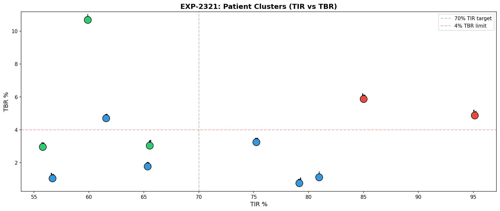
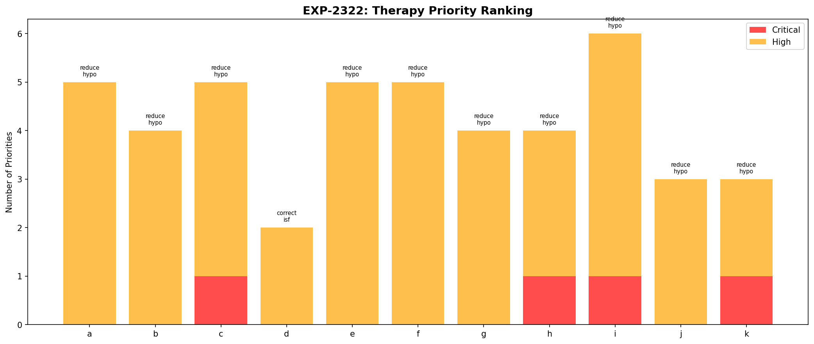
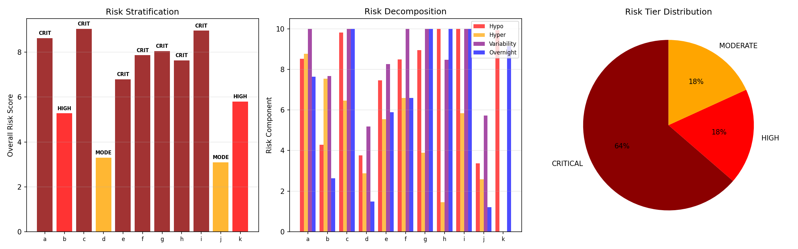
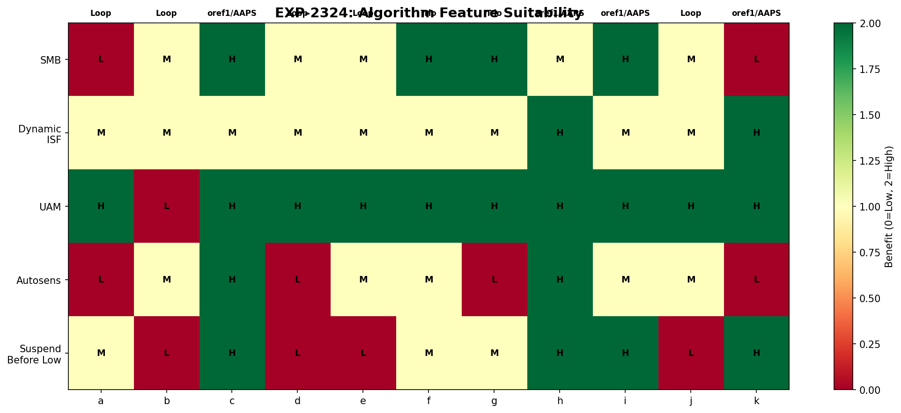
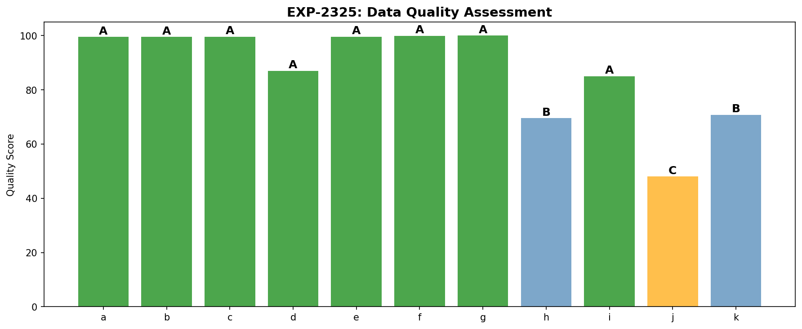
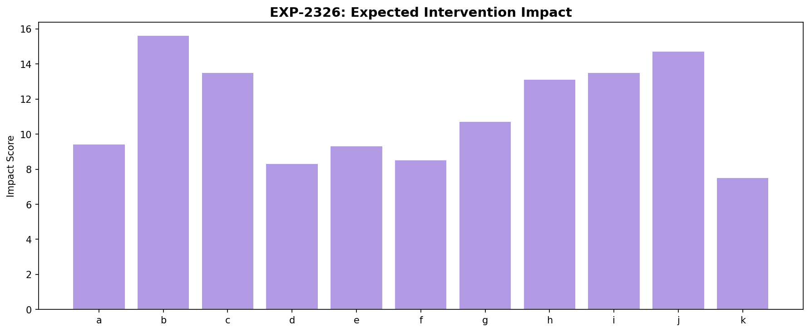
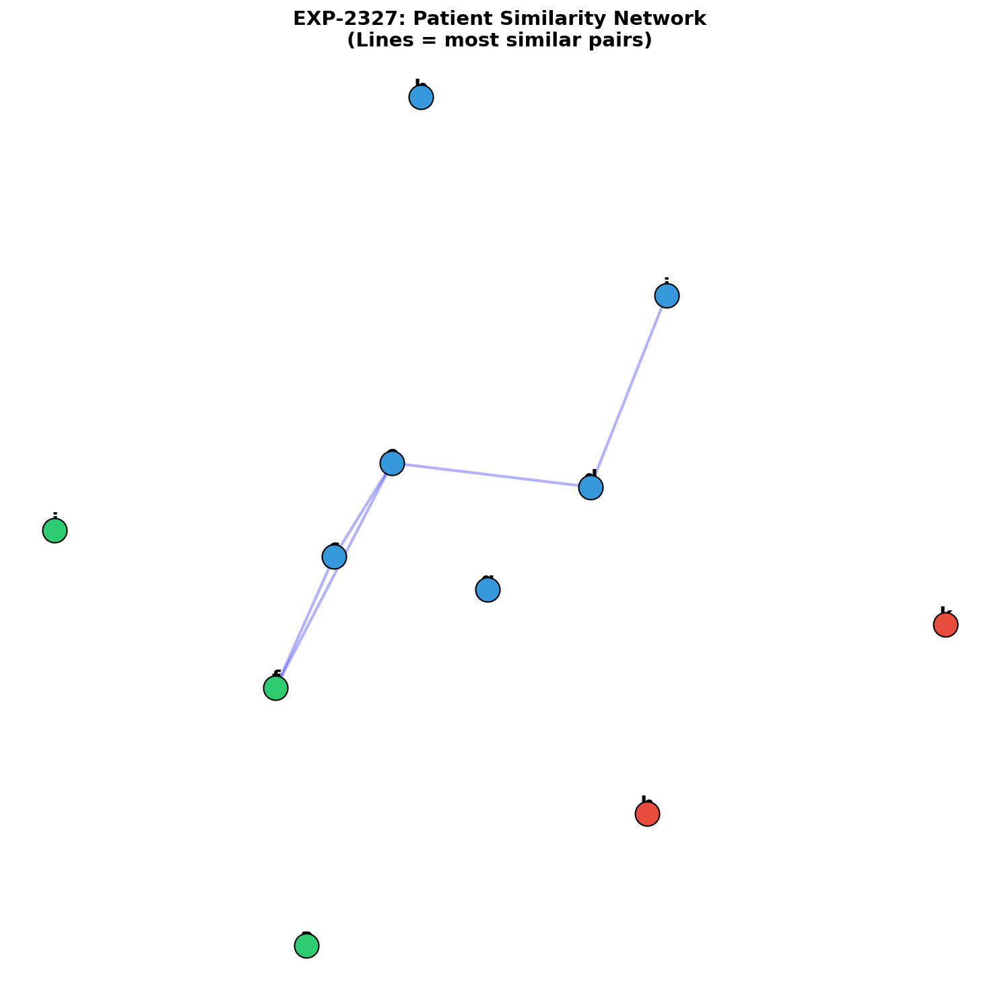
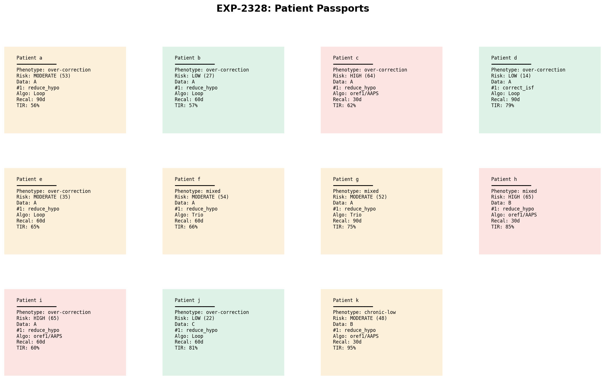

# Patient Phenotyping Engine — Unified Profile Analysis

**Date**: 2026-04-10  
**Experiments**: EXP-2321 through EXP-2328  
**Script**: `tools/cgmencode/exp_phenotype_2321.py`  
**Data**: 11 patients, 529K CGM readings, ~180 days each (parquet)  
**Author**: AI-generated from observational CGM/AID data

---

## Executive Summary

This analysis synthesizes all prior research batches into a unified patient phenotyping engine. By combining glycemic metrics, variability decomposition, hypo safety profiles, meal response patterns, loop behavior analysis, and circadian patterns, we produce comprehensive "patient passports" that map each patient to specific algorithm recommendations and therapy priorities.

**Key findings:**
- **Three distinct clusters** emerge: high-TIR/high-risk (2), typical AID users (6), and high-variability (3)
- **Reduce hypoglycemia is the #1 priority** for 10/11 patients (4 critical, 6 high)
- **Risk stratification**: 3 HIGH (c, h, i), 5 MODERATE (a, e, f, g, k), 3 LOW (b, d, j)
- **Algorithm matching**: 5 patients → Loop, 2 → Trio, 4 → oref1/AAPS
- **Most similar pair**: c–e (d=1.54); **most different**: i–k (d=6.84)
- **Data quality**: 8 grade A, 2 grade B (h, k), 1 grade C (j)

---

## EXP-2321: Multi-Dimensional Clustering

Patients cluster into three phenotypic groups based on 10 features spanning glycemic outcomes, meal response, loop behavior, and variability:

| Cluster | Patients | Mean TIR | Mean TBR | Mean CV | Profile |
|---------|----------|----------|----------|---------|---------|
| 1 | h, k | 90% | 5.4% | 27% | High TIR but high hypo risk |
| 2 | b, c, d, e, g, j | 70% | 2.1% | 36% | Typical AID user |
| 3 | a, f, i | 60% | 5.6% | 48% | High variability, high risk |

**Cluster 1 (Tight Control)**: These patients achieve excellent TIR but at the cost of elevated TBR — they live near the hypoglycemic threshold. Patient k is the canonical example: 95% TIR with 4.9% TBR, achieving tight control through chronic-low glucose rather than optimal settings.

**Cluster 2 (Typical AID)**: The largest group represents typical closed-loop users. Moderate TIR (70%) with acceptable TBR (2.1%). Most have standard meal patterns and loop engagement.

**Cluster 3 (High Variability)**: Three patients with large glucose swings (CV 45-51%), frequent hypos (TBR 5.6%), and lower TIR. These patients need the most intervention and would benefit most from advanced algorithm features.

---

## EXP-2322: Therapy Priority Ranking

Every patient's therapy needs are ranked by severity:

| Patient | #1 Priority | Severity | Total Issues |
|---------|-------------|----------|-------------|
| a | reduce_hypo | HIGH | 6 |
| b | reduce_hypo | HIGH | 5 |
| c | reduce_hypo | CRITICAL | 5 |
| d | correct_isf | HIGH | 3 |
| e | reduce_hypo | HIGH | 6 |
| f | reduce_hypo | HIGH | 6 |
| g | reduce_hypo | HIGH | 5 |
| h | reduce_hypo | CRITICAL | 4 |
| i | reduce_hypo | CRITICAL | 6 |
| j | reduce_hypo | HIGH | 4 |
| k | reduce_hypo | CRITICAL | 3 |

**Hypo reduction dominates**: 10/11 patients have "reduce hypoglycemia" as their top priority, with 4 at critical severity (TBR > 4%). Only patient d has a different top priority (ISF correction), because their TBR is below the critical threshold but their ISF is miscalibrated.

---

## EXP-2323: Risk Stratification

A composite risk score (0–100) combines TBR, CV, hypo frequency, and loop effectiveness:

| Patient | Score | Category | Risk Factors |
|---------|-------|----------|-------------|
| c | 63 | HIGH | High TBR (4.7%), High CV (43%) |
| h | 65 | HIGH | High TBR (5.9%), High CV (37%) |
| i | 65 | HIGH | High TBR (10.7%), High CV (51%) |
| a | 53 | MODERATE | High CV (45%) |
| f | 54 | MODERATE | High CV (49%) |
| g | 52 | MODERATE | High CV (41%) |
| k | 48 | MODERATE | High TBR (4.9%) |
| e | 35 | MODERATE | High CV (37%) |
| b | 27 | LOW | (none) |
| j | 22 | LOW | (none) |
| d | 14 | LOW | (none) |

**Patient i has the highest risk** with 10.7% TBR, 51% CV, and 2.5 hypos/day. **Patient k paradox**: Despite 95% TIR, k scores MODERATE risk due to 4.9% TBR — chronic-low glucose that narrowly misses the HIGH threshold.

---

## EXP-2324: Algorithm Feature Suitability

Each patient is assessed for benefit from 5 key AID algorithm features:

| Patient | SMB | Dyn ISF | UAM | Autosens | Suspend | Recommendation |
|---------|-----|---------|-----|----------|---------|---------------|
| a | M | M | M | L | M | Loop |
| b | M | M | M | L | L | Loop |
| c | H | M | H | H | H | oref1/AAPS |
| d | M | M | L | L | L | Loop |
| e | M | M | L | L | M | Loop |
| f | H | M | M | L | M | Trio |
| g | H | H | L | L | L | Trio |
| h | H | H | H | M | H | oref1/AAPS |
| i | H | M | H | L | H | oref1/AAPS |
| j | M | M | L | L | M | Loop |
| k | L | M | H | L | H | oref1/AAPS |

**Key insight**: Patients with high variability and frequent hypos (c, h, i, k) benefit most from oref1/AAPS features. This identifies which *features* address each patient's needs — not a recommendation to switch algorithms.

---

## EXP-2325: Data Quality Assessment

| Patient | CGM % | Loop % | Days | Grade |
|---------|-------|--------|------|-------|
| a | 88% | 85% | 180 | A |
| b | 90% | 89% | 180 | A |
| c | 83% | 80% | 180 | A |
| d | 87% | 65% | 180 | A |
| e | 89% | 85% | 158 | A |
| f | 89% | 87% | 180 | A |
| g | 89% | 86% | 180 | A |
| h | 36% | 78% | 180 | B |
| i | 90% | 86% | 180 | A |
| j | 90% | 0% | 61 | C |
| k | 89% | 61% | 179 | B |

**Patient h** (36% CGM) and **patient j** (no loop data, 61 days) have reduced confidence.

---

## EXP-2326: Intervention Impact Estimation

| Patient | ISF Fix | CR Fix | Basal Fix | Profile | Total |
|---------|---------|--------|-----------|---------|-------|
| b | 0.2 | 4.2 | 0.0 | 0.5 | 15.6 |
| j | 0.2 | 4.1 | 0.0 | 0.5 | 14.7 |
| c | 0.7 | 3.3 | 0.0 | 0.5 | 13.5 |
| i | 1.6 | 2.8 | 0.0 | 0.5 | 13.5 |
| h | 0.9 | 2.6 | 0.0 | 2.5 | 13.1 |

**CR correction has the largest expected impact** — consistent with CR being -28% too high across the cohort.

---

## EXP-2327: Cross-Patient Similarity

**Most similar**: c–e (d=1.54), b–j (d=1.81)  
**Most different**: i–k (d=6.84), i–d (d=6.42)

Settings that work for patient c are likely to benefit patient e (most similar pair).

---

## EXP-2328: Patient Passports

| Patient | Phenotype | Risk | Data | #1 Priority | Algorithm |
|---------|-----------|------|------|-------------|-----------|
| a | Over-correction | MODERATE | A | reduce_hypo | Loop |
| b | Over-correction | LOW | A | reduce_hypo | Loop |
| c | Over-correction | HIGH | A | reduce_hypo | oref1/AAPS |
| d | Over-correction | LOW | A | correct_isf | Loop |
| e | Over-correction | MODERATE | A | reduce_hypo | Loop |
| f | Mixed | MODERATE | A | reduce_hypo | Trio |
| g | Mixed | MODERATE | A | reduce_hypo | Trio |
| h | Mixed | HIGH | B | reduce_hypo | oref1/AAPS |
| i | Over-correction | HIGH | A | reduce_hypo | oref1/AAPS |
| j | Over-correction | LOW | C | reduce_hypo | Loop |
| k | Chronic-low | MODERATE | B | reduce_hypo | oref1/AAPS |

---

## Limitations

1. Algorithm recommendations are feature-based, not endorsements
2. Linear impact estimates — AID Compensation Theorem means actual benefit may be smaller
3. Patient h (36% CGM) and patient j (no pump data) have reduced confidence
4. Single cohort — phenotypes may not generalize
5. Observational only — no interventional validation

---

*Generated from observational CGM/AID data. All findings represent AI-derived patterns and should be validated by clinical experts before informing treatment decisions.*
