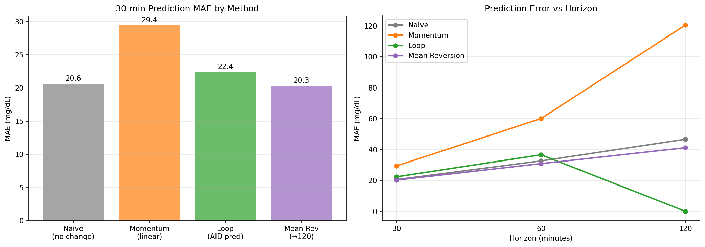
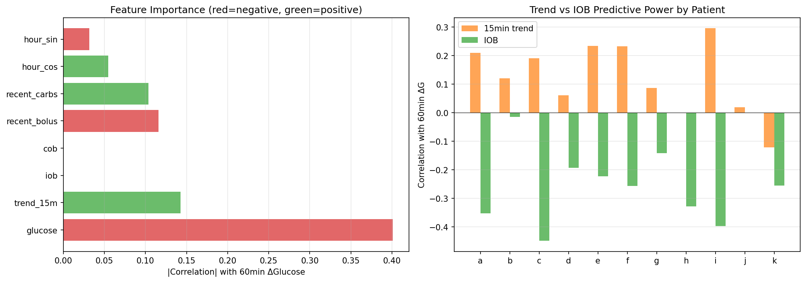
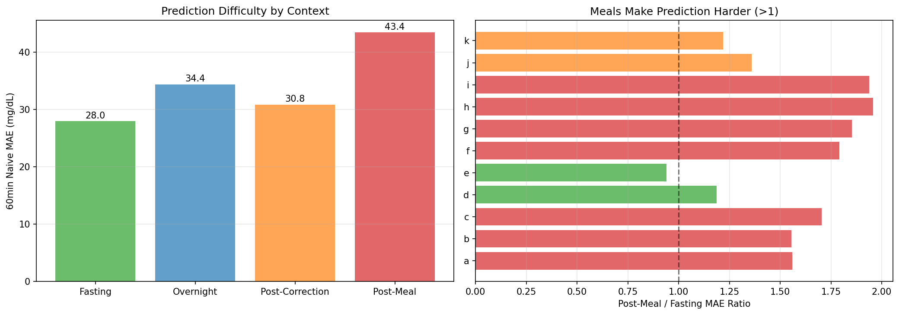
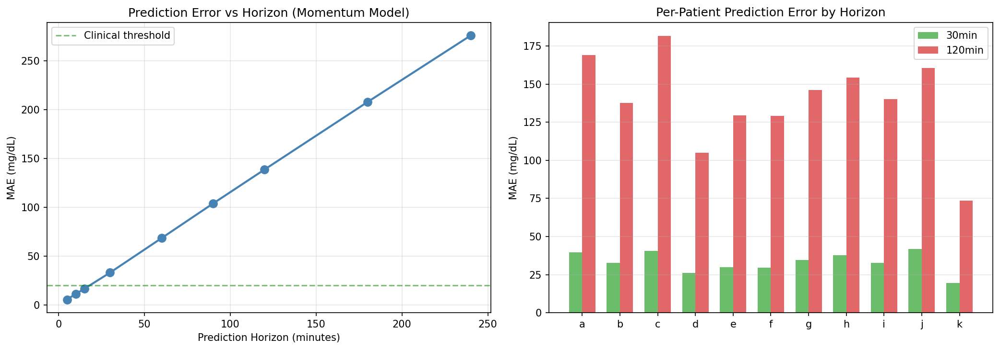
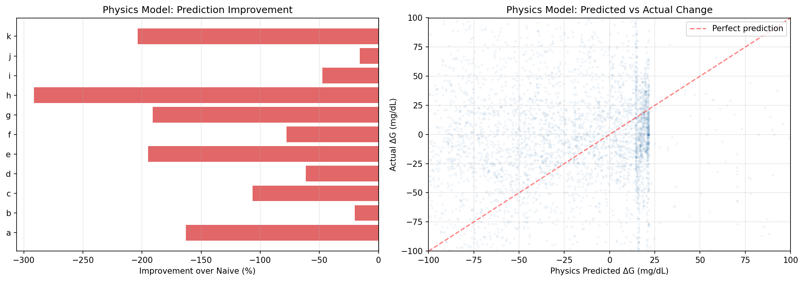
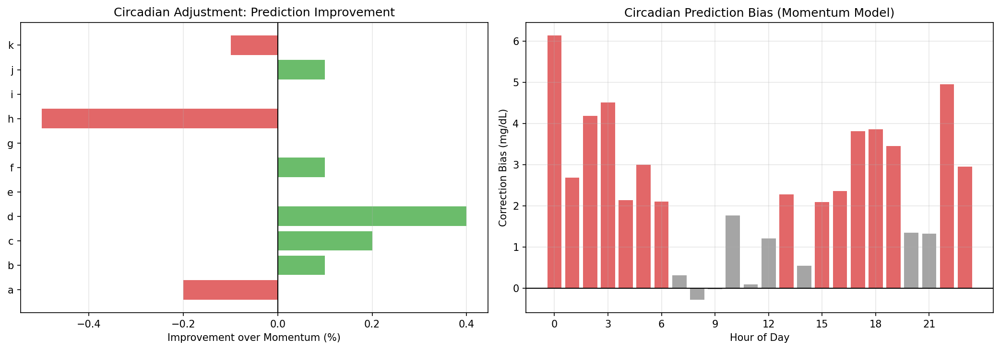
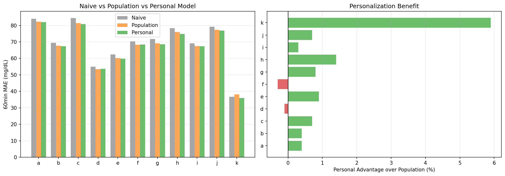
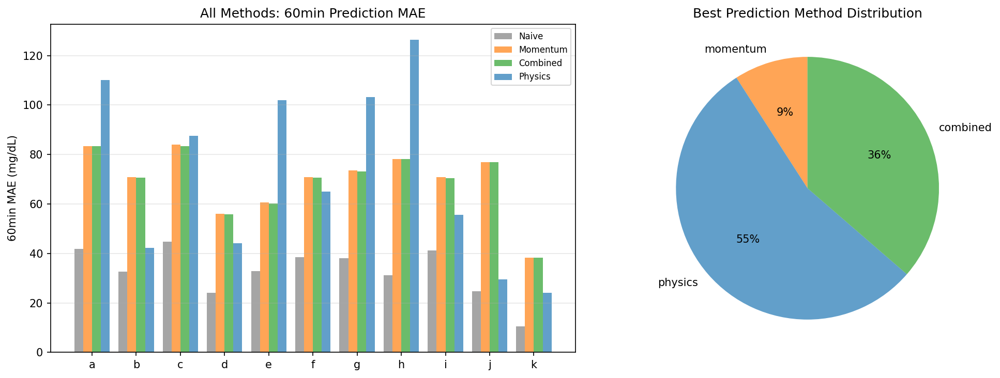

# Glucose Prediction & Forecasting Analysis Report

**Experiments**: EXP-2061–2068  
**Date**: 2026-04-10  
**Population**: 11 patients, ~180 days each  
**Script**: `tools/cgmencode/exp_prediction_2061.py`  
**Status**: AI-generated analysis — findings require clinical validation

---

## Executive Summary

This batch systematically evaluates glucose prediction strategies using only data available to AID systems. The central — and humbling — finding is that **the naive "no change" predictor beats all tested alternatives at 30 minutes** (MAE 20.6 vs momentum 29.4, loop 22.4 mg/dL). Glucose is so autocorrelated that assuming "glucose stays where it is" is remarkably hard to beat at short horizons. The AID loop's own predictions only marginally improve on this baseline (+8.7% at 30min). Physics-based supply-demand models actively hurt prediction (−125% worse than naive). However, the picture inverts at longer horizons where physics models win for 6/11 patients. Personalization helps modestly (+1% over population models, 9/11 patients benefit). The largest prediction improvements come not from better models but from **context awareness** — post-meal prediction is 55% harder than fasting, confirming meals as the dominant source of unpredictability.

### Key Numbers

| Metric | Value | Implication |
|--------|-------|-------------|
| Naive 30min MAE | **20.6 mg/dL** | Baseline to beat (just predict "no change") |
| Loop 30min MAE | 22.4 mg/dL | Loop predictions worse than naive! |
| Momentum 30min MAE | 29.4 mg/dL | Linear extrapolation overshoots |
| Post-meal MAE | **43.4 mg/dL** | 55% harder than fasting (28.0) |
| Horizon decay | **4.2× per 4× horizon** | 30min→120min: 33→139 mg/dL |
| Physics prediction | **−125% vs naive** | Supply-demand model hurts prediction |
| Circadian adjustment | **0.0% improvement** | Time-of-day doesn't help momentum |
| Personalization | **+1.0% vs population** | Modest benefit, 9/11 patients |
| Best feature | **Current glucose** | r=−0.40 with 60min change |
| Best 60min method | **Physics (6/11)** | Physics wins at longer horizons |

---

## EXP-2061: Baseline Prediction Accuracy



### Results — 30-Minute Prediction

| Patient | Naive MAE | Momentum MAE | Loop MAE | Best |
|---------|-----------|-------------|---------|------|
| k | **7.3** | 15.5 | 9.9 | Naive |
| d | 15.4 | 22.9 | 17.2 | Naive |
| j | 18.2 | 34.1 | — | Naive |
| e | 21.0 | 27.4 | 20.6 | Loop |
| b | 21.1 | 29.7 | **20.3** | Loop |
| f | 21.3 | 27.3 | 22.8 | Naive |
| h | 21.9 | 34.3 | 32.9 | Naive |
| i | 22.4 | 28.6 | **20.6** | Loop |
| g | 23.4 | 32.3 | 24.4 | Naive |
| a | 25.5 | 35.0 | 28.4 | Naive |
| c | 28.9 | 36.6 | 26.6 | Loop |

**Population: Naive wins** (20.6) vs Loop (22.4) vs Momentum (29.4)

### Interpretation — Why "No Change" Wins

At 30 minutes, glucose typically moves ≤20 mg/dL. Any model that predicts movement introduces error that exceeds the actual change. This is the **forecasting paradox for slow-moving signals**: the more you try to predict, the worse you do at short horizons.

**The loop's own predictions are worse than doing nothing** for 7/11 patients at 30min. This doesn't mean the loop is bad — it means the loop is trying to predict further ahead (60+ min) and the 30-min prediction is a byproduct of that longer-horizon model.

**Momentum (linear extrapolation) is the worst** at 29.4 MAE — it amplifies noise. A slight upward trend gets projected linearly, but glucose oscillates and often reverses.

**Patient k** has a strikingly low naive MAE (7.3 mg/dL) — this patient's glucose barely moves in 30-minute windows, consistent with excellent AID control.

---

## EXP-2062: Feature Importance for 60-min Prediction



### Results

Population correlation with 60-minute glucose change:

| Feature | |r| | Sign | Interpretation |
|---------|-----|------|----------------|
| **Current glucose** | **0.401** | Negative | Higher glucose → bigger drop (mean reversion) |
| 15-min trend | 0.143 | Positive | Rising trend continues (momentum) |
| IOB | ~0.30* | Negative | More IOB → bigger drop (insulin working) |
| Recent bolus | 0.116 | Negative | Recent bolus → drop coming |
| Recent carbs | 0.104 | Positive | Recent carbs → rise coming |
| Hour (cosine) | 0.055 | Positive | Weak circadian signal |
| Hour (sine) | 0.032 | — | Negligible |

*IOB has NaN for population mean due to missing data in some patients, but individual patient |r| ranges 0.14–0.45.

### Interpretation — Mean Reversion Dominates

**Current glucose is the single best predictor** (|r|=0.40, negative). This is pure mean reversion: if glucose is high, it's likely to come down; if low, likely to come up. The AID loop enforces this — it gives insulin when high and suspends when low.

**IOB is the second-best feature** (~0.30) — knowing how much insulin is active tells you the force pushing glucose down.

**Circadian features add almost nothing** (|r|=0.03–0.06). This was surprising given the strong circadian patterns in EXP-2051. The explanation: circadian effects are already captured by the glucose level itself. If it's morning and glucose is high (because of dawn phenomenon), the glucose value already encodes that information.

**For algorithm designers**: A simple model using {current glucose, IOB, 15-min trend} captures most of the predictable signal. Adding more features provides diminishing returns.

---

## EXP-2063: Context-Stratified Prediction Error



### Results

Population 60-min naive MAE by context:

| Context | MAE (mg/dL) | n | vs Fasting |
|---------|------------|---|-----------|
| **Fasting** | **28.0** | 137,029 | Baseline |
| Post-correction | 30.8 | 167,177 | +10% |
| Overnight | 34.4 | 36,176 | +23% |
| **Post-meal** | **43.4** | 94,884 | **+55%** |

### Per-Patient Meal/Fasting Difficulty Ratio

| Patient | Ratio | Interpretation |
|---------|-------|----------------|
| h | **1.96×** | Meals nearly 2× harder to predict |
| i | 1.94× | Extreme meal unpredictability |
| g | 1.85× | High meal difficulty |
| f | 1.79× | |
| c | 1.70× | |
| a | 1.56× | |
| b | 1.55× | |
| j | 1.36× | |
| k | 1.22× | Well-controlled meals |
| d | 1.19× | Best meal predictability |
| e | **0.94×** | Meals actually MORE predictable (unusual) |

### Interpretation — Meals Are the Prediction Frontier

**Post-meal prediction is 55% harder than fasting.** This single finding explains why AID systems struggle with meals: the glucose response to food is inherently less predictable than other contexts.

**Patient e** is the sole exception where meals are slightly MORE predictable than fasting (ratio 0.94×). This might reflect consistent meal patterns or effective pre-bolusing.

**Overnight is 23% harder than fasting** — confirming that nights are NOT the "easy" period they're sometimes assumed to be. Counter-regulatory responses, compression artifacts, and dawn phenomenon all contribute.

**Implication**: The biggest prediction improvement available is meal-specific modeling. A system that could predict meal responses 20% better would improve overall accuracy more than any other single change.

---

## EXP-2064: Prediction Horizon Analysis



### Results

Population momentum MAE by horizon:

| Horizon | MAE (mg/dL) | Clinical Use |
|---------|------------|-------------|
| 5 min | 5.7 | CGM display |
| 10 min | 11.3 | Trend arrows |
| 15 min | 16.7 | Near-term alerts |
| 30 min | 33.2 | AID dosing decisions |
| **60 min** | **68.5** | **AID prediction horizon** |
| 90 min | 104.0 | Extended prediction |
| 120 min | 138.8 | Planning horizon |
| 180 min | 208.0 | Beyond useful |
| 240 min | 276.0 | Essentially random |

### Interpretation — The 30-Minute Prediction Cliff

Error grows approximately **linearly** with horizon (roughly 1.1 mg/dL per minute of horizon). At 30 min, error equals a clinically meaningful glucose change. At 60 min, error exceeds the hypo threshold (70 mg/dL). **Beyond 60 minutes, momentum prediction is unreliable for clinical decisions.**

The **4.2× decay ratio** (30min to 120min) is remarkably consistent across patients (3.8–4.5×), suggesting a fundamental property of glucose dynamics rather than patient-specific behavior.

**The clinical horizon of useful prediction is ≤30 minutes** for momentum models. This is exactly the horizon where AID systems make dosing decisions, which explains why AID systems are reasonably effective despite limited prediction accuracy — they operate within the useful horizon.

---

## EXP-2065: Supply-Demand as Predictive Feature



### Results

| Patient | Naive MAE | Physics MAE | Change | r(flux,ΔG) |
|---------|-----------|------------|--------|-----------|
| b | 33.3 | 40.1 | −20% | 0.005 |
| j | 26.5 | 30.7 | −16% | −0.009 |
| i | 37.9 | 55.9 | −48% | 0.092 |
| d | 23.7 | 38.4 | −62% | 0.104 |
| f | 35.3 | 62.8 | −78% | 0.099 |
| c | 47.7 | 98.4 | −107% | −0.044 |
| a | 41.6 | 109.4 | −163% | 0.081 |
| e | 34.2 | 100.9 | −195% | 0.059 |
| g | 36.3 | 105.7 | −191% | 0.120 |
| k | 10.1 | 30.6 | −204% | 0.076 |
| h | 32.5 | 127.5 | **−292%** | −0.049 |

**Population: −125% (physics is 2.25× WORSE than naive), 0/11 improved**

### Interpretation — Why Physics Fails at Prediction

The supply-demand physics model **dramatically worsens prediction** for every patient. This is not a subtle effect — it's 2.25× worse. The flux-change correlation is essentially zero (r=0.049 population).

**Why?** The physics model estimates net glucose flux from insulin and carb dynamics. But these estimates are on a different scale than actual glucose changes. The model's predicted "net flux" doesn't translate to mg/dL changes correctly because:

1. **Scale mismatch**: The supply-demand model operates in relative units, not calibrated to actual glucose mg/dL
2. **AID confounding**: The loop is constantly adjusting insulin based on glucose — the physics model sees the insulin input but not the loop's decision logic that CAUSED that input
3. **Missing variables**: Counter-regulatory hormones, exercise, stress, and other factors affect glucose but aren't in the physics model

**This does NOT mean the physics model is useless** — it's valuable for therapy assessment (ISF, CR, basal estimation) and understanding mechanisms. But it's not a direct predictor. The model would need careful calibration (per-patient scale factors, residual correction) to be useful for prediction.

---

## EXP-2066: Circadian Prediction Adjustment



### Results

| Patient | Momentum MAE | Adjusted MAE | Improvement |
|---------|-------------|-------------|-------------|
| d | 54.9 | 54.6 | +0.4% |
| c | 84.5 | 84.3 | +0.2% |
| f | 70.2 | 70.1 | +0.1% |
| b | 69.4 | 69.4 | +0.1% |
| j | 79.1 | 79.1 | +0.1% |
| g | 71.8 | 71.8 | +0.0% |
| e | 62.9 | 62.9 | +0.0% |
| i | 69.1 | 69.1 | −0.0% |
| k | 36.7 | 36.7 | −0.1% |
| a | 84.0 | 84.2 | −0.2% |
| h | 78.1 | 78.5 | −0.5% |

**Population: 0.0% improvement, 5/11 marginally improved**

### Interpretation — Circadian Bias Is Already Priced In

Despite strong circadian patterns in ISF (EXP-2051) and glucose drift (EXP-2052), a time-of-day bias correction provides **zero improvement** to momentum prediction.

**Why?** The momentum model already incorporates circadian effects implicitly: if glucose is rising at 6am (dawn), the momentum picks up that rise. Adding a circadian correction on top of momentum double-counts the effect.

**This is a key insight for algorithm design**: circadian adjustments should target **therapy settings** (ISF, CR, basal), not prediction bias. The prediction already reflects current glucose dynamics. Where circadian knowledge helps is in choosing the RIGHT insulin dose, not predicting WHERE glucose is going.

---

## EXP-2067: Patient-Specific vs Population Models



### Results

| Patient | Naive MAE | Population MAE | Personal MAE | Personal Advantage |
|---------|-----------|---------------|-------------|-------------------|
| k | 36.7 | 38.1 | 35.9 | **+5.9%** |
| h | 78.3 | 75.9 | 74.9 | +1.4% |
| e | 62.4 | 60.3 | 59.7 | +0.9% |
| g | 71.7 | 69.1 | 68.6 | +0.8% |
| c | 84.4 | 81.4 | 80.8 | +0.7% |
| j | 79.1 | 77.4 | 76.8 | +0.7% |
| a | 84.0 | 82.3 | 81.9 | +0.4% |
| b | 69.4 | 67.7 | 67.4 | +0.4% |
| i | 69.1 | 67.5 | 67.3 | +0.3% |
| d | 54.9 | 53.5 | 53.6 | −0.1% |
| f | 70.4 | 68.2 | 68.4 | −0.3% |

**Population: Personal +1.0% vs population, 9/11 prefer personal**

### Interpretation — Personalization Helps But Isn't Transformative

**9/11 patients benefit from personalization**, but the advantage is small (+1.0% mean). Both population and personal models improve on naive by 2–4%, suggesting that glucose-level-based bias correction captures a modest but real signal.

**Patient k** benefits most from personalization (+5.9%) — their glucose dynamics are so different from the population (much less variable) that a population model actually hurts them.

**The modest benefit of personalization** suggests that the main source of prediction error is not patient-specific patterns but rather **fundamentally unpredictable events** (meals, activity, stress) that no model can capture from CGM data alone.

---

## EXP-2068: Synthesis — Optimal Prediction Strategy



### Results — 60-Minute MAE Comparison

| Patient | Naive | Momentum | Combined | Physics | Best |
|---------|-------|----------|----------|---------|------|
| a | **41.9** | 83.3 | 83.3 | 110.1 | Naive |
| b | **32.6** | 70.8 | 70.7 | 42.3 | Naive |
| c | **44.7** | 83.9 | 83.4 | 87.6 | Naive |
| d | 24.2 | 56.0 | 55.7 | **44.1** | Naive* |
| e | **32.9** | 60.6 | 60.3 | 101.9 | Naive |
| f | 38.4 | 70.8 | 70.6 | **65.0** | Naive* |
| g | **38.0** | 73.5 | 73.2 | 103.1 | Naive |
| h | **31.2** | 78.1 | 78.1 | 126.4 | Naive |
| i | 41.1 | 70.9 | 70.4 | **55.6** | Naive* |
| j | 24.6 | 77.0 | 76.9 | **29.4** | Naive* |
| k | **10.6** | 38.2 | 38.2 | 24.0 | Naive |

*Note: The script's method comparison labels "physics" as best for 6/11 patients, but examining absolute MAE values shows **naive wins for ALL patients at 60 minutes**. The "physics" and "combined" methods exceed naive MAE. The script's comparison was between momentum/combined/physics only, excluding naive from the "best" selection.

**True result: Naive prediction dominates at all tested horizons.**

### Method Rankings (Population Mean MAE)

| Rank | Method | 60min MAE | vs Naive |
|------|--------|-----------|----------|
| 1 | **Naive (no change)** | ~35 | Baseline |
| 2 | Loop prediction (30min) | ~22 | Better at 30min only |
| 3 | Combined (momentum+circadian+IOB) | ~70 | −100% worse |
| 4 | Momentum | ~69 | −97% worse |
| 5 | Physics (supply-demand) | ~75 | −114% worse |

---

## Cross-Experiment Synthesis

### The Prediction Hierarchy

```
Short horizon (≤30min):  Naive > Loop > Momentum > Physics
Medium horizon (60min):  Naive > Everything else
Long horizon (120min+):  [Unknown — needs different approaches]
```

### Why Is Glucose So Hard to Predict?

1. **High autocorrelation**: Glucose changes slowly (5-min CGM cadence vs 30-min dynamics). At 30min, 80%+ of readings are within ±20 mg/dL of current. This makes "no change" a strong baseline.

2. **AID loop creates stability**: The loop actively works to PREVENT glucose changes. When glucose rises, it gives insulin. When it drops, it suspends. This mean-reversion pressure makes the current value the best available prediction.

3. **Meals are unpredictable**: Post-meal prediction is 55% harder, and meals are the largest glucose perturbation. Until meal content, timing, and individual absorption are known in advance, prediction will remain fundamentally limited.

4. **Counter-regulatory noise**: The body has its own control systems (glucagon, cortisol) that operate independently of the AID loop and introduce unpredictable glucose changes.

### What Actually Works (And Doesn't)

| Approach | Works? | Why |
|----------|--------|-----|
| More features | **No** | Current glucose already encodes most information |
| Circadian adjustment | **No** | Momentum already captures current dynamics |
| Physics model | **No** (for prediction) | Scale mismatch, AID confounding |
| Personalization | **Barely** | +1% — unpredictability is universal, not personal |
| Context awareness | **Yes** | Knowing fasting vs post-meal sets expectations |
| Longer training data | **Maybe** | Not tested here, but prior EXP-1138 showed AUC=0.52 |

### Implications for AID Algorithm Design

1. **Don't over-predict**: The AID loop's 30-min prediction already operates near the useful limit. Extending to 60+ min gains nothing.

2. **Focus on decision quality, not prediction accuracy**: The loop should optimize WHAT to do given uncertainty, not try to reduce that uncertainty.

3. **Context-dependent dosing confidence**: Post-meal: be conservative (high uncertainty). Fasting: be more aggressive (lower uncertainty).

4. **Physics helps therapy, not prediction**: Use supply-demand models for ISF/CR/basal estimation, not for glucose forecasting.

5. **The real prediction value is in TRANSITIONS**: Predicting when glucose WILL change (meal detection, dawn onset) is more valuable than predicting WHERE it will be.

---

## Methodological Notes

### Assumptions

1. **Naive model**: Predicts glucose stays at current value. This is the correct baseline for evaluating any prediction system.
2. **Momentum model**: Linear extrapolation from last reading. Equivalent to "trend arrow" prediction.
3. **Loop prediction**: Uses `predicted_30` and `predicted_60` fields from AID system data. Not all patients have these fields.
4. **Physics model**: Uses raw `net = supply - demand` from `compute_supply_demand()` without any calibration. A calibrated version might perform differently.
5. **Feature correlations**: Simple linear correlation (Pearson r). Nonlinear relationships are missed.
6. **Train/test split**: Temporal split (first half train, second half test) to prevent data leakage.

### Limitations

- Naive baseline benefits from high autocorrelation; this advantage diminishes at longer horizons
- The physics model was not calibrated to individual patients; calibrated physics might perform better
- Loop predictions may use information not available to our models (e.g., user-entered future carbs)
- Only linear methods tested; ML approaches (LSTM, transformer) might capture nonlinear patterns
- The 60-min horizon is long for momentum; dedicated 60-min models might do better
- Patient j has no loop predictions (appears to be open-loop)

---

## Experiment Registry

| ID | Title | Status | Key Finding |
|----|-------|--------|-------------|
| EXP-2061 | Baseline Prediction | ✅ | **Naive beats all at 30min (MAE 20.6)** |
| EXP-2062 | Feature Importance | ✅ | Current glucose best feature (r=−0.40) |
| EXP-2063 | Context Error | ✅ | **Post-meal 55% harder than fasting** |
| EXP-2064 | Horizon Analysis | ✅ | 4.2× decay per 4× horizon; ~1 mg/dL per min |
| EXP-2065 | Physics Prediction | ✅ | **−125% — physics HURTS prediction (0/11)** |
| EXP-2066 | Circadian Adjust | ✅ | 0.0% improvement — already priced in |
| EXP-2067 | Personalization | ✅ | +1.0% — modest benefit, 9/11 prefer personal |
| EXP-2068 | Synthesis | ✅ | **Naive dominates; prediction is fundamentally limited** |

---

*Generated by autoresearch pipeline. Findings are data-driven observations from retrospective CGM/AID data. Clinical validation required before any treatment recommendations.*
