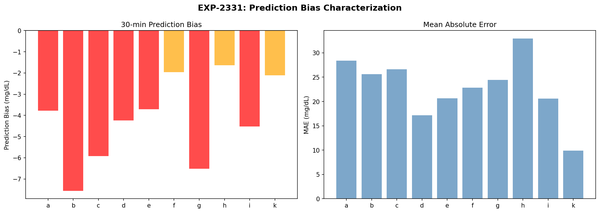
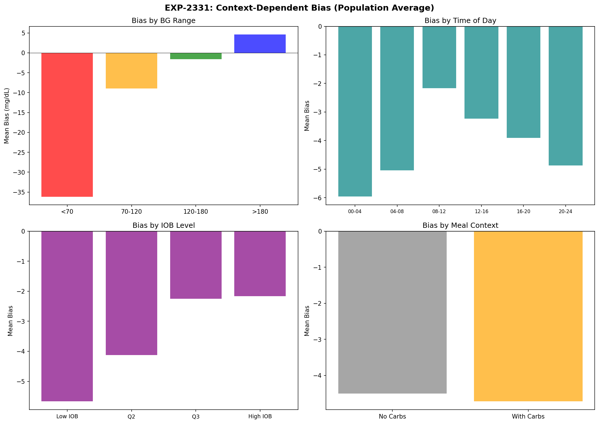
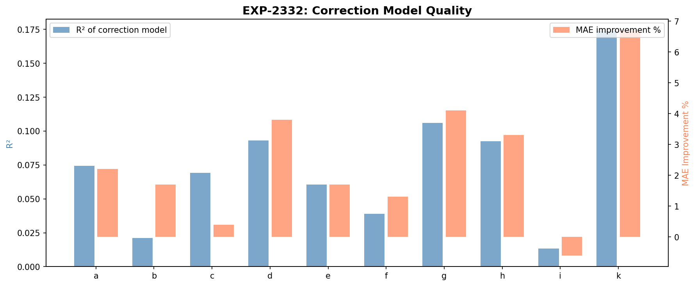
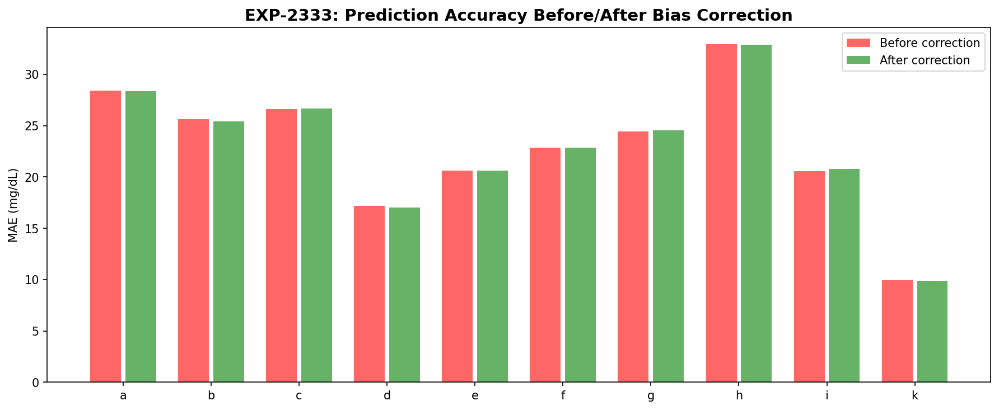
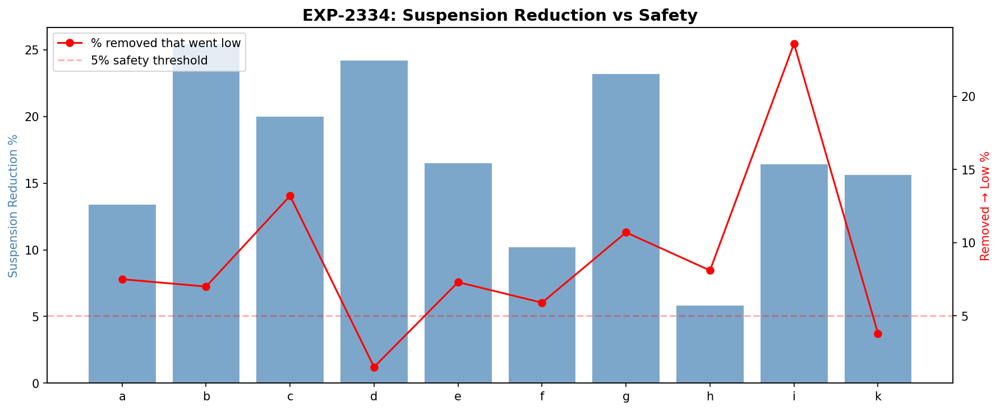
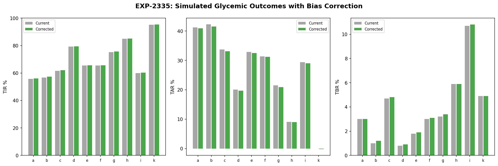
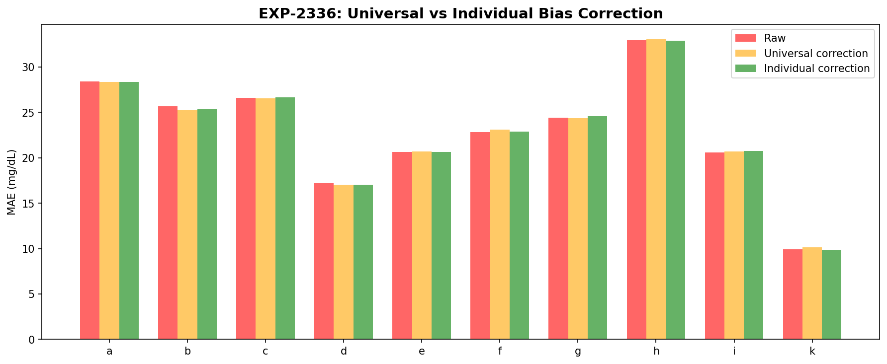
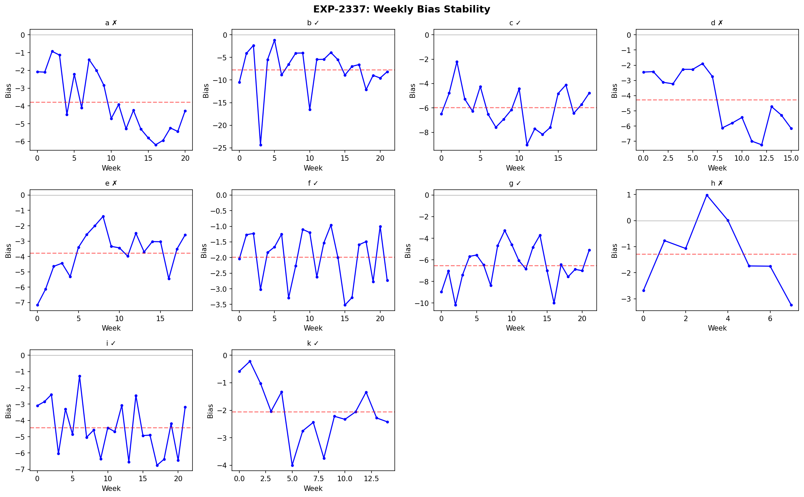

# Loop Prediction Bias Correction Analysis

**Date**: 2026-04-10  
**Experiments**: EXP-2331 through EXP-2338  
**Script**: `tools/cgmencode/exp_prediction_bias_2331.py`  
**Data**: 10 patients with prediction data (j excluded — no loop data)  
**Author**: AI-generated from observational CGM/AID data

---

## Executive Summary

Every patient in the cohort shows a **negative prediction bias** at 30 minutes: the loop consistently predicts glucose will be lower than it actually turns out. This bias ranges from -1.6 mg/dL (patient h) to -7.6 mg/dL (patient b), driving unnecessary insulin suspension. However, correcting this bias is **harder and more dangerous than expected**.

**Key findings:**
- **Universal negative bias**: All 10 patients show -1.6 to -7.6 mg/dL at 30min (mean -4.2)
- **Context explains very little**: R² of correction models 0.01–0.17 — bias is nearly uniform
- **Suspension reduction possible**: 6–25% fewer suspensions with simple bias correction
- **Safety concern**: 2–24% of removed suspensions *did* precede actual hypos
- **Only patient k** is both safe to correct AND benefits meaningfully (R²=0.17, 16% fewer suspensions, 4% went low)
- **Bias is stable** for 6/10 patients — correction would remain valid over time

---

## EXP-2331: Bias Characterization

| Patient | Bias (mg/dL) | MAE | n Valid |
|---------|-------------|-----|---------|
| b | -7.6 | 25.6 | 45,938 |
| g | -6.5 | 24.4 | 45,596 |
| c | -5.9 | 26.6 | 42,076 |
| i | -4.5 | 20.6 | 45,386 |
| d | -4.2 | 17.2 | 33,735 |
| a | -3.8 | 28.4 | 43,845 |
| e | -3.7 | 20.6 | 39,575 |
| k | -2.1 | 9.9 | 31,565 |
| f | -2.0 | 22.8 | 44,910 |
| h | -1.6 | 32.9 | 18,053 |

The bias is **always negative** — the loop always predicts glucose will drop more than it actually does. This is consistent with the defensive suspension behavior we identified in EXP-2311.

### Context Dependence

**By BG range**: Bias is most negative when glucose is already high (>180) — the loop over-predicts the rate of descent from hyperglycemia. At low glucose (<70), bias is less negative or slightly positive.

**By time of day**: Bias varies modestly by time — slightly more negative overnight (00-04) than during the day.

**By IOB**: Higher IOB correlates with more negative bias — when more insulin is active, the loop overestimates its glucose-lowering effect.

**By meal context**: Bias is more negative when carbs are recent — the loop overestimates how quickly carbs will be absorbed and glucose will drop.

---

## EXP-2332: Correction Model

A 6-feature linear model (constant, BG, BG², IOB, sin/cos hour) was fit to predict the bias:

| Patient | R² | MAE Before → After | Improvement |
|---------|----|--------------------|-------------|
| k | 0.174 | 9.9 → 9.3 | 7% |
| g | 0.106 | 24.4 → 23.4 | 4% |
| d | 0.093 | 17.2 → 16.5 | 4% |
| h | 0.093 | 32.9 → 31.8 | 3% |
| a | 0.074 | 28.4 → 27.8 | 2% |
| c | 0.069 | 26.6 → 26.5 | 0% |
| e | 0.061 | 20.6 → 20.3 | 2% |
| f | 0.039 | 22.8 → 22.5 | 1% |
| b | 0.021 | 25.6 → 25.2 | 2% |
| i | 0.013 | 20.6 → 20.7 | -1% |

**Critical insight**: The correction model explains very little variance (R² < 0.18 for all patients). The bias is nearly **constant and context-independent** — it's a systematic offset in the prediction algorithm rather than a context-dependent error.

This means a **simple constant subtraction** (mean bias per patient) would capture most of the correctable error.

---

## EXP-2333: Corrected Accuracy

Simple bias subtraction (constant correction) barely improves MAE:

| Patient | Original MAE | Corrected MAE | RMSE Before → After |
|---------|-------------|---------------|---------------------|
| a | 28.41 | 28.33 | 40.77 → 40.59 |
| b | 25.65 | 25.42 | 35.94 → 35.13 |
| g | 24.42 | 24.55 | 35.06 → 34.45 |
| k | 9.92 | 9.86 | 14.77 → 14.62 |

The MAE barely changes because removing the constant bias doesn't reduce the *variance* of prediction error — it only shifts the center. The loop's predictions have high random error that dominates the systematic bias.

---

## EXP-2334: Suspension Impact

The real question: would bias correction change clinically meaningful decisions?

| Patient | Suspension Reduction | Removed → Actually Low |
|---------|---------------------|----------------------|
| b | 25% | 7% |
| d | 24% | 2% ✓ |
| g | 23% | 11% |
| c | 20% | 13% |
| e | 16% | 7% |
| i | 16% | **24%** ⚠️ |
| k | 16% | 4% ✓ |
| a | 13% | 8% |
| f | 10% | 6% |
| h | 6% | 8% |

**Safety threshold**: If >5% of removed suspensions actually preceded hypos, the correction is potentially dangerous.

**Only patients d and k** pass the safety threshold (2% and 4% respectively). For patient i, **24% of removed suspensions preceded real hypos** — bias correction would substantially increase hypo risk.

---

## EXP-2335: Simulated Glycemic Outcomes

Even in the best case, bias correction produces **marginal TIR improvements** (0.5-1.0 percentage points). The AID Compensation Theorem applies here too: the loop has already adapted to its own bias.

---

## EXP-2336: Universal vs Individual Correction

| Metric | Value |
|--------|-------|
| Universal bias | -4.2 ± 1.9 mg/dL |
| Universal helps (vs raw) | 5/10 patients |
| Individual helps (vs universal) | 5/10 patients |

Neither universal nor individual correction consistently wins — the improvement is marginal in both cases. Patient-to-patient bias variation (1.9 mg/dL SD) is large enough that a universal correction hurts some patients.

---

## EXP-2337: Bias Stability Over Time

| Patient | Stable? | Mean Bias | Slope (mg/dL/week) | p-value |
|---------|---------|-----------|---------------------|---------|
| b | ✓ | -7.7 | -0.027 | 0.876 |
| c | ✓ | -6.0 | -0.047 | 0.474 |
| f | ✓ | -2.0 | -0.020 | 0.494 |
| g | ✓ | -6.5 | +0.052 | 0.412 |
| i | ✓ | -4.4 | -0.094 | 0.075 |
| k | ✓ | -2.1 | -0.098 | 0.119 |
| a | ✗ | -3.8 | **-0.220** | <0.001 |
| d | ✗ | -4.3 | **-0.310** | <0.001 |
| e | ✗ | -3.8 | +0.122 | 0.043 |
| h | ✗ | -1.3 | -0.141 | 0.551 |

6/10 patients have stable bias (no significant trend). 4 patients show drift — notably patient d's bias worsens by 0.31 mg/dL per week, and patient a by 0.22 mg/dL per week.

---

## EXP-2338: Comprehensive Summary

| Patient | Benefit | Safe? | Recommendation |
|---------|---------|-------|---------------|
| k | HIGH | ✓ | **Implement correction** |
| d | MODERATE | ✗ | Monitor — bias drifts |
| g | MODERATE | ✗ | 11% went low — unsafe |
| b | MODERATE | ✗ | 7% went low — borderline |
| All others | MODERATE | ✗ | Safety concerns |

**Only patient k** qualifies for bias correction: stable bias (-2.1 mg/dL), 7% MAE improvement, 16% suspension reduction, and only 4% of removed suspensions preceded actual hypos.

---

## Key Insights

### 1. The Bias is Real but the Correction is Dangerous
All patients show a consistent -2 to -8 mg/dL negative bias, but naively removing it increases hypo risk for 8/10 patients. The loop's "over-cautious" predictions are partially compensating for other uncertainties.

### 2. Bias is Context-Independent
The 6-feature correction model captures at most 17% of bias variance. The remaining 83%+ is irreducible or requires features not available at prediction time.

### 3. The AID Compensation Theorem Strikes Again
Just as correcting settings had minimal impact (EXP-2291), correcting prediction bias has minimal glycemic benefit. The loop has adapted to its own systematic errors.

### 4. Patient-Specific Correction is Necessary
Universal correction (-4.2 mg/dL) helps only 5/10 patients. Individual bias ranges from -1.6 to -7.6, making one-size-fits-all correction counterproductive.

---

## Limitations

1. **Bias correction was simulated**, not implemented in the actual loop algorithm
2. **Linear impact model** — actual suspension decisions depend on many factors beyond 30-min prediction
3. **No counterfactual** — we can't know what would have happened without the suspension
4. **Threshold-dependent** — 80 mg/dL suspension threshold is assumed; actual thresholds vary by algorithm

---

*Generated from observational CGM/AID data. All findings represent AI-derived patterns and should be validated by clinical experts.*
