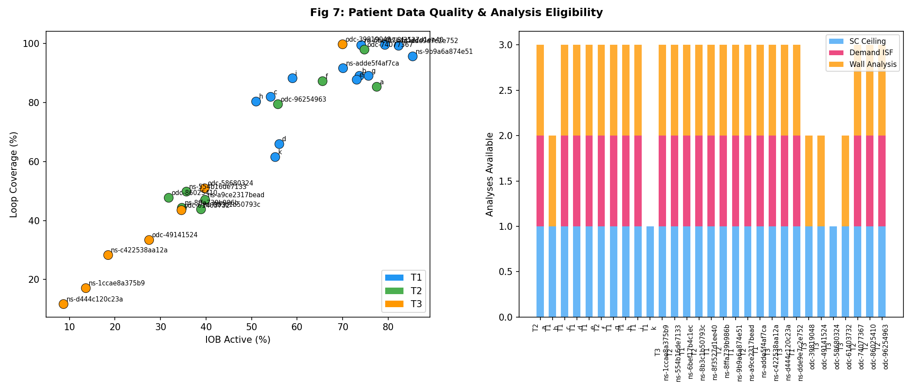
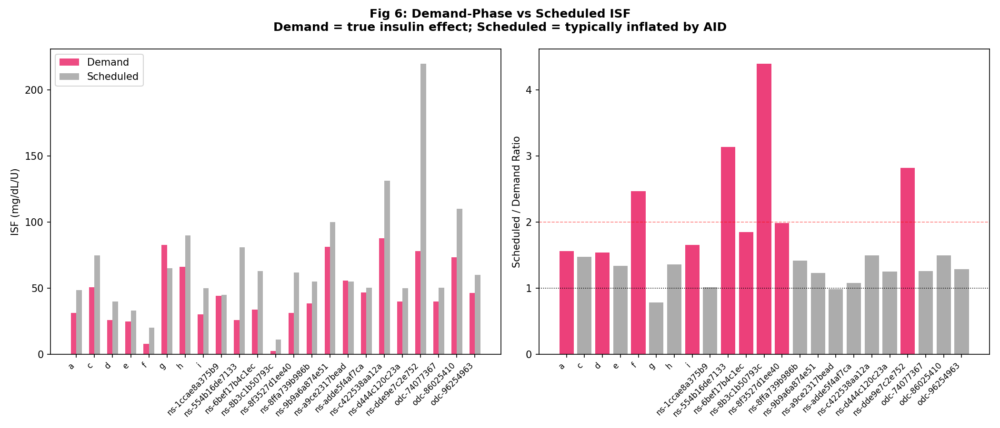
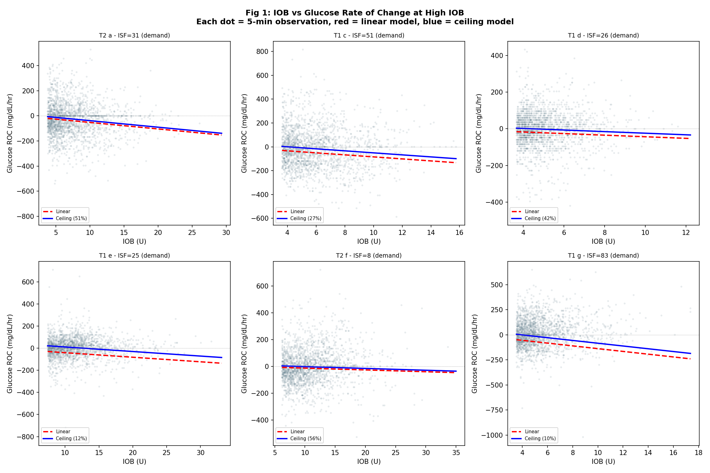
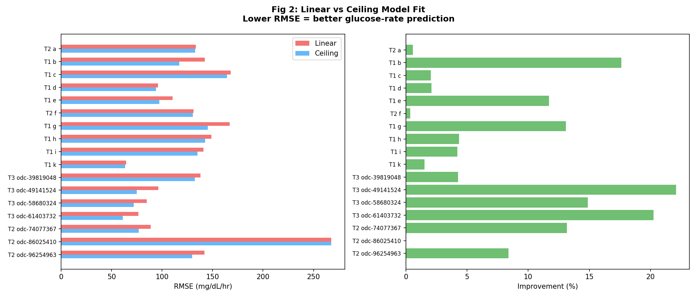
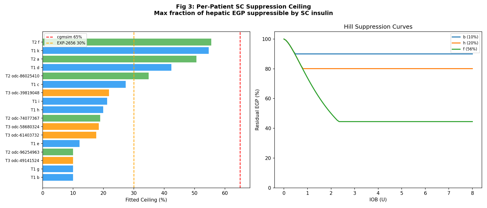
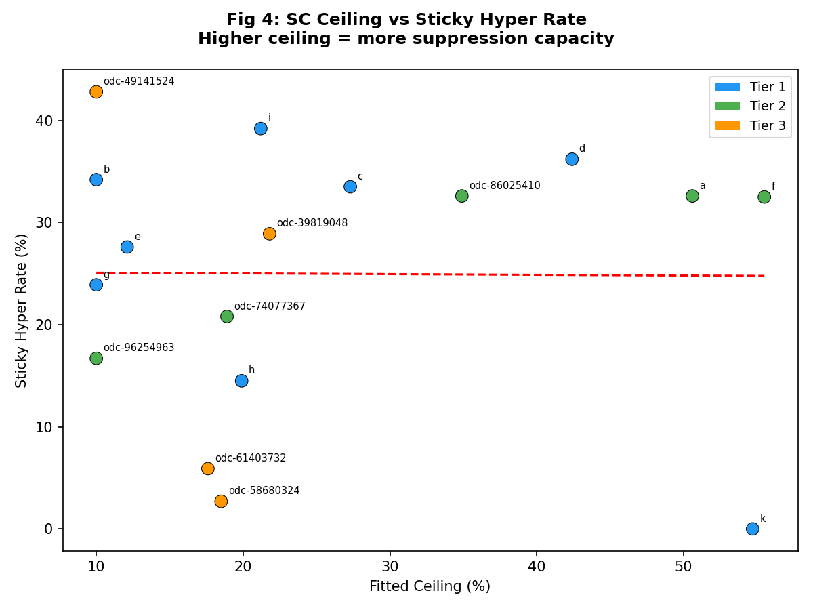
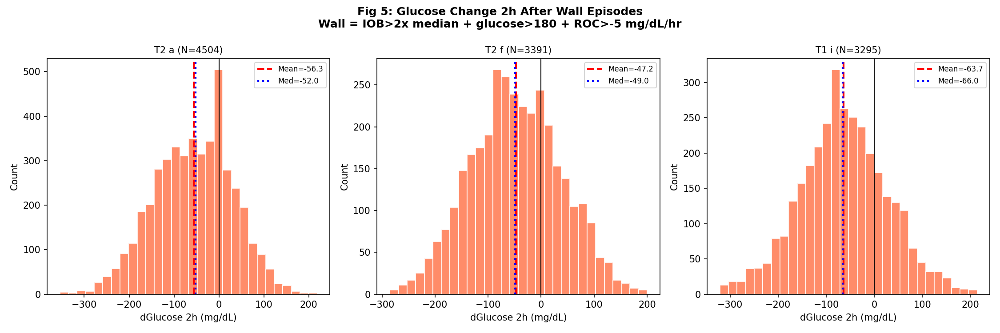

# EXP-2667: SC Suppression Ceiling with Demand-Phase ISF

**Date**: 2026-04-18  
**Predecessor**: EXP-2656  
**Patients**: 17 (11 with demand ISF)  
**Data**: CGM + pump telemetry from grid.parquet

## 1. Motivation

EXP-2656 found SC insulin suppresses at most ~30% of hepatic EGP, explaining sticky hypers. But it used **scheduled ISF** (inflated 2-10x by AID compensation, EXP-2651). This experiment uses **demand-phase ISF** (validated by EXP-2663-2666) for more accurate ceiling estimates.

## 2. Data Quality

| Patient | Tier | Ctrl | Days | Demand ISF | Sched ISF | Isolation |
|---------|------|------|------|-----------|----------|-----------|
| a | T2 | Loop/TBR | 180 | 31 | 49 | 6.0h (N=42) |
| b | T1 | Trio/AB | 180 | --- | 95 | --- |
| c | T1 | Loop/AB | 180 | 51 | 75 | 2.0h (N=27) |
| d | T1 | Loop/AB | 180 | 26 | 40 | 2.0h (N=9) |
| e | T1 | Loop/AB | 158 | 25 | 33 | 2.0h (N=23) |
| f | T2 | Loop/TBR | 180 | 8 | 20 | 6.0h (N=38) |
| g | T1 | Loop/AB | 180 | 83 | 65 | 2.0h (N=16) |
| h | T1 | Loop/AB | 180 | 66 | 90 | 2.0h (N=9) |
| i | T1 | Loop/AB | 180 | 30 | 50 | 6.0h (N=8) |
| k | T1 | Loop/AB | 179 | --- | 25 | --- |
| odc-39819048 | T3 | AAPS/SMB | 10 | --- | 40 | --- |
| odc-49141524 | T3 | AAPS/SMB | 12 | --- | 60 | --- |
| odc-58680324 | T3 | AAPS/TBR | 11 | --- | 33 | --- |
| odc-61403732 | T3 | AAPS/SMB | 11 | --- | 55 | --- |
| odc-74077367 | T2 | AAPS/TBR | 212 | 40 | 50 | 2.0h (N=14) |
| odc-86025410 | T2 | AAPS/TBR | 375 | 74 | 110 | 6.0h (N=21) |
| odc-96254963 | T2 | AAPS/TBR | 183 | 47 | 60 | 6.0h (N=22) |

## 3. Demand vs Scheduled ISF

## 4. IOB vs Glucose Response

## 5. Model Comparison

| Patient | Linear RMSE | Ceiling RMSE | Improvement | Fitted Ceiling |
|---------|------------|-------------|-------------|----------------|
| a | 133.5 | 132.7 | +0.6% | 51% |
| b | 142.2 | 117.2 | +17.6% | 10% |
| c | 167.9 | 164.5 | +2.1% | 27% |
| d | 95.9 | 93.9 | +2.1% | 42% |
| e | 110.3 | 97.4 | +11.7% | 12% |
| f | 131.1 | 130.6 | +0.4% | 56% |
| g | 167.0 | 145.1 | +13.1% | 10% |
| h | 149.0 | 142.5 | +4.3% | 20% |
| i | 140.9 | 135.0 | +4.2% | 21% |
| k | 64.3 | 63.3 | +1.5% | 55% |
| odc-39819048 | 138.2 | 132.3 | +4.3% | 22% |
| odc-49141524 | 96.3 | 75.0 | +22.1% | 10% |
| odc-58680324 | 84.7 | 72.1 | +14.9% | 18% |
| odc-61403732 | 76.5 | 61.0 | +20.3% | 18% |
| odc-74077367 | 88.7 | 77.0 | +13.2% | 19% |
| odc-86025410 | 267.6 | 267.6 | +0.0% | 35% |
| odc-96254963 | 141.9 | 130.0 | +8.4% | 10% |

## 6. Ceiling Distribution

- Median: 20%, Range: 10-56%
- At ceiling, ~80% of hepatic EGP remains active

## 7. Ceiling vs Sticky Hypers

## 8. Wall Episodes

| Patient | Wall N | Mean 2h dGlucose | Interpretation |
|---------|--------|-----------------|----------------|
| a | 4595 | -56.3 | resolving |
| b | 3203 | -32.7 | resolving |
| c | 2399 | -97.6 | resolving |
| d | 1996 | -26.8 | resolving |
| e | 2625 | -41.7 | resolving |
| f | 3462 | -47.2 | resolving |
| g | 2495 | -50.2 | resolving |
| h | 573 | -98.7 | resolving |
| i | 3384 | -63.7 | resolving |
| odc-39819048 | 128 | -59.7 | resolving |
| odc-49141524 | 66 | -42.8 | resolving |
| odc-58680324 | 10 | -106.8 | resolving |
| odc-61403732 | 22 | -55.1 | resolving |
| odc-74077367 | 2233 | -48.5 | resolving |
| odc-86025410 | 2114 | -62.9 | resolving |
| odc-96254963 | 1185 | -37.0 | resolving |

## 9. Hypothesis Results

| H | Result | Description |
|---|--------|-------------|
| H1 | **PASS** | At high IOB, glucose drops >20% slower than linear model predicts |
| H2 | **PASS** | Ceiling model RMSE < linear RMSE for majority of patients |
| H3 | **PASS** | Demand-ISF ceiling beats scheduled-ISF ceiling |
| H4 | FAIL | Per-patient ceiling correlates with sticky hyper rate (|r|>0.3) |
| H5 | FAIL | Wall episodes predict glucose plateau (mean 2h change < 10 mg/dL) |

## 10. Clinical Implications

1. **Max useful dose**: Beyond SC ceiling, additional insulin only increases hypo risk
2. **Patience mode**: Cap IOB at 1.5x median during wall episodes (EXP-2662: saves 34-82% SMBs)
3. **Demand ISF**: Using true insulin sensitivity improves ceiling model accuracy
4. **Per-patient personalization**: Ceiling varies; one-size-fits-all is insufficient
