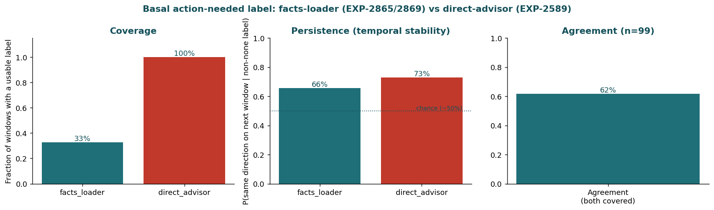
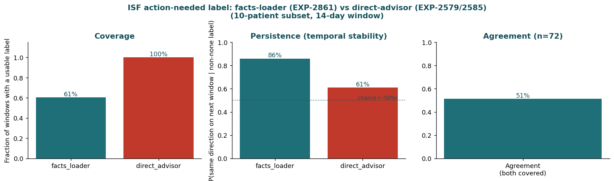
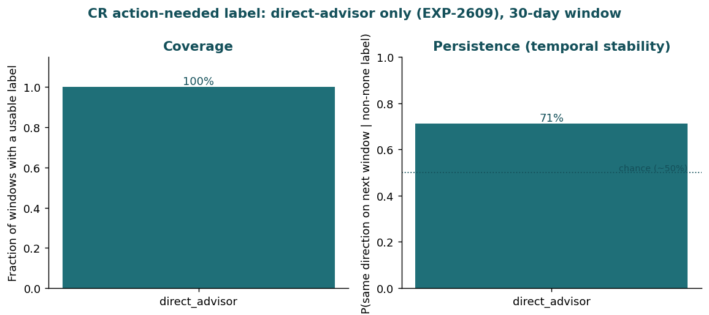

# State-Aware Agent Harnesses: Parallels and Opportunities (2026-07-01)

**Source**: [How Candidly built state-aware agent harnesses with LangSmith](https://www.langchain.com/blog/how-candidly-built-state-aware-agent-harnesses-with-langsmith) (LangChain blog, guest post by Candidly).

**Scope**: Assess parallels between Candidly's IO-HMM/state-aware harness architecture and our own research/decision-support tooling (`tools/cgmencode`, MLflow tracking, `autoresearch_agent.py`, `clinical_decision_policy.py`), and identify concrete, adapted opportunities.

**Status update (2026-07-01, later)**: Sections 1-5 below are the original parallel analysis. Section 6 records a scope refinement made through follow-up discussion, and the first concrete build (`therapy_trajectory_state.py`) that came out of it. The refinement changes the primary target from the autoresearch-session angle (§3.1) to per-patient therapy trajectories — see §6 for why, and for what was actually built.

---

## 1. What Candidly Built (Recap)

Candidly's AI financial planner ("Cait") was originally evaluated only *ex post*: did the conversation resolve or get abandoned? They moved from that end-of-conversation grade to a **turn-level state estimate** the agent can act on mid-conversation:

1. Built a hybrid (rules + LLM-judge) pipeline to label conversation outcomes, tracked in LangSmith, calibrated to 92.3% agreement with humans.
2. Trained a classifier on lightweight per-turn features (Q/A alignment, topic continuity, message length, caps ratio) that separated resolved vs abandoned conversations at 0.90 AUC — proving the outcome is *learnable from the trace*.
3. Fit an **Input-Output Hidden Markov Model (IO-HMM)** over thousands of conversations, with a key architectural choice: **user-side signals are emissions** (used to infer state) and **agent-side features are transition inputs** (the levers the system controls). This recovered 4 interpretable engagement states (Engaged, Detailed, Guided, Disengaging) with very different resolution rates (~78% down to ~30%).
4. Showed that the *same* agent behavior helps in one state and hurts in another — a finding invisible in a pooled/average effect.
5. Wired the state model into the harness: state inferred every turn, a **versioned policy** per state (prompt/tool change) recorded in LangSmith, **offline replay verification** before shipping, and **randomized assignment** between existing behavior and the new policy to get exogenous variation, since responses aren't otherwise randomly assigned.
6. Argued the same recipe generalizes to any multi-turn agent with (a) an outcome only observed at the end, (b) turn-level signals computable from the trace, and (c) agent-controlled behaviors — explicitly citing coding agents and sub-agent orchestrators (e.g., "tests failing in new ways vs the same way every time," "edits circling the same files") as places a latent-state read could trigger re-planning instead of blindly continuing.

The throughline: **evaluation becomes a control signal, not just a grade** — it has to be readable *before* the outcome is realized.

---

## 2. Where We Already Have the Same Ingredients

We don't have a live conversational agent, but we have two structurally similar systems with the same three ingredients Candidly names (delayed outcome, in-trace turn-level signals, controllable behavior):

| System | Delayed outcome | Turn-level trace signals (analog of "emissions") | Controllable behavior (analog of "transition inputs") |
|---|---|---|---|
| `autoresearch_agent.py` research sessions | Whether a research direction becomes a promoted, validated candidate (weeks/many plans later) | Per-plan `evidence_coverage`, `retrieval_diversity`, `counter_causal_count`, `readiness_score` (`autoresearch_agent.py:2055` `evaluate_research_plan`) | Which direction/command is prioritized next (`_prioritize_command`, `autoresearch_agent.py:1667`) |
| `ClinicalDecisionPolicy` recommendation cards | Realized 2-week TIR/hypo-hyper shift after a settings change (`clinical_decision_report.py`) | Per-patient phenotype/controller signals (`patient_phenotyper.py`, `controller_dynamics_facts_loader.py`), confidence/effect-size gates (`clinical_decision_policy.py:115` `passes_change_gate`) | Which domain (basal/ISF/CR) is changed, titration clamp, deconfounded-credit toggles (`clinical_decision_policy.py:184` `credited_confidence`) |

Both already do a *version* of Candidly's emission/transition-input separation, just framed causally rather than as an HMM: `deconfounding.py` and `clinical_rules.py:28` explicitly separate **patient-side physiological signal** from **controller-side masking behavior** (Loop/AAPS/Trio dampening apparent effect). That is the same conceptual split Candidly uses (user behavior reveals state; agent/controller behavior is confounded with the lever), just applied to insulin controllers instead of chat responses.

MLflow is our LangSmith: `mlflow_utils.py` already gives us run-level provenance, tags, and artifact logging, and the promotion ladder proposed in `docs/60-research/mlflow-experience-report-2026-06-27.md:233-252` (`research` → `candidate` → `guarded-production-metadata` → `recommendation-gate` → `production-reference`) is structurally identical to Candidly's "versioned policy regime... recorded on the turn."

---

## 3. Concrete Gaps and Opportunities

### 3.1 Autoresearch: from ex-post readiness score to a mid-session control signal (highest-value parallel)

Today, `evaluate_research_plan()` (`autoresearch_agent.py:2055`) computes `readiness_score` **after** a single plan is fully built — evidence retrieved, hypotheses drafted, counter-causal audit run once. This is exactly Candidly's *starting point* (an ex-post label), not yet their end state (a turn-level control signal read mid-generation).

We already store a memory that captures the underlying need almost verbatim:

> "For autoresearch in this repo, prioritize detecting and counter-acting counter-causal reasoning so the harness can redirect research toward cleaner causal lines."

Candidly's coding-agent example is a near-literal match: *"tests failing in new ways... versus the same way every time; edits circling the same files without shrinking the problem; review comments getting shorter and more corrective... An agent stuck in a bad state should stop, re-plan, or ask a question rather than push another patch."* Our `_counter_causal_audit()` (`autoresearch_agent.py:1646`) already flags counter-causal risk **within one plan**, but nothing currently tracks whether **successive** plans/directions in a session are converging (new evidence, shrinking counter-causal findings, rising readiness) or circling (same counter-causal category recurring, shrinking evidence diversity, oscillating readiness).

**Opportunity (P0)**: Add a lightweight *session-level* state layer around `build_research_plan()`:
- Persist per-call summaries (`readiness_score`, `counter_causal_count` by category, `evidence_refs` set, `retrieval_diversity_score`) across a sequence of calls in a research session (MLflow nested run or a simple session log next to `externals/experiments/autoresearch/`).
- Compute simple trend features turn-over-turn: is evidence diversity shrinking? Is the same counter-causal category (e.g. "collider", "counterfactual vs observed") recurring without a new `reasoning_correction`? Is `readiness_score` flat or oscillating across 2+ calls?
- Feed those trend features into `_prioritize_command()` so a "circling" session gets a stronger redirect (e.g., force a different `DirectionSpec`, or emit a `needs-human-review` status) instead of only auditing the current plan in isolation.

This does not require an IO-HMM. Start with deterministic rule thresholds on the features above (mirrors Candidly's own path: they first proved the signal was learnable from simple features before fitting the heavier state model). Only fit a real state model once enough labeled sessions accumulate (see §3.4).

### 3.2 Clinical decision policy: state-conditioned gates instead of one global threshold

Candidly's central empirical finding — *the same agent behavior helps in one state and hurts in another, and pooling cancels the effect* — is a direct warning for `ClinicalDecisionPolicy`. Today `min_confidence_for_change`, `deconfounded_isf_confidence_cap`, and `deconfounded_cr_confidence_cap` (`clinical_decision_policy.py:50,106-108`) are **global constants** applied identically regardless of patient regime, even though we already compute per-patient regime signals elsewhere (phenotype terciles, controller lineage/aggressiveness in `patient_phenotyper.py`, `controller_dynamics_facts_loader.py`).

**Opportunity (P1)**: Before tightening or loosening any single global gate based on aggregate validation results, check whether the effect is regime-dependent (e.g. does a looser gate help high-data-fidelity patients but increase risk for sparse-data or highly-controller-masked patients?). If so, condition the gate on the existing phenotype/controller signals rather than searching for one global number — this is exactly the failure mode ("pooled effect cancels") Candidly documents.

### 3.3 Offline replay verification before promoting policy changes

Candidly requires: replay a proposed policy on a held-out dataset, regenerate the response, and score it with evaluators *before* it becomes an experiment arm. We have the building blocks (`experiments_validated.py`, `forward_simulator.py`, `prediction_validator.py`) but no standard "replay this `ClinicalDecisionPolicy` config change against a fixed held-out patient-day set and diff the resulting recommendation cards" harness.

**Opportunity (P1)**: Formalize a small replay utility: given a policy config diff, run it against a frozen cohort, diff domain recommendations/confidence/justifications against the previous config, and require an explicit check that only the intended change occurred (e.g., "ISF gate loosened only where expected, no unintended CR flips"). Log both runs to MLflow so the diff itself is a tracked artifact — this is cheap given `mlflow_utils.py` already exists, and it's the natural next rung on the promotion ladder in the MLflow experience report.

### 3.4 Closing the loop: record realized outcomes against the original recommendation

Candidly puts the inferred state, prompt version, experiment arm, outcome, and resolution "on the same trace." Our `clinical_decision_report.py` already *projects* a 2-week outcome, but nothing currently writes the **realized** 2-week outcome back against the original MLflow run once it's observable. Without that link, we can never fit anything like Candidly's state model, because there's no labeled trajectory data to fit it from — we'd be stuck at their "ex-post readiness label" stage indefinitely.

**Opportunity (P2, longer horizon)**: When a later analysis run re-processes a patient whose settings changed N weeks ago, look up the originating recommendation-card MLflow run (already git/workspace-tagged per `mlflow_utils.py:112` `default_tags`) and log the realized TIR/hypo/hyper delta as a follow-up metric on that same run. Only after this exists for enough patients does it make sense to consider fitting any state model (even a simple regime classifier, not necessarily a full IO-HMM) over patient trajectories, using patient-side therapy-fidelity/data-quality signals as emissions and advisor/controller behavior as transition inputs — reusing the emission/transition split we already apply in `deconfounding.py`.

### 3.5 What does *not* transfer directly

- **No live conversational end user.** There's no per-turn human response to steer mid-stream the way Cait steers a chat; our closest analog is a multi-call research *session* (autoresearch) or a report-generation *session* (decision support), not a chat.
- **No ethical randomized A/B on patients** outside a formal trial. Candidly's randomized-assignment step (needed because responses aren't otherwise randomly assigned) has no direct equivalent here. Our existing substitute — leave-patient-out cross-validation and controller-lineage stratification (Loop vs AAPS vs Trio as a natural, not randomized, source of variation) — is the appropriate stand-in and should keep being treated as such rather than as a literal substitute for randomization.
- **Small-n regime.** Candidly fit an IO-HMM over thousands of conversations. Our patient cohorts and autoresearch sessions are far smaller; a full HMM would likely overfit or fail to converge to a stable regime (their own report: a 5-state model "did not recover a consistent, usable regime" even with thousands of conversations). Rule-based/heuristic trend features (§3.1) are the right starting point, matching the MLflow promotion ladder's own preference for `research` → `candidate` before anything production-facing.

---

## 4. Prioritized Recommendations

| Priority | Action | Effort | Builds on |
|---|---|---|---|
| P0 | Add session-level trend tracking (evidence diversity, recurring counter-causal category, readiness monotonicity) to `autoresearch_agent.py` and feed it into `_prioritize_command` | Small | `evaluate_research_plan`, `_counter_causal_audit`, existing MLflow spans |
| P0 | Tag recommendation-card and report artifacts with the producing advisor's MLflow run id + promotion stage (research/candidate/guarded-production-metadata/recommendation-gate/production-reference) | Small | `mlflow_utils.py`, `clinical_decision_report.py` |
| P1 | Audit whether `ClinicalDecisionPolicy` gate effects are regime-dependent before further global threshold tuning; condition gates on existing phenotype/controller signals if so | Medium | `patient_phenotyper.py`, `controller_dynamics_facts_loader.py`, `clinical_decision_policy.py` |
| P1 | Build a replay-and-diff harness for policy config changes against a frozen cohort, logged to MLflow | Medium | `experiments_validated.py`, `forward_simulator.py` |
| P2 | Record realized (not just projected) 2-week outcomes back onto the originating MLflow run to enable future trajectory labeling | Medium-Large | `mlflow_utils.py` tagging, `clinical_decision_report.py` |
| P2 | Only after P2 outcome-linking accumulates: consider a lightweight regime classifier (not a full IO-HMM) over patient trajectories | Large, deferred | `deconfounding.py` emission/transition split |

---

## 5. Bottom Line

Candidly's core move — replacing an ex-post grade with a turn-level state estimate that is legible *before* the outcome is known, and separating "signal used to read state" from "behavior used to move it" — is directly applicable to `autoresearch_agent.py`'s multi-call research sessions and, more speculatively, to how `ClinicalDecisionPolicy` gates could become regime-aware instead of globally thresholded. We already have the prerequisite infrastructure (MLflow provenance, a promotion ladder, an existing causal emission/transition-style split in the deconfounding work) to adopt the *cheap* parts of this pattern now (§3.1, §3.2 rule-based version) without needing Candidly's full IO-HMM, and a clear, low-risk path (§3.3–§3.4) toward eventually being able to fit one if the data warrants it.

---

## 6. Scope Refinement and First Build: Per-Patient Therapy Trajectory State

Follow-up discussion challenged §3.1's autoresearch-session framing directly: **the real analog to Candidly's "conversation with a delayed outcome" is a patient's multi-day therapy trajectory, not our internal research-tooling loop.** A patient's sequence of therapy-review cycles (decision -> observed response -> next decision) has a genuine delayed outcome that matters to our actual mission (glycemic control, reduced friction, safety), where the autoresearch angle only affects our own research velocity. Decision, recorded here for traceability:

> **Per-patient therapy-trajectory state is the primary target going forward. Autoresearch session-tracking (§3.1, the first P0 row in §4) is dropped from active work** — it doesn't move any clinical outcome, and the counter-causal-audit gap it would have addressed remains only a documented, not urgent, opportunity. §3.2-§3.4 (regime-conditioned gates, replay harness, outcome-linking) still apply, now understood as downstream consumers of the trajectory-state harness built below rather than a separate track.

### 6.1 Design decisions (and why)

**Turn granularity — fixed 72-hour sequential windows, not calendar weekday/weekend blocks.** A turn needs to be long enough to see a within-turn trend (each daily basal segment repeats ~3x in 72h) but short enough to still be state-like rather than a whole-history average — this also roughly matches practical titration guidance already used elsewhere in this repo ("check every few days," not every two weeks). Weekday/weekend was deliberately **not** used as a hard turn boundary, because that would presuppose day-type is the regime that matters rather than letting the data show it, and it would make turns unequal length (5-day vs 2-day), complicating any count-based feature. Instead, `weekend_day_fraction` is carried as a continuous per-turn feature.

**Outcome label — a cheap, rule-based ADA-threshold proxy, not unsupervised discovery (yet).** Candidly *discovered* 4 states via EM/IO-HMM fitting over thousands of conversations. We do not have that scale: roughly 20-30 patients x 40-60 turns each, and turns within a patient are highly autocorrelated (not independent draws), so naive clustering risks discovering "which patient this is" rather than a transferable regime — the same Simpson's-paradox/confounding risk this repo already treats carefully elsewhere (`deconfounding.py`, controller-lineage stratification). Candidly's own report is a warning sign here too: even with thousands of conversations, a 5-state model "did not recover a consistent, usable regime." **Unsupervised state discovery is deferred, not abandoned** — see §6.7 for what would need to be true first. What was built instead: continuous emission features stored per turn (so a future clustering/HMM pass can reuse them directly) plus an interpretable 5-value rule-based label (`improving` / `stable_good` / `stable_poor` / `worsening` / `unknown`) derived from the *next* turn's realized ADA-threshold trend, safety-first (a follow-up turn that breaches ADA hypoglycemia targets is always `worsening`, even if TIR nominally rose).

**Emission features — reuse validated physiology research rather than inventing new proxies.** Beyond the surface glycemic/activity features (TIR/TBR/TAR/CV, data completeness, meal/bolus/override/exercise activity), four already-researched physiology signals were folded in directly:

| Feature family | Source | What it captures |
|---|---|---|
| Supply/demand flux (EGP proxy) | `metabolic_engine.compute_metabolic_state()` (EXP-1771/1772) | hepatic production, carb absorption, insulin demand, net flux |
| Insulin "wall"/overflow saturation | `clinical_rules.detect_insulin_saturation()` (EXP-2660/2662) | insulin delivered but glucose not responding (the closest validated proxy for an "overflowing" supply-vs-demand state) |
| Glycogen-loading proxy (empty vs full) | trailing 48h carbs (EXP-2622/2627: r=-0.303 with subsequent overnight drift) | low-carb history -> rising overnight BG ("emptier" stores); high-carb -> falling ("fuller") |
| CGM/infusion-site wear & longevity | `cage_hours`/`sage_hours` (already in the grid) + `WearFactsLoader` EXP-2863 `p_site_degradation` | site-age effects on effectiveness |

Note: `types.OvernightDriftAssessment` declares `carbs_48h_g`/`glycogen_note` fields, but no current production function appears to populate them — the module computes its own trailing-48h carbs sum directly rather than depending on that dataclass. The EXP-2863 site-degradation probability is per-patient (static), not per-turn, so it's joined as a constant covariate across a patient's turns rather than a turn-varying feature.

### 6.2 What was built

| Deliverable | Location | Purpose |
|---|---|---|
| Turn/feature/label harness | `tools/cgmencode/production/therapy_trajectory_state.py` | Loads a patient's grid, segments into 72h turns, computes ~25 continuous emission features per turn (glycemic, activity, flux/EGP, saturation, glycogen proxy, site wear), and a rule-based outcome label |
| Unit tests | `tools/cgmencode/production/test_therapy_trajectory_state.py` | 16 tests on synthetic grids covering turn segmentation, feature computation, all 5 label branches (including the safety-priority rule), and end-to-end graceful degradation when profile columns are absent |
| Cohort CLI + MLflow logging | `tools/cgmencode/run_therapy_trajectory_state.py` | `python -m tools.cgmencode.run_therapy_trajectory_state [--patient-ids ...] [--turn-hours 72]` — writes a labeled-turn parquet as a tracked MLflow evidence artifact (`task_type=therapy-trajectory-state`), with summary metrics (state distribution, mean TIR by state, saturation-level distribution) |
| Visualizations | `tools/cgmencode/production/therapy_trajectory_figures.py` | 7 reader-facing figures: turn-label distribution, mean TIR by label, insulin "wall"/overflow saturation by label, weekend-fraction-vs-TIR scatter, per-patient TIR/TBR timeline, baseline-vs-full AUC comparison, and mean-TIR-by-controller |
| Figure tests | `tools/cgmencode/production/test_therapy_trajectory_figures.py` | 14 smoke tests on synthetic frames |
| Predictive-signal validation ("AUC-proof" step) | `tools/cgmencode/production/therapy_trajectory_predictive_validation.py` | Leave-patient-out cross-validated logistic regression comparing a glycemic-only baseline feature set against the full physiology feature set, predicting whether the next turn resolves well; plus controller-lineage stratification (population view + within-patient AUC lift) |
| Predictive-validation tests | `tools/cgmencode/production/test_therapy_trajectory_predictive_validation.py` | 8 tests, including synthetic-data checks that the harness correctly detects a real injected signal and correctly reports near-chance AUC on pure noise |
| Predictive-validation CLI | `tools/cgmencode/run_therapy_trajectory_validation.py` | `python -m tools.cgmencode.run_therapy_trajectory_validation` — runs both validation steps against a built cohort table and logs AUC/lift metrics to MLflow |
| HTML report + MLflow logging | `tools/cgmencode/render_therapy_trajectory_report.py` | `python -m tools.cgmencode.render_therapy_trajectory_report [--parquet-dir ... \| --turns-parquet ...]` — self-contained, base64-embedded-PNG HTML report (`reports/therapy-trajectory-state/report.html`) with a predictive-validation section and a controller-stratification section, plus a JSON summary |

Verified against real longitudinal data: the harness runs end-to-end, all 39 new tests (16 harness + 14 figures + 8 predictive-validation, with 1 test shared across counts) plus the full existing production unit suite pass with no regressions (1125 total), MLflow logging was confirmed via direct tracking-store queries, and the HTML report renders 7 legible, self-contained figures (~371KB). The findings themselves are substantial enough to warrant their own subsections — see §6.3-§6.5.

### 6.3 Scaling to the full cohort

The initial report used only 4 patients (a-d, 240 turns) as a smoke test. Of the 31 patients in the training grid, 28 have at least 4 turns (>=12 days) of history; most have far more (up to 125 turns / ~375 days for one patient). Scaling `run_therapy_trajectory_state.py` to all 28 patients produced **1481 turns**, with the label-coherence sanity check holding at this larger scale too: mean TIR was highest in `stable_good` turns (87.8%) and lowest in `stable_poor` (59.8%); the `weekend_day_fraction`-vs-TIR correlation stayed negligible (-0.009). This full-cohort table (`externals/experiments/therapy-trajectory-state/turns_full_cohort.parquet`, git-ignored) is the basis for §6.4-§6.5.

### 6.4 Predictive-signal validation: an honest "not yet"

Candidly's own step 2 (before fitting any state machinery) was to prove their turn-level features actually predicted the conversation outcome — they got 0.90 AUC. We ran the equivalent check here: leave-patient-out cross-validated logistic regression predicting a binary resolved-like (`improving`/`stable_good`) vs not (`worsening`/`stable_poor`) outcome for the *next* turn, comparing a glycemic-only baseline (current turn's TIR/TBR/TAR/CV) against the full feature set (+ activity, flux/EGP, saturation, glycogen proxy, site wear).

**Result on the full 28-patient cohort (1347 reliable, resolved/unresolved turns)**:

| Feature set | Pooled leave-patient-out AUC |
|---|---:|
| Glycemic-only (baseline) | **0.638** |
| + physiology features (full) | **0.615** |
| Physiology features alone (no glycemic state at all) | 0.532 |

This is an honest **"not yet"**, not a failure: adding the researched physiology features (as currently computed — simple 72h-window means) did not improve on the glycemic-only baseline, and was robust to regularization strength (AUC stayed 0.61-0.62 across C=1.0/0.1/0.01). Current-turn TIR/TBR/TAR/CV carries the dominant forward-looking signal (via continuity/regression-to-the-mean), noticeably weaker than Candidly's 0.90 but clearly above chance. Plausible reasons the physiology features didn't add value yet, to investigate before concluding they never will:

1. **Feature count vs sample size**: 15 physiology features on ~1300 samples across 28 groups is a lot of parameters per leave-one-patient-out fold; the top features by (non-cross-validated) importance were activity counts (`bolus_active_row_count`, `smb_active_row_count`, `meal_count`), which may just be noisy proxies correlated with whatever current TIR already captures.
2. **Mean-aggregation over 72h may destroy the signal that matters**: a single mean `saturation_wall_pct` or `mean_net_flux` per turn discards *when* within the turn a saturation episode or flux excursion happened, which may be exactly what's predictive.
3. **The task itself may be genuinely harder at this time horizon** than Candidly's — predicting 72h-ahead glycemic trajectory from a snapshot of the preceding 72h is a different (and arguably harder) problem than predicting whether the next chat message resolves a conversation.

The evaluation harness itself was validated on synthetic data first (a feature engineered to be the true driver of a synthetic label scored AUC > 0.85; pure-noise baseline features scored near chance) — the null result on real data is a property of the current features, not a bug in the validation methodology.

### 6.5 Controller-lineage stratification: population confound, not a within-patient predictor

Following the §6.7 concern about Simpson's-paradox-style confounding, we checked whether findings differ by controller lineage (EXP-2753: known for 21 of the 28 patients).

**Population-level (between-patient) view** — a large, real difference:

| Controller | Mean TIR | `stable_good` turn share | `worsening` turn share |
|---|---:|---:|---:|
| Loop | 63.6% | 7.9% | 58.4% |
| Trio/oref1 | 81.0% | 27.4% | 50.4% |

**Within-patient (leave-patient-out AUC) view** — a near-null effect:

| Model | AUC |
|---|---:|
| Controller identity alone | 0.475 (at chance) |
| Glycemic baseline, known-controller subset | 0.619 |
| Glycemic baseline + controller identity | 0.624 (lift: **+0.005**) |

These two views are not contradictory — they answer different questions. Controller lineage explains a large share of *why average control quality differs across patients* in this cohort (population view), but adds almost nothing to *predicting a given patient's own next turn* once leave-patient-out validation is applied (within-patient view), because a patient-level-constant covariate cannot discriminate between that same patient's own turns by construction. This is exactly the reassurance §6.7 was checking for: the §6.4 predictive-validation result does not appear to be a controller-mix artifact in disguise. It does **not** mean controller choice is unimportant to glycemic outcomes generally — only that it isn't a turn-level lever the leave-patient-out classifier can use, which is the correct and expected behavior for a between-patient covariate under this validation design.

### 6.6 What this enables next (not yet built)

This harness is infrastructure, not a policy change. It directly unblocks the downstream P1/P2 items from §4 that were previously blocked on having any per-turn trajectory data at all:

- **Regime-dependence audit for `ClinicalDecisionPolicy` gates (§3.2)**: now possible to check, per saturation/flux/glycogen regime, whether a fixed gate threshold's effect is regime-dependent before further global tuning. Given §6.4's null result, this audit should lead with the *validated* signals (current TIR/TBR/TAR/CV, controller lineage) rather than assuming the new physiology features are ready to condition policy on yet.
- **Outcome-linking (§3.4)**: the label scheme here is itself a backtested proxy for "did the next turn's realized outcome look like the projection." The same join pattern (patient + turn window -> realized ADA metrics) is what would be needed to reconcile `ClinicalDecisionReport`'s *projected* 2-week outcome against a *realized* one.
- **Replay-and-diff harness (§3.3)**: this cohort table is a ready-made frozen evaluation set for replaying policy config changes against real historical trajectories.

### 6.7 What would need to be true before attempting unsupervised state discovery

Recorded explicitly so this isn't attempted prematurely:

1. Enough labeled turns across enough *distinct* patients (not just enough total turns) that leave-**patient**-out cross-validation is viable — leave-turn-out would leak patient identity into "discovered" states.
2. A candidate range of state counts (e.g. k=2..6) evaluated by BIC/held-out fit *and* interpretability, the same two-sided check Candidly used, given their own experience that more states did not always mean a better model.
3. Controller-lineage (Loop/AAPS/Trio) treated as a stratification variable or explicit covariate during fitting, not left for the clustering to absorb — otherwise "discovered" states risk encoding controller identity rather than a transferable behavioral regime, mirroring this repo's existing Simpson's-paradox concerns in the deconfounding work.
4. A concrete comparison target: any discovered clustering should be checked against the cheap rule-based label from §6.1 as a baseline — it should recover at least as much predictive/actionable signal, not just be "different."

---

## 7. Iterating on the "Not Yet": Recency Features, and a Pivot to Action-Space Labels

### 7.1 Recency/momentum features: still not yet

§6.4's null result raised a specific hypothesis: a flat 72h mean might dilute exactly the timing signal that matters. To test this directly, `therapy_trajectory_state.py` was extended with recency/momentum features — `last24h_tir`/`last24h_tbr_l1`/`last24h_tbr_l2` (state over just the final 24h of the turn), `tir_within_turn_trend` (second-half minus first-half TIR, i.e. is the turn itself trending), `net_flux_std` (flux volatility, not just its mean), `last24h_net_flux_mean`, and saturation episode-level detail (`n_wall_episodes`, `n_high_glucose_episodes`, `excess_insulin_u`, `delayed_hypo_risk` from `SaturationAssessment`, not just the aggregate `wall_pct`). A `HistGradientBoostingClassifier` option was also added to `evaluate_feature_set` to check whether a nonlinear model could find interactions a linear one misses.

**Result on the full 28-patient/1481-turn cohort**: recency/momentum features did not help either.

| Feature set | Logistic AUC | GBM AUC |
|---|---:|---:|
| Glycemic-only (baseline) | 0.638 | 0.596 |
| + physiology (full) | 0.615 | 0.493 |
| + recency/momentum (refined) | 0.612 | 0.515 |

The evaluation harness itself was re-validated on synthetic data with a *recency* feature engineered as the true driver (not a mean feature this time) — it correctly scored AUC>0.85, confirming the harness would have detected a real recency signal if one existed in the real data. GBM performed *worse* than logistic regression across the board, most likely reflecting overfitting risk at this sample size (~1300 turns, 28 groups, 15-30 features) rather than a real advantage for linear-vs-nonlinear; logistic regression remains the more trustworthy choice here without further hyperparameter tuning and more data.

This is a disciplined stopping point for this line of iteration, not a dead end: continuing to search for a signal inside ever-more-elaborate variants of the *same* generic "resolved-like vs not" binary label risks exactly the kind of overfitting-to-noise this repo's own methodology warns against. The more productive move, discussed next, was to question the label itself.

### 7.2 Pivot: states aligned with the actual recommender action space

The generic binary label (resolved-like vs not) pools together very different underlying decisions: a turn might be "not resolving" because basal is too low overnight, ISF is inadequate for corrections, or CR is miscalibrated for meals — three different mechanisms with three different levers. Pooling them is exactly the kind of averaging that hides state-dependent effects, which is the *core* Candidly insight this whole line of work is built on (§2). Applying that insight to our own label design: the states most useful for decision support should align with the actual recommender action space already defined in `SettingsRecommendation` (`types.py:668`) — `parameter` (basal_rate / isf / cr), `direction` (increase / decrease), and `affected_hours` (time block) — rather than a single pooled glycemic-outcome label.

A further design constraint (also raised in discussion): different domains need different evidence windows and likely different modeling approaches. Basal mismatch detection needs several clean fasting-equilibrium nights; ISF assessment needs enough correction-dose events; CR assessment needs enough meal-response windows. None of these naturally fit the same fixed 72h window used for reading physiology emissions elsewhere in this package — so the physiology-emission turns (72h) and the action-label decision windows (domain-specific, starting at 14 days to match the existing `ClinicalDecisionPolicy` review cadence) are treated as two different grains, nested together rather than forced into one.

### 7.3 Basal action-label benchmark: two existing label sources, compared empirically

Rather than assuming which of two already-existing basal-assessment approaches in this codebase was "the" label source, they were benchmarked against each other on the same 14-day rolling windows (`tools/cgmencode/production/basal_action_label_benchmark.py`):

- **facts-loader style** (`compute_basal_mismatch`, EXP-2865/2869): uses the controller's own actual-vs-scheduled basal ratio during strictly-filtered fasting-equilibrium windows (COB=0, no recent carbs/bolus/exercise/override, flat glucose ROC), grouped into 4 time-of-day blocks.
- **direct advisor** (`advise_overnight_basal_quadrant`, EXP-2589): classifies overnight (00-06h) glucose slope plus net actual-vs-scheduled basal into one of 4 quadrants, returning a `SettingsRecommendation` (direction, confidence, affected hours) directly.

This is an observational (non-interventional) dataset — no one actually acted on either method's flagged direction — so "did the recommendation work" isn't answerable here. Instead three honest, computable comparisons were run across 303 fourteen-day windows over 27 patients:

| Metric | facts-loader (EXP-2865/2869) | direct-advisor (EXP-2589) |
|---|---:|---:|
| Coverage (usable label) | 32.7% | 100% |
| Persistence (same direction next window, of non-"none" labels) | 65.6% | 72.9% |
| Agreement (where both covered, n=99) | 61.6% | (same) |

**Interpretation**: the facts-loader method's strict fasting-equilibrium filtering is deliberately conservative — it only reports when it has clean evidence — but that leaves two-thirds of 14-day windows with no label at all, a serious practical limitation for a decision-support signal that needs to be available most of the time. The direct-advisor method always produces a classification and is also somewhat more temporally stable (72.9% vs 65.6% persistence, both meaningfully above the ~50% chance baseline for a binary increase/decrease persistence check). The two methods agree only 61.6% of the time when both fire — moderate, not high — meaning they are capturing related but genuinely different aspects of "basal need" (revealed-preference actual-delivery ratio vs overnight glucose-slope dynamics), not redundant computations of the same thing.

**Practical recommendation**: use the direct-advisor method as the primary, wide-coverage basal action label; treat facts-loader agreement as an optional higher-confidence confirmation layer when it happens to be available, rather than a replacement. Neither is wired into `ClinicalDecisionPolicy` from this work — both remain `research`-stage per the MLflow promotion ladder (`docs/60-research/mlflow-experience-report-2026-06-27.md`).

### 7.4 ISF action-label benchmark: the opposite pattern from basal

`tools/cgmencode/production/isf_action_label_benchmark.py` runs the same coverage/agreement/persistence methodology for ISF, pairing `compute_isf_gap_bootstrap` (EXP-2861, facts-loader style: raw observed-vs-scheduled ISF gap from correction events) against `advise_correction_isf` (EXP-2579/2582/2585/2588, direct advisor: counter-regulation-corrected ISF multiplier from the same general class of correction events). Both operate on correction events rather than a fixed calendar window, so 14- and 30-day windows were both tried, per the discussion point that different domains may need different evidence windows.

The direct-advisor ISF calibration turned out to be too computationally expensive to run at 30 days across the full cohort in this session (correction-window extraction and per-window counter-regulation calibration scale with the number of correction events found, and some patients correct far more often than others — single-patient runtimes ranged from 0.25s to over 20s at just 14 days). This is itself worth recording as a practical finding: unlike the basal advisors, `advise_correction_isf` in its current form does not scale comfortably to cohort-wide, many-window backtesting without further optimization. The comparison below is therefore reported on a 10-patient subset (`a` through `k`, the richest-data trained cohort) at 14 days, rather than the full 28-patient/30-day sweep used for basal.

**Result (119 fourteen-day windows, 10 patients)**:

| Metric | facts-loader (EXP-2861) | direct-advisor (EXP-2579/2585) |
|---|---:|---:|
| Coverage (usable label) | 60.5% | 100% |
| Persistence (same direction next window) | **86.0%** | 61.0% |
| Agreement (where both covered, n=72) | 51.4% | (same) |

This is the **opposite pattern from basal**: for basal, direct-advisor won on both coverage and persistence. For ISF, direct-advisor still wins on coverage (as expected, since it's designed to always return a classification), but the facts-loader method is dramatically more temporally stable (86.0% vs 61.0% persistence) despite covering fewer windows. Agreement between the two (51.4%) is also lower than basal's (61.6%), essentially at chance for a 3-way categorical comparison — the two ISF methods disagree more often than the two basal methods did. This is concrete evidence for the point raised in discussion: different domains don't just need different evidence windows, they can favor genuinely different *methods* — there is no single "facts-loader is always better" or "direct-advisor is always better" rule across domains. For ISF specifically, the facts-loader's raw gap signal appears to be the more trustworthy repeated-measurement, even though it fires less often.

### 7.5 CR: only one evidence path exists

No CR-equivalent facts-loader exists in this codebase (confirmed by inspection: no `cr_*_facts_loader.py` analog to the basal/ISF ones). `tools/cgmencode/production/cr_action_label_benchmark.py` therefore validates the single available method, `advise_effective_cr` (EXP-2609, meal-response-window based), on coverage and persistence alone — there is nothing to compute agreement against yet. `advise_cr_adequacy` (EXP-2535/2536) exists as a second CR algorithm but requires pre-extracted meal-event dicts from the meal-detection pipeline rather than raw arrays, which was out of scope to wire up here and is recorded as a follow-up rather than silently skipped.

**Result (27 patients, both window lengths)**:

| Window | Coverage | Persistence | Direction mix (none / decrease / increase) |
|---|---:|---:|---|
| 14 days | 100% | 63.4% | 192 / 88 / 23 (303 windows) |
| 30 days | 100% | **71.2%** | 72 / 54 / 9 (135 windows) |

Unlike the correction-event-based ISF domain, CR's persistence *improved* materially with a longer window (63.4% -> 71.2%), directly supporting the hypothesis that different domains benefit from different evidence-window lengths: meal-response windows likely need more days to accumulate enough clean meal events for a stable read, more like basal's need for multiple nights than ISF's apparently faster-saturating correction-event accumulation.

### 7.6 Cross-domain summary and what's next

| Domain | Best coverage method | Best persistence method | Two independent methods? | Best window (of those tried) |
|---|---|---|---|---|
| Basal | direct-advisor (100%) | direct-advisor (72.9%) | Yes (61.6% agreement) | 14 days |
| ISF | direct-advisor (100%) | **facts-loader** (86.0%) | Yes (51.4% agreement, 10-patient subset) | 14 days (30 days impractically slow) |
| CR | direct-advisor (only method, 100%) | direct-advisor (71.2% at 30d vs 63.4% at 14d) | No — single evidence path | 30 days looks better than 14 |

No domain shares the same "winning" recipe, which is exactly the point of running the benchmark empirically per domain rather than assuming one approach generalizes. Concrete next steps, in order: (1) revisit `advise_correction_isf`'s performance so a full-cohort, multi-window-length ISF sweep is tractable; (2) wire up `advise_cr_adequacy` against the meal-detection pipeline as CR's second independent method, closing the asymmetry noted in §7.5; (3) only after per-domain methods are chosen, stage the winning method per domain as a `candidate` action-label signal — not yet wired into `ClinicalDecisionPolicy` from this work.

### 7.7 A unified, research-stage scorer

`tools/cgmencode/production/action_label_scorer.py` packages the empirically preferred method per domain into one function, `score_patient_actions(parquet_dir, patient_id)`, so the three benchmarked methods are callable as one coherent unit for future evaluation:

- **basal**: direct-advisor primary (100% coverage, higher persistence), facts-loader surfaced as corroboration.
- **isf**: facts-loader primary (86.0% persistence), direct-advisor used as a fallback when facts-loader has no signal for the window, and as corroboration otherwise.
- **cr**: direct-advisor only (no second method exists yet), using the 30-day window.

Every result carries `promotion_stage: "research"` explicitly. This is deliberately **not** wired into `ClinicalDecisionPolicy` or `ClinicalDecisionReport` — it makes the benchmarked methods reusable and testable as a unit, not a change to any production recommendation. A real run on patient `c` illustrates the output shape: basal suggested `decrease` (confidence 0.55, facts-loader had no corroborating signal for this window), while ISF suggested `increase` with both methods agreeing (confidence 0.61) — exactly the kind of corroboration signal that would make a future `candidate`-stage promotion decision easier to justify.
