# From PK Values to Supply-Demand: The Physics of Glucose Modeling

**Date**: 2026-04-07  
**Scope**: Research evolution across EXP-001–493 (170+ experiments, 11 patients, ~180 days each)  
**Predecessor reports**: `symmetry-sparsity-feature-selection-2026-04-05.md`, `continuous-physiological-state-modeling-2026-04-05.md`, `metabolic-flux-report-2026-04-06.md`, `metabolic-flux-synthesis-2026-04-07.md`

---

## Executive Summary

This report traces how our glucose modeling framework evolved through three distinct eras — from classical pharmacokinetic (PK) features, through metabolic flux decomposition, to a full supply-demand conservation framework — and why each transition was necessary. The central finding: **glucose obeys a conservation law**, and that conservation law provides both predictive power and diagnostic power that neither PK features nor raw glucose can match.

The supply-demand framework decomposes every 5-minute timestep of a patient's CGM data into:

```
ΔBG(t) = SUPPLY(t) − DEMAND(t) + ε(t)

SUPPLY(t) = hepatic_production(t) + carb_absorption(t)    [always > 0]
DEMAND(t) = insulin_action(t)                              [always > 0]
ε(t)      = residual                                       [diagnostic signal]
```

When therapy settings are correct, the residual is small and random. When settings are wrong, the residual is large and persistent. When carb data is missing, the residual *becomes* the implicit meal channel. This is not a new physics — it's what every AID algorithm and every diabetes simulator already computes. What's new is using it as a **retrospective diagnostic and feature engineering framework** for real-world patient data.

---

## Part I: The Three Eras of Glucose Modeling

### The Evolution

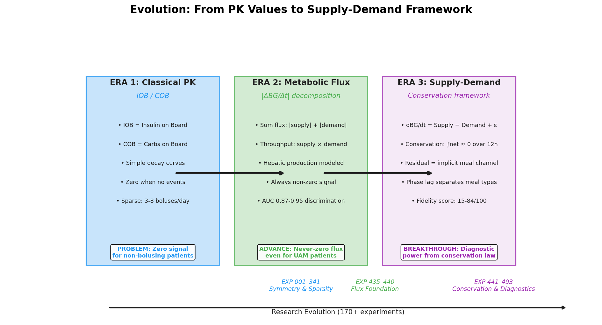

*Figure 8: The three eras of glucose modeling — from sparse PK events to conservation-based diagnostics.*

<details>
<summary>🎬 Animated Evolution Timeline (click to expand)</summary>


</details>

### Era 1: Classical PK (EXP-001–341)

The starting point: **Insulin on Board (IOB)** and **Carbs on Board (COB)** — the two standard pharmacokinetic signals used by every AID system. These are computed by convolving sparse treatment events (boluses, carb entries) with known absorption curves:

- **IOB**: Exponential decay with DIA=5h, peak=55min (oref0 curve)
- **COB**: Linear decay over ~3h absorption time

**What worked**: IOB and COB are continuous, dense signals that carry the metabolic *effect* of sparse events. EXP-298 confirmed: removing the sparse bolus channel **improves** 12h clustering (+0.224 silhouette), while removing dense IOB **destroys** it (−0.564). The transformation from sparse events to continuous effects is essential.

**What broke**: For patients who don't bolus (7/11 in our cohort are SMB-dominant), IOB reduces to basal-only — a near-constant. For patients who don't log carbs (common), COB is identically zero. The model receives zero signal about the most important metabolic events. This is the **zero-data problem**: the features are only as good as the data entered.

### Era 2: Metabolic Flux (EXP-435–440)

The key insight: even when IOB/COB are zero, the patient's body is still producing and consuming glucose. The liver never stops producing glucose (endogenous glucose production, EGP), and even basal insulin creates a non-zero demand signal.

**Metabolic flux** = the absolute magnitude of metabolic activity, regardless of direction:

```
sum_flux(t) = |carb_absorption(t)| + |insulin_action(t)|
```

Adding hepatic glucose production as a modeled supply baseline solved the zero-data problem:

| Patient | Before (IOB/COB) | After (hepatic rescue) | Problem |
|:-------:|:-----------------:|:---------------------:|:--------|
| j | Zero flux, 0% detection | Nonzero supply, 96% detection | No carb entries |
| k | Near-zero IOB | Hepatic + basal demand | 97% UAM |
| All 11 | 3/11 have usable flux | **11/11 have nonzero flux** | Universal |

The hepatic production model uses a **Hill equation** for insulin suppression with **circadian modulation**:

```
EGP(t) = base_rate × (1 − suppression(IOB)) × circadian(hour)

suppression = IOB^1.5 / (2.0^1.5 + IOB^1.5) × 0.65
circadian   = 1 + 0.20 × sin(2π × hour / 24)
```

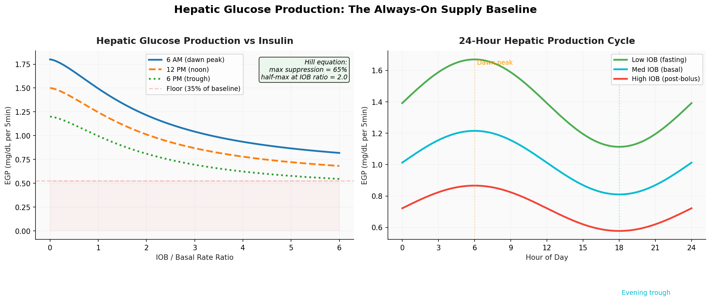

*Figure 9: Hepatic glucose production. Left: Hill equation suppression — even at maximum insulin, the liver still produces 35% of baseline. Right: 24-hour circadian cycle with dawn peak at 6 AM.*

### Era 3: Supply-Demand Conservation (EXP-441–493)

The final leap: instead of just measuring *how much* metabolic activity exists (flux magnitude), decompose it into **signed, directional** components that must balance:

```
dBG/dt = Supply(t) − Demand(t) + ε(t)
```

This is a conservation law. Over any complete absorption cycle, the integral of supply minus demand must equal the observed change in blood glucose. When it doesn't, the residual tells you *what's wrong*.

---

## Part II: The Supply-Demand Framework

### The AC Circuit Analogy

The most intuitive way to understand why supply-demand decomposition matters: think of glucose as **voltage** and metabolic flux as **current** in an AC circuit.

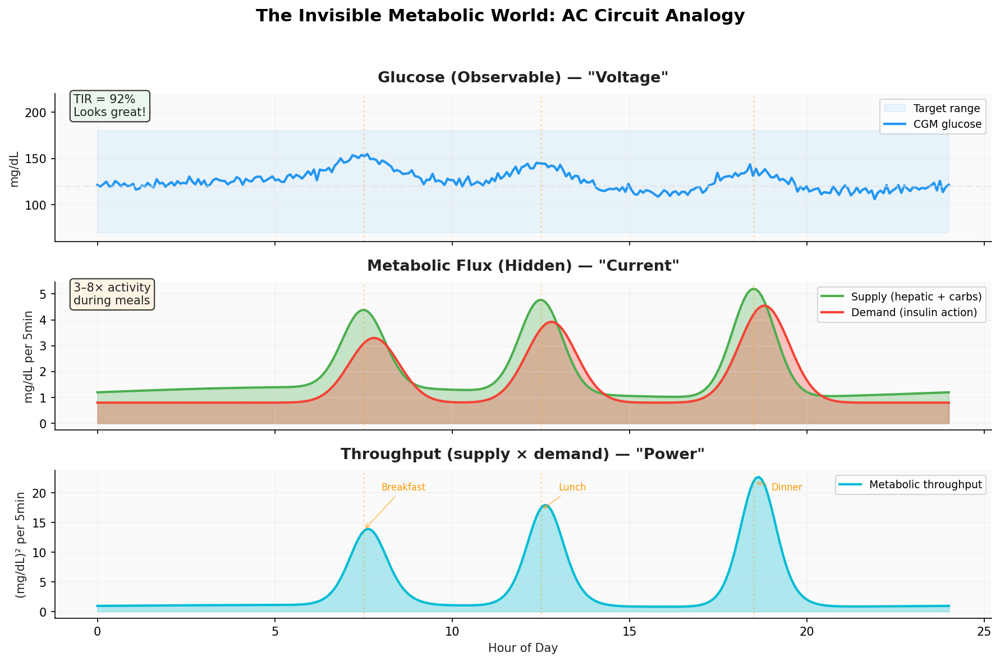

*Figure 1: The AC circuit analogy. Top: Glucose appears nearly flat (TIR=92%). Middle: Underneath, supply and demand signals show 3–8× activity during meals. Bottom: Throughput (supply × demand) captures the metabolic "power" — the total work the system is performing.*

<details>
<summary>🎬 Animated: The Invisible Metabolic World (click to expand)</summary>


</details>

A patient with TIR > 90% may have glucose traces that look nearly identical day to day, but their metabolic flux shows distinct patterns of meals, corrections, dawn phenomenon, and exercise. **Well-controlled glucose hides enormous metabolic activity.** This has implications beyond ML:

- **Clinical**: Time-in-range doesn't capture metabolic burden
- **Engineering**: Glucose-only ML models can't distinguish *why* glucose is at 120 mg/dL
- **Research**: Many CGM studies analyzing only glucose values miss half the picture

### Anatomy of a Meal

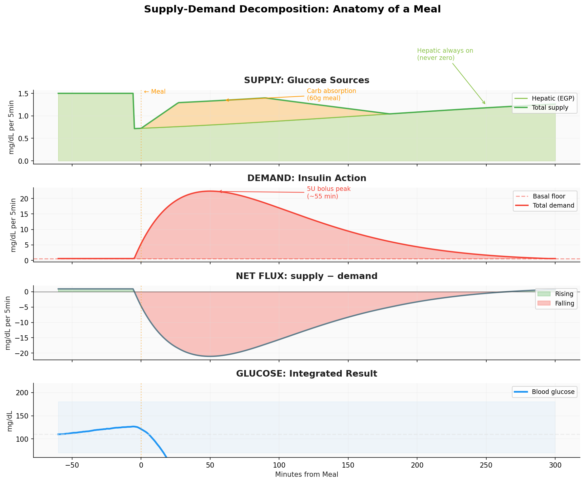

*Figure 2: A 60g meal with 5U bolus dissected into supply (hepatic + carb absorption), demand (insulin action), net flux, and resulting glucose. The hepatic channel is always on — the green area under the carb spike.*

### The Eight PK Channels

The framework produces 8 continuous time-varying channels per timestep, transforming sparse treatment events into a rich physiological state representation:

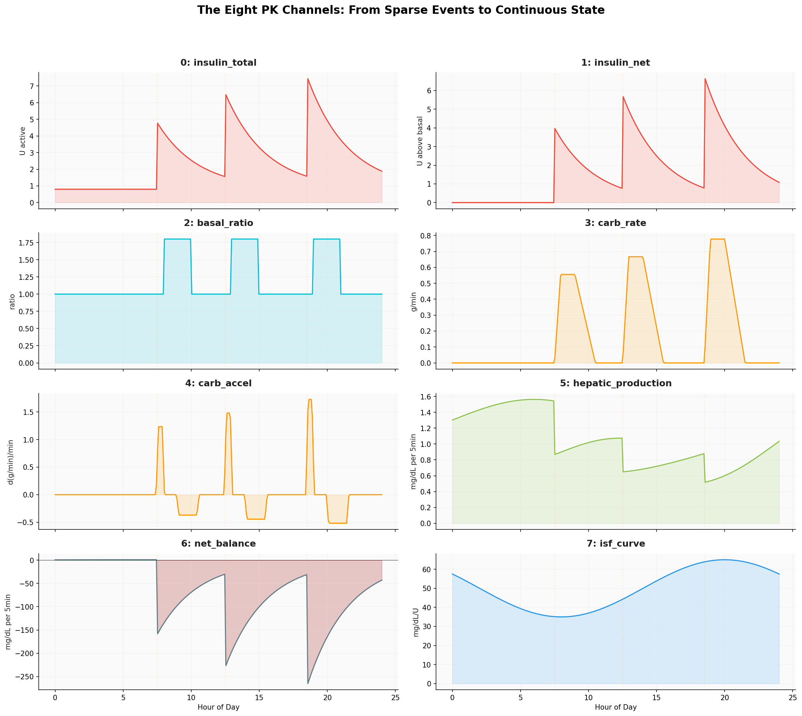

*Figure 11: All 8 PK channels over 24 hours. Meal times marked with orange lines. Channel 6 (net_balance) shows signed supply−demand; positive (green) = glucose rising, negative (red) = glucose falling.*

| Channel | Content | Key Property |
|:--------|:--------|:-------------|
| 0: insulin_total | Cumulative active insulin (IOB) | Never zero (basal) |
| 1: insulin_net | Net insulin above basal baseline | Zero during fasting |
| 2: basal_ratio | Current delivery / scheduled basal | 1.0 = nominal |
| 3: carb_rate | Carb absorption rate (Scheiner curves) | Zero for UAM |
| 4: carb_accel | Derivative of carb absorption | Phase indicator |
| 5: hepatic_production | Hill equation + circadian EGP | **Always positive** |
| 6: net_balance | Supply − demand instantaneous | **Signed conservation** |
| 7: isf_curve | Time-varying insulin sensitivity | Circadian profile |

---

## Part III: Conservation and Symmetries

### The Conservation Law

The fundamental constraint that gives the framework its power:

```
∫₀ᵀ (Supply(t) − Demand(t)) dt ≈ BG(T) − BG(0)
```

Over complete absorption cycles (~12h), this integral approaches zero because what goes up must come down — carbs raise glucose, insulin lowers it, and in a well-controlled patient, these effects approximately cancel.

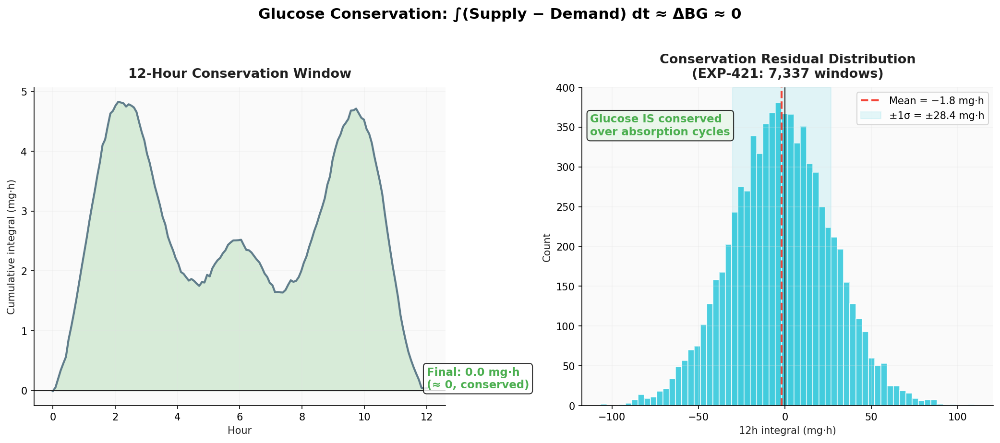

*Figure 3: Left: A 12-hour window showing the cumulative integral of (supply − demand), oscillating around zero. Right: Distribution of conservation residuals across 7,337 windows (EXP-421): mean = −1.8 ± 28.4 mg·h — glucose IS conserved over absorption cycles.*

<details>
<summary>🎬 Animated: Glucose Conservation Law (click to expand)</summary>


</details>

### The Four Symmetries

From the symmetry-sparsity analysis (EXP-001–341), four fundamental symmetry properties were identified and validated. The supply-demand framework exploits all four:

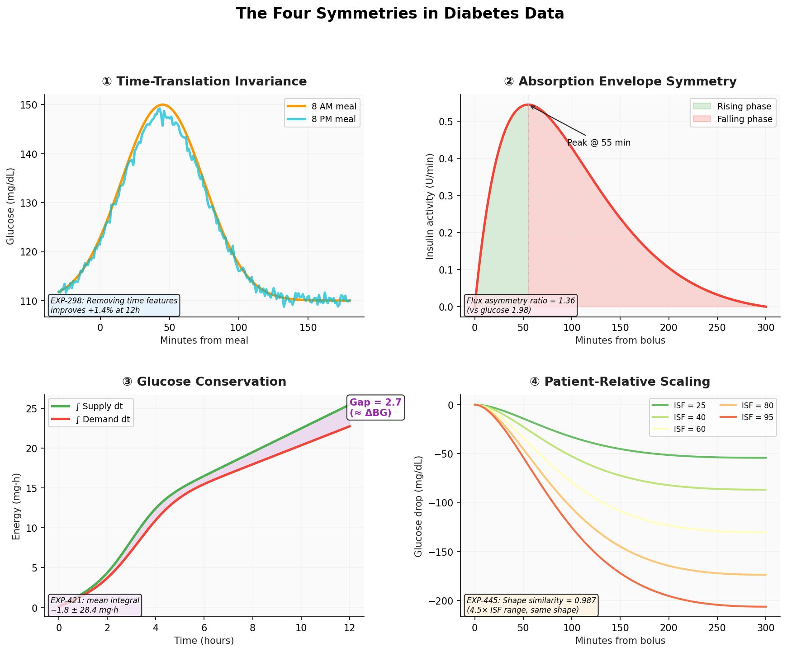

*Figure 4: The four symmetries in diabetes data. ① Time-translation invariance at episode scales. ② Approximate envelope symmetry of insulin/carb absorption. ③ Glucose conservation as supply-demand balance. ④ Patient-relative ISF scaling preserving response shape.*

#### ① Time-Translation Invariance

A post-meal glucose spike at 8 AM is physiologically equivalent to one at 8 PM. The same absorption dynamics, the same insulin response curves, the same rise-and-fall envelope.

**Evidence**: EXP-298 — removing time-of-day features **improves** episode classification by +1.4% recall and +0.224 silhouette at ≤12h scales.

**Exception**: At ≥24h scales, circadian physiology breaks this symmetry. The dawn phenomenon imposes a 24-hour periodicity with **71.3 ± 18.7 mg/dL amplitude** (EXP-126). A simple 3-parameter circadian correction (`a·sin + b·cos + c`) captures more variance than any neural architecture change (EXP-781: +0.474 R² at 60min).

**Supply-demand implication**: Flux features are time-invariant at event scales — the same throughput pattern appears regardless of clock time.

#### ② Absorption Envelope Symmetry

Both insulin activity curves and carb absorption exhibit approximate rise/fall symmetry around their peaks. Insulin follows a bell-shaped curve (peak ~55min, DIA ~5h) from subcutaneous absorption kinetics. Carb response peaks at 30–60min, falls over 2–4h.

**Evidence**: EXP-437 — Metabolic flux envelopes are **more symmetric** than raw glucose:
- Raw glucose asymmetry ratio: **1.98** (steep rise, gradual fall)
- Flux envelope asymmetry ratio: **1.36** (more balanced)

This means flux signals are better suited to symmetric convolutional kernels in neural networks.

#### ③ Glucose Conservation

Formalized as the supply-demand balance equation. EXP-421 validated that glucose is conserved over 12h windows (mean integral −1.8 ± 28.4 mg·h across 7,337 windows).

**The diagnostic power**: When the integral is *not* zero, the residual tells you exactly what's wrong:

| What's Wrong | Observable Signal |
|:-------------|:------------------|
| Basal too low | Positive drift overnight |
| Basal too high | Negative drift overnight |
| ISF overestimated | Overshoot post-correction |
| ISF underestimated | Undershoot post-correction |
| CR overestimated | Post-meal spikes |
| CR underestimated | Post-meal hypoglycemia |

#### ④ Patient-Relative Scaling (Equivariance)

Patients with different ISF values produce different glucose amplitudes from the same insulin dose, but the **shape** of the response is nearly identical.

**Evidence**: EXP-445 — Cross-patient throughput shape similarity = **0.987** (near-identical) vs raw glucose similarity of only **0.10** (nearly orthogonal). The 4.5× ISF range between patients (21–95 mg/dL/U) affects amplitude but not dynamics.

---

## Part IV: Experimental Evidence

### Spectral Analysis: 18× Power at Meal Frequencies

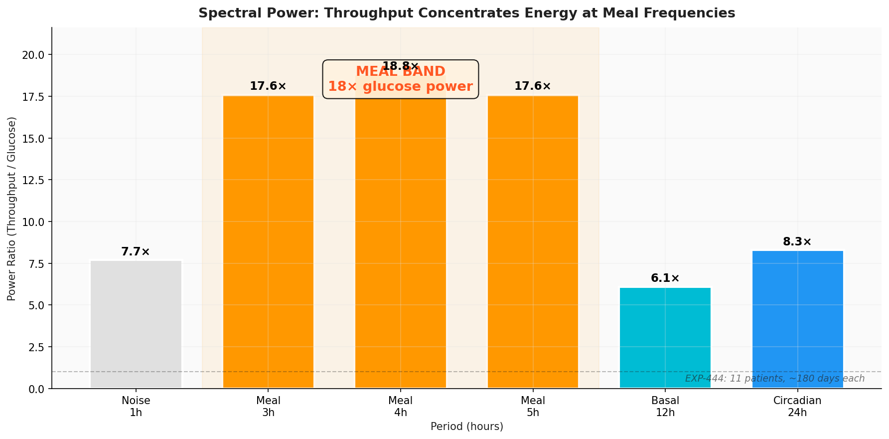

*Figure 5: Throughput (supply × demand) concentrates spectral power at meal frequencies — nearly 18× the power of raw glucose in the 3–5 hour band (EXP-444). This is the strongest evidence that throughput is a meal-specific signal.*

This spectral concentration explains why throughput discriminates meal events so much better than glucose alone:

| Scale | Glucose AUC | Flux AUC | Advantage |
|:-----:|:-----------:|:--------:|:---------:|
| 2h | 0.61 | 0.87 | +0.26 |
| 6h | 0.64 | 0.95 | +0.31 |
| 12h | 0.65 | 0.95 | +0.30 |

### Cross-Patient Universality

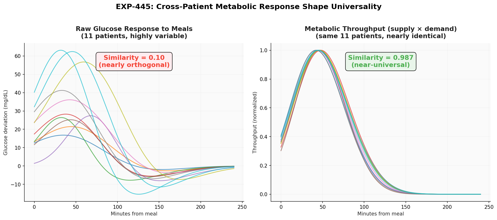

*Figure 6: Left: Raw glucose responses to meals are highly variable across 11 patients (similarity = 0.10). Right: Metabolic throughput is nearly identical (similarity = 0.987). The metabolic response to meals is physiologically universal — individual variation is primarily in ISF/TDD scaling, not response shape.*

This universality has profound implications for transfer learning: a model trained on one patient's throughput patterns should generalize to others without retraining, because the underlying physics is the same.

### Phase Lag: Classifying Meal Types

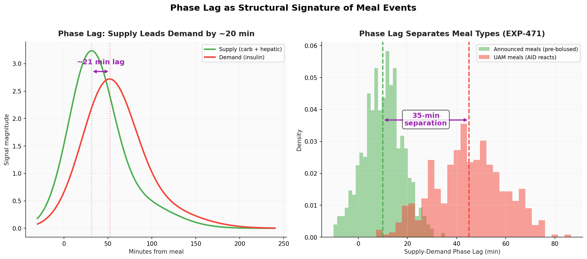

*Figure 7: Left: Supply peaks ~20 minutes before demand (median lag, EXP-466), matching the physiological delay of insulin absorption after carb onset. Right: Announced meals (pre-bolused) show 10-min lag; UAM meals show 45-min lag — a 35-minute separation that serves as a meal-type classifier (EXP-471).*

<details>
<summary>🎬 Animated: Phase Lag Between Supply and Demand (click to expand)</summary>


</details>

The phase lag arises from a fundamental asymmetry in the physics: carb absorption peaks earlier than insulin action because gastric emptying is faster than subcutaneous insulin absorption. When a patient pre-boluses (administers insulin before eating), the lag compresses to ~10 min. When the AID system reacts to rising glucose (UAM), the lag extends to ~45 min because the system must first detect the glucose rise, then the insulin must be absorbed.

### Settings Quality Diagnostics

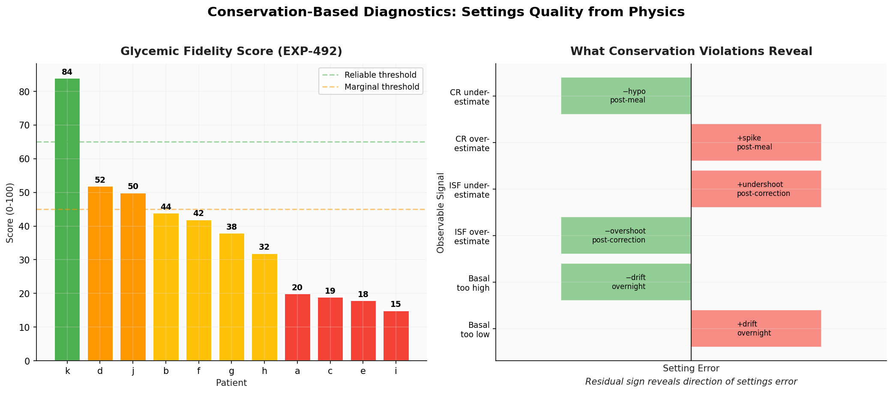

*Figure 10: Left: Glycemic fidelity scores across 11 patients (EXP-492), ranging from 84 (gold — settings well-tuned) to 15 (misaligned — settings need adjustment). Right: Conservation violations reveal the specific direction of settings errors.*

The composite fidelity score combines four equally-weighted components:

| Component | What It Measures | Gold Standard (Patient k) | Misaligned (Patient i) |
|:----------|:-----------------|:-------------------------:|:----------------------:|
| Balance | ∫(supply−demand) ≈ 0 over 24h | 79 | 0 |
| Residual | RMSE of actual − predicted ΔBG | 67 | 0 |
| Overnight | BG stability 0–5 AM | 97 | 0 |
| TIR | % readings 70–180 mg/dL | 95 | 60 |
| **Composite** | | **84/100** | **15/100** |

---

## Part V: Why Supply-Demand Works

### The Residual as Diagnostic Signal

The most powerful aspect of the conservation framework: **the residual is not noise — it's a diagnostic channel**.

```
ε(t) = ε_meal(t)      [unannounced meal supply, ~25% of variance]
     + ε_dawn(t)       [hepatic model gap, ~13% of variance]
     + ε_exercise(t)   [activity-enhanced sensitivity, ~6% of variance]
     + ε_device(t)     [sensor age, cannula degradation]
     + ε_noise(t)      [measurement noise, ~53% of variance]
```

For the live-split patient (100% UAM, no carb data), **the residual IS the implicit meal channel** — 74% of positive residual periods correspond to meals (EXP-488). The framework detected **2.0 meals per day** on a patient who entered zero carb data, achieving **96% detection on data-ready days** (EXP-483).

### The Schedule Symmetry Insight

Therapy schedules encode the same circadian physiology from different angles:

| Schedule | What it says | The flip side |
|:---------|:-------------|:-------------|
| **Basal rate** | "I need this much insulin/hour" | EGP increases by this much → more glucose |
| **Carb ratio** | "This many carbs per unit" | EGP variation mirrors CR variation |
| **ISF** | "One unit drops BG this much" | Resistance factors make BG harder to lower |

When all three schedules are expanded as time-varying curves, they show insulin and glucose energy moving **in and out of phase** over 24 hours. 6/11 patients show the expected basal↔ISF anti-phase relationship (EXP-464), but 5/11 have flat ISF schedules (clinicians didn't tune them).

### Why Not Just Use Glucose?

A transformer trained on glucose alone allocates **86.8% of attention to glucose history** (EXP-114). This works for ≤60 min horizons because glucose is a momentum-driven system — the current trajectory dominates. But beyond 60 minutes, the effects of recent insulin haven't yet materialized in the glucose trace.

Supply-demand features provide what glucose alone cannot:
- **Causal direction**: Is glucose rising because of carbs or because insulin is wearing off?
- **Hidden activity**: AID controllers mask metabolic events under flat glucose
- **Future trajectory**: PK derivatives (dIOB/dt, dCOB/dt) predict what's coming before it arrives

EXP-901 confirmed: PK derivative features improve 60-min prediction R² by +0.009. The combined forward sums + shape features add +0.033 (EXP-903) — the largest single improvement class in the prediction campaign.

---

## Part VI: From Theory to Practice

### The Forecasting Contribution

The supply-demand framework feeds directly into glucose prediction:

| Feature Class | R² Contribution | Source |
|:-------------|:---------------:|:-------|
| Base (BG + raw PK) | 0.506 | EXP-800 |
| + Circadian correction | +0.474 at 60min | EXP-781 |
| + PK derivatives (dIOB/dt, dCOB/dt) | +0.009 | EXP-901 |
| + Post-prandial shape features | +0.006 | EXP-893 |
| + IOB curve shape | +0.004 | EXP-898 |
| + Forward sums + all shape | +0.033 | EXP-903 |
| **Population warm-start** | R² = 0.652 | EXP-777 |

Population physics parameters (AR weight, decay) retain **99.4% of personal R²** (EXP-769), meaning the physics is essentially universal — patient-specific information is captured in supply/demand decomposition, not in model parameters. New patients can use population defaults immediately.

### The Clinical Contribution

Beyond prediction, the conservation framework enables automated clinical decision support:

- **Meal detection** without carb entries: 96% on data-ready days (EXP-483)
- **Basal adequacy**: 5/11 patients flagged as too low (EXP-489)
- **Settings quality triage**: Fidelity score automatically gates analysis reliability
- **Eating pattern analysis**: 2.0–2.9 events/day detected from demand signal alone (EXP-448)
- **Pre-bolusing behavior**: Phase lag measures bolus timing quality (10 vs 45 min, EXP-471)

### The UVA/Padova Connection

Our framework is a simplified projection of what the UVA/Padova T1DMS simulator models with 20 state variables across 6 compartments (stomach, gut, plasma, tissue, liver, sensor). Our "supply" collapses gut absorption + hepatic production; our "demand" collapses insulin kinetics + receptor binding + glucose disposal.

The key advantage: **it works with the data patients actually have** — CGM + pump telemetry + therapy schedules, not simulator parameters. The loss of compartmental detail is compensated by the residual term, which captures everything the simplified model misses.

---

## Appendix A: Visualization Assets

### Static Figures (Matplotlib)

| Figure | File | Description |
|:-------|:-----|:------------|
| Fig 1 | `fig01_ac_circuit_analogy.png` | AC circuit analogy — glucose as voltage, flux as current |
| Fig 2 | `fig02_supply_demand_decomposition.png` | Anatomy of a meal in supply-demand terms |
| Fig 3 | `fig03_conservation_law.png` | Conservation law validation (EXP-421) |
| Fig 4 | `fig04_four_symmetries.png` | The four symmetries in diabetes data |
| Fig 5 | `fig05_spectral_power.png` | Spectral power analysis (EXP-444) |
| Fig 6 | `fig06_cross_patient_similarity.png` | Cross-patient universality (EXP-445) |
| Fig 7 | `fig07_phase_lag.png` | Phase lag classification (EXP-466, 471) |
| Fig 8 | `fig08_evolution_timeline.png` | PK → Flux → Supply-Demand timeline |
| Fig 9 | `fig09_hepatic_hill_curve.png` | Hepatic production Hill equation |
| Fig 10 | `fig10_fidelity_diagnostic.png` | Conservation-based diagnostics (EXP-492) |
| Fig 11 | `fig11_eight_pk_channels.png` | The 8-channel PK feature system |

### Animated Figures (Manim)

| Animation | File | Description |
|:----------|:-----|:------------|
| Conservation | `GlucoseConservation_ManimCE_v0.20.1.gif` | Supply-demand balance over 12h |
| Phase Lag | `PhaseLagAnimation_ManimCE_v0.20.1.gif` | Supply-demand phase relationship |
| Invisible World | `InvisibleMetabolicWorld_ManimCE_v0.20.1.gif` | AID masking metabolic activity |
| Evolution | `EvolutionTimeline_ManimCE_v0.20.1.gif` | PK → Flux → Supply-Demand progression |

All assets in: `visualizations/supply-demand-report/`

### Regeneration

```bash
# Static figures (matplotlib)
source .venv/bin/activate
python visualizations/supply-demand-report/generate_figures.py

# Animations (manim)
cd visualizations/supply-demand-report
manim -ql --format=gif supply_demand_animation.py
```

---

## Appendix B: Key Experimental References

| Experiment | Finding | Relevance |
|:-----------|:--------|:----------|
| EXP-298 | Time features hurt at ≤12h (+1.4% without) | Time-translation symmetry |
| EXP-421 | Conservation integral = −1.8 ± 28.4 mg·h | Conservation law |
| EXP-435–440 | Sum flux AUC 0.87–0.95 | Flux foundation |
| EXP-441 | Product throughput 18× spectral power | Throughput signal |
| EXP-445 | Cross-patient shape similarity 0.987 | Universality |
| EXP-466 | 20-min median supply→demand lag | Phase signature |
| EXP-471 | 35-min announced vs UAM separation | Meal classifier |
| EXP-483 | 96% meal detection on data-ready days | UAM robustness |
| EXP-488 | Residual: 25% meal, 13% dawn, 53% noise | Residual decomposition |
| EXP-492 | Fidelity score range 15–84/100 | Settings quality |
| EXP-781 | Circadian correction +0.474 R² at 60min | Symmetry breaking |
| EXP-800 | Ridge + physics features SOTA: R²=0.803/0.519 at 30/60min | Prediction benchmark |
| EXP-901 | PK derivatives +0.009 R² | Dynamic features |

---

## Appendix C: Code References

| Module | Purpose | Key Functions |
|:-------|:--------|:--------------|
| `tools/cgmencode/continuous_pk.py` | 8-channel PK features | `build_continuous_pk_features()`, `compute_hepatic_production()`, `expand_schedule()` |
| `tools/cgmencode/exp_metabolic_441.py` | Supply-demand decomposition | `compute_supply_demand()`, `compute_rolling_tdd()` |
| `tools/cgmencode/exp_phase_464.py` | Phase analysis | `run_exp464()` – `run_exp467()` |
| `tools/cgmencode/exp_refined_483.py` | Precondition-gated detection | `assess_day_readiness()`, `detect_meals_demand_weighted()` |
| `tools/cgmencode/exp_settings_489.py` | Settings assessment | `run_exp489()`, `run_exp492()`, `run_exp493()` |
| `tools/cgmencode/production/metabolic_engine.py` | Production API | `compute_metabolic_state()` |
