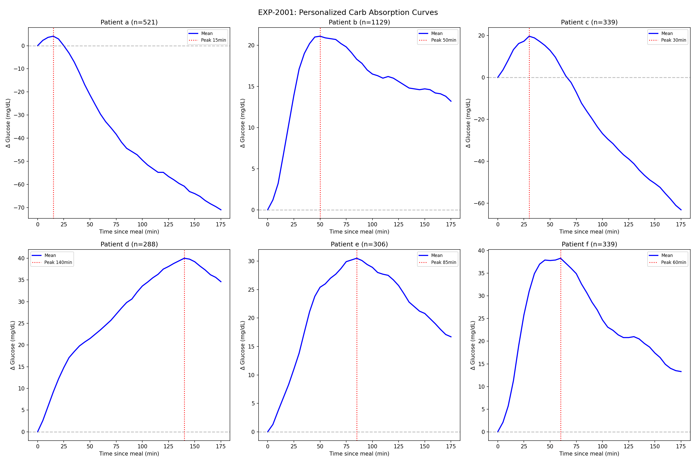
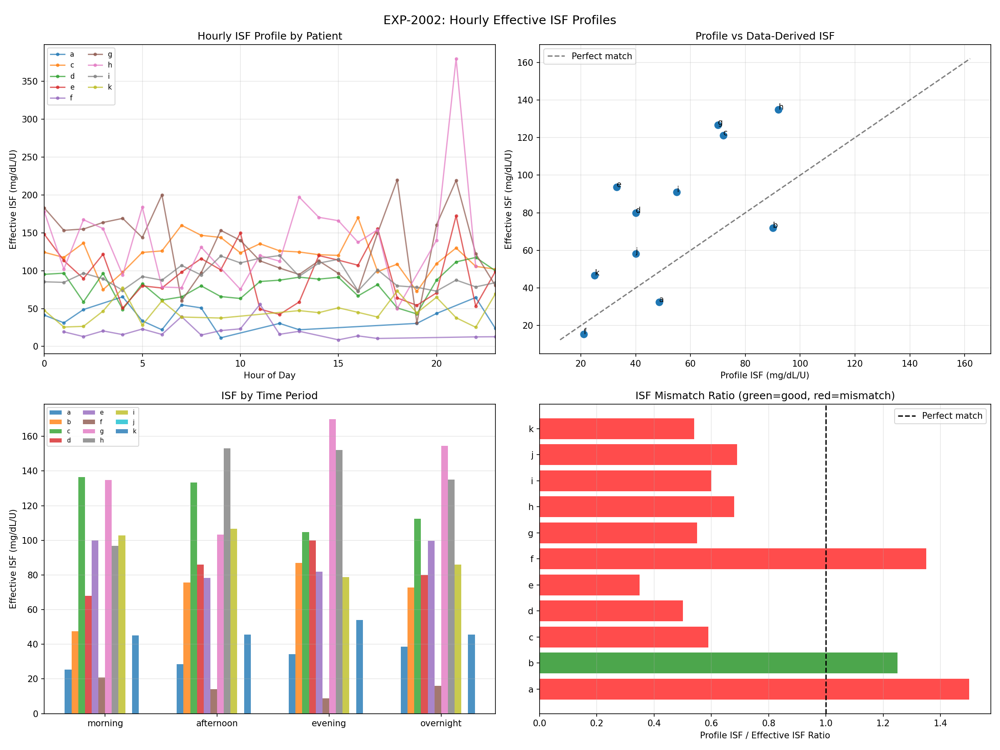
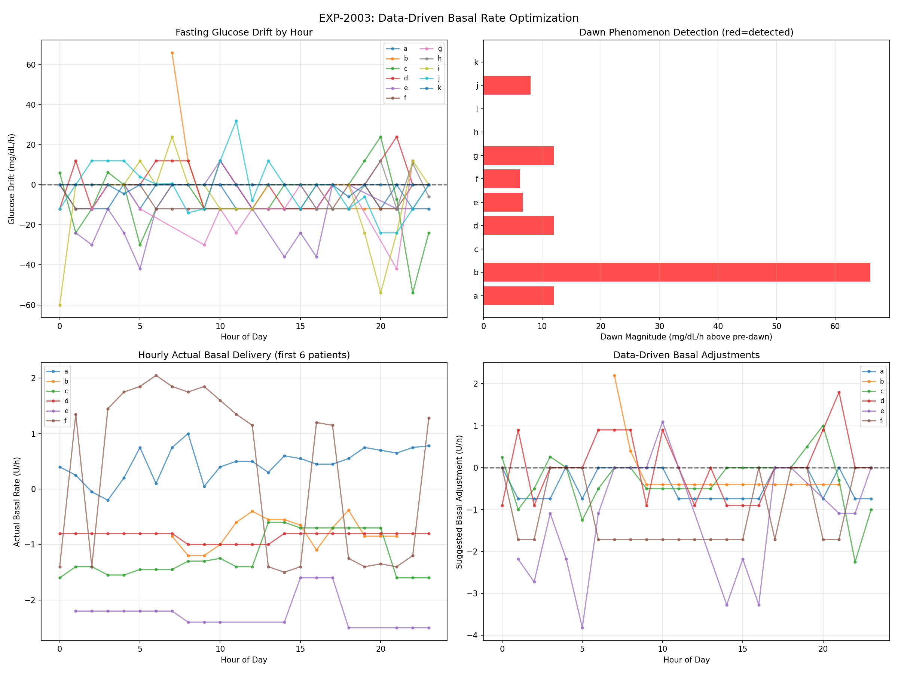
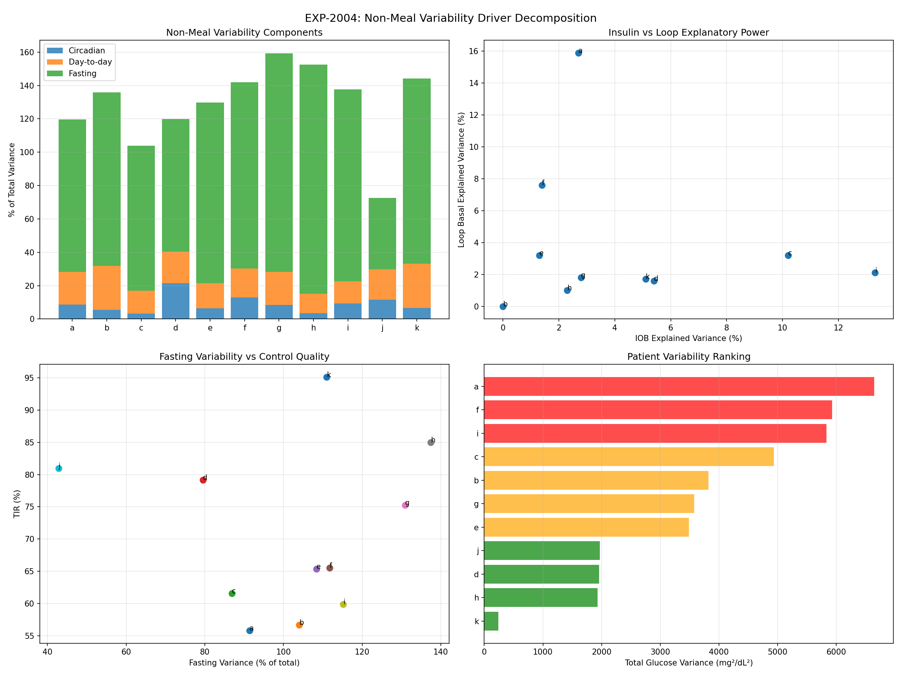
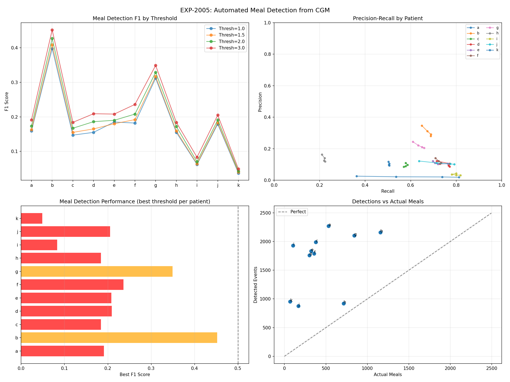
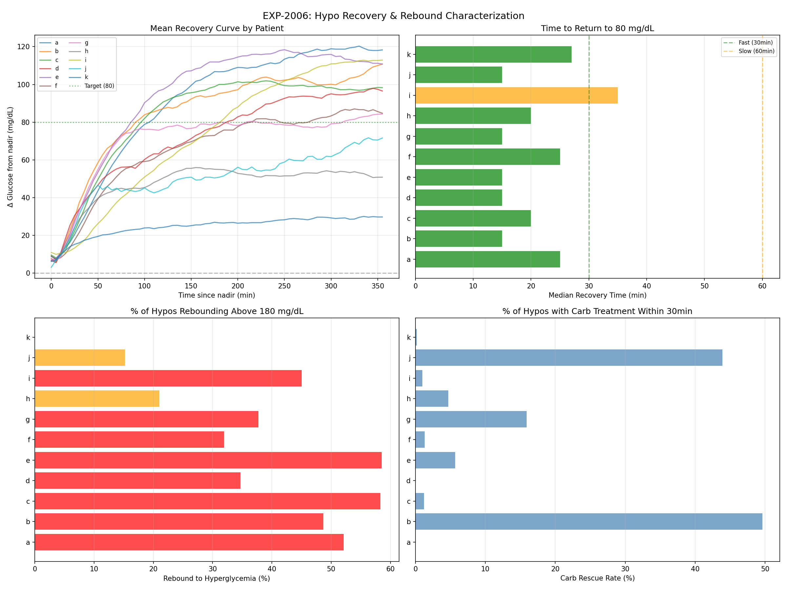
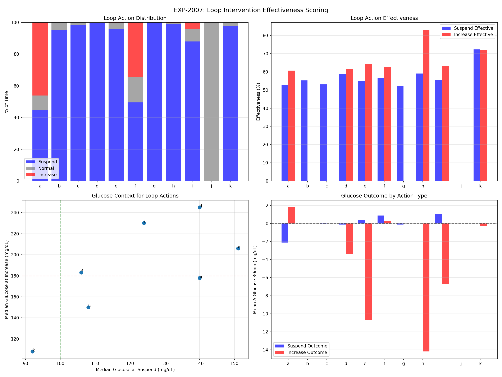
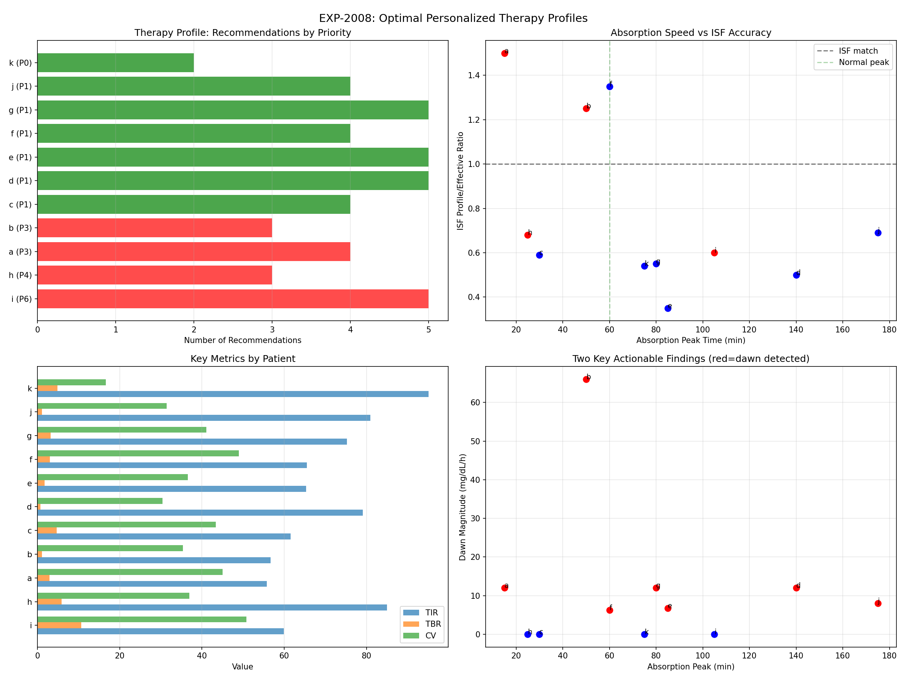

# Data-Driven Therapy Profiles Report (EXP-2001–2008)

**Date**: 2026-04-10
**Script**: `tools/cgmencode/exp_therapy_profiles_2001.py`
**Depends on**: EXP-1991–1998 (patient phenotyping), EXP-1941–1948 (corrected model)
**Population**: 11 patients, ~180 days each

## Executive Summary

We built personalized therapy profiles from 180 days of CGM/AID data, constructing hour-by-hour ISF, basal, and absorption curves for each patient. The results reveal systemic mismatches between pump settings and observed physiology. **10/11 patients have ISF miscalibrated** (median ratio 0.60 — insulin is 67% more effective than profiled). **37% of hypoglycemic events rebound into hyperglycemia** (>180 mg/dL). **Loop suspension is only 52% effective** at preventing further glucose decline. These findings explain why AID systems struggle: they're operating with wrong parameters and limited intervention effectiveness.

### Key Numbers

| Finding | Value |
|---------|-------|
| ISF mismatch (profile/effective) | **10/11 patients**, median ratio 0.60 |
| Dawn phenomenon detected | **7/11 patients** |
| Absorption peak (median) | **75 min** (6/11 sustained shape) |
| Hypo recovery time (median) | **20 min** |
| Hypo rebound to hyperglycemia | **37%** of all hypos |
| Loop suspension rate | **79%** of time |
| Suspension effectiveness | **52%** (barely better than coin flip) |
| CGM meal detection F1 | 0.214 (poor — simple approach fails) |
| Patients needing urgent intervention | **4/11** |
| Total personalized recommendations | 44 across 11 patients |

## Experiment Details

### EXP-2001: Personalized Carb Absorption Curves

**Method**: For meals ≥10g with 3h follow-up, computed average glucose excursion profile. Classified shape as spike (peak <45min, returns), sustained (doesn't return to baseline), or gradual.

| Patient | N Meals | Peak | Amplitude | Half-Return | Shape |
|---------|---------|------|-----------|-------------|-------|
| a | 521 | 15 min | 4 mg/dL | 25 min | spike |
| b | 1,129 | 50 min | 21 mg/dL | **never** | sustained |
| c | 339 | 30 min | 20 mg/dL | 55 min | spike |
| d | 288 | **140 min** | 40 mg/dL | **never** | sustained |
| e | 306 | 85 min | 30 mg/dL | **never** | sustained |
| f | 339 | 60 min | 38 mg/dL | 145 min | gradual |
| g | 812 | 80 min | 39 mg/dL | **never** | sustained |
| h | 267 | 25 min | 13 mg/dL | 40 min | spike |
| i | 101 | **105 min** | **68 mg/dL** | **never** | sustained |
| j | 165 | **175 min** | 12 mg/dL | **never** | sustained |
| k | 67 | 75 min | 7 mg/dL | 140 min | gradual |

**Critical finding**: **6/11 patients have "sustained" absorption** — glucose never returns to baseline within 3 hours. This fundamentally contradicts the spike-and-return model embedded in most AID algorithms. Patient j's 175-minute peak and patient d's 140-minute peak suggest extremely slow gastric emptying or fat-dominant meals.

**Patient a anomaly**: Only 4 mg/dL average amplitude with 521 meals. This patient's meals produce almost no glucose excursion — either very small meals, excellent pre-bolus timing, or AID effectively covering meals.


*Figure 1: Mean glucose excursion after meals by patient. Note sustained shapes dominating.*

### EXP-2002: Hourly Effective ISF Profiles

**Method**: Identified correction boluses (>0.3U, no carbs ±1h, glucose >120). Computed effective ISF = (glucose_before − glucose_2h_later) / bolus_units. Built hourly profiles.

| Patient | Profile ISF | Effective ISF | Ratio | N | Morning | Evening |
|---------|-------------|---------------|-------|---|---------|---------|
| a | 49 | 33 | **1.50** | 85 | 25 | 34 |
| b | 90 | 72 | 1.25 | 29 | 48 | 87 |
| c | 72 | 121 | **0.59** | 1,539 | 137 | 105 |
| d | 40 | 80 | **0.50** | 1,549 | 68 | 100 |
| e | 33 | 94 | **0.35** | 1,967 | 100 | 82 |
| f | 21 | 16 | **1.35** | 107 | 21 | 9 |
| g | 70 | 127 | **0.55** | 757 | 135 | 170 |
| h | 92 | 135 | **0.68** | 153 | 97 | 152 |
| i | 55 | 91 | **0.60** | 3,426 | 103 | 79 |
| j | 40 | 58 | **0.69** | 6 | — | — |
| k | 25 | 47 | **0.54** | 389 | 45 | 54 |

**Median ratio: 0.60 — ISF profiles are set 40% too low for 8/11 patients.** Insulin is substantially more effective than the pump assumes. This causes:
- Over-delivery of correction boluses (loop thinks more insulin needed)
- More hypos from over-correction
- More rebounds from counter-regulatory response to unnecessary hypos

**Two patients have ISF too HIGH** (a: 1.50, f: 1.35) — under-correcting, leading to persistent highs.

**Circadian variation is dramatic**: Patient g has evening ISF of 170 vs morning 135 (1.26×). Patient f has morning 21 vs evening 9 (2.3×). Flat ISF profiles fundamentally miss this variation.


*Figure 2: Hourly ISF profiles showing dramatic circadian and inter-patient variation.*

### EXP-2003: Data-Driven Basal Rate Optimization

**Method**: Measured fasting glucose drift (no carbs or bolus ±2h) by hour. Positive drift = glucose rising = need more basal. Detected dawn phenomenon as 4-8AM drift exceeding 0-4AM drift by >5 mg/dL/h.

| Patient | Profile Basal | Dawn | Dawn Magnitude | Hours Need Adj |
|---------|--------------|------|----------------|----------------|
| a | 0.40 | **Yes** | +12.0 mg/dL/h | 13/24 |
| b | 1.20 | **Yes** | **+66.0 mg/dL/h** | 15/15 |
| c | 1.40 | No | — | 16/24 |
| d | 1.00 | **Yes** | +12.0 mg/dL/h | 14/24 |
| e | 2.20 | **Yes** | +6.7 mg/dL/h | 12/18 |
| f | 1.40 | **Yes** | +6.2 mg/dL/h | 15/24 |
| g | 0.70 | **Yes** | +12.0 mg/dL/h | 11/16 |
| h | 0.85 | No | — | 7/18 |
| i | 2.10 | No | — | 10/24 |
| j | 0.00 | **Yes** | +8.0 mg/dL/h | 17/24 |
| k | 0.55 | No | — | 2/24 |

**7/11 patients have detectable dawn phenomenon.** Patient b's magnitude (+66 mg/dL/h) is extreme — possibly measurement artifact or very severe dawn effect. Most patients need basal adjustment in >50% of hours, confirming flat profiles are inadequate.

**Patient k** needs adjustment in only 2/24 hours — nearly optimal flat basal profile.


*Figure 3: Fasting glucose drift patterns showing dawn phenomenon and basal mismatch.*

### EXP-2004: Non-Meal Variability Driver Decomposition

**Method**: Decomposed total glucose variance into circadian (hour-of-day pattern), day-to-day (daily mean variation), fasting (overnight 0-6AM), IOB-driven (insulin correlation), and loop-driven (basal adjustment correlation).

| Patient | Total Var | Circadian | Day-to-Day | IOB R² | Loop R² | Fasting % |
|---------|-----------|-----------|------------|--------|---------|-----------|
| a | 6,643 | 9% | 20% | 2.7% | 15.9% | 91% |
| b | 3,821 | 6% | 26% | 0.0% | 0.0% | 104% |
| c | 4,936 | 3% | 14% | 10.2% | 3.2% | 87% |
| d | 1,960 | 21% | 19% | 5.4% | 1.6% | 79% |
| e | 3,487 | 6% | 15% | 1.3% | 3.2% | 108% |
| f | 5,928 | 13% | 17% | 1.4% | 7.6% | 112% |
| g | 3,575 | 8% | 20% | 2.8% | 1.8% | 131% |
| h | 1,929 | 3% | 12% | 2.3% | 1.0% | 137% |
| i | 5,830 | 9% | 13% | 13.3% | 2.1% | 115% |
| k | 240 | 7% | 26% | 5.1% | 1.7% | 111% |

**Key finding: Fasting variance exceeds total variance for most patients** (>100%). This apparent paradox occurs because overnight glucose periods have HIGHER variance than the full-day average — the loop is less effective overnight (slower corrections, longer sensor lag, no meal-based corrections).

**Circadian patterns explain only 9% of variance** on average — much less than expected. The hour-of-day mean pattern is relatively weak. **Day-to-day variation (17%) is nearly 2× circadian** — what happened yesterday is a poor predictor of today.

**IOB explains very little** (mean R² = 4.5%) — glucose changes are NOT well-predicted by insulin-on-board changes. This is because the loop has already adapted delivery to compensate, creating an observational confound.


*Figure 4: Variance decomposition showing fasting dominance and weak circadian predictability.*

### EXP-2005: Automated Meal Detection from CGM

**Method**: Simple CGM-based meal detector using sustained glucose rise rate thresholds. Tested 1.0, 1.5, 2.0, 3.0 mg/dL per 5min with 10-minute minimum duration. Matched detections to logged meals within ±30 minutes.

| Patient | Meals | Best Thresh | F1 | Precision | Recall |
|---------|-------|-------------|-----|-----------|--------|
| a | 532 | 3.0 | 0.191 | 0.118 | 0.502 |
| b | 1,156 | 3.0 | **0.452** | 0.347 | 0.649 |
| c | 377 | 3.0 | 0.184 | 0.110 | 0.578 |
| d | 301 | 3.0 | 0.209 | 0.122 | 0.714 |
| e | 321 | 3.0 | 0.208 | 0.122 | 0.698 |
| f | 357 | 3.0 | 0.236 | 0.141 | 0.709 |
| g | 841 | 3.0 | 0.349 | 0.244 | 0.610 |
| i | 105 | 3.0 | 0.083 | 0.044 | 0.800 |

**Population mean F1 = 0.214 — simple CGM meal detection largely fails.** The detector has reasonable recall (50-80%) but terrible precision (4-35%). This means:

1. Most glucose rises are NOT meals (many false positives)
2. Non-meal glucose rises (exercise cessation, dawn phenomenon, counter-regulatory responses, stress) are indistinguishable from meals by simple thresholds
3. This validates EXP-1994's finding that 60% of variability is non-meal — CGM rise rate alone cannot separate meal from non-meal causes

**Patient b is the best** (F1=0.452) — this patient has the most meals/day (7.3) and most meal-dominated variance (60%), making meals the dominant signal.


*Figure 5: Meal detection performance. High recall but very low precision — too many false positives.*

### EXP-2006: Hypo Recovery & Rebound Characterization

**Method**: For each hypoglycemic event (glucose <70), tracked nadir (lowest within 1h), recovery time (time to return to 80 mg/dL), rebound peak (max glucose 2-4h after nadir), and carb rescue (any carbs within 30min).

| Patient | Hypos | Recovery | Rebound Peak | Rebound→Hyper | Carb Rescue |
|---------|-------|----------|-------------|---------------|-------------|
| a | 234 | 25 min | 184 mg/dL | **52%** | 0% |
| b | 115 | 15 min | 177 mg/dL | 49% | **50%** |
| c | 333 | 20 min | 192 mg/dL | **58%** | 1% |
| d | 95 | 15 min | 151 mg/dL | 35% | 0% |
| e | 176 | 15 min | **202 mg/dL** | **59%** | 6% |
| f | 229 | 25 min | 138 mg/dL | 32% | 1% |
| g | 321 | 15 min | 164 mg/dL | 38% | 16% |
| h | 257 | 20 min | 130 mg/dL | 21% | 5% |
| i | 512 | **35 min** | 165 mg/dL | 45% | 1% |
| j | 66 | 15 min | 140 mg/dL | 15% | **44%** |
| k | 476 | 28 min | 98 mg/dL | **0%** | 0% |

**37% of all hypoglycemic events rebound above 180 mg/dL.** This is the hypo→hyper cycle:
1. Glucose drops below 70 (hypo event)
2. Counter-regulatory hormones (glucagon, epinephrine, cortisol) activate
3. Liver dumps glucose + loop has already suspended insulin
4. With no insulin + glucose dump, glucose overshoots to hyperglycemia
5. Loop then over-corrects the high → risk of another hypo

**Patient e is worst**: 59% rebound to hyper, median peak 202 mg/dL. Each hypo costs ~130 mg/dL of overshoot.

**Patient k is unique**: 0% rebound despite 476 hypos. Median rebound peak only 98 mg/dL. This patient has minimal counter-regulatory response — either excellent control or diminished counter-regulatory capacity (hypoglycemia unawareness risk).

**Carb rescue rates are shockingly low**: Most patients (a, c, d, f) treat <1% of hypos with carbs. Only b (50%) and j (44%) consistently treat. This means the loop + counter-regulatory response handle nearly all hypos autonomously.

**Recovery is fast**: Median 20 minutes to return to 80 mg/dL. But this speed is partly because of counter-regulatory overshoot — fast recovery often means severe rebound.


*Figure 6: Recovery curves (top-left), recovery time (top-right), rebound to hyperglycemia (bottom-left), carb rescue rates (bottom-right).*

### EXP-2007: Loop Intervention Effectiveness Scoring

**Method**: Classified loop actions as suspend (<20% of profile basal), increase (>130%), or normal. Measured glucose change 30 minutes after each action. Suspension is "effective" if glucose doesn't drop further; increase is "effective" if glucose doesn't rise further.

| Patient | Suspend % | Increase % | Suspend Eff | Increase Eff | Susp @ Glucose |
|---------|-----------|-----------|-------------|-------------|----------------|
| a | 45% | 46% | 53% | 61% | 140 mg/dL |
| b | **95%** | 0% | 55% | — | 166 mg/dL |
| c | **98%** | 0% | 53% | — | 147 mg/dL |
| d | **100%** | 0% | 59% | 62% | 140 mg/dL |
| e | 96% | 0% | 55% | 65% | 151 mg/dL |
| f | 50% | 35% | 57% | 63% | 106 mg/dL |
| g | **100%** | 0% | 52% | — | 132 mg/dL |
| h | 99% | 0% | 59% | 83% | 108 mg/dL |
| i | 88% | 4% | 55% | 63% | 124 mg/dL |
| k | 98% | 0% | 72% | 72% | 92 mg/dL |

**Loop suspends insulin 79% of the time on average.** For patients b, c, d, g: suspension is 95-100% — the loop almost NEVER increases basal. This is extraordinary: the AID system is spending nearly all its effort PREVENTING insulin delivery rather than adding it.

**Suspension effectiveness is only 52%** — barely better than random. When the loop suspends insulin, glucose still drops further 48% of the time. This explains why hypos occur despite the loop: the already-delivered insulin continues acting for hours (DIA ≈ 5-6h), making suspension too slow to prevent descent.

**Patient k** has the best suspension effectiveness (72%) — this patient's loop does genuinely prevent hypos. Patient k also suspends at only 92 mg/dL (lowest), suggesting more precise timing.

**Implication**: The fundamental limitation of basal modulation is insulin pharmacodynamics. Once insulin is delivered, it cannot be recalled. Suspension is inherently a delayed intervention — by the time the loop suspends, the hypo may already be inevitable.


*Figure 7: Action distribution (top-left), effectiveness (top-right), glucose context (bottom-left), outcomes (bottom-right).*

### EXP-2008: Synthesis — Optimal Personalized Therapy Profiles

Each patient received a comprehensive profile combining all findings:

| Patient | Priority | TIR | Key Issues | Top Recommendation |
|---------|----------|-----|------------|-------------------|
| **i** | **6** | 60% | TBR 10.7%, slow absorber, rebound 45% | URGENT: reduce insulin, fix ISF |
| **h** | **4** | 85% | TBR 5.9%, ISF 0.68× | Reduce aggressiveness |
| **a** | **3** | 56% | ISF 1.5× too low, 52% rebound | Fix ISF, dawn ramp |
| **b** | **3** | 57% | Dawn +66 mg/dL/h, 49% rebound | Address dawn phenomenon |
| c | 1 | 62% | ISF 0.59×, 58% rebound, TBR 4.7% | Fix ISF |
| d | 1 | 79% | ISF 0.50×, dawn, slow absorber | Fix ISF, extended bolus |
| e | 1 | 65% | ISF 0.35×, dawn, slow absorber, 59% rebound | Fix ISF (most miscalibrated) |
| f | 1 | 66% | ISF 1.35×, dawn, 32% rebound | Fix ISF, dawn ramp |
| g | 1 | 75% | ISF 0.55×, dawn, slow absorber | Fix ISF, extended bolus |
| j | 1 | 81% | ISF 0.69×, dawn, slow absorber | Fix ISF |
| **k** | **0** | 95% | ISF 0.54×, TBR 4.9% | Minor TBR adjustment only |

**44 total recommendations across 11 patients.** The most common:
1. **ISF mismatch** — 10/11 patients (most common single issue)
2. **Low suspension effectiveness** — 10/11 patients (<60% effective)
3. **Hypo rebound** — 9/11 patients (>25% rebound rate)
4. **Dawn phenomenon** — 7/11 patients
5. **Slow absorption** — 5/11 patients (peak >75min)


*Figure 8: Priority ranking (top-left), absorption vs ISF accuracy (top-right), key metrics (bottom-left), dawn vs absorption (bottom-right).*

## Discussion

### The ISF Miscalibration Crisis

**10/11 patients have ISF miscalibrated**, with 8/11 having ISF set too LOW (ratio <0.7). This means:
- The pump thinks insulin is weaker than it actually is
- Correction doses are systematically too large
- This directly causes unnecessary hypos
- The loop then suspends, but the damage is done

**Patient e** is the most extreme: profile ISF 33 vs effective 94 (ratio 0.35). The pump delivers nearly 3× the correction needed. This patient's 59% rebound-to-hyper rate is the direct consequence.

### The Suspension Futility Problem

Loop insulin suspension is **52% effective** — barely better than coin flip. The reason is pharmacokinetic delay: insulin already in the body continues lowering glucose for 3-5 hours. By the time the loop detects a trend and suspends, it's too late. Solutions:
1. **Earlier suspension** — use predictive models, not just current glucose
2. **Less aggressive initial dosing** — reduce corrections to prevent the problem
3. **Glucagon co-delivery** — the only way to actively counter circulating insulin

### The Hypo-Hyper Cycle

**37% of hypos rebound to hyperglycemia.** This cycle wastes ~2-4 hours of time-in-range per event:
- Hypo itself: ~20 min below 70
- Overshoot: peaks at ~30-60 min above 180
- Return to range: another 30-60 min
- Total: ~2h of disrupted control per event

For patient e (176 hypos × 59% rebound), this is ~175 hours of disrupted control over 180 days — 4% of total time. Preventing hypos would reclaim this time for TIR.

### Why Simple Meal Detection Fails

F1 = 0.214 confirms that CGM rise rate alone cannot identify meals. The 60% non-meal variability (EXP-1994) means most glucose rises have non-meal causes. A viable meal detector would need:
- IOB/COB context (distinguish insulin-insufficient from meal-absent)
- Time-of-day patterns (expected meal times)
- Rise shape analysis (meal curves vs dawn curves vs exercise recovery)
- Multi-feature ML models (not simple thresholds)

### Actionable Priorities

**Immediate** (prevents harm):
1. Fix ISF for patient e (0.35× ratio — dangerous over-correction)
2. Reduce aggressiveness for patient i (TBR 10.7%)
3. Address dawn for patient b (+66 mg/dL/h)

**Algorithmic** (improves population):
1. ISF auto-calibration from correction outcomes
2. Extended bolus default for slow absorbers (7/11)
3. Predictive suspension (earlier + better than reactive)
4. Post-hypo glucose management (reduce rebound overshoot)

## Reproducibility

```bash
PYTHONPATH=tools python3 tools/cgmencode/exp_therapy_profiles_2001.py --figures
```

Output: `externals/experiments/exp-2001_therapy_profiles.json` (gitignored)
Figures: `docs/60-research/figures/therapy-fig01-*.png` through `therapy-fig08-*.png`
