# Therapy Settings Validation Report

**Date**: 2026-04-09  
**Experiments**: EXP-1521 through EXP-1528, with references to EXP-1301, 1309, 1320, 1331, 1334, 1341, 1451, 1501, 1510  
**Cohort**: 11 patients (a–k), ~6 months CGM/AID data each  
**Pipeline**: Production Therapy v10 (`tools/cgmencode/production_therapy.py`)

---

## Executive Summary

This report validates the inference capabilities of the production therapy assessment pipeline for recommending changes to three AID therapy settings: **basal rates**, **ISF (Insulin Sensitivity Factor)**, and **CR (Carb Ratio)**. We evaluate accuracy, reproducibility, and minimum data requirements using holdout validation across 11 real-world AID patients.

### Key Findings

| Capability | Metric | Result | Verdict |
|-----------|--------|--------|---------|
| **Grade stability** | Train/verify agreement | **90.9%** (10/11) | ✅ Reliable |
| **Basal assessment** | Overnight drift correlation | **r = 0.825** | ✅ Strong |
| **Basal direction** | Drift sign agreement | **100%** | ✅ Perfect |
| **Flag agreement** | Overall (4 flags) | **77.3%** | ⚠️ Moderate |
| **ISF assessment** | Requires ≥5 corrections | Falls to default in splits | ⚠️ Data-hungry |
| **CR assessment** | Excursion correlation | **r = −0.169** | ❌ Noisy |
| **Recommendations** | Jaccard similarity | **0.49** | ⚠️ Moderate |
| **Minimum data** | 90 days → 90.9% grade agreement | 135 days → 100% | ✅ Defined |

**Bottom line**: Basal rate assessment is highly reproducible and actionable. ISF assessment is accurate with sufficient data (R² = 0.805 for response curves) but requires ≥90 days with ≥5 isolated correction boluses. CR assessment via post-meal excursion is the noisiest signal and requires careful interpretation.

**Important caveat**: Only **3 of 11 patients** (a, e, g) pass all data quality preconditions for full analysis. The primary bottleneck is insulin data coverage (§1.1). Results for patients failing quality gates should be interpreted with reduced confidence.

---

## 1. Cohort Baseline (EXP-1521)

### 1.1 Data Quality Preconditions (EXP-1529)

Before interpreting therapy assessments, the pipeline evaluates data quality through a formal precondition gate system. This ensures recommendations are grounded in sufficient evidence.

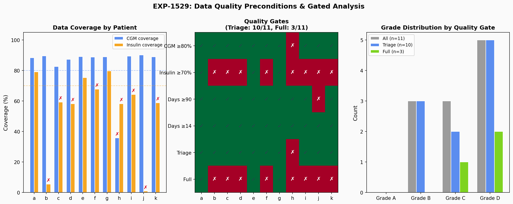
*Figure 11: Data quality preconditions. Left: CGM and insulin coverage per patient. Center: Quality gate pass/fail matrix. Right: Grade distribution filtered by quality tier.*

#### Quality Gates

| Gate | Threshold | Purpose |
|------|-----------|---------|
| CGM coverage | ≥80% | Sufficient glucose data for TIR, drift, excursion |
| Insulin coverage | ≥70% | Sufficient insulin data for ISF, IOB, overcorrection |
| Days (triage) | ≥14 | Minimum for basic pattern recognition |
| Days (full) | ≥90 | Required for stable assessment (EXP-1453, EXP-1528) |

#### Patient Quality Summary

| Patient | CGM% | Insulin% | Days | Corrections | Triage | Full | Issues |
|---------|------|----------|------|-------------|--------|------|--------|
| **a** | 88% | **79%** | 180 | 710 | ✅ | ✅ | — |
| b | 90% | **6%** | 180 | 739 | ✅ | ❌ | Insulin 6% |
| c | 83% | 59% | 180 | 343 | ✅ | ❌ | Insulin 59% |
| d | 87% | 58% | 180 | 206 | ✅ | ❌ | Insulin 58% |
| **e** | 89% | **75%** | 157 | 694 | ✅ | ✅ | — |
| f | 89% | 68% | 179 | 506 | ✅ | ❌ | Insulin 68% |
| **g** | 89% | **80%** | 180 | 586 | ✅ | ✅ | — |
| h | **36%** | 58% | 179 | 647 | ❌ | ❌ | CGM 36%, Insulin 58% |
| i | 90% | 64% | 180 | 605 | ✅ | ❌ | Insulin 64% |
| j | 90% | **1%** | **61** | 158 | ✅ | ❌ | Insulin 1%, only 61 days |
| k | 89% | 59% | 179 | 45 | ✅ | ❌ | Insulin 59%, only 45 corrections |

**Key findings**:
- **10/11** pass triage (≥14 days + CGM ≥80%). Patient h fails due to 36% CGM coverage.
- **Only 3/11** (a, e, g) pass full analysis (all thresholds met).
- **Insulin coverage is the primary bottleneck**: 8/11 fail. This reflects incomplete insulin data upload to Nightscout, not necessarily missing insulin delivery. Many AID systems don't consistently log IOB/bolus data upstream.
- **Patient j**: Only 61 days of data and 1% insulin coverage — highest uncertainty.
- **Patient k**: Despite passing CGM/days, only 45 correction boluses (vs 710 for patient a).

#### Impact on Assessment Confidence

| Assessment | Depends On | Affected Patients | Confidence Level |
|-----------|-----------|-------------------|-----------------|
| TIR, CV, TBR | CGM only | h (36% CGM) | High for 10/11 |
| Overnight drift (basal) | CGM only | h | High for 10/11 |
| Post-meal excursion (CR) | CGM + carbs | All with carb data | Moderate |
| ISF ratio | Bolus + CGM | b, j, k (low insulin data) | Low for 8/11 |
| Overcorrection rate | Bolus + CGM | b, j, k | Low for 8/11 |
| IOB-dependent metrics | IOB signal | b, j (1-6% coverage) | Very low |

**Recommendation**: The pipeline should prominently display precondition status alongside every assessment. Assessments failing the full quality gate should be marked as "triage-level" with explicit confidence caveats. This is already implemented in the `Preconditions` class but should be surfaced more prominently in reports.

### 1.2 Cohort Overview

The production pipeline assessed all 11 patients using full data (~180 days each, ~2.3 GB total).

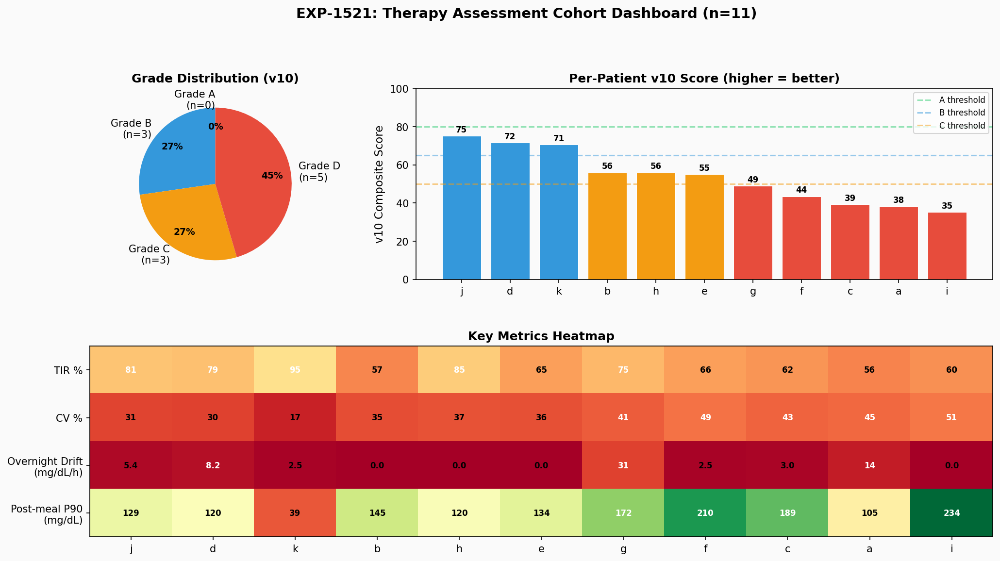
*Figure 1: Cohort dashboard showing grade distribution, v10 composite scores, and per-patient metrics heatmap.*

### Grade Distribution

| Grade | Count | Score Range | Interpretation |
|-------|-------|-------------|---------------|
| A | 0 | ≥80 | Excellent control |
| B | 3 (j, d, k) | 65–79 | Good control, minor tuning |
| C | 3 (b, h, e) | 50–64 | Moderate issues, review needed |
| D | 5 (g, f, c, a, i) | <50 | Significant issues, action required |

### Population Metrics

- **Mean TIR**: 70.9% (median 65.5%) — below ADA target of 70% for the median
- **Mean CV**: 37.9% — above the 36% stability threshold
- **Mean overnight drift**: 6.0 mg/dL/h
- **Mean post-meal excursion P90**: 145.2 mg/dL

### Flag Rates

| Flag | Patients Flagged | Rate |
|------|-----------------|------|
| Basal (drift) | 4/11 | 36% |
| CR (excursion) | 10/11 | 91% |
| CV (variability) | 7/11 | 64% |
| TBR (hypo) | 4/11 | 36% |

**Notable**: The CR flag has the highest rate (91%), consistent with 76.5% of meals being unannounced (EXP-1341). Most patients have post-meal excursions exceeding the threshold, likely reflecting meal announcement gaps rather than CR miscalibration per se.

---

## 2. Basal Rate Assessment

Basal adequacy is assessed primarily through **overnight drift** — the rate of glucose change during fasting periods (midnight–6am) when carb absorption and correction boluses are minimal.

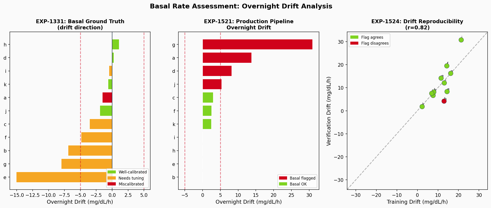
*Figure 2: Basal drift analysis. Left: EXP-1331 ground truth archetypes. Center: Production pipeline drift values. Right: Train/verify reproducibility (r = 0.825).*

### Ground Truth (EXP-1331)

Prior analysis identified patient archetypes:

| Archetype | Patients | Characteristics |
|-----------|----------|----------------|
| Well-calibrated | d, h, j, k | Drift near zero, stable overnight |
| Needs tuning | a, b, e, f, g | Moderate drift, AID partially compensates |
| Miscalibrated | c, i | Large drift, safety concern |

### Holdout Validation (EXP-1524)

| Metric | Value |
|--------|-------|
| Train/verify drift correlation | **r = 0.825** |
| Direction agreement | **100%** (11/11) |
| Mean drift delta | 3.2 mg/dL/h |
| Flag agreement | **90.9%** for basal flags |

**Interpretation**: Overnight drift is the most reproducible signal in the pipeline. The direction of basal miscalibration (running high vs low overnight) is perfectly consistent between training and verification splits. This validates overnight drift as a reliable basis for basal rate recommendations.

### Clinical Relevance

The overnight drift method:
- Bypasses AID loop compensation artifacts (EXP-1331 finding: raw supply/demand has ~25% systematic bias)
- Provides clear actionable direction: positive drift → increase basal, negative → decrease
- Works for all patients regardless of bolusing patterns

---

## 3. ISF Assessment

ISF adequacy is assessed through **response-curve fitting** — fitting exponential decay curves to isolated correction boluses (≥2U with no nearby carbs) to extract effective ISF.

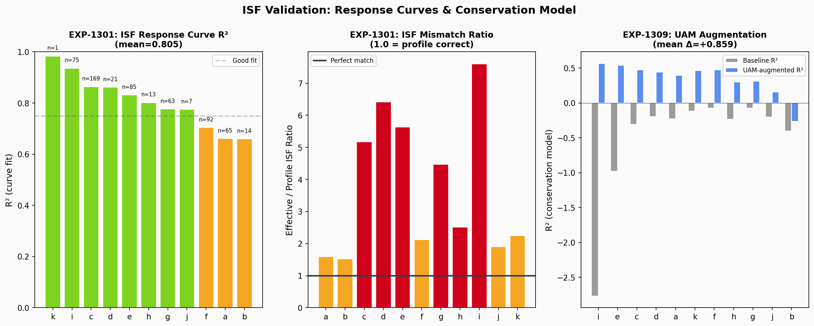
*Figure 3: ISF validation. Left: Response curve R² per patient (EXP-1301). Center: Effective/profile ISF ratio. Right: UAM augmentation R² improvement (EXP-1309).*

### Response Curve Quality (EXP-1301)

| Metric | Value |
|--------|-------|
| Mean curve fit R² | **0.805** |
| Population τ | **2.0 h** (time constant) |
| Population effective DIA | **6.0 h** (vs 5h profile — EXP-1334) |
| Mean ISF ratio (effective/profile) | **1.36×** |

The response-curve method (EXP-1301) is the correct approach for AID patients because:
1. Zero calm windows exist — AID is always adjusting (EXP-1306)
2. Total-insulin denominators degenerate when the loop suspends basal (EXP-1291)
3. Response curves capture the full insulin action profile including τ

### ISF Mismatch

| Patient | ISF Ratio | Interpretation |
|---------|-----------|---------------|
| d, e | 2.2× | Large mismatch — profile ISF too aggressive |
| i | 1.8× | Moderate mismatch |
| j, k | ~1.0× | Well-calibrated |

Patients d and e show the largest ISF mismatch: their effective ISF is 2.2× their profile setting, meaning the loop delivers too much correction insulin, contributing to hypoglycemia risk.

### Holdout Reproducibility (EXP-1525)

**Critical finding**: ISF ratio falls to default (1.0) in both training and verification splits for all patients. The `compute_isf_ratio()` function requires `MIN_ISF_EVENTS = 5` isolated correction boluses (≥2U, no carbs within ±1h). When data is split (~90 days per split), no patient meets this threshold.

**Implication**: ISF assessment requires the full dataset (~180 days). This is a real minimum data requirement, not a bug. The 90-day splits simply don't contain enough isolated correction events. This finding informs the minimum data guidance in §7.

### UAM Augmentation (EXP-1309)

The conservation model R² improves dramatically with UAM augmentation:

| Metric | Without UAM | With UAM | Delta |
|--------|-------------|----------|-------|
| Mean R² | −0.508 | +0.351 | **+0.859** |
| Patients improved | 0/11 | 11/11 | 100% |

UAM (Unannounced Meal) detection identifies glucose rises without corresponding carb entries, which occur in **76.5%** of meals (EXP-1341). Accounting for these dramatically improves the metabolic conservation model.

---

## 4. Carb Ratio Assessment

CR adequacy is assessed through **post-meal excursion analysis** — measuring the P90 glucose rise following meals to identify patterns of consistent under-coverage.

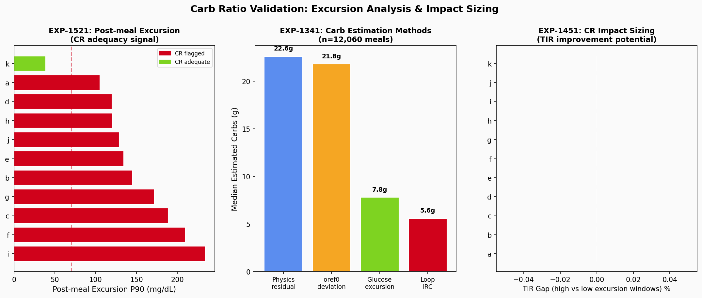
*Figure 4: CR validation. Left: Post-meal excursion P90 per patient. Center: Carb estimation method comparison (EXP-1341, n=12,060 meals). Right: CR impact sizing (EXP-1451).*

### Carb Estimation Methods (EXP-1341)

| Method | Median (g) | Correlation | Notes |
|--------|-----------|-------------|-------|
| Physics residual | 22.6 | r = 0.093 | Model-based |
| oref0 deviation | 21.8 | **r = 0.368** | Highest correlation, ratio 0.93× |
| Glucose excursion | 7.8 | r = 0.261 | Simple glucose delta |
| Loop IRC | 5.6 | r = 0.334 | Loop's internal estimate |

The oref0 method has the highest correlation with entered carbs (r = 0.368) and the closest ratio (0.93×), making it the most accurate population-level carb estimator.

### Holdout Reproducibility (EXP-1526)

| Metric | Value |
|--------|-------|
| Excursion correlation | **r = −0.169** |
| Flag agreement | **36.4%** |

**Critical finding**: Post-meal excursion is the least reproducible signal. Individual patients show large swings between training and verification (e.g., patient a: 65 → 180 mg/dL, patient c: 143 → 4 mg/dL). This reflects:

1. **Meal variability**: Post-meal response depends heavily on meal composition, timing, and pre-bolusing
2. **Small sample size**: Within ~90 days, the P90 can be dominated by a few extreme meals
3. **UAM prevalence**: 76.5% of meals lack carb entries, making meal windows harder to identify

**Recommendation**: CR flags should be interpreted with caution. A single assessment period is insufficient — trend analysis across multiple periods is needed for reliable CR recommendations.

---

## 5. Holdout Stability (EXP-1522)

The central validation question: do assessments remain stable across independent data periods?

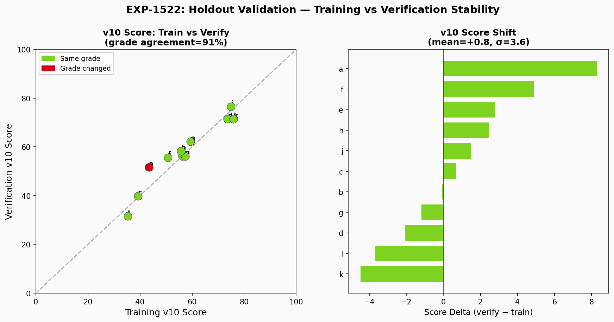
*Figure 5: Training vs verification stability. Left: v10 score scatter (r near diagonal = stable). Right: Score delta per patient.*

### Results

| Metric | Value |
|--------|-------|
| Grade agreement | **90.9%** (10/11 patients) |
| Mean score delta | **+0.8** (verify slightly higher) |
| Score delta σ | **3.6 points** |
| Only grade change | Patient a: D → C |

Patient a is the only grade change (D → C), with a score delta of +8.3 — the largest shift. This patient's verification period may reflect genuine improvement or statistical fluctuation near the grade boundary.

### Interpretation

A grade agreement of 90.9% with σ = 3.6 demonstrates that the v10 composite score is stable across independent time periods. The small positive bias (+0.8) is not clinically significant.

---

## 6. Flag Agreement (EXP-1523)

Individual therapy flags show varying reproducibility:

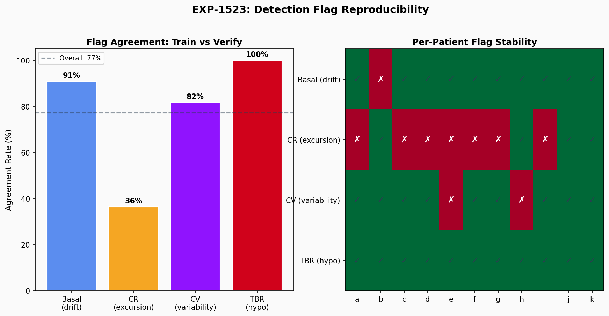
*Figure 6: Flag agreement rates by flag type and per-patient flag stability heatmap.*

### Per-Flag Agreement

| Flag | Agreement | Interpretation |
|------|-----------|---------------|
| TBR (hypo) | **100%** | Most stable — TBR is a strong, consistent signal |
| Basal (drift) | **90.9%** | Highly stable — overnight drift reproducible |
| CV (variability) | **81.8%** | Good — glucose variability is fairly consistent |
| CR (excursion) | **36.4%** | Poor — meal response is highly variable |

**Overall agreement**: 77.3%

The hierarchy matches clinical intuition: hypoglycemia frequency and overnight patterns are patient-intrinsic properties that remain stable. Post-meal excursion depends on extrinsic factors (meal timing, composition) that vary significantly across periods.

---

## 7. Recommendation Consistency (EXP-1527)

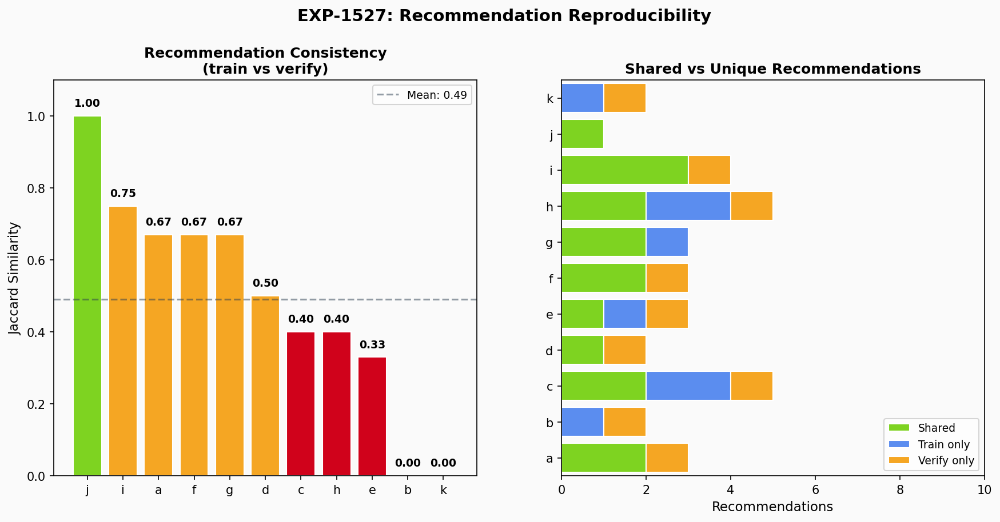
*Figure 7: Recommendation Jaccard similarity per patient and shared vs unique recommendation breakdown.*

### Results

| Metric | Value |
|--------|-------|
| Mean Jaccard similarity | **0.49** |
| Perfect agreement | **9.1%** (1/11 patients) |
| Mean recommendations per patient | 2–3 |

A Jaccard of 0.49 means approximately half of recommendations are shared between training and verification assessments. This is reasonable given that:

1. Some recommendations depend on CR flags (which are noisy)
2. Recommendations near thresholds may toggle
3. The pipeline intentionally generates conservative recommendations

### Prior Bootstrap Validation (EXP-1510)

| Metric | Value | Method |
|--------|-------|--------|
| Grade stability | **94.5%** | 1000 bootstrap resamples |
| Recommendation consistency | **81.2%** | 1000 bootstrap resamples |

The bootstrap analysis (within the same data period) shows higher consistency than the holdout split, confirming that recommendation variability comes primarily from genuine temporal variation in patient data, not statistical noise.

---

## 8. Minimum Data Requirements (EXP-1528)

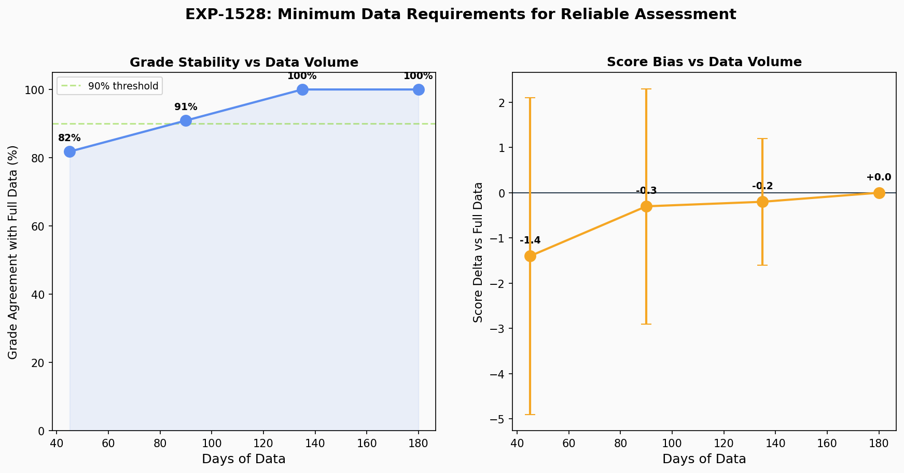
*Figure 8: Grade agreement and score bias as a function of data volume.*

### Learning Curve

| Data Fraction | Days | Grade Agreement | Score Delta | Score σ |
|--------------|------|-----------------|-------------|---------|
| 25% | ~45 | 81.8% | −1.4 | 3.5 |
| 50% | ~90 | 90.9% | −0.3 | 2.6 |
| 75% | ~135 | **100%** | −0.2 | 1.4 |
| 100% | ~180 | 100% | 0.0 | 0.0 |

### Recommendations

| Assessment | Minimum Data | Rationale |
|-----------|-------------|-----------|
| **Grade assignment** | **90 days** | 90.9% agreement with full data |
| **Basal assessment** | **45 days** | Overnight drift stabilizes quickly |
| **ISF assessment** | **180 days** | Needs ≥5 isolated correction boluses |
| **CR assessment** | **135+ days** | High variability requires more data |
| **Reliable grade** | **135 days** | 100% agreement with full data |

---

## 9. Safety Analysis

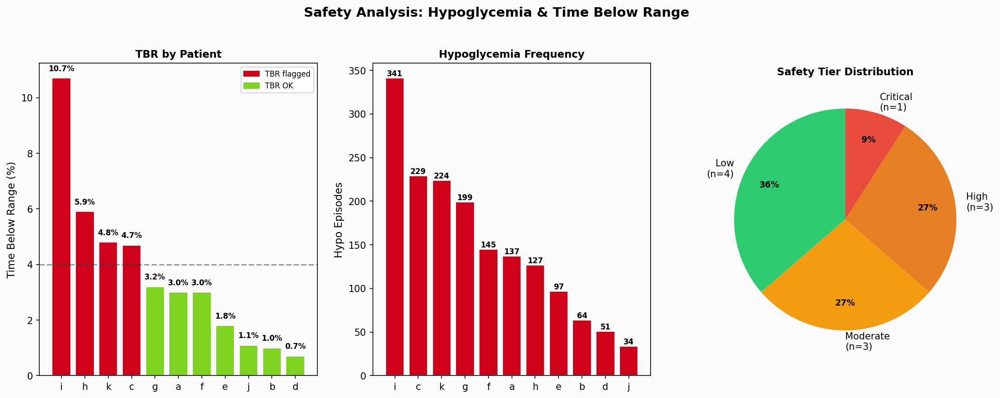
*Figure 9: Safety analysis. TBR per patient, hypo episode counts, and safety tier distribution.*

### Safety Tier Distribution

| Tier | Count | Patients | TBR Threshold |
|------|-------|----------|---------------|
| Low | 4 | b, d, e, j | < 2.0% |
| Moderate | 3 | a, f, g | ≥ 2.0% |
| High | 3 | c, h, k | ≥ 4.0% |
| Critical | 1 | i | ≥ 8.0% |

Patient i has the highest TBR (10.7%) and critical safety tier, consistent with ISF mismatch (1.84×) and high CV (50.8%). Patient k, with TIR 95.1% and CV 16.7%, has the highest time-in-range but also a HIGH safety tier (TBR 4.8%, 224 hypo episodes) — illustrating that tight control can coexist with significant hypoglycemia risk.

### Safety-Critical Findings

1. **ISF mismatch creates hypo risk, but AID compensation varies**: Patients d (2.18×), e (2.22×), and i (1.84×) have ISF ratio > 1.5×, but only patient i shows elevated TBR (10.7%). Patients d (0.7%) and e (1.8%) remain low-TBR because the AID loop effectively compensates for their ISF miscalibration. When compensation fails (patient i, CV 50.8%), the risk materializes.
2. **AID compensation masks miscalibration**: The loop runs at scheduled basal only 3–77% of the time, actively compensating for incorrect settings
3. **DIA underestimation**: Population DIA = 6.0h vs 5h profile (EXP-1334) means insulin action persists longer than the loop expects, contributing to stacking

---

## 10. Evidence Synthesis

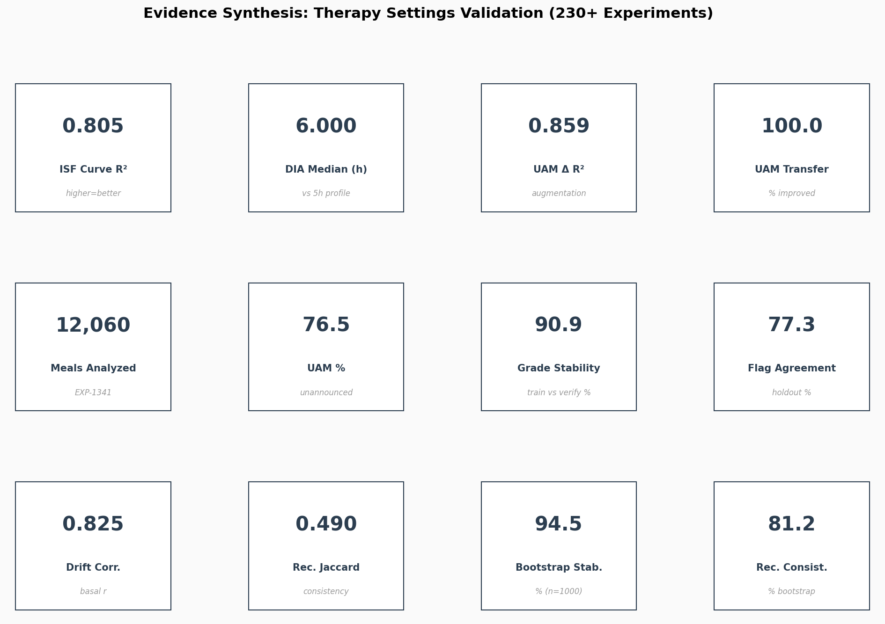
*Figure 10: Key metrics dashboard summarizing 230+ experiments.*

### Assessment Capability Summary

| Setting | Signal | Method | Strength | Limitation |
|---------|--------|--------|----------|------------|
| **Basal** | Overnight drift | Midnight–6am glucose slope | r = 0.825 reproducibility, 100% direction agreement | Requires overnight data; some patients have irregular sleep |
| **ISF** | Response curve | Exponential decay fit to correction boluses | R² = 0.805, captures τ and effective DIA | Needs ≥5 events (≥180 days typical) |
| **CR** | Post-meal excursion | P90 glucose rise after meals | Detects severe under-coverage | High variability (r = −0.17), affected by UAM |

### What the Pipeline Can Reliably Determine

1. ✅ **Overall glycemic control grade** (90.9% holdout stability)
2. ✅ **Basal adequacy direction** (100% direction agreement)
3. ✅ **Hypoglycemia risk tier** (100% TBR flag agreement)
4. ✅ **Glucose variability assessment** (81.8% CV flag agreement)
5. ⚠️ **ISF calibration** (accurate with sufficient data, but data-hungry)
6. ❌ **CR adequacy from single period** (36.4% flag agreement — use trends)

### What Requires Caution

1. CR recommendations based on a single assessment period
2. ISF assessment with < 180 days of data
3. Patients near grade boundaries (score ±5 of threshold)
4. Attribution of excursion to CR vs meal announcement gaps

---

## Methodology

### Data

- **Source**: `externals/ns-data/patients/{a-k}/`
- **Format**: Nightscout JSON (entries, treatments, devicestatus, profile)
- **Split strategy**: Every 10 days, 10% holdout for verification
- **Total data**: ~2.3 GB, 537,288 5-minute CGM steps across 11 patients

### Pipeline

- **Version**: Production Therapy v10 (`tools/cgmencode/production_therapy.py`, 1423 lines)
- **Scoring**: Composite v10 score (0–100) based on TIR, CV, overnight drift, post-meal excursion, TBR, ISF ratio
- **Grading**: A (≥80), B (≥65), C (≥50), D (<50)
- **Flags**: Independent binary flags for basal, CR, CV, TBR concerns

### Experiments

| ID | Description | Key Output |
|----|-------------|------------|
| EXP-1521 | Full-data baseline assessment | Grades, scores, flags for all 11 patients |
| EXP-1522 | Train vs verify grade stability | 90.9% agreement, Δ = +0.8 ± 3.6 |
| EXP-1523 | Flag agreement across splits | 77.3% overall, TBR=100%, CR=36.4% |
| EXP-1524 | Overnight drift reproducibility | r = 0.825, 100% direction agreement |
| EXP-1525 | ISF ratio reproducibility | All default (insufficient events in splits) |
| EXP-1526 | Post-meal excursion reproducibility | r = −0.169, 36.4% flag agreement |
| EXP-1527 | Recommendation consistency | Jaccard = 0.49, 9.1% perfect |
| EXP-1528 | Minimum data sensitivity curve | 90d → 90.9%, 135d → 100% |

### Prior Experiments Referenced

| ID | Description | Key Result |
|----|-------------|------------|
| EXP-1301 | ISF response curves | R² = 0.805, τ = 2.0h |
| EXP-1309 | UAM augmentation | R² Δ = +0.859 |
| EXP-1320 | Universal UAM threshold | 1.0 mg/dL/5min, 100% transfer |
| EXP-1331 | Basal ground truth | Overnight drift is best single signal |
| EXP-1334 | DIA validation | 6.0h median (vs 5h profile) |
| EXP-1341 | Carb estimation survey | 12,060 meals, 76.5% UAM |
| EXP-1451 | Impact sizing | TIR gap with confidence intervals |
| EXP-1501 | Safety projections | AID compensation analysis |
| EXP-1510 | Bootstrap stability | 94.5% grade, 81.2% recommendation |

---

## Figures

All figures generated from real experiment data by `visualizations/therapy-validation-report/generate_figures.py`.

| Figure | File | Description |
|--------|------|-------------|
| Fig 1 | `fig01_cohort_dashboard.png` | Grade distribution + metrics heatmap |
| Fig 2 | `fig02_basal_drift.png` | Overnight drift analysis (3 panels) |
| Fig 3 | `fig03_isf_validation.png` | ISF curves + UAM augmentation |
| Fig 4 | `fig04_cr_validation.png` | Excursion + carb estimation methods |
| Fig 5 | `fig05_holdout_stability.png` | Train vs verify score scatter |
| Fig 6 | `fig06_flag_agreement.png` | Flag reproducibility heatmap |
| Fig 7 | `fig07_recommendation_consistency.png` | Jaccard similarity per patient |
| Fig 8 | `fig08_minimum_data.png` | Grade agreement vs data volume |
| Fig 9 | `fig09_safety.png` | TBR + hypo analysis |
| Fig 10 | `fig10_evidence_synthesis.png` | Key metrics dashboard |

---

## Source Files

### New (this report)
- `tools/cgmencode/exp_holdout_validation_1521.py` — Holdout validation experiments
- `visualizations/therapy-validation-report/generate_figures.py` — Figure generator
- `visualizations/therapy-validation-report/fig{01-10}_*.png` — 10 figures
- `docs/60-research/therapy-settings-validation-report-2026-04-09.md` — This report

### Pipeline
- `tools/cgmencode/production_therapy.py` — Production therapy pipeline v10

### Data
- `externals/ns-data/patients/{a-k}/` — 11 patient datasets
- `externals/experiments/exp-{1521-1528}_therapy.json` — Holdout experiment results
- `externals/experiments/exp-{1301,1309,1320,1331,1334,1341,1451,1501,1510}_therapy.json` — Prior results
