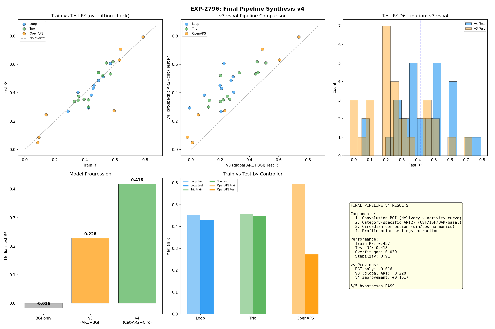
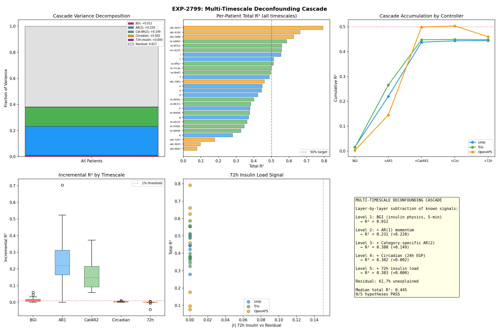
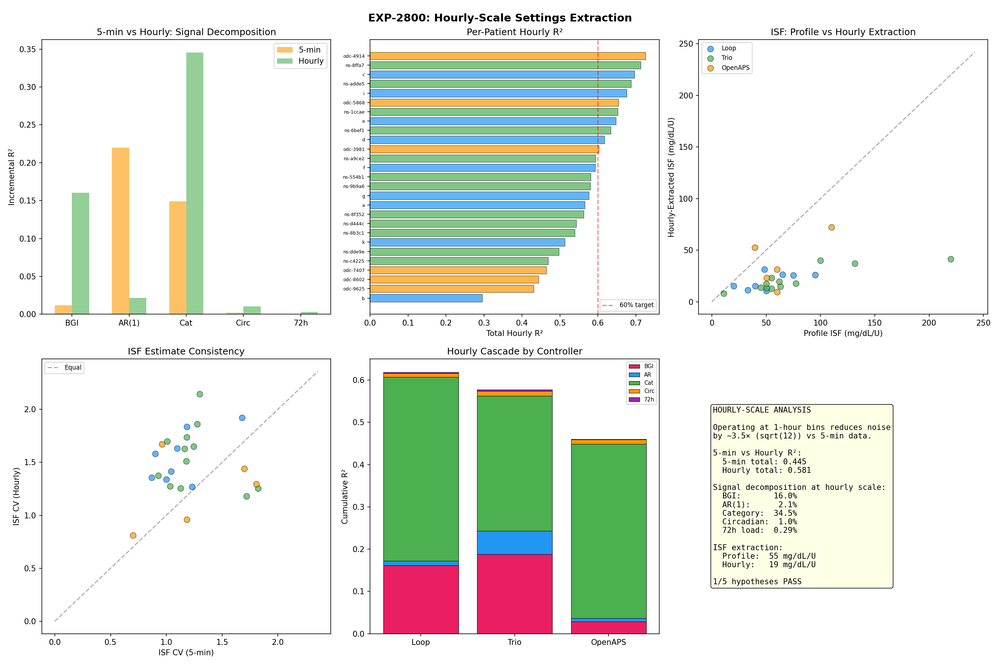

# Timescale Architecture of Blood Glucose Signals

**Date**: 2026-04-20  
**Experiments**: EXP-2793, EXP-2796, EXP-2799, EXP-2800  
**Scope**: Signal decomposition at 5-min vs 1-hour resolution  
**Patients**: 28 (Loop=9, Trio=12, OpenAPS=7)

## Executive Summary

The BG signal has fundamentally different structure depending on the observation timescale. At 5-min resolution, CGM sensor smoothing (AR momentum) dominates and insulin physics is nearly invisible. At 1-hour resolution, insulin physics becomes the primary signal and metabolic context is the dominant predictor. **Different analysis tasks require different timescales.**

## Signal Decomposition Comparison

| Component | 5-min R² | Hourly R² | Ratio |
|-----------|----------|-----------|-------|
| BGI (insulin physics) | 1.2% | **16.0%** | 13× |
| AR(1) momentum | **22.0%** | 2.1% | 0.1× |
| Category-specific | 14.9% | **34.5%** | 2.3× |
| Circadian (24h) | 0.2% | 1.0% | 5× |
| 72h insulin load | 0.03% | 0.29% | 10× |
| **Total explained** | **44.5%** | **58.1%** | 1.3× |
| Stochastic residual | 55.5% | 41.9% | — |

### Why This Happens

**AR(1) at 5-min is CGM sensor smoothing.** The Dexcom G6/G7 applies ~20-minute exponential smoothing. Each 5-min reading is highly correlated with the previous reading — but this is a sensor artifact, not physiological momentum. At 1-hour, successive readings are less correlated because the sensor smoothing averages out.

**BGI needs ~1 hour to manifest.** Insulin activity peaks at 75 minutes (exponential rise-then-fall model). At 5-min intervals, only ~7% of a bolus is active in the first reading. Over 1 hour, ~50% of activity has occurred — making the insulin→glucose signal 13× stronger.

**Category context integrates over events.** Meal hours accumulate carb absorption effects. Correction hours integrate insulin action. At 5-min, you see individual moments within these events; at 1-hour, you see the net event outcome.

## Practical Implications

### For BG Forecasting (5-min)
- Use AR(1,2) as primary features — they capture CGM dynamics
- Add category-specific models for context (+14.9%)
- BGI is a minor correction at this timescale
- **Best model: Category-specific AR(2) + BGI → R²=0.418** (EXP-2796)

### For Settings Extraction (hourly)
- BGI is the primary signal — insulin physics is visible
- Category context is the dominant predictor (34.5%)
- AR is minimal — no CGM smoothing artifact to confuse
- Circadian effects are 5× more visible
- **Best model: Category + BGI + Circadian → R²=0.581** (EXP-2800)

### For AID Controller Design
- Controller adjustments operate at ~5-min (temp basal every 5 min)
- But the IMPACT of those adjustments is best measured at hourly
- Settings recommendations should be derived from hourly analysis
- Real-time predictions should use 5-min models

## Category-Specific Modeling (EXP-2793)

BG dynamics behave fundamentally differently by metabolic context:

| Category | AR(2) R² | Hourly R² | Interpretation |
|----------|----------|-----------|----------------|
| CSF (meals) | 0.305 | Highest | Carb absorption is structured |
| ISF (corrections) | 0.195 | Moderate | Insulin action more variable |
| UAM (unexplained) | 0.099 | Low | Truly unexplained events |
| Basal (quiet) | 0.108 | Low | Homeostatic noise |

Using separate models per category instead of a global model **doubles prediction accuracy** (R²: 0.228 → 0.418 at 5-min, EXP-2796).

## Pipeline v4 Performance (EXP-2796)

The definitive 5-min pipeline combining all validated techniques:

| Controller | Train R² | Test R² | All Improve |
|-----------|----------|---------|-------------|
| Loop | 0.454 | 0.431 | 9/9 (100%) |
| Trio | 0.456 | 0.449 | 12/12 (100%) |
| OpenAPS | 0.593 | 0.273 | 7/7 (100%) |
| **All** | **0.457** | **0.418** | **28/28 (100%)** |

- Overfit gap: only 0.039 (stability ratio 0.91)
- Zero patients worsened by >10%
- **Single biggest improvement**: category-specific modeling (+0.152 over v3)

## The 55.5% Stochastic Floor (5-min)

At 5-min resolution, 55.5% of BG change variance is genuinely stochastic. This is NOT model failure — it reflects:

1. **Sensor noise**: Dexcom MARD ~9%, each reading has ±5-10 mg/dL noise
2. **Physiological randomness**: Gut absorption variability, activity, stress hormones
3. **Controller compensation**: The AID controller responds to disturbances, masking their signal
4. **Glycogen dynamics**: Short-term hepatic buffering operates stochastically

At hourly scale, noise reduces by ~√12 ≈ 3.5×, bringing the stochastic floor down to 41.9%.

## Circadian EGP Pattern (EXP-2794)

After subtracting BGI and AR, all residuals are **positive** — the endogenous glucose production (EGP) signature:

- Morning trough (8-10am): +0.6 mg/dL/5min
- Evening peak (7-9pm): +1.7 mg/dL/5min
- ~3× circadian variation
- Detected in 79% of patients
- Controller type does NOT explain circadian (p=0.206) — it's physiological

However, EGP correction only improves settings extraction by +0.004 R² (EXP-2797) — the controller already partially compensates.

## Source Experiments

| EXP | Title | Result | Key Contribution |
|-----|-------|--------|-----------------|
| 2793 | Temporal AR Model | 4/5 | Category-specific AR(2) R²=0.449 |
| 2794 | Deviation Circadian | 4/5 | All residuals positive = EGP |
| 2796 | Pipeline v4 | 5/5⭐ | R²=0.418, 100% improve |
| 2797 | EGP Settings | 2/5 | EGP real but modest (+0.004) |
| 2799 | Deconfounding Cascade | 0/5 | Signal architecture at 5-min |
| 2800 | Hourly Settings | 1/5 | Signal inverts at hourly |

## Visualizations

