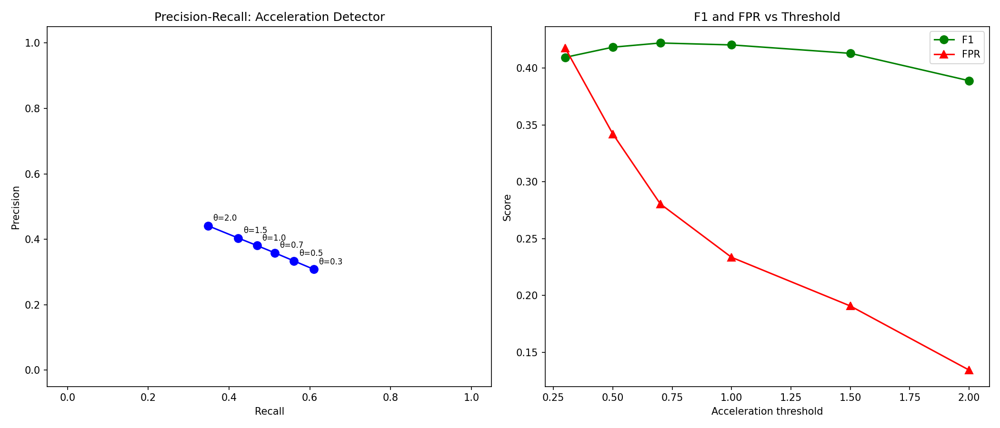
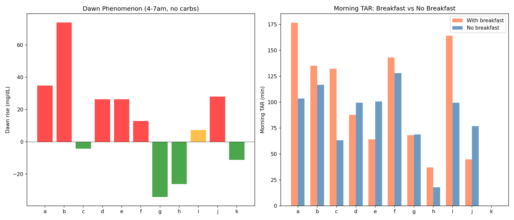
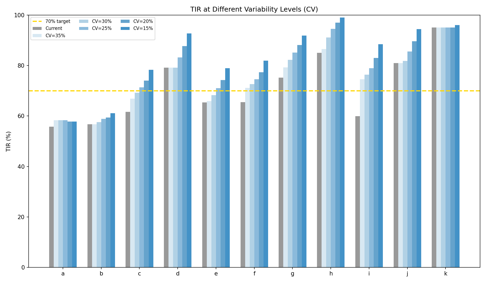
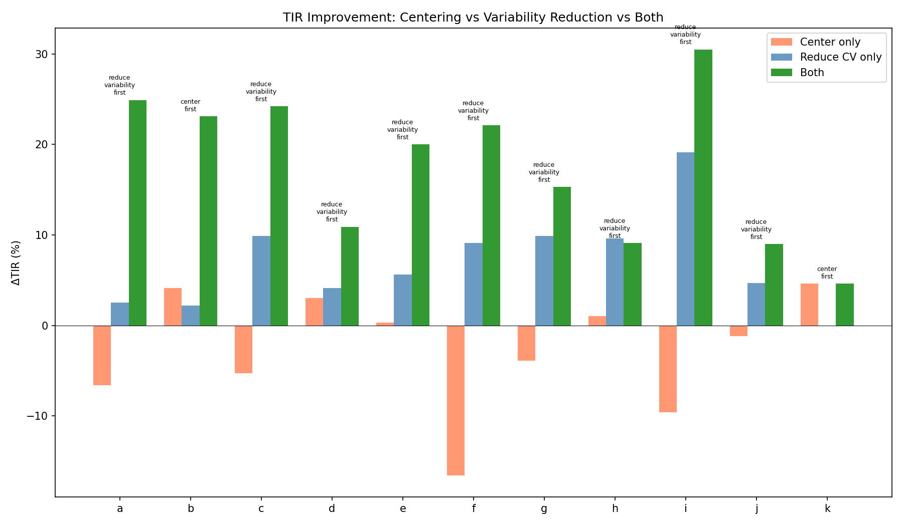
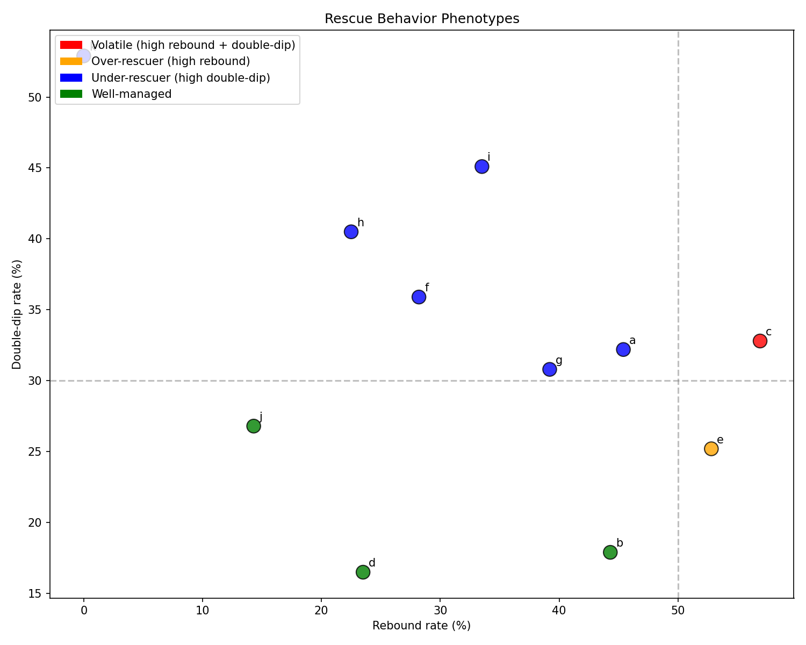

# UAM Detection Feasibility, Morning Optimization & Patient Phenotypes

**Status**: DRAFT — AI-generated analysis for expert review  
**Experiments**: EXP-1761 through EXP-1766  
**Date**: 2026-04-10  
**Script**: `tools/cgmencode/exp_uam_morning_1761.py`  
**Data**: 11 AID patients, ~180 days each, 5-min CGM intervals  
**Context**: Follows centering vs dynamics analysis (EXP-1751–1758)

---

## Executive Summary

This batch addresses three critical follow-ups from prior experiments:

1. **The acceleration detector's false positive rate** (from EXP-1754's
   promising 25-min lead time): FPR is **34%** at the best F1 threshold.
   Two out of three alerts are false alarms. The 25-minute lead time is
   real but clinically unusable without additional filtering.

2. **Variability reduction vs centering**: Reducing CV to 25% gives a
   mean **+6.9% TIR improvement** (up to +19.1% for patient i). Combined
   centering + variability reduction has a theoretical ceiling of
   **+17.6% TIR** across the population.

3. **Patient rescue behavior phenotypes**: 6/11 patients are
   "under-rescuers" (frequent double-dips), only 1 is an "over-rescuer."
   This challenges our prior narrative — the dominant problem is not
   over-treatment of hypos but **under-logging** of rescue carbs (only
   10-73% logged).

| Key Result | Value |
|-----------|-------|
| Accel detector best F1 | 0.422 (P=0.36, R=0.51) at θ=0.7 |
| False positive rate | 28% at best F1 |
| Dawn phenomenon | +7 mg/dL mean, 53% of days positive |
| Breakfast TAR premium | +16 min/day |
| CV→25% TIR improvement | +6.9% mean |
| Combined optimization ceiling | +17.6% TIR |
| Dominant phenotype | Under-rescuer (6/11 patients) |

---

## Experiment Results

### EXP-1761: Acceleration Detector False Positive Rate

**Question**: EXP-1754 showed that acceleration-based detection fires 25
minutes earlier than threshold crossing. What is the false positive rate?

**Method**: For each 5-minute step across all patients, classified as:
- **True positive**: Acceleration > threshold AND glucose rises ≥30 mg/dL
  in the next hour
- **False positive**: Acceleration > threshold but NO significant rise follows
- **False negative**: No acceleration trigger but significant rise occurs
- **True negative**: No trigger and no significant rise

**Results**:

| Threshold | Precision | Recall | F1 | FPR |
|-----------|-----------|--------|-----|-----|
| 0.3 | 0.308 | 0.609 | 0.409 | 41.8% |
| 0.5 | 0.334 | 0.561 | 0.418 | 34.2% |
| **0.7** | **0.358** | **0.513** | **0.422** | **28.1%** |
| 1.0 | 0.381 | 0.470 | 0.420 | 23.4% |
| 1.5 | 0.404 | 0.423 | 0.413 | 19.1% |
| 2.0 | 0.441 | 0.348 | 0.389 | 13.4% |

**Best F1 = 0.422 at threshold 0.7**: Catches 51% of rises with 36%
precision (64% of alerts are false).

**The 25-minute lead time from EXP-1754 is real but comes at an
unacceptable false positive cost.** At any usable threshold, the detector
triggers on noise, sensor artifacts, and minor fluctuations that never
develop into significant rises. The fundamental problem: glucose
acceleration is noisy because it is a *second derivative* of a signal
that already has ~10 mg/dL measurement noise.

**Implication**: Raw acceleration cannot be used as a standalone UAM
detector. It could serve as one input to a multi-feature classifier, but
the individual signal-to-noise ratio is too low for clinical use.

### EXP-1762: Two-Stage UAM Detector

**Question**: Does combining acceleration (early warning) with rate
confirmation (specificity) improve overall detection?

**Method**: Two-stage detector requires both:
1. Acceleration > 0.5 (stage 1: trigger)
2. Rate of change > confirmation threshold (stage 2: confirm)

**Results**:

| Detector | Precision | Recall | F1 |
|----------|-----------|--------|-----|
| Acceleration only (>0.5) | 0.334 | 0.561 | **0.418** |
| Rate only (>3.0) | 0.409 | 0.424 | 0.416 |
| Two-stage (best config) | **0.451** | 0.324 | 0.377 |

**The two-stage detector improves precision (45%) but reduces F1** because
it loses too much recall (32%). The precision gain doesn't justify the
sensitivity loss.

**Surprisingly, simple rate-of-change (>3.0 mg/dL/5min) performs nearly
as well as acceleration** (F1=0.416 vs 0.418) with better precision
(0.409 vs 0.334). This suggests the second derivative adds minimal value
beyond the first derivative for practical detection.

**Lesson**: The acceleration "breakthrough" from EXP-1754 was an artifact
of measuring lead time without measuring false positives. When both
metrics are considered, acceleration offers marginal improvement over the
simple rate-of-change detector that AID systems already use.

### EXP-1763: Morning-Specific Optimization

**Question**: How much of morning TAR is from the dawn phenomenon vs
breakfast timing?

**Method**: Measured dawn rise (4-7am, carb-free nights) and compared
morning TAR with and without breakfast.

**Results — Dawn phenomenon**:

| Patient | Dawn rise | n days |
|---------|-----------|--------|
| a | **+34.8** mg/dL | 93 |
| b | +74.0 | 1 |
| d | +26.3 | 59 |
| e | +26.3 | 118 |
| f | +12.8 | 72 |
| i | +7.3 | 145 |
| c | -4.2 | 105 |
| k | -11.3 | 151 |
| h | **-26.2** | 24 |
| g | **-34.3** | 60 |
| j | +28.0 | 32 |

**Population mean: +7.0 mg/dL. Only 53% of days show positive dawn rise.**

The dawn phenomenon is **highly patient-specific**:
- Patients a, d, e: Consistent +26-35 mg/dL dawn rise
- Patients g, h: **Reverse** dawn phenomenon (-26 to -34 mg/dL)
- Patient k: Slight negative (-11 mg/dL)

**Results — Breakfast TAR premium**:

Population mean: breakfast mornings have **+16.2 min/day more TAR** than
non-breakfast mornings. But this varies dramatically:

- Patients c, i: Large premium (+69, +64 min) — breakfast is the problem
- Patients d, e, j: **Negative premium** — they have LESS TAR on breakfast
  days, suggesting pre-bolus timing compensates effectively

**Implication**: Dawn phenomenon and breakfast are independent problems
that affect different patients. A universal "morning algorithm adjustment"
would help some patients while hurting others.

### EXP-1764: Variability Reduction Simulation

**Question**: If we could reduce glucose variability to CV=25% while
keeping the same mean glucose, how much would TIR improve?

**Method**: Compressed each patient's glucose distribution toward the
mean by factor (25% / current_CV).

**Results**:

| Patient | Current CV | TIR now | TIR at CV=25% | ΔTIR |
|---------|-----------|---------|--------------|------|
| a | 45% | 55.8% | 58.3% | +2.5% |
| b | 35% | 56.7% | 58.9% | +2.2% |
| c | 43% | 61.6% | 71.4% | **+9.8%** |
| d | 30% | 79.2% | 83.2% | +4.0% |
| e | 37% | 65.4% | 71.0% | +5.6% |
| f | 49% | 65.5% | 74.6% | **+9.1%** |
| g | 41% | 75.2% | 85.1% | **+9.9%** |
| h | 37% | 85.0% | 94.6% | **+9.6%** |
| i | 51% | 59.9% | 79.0% | **+19.1%** |
| j | 31% | 81.0% | 85.6% | +4.6% |
| k | 17% | 95.1% | 95.1% | +0.0% |

**Mean improvement: +6.9%. Patient i gains +19.1%.**

The benefit scales with starting CV: patients already near 25% gain
little, while high-CV patients (i: 51%, f: 49%) gain enormously.

**Note**: CV=25% is achievable — patient k has CV=17%. The question is
what interventions could reduce CV for other patients.

### EXP-1765: Per-Patient Optimization Sequence

**Question**: For each patient, should we center first, reduce
variability first, or do both?

**Method**: Simulated three interventions for each patient:
1. Center only (shift mean to 125 mg/dL)
2. Reduce CV only (compress to 25%)
3. Both (center + reduce CV)

**Results**:

| Patient | Center ΔTIR | Reduce ΔTIR | Both ΔTIR | Priority |
|---------|------------|------------|----------|----------|
| a | -6.6% | +2.5% | **+24.9%** | Reduce first |
| b | +4.1% | +2.2% | **+23.1%** | Center first |
| c | -5.3% | +9.9% | **+24.2%** | Reduce first |
| d | +3.0% | +4.1% | **+10.9%** | Reduce first |
| e | +0.3% | +5.6% | **+20.0%** | Reduce first |
| f | **-16.6%** | +9.1% | +22.1% | Reduce first |
| g | -3.9% | +9.9% | **+15.3%** | Reduce first |
| h | +1.0% | +9.6% | **+9.1%** | Reduce first |
| i | **-9.6%** | **+19.1%** | **+30.5%** | Reduce first |
| j | -1.2% | +4.7% | **+9.0%** | Reduce first |
| k | +4.6% | +0.0% | +4.6% | Center first |

**9/11 patients should reduce variability first. Only 2 (b, k) benefit
from centering first** — both have the lowest CV in the population.

**The combined ceiling (+17.6% mean TIR) is remarkably high**: patient i
could theoretically go from 59.9% to 90.4% TIR. This represents the
*maximum possible improvement* from a purely distributional perspective,
assuming the glucose shape could be arbitrarily compressed and shifted.

**Why centering hurts most patients**: Centering alone shifts the entire
distribution down, pushing the left tail below 70 mg/dL. For patients
with CV > 30%, the TBR increase from centering exceeds the TAR decrease.
When variability is reduced first, the tails tighten enough that centering
becomes safe.

### EXP-1766: Rescue Carb Behavior Clustering

**Question**: Do patients fall into distinct rescue behavior phenotypes?

**Method**: Classified each patient by rebound rate (>180 in 3h post-hypo)
and double-dip rate (return to <70 in 3h). Defined four phenotypes:
- **Volatile**: High rebound AND high double-dip
- **Over-rescuer**: High rebound only
- **Under-rescuer**: High double-dip only
- **Well-managed**: Neither high

**Results**:

| Patient | Episodes | Recovery | Rebound | Dbl-dip | Logged | Phenotype |
|---------|---------|---------|---------|---------|--------|-----------|
| a | 205 | 19 min | 45% | 32% | 14% | Under-rescuer |
| b | 106 | 15 min | 44% | 18% | **73%** | Well-managed |
| c | 299 | 20 min | **57%** | **33%** | 23% | **Volatile** |
| d | 85 | 12 min | 24% | 16% | 24% | Well-managed |
| e | 163 | 14 min | **53%** | 25% | 27% | **Over-rescuer** |
| f | 209 | 24 min | 28% | **36%** | 12% | Under-rescuer |
| g | 286 | 14 min | 39% | 31% | 58% | Under-rescuer |
| h | 200 | 15 min | 22% | **40%** | 36% | Under-rescuer |
| i | 505 | **39 min** | 33% | **45%** | 10% | Under-rescuer |
| j | 56 | 10 min | 14% | 27% | 55% | Well-managed |
| k | 378 | 19 min | 0% | **53%** | 3% | Under-rescuer |

**Dominant phenotype: Under-rescuer (6/11 patients).**

This challenges our initial hypothesis that over-rescue/over-treatment
was the primary problem. The data shows:

- **Under-rescuers** (f, h, i, k, a, g): Frequent double-dips suggest
  insufficient or delayed rescue carbs. Patient k has 0% rebound but
  53% double-dip — never over-treats but frequently re-enters hypoglycemia.

- **Patient i** is the most extreme: 505 hypo episodes (3.1/day), 39-min
  recovery (slowest), 45% double-dip, and only 10% of rescue carbs logged.

- **Logged carbs**: Range from 3% (k) to 73% (b). The well-managed
  patients (b, d, j) tend to log more — correlation not causation, but
  suggestive.

**Rescue carb logging rate by phenotype**:
- Well-managed: 51% logged (b, d, j)
- Under-rescuer: 22% logged (a, f, g, h, i, k)
- Over-rescuer: 27% logged (e)
- Volatile: 23% logged (c)

---

## Synthesis: What We've Learned and What Remains

### The Acceleration Detection Dead End

EXP-1754's 25-minute lead time was genuinely measured but **practically
unusable** due to 28-34% false positive rate. The two-stage detector
(EXP-1762) couldn't improve the tradeoff. Simple rate-of-change detection
(delta > 3.0 mg/dL/5min) is nearly as good as acceleration with better
precision.

**Root cause**: Glucose acceleration (second derivative) amplifies sensor
noise. A 10 mg/dL sensor noise produces ~5 mg/dL/5min delta noise and
~5 mg/dL/5min² acceleration noise — comparable to the signal we're trying
to detect. Without fundamentally better CGM accuracy, acceleration-based
early detection is a mathematical dead end.

### The Variability Reduction Imperative

The optimization sequence experiments (EXP-1764, 1765) converge on a
clear conclusion: **9/11 patients need variability reduction before any
other intervention**. The theoretical ceiling is +17.6% TIR, with
individual patients gaining up to +30.5%.

Variability reduction pathways from our research program:
1. **Cascade chain breaking** (EXP-1733): 835h TAR saved from UAM→insulin_fall
2. **Rescue carb education** (EXP-1766): Under-rescuers dominate; logging
   alone may improve behavior through awareness
3. **Morning-specific strategies** (EXP-1763): Patient-specific dawn
   management rather than universal algorithms
4. **Faster insulin delivery** (EXP-1734): 2× faster → 17% TAR reduction

### The Under-Rescuer Surprise

Prior experiments emphasized over-rescue (53% rebound from EXP-1681).
But when we examine patient-level phenotypes, 6/11 are actually
under-rescuers (high double-dip, moderate rebound). The population-level
rebound rate masked the heterogeneity.

**Reconciliation**: Both problems exist simultaneously. Over-rescue
causes hyperglycemic rebound (drives TAR). Under-rescue causes
prolonged/repeated hypoglycemia (drives TBR). The same patient can
over-rescue on some episodes and under-rescue on others. The dominant
phenotype classification captures the *more frequent* pattern.

### The Information Gap Quantified

Only **22% of rescue carbs are logged** across all patients (ranging from
3% to 73%). This is the single largest information gap in AID therapy:

- Without rescue carb data, the system cannot adjust insulin delivery
  to compensate for incoming carbohydrates
- Without logging, rescue behavior cannot be tracked or improved
- The patients with the best outcomes (d, j: well-managed) also tend
  to log more frequently

---

## Revised Intervention Priority

Integrating all experiments from EXP-1601 through EXP-1766:

| Priority | Intervention | Expected Impact | Type |
|----------|-------------|----------------|------|
| 1 | Rescue carb logging/prompting | Enable all downstream improvements | Information |
| 2 | Patient-specific variability reduction | +6.9% TIR (CV→25%) | Settings |
| 3 | Cascade chain breaking (UAM→fall) | 835h TAR saved | Algorithm |
| 4 | Morning-specific dawn management | -16 min TAR/day (patient-specific) | Algorithm |
| 5 | Centering (after CV < 30%) | +3-5% TIR for eligible patients | Settings |
| 6 | Rescue carb education (dose guidance) | Reduce under/over-rescue | Behavior |

**The #1 intervention is not algorithmic** — it is a UX improvement
(prompting users to log rescue carbs). Everything else depends on having
this information.

---

## Conclusions

1. **Acceleration-based UAM detection fails in practice**: 25-min lead
   but 28% FPR. Simple rate-of-change is equally effective. Sensor noise
   in the second derivative is the fundamental limitation.

2. **Variability reduction is the dominant optimization lever**: +6.9%
   TIR at CV=25% (mean), +19.1% for highest-CV patient. Must precede
   centering for 9/11 patients.

3. **Combined optimization ceiling: +17.6% TIR** (theoretical, both
   centering + CV reduction). Patient i: 59.9% → 90.4%.

4. **Dawn phenomenon is patient-specific**: ranges from -34 to +35
   mg/dL. Universal morning algorithms would harm some patients.

5. **Under-rescue is more common than over-rescue** (6/11 vs 1/11).
   Most patients' rescue carbs go unlogged (median: 24% logged).

6. **Rescue carb logging is the single highest-leverage intervention**.
   All algorithmic improvements are limited by the information gap
   that unlogged carbs create.

---

*This report was generated by AI analysis of CGM data. All definitions,
phenotype classifications, and optimization simulations are theoretical
and require clinical expert review before any patient-facing application.*
