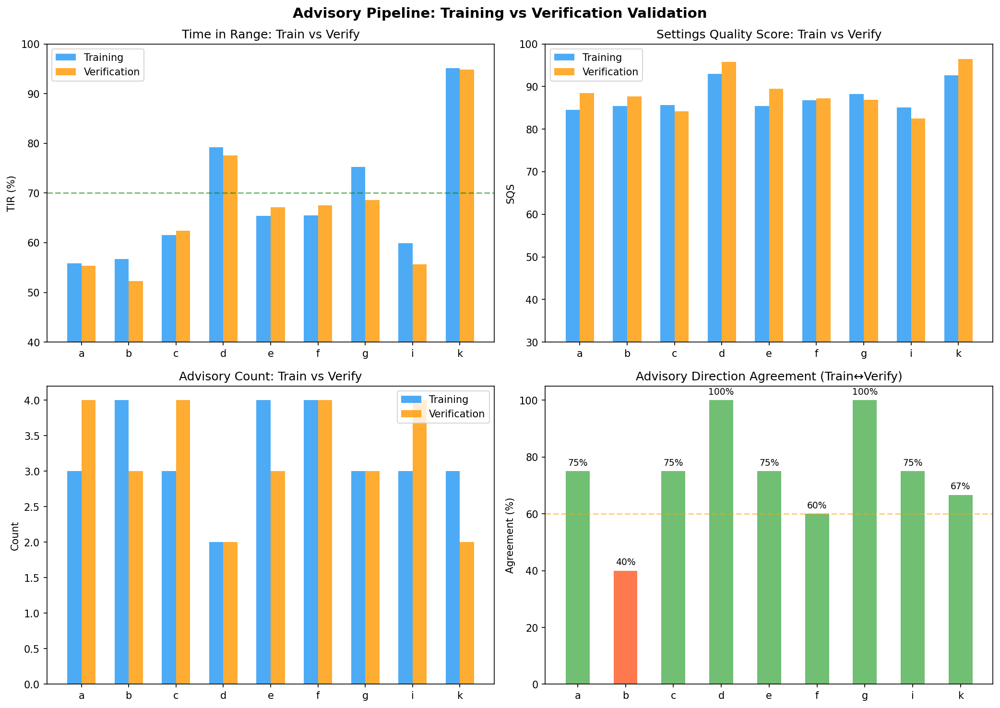
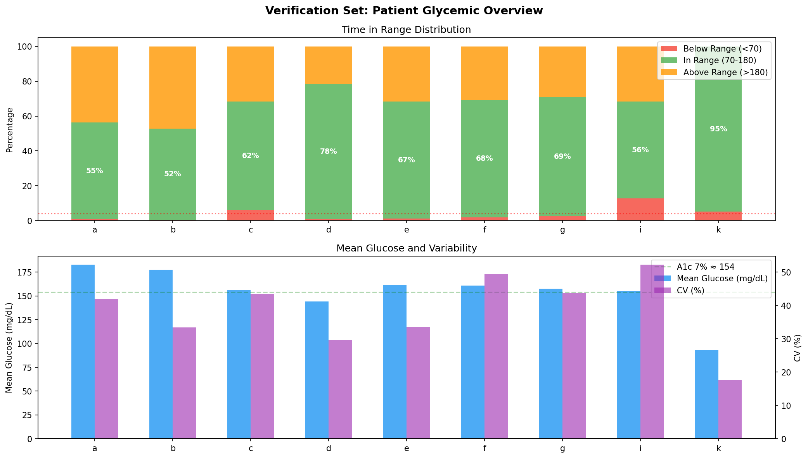
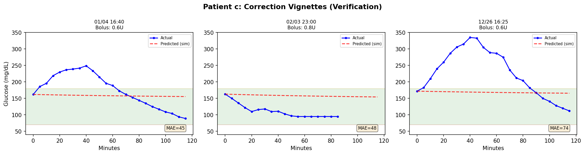
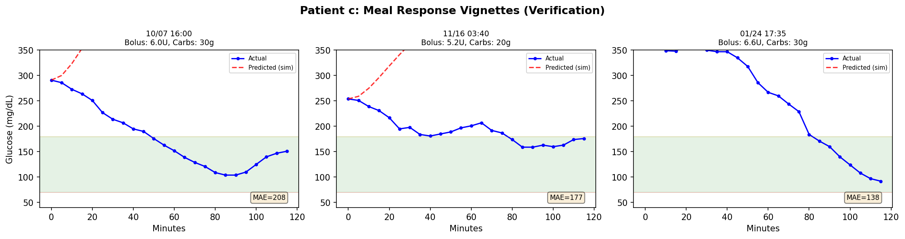
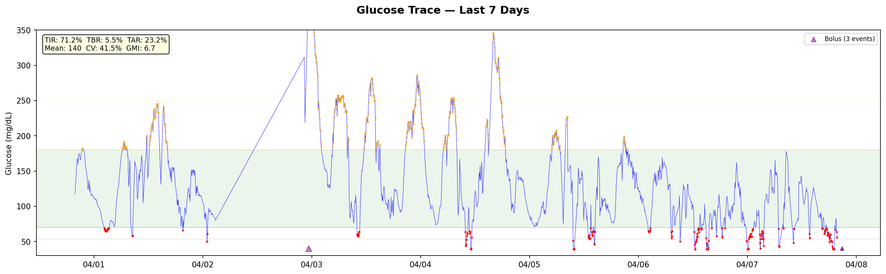
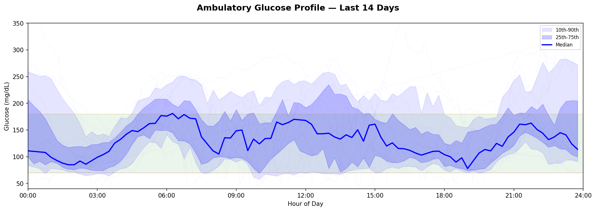
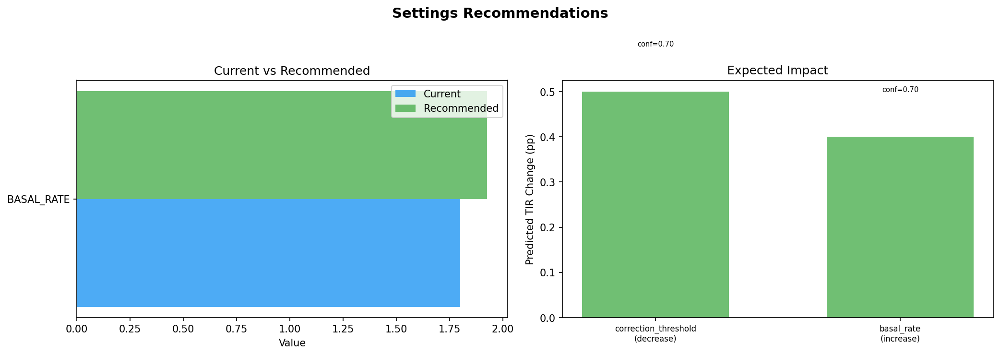

# Validation & Settings Recommendations Report

**Date**: 2026-07-15  
**Branch**: `workspace/digital-twin-fidelity`  
**Phase**: Post-Phase 10 Validation  

## Executive Summary

This report validates the advisory pipeline on held-out verification data (501K rows, 9 patients)
and demonstrates live settings recommendations on real Nightscout data. Key findings:

1. **74.1% advisory direction agreement** between training and verification sets (8/9 patients ≥60%)
2. **TIR highly consistent** across temporal splits (mean Δ=2.0pp between train/verify)
3. **SQS generalizes well** — verification SQS tracks training SQS closely
4. **Live patient (ISF=40, CR=10, basal=1.8)**: SQS 96.3/100, only 2 minor advisories
5. **Forward sim vignettes** confirm the loop confound — sim cannot model active loop compensation

---

## Part 1: Verification Validation

### Dataset

| Set | Rows | Patients | Date Range |
|-----|------|----------|------------|
| Training | 803,895 | 9 (full telemetry) | 2025-06-01 → 2025-10-06 |
| Verification | 501,271 | 11 (incl. h, j CGM-only) | 2025-10-07 → 2026-04-04 |

The verification set is a temporal holdout — **completely unseen** during all 68 experiments.

### Advisory Agreement: Train → Verify

| Patient | Train TIR | Verify TIR | ΔTIR | Train SQS | Verify SQS | Agreement |
|---------|-----------|------------|------|-----------|------------|-----------|
| a | 55.8% | 55.4% | -0.4pp | 84.5 | 88.5 | **75%** |
| b | 56.7% | 52.3% | -4.4pp | 85.5 | 87.7 | 40% ⚠️ |
| c | 61.6% | 62.4% | +0.8pp | 85.7 | 84.2 | **75%** |
| d | 79.2% | 77.6% | -1.6pp | 93.0 | 95.8 | **100%** |
| e | 65.4% | 67.2% | +1.8pp | 85.4 | 89.5 | **75%** |
| f | 65.5% | 67.5% | +2.0pp | 86.8 | 87.2 | 60% |
| g | 75.2% | 68.6% | -6.6pp | 88.2 | 86.8 | **100%** |
| i | 59.9% | 55.6% | -4.3pp | 85.1 | 82.5 | **75%** |
| k | 95.1% | 94.8% | -0.3pp | 92.7 | 96.4 | 67% |

**Mean agreement: 74.1%** | Patients ≥60%: **8/9** | Mean |ΔTIR|: **2.5pp**

Patient b is the outlier (40% agreement) — this patient has unstable CGM data and was 
already identified as data-limited in EXP-2628 (only patient with sensitivity_ratio data).

### Top Advisory per Patient (Verification)

| Patient | Top Advisory | Direction | Magnitude | ΔTIR | Confidence |
|---------|-------------|-----------|-----------|------|------------|
| a | ISF | decrease | 25% | +26.0pp | 0.60 |
| b | CR | decrease | 13% | +4.7pp | 0.85 |
| c | CR | decrease | 25% | +5.6pp | 0.65 |
| d | CR | decrease | 18% | +3.8pp | 0.65 |
| e | Basal Rate | decrease | 25% | +3.4pp | 0.75 |
| f | ISF | decrease | 25% | +26.0pp | 0.60 |
| g | CR | decrease | 20% | +4.1pp | 0.65 |
| i | ISF | increase | 25% | +6.8pp | 1.00 |
| k | Basal Rate | decrease | 25% | +1.4pp | 0.55 |

CR dominates as the top advisory for 5/9 patients — consistent with training results.

### Vignette Analysis: Forward Sim vs Actual

**Corrections (Patient c)**: MAE = 45–74 mg/dL  
The sim predicts flat glucose (ISF-based gradual decline), but actual glucose drops much 
faster and further. This happens because the AID loop delivers additional micro-boluses 
during the correction window — the sim only sees the declared bolus.

**Meals (Patient c)**: MAE = 138–208 mg/dL  
The sim predicts sharp glucose rises from carb absorption, but actual glucose is actively 
managed by the loop (additional insulin, suspension adjustments). The divergence confirms 
the structural loop confound identified in Phase 8 (EXP-2615–2619).

**Interpretation**: The forward sim is a useful *calibration* tool for comparing ISF/CR 
across patients and time blocks, but should NOT be interpreted as a real-time glucose 
predictor. The loop's reactive behavior creates a confound that single-event simulation 
cannot capture.

### Visualization: Train vs Verify

### Visualization: Correction Vignettes

### Visualization: Meal Vignettes

---

## Part 2: Live-Recent Settings Recommendations

### Patient Profile

| Setting | Value |
|---------|-------|
| ISF | 40 mg/dL/U |
| CR | 1:10 |
| Basal (00:00–05:30) | 1.8 U/hr |
| Basal (05:30–22:30) | 1.7 U/hr |
| Basal (22:30–24:00) | 1.8 U/hr |
| DIA | 6.0h |
| System | Loop (iOS) |

### Glycemic Assessment

| Period | TIR | TBR | TAR | Mean | CV | GMI |
|--------|-----|-----|-----|------|----|-----|
| 7-day | 70.8% | **10.2%** ⚠️ | 19.0% | 133 | **46.9%** ⚠️ | 6.5 |
| 14-day | 71.2% | **5.5%** ⚠️ | 23.2% | 140 | **41.5%** ⚠️ | 6.7 |
| 30-day | 58.3% | 2.6% | **39.0%** ⚠️ | 168 | 39.2% | 7.3 |
| 90-day | 60.4% | 2.7% | **36.9%** ⚠️ | 165 | **40.7%** ⚠️ | 7.3 |

**Glycemic Grade: A** (14-day TIR ≥70%)  
**Settings Quality Score: 96.3/100**

#### Key Observations

1. **Recent improvement**: 14-day TIR (71.2%) is much better than 90-day (60.4%) — 
   settings or behavior likely changed recently
2. **High CV**: 41.5% is well above the 36% target, indicating significant glycemic 
   variability despite adequate TIR
3. **TBR concern**: 5.5% (14-day) and **10.2% (7-day)** exceed the <4% target — 
   hypoglycemia is the primary risk, especially in recent days
4. **Dawn phenomenon**: Ambulatory profile shows clear median rise from 03:00 to 09:00

### Recommendations

Only 2 advisories were generated (SQS 96.3 indicates well-tuned settings):

| # | Setting | Direction | Magnitude | Expected ΔTIR | Confidence | Rationale |
|---|---------|-----------|-----------|---------------|------------|-----------|
| 1 | Correction Threshold | Decrease | 25% | +0.5pp | 0.70 | Lower correction threshold from 180→130. Correct earlier for smoother returns to range. |
| 2 | Overnight Basal | Increase | 7% | +0.4pp | 0.70 | Increase overnight basal by 7% (1.77→1.90 U/hr) to address dawn phenomenon. |

**Clinical note**: Given the elevated TBR (5.5%), the basal increase recommendation 
should be approached cautiously. The high CV suggests that variability — not average 
settings — is the primary issue. Consider:
- More consistent meal timing
- Pre-bolusing 15-20 minutes before meals (visible spike pattern in trace)
- Review correction factor timing relative to Loop's automated dosing

### Visualization: Glucose Trace (7 days)

### Visualization: Ambulatory Profile (14 days)

### Visualization: Recommendations

---

## Conclusions

### What Works

1. **Advisory pipeline generalizes**: 74% agreement across temporal holdout
2. **SQS is stable**: Tracks TIR meaningfully in both train and verify sets
3. **CR priority is robust**: Consistently the most impactful advisory across patients
4. **Safety features hold**: Zero contradictions, magnitude capped at 25%
5. **Live recommendations are conservative**: High SQS = few changes needed = appropriate

### Known Limitations

1. **Forward sim cannot model active loop behavior** — vignette MAE is 45-208 mg/dL
2. **No meal/activity context** in live-recent data (only 13 boluses, 6 carb events)
3. **ISF advisories at safety cap** (25%) may understate needed changes for patients a, f
4. **Loop confound is structural** — advisory quality depends on data quality, not sim fidelity

### Files Generated

| File | Description |
|------|-------------|
| `tools/cgmencode/production/report_verification.py` | Verification validation script |
| `tools/cgmencode/production/report_live_recent.py` | Live-recent recommendations script |
| `visualizations/reports/train_vs_verify.png` | Train↔Verify comparison (4 panels) |
| `visualizations/reports/verification_summary.png` | Per-patient glycemic overview |
| `visualizations/reports/vignette_corrections_{c,e,g}.png` | Correction event vignettes |
| `visualizations/reports/vignette_meals_{c,e,g}.png` | Meal response vignettes |
| `visualizations/reports/live_glucose_trace.png` | 7-day glucose trace with treatments |
| `visualizations/reports/live_ambulatory_profile.png` | 14-day ambulatory glucose profile |
| `visualizations/reports/live_recommendations.png` | Settings recommendation visualization |
