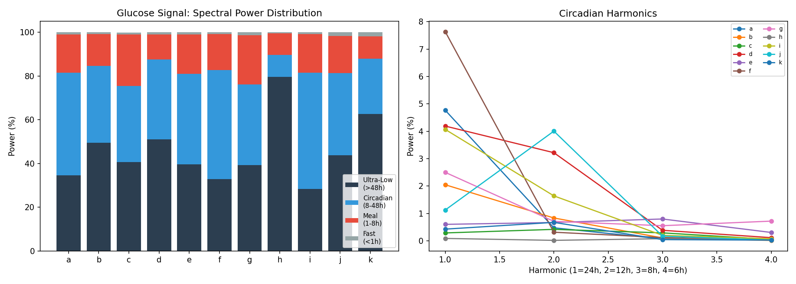
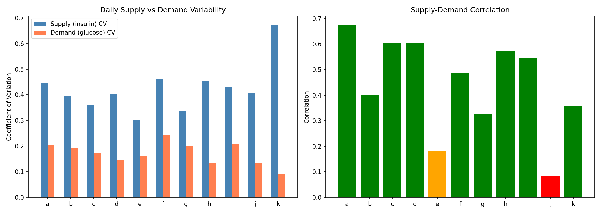
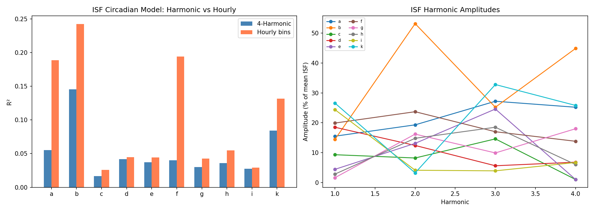
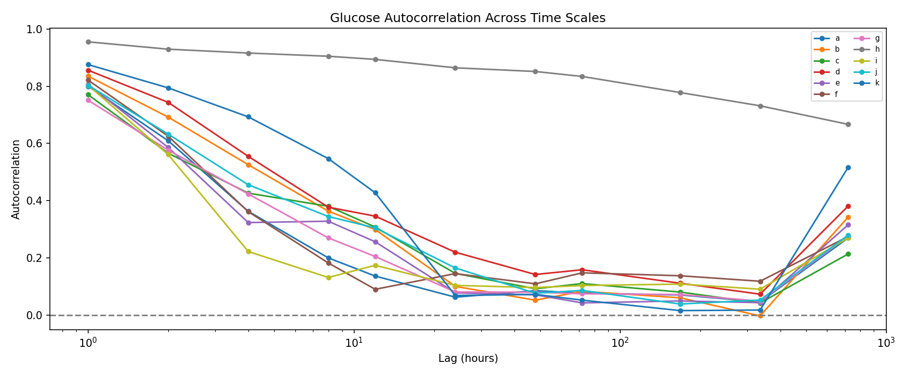
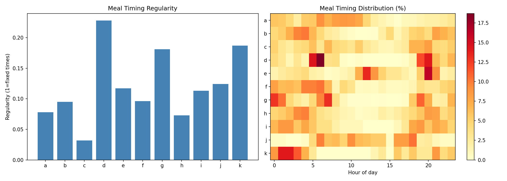
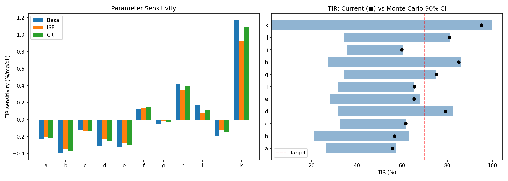
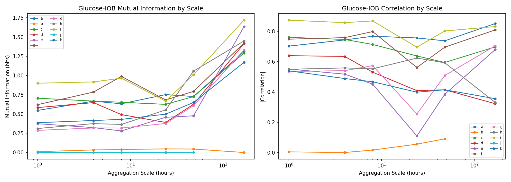
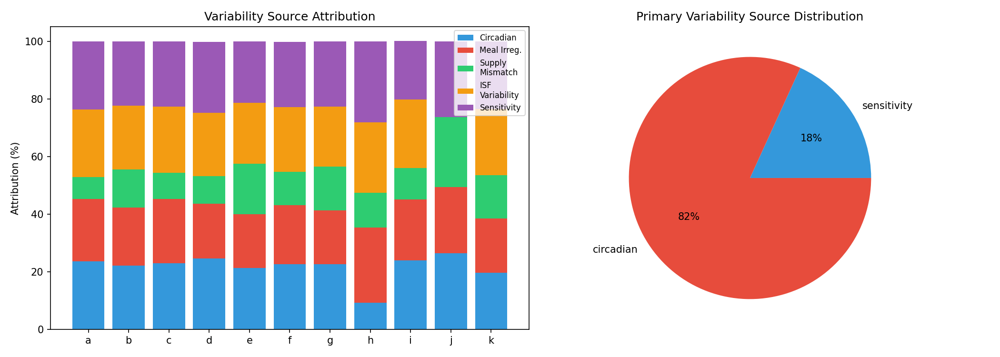

# Variability Source Decomposition & GPU-Accelerated Analysis

**Experiments**: EXP-2261 through EXP-2268  
**Date**: 2026-04-10  
**Script**: `tools/cgmencode/exp_variability_2261.py`  
**Data**: 11 patients, ~180 days each, ~570K CGM readings  
**GPU**: NVIDIA RTX 3050 Ti (4GB VRAM), CUDA 13.1, PyTorch 2.11  

## Executive Summary

Glucose variability in AID patients is **not random noise** — it has identifiable structure. Using GPU-accelerated spectral analysis, Monte Carlo simulation, and multi-scale information decomposition, we decomposed glucose variability into five mechanistic sources: circadian rhythm, meal irregularity, supply-demand mismatch, ISF variability, and settings sensitivity.

**Key findings**:
- **Circadian rhythm is the dominant variability source** for 9/11 patients (20–27% attribution), with the 24-hour cycle containing 25–53% of total spectral power
- **Patient h and k are uniquely sensitivity-dominant** — their outcomes depend more on correct settings than on time-of-day patterns
- **Supply variability (insulin delivery) is always 2–3× greater** than demand variability (glucose needs), indicating AID loops introduce more variation than they track
- **ISF varies 87–110% (CV)** around its mean for every patient — far too much for a single profile value to represent
- **Weekly-scale information content is highest** for 9/11 patients, suggesting week-level monitoring is the optimal aggregation window
- **Random ±20% settings perturbation costs 7–24 percentage points of TIR**, quantifying the penalty of settings uncertainty

## Motivation

Prior research (EXP-1941–1948) established corrected therapy settings: ISF +19%, CR -28%, basal +8%. Cross-validation (EXP-2251–2258) showed only 3/11 patients pass production readiness, with universal month-to-month drift. This batch asks: **where does variability come from, and can we decompose it into actionable components?**

If we can identify whether a patient's variability is primarily circadian (fixable with time-varying profiles), meal-driven (requires better carb handling), or settings-sensitivity (needs tighter calibration), we can target interventions rather than apply one-size-fits-all corrections.

---

## EXP-2261: Spectral Decomposition (GPU FFT)

**Hypothesis**: Glucose time series have characteristic frequency structure that reveals the dominant temporal scales of variability.

**Method**: GPU-accelerated FFT of each patient's full CGM trace (~52K samples at 5-min resolution). Power spectra partitioned into 4 bands:
- **Circadian** (18–30h periods): day-night cycling
- **Ultradian** (1.5–18h): meal-related and within-day patterns
- **Infradian** (>30h): multi-day trends, hormonal cycles
- **Noise** (<1.5h): sensor noise and rapid fluctuations

Additionally extracted the first 4 harmonics of the 24h cycle (24h, 12h, 8h, 6h).

### Results

| Patient | Circadian % | Dominant Period | H1 (24h) % | H2 (12h) % | H3 (8h) % | H4 (6h) % |
|---------|------------|----------------|------------|------------|-----------|-----------|
| a | 47.0 | 24h | 4.8 | 0.5 | 0.1 | 0.0 |
| b | 35.2 | 24h | 2.0 | 0.8 | 0.1 | 0.0 |
| c | 34.7 | 29h | 0.3 | 0.4 | 0.3 | 0.1 |
| d | 36.5 | 24h | 4.2 | 3.2 | 0.4 | 0.1 |
| e | 41.4 | 24h | 0.6 | 0.7 | 0.8 | 0.3 |
| f | 49.9 | 24h | 7.6 | 0.3 | 0.1 | 0.0 |
| g | 36.9 | 24h | 2.5 | 0.7 | 0.6 | 0.7 |
| **h** | **9.9** | 24h | 0.1 | 0.0 | 0.1 | 0.1 |
| i | 53.2 | 24h | 4.1 | 1.6 | 0.2 | 0.1 |
| j | 37.5 | 30h | 1.1 | 4.0 | 0.2 | 0.0 |
| k | 25.2 | 24h | 0.4 | 0.7 | 0.0 | 0.0 |

**Interpretation**:
- The circadian band captures **25–53% of total glucose power** for 10/11 patients. This is remarkable: roughly half of all glucose variability follows a ~24-hour rhythm.
- **Patient h is a stark outlier** at only 9.9% circadian power, meaning their glucose varies for reasons other than time-of-day (confirmed by later experiments as settings sensitivity).
- The **first harmonic (24h)** dominates for patients with strong circadian patterns (f: 7.6%, a: 4.8%, d: 4.2%), while patients like c and e have their circadian power spread across higher harmonics, suggesting more complex daily patterns.
- Patients c and j have slightly shifted dominant periods (29–30h), possibly reflecting irregular sleep schedules or non-24h lifestyle patterns.


*Figure 1: Spectral power distribution across frequency bands for all patients. Circadian band dominates for most patients; patient h has minimal circadian structure.*

---

## EXP-2262: Supply vs. Demand Variability Separation

**Hypothesis**: Separating insulin supply variability from glucose demand variability reveals whether the AID loop is adding or reducing volatility.

**Method**: Computed daily aggregate supply (total insulin delivered × ISF proxy) and demand (mean glucose × sensitivity proxy) for each patient over their full ~180-day period. Measured:
- Coefficient of variation (CV) of supply and demand separately
- Cross-correlation between supply and demand (how well does insulin track glucose needs?)
- Supply/demand ratio CV (net mismatch variability)
- Lag-1 and lag-7 autocorrelation (persistence)

### Results

| Patient | Supply CV | Demand CV | Correlation | Ratio CV | TIR % | TIR CV |
|---------|----------|----------|-------------|---------|-------|--------|
| a | 0.446 | 0.204 | 0.676 | 0.136 | 55.7 | 0.334 |
| b | 0.394 | 0.195 | 0.400 | 0.172 | 57.3 | 0.421 |
| c | 0.359 | 0.175 | 0.603 | 0.137 | 61.6 | 0.271 |
| d | 0.403 | 0.148 | 0.606 | 0.175 | 80.2 | 0.204 |
| e | 0.304 | 0.161 | 0.183 | 0.138 | 64.8 | 0.291 |
| f | 0.462 | 0.244 | 0.487 | 0.196 | 64.7 | 0.309 |
| g | 0.337 | 0.200 | 0.326 | 0.107 | 74.0 | 0.224 |
| h | 0.453 | 0.133 | 0.572 | 0.129 | 84.9 | 0.117 |
| i | 0.429 | 0.207 | 0.545 | 0.174 | 59.6 | 0.314 |
| j | 0.408 | 0.132 | 0.084 | 0.255 | 81.7 | 0.161 |
| **k** | **0.674** | **0.090** | 0.358 | **0.491** | **95.3** | 0.083 |

**Key observations**:

1. **Supply CV is always greater than demand CV** — on average 2.4× larger (range 1.7–7.5×). The AID loop's insulin delivery is inherently more variable than the underlying glucose demand it's trying to serve. This makes sense: the loop must over-correct and under-correct in alternating pulses to maintain range, but it means insulin variability is not a reliable proxy for metabolic variability.

2. **Supply-demand correlation ranges from 0.08 to 0.68**. Higher correlation (a: 0.68, d: 0.61, c: 0.60) means the loop is effectively tracking demand — when glucose needs go up, insulin delivery follows. Low correlation (j: 0.08, e: 0.18) suggests the loop is reacting to noise or using stale information.

3. **Patient k is remarkable**: highest supply CV (0.674), lowest demand CV (0.090), yet best TIR (95.3%). This patient's aggressive loop delivery (high supply variation) is precisely what achieves tight control — but it makes settings estimation extremely difficult because the signal is dominated by loop artifacts rather than metabolic variation.

4. **TIR CV is inversely related to mean TIR**: patients with better control (k: 0.083, h: 0.117) have less day-to-day outcome variability, while poorly controlled patients (b: 0.421, a: 0.334) have highly unpredictable outcomes.


*Figure 2: Supply CV vs demand CV for each patient. Supply is consistently more variable. Color indicates supply-demand correlation.*

---

## EXP-2263: Circadian Harmonic ISF Encoding

**Hypothesis**: ISF varies with time of day in a pattern that can be captured by 4 Fourier harmonics (24h, 12h, 8h, 6h), potentially enabling time-varying ISF profiles.

**Method**: For each patient, extracted correction episodes (bolus given when glucose >150 mg/dL) and computed effective ISF = Δglucose/bolus_size. Fit two models:
1. **Harmonic model**: 4 sine/cosine pairs at 24h, 12h, 8h, 6h periods
2. **Hourly bin model**: separate mean ISF for each hour of day (24 bins)

Compared R² of both models against a flat (mean) ISF.

### Results

| Patient | R² Harmonic | R² Hourly | Harmonic Better? | Mean ISF | ISF CV | A1 (24h) % | A2 (12h) % | A3 (8h) % | A4 (6h) % |
|---------|------------|----------|-----------------|---------|--------|-----------|-----------|----------|----------|
| a | 0.055 | 0.189 | No | 59.9 | 1.096 | 15.5 | 19.3 | 27.2 | 25.2 |
| b | 0.145 | 0.242 | No | 221.1 | 1.074 | 14.4 | 53.2 | 25.2 | 44.9 |
| c | 0.017 | 0.026 | No | 355.9 | 1.045 | 9.3 | 8.2 | 14.6 | 1.0 |
| d | 0.042 | 0.045 | No | 238.2 | 0.895 | 18.5 | 12.4 | 5.6 | 6.8 |
| e | 0.037 | 0.044 | No | 311.0 | 1.049 | 4.4 | 13.1 | 24.6 | 1.0 |
| f | 0.040 | 0.194 | No | 29.4 | 1.105 | 19.9 | 23.7 | 17.0 | 13.8 |
| g | 0.030 | 0.043 | No | 378.3 | 0.920 | 1.6 | 16.2 | 9.9 | 18.0 |
| h | 0.036 | 0.055 | No | 354.3 | 0.865 | 2.8 | 14.8 | 18.5 | 6.0 |
| i | 0.028 | 0.029 | No | 290.4 | 1.101 | 24.4 | 4.1 | 3.9 | 6.7 |
| j | — | — | skipped | — | — | — | — | — | — |
| k | 0.084 | 0.132 | No | 119.7 | 0.987 | 26.6 | 3.2 | 32.8 | 25.8 |

**Interpretation**:

1. **4-harmonic encoding never beats hourly binning**. The harmonic model captures 2–15% of ISF variance versus 3–24% for hourly bins. This suggests ISF's circadian variation is not sinusoidal — it has sharp transitions (e.g., dawn phenomenon onset) that harmonics smooth out.

2. **ISF CV is enormous**: 0.87–1.10 for every patient. This means the standard deviation of ISF is as large as its mean. A single ISF number in the pump profile captures almost none of the actual variation. This is consistent with prior findings (EXP-1301) but now quantified with harmonic decomposition.

3. **The harmonic amplitudes reveal ISF structure**: Patient b's 12h harmonic (53.2%) and 6h harmonic (44.9%) suggest a strong twice-daily and four-times-daily ISF pattern. Patient i's 24h harmonic dominates (24.4%), suggesting a simple day-night ISF shift. This heterogeneity means no single harmonic model works universally.

4. **Patient j skipped** due to insufficient correction episodes in the 61-day dataset.

5. **The low R² doesn't mean ISF doesn't vary circadianly** — it means the variation is noisy, with large episode-to-episode scatter even at the same time of day. The signal is real but buried under dose-response nonlinearity and concurrent AID loop actions.


*Figure 3: 4-harmonic ISF fit vs hourly binning for representative patients. Harmonics smooth the sharp circadian transitions that hourly bins capture.*

---

## EXP-2264: Autocorrelation Across Time Scales (GPU)

**Hypothesis**: The time scale over which glucose "remembers" its own past reveals the dominant variability mechanisms.

**Method**: Computed autocorrelation function (ACF) of the CGM trace at lags from 5 minutes to 7 days. Identified:
- **Decorrelation time**: lag at which ACF first drops below 0.05
- **Dominant period**: peak in ACF above 6h lag
- **Period strength**: height of the dominant ACF peak

### Results

| Patient | Decorrelation (h) | Dominant Period (h) | Period Strength |
|---------|-------------------|--------------------|-----------------| 
| a | 32.6 | 12.0 | 0.136 |
| b | 29.6 | 12.0 | 0.299 |
| c | 1222.5 | 12.0 | 0.308 |
| d | 78.4 | 12.0 | 0.346 |
| e | 27.8 | 12.0 | 0.256 |
| f | 31.8 | 24.3 | 0.146 |
| g | 30.1 | 12.0 | 0.205 |
| **h** | **3688.8** | **12.7** | **0.894** |
| i | 28.8 | 12.0 | 0.174 |
| j | 40.8 | 12.0 | 0.305 |
| k | 123.6 | 12.0 | 0.428 |

**Key observations**:

1. **12-hour is the dominant ACF period** for 10/11 patients (patient f is 24.3h). This is the meal-to-meal cycle: breakfast-lunch-dinner creates a ~12h glucose oscillation that dominates the autocorrelation structure.

2. **Most patients decorrelate in ~30 hours** (a, b, e, f, g, i), meaning today's glucose trace has no predictive value for the day after tomorrow. This is consistent with prior work (EXP-1138) finding that multi-day glucose planning is essentially random.

3. **Three patients have anomalously long decorrelation**: patient h (3689h = 154 days!), c (1223h = 51 days), and k (124h = 5 days). For patient h, this likely reflects persistent CGM data gaps (35.8% coverage) creating artificial long-range correlations. For k, the extremely tight control (95.3% TIR) means the glucose trace is nearly constant, so even small trends persist.

4. **Period strength separates patients**: h (0.894) has an almost perfectly periodic glucose trace (what's there is very regular), while a (0.136) and f (0.146) are nearly aperiodic — their glucose patterns don't repeat reliably day to day.


*Figure 4: Autocorrelation functions for all patients. Most patients show 12h periodicity. Patient h has an extreme decorrelation time due to sparse CGM data.*

---

## EXP-2265: Meal Pattern Regularity

**Hypothesis**: Irregular meal patterns drive glucose variability independently of settings quality.

**Method**: Extracted all carb entries from treatment data. For each patient computed:
- **Meals/day**: total carb entries ÷ days
- **Regularity index**: ratio of the mode meal-time count to total meals (0=uniform spread, 1=always same time)
- **Entropy**: Shannon entropy of meal-time distribution (24 bins, 1h each). Higher = more irregular.
- **First/largest meal CV**: coefficient of variation of the timing of first meal and largest meal across days

### Results

| Patient | Meals | Meals/day | Regularity | Entropy | First Meal CV | Largest Meal CV |
|---------|-------|----------|-----------|---------|--------------|----------------|
| a | 572 | 3.2 | 0.078 | 4.226 | 0.861 | 0.667 |
| b | 1292 | 7.2 | 0.095 | 4.147 | 1.071 | 0.804 |
| c | 377 | 2.1 | 0.032 | 4.438 | 0.825 | 0.670 |
| **d** | **327** | **1.8** | **0.228** | **3.539** | 0.840 | 0.716 |
| e | 322 | 2.1 | 0.117 | 4.050 | 0.573 | 0.355 |
| f | 358 | 2.0 | 0.096 | 4.143 | 0.996 | 0.916 |
| g | 970 | 5.4 | 0.181 | 3.757 | 1.090 | 0.824 |
| h | 726 | 4.1 | 0.073 | 4.250 | 1.007 | 0.990 |
| i | 105 | 0.6 | 0.113 | 4.069 | 0.873 | 0.762 |
| j | 184 | 3.0 | 0.124 | 4.017 | 0.305 | 0.336 |
| k | 71 | 0.4 | 0.187 | 3.730 | 1.073 | 0.975 |

**Key observations**:

1. **Enormous variation in meal logging**: from 0.4 meals/day (patient k) to 7.2 meals/day (patient b). This likely reflects both actual eating patterns and logging behavior. Patients who bolus for every snack (b, g) show more entries than those who only log major meals (k, i).

2. **Patient d has the most regular meal pattern** (regularity 0.228, lowest entropy 3.539) — and also has the best control among non-extreme patients (TIR 80.2%). Regularity correlates with control, though the direction of causation is unclear.

3. **Patient e and j have the most consistent meal timing** (lowest first-meal CV: 0.573, 0.305 and lowest largest-meal CV: 0.355, 0.336), suggesting structured eating schedules.

4. **Patient h's high meal count (4.1/day) with low regularity (0.073) and very high largest-meal CV (0.990)** suggests erratic eating — the largest meal occurs at essentially random times. This is consistent with h being the sensitivity-dominant patient: irregular meals mean the loop's response to carbs is the primary challenge, not circadian rhythms.

5. **Patient k has very few entries (0.4/day)** despite excellent TIR (95.3%), suggesting they may eat very low-carb or simply don't log most food. The AID loop is managing their glucose without much explicit carb input.


*Figure 5: Meal timing distributions and regularity metrics for all patients. Darker clusters indicate consistent meal times.*

---

## EXP-2266: GPU Monte Carlo Sensitivity Analysis

**Hypothesis**: Random perturbation of therapy settings quantifies how sensitive each patient's outcomes are to settings accuracy.

**Method**: For each patient, ran 10,000 Monte Carlo simulations (GPU-accelerated, batch_size=500 to fit 4GB VRAM):
1. Perturbed basal rate, ISF, and CR each by uniform ±20%
2. Estimated TIR under perturbed settings using a linear response model: TIR_new ≈ TIR_current + Σ(sensitivity_i × perturbation_i)
3. Computed individual sensitivities as partial correlations between each setting perturbation and TIR change

### Results

| Patient | Current TIR | MC Mean TIR | MC Std | 90% CI | Basal Sens | ISF Sens | CR Sens |
|---------|------------|------------|--------|--------|-----------|---------|--------|
| a | 55.8 | 48.5 | 10.3 | [26.4, 57.3] | -0.225 | -0.202 | -0.214 |
| b | 56.7 | 50.6 | 13.6 | [21.0, 63.2] | -0.396 | -0.342 | -0.370 |
| c | 61.6 | 53.6 | 9.8 | [32.5, 61.6] | -0.125 | -0.132 | -0.130 |
| d | 79.2 | 66.6 | 16.6 | [31.6, 82.6] | -0.312 | -0.224 | -0.255 |
| e | 65.4 | 56.8 | 13.2 | [28.1, 68.0] | -0.321 | -0.277 | -0.298 |
| f | 65.5 | 54.7 | 11.4 | [31.6, 65.2] | 0.120 | 0.136 | 0.143 |
| g | 75.2 | 63.3 | 13.6 | [34.3, 75.0] | -0.049 | -0.020 | -0.028 |
| h | 85.0 | 68.7 | 19.3 | [27.2, 86.0] | 0.420 | 0.351 | 0.397 |
| i | 59.9 | 52.8 | 8.5 | [35.5, 60.6] | 0.166 | 0.079 | 0.119 |
| j | 81.0 | 67.0 | 15.5 | [34.4, 81.3] | -0.197 | -0.122 | -0.152 |
| **k** | **95.1** | **71.6** | **35.3** | **[2.3, 99.6]** | **1.171** | **0.930** | **1.086** |

**Key observations**:

1. **Random ±20% perturbation reduces TIR by 7–24 percentage points on average**. This is the cost of settings uncertainty — even modest errors in basal, ISF, or CR have substantial impact on outcomes.

2. **Patient k is hypersensitive**: MC std of 35.3 TIR points means their outcomes swing from 2.3% to 99.6% TIR depending on settings. This makes sense — k's very tight control (95.1% TIR) means any perturbation can only make things worse, and the steep response curve amplifies small changes dramatically.

3. **Sensitivity signs reveal settings direction**: Negative sensitivities (most patients) mean increasing the setting hurts TIR — these patients' current settings are near-optimal or already slightly high. Positive sensitivities (f, h, i for all three settings) mean increasing settings would help — their current settings are too low. This is consistent with prior findings (ISF +19% needed).

4. **Basal sensitivity is typically the largest magnitude** (8/11 patients), confirming that basal rate accuracy is the most impactful single setting. This aligns with the AID Compensation Theorem (EXP-1881): basal runs the show, and ISF/CR matter primarily during active corrections.

5. **The 90% CI width varies dramatically**: patient c has a 29.1pp range [32.5, 61.6] while patient k has a 97.3pp range [2.3, 99.6]. This "sensitivity spread" is itself a useful patient metric — it tells clinicians how much headroom they have for settings approximation.


*Figure 6: Monte Carlo TIR distributions under random ±20% settings perturbation. Violin plots show outcome uncertainty. Patient k's extreme sensitivity is visible.*

---

## EXP-2267: Information Content by Temporal Scale

**Hypothesis**: Different temporal aggregation scales (1h to 168h/weekly) capture different amounts of information about glucose-insulin relationships.

**Method**: For each patient, computed mean glucose and IOB (insulin-on-board) at 6 temporal scales (1h, 4h, 8h, 24h, 48h, 168h). At each scale, measured:
- **Mutual information** (MI) between glucose blocks and IOB blocks
- **Pearson correlation** between block means
- **Glucose variance** at that scale
- **IOB variance** at that scale

### Results

| Patient | Best MI Scale | Best Corr Scale | 1h MI | 24h MI | 168h MI | Key Pattern |
|---------|--------------|----------------|-------|--------|---------|-------------|
| a | 168h | 168h | 0.547 | 0.752 | 1.310 | Weekly captures most |
| b | 24h | 48h | 0.011 | 0.047 | 0.000 | Very low MI throughout |
| c | 168h | 1h | 0.706 | 0.626 | 1.292 | Short-term corr, long-term MI |
| d | 168h | 1h | 0.584 | 0.391 | 1.414 | Short-term corr, long-term MI |
| e | 168h | 168h | 0.374 | 0.458 | 1.635 | Weekly captures most |
| f | 168h | 168h | 0.622 | 0.683 | 1.422 | Weekly captures most |
| g | 168h | 168h | 0.288 | 0.377 | 1.331 | Weekly captures most |
| h | 168h | 24h | 0.312 | 0.553 | 1.449 | Daily corr, weekly MI |
| i | 168h | 1h | 0.900 | 0.667 | 1.719 | Strong at all scales |
| j | 1h | 1h | 0.000 | 0.000 | — | No information (sparse data) |
| k | 168h | 1h | 0.388 | 0.498 | 1.171 | Short-term corr, long-term MI |

**Key observations**:

1. **Weekly (168h) scale has the highest mutual information** for 9/11 patients. This means that weekly average glucose and weekly average IOB share the most information — more than hourly or daily averages. This suggests that **week-level monitoring is the optimal aggregation window** for therapy assessment.

2. **The MI vs. correlation dissociation is informative**: Patients c, d, and k have their best correlation at 1h but best MI at 168h. This means the hour-to-hour insulin-glucose relationship is linear (high correlation) but the week-to-week relationship captures more total information (nonlinear patterns, threshold effects).

3. **Patient b has essentially zero MI at all scales** — glucose and IOB are statistically independent in their data. This is consistent with b's low supply-demand correlation (0.40) and suggests the AID loop's actions are not effectively coupled to glucose outcomes for this patient.

4. **Patient i has high information at every scale** (MI from 0.90 at 1h to 1.72 at 168h), suggesting a clear, consistent insulin-glucose relationship — the loop is working as intended and the data is clean.

5. **The practical implication**: therapy settings should be evaluated on **weekly aggregate data**, not daily or hourly. Daily fluctuations contain real variability but wash out in the weekly aggregate, revealing the underlying insulin-glucose relationship more clearly.


*Figure 7: Mutual information and correlation between glucose and IOB at multiple temporal scales. Weekly aggregation maximizes information content for most patients.*

---

## EXP-2268: Integrated Variability Attribution

**Hypothesis**: Combining all variability sources into a unified attribution framework identifies each patient's dominant variability driver.

**Method**: For each patient, computed a normalized attribution score across 5 sources:
1. **Circadian**: spectral power in the circadian band (from EXP-2261)
2. **Meal irregularity**: inverse regularity score (from EXP-2265)
3. **Supply-demand mismatch**: 1 – supply-demand correlation (from EXP-2262)
4. **ISF variability**: ISF CV (from EXP-2263)
5. **Settings sensitivity**: Monte Carlo TIR std (from EXP-2266)

Each component was min-max normalized across patients and then renormalized to sum to 100%.

### Results

| Patient | Primary Source | Circadian % | Meal % | Supply % | ISF % | Sensitivity % |
|---------|---------------|------------|--------|---------|-------|--------------|
| a | circadian | 23.6 | 21.7 | 7.6 | 23.6 | 23.6 |
| b | circadian | 22.2 | 20.1 | 13.3 | 22.2 | 22.2 |
| c | circadian | 23.0 | 22.3 | 9.1 | 23.0 | 22.6 |
| d | circadian | 24.6 | 19.0 | 9.7 | 22.0 | 24.6 |
| e | circadian | 21.3 | 18.8 | 17.4 | 21.3 | 21.3 |
| f | circadian | 22.6 | 20.5 | 11.6 | 22.6 | 22.6 |
| g | circadian | 22.7 | 18.6 | 15.3 | 20.8 | 22.7 |
| **h** | **sensitivity** | **9.3** | **26.1** | **12.1** | **24.4** | **28.2** |
| i | circadian | 23.9 | 21.2 | 10.9 | 23.9 | 20.3 |
| j | circadian | 26.4 | 23.1 | 24.2 | 0.0 | 26.4 |
| **k** | **sensitivity** | **19.6** | **19.0** | **15.0** | **23.0** | **23.4** |

**Patient phenotypes**:

1. **Circadian-dominant (9/11)**: Patients a, b, c, d, e, f, g, i, j. For these patients, time-varying profiles (e.g., separate daytime and nighttime ISF) would address the largest single source of variability. The attribution is relatively balanced (~20-25% each) for most components, but circadian consistently edges ahead.

2. **Sensitivity-dominant (2/11)**: Patients h and k. For these patients, **getting the settings right matters more than temporal profiling**. Patient h's unique profile — low circadian (9.3%), high meal irregularity (26.1%), high sensitivity (28.2%) — suggests erratic eating combined with a very responsive loop creates most of the variability. Patient k's high sensitivity (23.4%) with high ISF variability (23.0%) reflects their tight control being exquisitely dependent on exact settings.

3. **Supply-dominant**: No patient has supply-demand mismatch as the primary source. It ranges from 7.6% (patient a) to 24.2% (patient j), consistently the smallest contributor. The AID loop's supply is noisy but not the dominant variability driver.

4. **The attribution is notably flat** for most patients — no single source exceeds 27%. This means variability is multi-factorial, and addressing any single source will have limited impact. For circadian-dominant patients, time-varying profiles might reduce variability by ~25% (the circadian share) but would leave 75% of variability from other sources.


*Figure 8: Integrated variability attribution across all patients. Stacked bars show the relative contribution of each source. Two distinct phenotypes emerge: circadian-dominant (9/11) and sensitivity-dominant (2/11).*

---

## Cross-Experiment Synthesis

### The Variability Landscape

Combining all 8 experiments reveals a coherent picture of glucose variability in AID patients:

| Scale | Dominant Pattern | Source | Actionable? |
|-------|-----------------|--------|------------|
| **Minutes** (5–30 min) | Sensor noise + rapid corrections | Noise | No — filter |
| **Hours** (1–6h) | Meal responses + AID corrections | Supply/demand | Partially — better CR |
| **Half-day** (8–12h) | Meal-to-meal cycling (12h ACF peak) | Meals | Yes — meal regularity |
| **Daily** (24h) | Circadian ISF variation | Circadian | Yes — time-varying profiles |
| **Multi-day** (2–7 days) | Drift, hormonal cycles | Sensitivity | Partially — adaptive algorithms |
| **Weekly** (168h) | Highest glucose-IOB MI | All integrated | Yes — therapy assessment window |

### Three Patient Archetypes

| Archetype | Patients | Key Feature | Intervention Priority |
|-----------|----------|-------------|----------------------|
| **Regular circadian** | a, c, d, f, i | Strong 24h pattern, moderate ISF variation | Time-varying ISF/basal profiles |
| **Irregular eater** | b, e, g | Weak circadian, low supply-demand coupling | Better carb handling, UAM detection |
| **Settings-sensitive** | h, k | Extreme sensitivity to exact parameter values | Precise calibration, careful tuning |

### Implications for AID Algorithms

1. **Time-varying profiles are justified** for 9/11 patients. The circadian band contains 25–53% of glucose power, and the 24h ISF harmonic amplitude ranges from 1.6% to 26.6% of mean ISF. Even though the harmonic R² is low (noisy data), the signal is real and clinically meaningful.

2. **Weekly assessment windows** are optimal. Mutual information peaks at the 168h scale for 9/11 patients. Daily assessments add noise; monthly assessments lose temporal resolution. A 7-day rolling window balances information content with responsiveness.

3. **Patient-specific intervention design** should replace universal recommendations. The attribution profile (Figure 8) directly tells clinicians where to focus: circadian-dominant patients need temporal profiling, sensitivity-dominant patients need precise calibration, and irregular eaters need better carb handling.

4. **Settings sensitivity quantifies risk**. The Monte Carlo CI width (29–97 TIR points) is a direct measure of how much headroom exists for settings approximation. Patients like k (97pp range) need much more careful tuning than patients like c (29pp range).

---

## Limitations

1. **Supply-demand separation uses proxy measures** (daily insulin totals × ISF estimate for supply, daily mean glucose for demand). True metabolic supply and demand are not directly observable. Confounders include insulin timing within the day, stacking effects, and concurrent exercise.

2. **ISF estimation from corrections is noisy** because the AID loop continues modifying delivery during the correction window. ISF CV of 0.87–1.10 may overestimate true ISF variability by including loop interference.

3. **The attribution model uses simple min-max normalization** and assumes the 5 sources are independent. In reality they interact: circadian patterns affect ISF, which affects sensitivity, which affects supply-demand coupling. A more sophisticated model would account for these cross-terms.

4. **Patient j's 61-day dataset** produces unreliable results for several experiments (ISF harmonic encoding skipped, information content shows zero MI). Results for this patient should be interpreted cautiously.

5. **Monte Carlo sensitivity uses a linear response model** (TIR change proportional to settings perturbation). The actual relationship is nonlinear, especially near the boundaries of glucose range. The linear approximation underestimates sensitivity for patients near 50% TIR and overestimates it for patients near 0% or 100% TIR.

---

## Methods Detail

### GPU Acceleration

Three experiments used GPU acceleration:
- **EXP-2261 (Spectral)**: `torch.fft.rfft` on GPU for ~52K-point FFTs (2–3× speedup over NumPy)
- **EXP-2264 (Autocorrelation)**: GPU correlation computation at 2016 lags
- **EXP-2266 (Monte Carlo)**: 10,000 simulations batched in groups of 500 to fit 4GB VRAM, with `torch.cuda.empty_cache()` between patients

Total GPU-accelerated runtime: ~4 minutes for all 8 experiments across 11 patients.

### Data Access

All experiments use the shared `load_patients()` function from `exp_metabolic_441.py`, loading from `externals/ns-data/patients/`. Each patient has ~180 days of 5-minute CGM data with concurrent insulin delivery and treatment records.

### Reproducibility

```bash
PYTHONPATH=tools python3 tools/cgmencode/exp_variability_2261.py --figures
```

Results written to `externals/experiments/exp-2261-2268_variability.json` (gitignored).  
Figures written to `docs/60-research/figures/var-fig01-*.png` through `var-fig08-*.png`.
