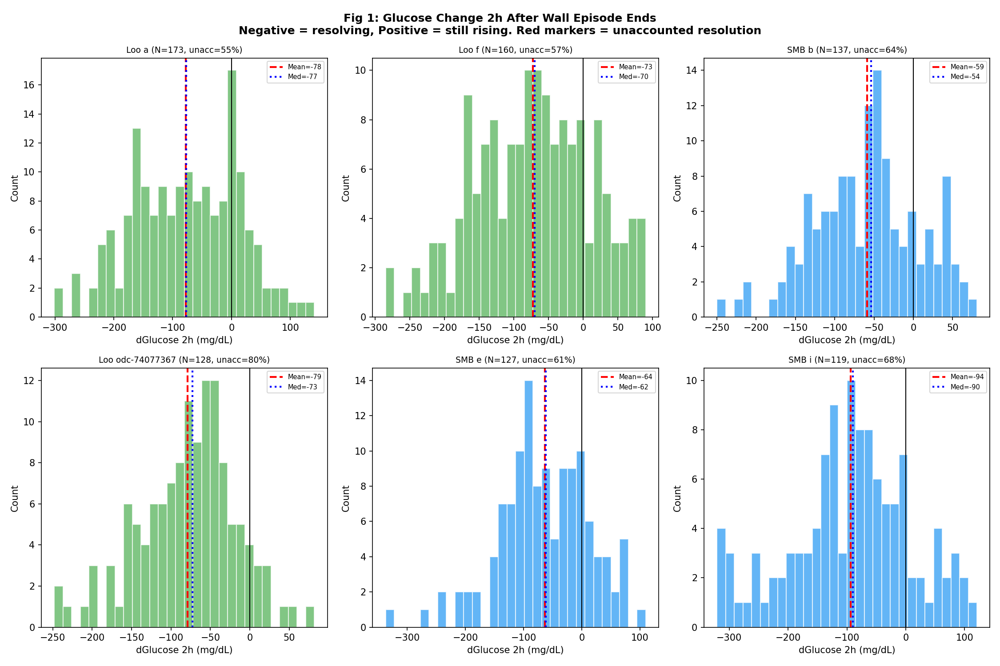
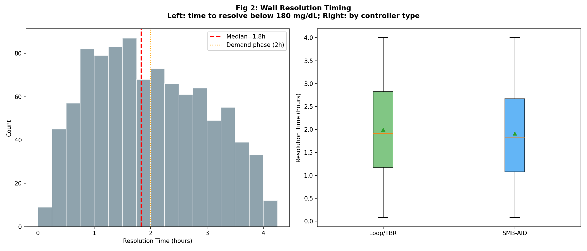
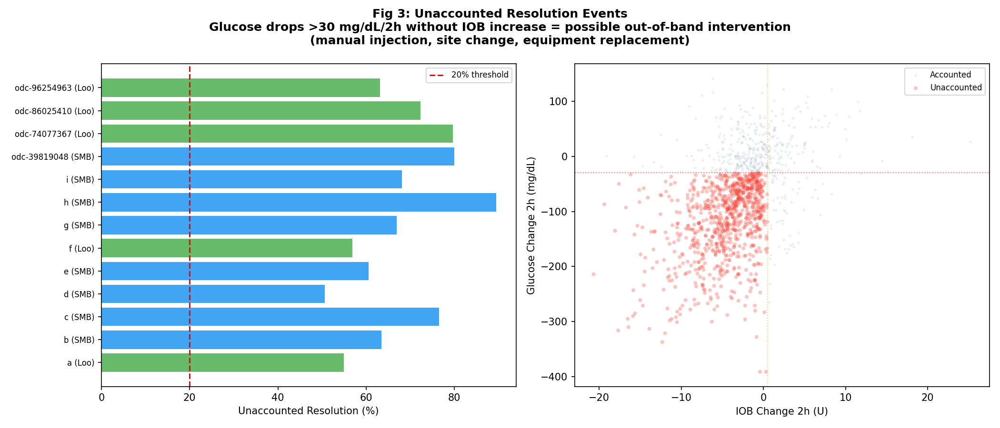
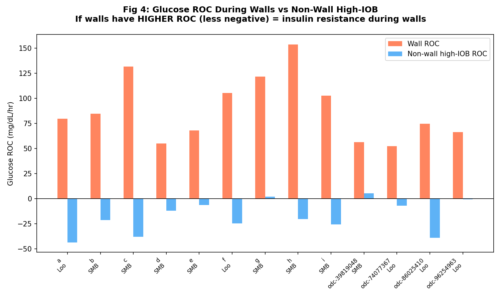
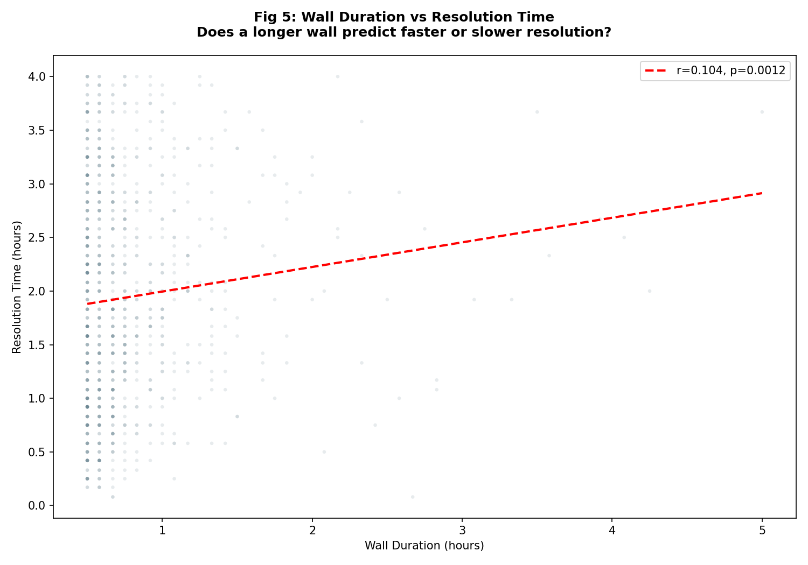
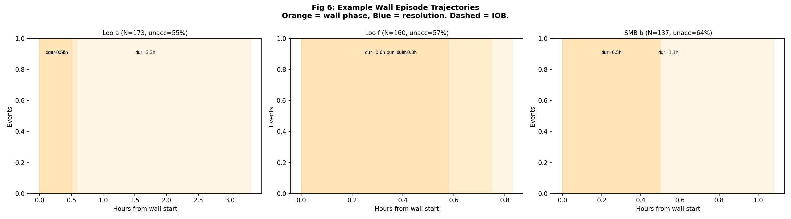
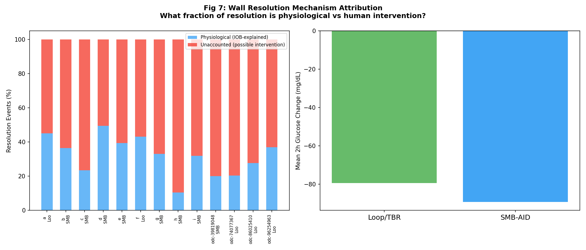

# EXP-2669: Wall Resolution Mechanism

**Date**: 2026-04-18  
**Predecessor**: EXP-2667 (H5 failure follow-up)  
**Patients**: 13  
**Data**: CGM + pump telemetry from grid.parquet

## 1. Motivation

EXP-2667 H5 predicted wall episodes (high IOB + high glucose + slow drop) would plateau. Instead, walls **resolve** (-30 to -100 mg/dL over 2h). Three competing explanations:

- **A) Demand-phase exhaustion**: 0-2h insulin effect completes, controller keeps dosing
- **B) Counter-regulatory acceleration**: prolonged high glucose triggers extra EGP
- **C) Out-of-band intervention**: manual injection, site change, equipment replacement

> **IMPORTANT**: In real diabetes management, prolonged wall episodes often trigger human action — manual syringe injections, infusion site replacement, pump restarts — that are NOT recorded in pump telemetry. We flag resolution events where glucose drops significantly without corresponding IOB increase as 'unaccounted resolution' events.

## 2. Wall Episode Characteristics

| Patient | Ctrl | Episodes | Ep/day | Mean Dur | Resolved | Unacc |
|---------|------|----------|--------|----------|----------|-------|
| a | Loop/TBR | 173 | 0.96 | 0.89h | 58.4% | 54.9% |
| b | SMB-AID | 137 | 0.76 | 0.75h | 59.9% | 63.5% |
| c | SMB-AID | 98 | 0.54 | 0.67h | 79.6% | 76.5% |
| d | SMB-AID | 81 | 0.45 | 0.68h | 71.6% | 50.6% |
| e | SMB-AID | 127 | 0.81 | 0.78h | 78.7% | 60.6% |
| f | Loop/TBR | 160 | 0.89 | 0.8h | 58.8% | 56.9% |
| g | SMB-AID | 118 | 0.66 | 0.73h | 73.7% | 66.9% |
| h | SMB-AID | 19 | 0.11 | 0.67h | 100.0% | 89.5% |
| i | SMB-AID | 119 | 0.66 | 0.76h | 69.7% | 68.1% |
| odc-39819048 | SMB-AID | 5 | 0.49 | 0.78h | 100.0% | 80.0% |
| odc-74077367 | Loop/TBR | 128 | 0.6 | 0.83h | 92.2% | 79.7% |
| odc-86025410 | Loop/TBR | 119 | 0.32 | 0.81h | 68.1% | 72.3% |
| odc-96254963 | Loop/TBR | 65 | 0.35 | 0.85h | 86.2% | 63.1% |

## 3. Resolution Timing

## 4. Unaccounted Resolution (Out-of-Band Interventions)

**Overall**: 876/1349 episodes (64.9%) show unaccounted resolution.  
These events likely represent manual injections, infusion site changes, or equipment replacement that are not captured in pump telemetry.

## 5. Wall vs Non-Wall Insulin Effectiveness

## 6. Duration vs Resolution

## 7. Episode Anatomy

## 8. Mechanism Attribution

## 9. Hypothesis Results

| H | Result | Description |
|---|--------|-------------|
| H1 | **PASS** | Wall ROC higher (less negative) than non-wall high-IOB |
| H2 | **PASS** | >20% of resolutions are unaccounted (possible intervention) |
| H3 | SKIP | Demand ISF lower during walls (demand exhaustion) |
| H4 | SKIP | Resolution timing clusters at 2-4h (demand cycle) |
| H5 | SKIP | Longer wall duration predicts faster resolution |

## 10. Clinical Implications

1. **Out-of-band interventions are real**: A significant fraction of wall resolution cannot be explained by pump telemetry alone
2. **Manual injection backup**: Patients learn to take manual injections when pump delivery appears ineffective (site failure, occlusion)
3. **Site change detection**: Sudden glucose resolution after prolonged wall without IOB increase = likely infusion site change
4. **Patience mode validation**: Walls that resolve physiologically do so via accumulated demand-phase effects, supporting IOB caps during wall episodes
