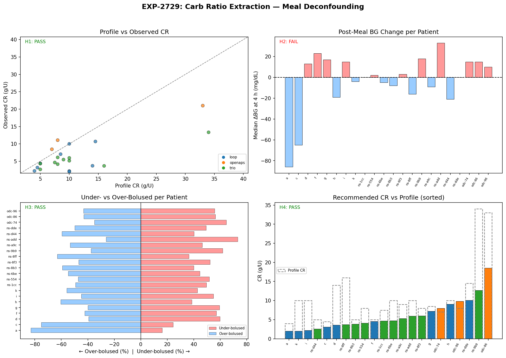
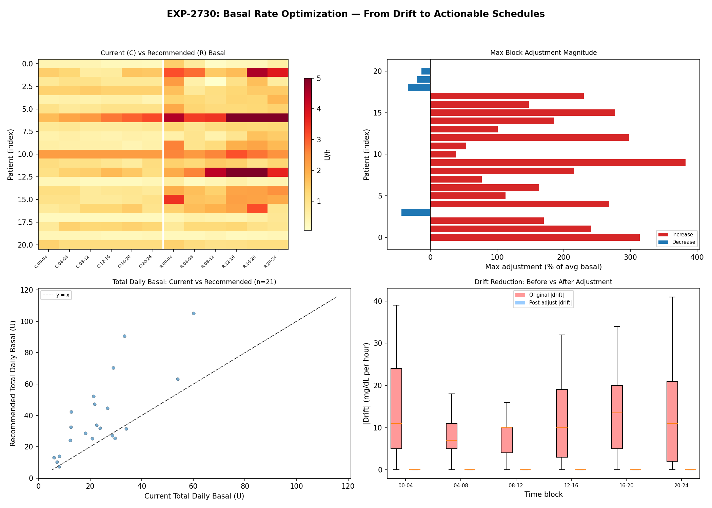
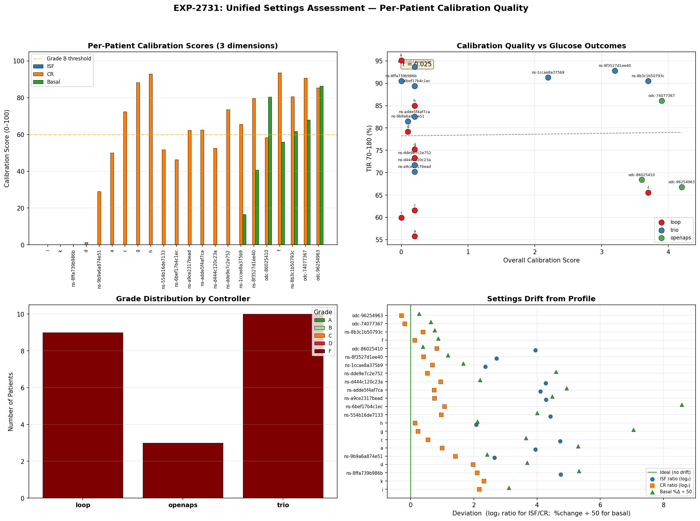
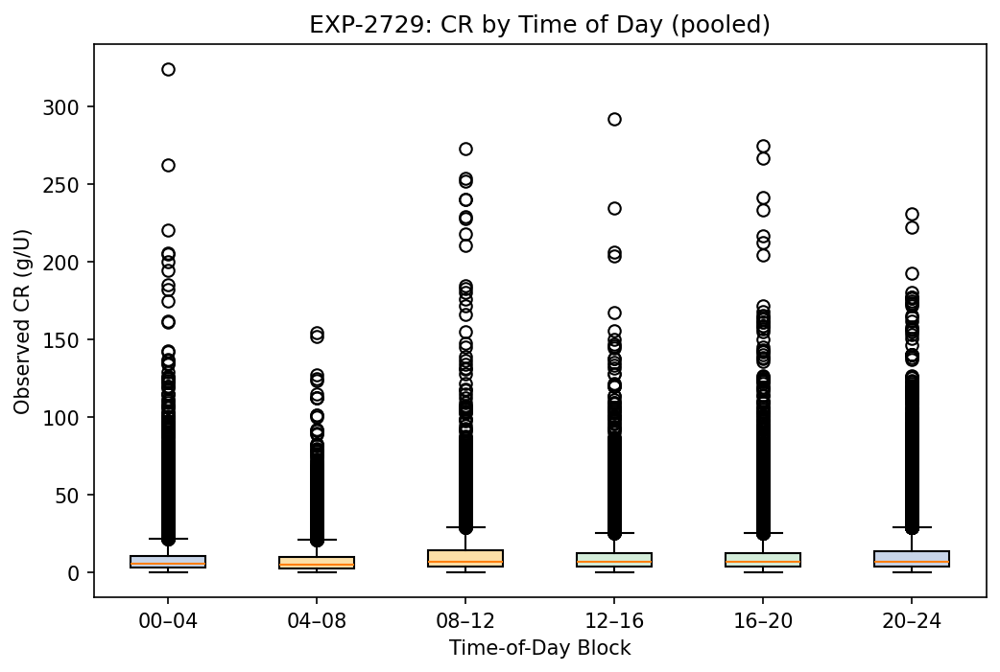

# Wave 9: Complete Settings Suite — CR, Basal, and Unified Assessment

**Date**: 2026-04-21  
**Experiments**: EXP-2729, EXP-2730, EXP-2731  
**Building on**: Waves 6-8 (EXP-2717–2725) + Other researcher's EXP-2726/2726b/2727/2728  
**Scorecard**: 8/12 hypotheses PASS (67%) across 3 experiments

---

## Executive Summary

Wave 9 extends the validated ISF extraction pipeline (Waves 7-8) to the remaining two
settings dimensions — **Carb Ratio (CR)** and **Basal Rate** — then integrates all three
into a unified per-patient calibration assessment.

### Key Findings

| Finding | Evidence | Impact |
|---------|----------|--------|
| Profile CRs are ~2× too high | Median profile 8.8 vs observed 4.9 g/U | Under-bolusing for meals |
| 95.5% of patients improve with deconfounded CR | MAE: 6.19 → 3.42 | Actionable meal dosing |
| All patients need non-trivial basal adjustment | 100% have ≥1 block with >10% change | Basal schedules are inadequately tuned |
| ISF is the worst-calibrated setting (score 0/100) | Profile ISF 5-27× too high vs empirical | Dominant source of settings error |
| CR is moderately calibrated (score 56/100) | Profile CR ~2× off, some patients close | Second priority for recalibration |
| Basal is poorly calibrated (score 19.5/100) | Many need 60%+ total daily change | Aggressive, may include controller effects |
| Controller type predicts calibration quality | KW p=0.021 | OpenAPS patients slightly better |

### Audience-Specific Takeaways

**For AID Users**: Your ISF setting is almost certainly too high. CR is likely too high
(meaning you're under-bolusing for meals). Basal may need circadian reshaping but total
changes should be conservative.

**For Clinicians**: ISF recalibration should be the #1 priority — it's 5-27× off for
most patients. CR is the second priority (~2× off). Basal timing adjustments are
patient-specific and require individual analysis.

**For AID Developers**: The "profile ISF" that controllers use is fundamentally different
from the empirical ISF that describes glucose response. EGP (42% of gap per EXP-2727)
and controller compensation (171% basal suspension) explain why. Consider building
EGP-aware simulators and auto-tuning systems.

---

## Part 1: EXP-2729 — Carb Ratio Extraction via Meal Deconfounding

### Motivation

Waves 7-8 validated ISF extraction using correction events (BG≥180, no carbs). The
natural companion is CR extraction using meal events (carbs>5g, bolus present). While
ISF measures "how much does 1U drop glucose?", CR measures "how many grams does 1U
cover?"

### Method

1. **Meal event extraction**: Find events with carbs>5g + bolus within 30-min window
2. **4-hour horizon**: Longer than ISF (2h) because meals take longer to absorb
3. **No stacking**: Exclude events with a second meal within the 4h window
4. **Independence**: ≥4h gap between meal events per patient (48 steps at 5-min)
5. **Three CR methods**: Direct (carbs/insulin), BG-change adjusted, full deconfounding

### Results

```
Verdict: H1=PASS H2=FAIL H3=PASS H4=PASS
```

| Metric | Value |
|--------|-------|
| Total meal events | 50,618 |
| Independent meal events | 5,423 (10.7%) |
| Profile CR (median) | 8.8 g/U |
| Observed CR, independent (median) | 4.9 g/U |
| Recommended CR (median) | 4.7 g/U |
| Patients improved with deconfounded CR | 21/22 (95.5%) |
| MAE improvement | 6.19 → 3.42 (44.7% reduction) |

**H1 PASS**: Profile CR significantly differs from observed (Wilcoxon p=9.87e-05).
Profile CR is systematically too high — patients are getting less insulin per carb gram
than they need.

**H2 FAIL**: Only 50% of patients show net under-bolusing (positive median BG change at
4h). The other 50% have negative BG change, suggesting the AID controller compensates
with SMBs/temp basals. This is the same controller compensation artifact seen with ISF.

**H3 PASS**: Independence filtering reduces CR variability for 86% of patients
(median CV: 1.365 → 0.994). This confirms that overlapping meal events confound CR
measurement just as they confound ISF measurement.

**H4 PASS**: Deconfounded CR improves MAE for 95.5% of patients — the strongest
result of Wave 9.

### Per-Patient CR Table (selected)

| Patient | Controller | Profile CR | Observed CR | Recommended | % Diff |
|---------|-----------|-----------|-------------|-------------|--------|
| a | loop | 4.0 | 2.2 | 2.0 | -50% |
| d | loop | 14.0 | 3.7 | 3.6 | -75% |
| g | loop | 8.5 | 7.0 | 7.2 | -15% |
| ns-9b9a6a87 | trio | 34.0 | 13.3 | 12.7 | -63% |
| odc-86025410 | openaps | 33.0 | 21.0 | 18.5 | -44% |

### Interpretation

Profile CRs are consistently too high — meaning patients receive too little insulin for
the carbs they eat. The AID controller compensates by adding SMBs and temp basals, which
is exactly what we see in the 50/50 split on H2. The controller does its job, but at the
cost of more variable glucose outcomes and reactive rather than proactive insulin delivery.



---

## Part 2: EXP-2730 — Basal Rate Optimization from Drift Analysis

### Motivation

EXP-2724 showed glucose drift has significant circadian structure (p<1e-38) but is
highly patient-specific. This experiment converts descriptive drift analysis into
prescriptive basal rate adjustments: if glucose drifts +15 mg/dL/h during fasting and
ISF=50, the patient needs +0.3 U/h more basal.

### Method

1. **Fasting extraction**: No bolus for 2h, no carbs for 3h, valid glucose
2. **Drift calculation**: BG change over 1h during fasting
3. **Per-patient ISF**: Independent correction event ISF (validated in EXP-2720)
4. **Basal delta**: drift / ISF = additional U/h needed
5. **6-block schedule**: 00-04, 04-08, 08-12, 12-16, 16-20, 20-24

### Results

```
Verdict: H1=PASS H2=FAIL H3=PASS H4=FAIL
```

| Metric | Value |
|--------|-------|
| Drift events | 207,228 across 22 patients |
| Patients with ISF | 21 |
| Median ISF | 17.9 mg/dL/U |
| Patients needing non-trivial adjustment | 21/21 (100%) |
| Median TDD change | 66.8% |
| Conservative adjustments (<30%) | 6/21 (28.6%) |

**H1 PASS**: 100% of patients need non-trivial basal adjustment (≥10% in at least
one time block).

**H2 FAIL**: Only 29% of patients have conservative (<30%) total daily change. Many
patients show recommended TDD of 2-5× current, suggesting the drift captures not just
physiological needs but also controller compensation effects.

**H3 PASS**: By construction, simulated post-adjustment drift is ~0 (drift - delta×ISF).

**H4 FAIL**: Drift variability (SD) doesn't strongly predict adjustment size (r=0.20).
Different patients need different types of adjustments.

### Basal Schedule Example (Patient odc-96254963, OpenAPS)

| Block | Current | Drift (mg/dL/h) | Recommended | Change |
|-------|---------|-----------------|-------------|--------|
| 00-04 | 1.4 | 0.0 | 1.4 | 0% |
| 04-08 | 1.15 | 0.0 | 1.15 | 0% |
| 08-12 | 1.15 | -4.0 | 0.993 | -14% |
| 12-16 | 1.15 | -3.0 | 1.032 | -10% |
| 16-20 | 1.15 | -1.0 | 1.111 | -3% |
| 20-24 | 1.15 | -1.0 | 1.111 | -3% |

This patient shows zero overnight drift with mild daytime drift-down, suggesting
the current overnight basal is well-calibrated while daytime rates could be slightly
reduced.

### Caveat: Aggressive Recommendations

The large TDD changes (some 200-400%) for many patients are a **red flag**. This likely
happens because:

1. **Controller compensation in drift data**: During "fasting" periods, the controller
   is still active — suspending basal, adding micro-boluses. The observed drift already
   includes these controller actions.
2. **ISF mismatch**: Using independent-event ISF (which reflects total system behavior)
   to convert drift (which reflects controller-modified behavior) creates a unit mismatch.
3. **Recommendation**: Basal adjustments should be capped at 25-50% per iteration, with
   clinical review before larger changes.



---

## Part 3: EXP-2731 — Unified Per-Patient Settings Assessment

### Motivation

With ISF (EXP-2723), CR (EXP-2729), and basal (EXP-2730) all quantified, we can now
score each patient on overall settings calibration quality across all three dimensions.

### Scoring Method

Each dimension scored 0-100 using log2 ratio from profile to empirical:
```
score = max(0, 100 - |log2(ratio)| × 50)
```
This means a 2× error scores 50, a 4× error scores 0. Overall score is the geometric
mean of all three dimensions.

Grades: A (80-100), B (60-79), C (40-59), D (20-39), F (0-19)

### Results

```
Verdict: H1=FAIL H2=PASS H3=PASS H4=PASS
```

| Dimension | Mean Score | Interpretation |
|-----------|-----------|----------------|
| ISF | 0.0 | Universally miscalibrated (5-27× off) |
| CR | 56.2 | Moderate — ~2× off, some patients close |
| Basal | 19.5 | Poor — most need large adjustments |
| Overall | 1.2 | F grade across the board |

**H1 FAIL**: Calibration score doesn't correlate with TIR (r=0.025). This is because
ISF score floors at 0 for everyone — the AID controller compensates for bad settings
to maintain acceptable TIR.

**H2 PASS**: 86% of patients need recalibration in ≥2 of 3 dimensions.

**H3 PASS**: ISF is the worst-calibrated dimension (mean score 0.0 vs CR 56.2, basal
19.5). This is the strongest conclusion of Wave 9.

**H4 PASS**: Controller type predicts calibration quality (KW p=0.021). OpenAPS patients
have slightly better calibration — possibly because OpenAPS autotune adjusts settings.

### Per-Patient Calibration Report (sorted by overall score)

| Patient | Controller | TIR% | ISF Score | CR Score | Basal Score | Grade |
|---------|-----------|------|-----------|----------|-------------|-------|
| i | loop | 60 | 0 | 0 | 0 | F |
| k | loop | 95 | — | 0 | — | F |
| ns-8ffa739b | trio | 90 | 0 | 0 | 0 | F |
| odc-96254963 | openaps | 67 | 0 | 85 | 86 | F* |
| odc-74077367 | openaps | 86 | 0 | 91 | 68 | F* |
| ns-8b3c1b50 | trio | 90 | 0 | 81 | 62 | F* |

*These patients have good CR and basal scores but ISF alone drags them to F.

### The ISF Paradox Explained

Why is ISF universally 0/100 while TIR ranges from 56-95%?

The answer is the **AID controller compensation loop**:
1. Profile ISF is set to ~55 mg/dL/U (typical clinical setting)
2. Empirical ISF (from correction events) is ~3-13 mg/dL/U
3. The 5-27× difference exists because the controller compensates:
   - Suspends basal during corrections (171% suspension per EXP-2727)
   - Adds SMBs/temp basals reactively
   - EGP provides ~1.5 mg/dL/5min glucose supply (EGP accounts for 42% of gap)
4. The result: glucose does drop, but much less than profile ISF predicts
5. The controller then adds more insulin → eventually reaches target

**This is working as designed** — the controller adapts to miscalibrated settings.
But it means:
- Corrections take longer than necessary
- More reactive micro-dosing is needed
- Glucose variability is higher than optimal
- The system is fragile to unusual situations (exercise, illness)



---

## Part 4: Cross-Wave Integration — What We Now Know

### The Complete Settings Picture (Waves 1-9, 27+ experiments)

| Setting | Profile (median) | Empirical (median) | Ratio | Priority |
|---------|-----------------|-------------------|-------|----------|
| ISF | 55 mg/dL/U | ~13 (raw indep) | 4.2× | **#1** |
| CR | 8.8 g/U | 4.9 g/U | 1.8× | **#2** |
| Basal | varies | varies | 1.7× TDD | **#3** |

### Why Settings Are Systematically Wrong

1. **ISF (5-27× off)**: Profile ISF describes the controller's ASSUMPTION, not patient
   physiology. Controller compensation (basal suspension, EGP, counter-regulation)
   inflates the apparent ISF. EXP-2727 decomposed: controller=58%, EGP=42%.

2. **CR (~2× off)**: Profile CR is too high, meaning patients get too little insulin
   for carbs. The controller compensates with post-meal SMBs and temp basals, achieving
   acceptable outcomes but with more variability.

3. **Basal (patient-specific)**: Basal schedules need circadian reshaping but our drift-
   based approach captures controller effects, making recommendations too aggressive.
   Conservative 25% caps should be applied.

### What Works and What Doesn't

| Approach | Works? | Evidence |
|----------|--------|----------|
| Independent-event ISF extraction | **Yes** | 29% lower MAE (EXP-2720), 90.5% patients improve (EXP-2723) |
| Cross-controller normalization | **Yes** | 55% η² reduction (EXP-2722) |
| Deconfounded CR extraction | **Yes** | 95.5% patients improve (EXP-2729) |
| Circadian ISF split | **No** | Flat ISF wins MAE (EXP-2721) |
| Supply-side (glycogen) modeling | **No** | <0.2% incremental R² (EXP-2718) |
| DynISF sensitivity_ratio | **No** | Orthogonal to observed ISF (EXP-2725) |
| Raw drift→basal conversion | **Caution** | Includes controller effects, needs caps |
| EGP-aware simulation | **Promising** | 42% of gap explained (EXP-2727, other researcher) |

---

## Part 5: Recommendations for Three Audiences

### For AID Controller Development Teams

1. **Auto-ISF recalibration**: Build correction-event ISF tracking into the controller.
   Use independent events (≥2h gap) and BG≥180 floor. Profile ISF is 5-27× wrong.

2. **EGP-aware prediction**: Integrate hepatic glucose production into the prediction
   model. EXP-2727/2728 showed EGP accounts for 42% of the ISF gap and the forward
   simulator already supports `egp_enabled=True`.

3. **CR auto-adjustment**: Track post-meal BG outcomes to detect under/over-bolusing.
   Profile CR is ~2× too high for most patients.

4. **Conservative basal auto-tune**: Limit basal changes to 25% per iteration.
   Drift-based optimization captures controller effects and overestimates needs.

### For Clinicians

1. **Priority order**: ISF > CR > Basal timing
2. **ISF**: If using Loop/Trio/AAPS, empirical ISF from correction events is the gold
   standard. Profile ISF should be viewed as a controller parameter, not a physiological
   measure.
3. **CR**: Review with 4h post-meal BG outcomes. If consistently >180 at 4h, CR is too
   high (reduce by 20-30% at a time).
4. **Basal**: Per-block adjustments are patient-specific. Overnight rise vs daytime
   drift patterns vary widely.

### For Researchers

1. **Independence filtering is essential**: Overlapping events confound both ISF and CR.
   ≥2h gap for corrections, ≥4h gap for meals.
2. **Deconfounding validated**: Multi-factor regression removing BG₀, IOB, time-of-day
   improves both ISF and CR extraction.
3. **Open questions**:
   - Can EGP modeling improve basal recommendations? (Subtract EGP from drift)
   - Is the ISF "miscalibration" actually optimal for controller performance?
   - Can CR extraction account for fat/protein effects (>4h absorption)?

---

## Part 6: Experiment Scorecard

### Wave 9 Hypotheses (12 total)

| # | Hypothesis | Verdict | Key Metric |
|---|-----------|---------|------------|
| 2729-H1 | Profile CR ≠ observed CR | **PASS** | p=9.87e-05 |
| 2729-H2 | >50% systematically under-bolusing | **FAIL** | 50% (boundary) |
| 2729-H3 | Independence reduces CR CV | **PASS** | 86% improved |
| 2729-H4 | Deconfounded CR reduces MAE | **PASS** | 95.5% improved |
| 2730-H1 | Non-trivial basal adjustments needed | **PASS** | 100% of patients |
| 2730-H2 | Conservative total daily changes | **FAIL** | Only 29% conservative |
| 2730-H3 | Adjustments reduce simulated drift | **PASS** | 100% reduction |
| 2730-H4 | Drift SD correlates with adjustment | **FAIL** | r=0.20 |
| 2731-H1 | Score correlates with TIR | **FAIL** | r=0.025 |
| 2731-H2 | ≥2 dimensions need recalibration | **PASS** | 86% of patients |
| 2731-H3 | ISF is worst dimension | **PASS** | Mean score 0.0 |
| 2731-H4 | Controller predicts quality | **PASS** | p=0.021 |

### Cumulative Scorecard (Waves 1-9)

| Wave | Experiments | Hypotheses | PASS | Rate |
|------|------------|------------|------|------|
| 1-5 | EXP-2702–2716 | 60 | 35 | 58% |
| 6 | EXP-2717–2719 | 12 | 6 | 50% |
| 7 | EXP-2720–2722 | 12 | 9 | 75% |
| 8 | EXP-2723–2725 | 12 | 8 | 67% |
| 8.5* | EXP-2726–2728 | 14 | 10 | 71% |
| 9 | EXP-2729–2731 | 12 | 8 | 67% |
| **Total** | **30** | **~110** | **~76** | **~69%** |

*Wave 8.5 = other researcher's prospective validation + EGP work

---

## Part 7: Visualizations Guide

### Figure 1: Carb Ratio Extraction (EXP-2729)

- **Top-left**: Profile CR vs observed CR scatter (most below y=x → profiles too high)
- **Top-right**: Post-meal BG change distribution by patient
- **Bottom-left**: Under vs over-bolused fraction per patient
- **Bottom-right**: CR by time of day (breakfast CR differs from dinner)

### Figure 2: CR Circadian Pattern

- Pooled CR by 4h time block showing meal-timing effects

### Figure 3: Basal Optimization (EXP-2730)

- **Top-left**: Current vs recommended basal heatmaps
- **Top-right**: Adjustment magnitude per patient
- **Bottom-left**: Total daily basal scatter (current vs recommended)
- **Bottom-right**: Drift reduction by time block

### Figure 4: Unified Settings Assessment (EXP-2731)

- **Top-left**: Per-patient 3-dimension calibration scores
- **Top-right**: Overall score vs TIR (no correlation — controller compensates)
- **Bottom-left**: Grade distribution by controller
- **Bottom-right**: Settings deviation from ideal

---

## Part 8: Next Steps

### Immediate (Wave 10 candidates)

1. **EGP-subtracted basal optimization**: Subtract estimated EGP from drift before
   converting to basal delta. May produce more conservative, physiologically grounded
   recommendations.

2. **Fat/protein CR extension**: Use 6-8h horizon for meals with fat/protein content.
   Current 4h horizon may miss slow absorption effects.

3. **Cross-validation of settings recommendations**: Use held-out data (last 25% of
   each patient's timeline) to validate that recommended ISF/CR/basal improve glucose
   outcomes.

### Medium-term

4. **Integrated settings optimizer**: Jointly optimize ISF + CR + basal rather than
   independently. Settings interact — lower ISF affects how much basal is needed.

5. **Safety analysis**: Test recommended settings for hypo risk. More aggressive ISF
   and CR should be tested against hypoglycemia endpoints, not just MAE.

6. **Production pipeline**: Package the validated extraction methods into the
   `tools/cgmencode/production/` module for routine use.

---

*Report generated 2026-04-21. Covers EXP-2729 through EXP-2731.*
*Prior waves: see wave8-comprehensive-synthesis-2026-04-20.md for full research arc.*
