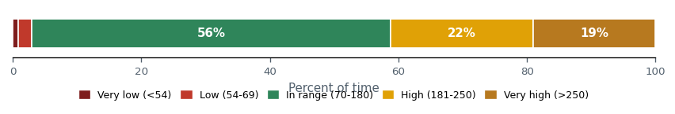
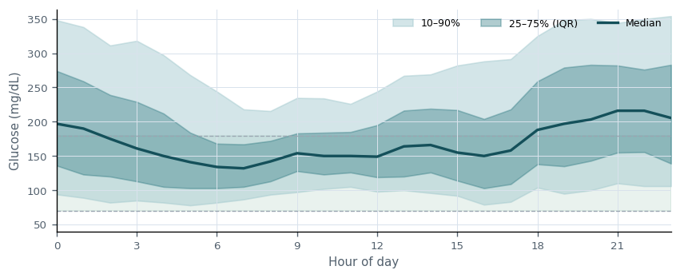
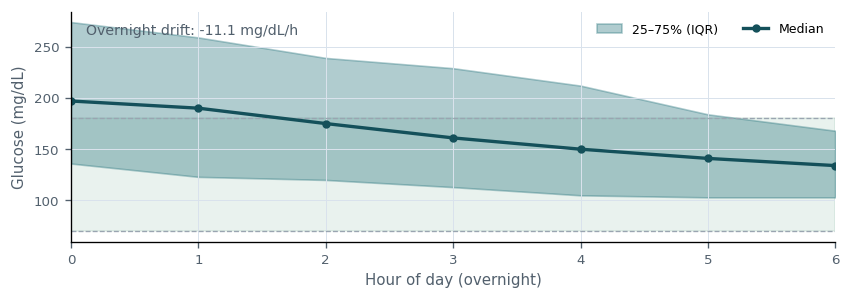
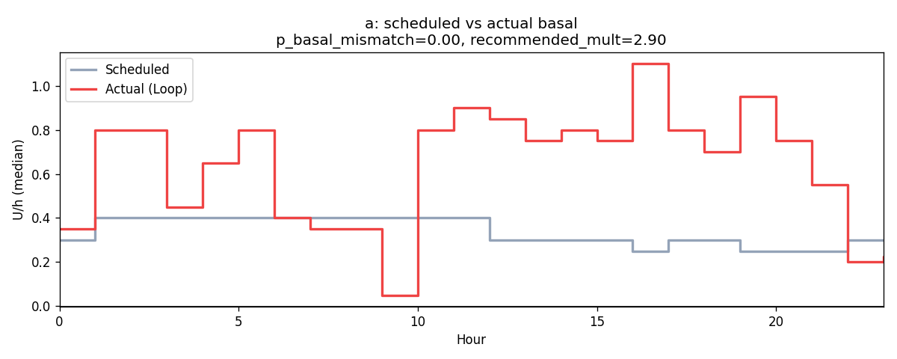
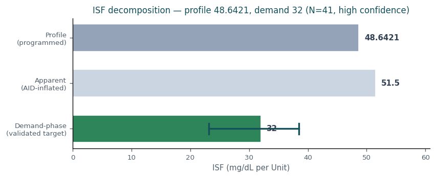
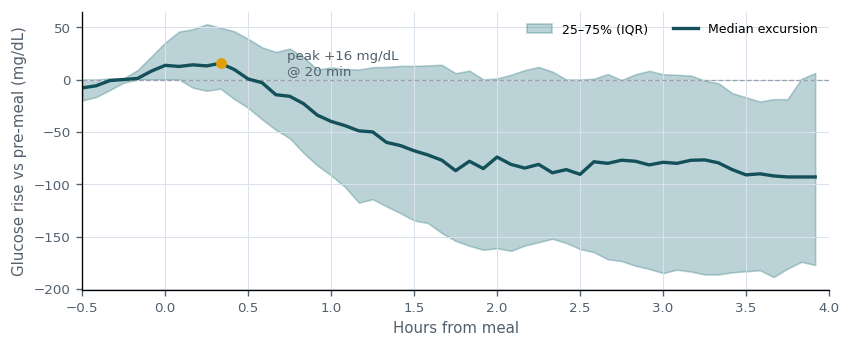

# Clinical Decision Support — patient `a`

_Generated: 2026-07-01T18:26:14.531984+00:00_

## Insulin sufficiency

Overall insulin delivery shows opportunity for improvement (TIR 56%, TBR<70 3.0%, TAR>180 41%). 2 risk(s) identified; 1 parameter change(s) proposed this cycle.

**Main risks:**
- Hyperglycemia burden elevated (TAR>180 41.2% vs target 25%).
- Glycemic variability high (CV 45% vs target 36%).

**What's working:**
- Hypoglycemia within target (TBR<70 3.0%).

**Time-in-range distribution**

_Share of time in each glycemic band over 45,819 readings. Green is the 70-180 mg/dL target; reds are lows, ambers are highs._

**Ambulatory glucose profile (AGP)**

_Median glucose by time of day with interquartile (25–75%) and 10–90% bands. The green zone is the 70–180 mg/dL target; a flat median inside it is the goal._

## Recommendations

### Basal

**Decision:** NO CHANGE  
**Hold reason:** insufficient_evidence  
**Summary:** Basal: no change recommended (insufficient evidence (confidence 0.10 below 0.50)).

**Justification:** Basal reviewed: a directional signal exists (theoretical target 0.23) but is held due to insufficient evidence (confidence 0.10 below 0.50). Re-evaluate at the next review.

**Expected outcomes (2-week):**

| Metric | Baseline | Expected | Direction |
|---|---|---|---|
| TIR | 55.8% | 55.8% | stable |
| TBR<70 | 2.96% | 2.96% | stable |
| TAR>180 | 41.2% | 41.2% | stable |

**Overnight glucose profile (00:00–06:00)**

_Median overnight glucose with IQR. A rising trend suggests basal is too low; a falling trend suggests it is too high. Used to contextualize the basal recommendation._

**Scheduled vs actual basal**

_Median programmed basal vs what the loop actually delivered by hour. Persistent loop deviation indicates the scheduled rate is mismatched in that direction._

**Success criteria** (revisit in 14 days):
- Basal held: glycemic metrics remain within tolerance of baseline over the 2-week window.
- No new hypoglycemia signal (TBR<70 stays below 4%).

**Stop / escalate criteria:**
- TBR<70 rises by more than 1 pp -> escalate review.
- TIR declines materially -> re-open Basal for change.

### ISF

**Decision:** CHANGE  
**Summary:** ISF: decrease from 48.6421 to 44 (-10%).

| Field | Value |
|---|---|
| Current | 48.6421 |
| Practical (implement now) | 44 (-10%) |
| Time block | 00:00–24:00 |
| Confidence | 0.80 |

**Justification:** ISF decrease: implement the practical step 48.6421 -> 44 (-10%) now. Theoretical optimum is 44 (-10%); the practical step honors a safe titration cap of 20% per cycle. This derives from a validated deconfounded estimate (the controller-masking confound is already removed), so it is not down-weighted for controller masking; controller-masking confidence penalty reversed (0.30→0.80, capped for safety). Demand-phase ISF measures true insulin effect (0–2h, before EGP suppression). Conservative 25% step: 49 → 44 mg/dL/U. Validated: dose-dependent r=-0.56 (EXP-2640), response-curve R²=0.805 (EXP-1301), circadian 10-20% RMSE (EXP-2652). Confirmable within 2 weeks of stable use.

**Expected outcomes (2-week):**

| Metric | Baseline | Expected | Direction |
|---|---|---|---|
| TIR | 55.8% | 61.6% | increase |
| TBR<70 | 2.96% | 2.96% | stable |
| TAR>180 | 41.2% | 35.4% | decrease |

**Demand-phase ISF decomposition**

_Profile ISF vs the apparent/correction ISF (amplified by AID compensation) vs the demand-phase ISF — the validated 0–2h insulin effect (EXP-2651) and the true target, shown with its 95% confidence interval. The apparent value is not the target; the recommendation tracks the demand-phase value, bounded by a safety margin (EXP-2738).  Recommended direction: decrease ISF toward the demand-phase target._

**ISF reconciliation (profile vs observed)**

_Profile ISF vs the correction-derived (observed/apparent) ISF. The observed value is amplified by AID compensation (basal suspension during corrections), so it is NOT a direct ISF target: the recommendation deliberately preserves the controller's residual safety margin (EXP-2738) rather than chasing the apparent value. Separately, a lower effective ISF for large single corrections is dose-shaping guidance (split the dose), not a baseline schedule change._

**Success criteria** (revisit in 14 days):
- TIR improves by at least +2.9 pp toward the projected 62% within 2 weeks.
- TBR<70 does not worsen by more than 1 pp.

**Stop / escalate criteria:**
- TBR<70 increases by more than 1 pp after the ISF change -> revert and escalate.
- Severe hypoglycemia (TBR<54) emerges -> revert immediately.
- No measurable TIR improvement at 2 weeks -> reassess direction.

### Carb ratio

**Decision:** NO CHANGE  
**Hold reason:** insufficient_evidence  
**Summary:** Carb ratio: no change recommended (insufficient evidence (confidence 0.40 below 0.50)).

**Justification:** Carb ratio reviewed: a directional signal exists (theoretical target 2.7) but is held due to insufficient evidence (confidence 0.40 below 0.50). Re-evaluate at the next review.

**Expected outcomes (2-week):**

| Metric | Baseline | Expected | Direction |
|---|---|---|---|
| TIR | 55.8% | 55.8% | stable |
| TBR<70 | 2.96% | 2.96% | stable |
| TAR>180 | 41.2% | 41.2% | stable |

**Post-meal glucose excursion**

_Median glucose rise after 75 carb-counted, bolused meals (peak +16 mg/dL at 20 min; -93 mg/dL vs baseline at 4 h). Carb ratio held this cycle; this profile is the baseline to compare against at the next review._

**Success criteria** (revisit in 14 days):
- Carb ratio held: glycemic metrics remain within tolerance of baseline over the 2-week window.
- No new hypoglycemia signal (TBR<70 stays below 4%).

**Stop / escalate criteria:**
- TBR<70 rises by more than 1 pp -> escalate review.
- TIR declines materially -> re-open Carb ratio for change.

## Overall justification

Practical changes this cycle: ISF 48.6421->44. Each practical step is the safe-titration projection of a larger theoretical optimum (documented in the addenda). Held/deferred: Basal (insufficient_evidence), Carb ratio (insufficient_evidence).

## Addenda

- Factors considered: time-in-range distribution, hypo/hyper burden, glycemic variability, per-parameter advisory evidence, and cross-parameter sequencing.
- Basal theoretical optimum: 0.23 (-23% vs current 0.3); held this cycle.
- ISF theoretical optimum: 44 (-10% vs current 48.6421); practical step capped at 20%/cycle -> 44.
- Carb ratio theoretical optimum: 2.7 (-32% vs current 4); held this cycle.
- Risks reviewed and mitigated: Hyperglycemia burden elevated (TAR>180 41.2% vs target 25%). Glycemic variability high (CV 45% vs target 36%).
- Deconfounding applied: ISF recommendation(s) derive from validated deconfounded estimates (e.g. demand-phase ISF EXP-2651, correction-denominator/bilateral EXP-2741, deconfounded basal EXP-3447). The controller-masking confidence penalty does not apply to these, improving accuracy without removing the controller's residual safety margin (EXP-2738).
- Mitigations: changes are bounded by a per-cycle titration cap; carb ratio is sequenced after basal/ISF to avoid confounded adjustment; explicit stop/escalate criteria accompany every recommendation for the 2-week feedback loop.

## Reimbursement justification

**Data sufficiency:** Analysis based on 180 days of CGM data (45,819 readings). Sufficient for time-in-range and titration assessment.

**Risks reviewed:**
- Hyperglycemia burden elevated (TAR>180 41.2% vs target 25%).
- Glycemic variability high (CV 45% vs target 36%).

**Mitigations:**
- Recommendations bounded by a safe per-cycle titration cap.
- Carb ratio sequenced after basal/ISF to prevent confounded change.
- Explicit stop/escalate criteria defined for each recommendation.

**Alternatives discussed:**
- Considered no-change vs incremental titration vs settings reboot.
- Theoretical optima documented but deferred in favor of safe steps.

**Patient-specific barriers:**
- No patient-reported adherence, supply, or prescription barriers noted at this review.

**Agreed plan:** Agreed plan: ISF -> 44. Re-evaluate in 2 weeks.

**Expected trajectory:** Projected time-in-range at next review: ~62% (baseline 56%). Outcome will be scored against the per-recommendation success and stop/escalate criteria.

**Follow-up date:** 2026-07-15
