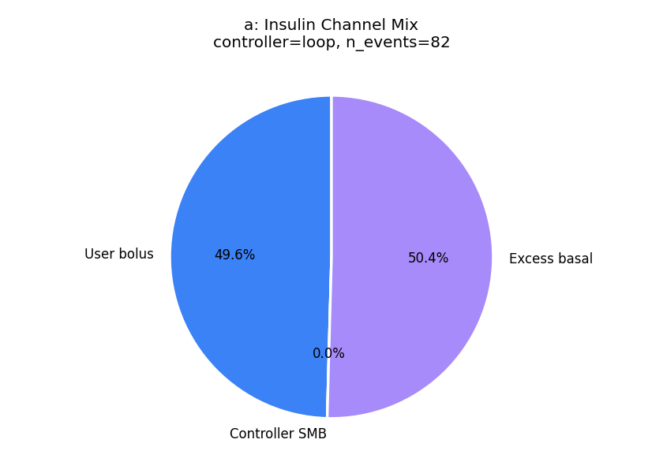
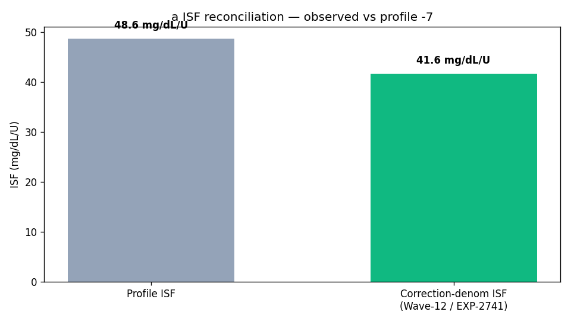
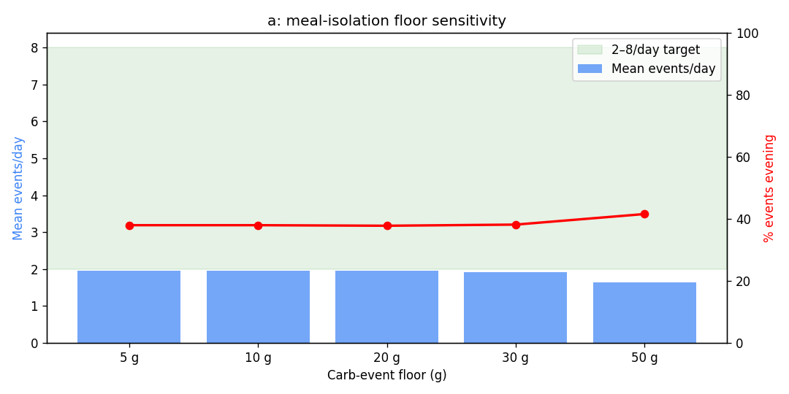
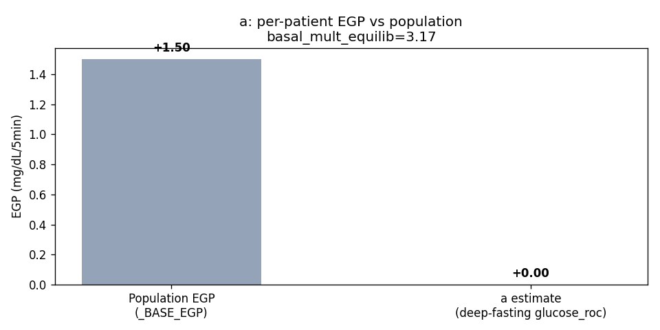

# Clinical Analysis Report — patient `a`

_Generated: 2026-04-27T05:56:46.955842+00:00_  
_Source parquet: `/home/bewest/src/rag-nightscout-ecosystem-alignment/externals/ns-parquet/training`_  
_Profile timezone: `Etc/GMT+7`_  
_Days of data: 180.0_

## 1. Glycemic summary

| Metric | Value |
|---|---|
| Mean glucose (mg/dL) | 180.9 |
| GMI / eA1c (%) | 7.64 |
| TIR 70–180 (%) | 55.8 |
| TBR <70 (%) | 2.96 |
| TBR <54 (%) | 0.82 |
| TAR >180 (%) | 41.2 |
| TAR >250 (%) | 19.07 |
| CV (%) | 45.0 |
| n readings | 45,819 |

## 2. Per-patient EGP (read-only)

- Method: EXP-2739 fasting-drift, deep-fasting subset
- Patient glucose_roc (low-IOB fasting): **0.000** mg/dL/5min  (population _BASE_EGP=1.50)
- Controller basal multiplier in equilibrium: **3.17**
- Sample size: 12,764 deep-fasting rows, 1,833 equilibrium rows

## 3. Meal-isolation smell test

_Source: inferred meals from the production residual+insulin spectral detector (logged-carb input is treated as an unreliable prior). Logged column is shown for comparison only._

| Floor | Inferred events/day | Logged events/day | Target band | In band? |
|---|---|---|---|---|
| ≥5g | 1.96 | 3.63 | 2.0–10.0 | ❌ |
| ≥10g | 1.96 | 2.96 | 2.0–10.0 | ❌ |
| ≥20g | 1.96 | 1.12 | 2.0–8.0 | ❌ |
| ≥30g | 1.92 | 0.11 | 2.0–6.0 | ❌ |
| ≥50g | 1.64 | 0.01 | 1.0–3.0 | ✅ |

## 4. Meal-logging QC

- Flag: **well_aligned**
- Logged: 532 (2.96/day)
- Inferred (rises): 353 (1.96/day)
- Logged / inferred ratio: 1.51  _(reconciliation rate; distinct from the `unannounced_meal_warning` fraction in §5, which is unannounced ÷ total detected meals)_

## 4a. Wave-13 facts (read-only)

**Controller dynamics (EXP-2753)**

| Field | Value |
|---|---|
| controller_type | loop |
| n_events | 82 |
| mean_correction_fraction | 0.496 |
| mean_smb_fraction | 0.000 |
| corr_denom_gap_closure | 0.76 |
| isf_profile_median | 49 |
| isf_corr_denom_median | 42 |

**Basal mismatch (EXP-2869)**

| Field | Value |
|---|---|
| p_basal_mismatch | 0.00 |
| median_recommended_mult | 2.90 |

**ISF gap (EXP-2861)**

| Field | Value |
|---|---|
| p_isf_under_correction | 0.18 |
| p_isf_over_correction | 0.00 |

**Recovery dynamics (EXP-2862)**

| Field | Value |
|---|---|
| p_low_recovery | 1.000 |

**Phenotype**

| Field | Value |
|---|---|
| stack_score | 5.950 |
| brake_ratio | 0.376 |
| counter_reg_intercept | None |
| beta_nadir | None |
| p_haaf | None |
| evening_bolus_excess_4h | None |
| evening_iob_at_descent | None |
| controller_lineage | loop |

## 5. Recommendations

### Rec 1: adjust_basal_rate (priority 2), predicted TIR Δ -15.0 pp
- Decrease overnight basal by 25% (from 0.30 to 0.23 U/hr) between 00:00-06:00. Glucose drifts -10.3 mg/dL/hr overnight.
- Settings change: **basal_rate** decrease 0.30000001192092896 → 0.23 (+25 %)
- Rationale: Decrease overnight basal by 25% (from 0.30 to 0.23 U/hr) between 00:00-06:00. Glucose drifts -10.3 mg/dL/hr overnight.

### Rec 2: adjust_isf (priority 2), predicted TIR Δ +5.8 pp
- Demand-phase ISF measures true insulin effect (0–2h, before EGP suppression). Conservative 25% step: 49 → 44 mg/dL/U. Validated: dose-dependent r=-0.56 (EXP-2640), response-curve R²=0.805 (EXP-1301), circadian 10-20% RMSE (EXP-2652). Confirmable within 2 weeks of stable use.
- Settings change: **isf** decrease 48.642093658447266 → 44.0 (+24 %)
- Rationale: Demand-phase ISF measures true insulin effect (0–2h, before EGP suppression). Conservative 25% step: 49 → 44 mg/dL/U. Validated: dose-dependent r=-0.56 (EXP-2640), response-curve R²=0.805 (EXP-1301), circadian 10-20% RMSE (EXP-2652). Confirmable within 2 weeks of stable use.

### Rec 3: adjust_cr (priority 2), predicted TIR Δ +1.6 pp
- Decrease CR by 32% (from 4 to 3 g/U). Analysis of 100 meal-bolus events shows actual carb coverage is 68% of the current profile CR. Meals are systematically under-bolused.
- Settings change: **cr** decrease 4.0 → 2.7 (+25 %)
- Rationale: Decrease CR by 32% (from 4 to 3 g/U). Analysis of 100 meal-bolus events shows actual carb coverage is 68% of the current profile CR. Meals are systematically under-bolused.

### Rec 4: adjust_correction_threshold (priority 2), predicted TIR Δ +0.3 pp
- Increase correction threshold from 180 to 210 mg/dL. Corrections below 210 mg/dL show net-negative outcomes: glucose rebounds and hypo risk exceed the glucose-lowering benefit. Per-patient thresholds range 130-290 mg/dL. Predicted TIR improvement: +0.3pp.
- Settings change: **correction_threshold** increase 180.0 → 210.0 (+17 %)
- Rationale: Increase correction threshold from 180 to 210 mg/dL. Corrections below 210 mg/dL show net-negative outcomes: glucose rebounds and hypo risk exceed the glucose-lowering benefit. Per-patient thresholds range 130-290 mg/dL. Predicted TIR improvement: +0.3pp.

### Rec 5: unannounced_meal_warning (priority 3), predicted TIR Δ +2.0 pp
- 37% of detected meals have no carb entry. Logging meals improves prediction accuracy and enables better pre-bolus timing.

### Rec 6: clinical_insight (priority 3), predicted TIR Δ +1.0 pp
- Time above range is 41.2%. Consider reviewing correction factors and carb counting.

### Rec 7: loop_override_recommendation (priority 3), predicted TIR Δ +1.5 pp
- Consider configuring a controller override named "Dinner Aggressive" active 18:00–06:00 with target 100 mg/dL and ISF ratio 0.85 (49 → 41). Late-night peak (374 mg/dL) sits 172 mg/dL above the dinner baseline (202 mg/dL), indicating sustained post-dinner overshoot — current evening settings under-cover the late absorption phase.

### Rec 8: design_migration_hypothetical (priority 3), predicted TIR Δ +14.0 pp
- Cross-design hypothetical (EXP-2916–2944): a patient with your current profile (TIR 56%, TBR 2.9%, TAR 41%) on Loop migrating to Trio or AAPS (oref1) would expect roughly +14.0 pp TIR (+0.0 pp TBR, -16.3 pp TAR) based on cohort means. This is a directional estimate from cross-design pooling, not a per-patient simulation. Settings tuning on the current controller may capture much of the same benefit (see other recommendations in this report).

## 6. Plots

- 
- 
- 
- 
- 
- 
