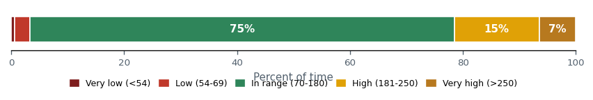
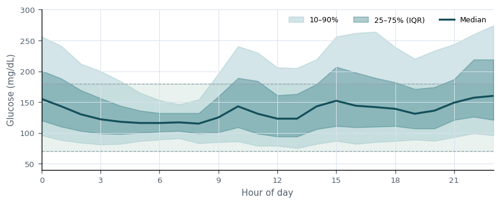
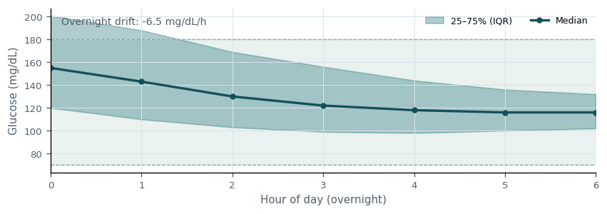
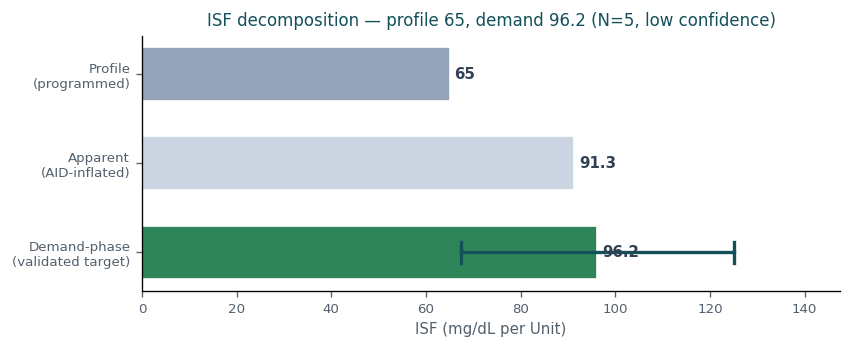
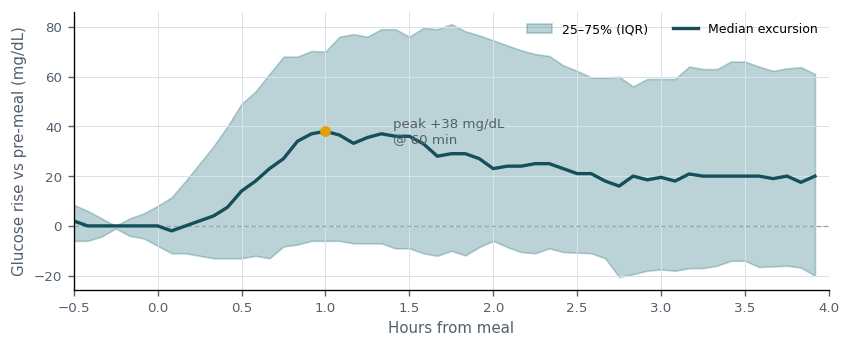

# Clinical Decision Support — patient `g`

_Generated: 2026-07-01T18:27:11.197100+00:00_

## Insulin sufficiency

Overall insulin delivery shows opportunity for improvement (TIR 75%, TBR<70 3.2%, TAR>180 22%). 1 risk(s) identified; 0 parameter change(s) proposed this cycle.

**Main risks:**
- Glycemic variability high (CV 41% vs target 36%).

**What's working:**
- Time-in-range at goal (TIR 75%).
- Hypoglycemia within target (TBR<70 3.2%).

**Time-in-range distribution**

_Share of time in each glycemic band over 46,151 readings. Green is the 70-180 mg/dL target; reds are lows, ambers are highs._

**Ambulatory glucose profile (AGP)**

_Median glucose by time of day with interquartile (25–75%) and 10–90% bands. The green zone is the 70–180 mg/dL target; a flat median inside it is the goal._

## Recommendations

### Basal

**Decision:** NO CHANGE  
**Hold reason:** insufficient_evidence  
**Summary:** Basal: no change recommended (insufficient evidence (confidence 0.22 below 0.50)).

**Justification:** Basal reviewed: a directional signal exists (theoretical target 0.36) but is held due to insufficient evidence (confidence 0.22 below 0.50). Re-evaluate at the next review.

**Expected outcomes (2-week):**

| Metric | Baseline | Expected | Direction |
|---|---|---|---|
| TIR | 75.2% | 75.2% | stable |
| TBR<70 | 3.24% | 3.24% | stable |
| TAR>180 | 21.5% | 21.5% | stable |

**Overnight glucose profile (00:00–06:00)**

_Median overnight glucose with IQR. A rising trend suggests basal is too low; a falling trend suggests it is too high. Used to contextualize the basal recommendation._

**Scheduled vs actual basal**

_Median programmed basal vs what the loop actually delivered by hour. Persistent loop deviation indicates the scheduled rate is mismatched in that direction._

**Success criteria** (revisit in 14 days):
- Basal held: glycemic metrics remain within tolerance of baseline over the 2-week window.
- No new hypoglycemia signal (TBR<70 stays below 4%).

**Stop / escalate criteria:**
- TBR<70 rises by more than 1 pp -> escalate review.
- TIR declines materially -> re-open Basal for change.

### ISF

**Decision:** NO CHANGE  
**Hold reason:** insufficient_evidence  
**Summary:** ISF: no change recommended (insufficient evidence (confidence 0.13 below 0.50)).

**Justification:** ISF reviewed: a directional signal exists (theoretical target 98) but is held due to insufficient evidence (confidence 0.13 below 0.50). Re-evaluate at the next review.

**Expected outcomes (2-week):**

| Metric | Baseline | Expected | Direction |
|---|---|---|---|
| TIR | 75.2% | 75.2% | stable |
| TBR<70 | 3.24% | 3.24% | stable |
| TAR>180 | 21.5% | 21.5% | stable |

**Demand-phase ISF decomposition**

_Profile ISF vs the apparent/correction ISF (amplified by AID compensation) vs the demand-phase ISF — the validated 0–2h insulin effect (EXP-2651) and the true target, shown with its 95% confidence interval. The apparent value is not the target; the recommendation tracks the demand-phase value, bounded by a safety margin (EXP-2738)._

**ISF reconciliation (profile vs observed)**

_Profile ISF vs the correction-derived (observed/apparent) ISF. The observed value is amplified by AID compensation (basal suspension during corrections), so it is NOT a direct ISF target: the recommendation deliberately preserves the controller's residual safety margin (EXP-2738) rather than chasing the apparent value. Separately, a lower effective ISF for large single corrections is dose-shaping guidance (split the dose), not a baseline schedule change._

**Success criteria** (revisit in 14 days):
- ISF held: glycemic metrics remain within tolerance of baseline over the 2-week window.
- No new hypoglycemia signal (TBR<70 stays below 4%).

**Stop / escalate criteria:**
- TBR<70 rises by more than 1 pp -> escalate review.
- TIR declines materially -> re-open ISF for change.

### Carb ratio

**Decision:** NO CHANGE  
**Hold reason:** insufficient_evidence  
**Summary:** Carb ratio: no change recommended (insufficient evidence (confidence 0.26 below 0.50)).

**Justification:** Carb ratio reviewed: a directional signal exists (theoretical target 6.7) but is held due to insufficient evidence (confidence 0.26 below 0.50). Re-evaluate at the next review.

**Expected outcomes (2-week):**

| Metric | Baseline | Expected | Direction |
|---|---|---|---|
| TIR | 75.2% | 75.2% | stable |
| TBR<70 | 3.24% | 3.24% | stable |
| TAR>180 | 21.5% | 21.5% | stable |

**Post-meal glucose excursion**

_Median glucose rise after 255 carb-counted, bolused meals (peak +38 mg/dL at 60 min; +20 mg/dL vs baseline at 4 h). Carb ratio held this cycle; this profile is the baseline to compare against at the next review._

**Success criteria** (revisit in 14 days):
- Carb ratio held: glycemic metrics remain within tolerance of baseline over the 2-week window.
- No new hypoglycemia signal (TBR<70 stays below 4%).

**Stop / escalate criteria:**
- TBR<70 rises by more than 1 pp -> escalate review.
- TIR declines materially -> re-open Carb ratio for change.

## Overall justification

No parameter changes are recommended this cycle; all domains were reviewed and held with documented rationale. Held/deferred: Basal (insufficient_evidence), ISF (insufficient_evidence), Carb ratio (insufficient_evidence).

## Addenda

- Factors considered: time-in-range distribution, hypo/hyper burden, glycemic variability, per-parameter advisory evidence, and cross-parameter sequencing.
- Basal theoretical optimum: 0.36 (-40% vs current 0.6); held this cycle.
- ISF theoretical optimum: 98 (+51% vs current 65); held this cycle.
- Carb ratio theoretical optimum: 6.7 (-21% vs current 8.5); held this cycle.
- Risks reviewed and mitigated: Glycemic variability high (CV 41% vs target 36%).
- Mitigations: changes are bounded by a per-cycle titration cap; carb ratio is sequenced after basal/ISF to avoid confounded adjustment; explicit stop/escalate criteria accompany every recommendation for the 2-week feedback loop.

## Reimbursement justification

**Data sufficiency:** Analysis based on 180 days of CGM data (46,151 readings). Sufficient for time-in-range and titration assessment.

**Risks reviewed:**
- Glycemic variability high (CV 41% vs target 36%).

**Mitigations:**
- Recommendations bounded by a safe per-cycle titration cap.
- Carb ratio sequenced after basal/ISF to prevent confounded change.
- Explicit stop/escalate criteria defined for each recommendation.

**Alternatives discussed:**
- Considered no-change vs incremental titration vs settings reboot.
- Theoretical optima documented but deferred in favor of safe steps.

**Patient-specific barriers:**
- No patient-reported adherence, supply, or prescription barriers noted at this review.

**Agreed plan:** Agreed plan: maintain current settings with documented rationale; re-evaluate in 2 weeks.

**Expected trajectory:** Projected time-in-range at next review: ~75% (baseline 75%). Outcome will be scored against the per-recommendation success and stop/escalate criteria.

**Follow-up date:** 2026-07-15
