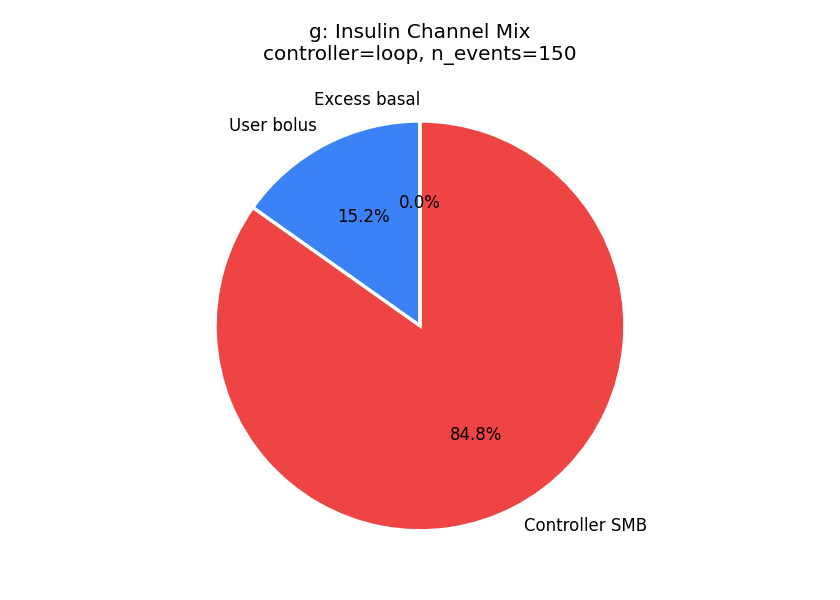
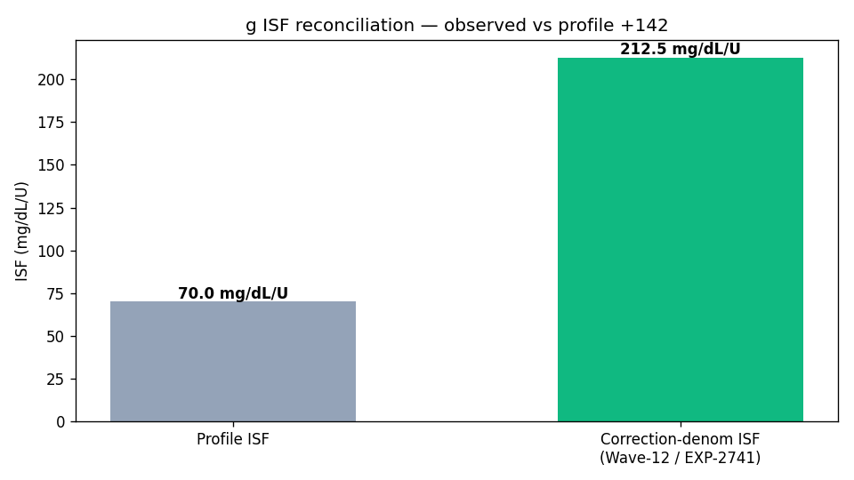
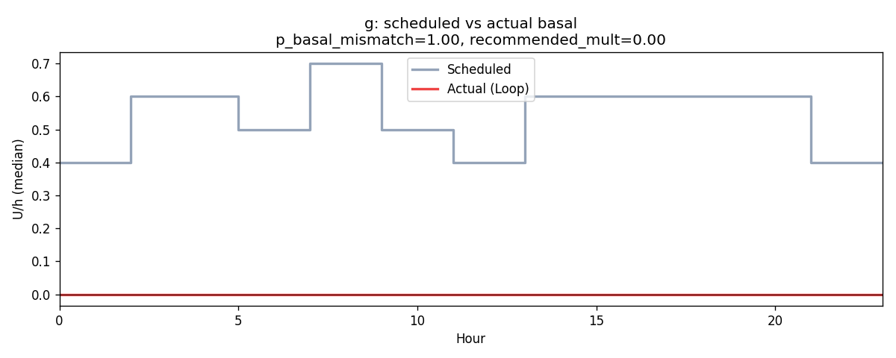
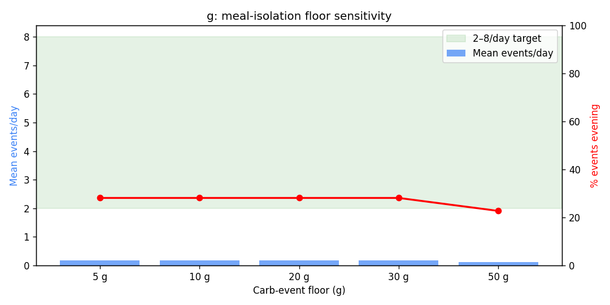
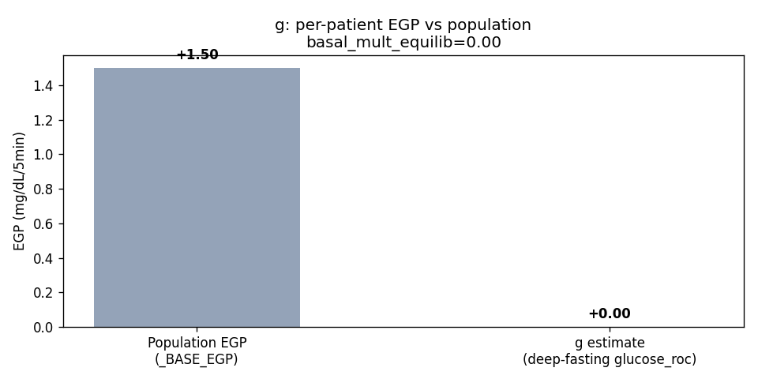

# Clinical Analysis Report — patient `g`

_Generated: 2026-04-27T06:14:19.915663+00:00_  
_Source parquet: `/home/bewest/src/rag-nightscout-ecosystem-alignment/externals/ns-parquet/training`_  
_Profile timezone: `Etc/GMT+7`_  
_Days of data: 180.0_

## 1. Glycemic summary

| Metric | Value |
|---|---|
| Mean glucose (mg/dL) | 145.6 |
| GMI / eA1c (%) | 6.79 |
| TIR 70–180 (%) | 75.2 |
| TBR <70 (%) | 3.24 |
| TBR <54 (%) | 0.59 |
| TAR >180 (%) | 21.5 |
| TAR >250 (%) | 6.53 |
| CV (%) | 41.1 |
| n readings | 46,151 |

## 2. Per-patient EGP (read-only)

- Method: EXP-2739 fasting-drift, deep-fasting subset
- Patient glucose_roc (low-IOB fasting): **0.000** mg/dL/5min  (population _BASE_EGP=1.50)
- Controller basal multiplier in equilibrium: **0.00**
- Sample size: 4,985 deep-fasting rows, 58 equilibrium rows

## 3. Meal-isolation smell test

_Source: inferred meals from the production residual+insulin spectral detector (logged-carb input is treated as an unreliable prior). Logged column is shown for comparison only._

| Floor | Inferred events/day | Logged events/day | Target band | In band? |
|---|---|---|---|---|
| ≥5g | 0.18 | 5.61 | 2.0–10.0 | ❌ |
| ≥10g | 0.18 | 4.67 | 2.0–10.0 | ❌ |
| ≥20g | 0.18 | 2.94 | 2.0–8.0 | ❌ |
| ≥30g | 0.18 | 1.62 | 2.0–6.0 | ❌ |
| ≥50g | 0.12 | 0.34 | 1.0–3.0 | ❌ |

## 4. Meal-logging QC

- Flag: **phantom_logger**
- Logged: 841 (4.67/day)
- Inferred (rises): 32 (0.18/day)
- Logged / inferred ratio: 26.28  _(reconciliation rate; distinct from the `unannounced_meal_warning` fraction in §5, which is unannounced ÷ total detected meals)_

## 4a. Wave-13 facts (read-only)

**Controller dynamics (EXP-2753)**

| Field | Value |
|---|---|
| controller_type | loop |
| n_events | 150 |
| mean_correction_fraction | 0.152 |
| mean_smb_fraction | 0.848 |
| corr_denom_gap_closure | -6.16 |
| isf_profile_median | 70 |
| isf_corr_denom_median | 212 |

**Basal mismatch (EXP-2869)**

| Field | Value |
|---|---|
| p_basal_mismatch | 1.00 |
| median_recommended_mult | 0.00 |

**ISF gap (EXP-2861)**

| Field | Value |
|---|---|
| p_isf_under_correction | 0.00 |
| p_isf_over_correction | 1.00 |

**Recovery dynamics (EXP-2862)**

| Field | Value |
|---|---|
| p_low_recovery | 0.972 |

**Phenotype**

| Field | Value |
|---|---|
| stack_score | 4.150 |
| brake_ratio | 0.723 |
| counter_reg_intercept | None |
| beta_nadir | None |
| p_haaf | None |
| evening_bolus_excess_4h | None |
| evening_iob_at_descent | None |
| controller_lineage | loop |

## 5. Recommendations

### Rec 1: hypo_alert (priority 1), predicted TIR Δ +2.0 pp
- Hypoglycemia risk: 55% probability within 120 minutes (est. 25 min). Consider reducing insulin or taking carbs. Chronic-low pattern detected — consider reducing basal rate or raising target.

### Rec 2: adjust_cr (priority 2), predicted TIR Δ -8.0 pp
- Decrease morning CR from 8.5 to 6.7 g/U (21% more insulin). Mean post-meal excursion is 83 mg/dL.
- Settings change: **cr** decrease 8.5 → 6.7 (+18 %)
- Rationale: Decrease morning CR from 8.5 to 6.7 g/U (21% more insulin). Mean post-meal excursion is 83 mg/dL.

### Rec 3: adjust_isf (priority 2), predicted TIR Δ +7.9 pp
- Increase ISF from 65 to 98 mg/dL/U during daytime (07:00-22:00). NOTE: per-step change capped at +50%; re-evaluate after observing under new setting.
- Settings change: **isf** increase 65.0 → 98.0 (+25 %)
- Rationale: Increase ISF from 65 to 98 mg/dL/U during daytime (07:00-22:00). NOTE: per-step change capped at +50%; re-evaluate after observing under new setting.

### Rec 4: adjust_basal_rate (priority 2), predicted TIR Δ +2.1 pp
- Decrease overnight basal by 40% (from 0.60 to 0.36 U/hr). In closed-loop, combining glucose direction with loop compensation direction provides more reliable basal assessment than glucose alone.
- Settings change: **basal_rate** decrease 0.6000000238418579 → 0.36 (+25 %)
- Rationale: Decrease overnight basal by 40% (from 0.60 to 0.36 U/hr). In closed-loop, combining glucose direction with loop compensation direction provides more reliable basal assessment than glucose alone.

### Rec 5: adjust_correction_threshold (priority 2), predicted TIR Δ +0.5 pp
- Decrease correction threshold from 180 to 130 mg/dL. Corrections below 130 mg/dL show net-negative outcomes: glucose rebounds and hypo risk exceed the glucose-lowering benefit. Per-patient thresholds range 130-290 mg/dL. Predicted TIR improvement: +0.5pp.
- Settings change: **correction_threshold** decrease 180.0 → 130.0 (+25 %)
- Rationale: Decrease correction threshold from 180 to 130 mg/dL. Corrections below 130 mg/dL show net-negative outcomes: glucose rebounds and hypo risk exceed the glucose-lowering benefit. Per-patient thresholds range 130-290 mg/dL. Predicted TIR improvement: +0.5pp.

### Rec 6: clinical_insight (priority 3), predicted TIR Δ +1.0 pp
- Effective ISF is 2.6× profile ISF. AID system may be compensating for settings mismatch. Consider ISF adjustment with care team.

### Rec 7: loop_override_recommendation (priority 3), predicted TIR Δ +1.5 pp
- Consider configuring a controller override named "Dinner Aggressive" active 18:00–06:00 with target 100 mg/dL and ISF ratio 0.85 (65 → 55). Late-night peak (266 mg/dL) sits 127 mg/dL above the dinner baseline (139 mg/dL), indicating sustained post-dinner overshoot — current evening settings under-cover the late absorption phase.

### Rec 8: design_migration_hypothetical (priority 3), predicted TIR Δ +8.3 pp
- Cross-design hypothetical (EXP-2916–2944): a patient with your current profile (TIR 75%, TBR 3.2%, TAR 21%) on Loop migrating to Trio or AAPS (oref1) would expect roughly +8.3 pp TIR (+0.0 pp TBR, -16.3 pp TAR) based on cohort means. This is a directional estimate from cross-design pooling, not a per-patient simulation. Settings tuning on the current controller may capture much of the same benefit (see other recommendations in this report).

## 6. Plots

- 
- 
- 
- 
- 
- 
