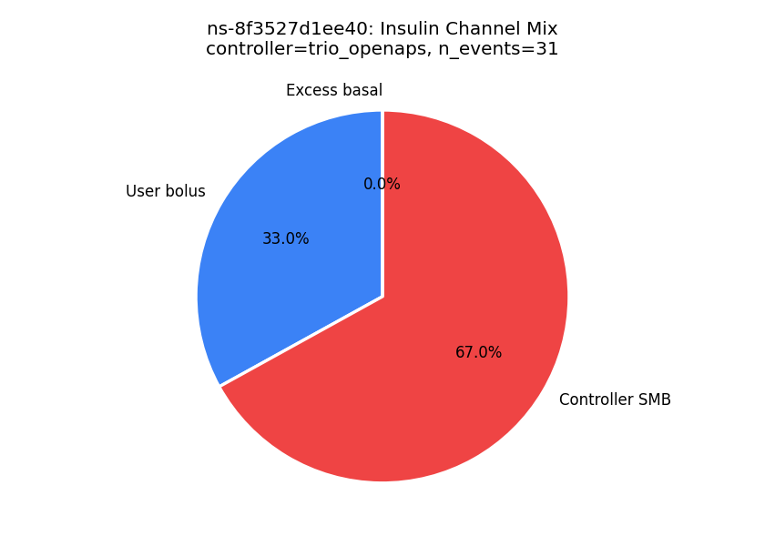
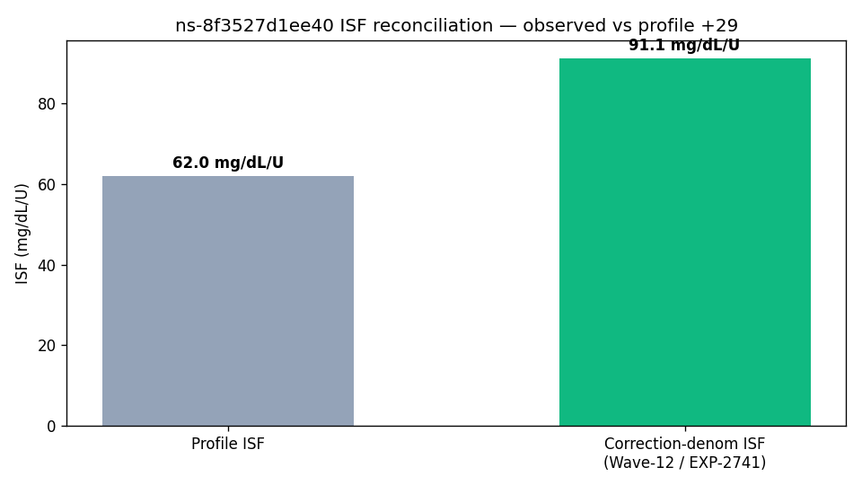
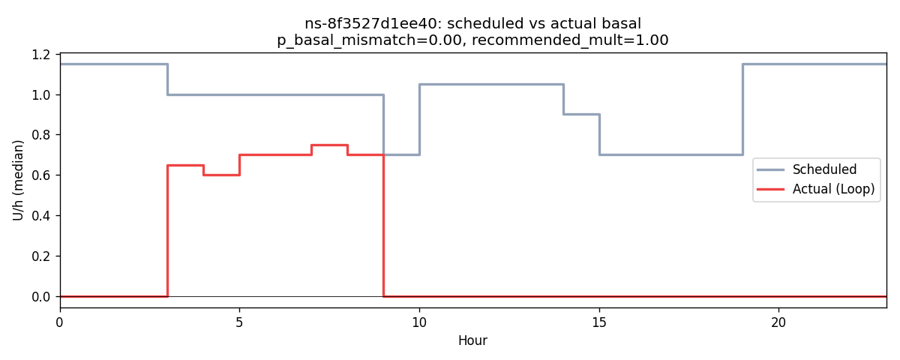
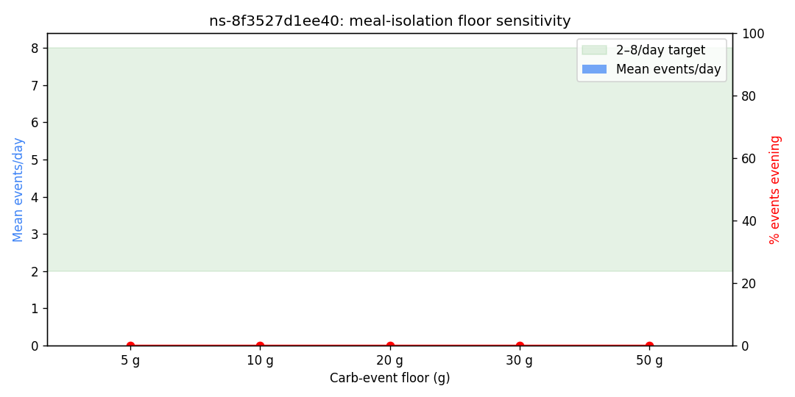
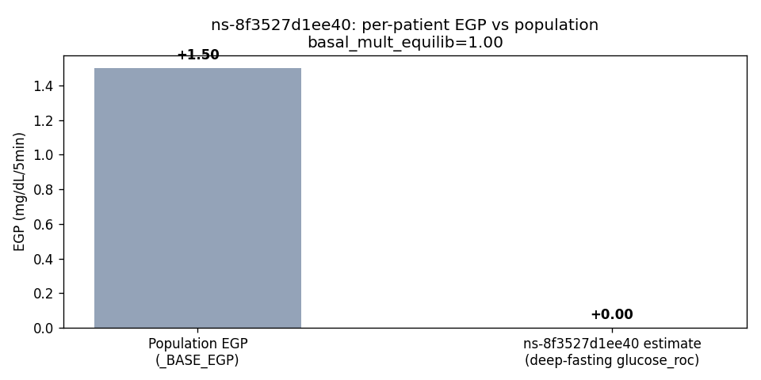

# Clinical Analysis Report — patient `ns-8f3527d1ee40`

_Generated: 2026-04-27T06:16:23.493519+00:00_  
_Source parquet: `/home/bewest/src/rag-nightscout-ecosystem-alignment/externals/ns-parquet/training`_  
_Profile timezone: `Europe/Stockholm`_  
_Days of data: 144.2_

## 1. Glycemic summary

| Metric | Value |
|---|---|
| Mean glucose (mg/dL) | 112.2 |
| GMI / eA1c (%) | 5.99 |
| TIR 70–180 (%) | 92.8 |
| TBR <70 (%) | 3.28 |
| TBR <54 (%) | 0.25 |
| TAR >180 (%) | 3.9 |
| TAR >250 (%) | 0.27 |
| CV (%) | 28.0 |
| n readings | 41,510 |

## 2. Per-patient EGP (read-only)

- Method: EXP-2739 fasting-drift, deep-fasting subset
- Patient glucose_roc (low-IOB fasting): **0.000** mg/dL/5min  (population _BASE_EGP=1.50)
- Controller basal multiplier in equilibrium: **1.00**
- Sample size: 1,587 deep-fasting rows, 298 equilibrium rows

## 3. Meal-isolation smell test

_Source: inferred meals from the production residual+insulin spectral detector (logged-carb input is treated as an unreliable prior). Logged column is shown for comparison only._

| Floor | Inferred events/day | Logged events/day | Target band | In band? |
|---|---|---|---|---|
| ≥5g | 0.00 | 4.59 | 2.0–10.0 | ❌ |
| ≥10g | 0.00 | 4.57 | 2.0–10.0 | ❌ |
| ≥20g | 0.00 | 4.00 | 2.0–8.0 | ❌ |
| ≥30g | 0.00 | 3.09 | 2.0–6.0 | ❌ |
| ≥50g | 0.00 | 1.73 | 1.0–3.0 | ❌ |

## 4. Meal-logging QC

- Flag: **insufficient_data**
- Logged: 659 (4.57/day)
- Inferred (rises): 0 (0.00/day)

## 4a. Wave-13 facts (read-only)

**Controller dynamics (EXP-2753)**

| Field | Value |
|---|---|
| controller_type | trio_openaps |
| n_events | 31 |
| mean_correction_fraction | 0.330 |
| mean_smb_fraction | 0.670 |
| corr_denom_gap_closure | -1.51 |
| isf_profile_median | 62 |
| isf_corr_denom_median | 91 |

**Basal mismatch (EXP-2869)**

| Field | Value |
|---|---|
| p_basal_mismatch | 0.00 |
| median_recommended_mult | 1.00 |

**ISF gap (EXP-2861)**

| Field | Value |
|---|---|
| p_isf_under_correction | 0.00 |
| p_isf_over_correction | 0.32 |

**Phenotype**

| Field | Value |
|---|---|
| stack_score | 5.400 |
| brake_ratio | 0.692 |
| counter_reg_intercept | None |
| beta_nadir | None |
| p_haaf | None |
| evening_bolus_excess_4h | None |
| evening_iob_at_descent | None |
| controller_lineage | trio_openaps |

## 5. Recommendations

### Rec 1: adjust_cr (priority 2), predicted TIR Δ +4.6 pp
- Decrease morning CR from 8.0 to 7.9 g/U (1% more insulin). Mean post-meal excursion is 42 mg/dL.
- Settings change: **cr** decrease 8.0 → 7.9 (+25 %)
- Rationale: Decrease morning CR from 8.0 to 7.9 g/U (1% more insulin). Mean post-meal excursion is 42 mg/dL.

### Rec 2: adjust_isf (priority 2), predicted TIR Δ +2.1 pp
- Increase ISF from 62 to 93 mg/dL/U during daytime (07:00-22:00). NOTE: per-step change capped at +50%; re-evaluate after observing under new setting.
- Settings change: **isf** increase 62.0 → 93.0 (+25 %)
- Rationale: Increase ISF from 62 to 93 mg/dL/U during daytime (07:00-22:00). NOTE: per-step change capped at +50%; re-evaluate after observing under new setting.

### Rec 3: adjust_basal_rate (priority 2), predicted TIR Δ +1.2 pp
- Decrease overnight basal by 20% (from 1.05 to 0.84 U/hr). In closed-loop, combining glucose direction with loop compensation direction provides more reliable basal assessment than glucose alone.
- Settings change: **basal_rate** decrease 1.0499999523162842 → 0.84 (+20 %)
- Rationale: Decrease overnight basal by 20% (from 1.05 to 0.84 U/hr). In closed-loop, combining glucose direction with loop compensation direction provides more reliable basal assessment than glucose alone.

### Rec 4: adjust_correction_threshold (priority 2), predicted TIR Δ +0.8 pp
- Increase correction threshold from 180 to 260 mg/dL. Corrections below 260 mg/dL show net-negative outcomes: glucose rebounds and hypo risk exceed the glucose-lowering benefit. Per-patient thresholds range 130-290 mg/dL. Predicted TIR improvement: +0.8pp.
- Settings change: **correction_threshold** increase 180.0 → 260.0 (+25 %)
- Rationale: Increase correction threshold from 180 to 260 mg/dL. Corrections below 260 mg/dL show net-negative outcomes: glucose rebounds and hypo risk exceed the glucose-lowering benefit. Per-patient thresholds range 130-290 mg/dL. Predicted TIR improvement: +0.8pp.

### Rec 5: loop_override_recommendation (priority 3), predicted TIR Δ +1.5 pp
- Consider configuring a controller override named "Dinner Aggressive" active 18:00–06:00 with target 100 mg/dL and ISF ratio 0.85 (62 → 53). Late-night peak (175 mg/dL) sits 61 mg/dL above the dinner baseline (114 mg/dL), indicating sustained post-dinner overshoot — current evening settings under-cover the late absorption phase.

## 6. Plots

- 
- 
- 
- 
- 
- 
