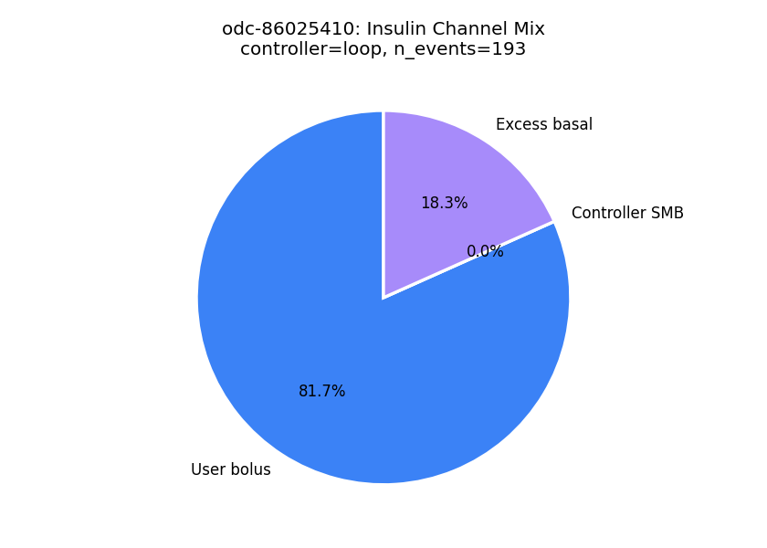
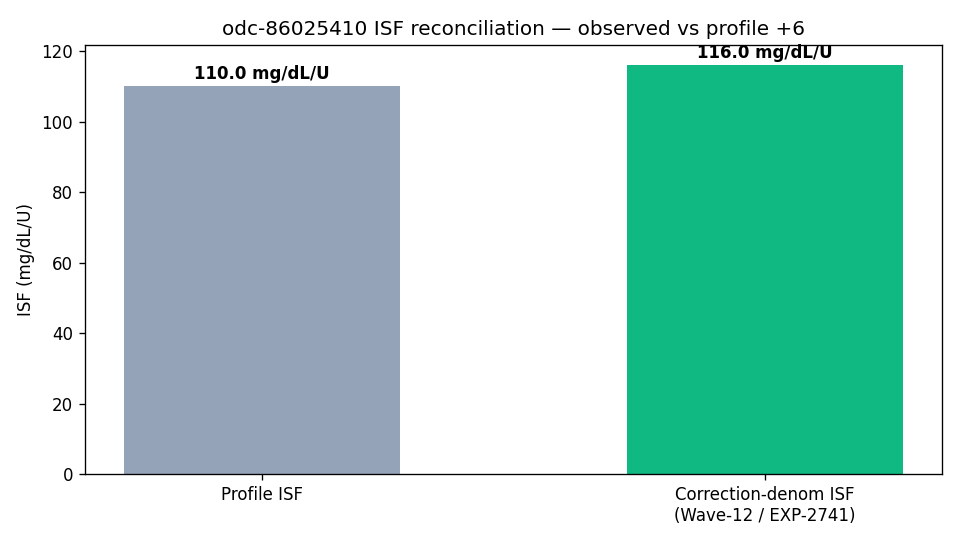
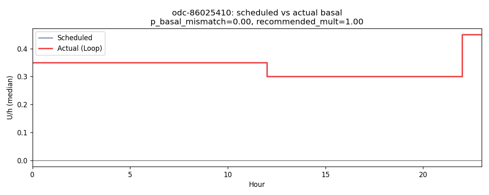
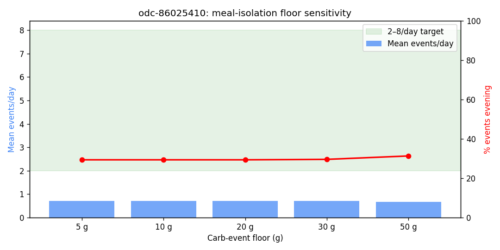
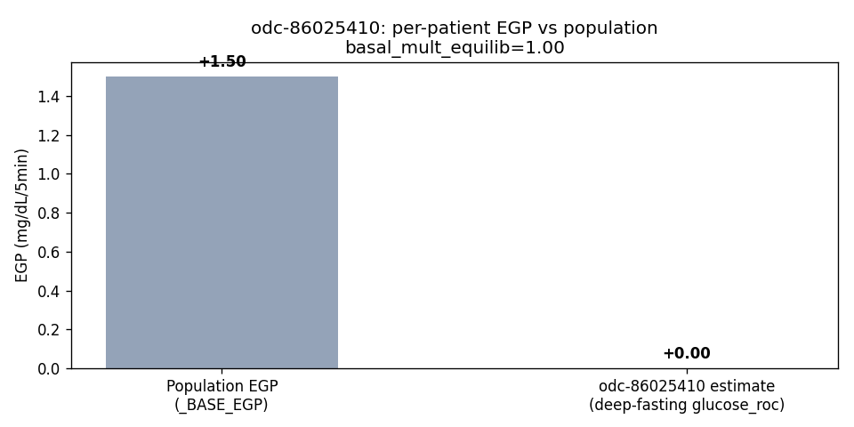

# Clinical Analysis Report — patient `odc-86025410`

_Generated: 2026-04-27T05:58:38.998599+00:00_  
_Source parquet: `/home/bewest/src/rag-nightscout-ecosystem-alignment/externals/ns-parquet/training`_  
_Profile timezone: `US/Eastern`_  
_Days of data: 375.0_

## 1. Glycemic summary

| Metric | Value |
|---|---|
| Mean glucose (mg/dL) | 146.6 |
| GMI / eA1c (%) | 6.82 |
| TIR 70–180 (%) | 68.4 |
| TBR <70 (%) | 5.98 |
| TBR <54 (%) | 3.94 |
| TAR >180 (%) | 25.7 |
| TAR >250 (%) | 7.55 |
| CV (%) | 45.0 |
| n readings | 106,066 |

## 2. Per-patient EGP (read-only)

- Method: EXP-2739 fasting-drift, deep-fasting subset
- Patient glucose_roc (low-IOB fasting): **0.000** mg/dL/5min  (population _BASE_EGP=1.50)
- Controller basal multiplier in equilibrium: **1.00**
- Sample size: 27,478 deep-fasting rows, 4,432 equilibrium rows

## 3. Meal-isolation smell test

_Source: inferred meals from the production residual+insulin spectral detector (logged-carb input is treated as an unreliable prior). Logged column is shown for comparison only._

| Floor | Inferred events/day | Logged events/day | Target band | In band? |
|---|---|---|---|---|
| ≥5g | 0.72 | 5.47 | 2.0–10.0 | ❌ |
| ≥10g | 0.72 | 4.91 | 2.0–10.0 | ❌ |
| ≥20g | 0.72 | 3.08 | 2.0–8.0 | ❌ |
| ≥30g | 0.71 | 1.67 | 2.0–6.0 | ❌ |
| ≥50g | 0.66 | 0.33 | 1.0–3.0 | ❌ |

## 4. Meal-logging QC

- Flag: **phantom_logger**
- Logged: 1840 (4.91/day)
- Inferred (rises): 269 (0.72/day)
- Logged / inferred ratio: 6.84  _(reconciliation rate; distinct from the `unannounced_meal_warning` fraction in §5, which is unannounced ÷ total detected meals)_

## 4a. Wave-13 facts (read-only)

**Controller dynamics (EXP-2753)**

| Field | Value |
|---|---|
| controller_type | loop |
| n_events | 193 |
| mean_correction_fraction | 0.817 |
| mean_smb_fraction | 0.000 |
| corr_denom_gap_closure | 0.60 |
| isf_profile_median | 110 |
| isf_corr_denom_median | 116 |

**Basal mismatch (EXP-2869)**

| Field | Value |
|---|---|
| p_basal_mismatch | 0.00 |
| median_recommended_mult | 1.00 |

**ISF gap (EXP-2861)**

| Field | Value |
|---|---|
| p_isf_under_correction | 0.02 |
| p_isf_over_correction | 0.00 |

**Recovery dynamics (EXP-2862)**

| Field | Value |
|---|---|
| p_low_recovery | 0.976 |

**Phenotype**

| Field | Value |
|---|---|
| stack_score | 1.000 |
| brake_ratio | 0.171 |
| counter_reg_intercept | None |
| beta_nadir | None |
| p_haaf | None |
| evening_bolus_excess_4h | None |
| evening_iob_at_descent | None |
| controller_lineage | loop |

## 5. Recommendations

### Rec 1: adjust_isf (priority 2), predicted TIR Δ +2.4 pp
- Increase ISF from 110 to 456 mg/dL/U during daytime (07:00-22:00).
- Settings change: **isf** increase 110.0 → 456.0 (+25 %)
- Rationale: Increase ISF from 110 to 456 mg/dL/U during daytime (07:00-22:00).

### Rec 2: adjust_cr (priority 2), predicted TIR Δ -1.3 pp
- Decrease morning CR from 33.0 to 26.9 g/U (19% more insulin). Mean post-meal excursion is 77 mg/dL.
- Settings change: **cr** decrease 33.0 → 26.9 (+25 %)
- Rationale: Decrease morning CR from 33.0 to 26.9 g/U (19% more insulin). Mean post-meal excursion is 77 mg/dL.

### Rec 3: adjust_correction_threshold (priority 2), predicted TIR Δ +0.5 pp
- Decrease correction threshold from 180 to 130 mg/dL. Corrections below 130 mg/dL show net-negative outcomes: glucose rebounds and hypo risk exceed the glucose-lowering benefit. Per-patient thresholds range 130-290 mg/dL. Predicted TIR improvement: +0.5pp.
- Settings change: **correction_threshold** decrease 180.0 → 130.0 (+25 %)
- Rationale: Decrease correction threshold from 180 to 130 mg/dL. Corrections below 130 mg/dL show net-negative outcomes: glucose rebounds and hypo risk exceed the glucose-lowering benefit. Per-patient thresholds range 130-290 mg/dL. Predicted TIR improvement: +0.5pp.

### Rec 4: adjust_basal_rate (priority 2), predicted TIR Δ -0.2 pp
- Decrease overnight basal by 11% (from 0.35 to 0.31 U/hr) between 00:00-06:00. Glucose drifts -4.3 mg/dL/hr overnight.
- Settings change: **basal_rate** decrease 0.3499999940395355 → 0.31 (+11 %)
- Rationale: Decrease overnight basal by 11% (from 0.35 to 0.31 U/hr) between 00:00-06:00. Glucose drifts -4.3 mg/dL/hr overnight.

### Rec 5: unannounced_meal_warning (priority 3), predicted TIR Δ +2.0 pp
- 71% of detected meals have no carb entry. Logging meals improves prediction accuracy and enables better pre-bolus timing.

### Rec 6: clinical_insight (priority 3), predicted TIR Δ +1.0 pp
- Time below range is 5.9% (target <4%). Review insulin delivery around low glucose periods.

### Rec 7: loop_override_recommendation (priority 3), predicted TIR Δ +1.5 pp
- Consider configuring a controller override named "Dinner Aggressive" active 18:00–06:00 with target 100 mg/dL and ISF ratio 0.85 (110 → 94). Late-night peak (241 mg/dL) sits 92 mg/dL above the dinner baseline (149 mg/dL), indicating sustained post-dinner overshoot — current evening settings under-cover the late absorption phase.

## 6. Plots

- 
- 
- 
- 
- 
- 
