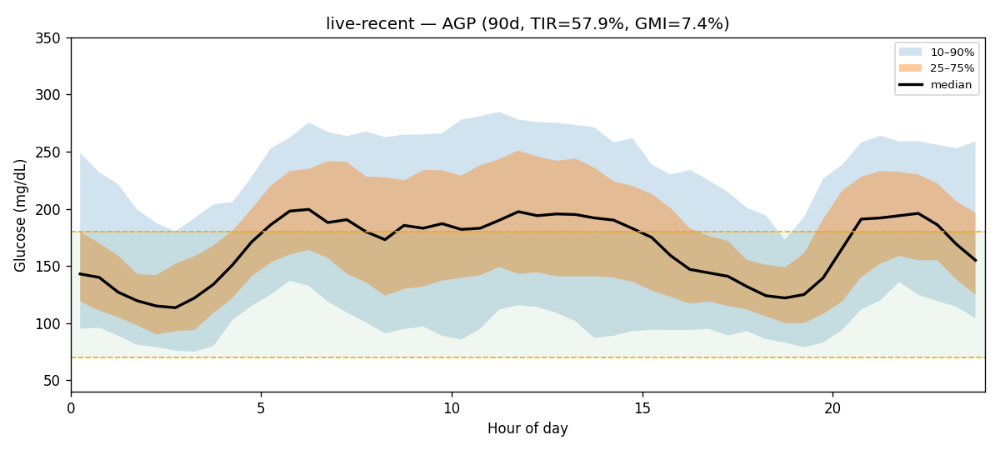
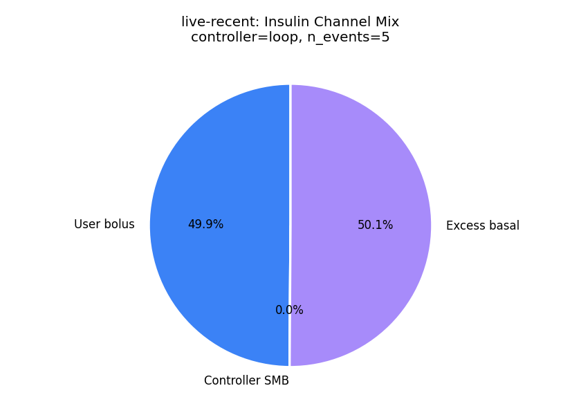
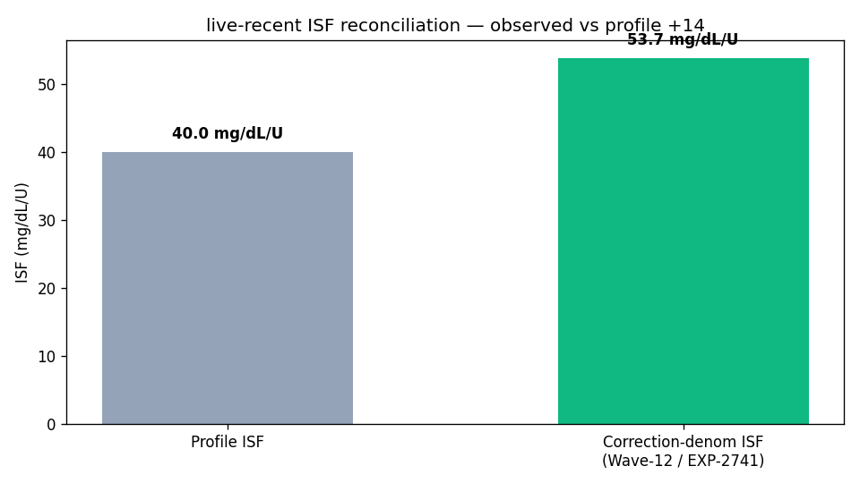
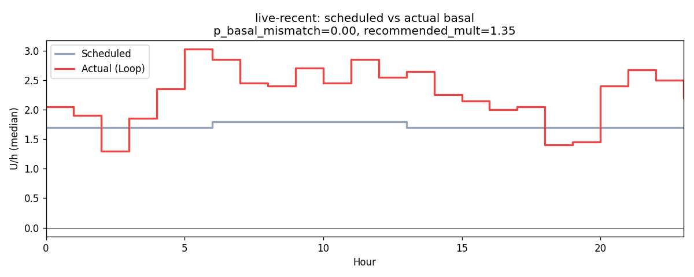
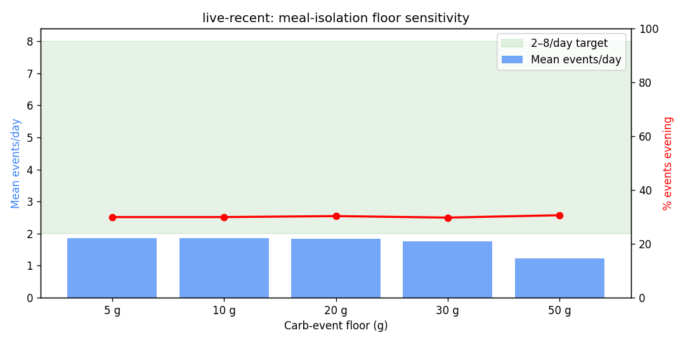
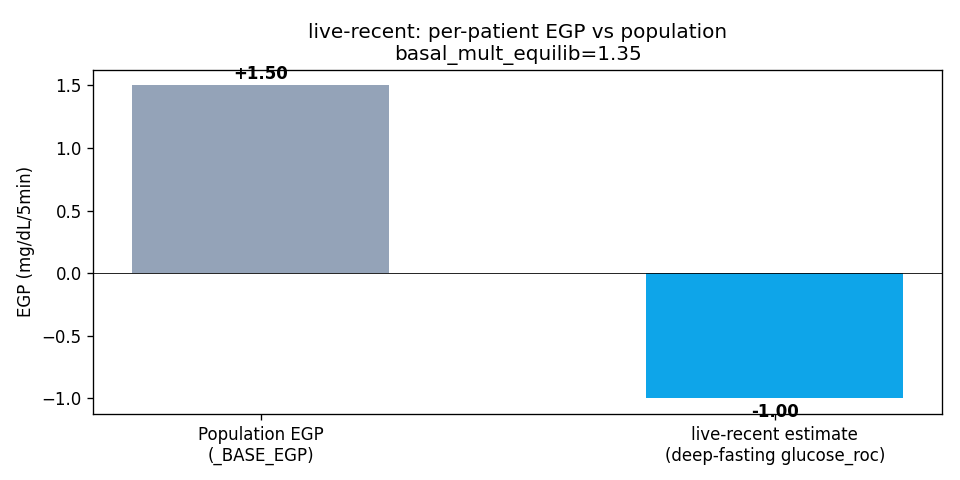

# Clinical Analysis Report — patient `live-recent`

_Generated: 2026-06-27T23:34:09.877693+00:00_  
_Source parquet: `/home/bewest/src/rag-nightscout-ecosystem-alignment/externals/ns-parquet/live-recent`_  
_Profile timezone: `Etc/GMT+7`_  
_Days of data: 90.0_

## 1. Glycemic summary

| Metric | Value |
|---|---|
| Mean glucose (mg/dL) | 169.9 |
| GMI / eA1c (%) | 7.37 |
| TIR 70–180 (%) | 57.9 |
| TBR <70 (%) | 1.99 |
| TBR <54 (%) | 0.39 |
| TAR >180 (%) | 40.1 |
| TAR >250 (%) | 10.61 |
| CV (%) | 36.7 |
| n readings | 23,948 |

## 2. Per-patient EGP (read-only)

- Method: EXP-2739 fasting-drift, deep-fasting subset
- Patient glucose_roc (low-IOB fasting): **-1.000** mg/dL/5min  (population _BASE_EGP=1.50)
- Controller basal multiplier in equilibrium: **1.35**
- Sample size: 7,109 deep-fasting rows, 1,995 equilibrium rows

## 3. Meal-isolation smell test

_Source: inferred meals from the production residual+insulin spectral detector (logged-carb input is treated as an unreliable prior). Logged column is shown for comparison only._

| Floor | Inferred events/day | Logged events/day | Target band | In band? |
|---|---|---|---|---|
| ≥5g | 1.86 | 0.13 | 2.0–10.0 | ❌ |
| ≥10g | 1.86 | 0.12 | 2.0–10.0 | ❌ |
| ≥20g | 1.83 | 0.11 | 2.0–8.0 | ❌ |
| ≥30g | 1.76 | 0.09 | 2.0–6.0 | ❌ |
| ≥50g | 1.23 | 0.01 | 1.0–3.0 | ✅ |

## 4. Meal-logging QC

- Flag: **under_logger**
- Logged: 11 (0.12/day)
- Inferred (rises): 167 (1.86/day)
- Logged / inferred ratio: 0.07  _(reconciliation rate; distinct from the `unannounced_meal_warning` fraction in §5, which is unannounced ÷ total detected meals)_

## 4a. Wave-13 facts (read-only)

**Controller dynamics (EXP-2753)**

| Field | Value |
|---|---|
| controller_type | loop |
| n_events | 5 |
| mean_correction_fraction | 0.499 |
| mean_smb_fraction | 0.000 |
| corr_denom_gap_closure | 0.41 |
| isf_profile_median | 40 |
| isf_corr_denom_median | 54 |

**Basal mismatch (EXP-2869)**

| Field | Value |
|---|---|
| p_basal_mismatch | 0.00 |
| median_recommended_mult | 1.35 |

**Phenotype**

| Field | Value |
|---|---|
| stack_score | 3.000 |
| brake_ratio | 0.224 |
| counter_reg_intercept | None |
| beta_nadir | None |
| p_haaf | None |
| evening_bolus_excess_4h | None |
| evening_iob_at_descent | None |
| controller_lineage | loop |

## 5. Recommendations

### Rec 1: adjust_basal_rate (priority 2), predicted TIR Δ +2.8 pp
- Increase overnight basal by 48% (from 1.70 to 2.52 U/hr). In closed-loop, combining glucose direction with loop compensation direction provides more reliable basal assessment than glucose alone.
- Settings change: **basal_rate** increase 1.7000000476837158 → 2.52 (+25 %)
- Rationale: Increase overnight basal by 48% (from 1.70 to 2.52 U/hr). In closed-loop, combining glucose direction with loop compensation direction provides more reliable basal assessment than glucose alone.

### Rec 2: adjust_isf (priority 2), predicted TIR Δ +2.6 pp
- Correction doses above 1.5U show diminishing returns. At 2.8U, each unit achieves only 16 mg/dL drop vs 40 mg/dL at 1U. Consider: (1) splitting large corrections into smaller doses spaced 30+ min apart, (2) using ISF=16 for doses ≥3U. This is a pharmacokinetic property (β=0.9), not circadian.
- Settings change: **isf** decrease 40.0 → 16.0 (+25 %)
- Rationale: Correction doses above 1.5U show diminishing returns. At 2.8U, each unit achieves only 16 mg/dL drop vs 40 mg/dL at 1U. Consider: (1) splitting large corrections into smaller doses spaced 30+ min apart, (2) using ISF=16 for doses ≥3U. This is a pharmacokinetic property (β=0.9), not circadian.

### Rec 3: adjust_correction_threshold (priority 2), predicted TIR Δ +0.1 pp
- Decrease correction threshold from 180 to 166 mg/dL. Corrections below 166 mg/dL show net-negative outcomes: glucose rebounds and hypo risk exceed the glucose-lowering benefit. Per-patient thresholds range 130-290 mg/dL. Predicted TIR improvement: +0.1pp.
- Settings change: **correction_threshold** decrease 180.0 → 166.0 (+8 %)
- Rationale: Decrease correction threshold from 180 to 166 mg/dL. Corrections below 166 mg/dL show net-negative outcomes: glucose rebounds and hypo risk exceed the glucose-lowering benefit. Per-patient thresholds range 130-290 mg/dL. Predicted TIR improvement: +0.1pp.

### Rec 4: unannounced_meal_warning (priority 3), predicted TIR Δ +2.0 pp
- 98% of detected meals have no carb entry. Logging meals improves prediction accuracy and enables better pre-bolus timing.

### Rec 5: clinical_insight (priority 3), predicted TIR Δ +1.0 pp
- Time above range is 40.1%. Consider reviewing correction factors and carb counting.

### Rec 6: loop_override_recommendation (priority 3), predicted TIR Δ +1.5 pp
- Consider configuring a controller override named "Dinner Aggressive" active 18:00–06:00 with target 100 mg/dL and ISF ratio 0.85 (40 → 34). Late-night peak (292 mg/dL) sits 163 mg/dL above the dinner baseline (129 mg/dL), indicating sustained post-dinner overshoot — current evening settings under-cover the late absorption phase.

### Rec 7: design_migration_hypothetical (priority 3), predicted TIR Δ +14.0 pp
- Cross-design hypothetical (EXP-2916–2944): a patient with your current profile (TIR 58%, TBR 1.9%, TAR 40%) on Loop migrating to Trio or AAPS (oref1) would expect roughly +14.0 pp TIR (+0.0 pp TBR, -16.3 pp TAR) based on cohort means. This is a directional estimate from cross-design pooling, not a per-patient simulation. Settings tuning on the current controller may capture much of the same benefit (see other recommendations in this report).

## 6. Plots

- 
- 
- 
- 
- 
- 
