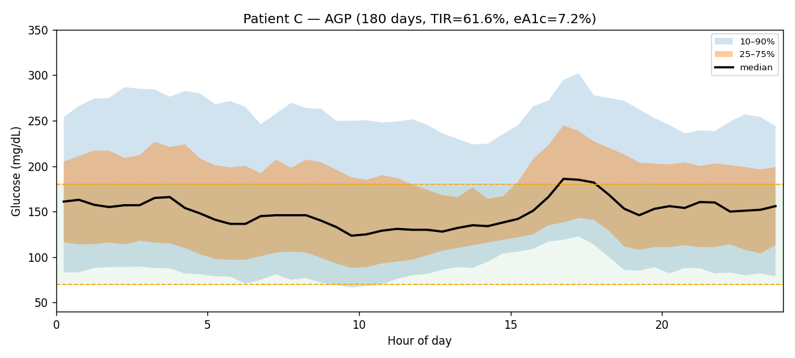
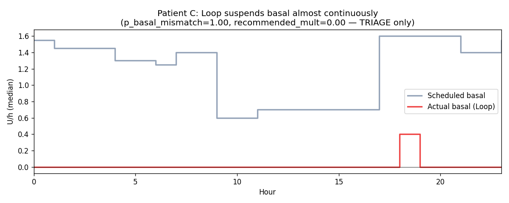
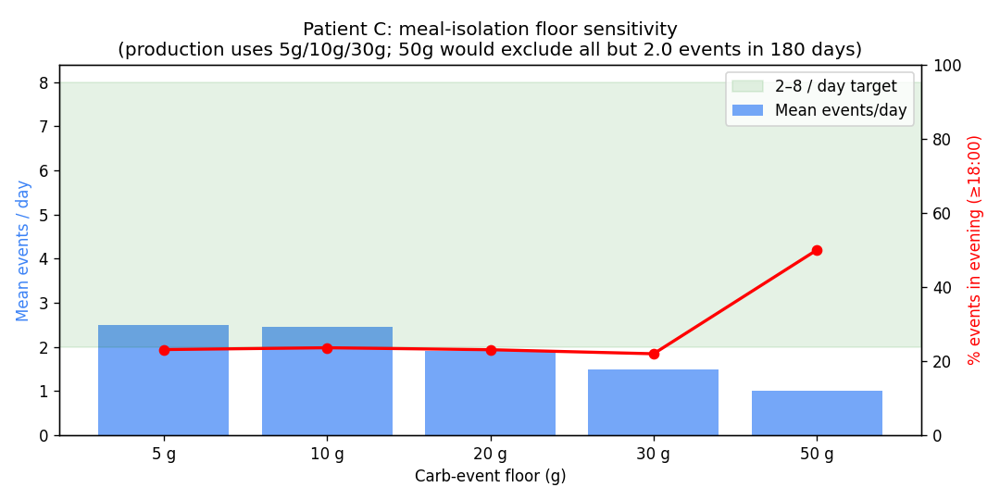

# Clinical Analysis Report — patient `c`

_Generated: 2026-04-24T17:30:25.303663+00:00_  
_Source parquet: `/home/bewest/src/rag-nightscout-ecosystem-alignment/externals/ns-parquet/training`_  
_Profile timezone: `Etc/GMT+7`_  
_Days of data: 180.0_

## 1. Glycemic summary

| Metric | Value |
|---|---|
| Mean glucose (mg/dL) | 162.0 |
| GMI / eA1c (%) | 7.19 |
| TIR 70–180 (%) | 61.6 |
| TBR <70 (%) | 4.70 |
| TBR <54 (%) | 1.56 |
| TAR >180 (%) | 33.7 |
| TAR >250 (%) | 12.07 |
| CV (%) | 43.4 |
| n readings | 42,859 |

## 2. Per-patient EGP (read-only)

- Method: EXP-2739 fasting-drift, deep-fasting subset
- Patient glucose_roc (low-IOB fasting): **1.000** mg/dL/5min  (population _BASE_EGP=1.50)
- Controller basal multiplier in equilibrium: **0.00**
- Sample size: 8,449 deep-fasting rows, 176 equilibrium rows

## 3. Meal-isolation smell test

| Floor | Events/day | In 2–8 target? |
|---|---|---|
| ≥5g | 2.50 | ✅ |
| ≥10g | 2.46 | ✅ |
| ≥20g | 1.92 | ❌ |
| ≥30g | 1.48 | ❌ |
| ≥50g | 1.00 | ❌ |

## 4. Meal-logging QC

- Flag: **phantom_logger**
- Logged: 377 (2.09/day)
- Inferred (rises): 17 (0.09/day)
- Logged / inferred ratio: 22.18  _(reconciliation rate; distinct from the `unannounced_meal_warning` fraction in §5, which is unannounced ÷ total detected meals)_

## 4a. Wave-13 facts (read-only)

**Controller dynamics (EXP-2753)**

| Field | Value |
|---|---|
| controller_type | loop |
| n_events | 368 |
| mean_correction_fraction | 0.154 |
| mean_smb_fraction | 0.846 |
| corr_denom_gap_closure | -0.43 |
| isf_profile_median | 75 |
| isf_corr_denom_median | 126 |

**Basal mismatch (EXP-2869)**

| Field | Value |
|---|---|
| p_basal_mismatch | 1.00 |
| median_recommended_mult | 0.00 |

**ISF gap (EXP-2861)**

| Field | Value |
|---|---|
| p_isf_under_correction | 0.00 |
| p_isf_over_correction | 1.00 |

**Recovery dynamics (EXP-2862)**

| Field | Value |
|---|---|
| p_low_recovery | 1.000 |

**Phenotype**

| Field | Value |
|---|---|
| stack_score | 4.100 |
| brake_ratio | 0.625 |
| counter_reg_intercept | None |
| beta_nadir | None |
| p_haaf | None |
| evening_bolus_excess_4h | None |
| evening_iob_at_descent | None |
| controller_lineage | loop |

## 5. Recommendations

### Rec 1: adjust_isf (priority 2), predicted TIR Δ +18.6 pp
- Increase ISF from 75 to 345 mg/dL/U during overnight (00:00-06:00). ISF varies 4.6-9× by time of day (EXP-2271). Observed 732 corrections in this block with median effective ISF 345 mg/dL/U. Predicted TIR improvement: +3.6pp.
- Settings change: **isf** increase 75.0 → 345.0 (+25 %)
- Rationale: Increase ISF from 75 to 345 mg/dL/U during overnight (00:00-06:00). ISF varies 4.6-9× by time of day (EXP-2271). Observed 732 corrections in this block with median effective ISF 345 mg/dL/U. Predicted TIR improvement: +3.6pp.

### Rec 2: adjust_cr (priority 2), predicted TIR Δ -4.1 pp
- Decrease morning CR from 4.5 to 3.8 g/U (15% more insulin). Mean post-meal excursion is 71 mg/dL.
- Settings change: **cr** decrease 4.5 → 3.8 (+25 %)
- Rationale: Decrease morning CR from 4.5 to 3.8 g/U (15% more insulin). Mean post-meal excursion is 71 mg/dL.

### Rec 3: adjust_basal_rate (priority 2), predicted TIR Δ +2.2 pp
- Decrease overnight basal by 20% (from 1.40 to 1.12 U/hr). In closed-loop, combining glucose direction with loop compensation direction provides more reliable basal assessment than glucose alone.
- Settings change: **basal_rate** decrease 1.399999976158142 → 1.12 (+25 %)
- Rationale: Decrease overnight basal by 20% (from 1.40 to 1.12 U/hr). In closed-loop, combining glucose direction with loop compensation direction provides more reliable basal assessment than glucose alone.

### Rec 4: adjust_correction_threshold (priority 2), predicted TIR Δ +0.7 pp
- Increase correction threshold from 180 to 250 mg/dL. Corrections below 250 mg/dL show net-negative outcomes: glucose rebounds and hypo risk exceed the glucose-lowering benefit. Per-patient thresholds range 130-290 mg/dL. Predicted TIR improvement: +0.7pp.
- Settings change: **correction_threshold** increase 180.0 → 250.0 (+25 %)
- Rationale: Increase correction threshold from 180 to 250 mg/dL. Corrections below 250 mg/dL show net-negative outcomes: glucose rebounds and hypo risk exceed the glucose-lowering benefit. Per-patient thresholds range 130-290 mg/dL. Predicted TIR improvement: +0.7pp.

### Rec 5: clinical_insight (priority 3), predicted TIR Δ +1.0 pp
- Time below range is 4.7% (target <4%). Review insulin delivery around low glucose periods.

## 6. Plots

- 
- 
- 
- 
- 
- 
