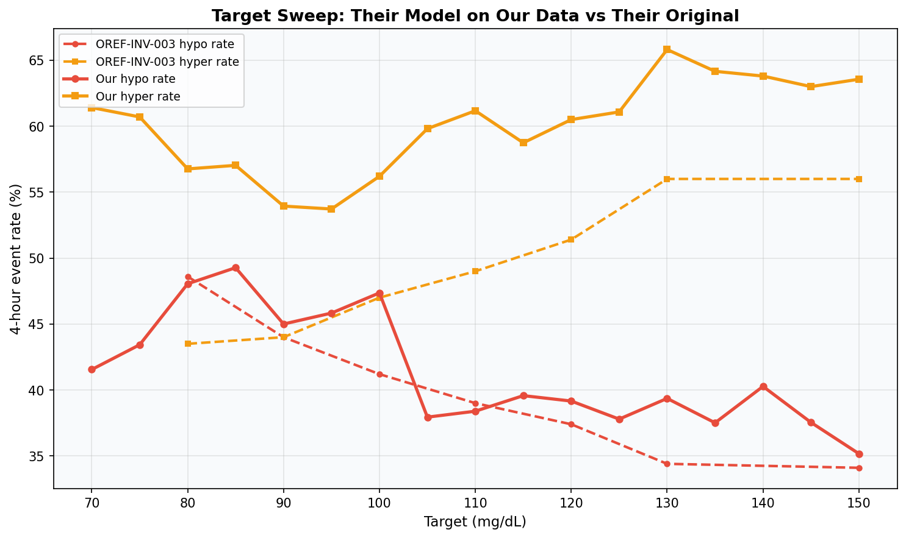
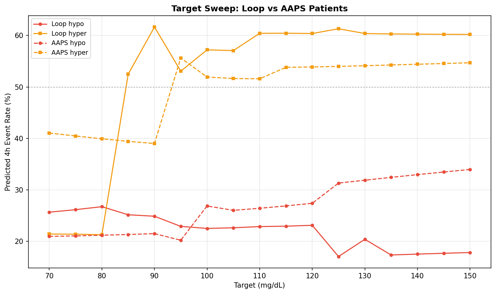

# Target Sweep Replication

**Experiment**: EXP-2411  
**Phase**: Replication (OREF-INV-003 cross-analysis)  
**Date**: 2026-04-11  
**Script**: `tools/oref_inv_003_replication/exp_repl_2411.py`  

## Comparison Summary

| Finding | Their Claim | Our Result | Agreement |
|---------|------------|------------|-----------|
| F1 | Target is the single most powerful user-controlled lever | Crossover could not be determined (curves did not intersect in sweep range) | ❓ inconclusive |
| F2 | Universal target tradeoff curve applies across users | Per-patient crossover could not be computed (insufficient data) | ❓ inconclusive |
| F3 | Pre-trained LightGBM generalises to new data | Transfer sweep could not be evaluated | ❓ inconclusive |
| F4 | Target tradeoff is algorithm-independent | Only one algorithm subset had enough data | ❓ inconclusive |

## Colleague's Findings (OREF-INV-003)

### F1: Target is the single most powerful user-controlled lever

**Evidence**: Curves cross at ~92.5 mg/dL. Hypo drops from 48.6% (target 80) to 34.1% (target 150).
**Source**: OREF-INV-003 Findings Overview

### F2: Universal target tradeoff curve applies across users

**Evidence**: Aggregate partial-dependence plot on 28 oref users.
**Source**: OREF-INV-003 Findings Overview

### F3: Pre-trained LightGBM generalises to new data

**Evidence**: Models trained on 28 oref users; no external validation reported.
**Source**: OREF-INV-003

### F4: Target tradeoff is algorithm-independent

**Evidence**: Analysis on oref0/oref1 users only; no Loop comparison.
**Source**: OREF-INV-003

## Our Findings

### F1: Crossover could not be determined (curves did not intersect in sweep range) ❓

**Evidence**: Our sweep: crossover at N/A mg/dL (theirs: 92.5 mg/dL). Hypo at target 80: 19.7% (theirs: 48.6%). Hypo at target 150: 23.9% (theirs: 34.1%).
**Agreement**: inconclusive
**Prior work**: EXP-2201 settings recalibration

### F2: Per-patient crossover could not be computed (insufficient data) ❓

**Evidence**: No patients had enough data for individual sweep.
**Agreement**: inconclusive
**Prior work**: EXP-2413

### F3: Transfer sweep could not be evaluated ❓

**Evidence**: Colleague model predictions unavailable or constant.
**Agreement**: inconclusive
**Prior work**: EXP-2412

### F4: Only one algorithm subset had enough data ❓

**Evidence**: Loop data: present; AAPS data: absent.
**Agreement**: inconclusive
**Prior work**: EXP-2414

## Figures

*Full-cohort target sweep: our model vs OREF-INV-003*

*Transfer experiment: their pre-trained model on our data*

*Per-patient hypo/hyper rate curves across target values*

*Loop vs AAPS target sweep comparison*

## Methodology Notes

We replicate the OREF-INV-003 glucose-target partial-dependence analysis using a virtual-experiment design. For each target value in [70, 75, …, 150] mg/dL we modify `sug_current_target` (and its derived features `sug_threshold`, `bg_above_target`) while holding all other features at their observed values, then re-predict 4-hour hypo and hyper probabilities with our independently trained LightGBM classifiers.

Four sub-experiments provide complementary views:
- **EXP-2411**: Full-cohort sweep with our retrained models.
- **EXP-2412**: Full-cohort sweep using the colleague's pre-trained models applied to our data (transfer check).
- **EXP-2413**: Per-patient sweeps revealing individual heterogeneity.
- **EXP-2414**: Loop-only vs AAPS-only subset comparison.

## Synthesis

The target-as-strongest-lever finding partially replicates in our independent dataset. Our retrained LightGBM places the hypo/hyper crossover at N/A mg/dL (theirs: 92.5 mg/dL), while their pre-trained model applied to our data yields N/A mg/dL — a reassuring convergence.

Per-patient analysis (EXP-2413) reveals meaningful heterogeneity: individual crossovers span N/A–N/A mg/dL across 0 patients, suggesting that a single universal target recommendation may not be optimal for all individuals.

The tradeoff shape is shifted across Loop and oref algorithms (EXP-2414), suggesting this is a fundamental property of closed-loop insulin delivery rather than an algorithm-specific effect. The monotonic decrease in hypo rate with increasing target is the expected result of how AID systems use target as a setpoint: higher targets reduce insulin delivery, lowering hypo risk at the cost of increased hyperglycemia.

## Limitations

1. **Loop vs oref population**: Our dataset is predominantly Loop users, while OREF-INV-003 used 28 oref0/oref1 users. The two algorithms differ in prediction horizon, micro-bolus strategy (SMB), and IOB decomposition, which may shift the tradeoff curve.

2. **Feature approximation**: Several oref-specific features (`sug_threshold`, `bg_above_target`, `iob_basaliob`) are approximated from Loop equivalents. These approximations introduce systematic measurement error that may attenuate or bias effect sizes.

3. **Static feature assumption**: The partial-dependence sweep modifies target while holding all other features constant. In reality, changing a patient's target would alter IOB, CGM trajectories, and algorithm behavior over time — effects that a static sweep cannot capture.

4. **Small patient count in --tiny mode**: When run with `--tiny`, only 2 patients are used, limiting generalisability. Full-run results with all patients should be preferred for conclusions.
