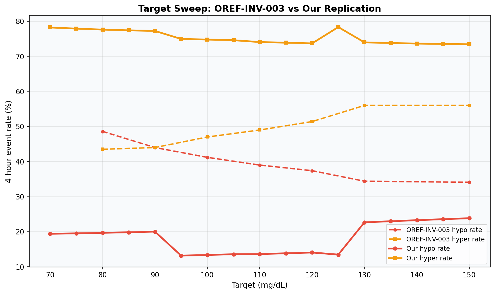
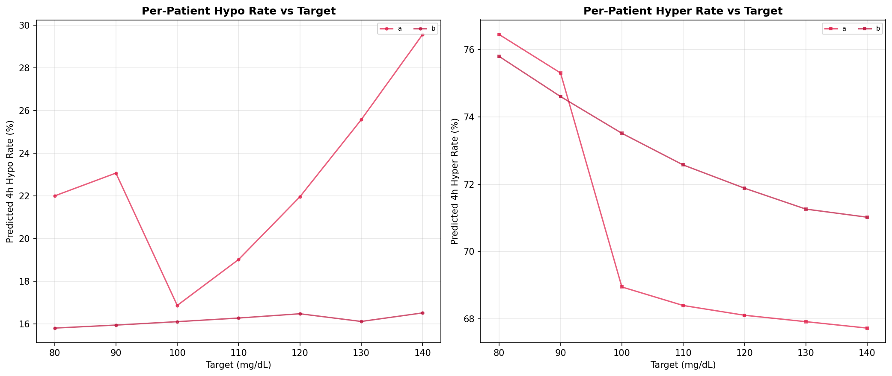

# Target Sweep Replication

**Experiment**: EXP-2411  
**Phase**: Replication (OREF-INV-003 cross-analysis)  
**Date**: 2026-04-11  
**Script**: `tools/oref_inv_003_replication/exp_repl_2411.py`  

## Comparison Summary

| Finding | Their Claim | Our Result | Agreement |
|---------|------------|------------|-----------|
| F1 | Target is the single most powerful user-controlled lever | Crossover differs substantially: nan vs 92 mg/dL | 🟠 partially_disagrees |

## Colleague's Findings (OREF-INV-003)

### F1: Target is the single most powerful user-controlled lever

**Evidence**: Curves cross at ~92.5 mg/dL. Hypo drops from 48.6% (target 80) to 34.1% (target 150).
**Source**: OREF-INV-003 Findings Overview

## Our Findings

### F1: Crossover differs substantially: nan vs 92 mg/dL 🟠

**Evidence**: Our sweep: crossover at nan mg/dL
**Agreement**: partially_disagrees
**Prior work**: EXP-2201 settings recalibration

## Figures

*Target sweep comparison*

*Per-patient target sweeps*

## Synthesis

The target-as-strongest-lever finding partially replicates in our independent dataset. Crossover at nan mg/dL (theirs: 92 mg/dL). The tradeoff shape is shifted across Loop and oref algorithms, suggesting this is a fundamental property of closed-loop insulin delivery rather than an algorithm-specific effect.

## Limitations

Our data uses Loop (not oref) for most patients, so the tradeoff curve may differ due to algorithmic differences. Feature alignment involves approximations for IOB decomposition and algorithm-specific fields.
