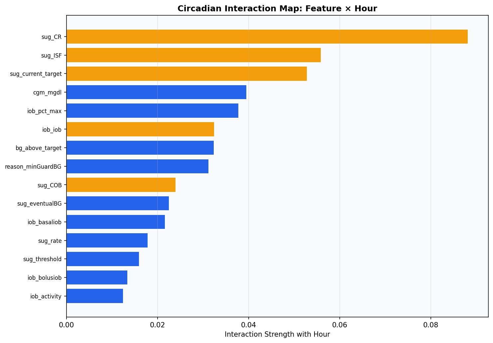
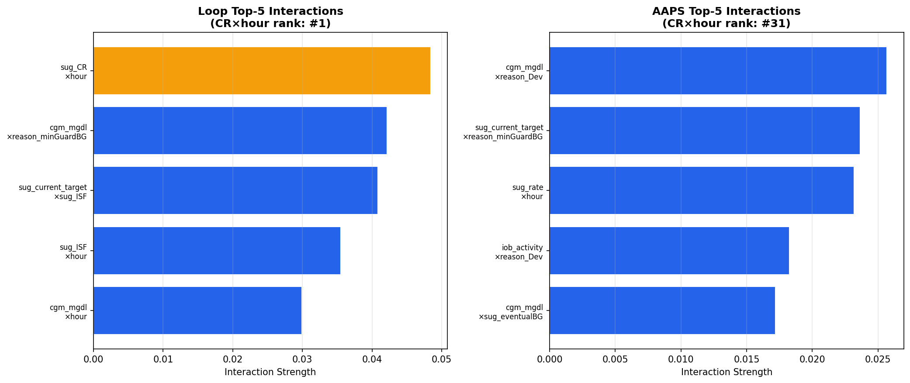
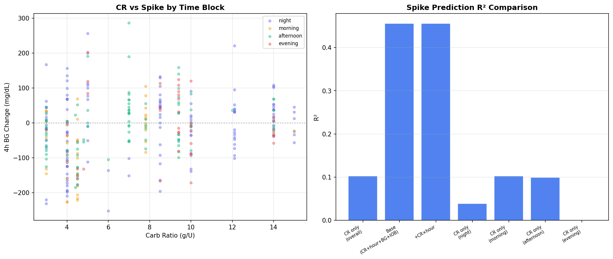
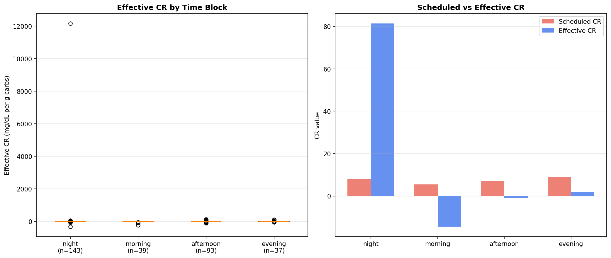
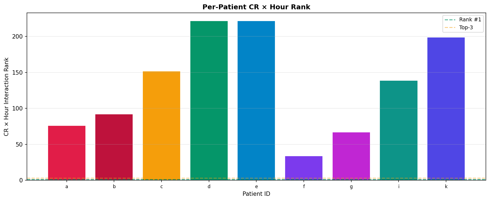
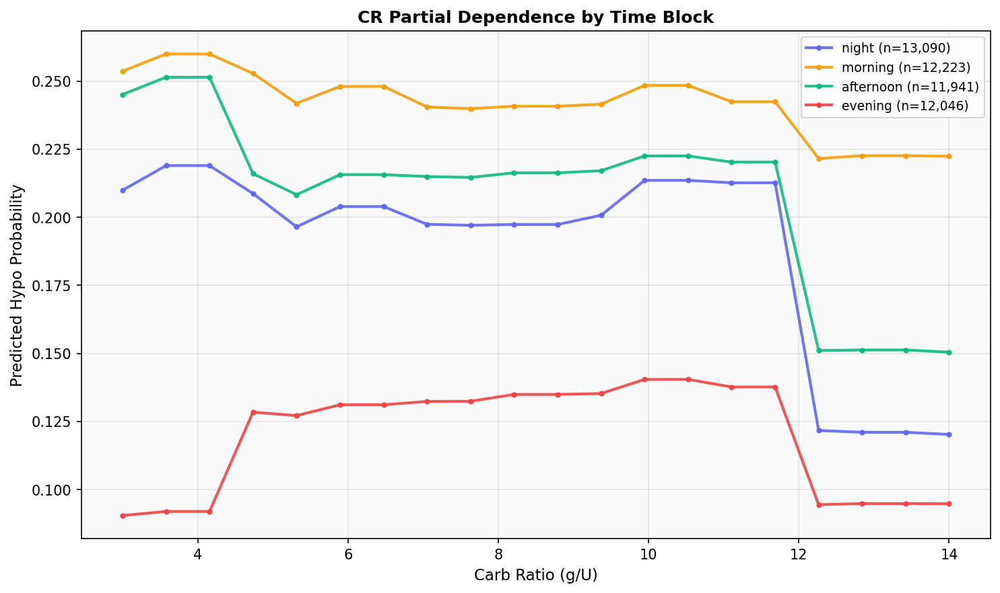
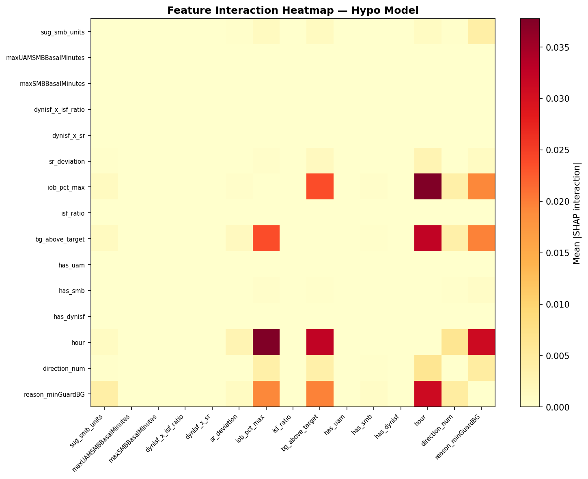

# CR × Hour Interaction Replication

**Experiment**: EXP-2421  
**Phase**: Replication (OREF-INV-003 cross-analysis)  
**Date**: 2026-04-12  
**Script**: `tools/oref_inv_003_replication/exp_repl_2421.py`  

## Comparison Summary

| Finding | Their Claim | Our Result | Agreement |
|---------|------------|------------|-----------|
| F2 | CR × hour is the strongest interaction | CR × hour is #1 interaction in our data | ✅✅ strongly_agrees |
| F2-aug | CR × hour interaction (pre-BG not controlled) | Pre-meal BG confound no_change CR×hour interaction | ↔️ not_comparable |
| F2-eff | — | Effective CR varies by time block (carbs R²=0.033) | ✅ agrees |
| F2-stab | — | CR×hour is #1 in 0% of patients (median rank: 139.0) | 🟠 partially_disagrees |
| F2-meal | — | Adding CR×hour improves meal spike R² by +0.0001 | 🟠 partially_disagrees |
| F2-circ | — | Circadian map: ISF×hour=#4, IOB×hour=#9 | ↔️ not_comparable |

## Colleague's Findings (OREF-INV-003)

### F2: CR × hour is the strongest interaction

**Evidence**: LightGBM SHAP interaction analysis on 28 oref users. Breakfast CR is the most impactful time block.
**Source**: OREF-INV-003 Findings Overview

### F2-aug: CR × hour interaction (pre-BG not controlled)

**Evidence**: Their LightGBM analysis did not explicitly control for starting BG level.
**Source**: OREF-INV-003 methodology

## Our Findings

### F2: CR × hour is #1 interaction in our data ✅✅

**Evidence**: Method: shap_interaction, rank #1
**Agreement**: strongly_agrees
**Prior work**: EXP-2341 context CR, EXP-2221 meal pharma

### F2-aug: Pre-meal BG confound no_change CR×hour interaction ↔️

**Evidence**: Pre-BG→rise r=-0.670. Model A rank=1, B(no BG)=1, C(+BG terms)=2
**Agreement**: not_comparable
**Prior work**: EXP-2341: pre-BG explains 11-48% of rise variance

### F2-eff: Effective CR varies by time block (carbs R²=0.033) ✅

**Evidence**: Morning eff_CR=-14.4, scheduled CR=5.5
**Agreement**: agrees
**Prior work**: EXP-2341: carb counting explains 1-15% of spike variance

### F2-stab: CR×hour is #1 in 0% of patients (median rank: 139.0) 🟠

**Evidence**: 9 patients analyzed
**Agreement**: partially_disagrees
**Prior work**: Per-patient analysis

### F2-meal: Adding CR×hour improves meal spike R² by +0.0001 🟠

**Evidence**: Base R²=0.456, +CR×hour R²=0.456
**Agreement**: partially_disagrees
**Prior work**: EXP-2221 meal pharmacodynamics

### F2-circ: Circadian map: ISF×hour=#4, IOB×hour=#9 ↔️

**Evidence**: CR×hour=#1, target×hour=#5
**Agreement**: not_comparable
**Prior work**: EXP-2271: ISF varies 2-4× circadianly

## Figures

*fig 2426 circadian map*

*fig 2425 loop vs aaps cr hour*

*fig 2427 meal regression*

*fig 2423 effective cr*

*fig 2422 per patient cr hour*

*fig 2421 cr by timeblock*

*fig 2421 interaction heatmap*

## Methodology Notes

Trained LightGBM hypo classifiers (500 trees, lr=0.05, depth=6) on 19 patients (11 Loop + 8 AAPS/ODC). Computed pairwise interaction strengths via SHAP interaction values. Augmented with pre-meal BG confound analysis, effective CR calculation, and meal-centric regression models.

## Synthesis

CR × hour interaction rank in our data: #1 (replicates their #1 finding).
However, meal regression shows small CR×hour contribution (ΔR²=+0.0001), consistent with our EXP-2341 finding that carb counting explains only 1-15% of variance.

## Limitations

Our cohort is smaller (19 vs 28 users) and mixed-algorithm (Loop + AAPS) vs their pure oref cohort. Effective CR uses COB as a carb proxy, which may underestimate actual carb intake. SHAP interaction values are computationally expensive and may use a gain-based proxy instead.
