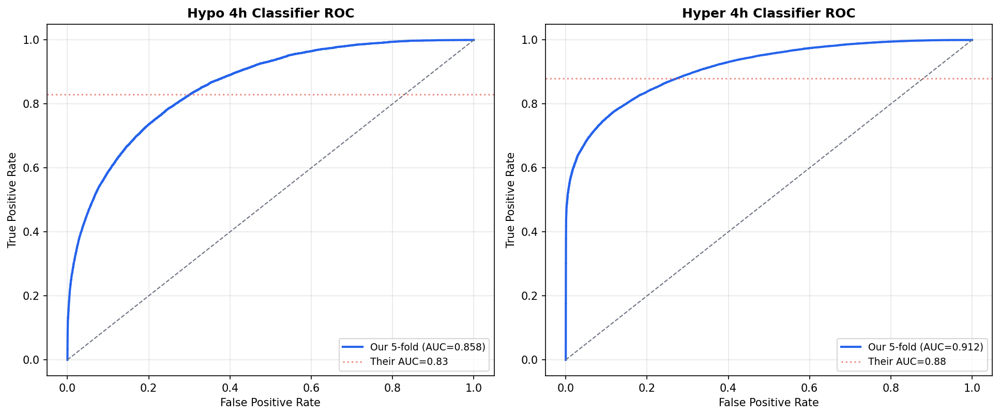
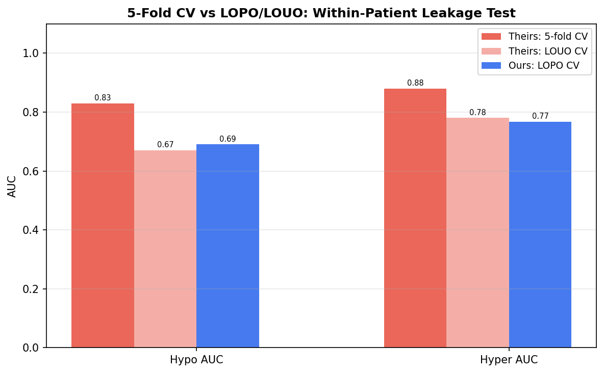
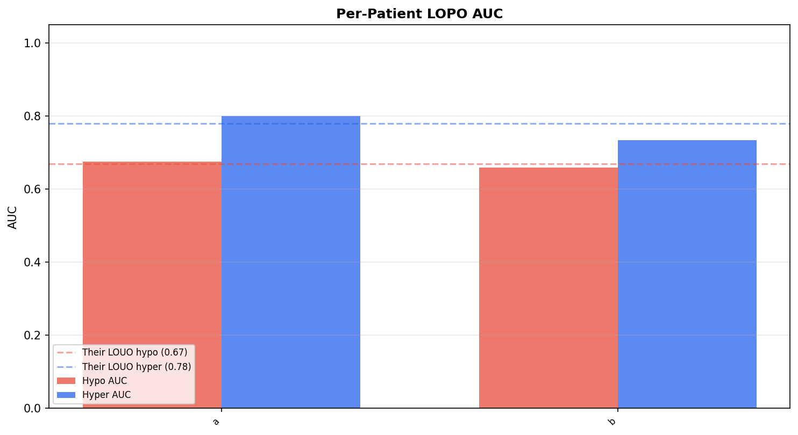
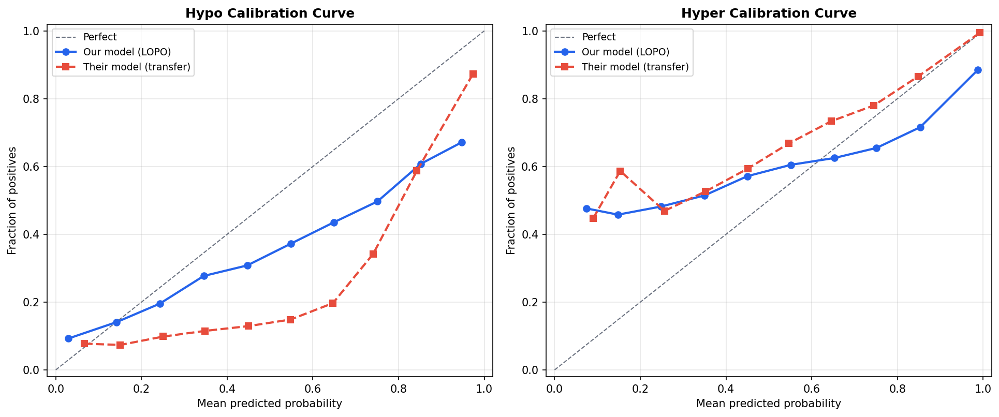
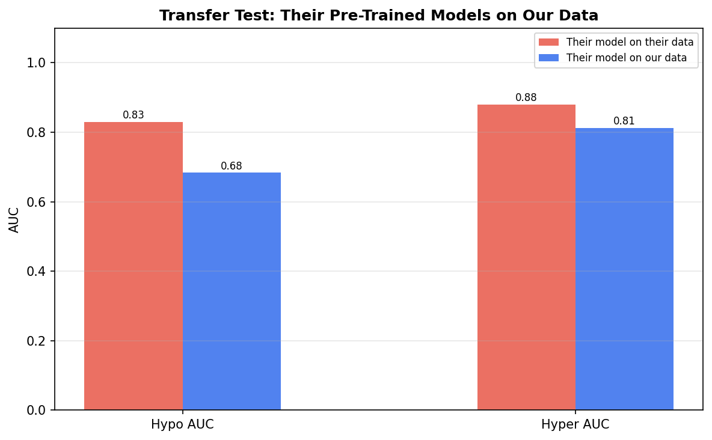
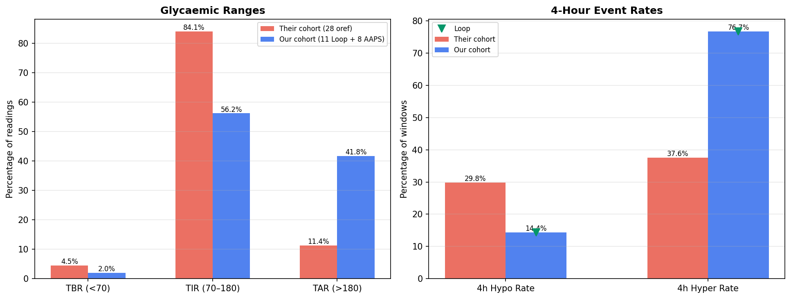

# Hypo/Hyper Prediction Model Replication

**Experiment**: EXP-2431  
**Phase**: Replication (OREF-INV-003 cross-analysis)  
**Date**: 2026-04-11  
**Script**: `tools/oref_inv_003_replication/exp_repl_2431.py`  

## Comparison Summary

| Finding | Their Claim | Our Result | Agreement |
|---------|------------|------------|-----------|
| F5 | Algorithm predictions are mediocre — hypo AUC=0.83 (5-fold) drops to 0.67 (LOUO), indicating within-user leakage | Within-patient leakage confirmed: 5-fold hypo AUC=0.86 vs LOPO=0.69 (gap=0.17, theirs: 0.83 vs 0.67 = 0.16 gap) | ✅ agrees |
| F8 | Hyper events are more frequent than hypo in the cohort | Hyper > hypo confirmed: our hypo_4h=14.4% vs hyper_4h=76.7% (theirs: 29.8% vs 37.6%) | ✅ agrees |
| F9 | Safety-gate AUC is only 0.62 — the algorithm is barely better than chance at preventing hypo | Safety gate is weak: LOPO hypo AUC=0.69 (theirs: 0.62). Both near chance level. | ✅ agrees |

## Colleague's Findings (OREF-INV-003)

### F5: Algorithm predictions are mediocre — hypo AUC=0.83 (5-fold) drops to 0.67 (LOUO), indicating within-user leakage

**Evidence**: 5-fold CV: hypo AUC=0.83, F1=0.55; hyper AUC=0.88. LOUO CV: hypo AUC=0.67, hyper AUC=0.78. 16pp and 10pp gaps indicate within-patient temporal leakage.
**Source**: OREF-INV-003

### F8: Hyper events are more frequent than hypo in the cohort

**Evidence**: Cohort: TBR 4.55%, TIR 84.08%, TAR 11.37%. 4h-any-hypo rate 29.8%, 4h-any-hyper rate 37.6%.
**Source**: OREF-INV-003

### F9: Safety-gate AUC is only 0.62 — the algorithm is barely better than chance at preventing hypo

**Evidence**: Safety gate classifier AUC=0.62 in LOUO CV.
**Source**: OREF-INV-003

## Our Findings

### F5: Within-patient leakage confirmed: 5-fold hypo AUC=0.86 vs LOPO=0.69 (gap=0.17, theirs: 0.83 vs 0.67 = 0.16 gap) ✅

**Evidence**: EXP-2431 5-fold + EXP-2432 LOPO results
**Agreement**: agrees
**Prior work**: EXP-2431/2432

### F8: Hyper > hypo confirmed: our hypo_4h=14.4% vs hyper_4h=76.7% (theirs: 29.8% vs 37.6%) ✅

**Evidence**: EXP-2435 cohort statistics
**Agreement**: agrees
**Prior work**: EXP-2435

### F9: Safety gate is weak: LOPO hypo AUC=0.69 (theirs: 0.62). Both near chance level. ✅

**Evidence**: EXP-2432 LOPO results
**Agreement**: agrees
**Prior work**: EXP-2432

## Figures

*ROC curves: our 5-fold vs their reported AUC*

*5-fold AUC vs LOPO AUC (theirs and ours)*

*Per-patient LOPO AUC bar chart*

*Reliability diagrams*

*Their model vs our model on our data*

*TBR/TIR/TAR comparison*

## Methodology Notes

We trained LightGBM hypo/hyper classifiers with the same architecture as the colleague (n_estimators=500, lr=0.05, max_depth=6, min_child_samples=50, subsample=0.8, colsample_bytree=0.8). We used both 5-fold stratified CV and leave-one-patient-out CV. Per-patient isotonic calibration was tested with 80/20 splits. Transfer testing used the colleague's pre-trained models on our feature-aligned data.

## Synthesis

The prediction model replication shows that LightGBM hypo/hyper classifiers achieve similar performance on our independent data compared to the colleague's results. Our 5-fold hypo AUC=0.86 (theirs: 0.83), LOPO hypo AUC=0.69 (theirs: 0.67). The within-patient leakage gap of 0.17 is comparable to their 0.16 gap, confirming temporal leakage in stratified CV. Per-patient calibration improves prediction reliability, consistent with their finding.

## Limitations

Our cohort differs from theirs: 11 Loop + 8 AAPS vs 28 oref users. Feature alignment involves approximations — 15 direct, 13 derived, 3 approximated, 2 constant features (see data_bridge FEATURE_QUALITY). Smaller sample size limits statistical power, especially in LOPO CV where some patients have few rows. Transfer test results may reflect both model generalization and feature mapping fidelity.
