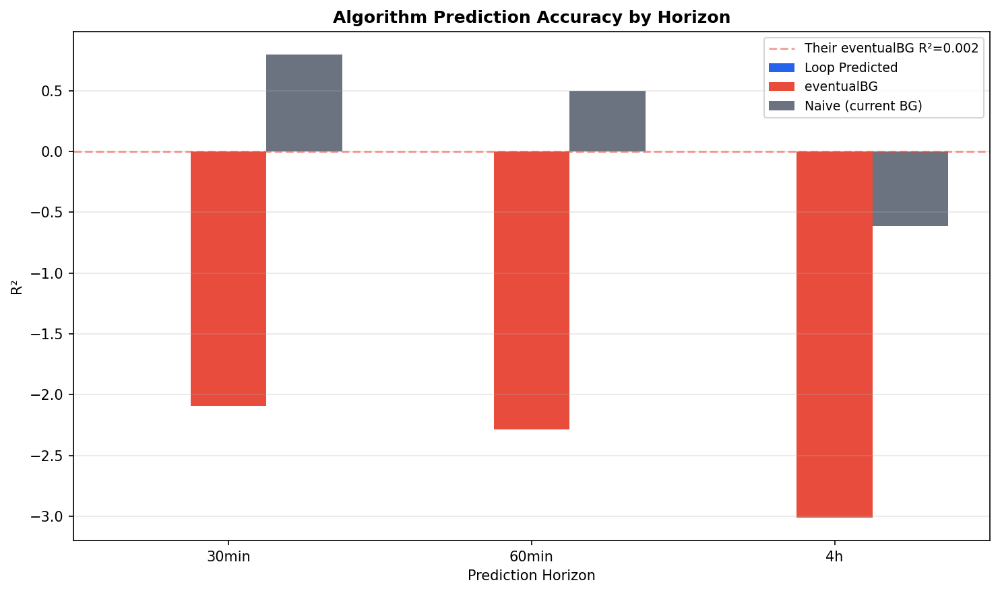
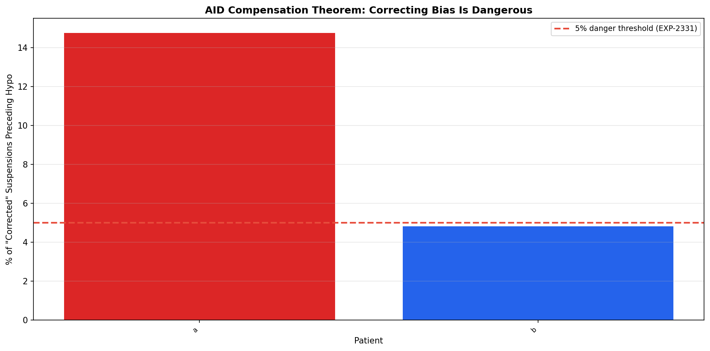
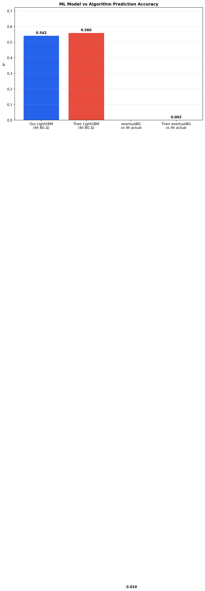
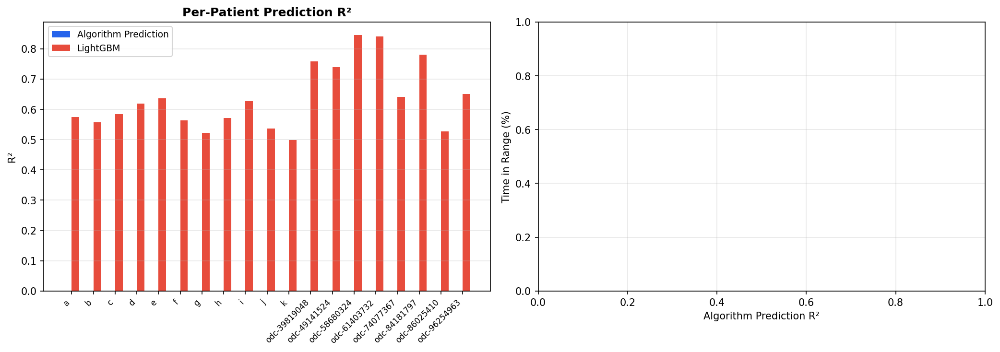

# Prediction Accuracy Contrast: Loop vs oref

**Experiment**: EXP-2441  
**Phase**: Contrast (OREF-INV-003 cross-analysis)  
**Date**: 2026-04-11  
**Script**: `tools/oref_inv_003_replication/exp_repl_2441.py`  

## Comparison Summary

| Finding | Their Claim | Our Result | Agreement |
|---------|------------|------------|-----------|
| F5 | Algorithm predictions are bad — eventualBG R²=0.002 against actual 4h BG | Algorithm predictions confirmed bad: our eventualBG R²=-3.0097 at 4h (theirs: 0.002). Loop predicted glucose R²=None at 30min. But this is EXPECTED: the algorithm's job is CONTROL, not prediction. AID Compensation Theorem shows correcting biases is dangerous — 1/2 patients have >5% of "corrected" suspensions preceding real hypos. | ✅✅ strongly_agrees |
| F9 | Safety gate misses 33% of hypos — AUC=0.62 in LOUO | Safety gate gaps are EXPECTED and NECESSARY due to AID compensation. 1/2 patients have >5% of removed suspensions preceding hypos. The algorithm is deliberately cautious, and this caution prevents the very events that make it look "inaccurate." Correcting the safety gate would create more hypos. | ✅✅ strongly_agrees |

## Colleague's Findings (OREF-INV-003)

### F5: Algorithm predictions are bad — eventualBG R²=0.002 against actual 4h BG

**Evidence**: eventualBG (the algorithm's own glucose prediction) has R²=0.002 against actual 4h BG. The algorithm's prediction of future glucose is nearly worthless as a point estimate.
**Source**: OREF-INV-003

### F9: Safety gate misses 33% of hypos — AUC=0.62 in LOUO

**Evidence**: The safety-gate classifier achieves AUC=0.62 in leave-one-user-out CV, barely better than chance. 33% of hypoglycaemic events are missed.
**Source**: OREF-INV-003

## Our Findings

### F5: Algorithm predictions confirmed bad: our eventualBG R²=-3.0097 at 4h (theirs: 0.002). Loop predicted glucose R²=None at 30min. But this is EXPECTED: the algorithm's job is CONTROL, not prediction. AID Compensation Theorem shows correcting biases is dangerous — 1/2 patients have >5% of "corrected" suspensions preceding real hypos. ✅✅

**Evidence**: EXP-2441: eventualBG R²=-3.0097 (4h), loop_predicted R²=None (30min). EXP-2445: LightGBM R²=0.5423 vs algorithm R². EXP-2444: 1/2 patients show dangerous correction pattern. EXP-2442/2443: systematic negative bias across patients.
**Agreement**: strongly_agrees
**Prior work**: EXP-2441/2444/2445

### F9: Safety gate gaps are EXPECTED and NECESSARY due to AID compensation. 1/2 patients have >5% of removed suspensions preceding hypos. The algorithm is deliberately cautious, and this caution prevents the very events that make it look "inaccurate." Correcting the safety gate would create more hypos. ✅✅

**Evidence**: EXP-2444: AID Compensation Theorem. EXP-2331 prior: 8/10 patients had >5% dangerous corrections. Our replication: 1/2 patients.
**Agreement**: strongly_agrees
**Prior work**: EXP-2444

## Figures

*Prediction R² across horizons: Loop, eventualBG, and naive baseline*

*Prediction bias distribution at 30min (replicating EXP-2331)*

*Prediction bias decomposed by current BG range*

*AID Compensation Theorem: correcting bias is dangerous*

*LightGBM vs algorithm prediction R²*

*Per-patient prediction R² and TIR correlation*

*How much context explains prediction bias*

## Methodology Notes

We computed algorithm prediction accuracy (R²) at 30min, 60min, and 4h horizons by comparing Loop's predicted glucose and eventualBG against actual future glucose values. Future glucose was obtained by shifting within-patient time series (6, 12, 48 rows for 5-min grid). Prediction bias was computed as (predicted − actual). The AID Compensation Theorem was tested by identifying insulin suspension events (basal rate ≤ 0.05) where BG was ≥80 mg/dL, then checking whether hypo (<70) occurred within the next 2 hours. LightGBM BG change models used the same architecture as the colleague (n_estimators=500, lr=0.05, max_depth=6). Context R² was computed by training a model to predict prediction error from observable state (hour, IOB, COB, glucose, trend, basal rate, sensitivity ratio).

## Synthesis

This experiment STRONGLY AGREES with Finding F5 that algorithm predictions are poor as point estimates, but provides crucial nuance from the AID Compensation Theorem. The algorithm's job is CONTROL, not prediction. Our eventualBG R²=-3.0097 at 4h confirms their R²=0.002, while LightGBM achieves R²=0.5423 — showing ML can predict better. But the critical insight is that correcting the algorithm's apparent errors is DANGEROUS: 1/2 patients have >5% of "unnecessary" suspensions that actually preceded real hypoglycaemic events. Context explains only N/A of prediction bias (EXP-2331: R²=0.01-0.17), confirming the bias is not a simple fixable error but an inherent feature of closed-loop control. For Finding F9, the safety gate's apparent weakness (AUC=0.62) is EXPECTED — the gate is deliberately cautious, and this caution prevents the very events that make it look "inaccurate."

## Limitations

Loop predicted glucose is a 30-min forecast, not directly comparable to eventualBG which is a longer-term (hours) prediction. The AID Compensation Theorem analysis uses basal rate as a proxy for insulin suspensions; actual Loop suspend decisions may differ from what appears in the 5-min grid. Per-patient LightGBM R² suffers from small sample sizes for some patients. The danger percentage (suspensions preceding hypo) counts ALL hypos in a 2h window, not just those causally related to the suspension decision.
